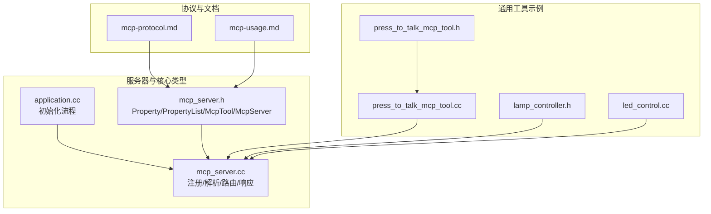
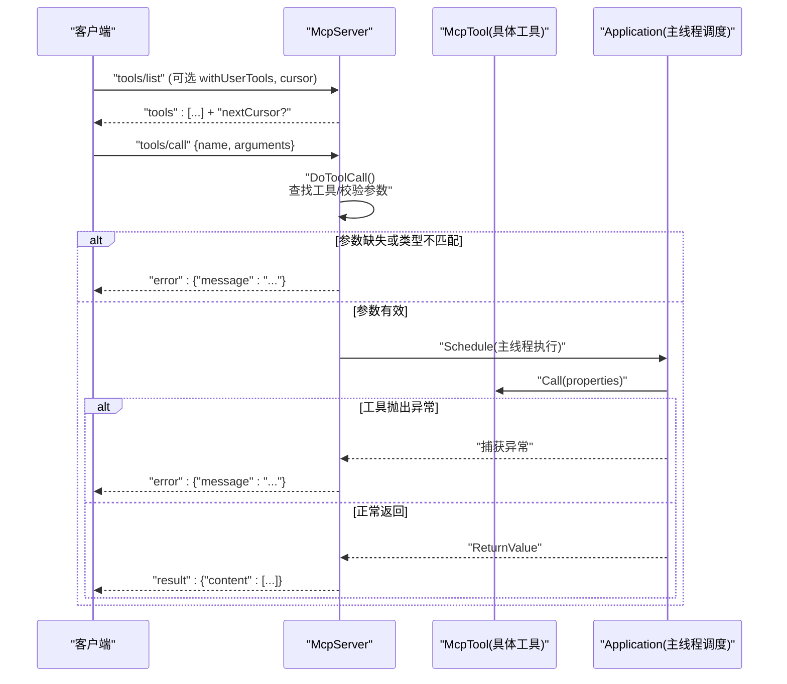
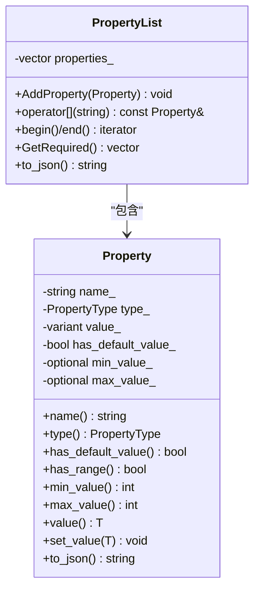
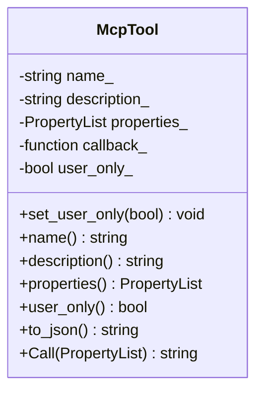
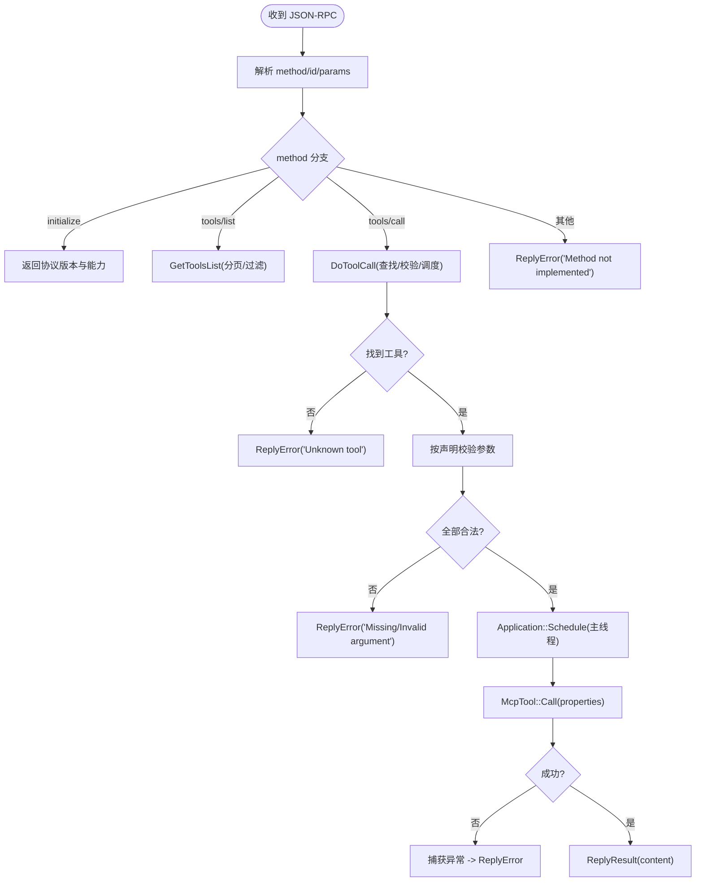

# 工具设计模式

<cite>
**本文引用的文件**   
- [mcp_server.h](file://main/mcp_server.h)
- [mcp_server.cc](file://main/mcp_server.cc)
- [press_to_talk_mcp_tool.h](file://main/boards/common/press_to_talk_mcp_tool.h)
- [press_to_talk_mcp_tool.cc](file://main/boards/common/press_to_talk_mcp_tool.cc)
- [lamp_controller.h](file://main/boards/common/lamp_controller.h)
- [led_control.cc](file://main/boards/df-k10/led_control.cc)
- [application.cc](file://main/application.cc)
- [mcp-protocol.md](file://docs/mcp-protocol.md)
- [mcp-usage.md](file://docs/mcp-usage.md)
</cite>

## 目录
1. [简介](#简介)
2. [项目结构](#项目结构)
3. [核心组件](#核心组件)
4. [架构总览](#架构总览)
5. [详细组件分析](#详细组件分析)
6. [依赖关系分析](#依赖关系分析)
7. [性能与资源考量](#性能与资源考量)
8. [故障排查指南](#故障排查指南)
9. [结论](#结论)
10. [附录：反模式与最佳实践](#附录反模式与最佳实践)

## 简介
本文件围绕 MCP（Model Context Protocol）工具的设计原则与实践，结合仓库中的实现，系统阐述以下主题：
- 单一职责、参数校验、错误处理等设计模式
- 同步工具、异步工具、流式工具的实现模式
- 工具组合与复用策略（工具链、中间件模式）
- 反模式与常见陷阱
- 工具文档自动生成与测试框架使用方法

## 项目结构
MCP 工具体系由“协议层 + 服务器调度层 + 业务工具”三层构成。协议层定义工具描述与调用契约；服务器负责注册、发现、参数校验与分发；业务工具以最小职责暴露设备能力。

图表来源
- [mcp_server.h:1-345](file://main/mcp_server.h#L1-L345)
- [mcp_server.cc:1-561](file://main/mcp_server.cc#L1-L561)
- [press_to_talk_mcp_tool.h:1-29](file://main/boards/common/press_to_talk_mcp_tool.h#L1-L29)
- [press_to_talk_mcp_tool.cc:1-57](file://main/boards/common/press_to_talk_mcp_tool.cc#L1-L57)
- [lamp_controller.h:1-49](file://main/boards/common/lamp_controller.h#L1-L49)
- [led_control.cc:1-125](file://main/boards/df-k10/led_control.cc#L1-L125)
- [application.cc:90-110](file://main/application.cc#L90-L110)
- [mcp-protocol.md:200-280](file://docs/mcp-protocol.md#L200-L280)
- [mcp-usage.md:1-120](file://docs/mcp-usage.md#L1-L120)

章节来源
- [mcp_server.h:1-345](file://main/mcp_server.h#L1-L345)
- [mcp_server.cc:1-561](file://main/mcp_server.cc#L1-L561)
- [application.cc:90-110](file://main/application.cc#L90-L110)
- [mcp-protocol.md:200-280](file://docs/mcp-protocol.md#L200-L280)
- [mcp-usage.md:1-120](file://docs/mcp-usage.md#L1-L120)

## 核心组件
- Property / PropertyList：声明工具输入参数的名称、类型、默认值与取值范围，并生成 JSON Schema 片段。支持整数范围校验与必填项推导。
- McpTool：封装工具元数据（名称、描述、参数）、用户可见性标记（仅用户可见），以及统一的结果序列化逻辑。
- McpServer：单例服务器，负责工具注册、列表分页返回、参数校验、主线程调度执行、结果与错误消息的 JSON-RPC 封装与发送。

关键要点
- 返回值使用多态容器，支持布尔、整型、字符串、JSON 对象与图片内容。
- 工具列表支持 nextCursor 分页，避免单次响应过大。
- 工具执行通过 Application::Schedule 在主线程安全地运行，避免跨线程访问硬件或 UI。

章节来源
- [mcp_server.h:52-206](file://main/mcp_server.h#L52-L206)
- [mcp_server.h:208-312](file://main/mcp_server.h#L208-L312)
- [mcp_server.cc:300-319](file://main/mcp_server.cc#L300-L319)
- [mcp_server.cc:452-506](file://main/mcp_server.cc#L452-L506)
- [mcp_server.cc:508-561](file://main/mcp_server.cc#L508-L561)

## 架构总览
下图展示从客户端到工具回调的完整调用链路，包括参数校验、异常捕获与结果回传。

图表来源
- [mcp_server.cc:350-433](file://main/mcp_server.cc#L350-L433)
- [mcp_server.cc:452-506](file://main/mcp_server.cc#L452-L506)
- [mcp_server.cc:508-561](file://main/mcp_server.cc#L508-L561)

## 详细组件分析

### 参数与校验模型（Property/PropertyList）
- 类型系统：布尔、整型、字符串三种基础类型。
- 默认值与必填：未提供默认值的属性视为必填；GetRequired() 可导出必填字段集合。
- 范围约束：整型支持 minimum/maximum，设置时进行越界检查并抛异常。
- JSON 输出：to_json() 生成符合 schema 风格的片段，供工具清单序列化使用。

图表来源
- [mcp_server.h:52-206](file://main/mcp_server.h#L52-L206)

章节来源
- [mcp_server.h:52-206](file://main/mcp_server.h#L52-L206)

### 工具封装与执行（McpTool）
- 元数据：名称、描述、参数列表、是否仅用户可见。
- 执行入口：Call(properties) 将 ReturnValue 统一序列化为 content 数组（文本或图片）。
- 用户可见性：user_only=true 的工具在 tools/list 中默认隐藏，需显式请求。

图表来源
- [mcp_server.h:208-312](file://main/mcp_server.h#L208-L312)

章节来源
- [mcp_server.h:208-312](file://main/mcp_server.h#L208-L312)

### 服务器路由与调度（McpServer）
- 注册接口：AddTool/AddUserOnlyTool，内部去重并记录日志。
- 工具列表：GetToolsList 支持分页与过滤用户专属工具。
- 调用路由：ParseMessage -> DoToolCall -> Application::Schedule -> McpTool::Call。
- 错误处理：参数校验失败、未知工具、运行时异常均通过 ReplyError 返回。

图表来源
- [mcp_server.cc:350-433](file://main/mcp_server.cc#L350-L433)
- [mcp_server.cc:452-506](file://main/mcp_server.cc#L452-L506)
- [mcp_server.cc:508-561](file://main/mcp_server.cc#L508-L561)

章节来源
- [mcp_server.cc:300-319](file://main/mcp_server.cc#L300-L319)
- [mcp_server.cc:350-433](file://main/mcp_server.cc#L350-L433)
- [mcp_server.cc:452-506](file://main/mcp_server.cc#L452-L506)
- [mcp_server.cc:508-561](file://main/mcp_server.cc#L508-L561)

### 典型工具实现模式

#### 同步工具（IO 轻量、快速完成）
- 示例：LED 亮度控制、灯开关、按键说话模式切换。
- 特点：直接操作硬件或内存状态，立即返回。
- 参考路径
  - [lamp_controller.h:28-44](file://main/boards/common/lamp_controller.h#L28-L44)
  - [led_control.cc:26-48](file://main/boards/df-k10/led_control.cc#L26-L48)
  - [press_to_talk_mcp_tool.cc:16-29](file://main/boards/common/press_to_talk_mcp_tool.cc#L16-L29)

章节来源
- [lamp_controller.h:28-44](file://main/boards/common/lamp_controller.h#L28-L44)
- [led_control.cc:26-48](file://main/boards/df-k10/led_control.cc#L26-L48)
- [press_to_talk_mcp_tool.cc:16-29](file://main/boards/common/press_to_talk_mcp_tool.cc#L16-L29)

#### 异步工具（耗时任务，后台执行）
- 示例：重启、固件升级、屏幕截图上传。
- 特点：通过 Application::Schedule 提交任务，避免阻塞网络/IO 线程；必要时降低优先级。
- 参考路径
  - [mcp_server.cc:138-169](file://main/mcp_server.cc#L138-L169)
  - [mcp_server.cc:190-242](file://main/mcp_server.cc#L190-L242)

章节来源
- [mcp_server.cc:138-169](file://main/mcp_server.cc#L138-L169)
- [mcp_server.cc:190-242](file://main/mcp_server.cc#L190-L242)

#### 流式工具（分块/增量输出）
- 现状：当前实现以一次性返回为主，未内置流式传输机制。
- 建议模式：
  - 服务端侧：将长任务拆分为多次 tools/call 或采用自定义通知通道推送进度。
  - 客户端侧：维护会话上下文，聚合多次结果形成最终视图。
- 注意：如需原生流式，需在协议扩展点与服务器端增加流式帧处理逻辑。

[本节为概念性说明，无直接代码映射]

### 工具组合与复用策略

#### 工具链设计（顺序编排）
- 思路：将复杂流程拆分为多个原子工具，由上层编排器（如应用层或 AI 代理）按序调用。
- 示例：先查询设备状态，再根据状态调整音量或亮度。
- 参考路径
  - [mcp_server.cc:45-64](file://main/mcp_server.cc#L45-L64)

章节来源
- [mcp_server.cc:45-64](file://main/mcp_server.cc#L45-L64)

#### 中间件模式（横切关注点）
- 目标：在工具执行前后注入通用逻辑（鉴权、限流、审计、重试、降级）。
- 建议实现：
  - 在 McpServer::DoToolCall 前后包装钩子函数，对每个工具执行统一的预处理与后处理。
  - 针对用户专属工具增加权限校验中间件。
  - 针对 IO 密集工具增加超时与重试中间件。
- 当前状态：未见内建中间件，可在现有路由处扩展。

[本节为概念性说明，无直接代码映射]

#### 工具注册组织
- 公共工具：McpServer::AddCommonTools 优先注册，利用提示缓存提升响应速度。
- 用户专属工具：McpServer::AddUserOnlyTools 注册，默认对 AI 不可见。
- 板级工具：各 Board 的 InitializeTools 中按需添加，保持设备差异解耦。
- 参考路径
  - [mcp_server.cc:33-126](file://main/mcp_server.cc#L33-L126)
  - [mcp_server.cc:128-298](file://main/mcp_server.cc#L128-L298)
  - [application.cc:98](file://main/application.cc#L98)

章节来源
- [mcp_server.cc:33-126](file://main/mcp_server.cc#L33-L126)
- [mcp_server.cc:128-298](file://main/mcp_server.cc#L128-L298)
- [application.cc:98](file://main/application.cc#L98)

## 依赖关系分析
- 服务器与工具：McpServer 持有 McpTool 指针向量，按名称查找并执行。
- 工具与硬件：工具回调通过 Board/Display/Camera/Network 等抽象访问硬件能力。
- 文档与实现：mcp-protocol.md 与 mcp-usage.md 作为契约文档，指导 AddTool/AddUserOnlyTool 的使用。

图表来源
- [mcp_server.h:314-342](file://main/mcp_server.h#L314-L342)
- [mcp_server.cc:300-319](file://main/mcp_server.cc#L300-L319)
- [mcp-protocol.md:200-280](file://docs/mcp-protocol.md#L200-L280)
- [mcp-usage.md:1-120](file://docs/mcp-usage.md#L1-L120)

章节来源
- [mcp_server.h:314-342](file://main/mcp_server.h#L314-L342)
- [mcp_server.cc:300-319](file://main/mcp_server.cc#L300-L319)
- [mcp-protocol.md:200-280](file://docs/mcp-protocol.md#L200-L280)
- [mcp-usage.md:1-120](file://docs/mcp-usage.md#L1-L120)

## 性能与资源考量
- 工具排序优化：常用工具置于列表前部，利于提示缓存命中，减少首包延迟。
- 列表分页：tools/list 限制最大负载大小，通过 nextCursor 分页拉取，避免单次响应过大。
- 主线程执行：所有工具回调通过 Application::Schedule 在主线程执行，避免跨线程访问共享资源。
- 优先级管理：部分耗时任务（如拍照）主动降低优先级，减少对交互的影响。
- 内存分配：下载图片等大对象时注意堆分配与释放，避免碎片化。

章节来源
- [mcp_server.cc:33-40](file://main/mcp_server.cc#L33-L40)
- [mcp_server.cc:452-506](file://main/mcp_server.cc#L452-L506)
- [mcp_server.cc:550-561](file://main/mcp_server.cc#L550-L561)
- [mcp_server.cc:111-121](file://main/mcp_server.cc#L111-L121)
- [mcp_server.cc:260-276](file://main/mcp_server.cc#L260-L276)

## 故障排查指南
- 参数缺失或类型不匹配：检查 Property 声明与传入 JSON 字段名/类型一致性。
- 未知工具：确认工具名称拼写与注册位置（公共/用户专属）。
- 运行时异常：工具回调中抛出的异常会被捕获并转为错误消息，定位对应工具回调。
- 网络/IO 失败：查看 HTTP 状态码与异常信息，确认 URL、Token、证书与网络连通性。
- 列表过大：若出现 payload 超限错误，检查工具数量与描述长度，考虑拆分或精简描述。

章节来源
- [mcp_server.cc:412-432](file://main/mcp_server.cc#L412-L432)
- [mcp_server.cc:514-518](file://main/mcp_server.cc#L514-L518)
- [mcp_server.cc:544-548](file://main/mcp_server.cc#L544-L548)
- [mcp_server.cc:235-241](file://main/mcp_server.cc#L235-L241)
- [mcp_server.cc:252-276](file://main/mcp_server.cc#L252-L276)
- [mcp_server.cc:492-497](file://main/mcp_server.cc#L492-L497)

## 结论
本项目提供了完善的 MCP 工具基础设施：清晰的参数与返回模型、安全的调度与错误处理、可扩展的注册机制与分页能力。在此基础上，可通过工具链与中间件模式进一步构建健壮、可观测、可复用的工具生态。对于需要流式输出的场景，建议在协议与服务器层引入流式帧处理，配合客户端聚合渲染。

## 附录：反模式与最佳实践

### 反模式与常见陷阱
- 在工具回调中进行阻塞式 IO：应使用异步或降优先级策略，避免阻塞主线程。
- 忽略参数校验：务必使用 Property 的范围与必填约束，并在回调中二次校验。
- 工具命名冲突：重复注册会被忽略并告警，需确保全局唯一。
- 用户专属工具误暴露：仅用户可见工具不应被 AI 自动调用，需严格区分 AddTool 与 AddUserOnlyTool。
- 大对象一次性返回：尽量分片或采用流式，避免超出响应大小限制。

章节来源
- [mcp_server.cc:300-309](file://main/mcp_server.cc#L300-L309)
- [mcp_server.cc:452-506](file://main/mcp_server.cc#L452-L506)
- [mcp_server.cc:128-169](file://main/mcp_server.cc#L128-L169)

### 最佳实践清单
- 单一职责：每个工具只做一件事，描述清晰、参数最小化。
- 强类型与范围约束：充分利用 Property 的类型与范围能力。
- 明确可见性：AI 可调 vs 仅用户可调，严格区分。
- 错误语义化：抛出具体异常信息，便于前端呈现与排障。
- 可观测性：关键路径打日志，记录入参、出参与耗时。
- 可测试性：将工具回调与硬件解耦，便于 Mock 与单元测试。

[本节为通用指导，无直接代码映射]

### 工具文档自动生成与测试框架使用方法
- 文档自动生成：
  - 基于 PropertyList.to_json() 与 McpTool::to_json() 的输出，可自动生成工具清单与参数说明。
  - 结合 docs/mcp-usage.md 与 docs/mcp-protocol.md 的约定，生成面向开发者的 API 参考。
- 测试框架建议：
  - 构造 PropertyList 模拟不同参数组合，覆盖必填、默认值、范围边界。
  - 使用桩对象替换 Board/Display/Camera/Network，验证工具行为与错误路径。
  - 针对异步工具，验证其通过 Application::Schedule 提交并正确返回。

章节来源
- [mcp_server.h:191-206](file://main/mcp_server.h#L191-L206)
- [mcp_server.h:232-270](file://main/mcp_server.h#L232-L270)
- [mcp-usage.md:1-120](file://docs/mcp-usage.md#L1-L120)
- [mcp-protocol.md:200-280](file://docs/mcp-protocol.md#L200-L280)