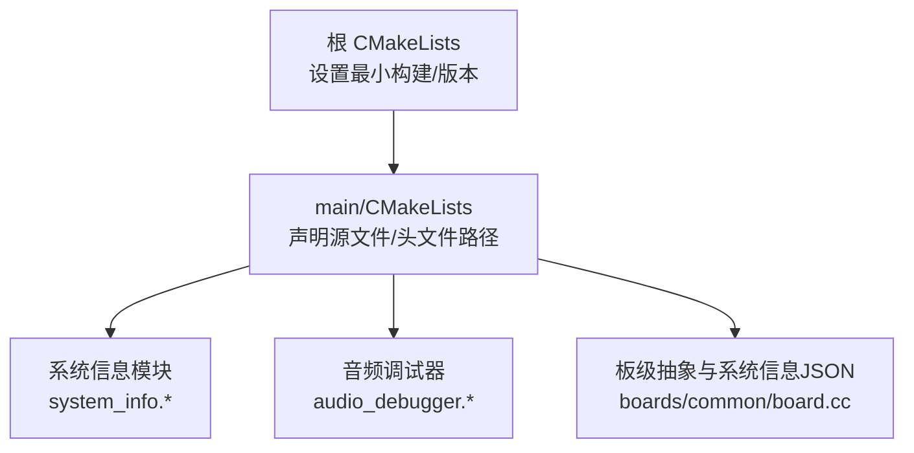
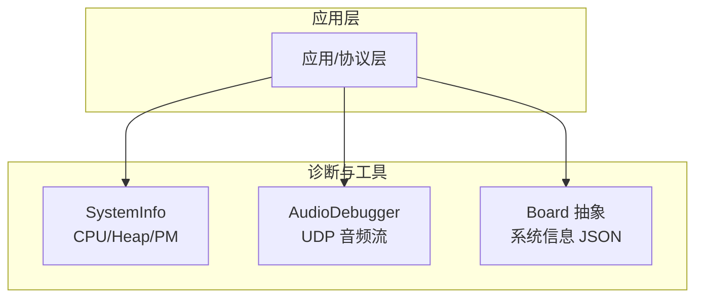
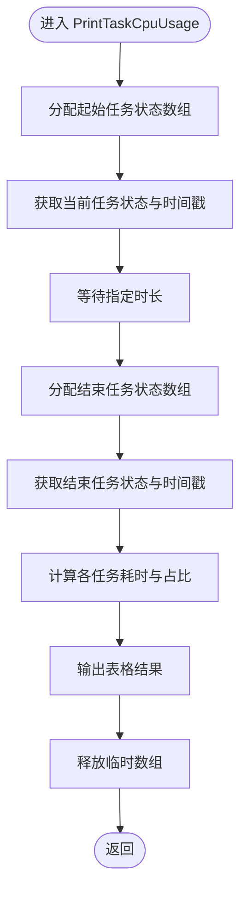
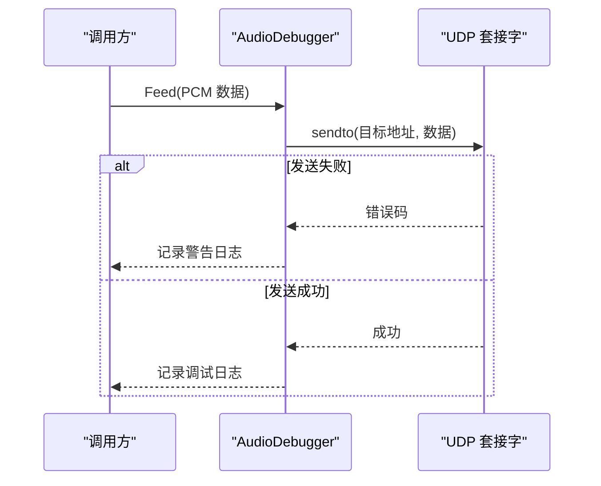
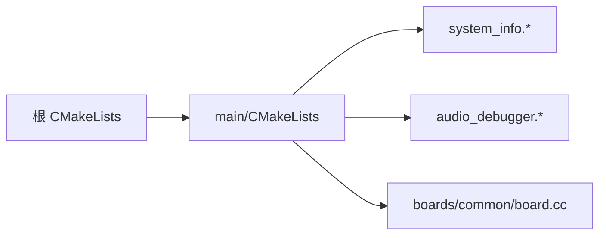

# 测试与调试

<cite>
**本文引用的文件**   
- [CMakeLists.txt](file://CMakeLists.txt)
- [main/CMakeLists.txt](file://main/CMakeLists.txt)
- [README.md](file://README.md)
- [docs/code_style.md](file://docs/code_style.md)
- [main/system_info.h](file://main/system_info.h)
- [main/system_info.cc](file://main/system_info.cc)
- [main/boards/common/board.cc](file://main/boards/common/board.cc)
- [main/audio/processors/audio_debugger.h](file://main/audio/processors/audio_debugger.h)
- [main/audio/processors/audio_debugger.cc](file://main/audio/processors/audio_debugger.cc)
</cite>

## 目录
1. [简介](#简介)
2. [项目结构](#项目结构)
3. [核心组件](#核心组件)
4. [架构总览](#架构总览)
5. [详细组件分析](#详细组件分析)
6. [依赖分析](#依赖分析)
7. [性能考虑](#性能考虑)
8. [故障排查指南](#故障排查指南)
9. [结论](#结论)
10. [附录](#附录)

## 简介
本指南面向 MCP 工具（设备侧能力扩展）的测试与调试，覆盖单元测试、集成测试、端到端测试、压力测试与兼容性测试策略；并提供日志输出、性能分析、内存泄漏检测等调试技巧。同时给出常见问题定位与修复建议，以及自动化测试框架集成方法。

## 项目结构
本项目基于 ESP-IDF 构建，使用 CMake 组织源码与编译选项。根级 CMakeLists 定义最小化构建与工程版本，main/CMakeLists 汇总业务源文件、包含路径，并按板型配置动态添加公共板级实现与可选功能。

图表来源
- [CMakeLists.txt:1-14](file://CMakeLists.txt#L1-L14)
- [main/CMakeLists.txt:1-40](file://main/CMakeLists.txt#L1-L40)

章节来源
- [CMakeLists.txt:1-14](file://CMakeLists.txt#L1-L14)
- [main/CMakeLists.txt:1-40](file://main/CMakeLists.txt#L1-L40)

## 核心组件
- 系统信息与诊断接口：提供任务 CPU 占用统计、任务列表、堆栈统计、PM 锁信息等，便于在测试与调试中快速定位性能与稳定性问题。
- 音频调试器：通过 UDP 将 PCM 数据发送到外部监听服务，用于音频链路质量与延迟验证。
- 板级抽象与系统信息 JSON：统一对外暴露设备状态（如网络、芯片温度等），可用于端到端校验与兼容性回归。

章节来源
- [main/system_info.h:1-23](file://main/system_info.h#L1-L23)
- [main/system_info.cc:59-158](file://main/system_info.cc#L59-L158)
- [main/audio/processors/audio_debugger.h:1-22](file://main/audio/processors/audio_debugger.h#L1-L22)
- [main/audio/processors/audio_debugger.cc:37-68](file://main/audio/processors/audio_debugger.cc#L37-L68)
- [main/boards/common/board.cc:70-95](file://main/boards/common/board.cc#L70-L95)

## 架构总览
下图展示与测试/调试相关的子系统关系：应用层通过系统信息接口获取运行时指标；音频调试器作为旁路通道输出原始音频；板级抽象聚合系统信息并生成 JSON，供上层或远端服务消费。

图表来源
- [main/system_info.h:1-23](file://main/system_info.h#L1-L23)
- [main/system_info.cc:59-158](file://main/system_info.cc#L59-L158)
- [main/audio/processors/audio_debugger.h:1-22](file://main/audio/processors/audio_debugger.h#L1-L22)
- [main/audio/processors/audio_debugger.cc:37-68](file://main/audio/processors/audio_debugger.cc#L37-L68)
- [main/boards/common/board.cc:70-95](file://main/boards/common/board.cc#L70-L95)

## 详细组件分析

### 系统信息组件（SystemInfo）
- 职责
  - 采集任务运行时间并计算 CPU 占用百分比，辅助识别热点任务与调度异常。
  - 打印任务列表与堆状态，辅助内存与任务健康度检查。
  - 导出 PM 锁信息，辅助功耗与电源管理问题定位。
- 关键流程（任务 CPU 占用）

图表来源
- [main/system_info.cc:59-158](file://main/system_info.cc#L59-L158)

章节来源
- [main/system_info.h:1-23](file://main/system_info.h#L1-L23)
- [main/system_info.cc:59-158](file://main/system_info.cc#L59-L158)

### 音频调试器（AudioDebugger）
- 职责
  - 在启用配置时创建 UDP Socket，将 PCM 数据发送至配置的远程地址，便于离线回放与频谱分析。
- 关键流程（发送音频帧）

图表来源
- [main/audio/processors/audio_debugger.h:1-22](file://main/audio/processors/audio_debugger.h#L1-L22)
- [main/audio/processors/audio_debugger.cc:37-68](file://main/audio/processors/audio_debugger.cc#L37-L68)

章节来源
- [main/audio/processors/audio_debugger.h:1-22](file://main/audio/processors/audio_debugger.h#L1-L22)
- [main/audio/processors/audio_debugger.cc:37-68](file://main/audio/processors/audio_debugger.cc#L37-L68)

### 板级抽象与系统信息 JSON
- 职责
  - 聚合 Flash/PSRAM/堆/网络/芯片温度等信息，以 JSON 形式输出，便于端到端校验与兼容性对比。
- 典型字段（节选）
  - version、flash_size、psram_size、minimum_free_heap_size、mac_address、uuid、chip_model_name、chip_info、application、partition_table 等。

章节来源
- [main/boards/common/board.cc:70-95](file://main/boards/common/board.cc#L70-L95)

## 依赖分析
- 构建期依赖
  - 根 CMakeLists 启用最小化构建并设置工程版本。
  - main/CMakeLists 集中声明源文件与包含路径，按 CONFIG_BOARD_TYPE 动态追加板级实现。
- 运行时依赖
  - SystemInfo 依赖 FreeRTOS 任务状态 API 与 ESP-IDF 堆/PM 接口。
  - AudioDebugger 依赖系统 socket 与网络栈。
  - Board 抽象依赖具体板级实现与 cJSON 序列化库（用于 JSON）。

图表来源
- [CMakeLists.txt:1-14](file://CMakeLists.txt#L1-L14)
- [main/CMakeLists.txt:1-40](file://main/CMakeLists.txt#L1-L40)

章节来源
- [CMakeLists.txt:1-14](file://CMakeLists.txt#L1-L14)
- [main/CMakeLists.txt:1-40](file://main/CMakeLists.txt#L1-L40)

## 性能考虑
- 任务 CPU 占用采样间隔应合理设置，避免过长掩盖瞬态峰值，过短增加开销。
- 音频调试器仅在需要时启用，避免对主路径造成额外拷贝与网络抖动。
- 系统信息 JSON 序列化在大对象场景下注意内存峰值，必要时分块输出或降低频率。

[本节为通用指导，不直接分析具体文件]

## 故障排查指南
- 参数错误
  - 现象：音频调试器无法连接或发送失败。
  - 排查：确认 UDP 目标地址与端口配置正确；检查网络连通性与防火墙规则；关注发送失败时的错误码与日志级别。
  - 参考位置：[main/audio/processors/audio_debugger.cc:37-68](file://main/audio/processors/audio_debugger.cc#L37-L68)
- 运行时异常
  - 现象：任务崩溃或看门狗复位。
  - 排查：使用任务列表与 CPU 占用统计定位热点任务；检查堆最小空闲值是否持续下降；查看 PM 锁是否存在长时间持有。
  - 参考位置：[main/system_info.cc:59-158](file://main/system_info.cc#L59-L158)
- 性能瓶颈
  - 现象：语音交互卡顿或延迟升高。
  - 排查：结合任务 CPU 占用与音频调试器回放，定位编解码、网络收发或显示刷新热点；评估中断优先级与队列长度。
  - 参考位置：[main/system_info.cc:59-158](file://main/system_info.cc#L59-L158), [main/audio/processors/audio_debugger.cc:37-68](file://main/audio/processors/audio_debugger.cc#L37-L68)

章节来源
- [main/audio/processors/audio_debugger.cc:37-68](file://main/audio/processors/audio_debugger.cc#L37-L68)
- [main/system_info.cc:59-158](file://main/system_info.cc#L59-L158)

## 结论
通过系统信息接口与音频调试器，可在设备侧高效完成性能与健康度自检；配合板级系统信息 JSON，可支撑端到端与兼容性回归。建议在 CI 中集成格式化检查与基础用例，逐步完善单元与集成测试体系。

[本节为总结性内容，不直接分析具体文件]

## 附录

### 单元测试方法与断言要点
- 模拟环境搭建
  - 针对 SystemInfo 的静态接口，可通过构造不同运行态（任务数量、堆状态）来验证输出格式与边界条件。
  - 针对 AudioDebugger，可在非真机环境下通过宏开关禁用网络路径，仅验证初始化与资源清理逻辑。
- 测试用例编写
  - 输入/输出契约：明确函数返回值、日志输出关键字段、JSON 字段存在性与类型。
  - 断言验证：对 CPU 占用百分比范围、堆空闲值单调性、JSON 键集合进行断言。
- 代码风格与一致性
  - 使用 clang-format 统一风格，确保提交前格式化检查通过。
  - 参考文档安装与 IDE 集成方式，提升团队一致性。

章节来源
- [docs/code_style.md:1-66](file://docs/code_style.md#L1-L66)

### 集成测试策略
- 端到端测试
  - 通过板级系统信息 JSON 校验设备状态（网络、温度、分区表等），并与期望基线比对。
  - 参考位置：[main/boards/common/board.cc:70-95](file://main/boards/common/board.cc#L70-L95)
- 压力测试
  - 长时运行下周期性采集任务 CPU 占用与堆最小空闲值，观察趋势与拐点。
  - 参考位置：[main/system_info.cc:59-158](file://main/system_info.cc#L59-L158)
- 兼容性测试
  - 在不同板型配置下构建与运行，验证 JSON 字段一致性与必要字段完整性。
  - 参考位置：[main/CMakeLists.txt:89-120](file://main/CMakeLists.txt#L89-L120)

章节来源
- [main/boards/common/board.cc:70-95](file://main/boards/common/board.cc#L70-L95)
- [main/system_info.cc:59-158](file://main/system_info.cc#L59-L158)
- [main/CMakeLists.txt:89-120](file://main/CMakeLists.txt#L89-L120)

### 自动化测试框架集成
- 构建与格式化
  - 在 CI 中执行 clang-format 检查，拒绝不符合风格的变更。
  - 参考位置：[docs/code_style.md:1-66](file://docs/code_style.md#L1-L66)
- 工程版本与最小构建
  - 利用根 CMake 的最小构建与版本常量，稳定构建产物以便回归对比。
  - 参考位置：[CMakeLists.txt:1-14](file://CMakeLists.txt#L1-L14)

章节来源
- [docs/code_style.md:1-66](file://docs/code_style.md#L1-L66)
- [CMakeLists.txt:1-14](file://CMakeLists.txt#L1-L14)

### 常见调试技巧清单
- 日志输出
  - 使用 ESP_LOGI/ESP_LOGW/ESP_LOGD 分级输出，便于过滤与归档。
  - 音频调试器在发送失败时输出警告，成功时输出调试信息。
  - 参考位置：[main/audio/processors/audio_debugger.cc:37-68](file://main/audio/processors/audio_debugger.cc#L37-L68)
- 性能分析
  - 使用任务 CPU 占用统计与任务列表，定位热点与阻塞点。
  - 参考位置：[main/system_info.cc:59-158](file://main/system_info.cc#L59-L158)
- 内存泄漏检测
  - 监控最小空闲堆大小变化趋势，结合任务列表判断是否有任务未正常销毁。
  - 参考位置：[main/system_info.cc:144-154](file://main/system_info.cc#L144-L154)

章节来源
- [main/audio/processors/audio_debugger.cc:37-68](file://main/audio/processors/audio_debugger.cc#L37-L68)
- [main/system_info.cc:59-158](file://main/system_info.cc#L59-L158)