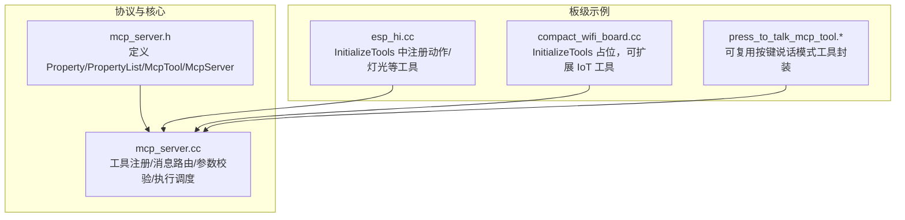
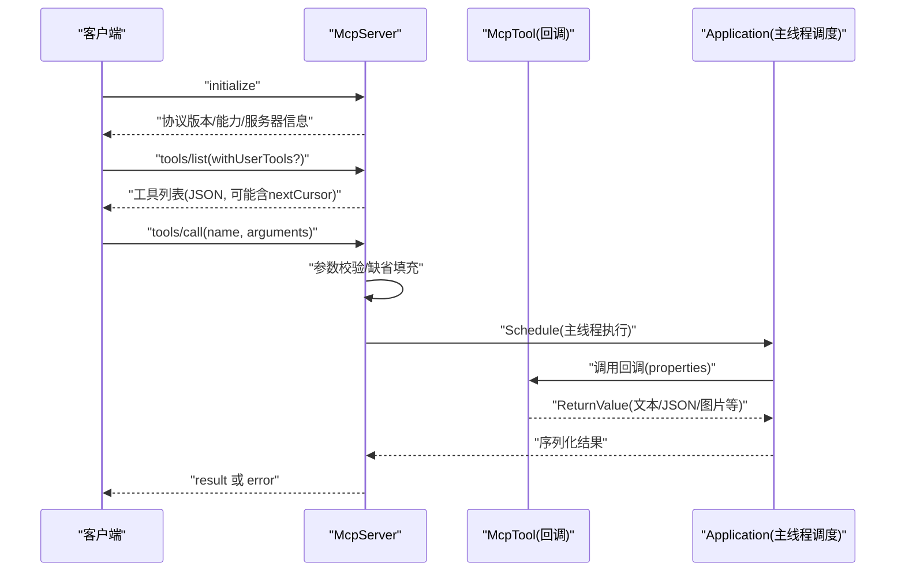
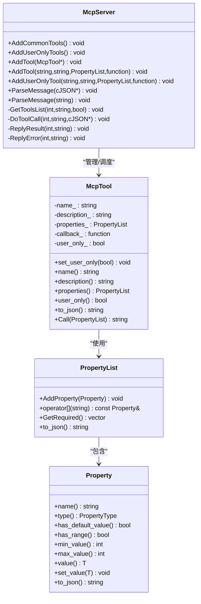
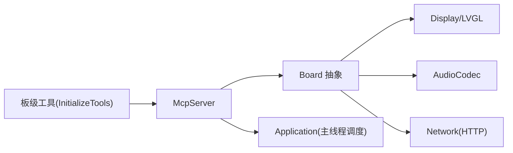
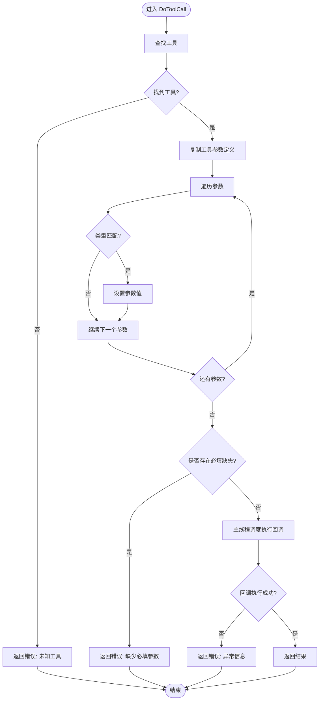

# 自定义工具开发

<cite>
**本文引用的文件**   
- [main/mcp_server.h](file://main/mcp_server.h)
- [main/mcp_server.cc](file://main/mcp_server.cc)
- [main/boards/common/press_to_talk_mcp_tool.h](file://main/boards/common/press_to_talk_mcp_tool.h)
- [main/boards/common/press_to_talk_mcp_tool.cc](file://main/boards/common/press_to_talk_mcp_tool.cc)
- [main/boards/esp-hi/esp_hi.cc](file://main/boards/esp-hi/esp_hi.cc)
- [main/boards/bread-compact-wifi/compact_wifi_board.cc](file://main/boards/bread-compact-wifi/compact_wifi_board.cc)
</cite>

## 目录
1. [简介](#简介)
2. [项目结构](#项目结构)
3. [核心组件](#核心组件)
4. [架构总览](#架构总览)
5. [详细组件分析](#详细组件分析)
6. [依赖关系分析](#依赖关系分析)
7. [性能考虑](#性能考虑)
8. [故障排查指南](#故障排查指南)
9. [结论](#结论)
10. [附录：完整开发流程与案例](#附录完整开发流程与案例)

## 简介
本指南面向希望在 xiaozhi-esp32 项目中创建自定义 MCP（Model Context Protocol）工具的开发者。文档将系统讲解如何基于现有框架扩展工具能力，包括：
- 工具类继承与注册方式
- 回调函数实现与返回值类型
- 参数定义与校验（Property 类型、默认值、取值范围）
- 用户专用工具权限控制
- 从设计到测试部署的完整流程
- 错误处理、日志记录与性能优化最佳实践
- 多个实际案例展示不同类型工具的开发方法

## 项目结构
本项目采用“通用协议层 + 板级定制”的分层组织方式。MCP 服务器位于 main 目录，提供统一的工具注册、参数解析、调用调度与结果返回机制；各板级目录通过覆写 InitializeTools 钩子注入板级专属工具。

图表来源
- [main/mcp_server.h:1-345](file://main/mcp_server.h#L1-L345)
- [main/mcp_server.cc:1-561](file://main/mcp_server.cc#L1-L561)
- [main/boards/esp-hi/esp_hi.cc:301-423](file://main/boards/esp-hi/esp_hi.cc#L301-L423)
- [main/boards/bread-compact-wifi/compact_wifi_board.cc:150-189](file://main/boards/bread-compact-wifi/compact_wifi_board.cc#L150-L189)
- [main/boards/common/press_to_talk_mcp_tool.h:1-29](file://main/boards/common/press_to_talk_mcp_tool.h#L1-L29)
- [main/boards/common/press_to_talk_mcp_tool.cc:1-57](file://main/boards/common/press_to_talk_mcp_tool.cc#L1-L57)

章节来源
- [main/mcp_server.h:1-345](file://main/mcp_server.h#L1-L345)
- [main/mcp_server.cc:1-561](file://main/mcp_server.cc#L1-L561)
- [main/boards/esp-hi/esp_hi.cc:301-423](file://main/boards/esp-hi/esp_hi.cc#L301-L423)
- [main/boards/bread-compact-wifi/compact_wifi_board.cc:150-189](file://main/boards/bread-compact-wifi/compact_wifi_board.cc#L150-L189)
- [main/boards/common/press_to_talk_mcp_tool.h:1-29](file://main/boards/common/press_to_talk_mcp_tool.h#L1-L29)
- [main/boards/common/press_to_talk_mcp_tool.cc:1-57](file://main/boards/common/press_to_talk_mcp_tool.cc#L1-L57)

## 核心组件
- Property / PropertyList：用于声明工具输入参数的名称、类型、默认值与取值范围，并生成 JSON Schema 片段。
- McpTool：封装单个工具的名称、描述、参数列表、是否仅用户可见以及回调函数，负责将回调返回值序列化为统一响应格式。
- McpServer：单例服务，负责工具注册、tools/list 分页、tools/call 参数校验与调度、错误与结果回传。

关键要点
- 返回值类型 ReturnValue 支持布尔、整型、字符串、cJSON* 与图像内容对象，便于灵活表达文本、结构化数据或图片。
- 参数校验在 DoToolCall 阶段完成，未提供的必填参数会直接报错。
- 用户专用工具通过 AddUserOnlyTool 标记，tools/list 默认不向 AI 暴露，需显式请求 withUserTools=true。

章节来源
- [main/mcp_server.h:50-312](file://main/mcp_server.h#L50-L312)
- [main/mcp_server.cc:300-561](file://main/mcp_server.cc#L300-L561)

## 架构总览
下图展示了 MCP 协议交互的关键路径：客户端发起 tools/list 获取工具清单，随后通过 tools/call 调用具体工具，服务端进行参数校验后在主线程调度执行，最终返回结果或错误。

图表来源
- [main/mcp_server.cc:350-561](file://main/mcp_server.cc#L350-L561)

## 详细组件分析

### 类与关系图（代码级）

图表来源
- [main/mcp_server.h:58-312](file://main/mcp_server.h#L58-L312)
- [main/mcp_server.cc:300-561](file://main/mcp_server.cc#L300-L561)

章节来源
- [main/mcp_server.h:58-312](file://main/mcp_server.h#L58-L312)
- [main/mcp_server.cc:300-561](file://main/mcp_server.cc#L300-L561)

### 参数类型与校验（Property）
- 支持的类型
  - 布尔型：kPropertyTypeBoolean
  - 整型：kPropertyTypeInteger（支持 minimum/maximum 范围约束）
  - 字符串型：kPropertyTypeString
- 可选与必填
  - 无默认值的参数为必填；有默认值的参数为可选。
- 范围校验
  - 整数属性可在构造时指定最小/最大值；赋值时会进行边界检查，越界抛出异常。
- JSON Schema 输出
  - to_json 会根据类型与默认值/范围生成标准字段，供上层构建 inputSchema。

章节来源
- [main/mcp_server.h:52-156](file://main/mcp_server.h#L52-L156)
- [main/mcp_server.cc:520-548](file://main/mcp_server.cc#L520-L548)

### 工具注册与权限控制
- 公共工具：通过 AddTool 注册，AI 可直接调用。
- 用户专用工具：通过 AddUserOnlyTool 注册，仅在 withUserTools=true 时出现在 tools/list 中，且带有 audience=user 标注，避免被 AI 自动调用。
- 常见工具优先：AddCommonTools 会将常用工具插入到列表头部以利用提示缓存提升响应速度。

章节来源
- [main/mcp_server.cc:33-126](file://main/mcp_server.cc#L33-L126)
- [main/mcp_server.cc:128-298](file://main/mcp_server.cc#L128-L298)
- [main/mcp_server.h:232-270](file://main/mcp_server.h#L232-L270)

### 回调函数与返回值
- 回调签名：std::function<ReturnValue(const PropertyList&)>
- 返回值类型 ReturnValue 支持：
  - 布尔、整型、字符串：自动转为文本内容
  - cJSON*：作为 JSON 文本返回
  - ImageContent*：返回图片内容（内部 Base64 编码）
- 异常处理：回调内抛出的 std::exception 会被捕获并转换为错误响应。

章节来源
- [main/mcp_server.h:50-51](file://main/mcp_server.h#L50-L51)
- [main/mcp_server.h:272-312](file://main/mcp_server.h#L272-L312)
- [main/mcp_server.cc:550-560](file://main/mcp_server.cc#L550-L560)

### 板级工具注册（InitializeTools）
- 每个板级实现覆写 InitializeTools，在其中通过 McpServer::GetInstance().AddTool/AddUserOnlyTool 注册板级专属工具。
- 示例：esp_hi 在 InitializeTools 中注册了机器人动作与灯光控制工具，演示了字符串枚举参数与整型范围参数的用法。
- 示例：bread-compact-wifi 提供了 InitializeTools 占位，便于后续扩展 IoT 相关工具。

章节来源
- [main/boards/esp-hi/esp_hi.cc:301-423](file://main/boards/esp-hi/esp_hi.cc#L301-L423)
- [main/boards/bread-compact-wifi/compact_wifi_board.cc:150-189](file://main/boards/bread-compact-wifi/compact_wifi_board.cc#L150-L189)

### 可复用工具封装（PressToTalkMcpTool）
- 该封装类负责读取设置、注册一个切换“按键说话模式”的工具，并在回调中持久化状态。
- 展示了如何在独立模块中封装工具逻辑，并通过 McpServer 接口注册。

章节来源
- [main/boards/common/press_to_talk_mcp_tool.h:1-29](file://main/boards/common/press_to_talk_mcp_tool.h#L1-L29)
- [main/boards/common/press_to_talk_mcp_tool.cc:1-57](file://main/boards/common/press_to_talk_mcp_tool.cc#L1-L57)

## 依赖关系分析
- 低耦合高内聚
  - McpServer 仅依赖工具元数据与回调函数，不关心具体业务实现。
  - 板级代码通过 InitializeTools 注入工具，保持与核心解耦。
- 外部依赖
  - 网络/显示/音频等硬件抽象由 Board 与相关模块提供，工具回调通过 Board 接口访问资源。
- 潜在循环依赖
  - 当前设计中工具回调通过全局单例访问 Board/Application，注意不要在回调中反向依赖 McpServer 导致递归调用。

图表来源
- [main/mcp_server.cc:13-19](file://main/mcp_server.cc#L13-L19)
- [main/mcp_server.cc:33-126](file://main/mcp_server.cc#L33-L126)
- [main/mcp_server.cc:128-298](file://main/mcp_server.cc#L128-L298)

章节来源
- [main/mcp_server.cc:13-19](file://main/mcp_server.cc#L13-L19)
- [main/mcp_server.cc:33-126](file://main/mcp_server.cc#L33-L126)
- [main/mcp_server.cc:128-298](file://main/mcp_server.cc#L128-L298)

## 性能考虑
- 工具排序与缓存
  - 常用工具置于列表前部，有助于提示词缓存命中，降低首字延迟。
- 参数校验前置
  - 在 DoToolCall 阶段集中校验，减少无效回调执行。
- 主线程调度
  - 所有工具回调在主线程执行，避免多线程竞争与锁开销，提高确定性。
- 大对象返回
  - 对图片等大对象建议使用 ImageContent 或分块传输策略，避免单次 payload 过大。
- 分页列举
  - tools/list 支持 nextCursor 分页，防止一次性返回过多工具导致报文超限。

[本节为通用指导，无需源码引用]

## 故障排查指南
- 常见错误
  - 未知工具名：检查工具注册名称与调用名称一致。
  - 缺少必填参数：确认 arguments 中包含所有无默认值的参数。
  - 参数类型不匹配：确保传入类型与 Property 声明一致。
  - 超出范围：整数参数越界会触发异常并被转换为错误响应。
- 定位建议
  - 查看 ESP_LOG 输出，关注 TAG 为 “MCP” 的日志。
  - 在回调入口处增加日志，打印入参与中间状态。
  - 对于网络/IO 操作，先验证 URL 可达性与 HTTP 状态码。

章节来源
- [main/mcp_server.cc:424-432](file://main/mcp_server.cc#L424-L432)
- [main/mcp_server.cc:508-560](file://main/mcp_server.cc#L508-L560)

## 结论
通过 McpServer 提供的统一工具模型与参数体系，开发者可以便捷地在板级初始化阶段注册各类工具，并以一致的协议与客户端交互。结合用户专用工具、参数校验与主线程调度，既能保证安全性与稳定性，又能获得良好的性能表现。

[本节为总结性内容，无需源码引用]

## 附录：完整开发流程与案例

### 从零到一：开发一个新工具的步骤
1. 设计工具
   - 明确工具目标、输入参数（名称、类型、是否必填、默认值、范围）、输出语义（文本/JSON/图片）。
2. 选择 Property 类型
   - 布尔型：开关、标志位（如 enable/disable）。
   - 整型：数值配置（如音量、亮度），必要时设置 minimum/maximum。
   - 字符串型：自由文本或枚举值（如 action、theme）。
3. 编写回调函数
   - 从 PropertyList 中按名称读取参数，进行业务逻辑处理。
   - 返回 ReturnValue 的合适类型；复杂数据可返回 cJSON*。
4. 注册工具
   - 在板级 InitializeTools 中调用 McpServer::GetInstance().AddTool 或 AddUserOnlyTool。
   - 若工具仅用户可用，使用 AddUserOnlyTool 并给出清晰描述。
5. 测试与调试
   - 使用 tools/list 验证工具是否出现（必要时带上 withUserTools=true）。
   - 使用 tools/call 传入不同参数组合，覆盖正常与异常路径。
   - 观察 ESP_LOG 输出，定位问题。
6. 部署与迭代
   - 将工具纳入板级初始化流程，确保在不同固件版本稳定可用。
   - 根据反馈优化参数设计与错误提示。

章节来源
- [main/mcp_server.cc:33-126](file://main/mcp_server.cc#L33-L126)
- [main/mcp_server.cc:128-298](file://main/mcp_server.cc#L128-L298)
- [main/boards/esp-hi/esp_hi.cc:301-423](file://main/boards/esp-hi/esp_hi.cc#L301-L423)

### 案例一：设备状态查询（纯文本/JSON）
- 目标：返回设备当前状态（音频、屏幕、电池、网络等）。
- 参数：无（全部可选）。
- 返回：JSON 对象（cJSON*）。
- 说明：适合回答设备现状或作为其他控制的前置步骤。

章节来源
- [main/mcp_server.cc:45-53](file://main/mcp_server.cc#L45-L53)

### 案例二：音量调节（整型范围）
- 目标：设置扬声器音量。
- 参数：volume（整型，范围 0-100）。
- 返回：布尔（成功/失败）。
- 说明：体现整型属性的 minimum/maximum 约束与回调中的取值使用。

章节来源
- [main/mcp_server.cc:55-64](file://main/mcp_server.cc#L55-L64)

### 案例三：屏幕主题切换（字符串枚举）
- 目标：切换界面主题为 light/dark。
- 参数：theme（字符串）。
- 返回：布尔（成功/失败）。
- 说明：字符串参数常用于枚举场景，需在回调中进行合法性判断。

章节来源
- [main/mcp_server.cc:83-97](file://main/mcp_server.cc#L83-L97)

### 案例四：拍照并解释（图片内容）
- 目标：拍摄照片并根据问题返回图片信息。
- 参数：question（字符串）。
- 返回：ImageContent*（图片内容）。
- 说明：展示图片返回路径与优先级调整（降低任务优先级以避免阻塞）。

章节来源
- [main/mcp_server.cc:102-121](file://main/mcp_server.cc#L102-L121)

### 案例五：用户专用工具——重启系统
- 目标：允许用户主动重启设备。
- 参数：无。
- 返回：布尔。
- 说明：使用 AddUserOnlyTool 注册，避免 AI 自动调用；通过 Application::Schedule 异步执行。

章节来源
- [main/mcp_server.cc:138-149](file://main/mcp_server.cc#L138-L149)

### 案例六：固件升级（用户专用，带 URL 参数）
- 目标：从指定 URL 下载并安装固件，完成后重启。
- 参数：url（字符串，默认值可配置）。
- 返回：布尔。
- 说明：涉及网络 IO，应在回调中做好异常处理与日志记录。

章节来源
- [main/mcp_server.cc:152-169](file://main/mcp_server.cc#L152-L169)

### 案例七：屏幕截图上传（用户专用，multipart 上传）
- 目标：截取屏幕并上传至指定 URL。
- 参数：url（字符串）、quality（整型，范围 1-100）。
- 返回：布尔。
- 说明：演示 multipart/form-data 上传与 HTTP 状态码校验。

章节来源
- [main/mcp_server.cc:190-242](file://main/mcp_server.cc#L190-L242)

### 案例八：按键说话模式切换（可复用封装）
- 目标：在“长按说话”和“单击说话”两种模式间切换，并持久化设置。
- 参数：mode（字符串，取值为 press_to_talk 或 click_to_talk）。
- 返回：布尔。
- 说明：通过 PressToTalkMcpTool 封装，展示模块化封装与 Settings 持久化。

章节来源
- [main/boards/common/press_to_talk_mcp_tool.h:1-29](file://main/boards/common/press_to_talk_mcp_tool.h#L1-L29)
- [main/boards/common/press_to_talk_mcp_tool.cc:1-57](file://main/boards/common/press_to_talk_mcp_tool.cc#L1-L57)

### 案例九：机器人动作控制（字符串枚举）
- 目标：控制机器人基础/扩展动作。
- 参数：action（字符串，枚举值）。
- 返回：布尔。
- 说明：在 esp_hi 板级 InitializeTools 中注册，展示多组动作工具的组织方式。

章节来源
- [main/boards/esp-hi/esp_hi.cc:301-358](file://main/boards/esp-hi/esp_hi.cc#L301-L358)

### 案例十：RGB 灯光控制（整型范围）
- 目标：设置 RGB 颜色。
- 参数：r/g/b（整型，范围 0-255）。
- 返回：布尔。
- 说明：展示多参数与范围约束的组合使用。

章节来源
- [main/boards/esp-hi/esp_hi.cc:377-389](file://main/boards/esp-hi/esp_hi.cc#L377-L389)

### 参数校验流程图（算法视角）

图表来源
- [main/mcp_server.cc:508-560](file://main/mcp_server.cc#L508-L560)