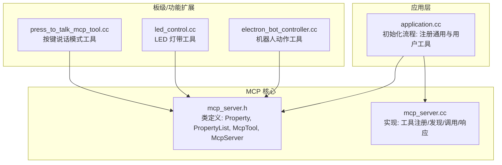
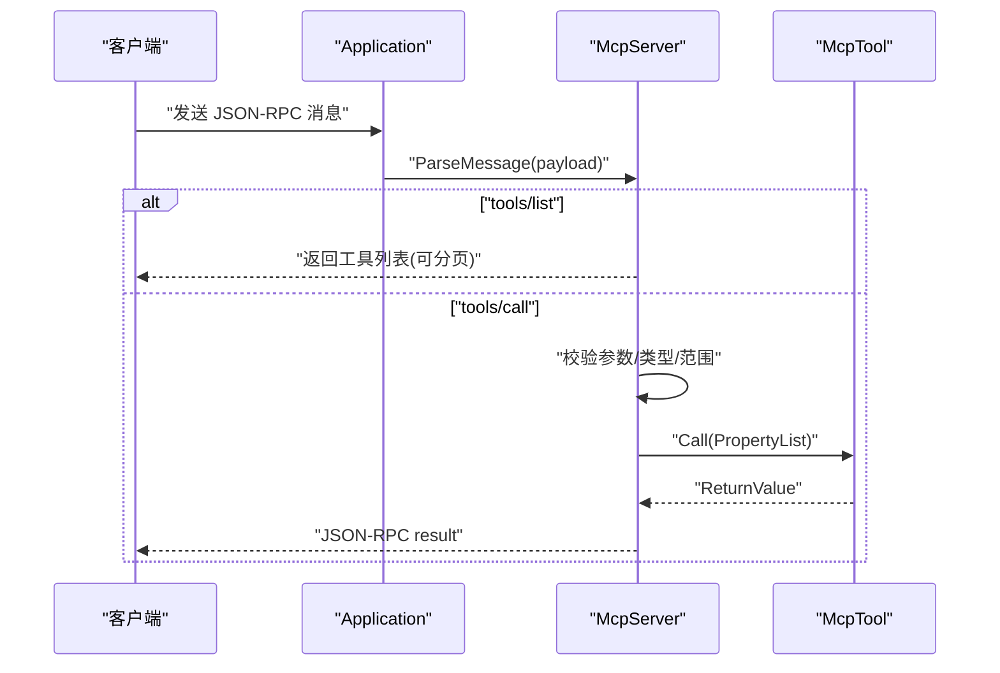
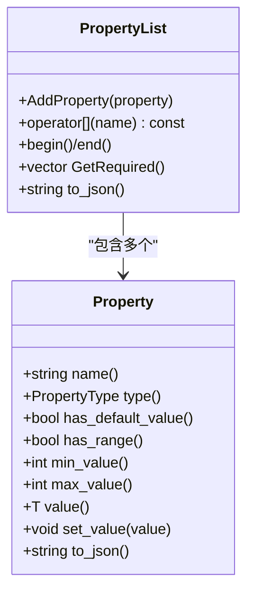
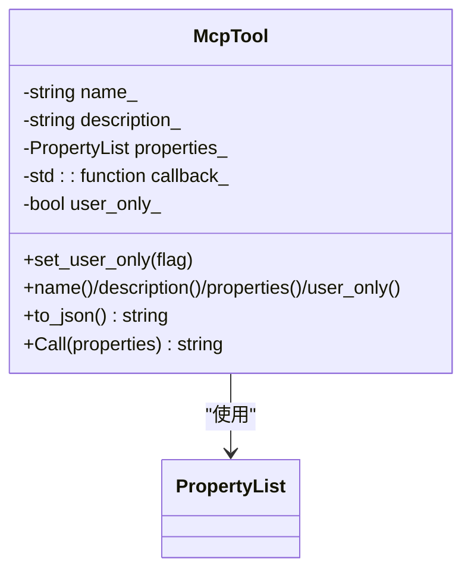
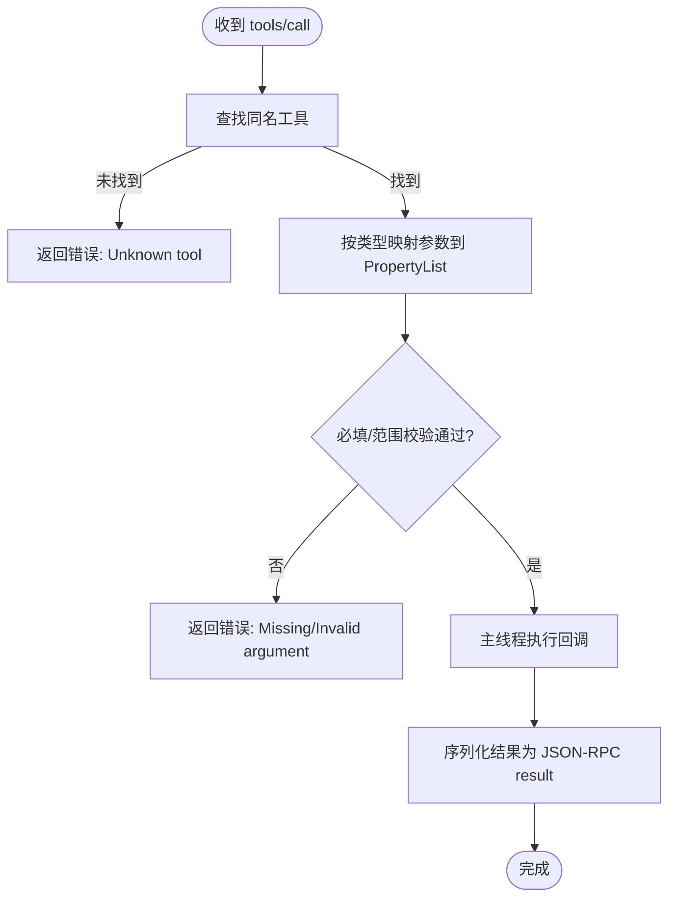
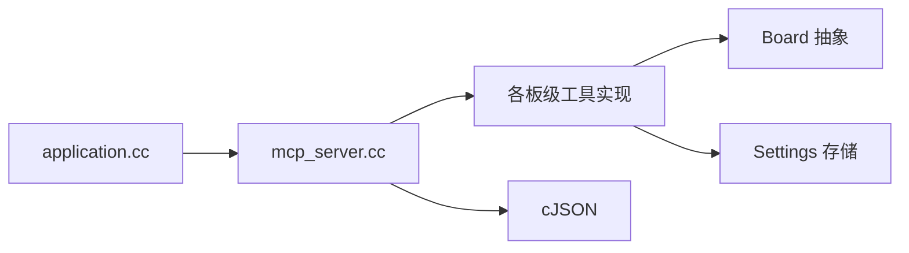

# 工具注册系统

<cite>
**本文引用的文件**   
- [mcp_server.h](file://main/mcp_server.h)
- [mcp_server.cc](file://main/mcp_server.cc)
- [application.cc](file://main/application.cc)
- [press_to_talk_mcp_tool.h](file://main/boards/common/press_to_talk_mcp_tool.h)
- [press_to_talk_mcp_tool.cc](file://main/boards/common/press_to_talk_mcp_tool.cc)
- [led_control.cc](file://main/boards/df-k10/led_control.cc)
- [electron_bot_controller.cc](file://main/boards/electron-bot/electron_bot_controller.cc)
</cite>

## 目录
1. [简介](#简介)
2. [项目结构](#项目结构)
3. [核心组件](#核心组件)
4. [架构总览](#架构总览)
5. [详细组件分析](#详细组件分析)
6. [依赖关系分析](#依赖关系分析)
7. [性能与可扩展性](#性能与可扩展性)
8. [故障排查指南](#故障排查指南)
9. [结论](#结论)
10. [附录：自定义工具开发指南](#附录自定义工具开发指南)

## 简介
本文件面向开发者，系统性阐述设备侧 MCP（Model Context Protocol）工具注册系统的实现与设计。重点包括：
- McpTool 类的设计：工具元数据管理、属性定义、回调函数绑定、用户可见性控制
- Property 与 PropertyList 类：类型系统、默认值处理、范围校验、JSON Schema 生成
- 工具发现机制：GetToolsList 的实现、分页支持、用户可见性过滤
- 错误处理与异常传播路径
- 自定义工具开发完整指南与多类型示例

## 项目结构
工具注册系统位于 main 模块中，核心由 mcp_server.h/cc 提供，应用启动时统一注册通用与仅用户可见的工具；各板级功能在各自控制器或初始化代码中通过 AddTool/AddUserOnlyTool 扩展能力。

图表来源
- [mcp_server.h:1-345](file://main/mcp_server.h#L1-L345)
- [mcp_server.cc:1-561](file://main/mcp_server.cc#L1-L561)
- [application.cc:96-100](file://main/application.cc#L96-L100)
- [press_to_talk_mcp_tool.cc:10-29](file://main/boards/common/press_to_talk_mcp_tool.cc#L10-L29)
- [led_control.cc:26-48](file://main/boards/df-k10/led_control.cc#L26-L48)
- [electron_bot_controller.cc:385-432](file://main/boards/electron-bot/electron_bot_controller.cc#L385-L432)

章节来源
- [mcp_server.h:1-345](file://main/mcp_server.h#L1-L345)
- [mcp_server.cc:1-561](file://main/mcp_server.cc#L1-L561)
- [application.cc:96-100](file://main/application.cc#L96-L100)

## 核心组件
- Property：描述单个输入参数的类型、默认值、取值范围，并生成 JSON Schema 片段
- PropertyList：维护一组 Property，提供按名访问、必填项推导、整体 JSON Schema 输出
- McpTool：封装工具名称、描述、参数 Schema、回调函数、是否仅用户可见等元数据，并提供 Call 执行与结果序列化
- McpServer：单例服务，负责工具注册、工具列表发现（含分页）、工具调用分发、JSON-RPC 请求解析与响应

章节来源
- [mcp_server.h:58-206](file://main/mcp_server.h#L58-L206)
- [mcp_server.h:208-312](file://main/mcp_server.h#L208-L312)
- [mcp_server.h:314-342](file://main/mcp_server.h#L314-L342)

## 架构总览
MCP 协议消息经 Application 路由到 McpServer，后者根据 method 分派到 tools/list 或 tools/call。tools/list 返回当前已注册工具的 JSON Schema（支持分页），tools/call 将参数映射为 PropertyList 后调度对应 McpTool 的回调，并将返回值序列化为 JSON-RPC result。

图表来源
- [mcp_server.cc:350-433](file://main/mcp_server.cc#L350-L433)
- [mcp_server.cc:452-506](file://main/mcp_server.cc#L452-L506)
- [mcp_server.cc:508-560](file://main/mcp_server.cc#L508-L560)
- [mcp_server.h:272-312](file://main/mcp_server.h#L272-L312)

## 详细组件分析

### Property 与 PropertyList：类型系统与验证
- 类型系统
  - 支持布尔、整数、字符串三种类型
  - 通过模板构造器支持可选默认值
  - 整数类型支持最小/最大范围约束
- 默认值与必填项
  - 未提供默认值的属性视为必填
  - GetRequired() 用于生成 inputSchema.required
- 范围校验
  - set_value<int> 在设置整数值时进行上下界检查，越界抛异常
  - 构造时若指定范围，会对默认值进行合法性校验
- JSON Schema 生成
  - to_json() 输出 type、default、minimum、maximum 等字段
  - PropertyList::to_json() 聚合所有属性的 schema 对象

图表来源
- [mcp_server.h:58-156](file://main/mcp_server.h#L58-L156)
- [mcp_server.h:158-206](file://main/mcp_server.h#L158-L206)

章节来源
- [mcp_server.h:58-206](file://main/mcp_server.h#L58-L206)

### McpTool：工具元数据与回调绑定
- 元数据
  - 名称、描述、参数 Schema、是否仅用户可见
- 回调签名
  - std::function<ReturnValue(const PropertyList&)>
  - ReturnValue 支持 bool/int/string/cJSON*/ImageContent*
- 执行与结果序列化
  - Call() 执行回调，将返回值包装为 content 数组（文本或图片），并标记 isError=false
  - 支持直接返回 cJSON* 作为复杂 JSON 结果
- 用户可见性
  - user_only_ 为 true 时，to_json() 会附加 annotations.audience=["user"]，表示对 AI 不可见

图表来源
- [mcp_server.h:208-312](file://main/mcp_server.h#L208-L312)

章节来源
- [mcp_server.h:208-312](file://main/mcp_server.h#L208-L312)

### McpServer：工具注册、发现与调用
- 工具注册
  - AddTool / AddUserOnlyTool：创建 McpTool 并加入内部列表，重复名称会被忽略
  - AddCommonTools / AddUserOnlyTools：分别注册常用工具与仅用户可见的系统工具
- 工具发现（分页）
  - GetToolsList：遍历工具列表，按 cursor 定位起始位置，按 withUserTools 决定是否包含用户工具，按最大负载限制切分并返回 nextCursor
- 工具调用
  - DoToolCall：查找工具，将 JSON 参数映射到 PropertyList（类型匹配+范围校验），缺失必填则报错；在主线程 Schedule 执行回调，捕获异常并以 error 形式返回
- JSON-RPC 路由
  - ParseMessage：校验版本、method、params、id；分派 initialize/tools/list/tools/call

图表来源
- [mcp_server.cc:508-560](file://main/mcp_server.cc#L508-L560)
- [mcp_server.cc:452-506](file://main/mcp_server.cc#L452-L506)
- [mcp_server.cc:350-433](file://main/mcp_server.cc#L350-L433)

章节来源
- [mcp_server.cc:300-319](file://main/mcp_server.cc#L300-L319)
- [mcp_server.cc:33-126](file://main/mcp_server.cc#L33-L126)
- [mcp_server.cc:128-298](file://main/mcp_server.cc#L128-L298)
- [mcp_server.cc:452-506](file://main/mcp_server.cc#L452-L506)
- [mcp_server.cc:508-560](file://main/mcp_server.cc#L508-L560)

### 工具发现与分页：GetToolsList 详解
- 参数
  - cursor：上次返回的 nextCursor，用于定位下一页起点
  - withUserTools：是否包含仅用户可见工具
- 策略
  - 从 tools_ 顺序遍历，跳过不符合可见性的工具
  - 累计拼接 JSON，超过最大负载时停止并设置 nextCursor
  - 若无任何工具被添加且存在工具列表，返回错误提示
- 返回
  - {"tools":[...], "nextCursor":"..."} 或 {"tools":[...]}

章节来源
- [mcp_server.cc:452-506](file://main/mcp_server.cc#L452-L506)

### 用户可见性控制
- user_only 工具在 to_json() 中附带 annotations.audience=["user"]
- GetToolsList 默认不返回 user_only 工具，除非 withUserTools=true
- 典型场景：系统管理、固件升级、屏幕截图等敏感操作对用户可见，AI 不可见

章节来源
- [mcp_server.h:256-262](file://main/mcp_server.h#L256-L262)
- [mcp_server.cc:471-474](file://main/mcp_server.cc#L471-L474)

## 依赖关系分析
- 运行时依赖
  - Application：负责协议接入、消息路由、任务调度（Schedule）
  - Board：提供硬件抽象（音频、背光、相机、网络等）
  - Settings：持久化配置（如 LED 亮度、按键说话模式）
  - cJSON：JSON 构建与解析
- 组件耦合
  - McpServer 与 McpTool 低耦合，通过统一接口交互
  - 板级功能通过 AddTool 注入，避免侵入核心逻辑

图表来源
- [application.cc:96-100](file://main/application.cc#L96-L100)
- [mcp_server.cc:1-20](file://main/mcp_server.cc#L1-L20)
- [led_control.cc:1-10](file://main/boards/df-k10/led_control.cc#L1-L10)
- [press_to_talk_mcp_tool.cc:1-10](file://main/boards/common/press_to_talk_mcp_tool.cc#L1-L10)

章节来源
- [application.cc:96-100](file://main/application.cc#L96-L100)
- [mcp_server.cc:1-20](file://main/mcp_server.cc#L1-L20)

## 性能与可扩展性
- 响应优化
  - 常用工具优先插入，利用 prompt cache 提升响应速度
- 分页限制
  - 单次工具列表响应有最大负载限制，避免大报文阻塞
- 异步执行
  - 工具回调通过 Application::Schedule 在主线程执行，保证 UI/硬件安全
- 可扩展性
  - 新增工具仅需调用 AddTool/AddUserOnlyTool，无需修改核心逻辑
  - 支持多种返回值类型，便于灵活组合复杂结果

[本节为通用指导，不涉及具体文件分析]

## 故障排查指南
- 常见错误
  - 未知工具：tools/call 找不到同名工具
  - 参数缺失或类型不匹配：缺少必填参数或类型不符
  - 范围越界：整数参数超出最小/最大值
  - 工具重复注册：同名工具第二次注册将被忽略
- 异常路径
  - 参数映射阶段抛出异常会被捕获并返回错误消息
  - 工具回调内抛出的异常同样被捕获并返回错误消息
- 日志定位
  - 关键步骤均有 ESP_LOGE/W/I 日志，便于定位问题

章节来源
- [mcp_server.cc:508-560](file://main/mcp_server.cc#L508-L560)
- [mcp_server.cc:300-309](file://main/mcp_server.cc#L300-L309)

## 结论
该工具注册系统以清晰的类型系统与严格的参数校验为基础，结合分页与用户可见性控制，提供了稳定、可扩展的设备能力暴露机制。通过统一的注册接口与回调模型，板级功能可以便捷地对外发布工具，同时保持核心逻辑的简洁与安全。

[本节为总结，不涉及具体文件分析]

## 附录：自定义工具开发指南

### 开发步骤
- 选择工具类别
  - 普通工具：对所有角色可见，适合常规设备控制
  - 仅用户可见工具：仅人类用户可见，适合系统管理、升级等敏感操作
- 定义参数
  - 使用 Property 声明参数名、类型、默认值、范围
  - 未提供默认值的参数为必填
- 编写回调
  - 接收 PropertyList，按名读取参数并进行业务处理
  - 返回 bool/int/string/cJSON* 或 ImageContent*（图片内容）
- 注册工具
  - 在合适的初始化时机调用 AddTool 或 AddUserOnlyTool
- 测试与调试
  - 通过 tools/list 确认工具与 Schema
  - 通过 tools/call 验证参数校验与执行结果
  - 关注日志与错误信息

### 示例一：无参工具（查询状态）
- 参考路径
  - [mcp_server.cc:45-53](file://main/mcp_server.cc#L45-L53)
- 要点
  - 使用空 PropertyList
  - 回调返回 JSON 字符串或 cJSON*

### 示例二：带范围校验的整数参数
- 参考路径
  - [mcp_server.cc:55-64](file://main/mcp_server.cc#L55-L64)
- 要点
  - 使用 Property("volume", kPropertyTypeInteger, 0, 100)
  - 越界将触发异常并被上层捕获

### 示例三：字符串参数与默认值
- 参考路径
  - [mcp_server.cc:152-169](file://main/mcp_server.cc#L152-L169)
- 要点
  - 使用 Property("url", kPropertyTypeString, "默认URL")
  - 默认值参与必填项判断

### 示例四：仅用户可见工具（系统重启）
- 参考路径
  - [mcp_server.cc:138-149](file://main/mcp_server.cc#L138-L149)
- 要点
  - 使用 AddUserOnlyTool
  - 回调中通过 Application::Schedule 安排重启

### 示例五：板级功能工具（LED 灯带）
- 参考路径
  - [led_control.cc:26-48](file://main/boards/df-k10/led_control.cc#L26-L48)
- 要点
  - 构造函数中注册多个工具
  - 使用范围校验保护硬件安全

### 示例六：复杂动作工具（机器人手臂）
- 参考路径
  - [electron_bot_controller.cc:390-432](file://main/boards/electron-bot/electron_bot_controller.cc#L390-L432)
- 要点
  - 多参数组合，严格范围校验
  - 回调中将参数转换为动作队列指令

### 示例七：可复用工具封装（按键说话模式）
- 参考路径
  - [press_to_talk_mcp_tool.h:8-27](file://main/boards/common/press_to_talk_mcp_tool.h#L8-L27)
  - [press_to_talk_mcp_tool.cc:10-29](file://main/boards/common/press_to_talk_mcp_tool.cc#L10-L29)
- 要点
  - 封装独立类，内部持有状态并通过 Settings 持久化
  - Initialize 中注册工具，供其他模块复用

### 权限与可见性建议
- 涉及系统重启、固件升级、截图上传等操作应使用 AddUserOnlyTool
- 常规设备控制（音量、亮度、主题切换）可使用 AddTool
- 明确标注工具用途与参数含义，有助于上层正确调用

### 错误处理最佳实践
- 在回调中对非法输入进行显式校验，必要时抛出异常
- 对可能失败的 I/O 操作（网络、硬件）进行错误码与异常的统一处理
- 返回有意义的错误消息，便于上层诊断