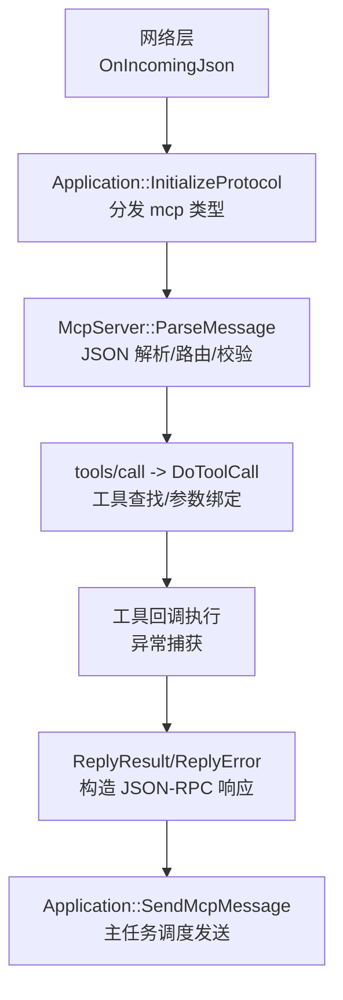
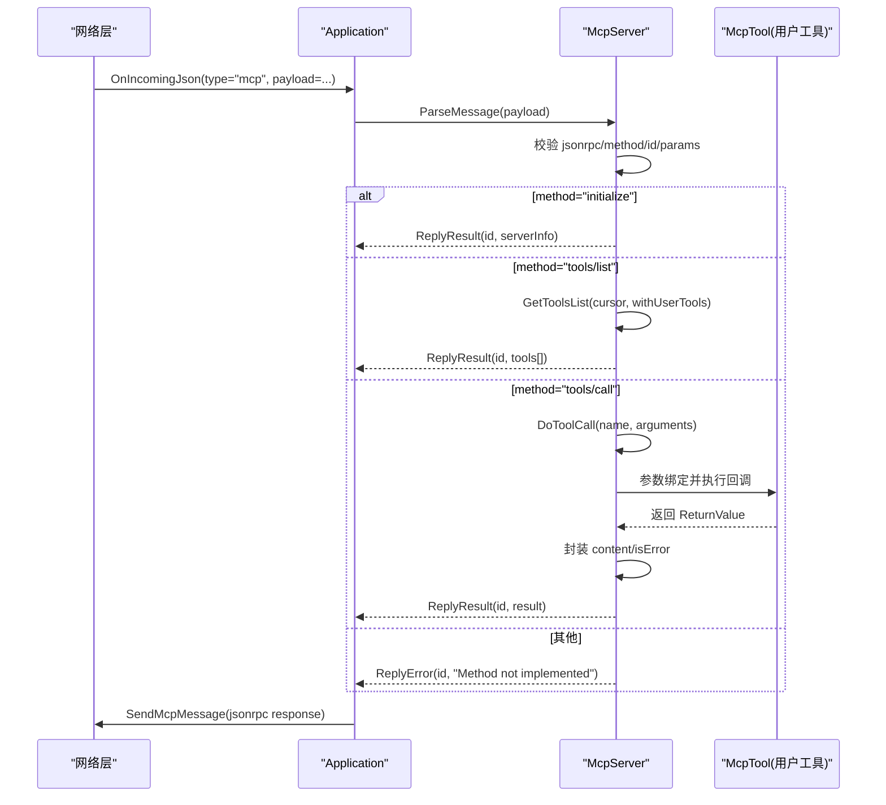
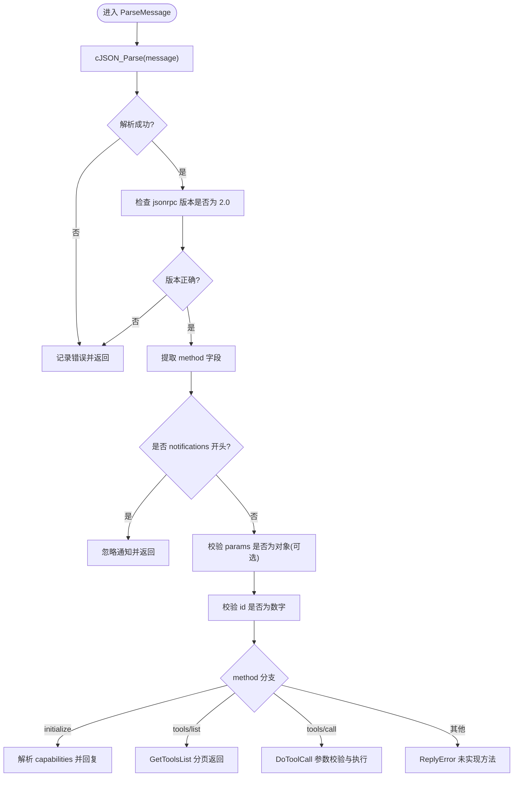
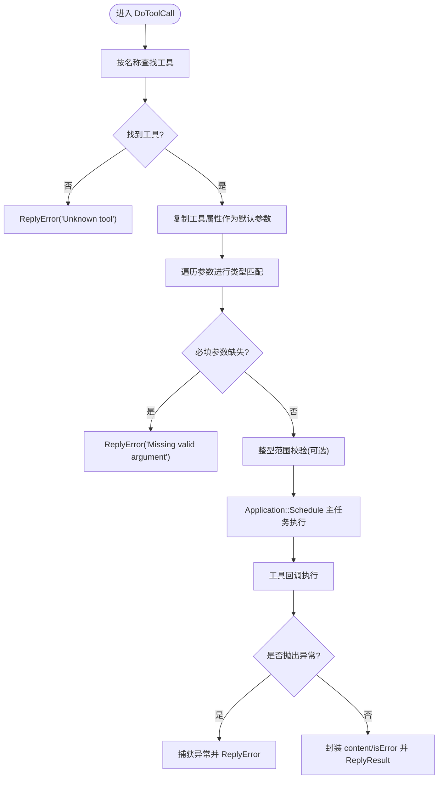
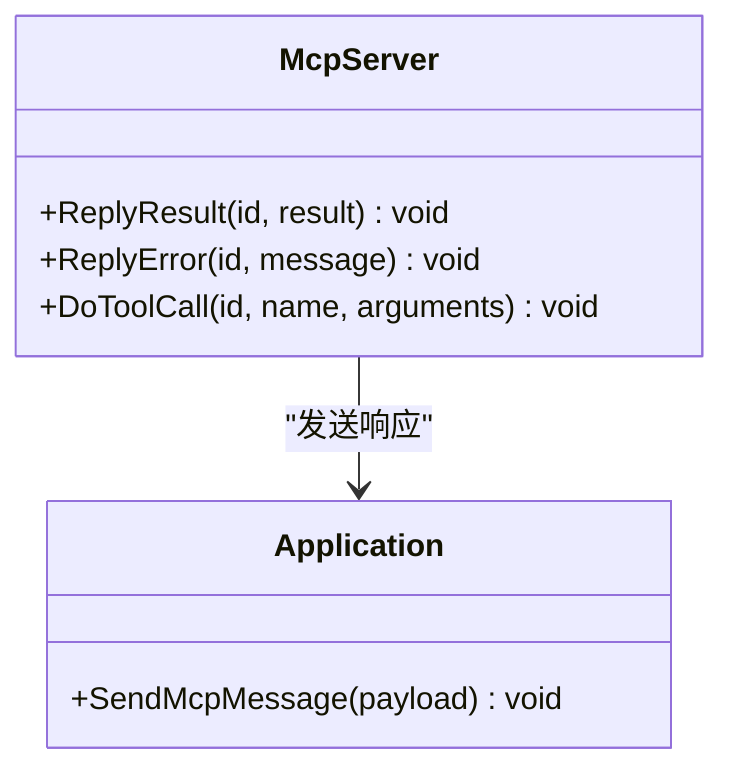
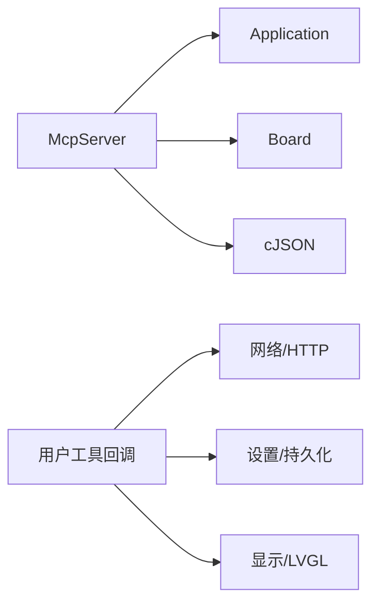

# 消息处理引擎

<cite>
**本文引用的文件**   
- [mcp_server.h](file://main/mcp_server.h)
- [mcp_server.cc](file://main/mcp_server.cc)
- [application.h](file://main/application.h)
- [application.cc](file://main/application.cc)
</cite>

## 目录
1. [简介](#简介)
2. [项目结构](#项目结构)
3. [核心组件](#核心组件)
4. [架构总览](#架构总览)
5. [详细组件分析](#详细组件分析)
6. [依赖关系分析](#依赖关系分析)
7. [性能与并发特性](#性能与并发特性)
8. [故障排查指南](#故障排查指南)
9. [结论](#结论)

## 简介
本文件聚焦于设备侧的“消息处理引擎”，围绕 MCP（Model Context Protocol）协议实现，重点解析以下能力：
- ParseMessage：JSON 解析、方法路由、参数校验
- DoToolCall：工具查找、参数绑定、异常捕获、结果封装与异步执行
- ReplyResult/ReplyError：响应格式生成、错误信息映射、统一发送
- 并发模型：主任务调度、线程安全、资源清理
- 超时控制：当前未实现显式超时；给出建议方案
- 调试技巧：日志定位、关键路径断点、消息流图

## 项目结构
消息处理引擎位于 main 目录下的 MCP 服务器模块，并与 Application 主循环紧密协作。整体调用链如下：
- 网络层收到 JSON 后，Application 将其分发到 McpServer::ParseMessage
- McpServer 根据 method 路由到 initialize/tools/list/tools/call 等分支
- tools/call 进入 DoToolCall，完成参数绑定并回调具体工具
- 工具执行完成后，通过 ReplyResult/ReplyError 构造 JSON-RPC 响应，经 Application::SendMcpMessage 发送回对端

图表来源
- [application.cc:521-607](file://main/application.cc#L521-L607)
- [mcp_server.cc:350-433](file://main/mcp_server.cc#L350-L433)
- [mcp_server.cc:508-560](file://main/mcp_server.cc#L508-L560)
- [mcp_server.cc:435-450](file://main/mcp_server.cc#L435-L450)
- [application.cc:1078-1088](file://main/application.cc#L1078-L1088)

章节来源
- [application.cc:521-607](file://main/application.cc#L521-L607)
- [mcp_server.cc:350-433](file://main/mcp_server.cc#L350-L433)
- [mcp_server.cc:508-560](file://main/mcp_server.cc#L508-L560)
- [mcp_server.cc:435-450](file://main/mcp_server.cc#L435-L450)
- [application.cc:1078-1088](file://main/application.cc#L1078-L1088)

## 核心组件
- McpServer：MCP 服务端入口，负责消息解析、方法路由、工具列表分页、工具调用编排与响应封装
- McpTool：工具元数据与执行包装，包含属性定义、输入 Schema 生成、返回值统一封装
- Property/PropertyList：工具参数描述与校验辅助，支持布尔/整数/字符串及范围约束
- Application：主事件循环与跨线程调度中心，提供 SendMcpMessage 将响应安全发送到网络层

章节来源
- [mcp_server.h:208-342](file://main/mcp_server.h#L208-L342)
- [mcp_server.h:58-206](file://main/mcp_server.h#L58-L206)
- [application.h:43-176](file://main/application.h#L43-L176)

## 架构总览
下图展示了从网络入站到响应发出的完整时序，包括 JSON-RPC 版本与方法校验、参数校验、工具执行与结果封装。

图表来源
- [application.cc:565-569](file://main/application.cc#L565-L569)
- [mcp_server.cc:350-433](file://main/mcp_server.cc#L350-L433)
- [mcp_server.cc:435-450](file://main/mcp_server.cc#L435-L450)
- [mcp_server.cc:508-560](file://main/mcp_server.cc#L508-L560)
- [application.cc:1078-1088](file://main/application.cc#L1078-L1088)

## 详细组件分析

### ParseMessage：JSON 解析、方法路由、参数验证
- JSON 解析
  - 接收 string 或 cJSON* 两种形式，内部统一为 cJSON* 进行解析与校验
  - 校验 jsonrpc 版本必须为 "2.0"，否则直接丢弃并记录错误日志
- 方法路由
  - 支持 initialize、tools/list、tools/call
  - 忽略以 "notifications" 开头的通知类方法
- 参数校验
  - 若 params 存在则必须为对象
  - tools/call 要求 name 为字符串、arguments 为对象（可选）
  - id 必须为数字
- 初始化能力
  - initialize 会读取 capabilities.vision.url/token，配置相机解释能力
  - 返回 protocolVersion、capabilities.tools、serverInfo.name/version

图表来源
- [mcp_server.cc:321-329](file://main/mcp_server.cc#L321-L329)
- [mcp_server.cc:350-433](file://main/mcp_server.cc#L350-L433)
- [mcp_server.cc:331-348](file://main/mcp_server.cc#L331-L348)

章节来源
- [mcp_server.cc:321-329](file://main/mcp_server.cc#L321-L329)
- [mcp_server.cc:350-433](file://main/mcp_server.cc#L350-L433)
- [mcp_server.cc:331-348](file://main/mcp_server.cc#L331-L348)

### DoToolCall：工具查找、参数绑定、异步执行、结果封装
- 工具查找
  - 在工具列表中按名称线性查找，未找到则返回错误
- 参数绑定与校验
  - 基于工具定义的 PropertyList 遍历每个参数
  - 从 arguments 中按名称匹配值，类型严格匹配（bool/int/string）
  - 必填参数缺失时立即返回错误
  - 支持整型范围校验（最小/最大值），越界抛出异常并被捕获
- 执行与异常捕获
  - 使用 Application::Schedule 在主任务上下文执行工具回调，避免跨线程访问共享资源
  - 工具回调可能抛出 std::exception，被捕获后转换为错误响应
- 结果封装
  - 工具返回值类型为 variant<bool,int,string,cJSON*,ImageContent*>
  - 统一封装为 content 数组与 isError=false 的标准结构
  - ImageContent 自动 Base64 编码并输出 image 类型内容

图表来源
- [mcp_server.cc:508-560](file://main/mcp_server.cc#L508-L560)
- [mcp_server.h:272-311](file://main/mcp_server.h#L272-L311)
- [mcp_server.h:79-121](file://main/mcp_server.h#L79-L121)

章节来源
- [mcp_server.cc:508-560](file://main/mcp_server.cc#L508-L560)
- [mcp_server.h:272-311](file://main/mcp_server.h#L272-L311)
- [mcp_server.h:79-121](file://main/mcp_server.h#L79-L121)

### ReplyResult 与 ReplyError：响应格式、错误码映射、异常捕获
- 响应格式
  - ReplyResult 构造标准 JSON-RPC 2.0 成功响应，包含 id 与 result
  - ReplyError 构造标准 JSON-RPC 2.0 错误响应，包含 id 与 error.message
- 错误码映射
  - 当前仅使用 message 字段传递错误文本，未定义结构化 code
  - 常见错误场景：缺少参数、未知工具、参数类型不匹配、参数越界、工具执行异常
- 异常捕获
  - DoToolCall 的参数绑定阶段与工具执行阶段均包裹 try/catch
  - 捕获 std::exception 后，将 what() 内容写入 error.message

图表来源
- [mcp_server.cc:435-450](file://main/mcp_server.cc#L435-L450)
- [application.cc:1078-1088](file://main/application.cc#L1078-L1088)

章节来源
- [mcp_server.cc:435-450](file://main/mcp_server.cc#L435-L450)
- [application.cc:1078-1088](file://main/application.cc#L1078-L1088)

### 工具注册与分类：常用工具与用户专属工具
- AddCommonTools：优先插入常用工具，利用提示缓存提升响应速度
- AddUserOnlyTools：系统级工具（如重启、固件升级、屏幕快照等），标记 user_only=true，默认不在 AI 可见的工具列表中
- 工具列表分页：GetToolsList 支持 cursor 分页与最大负载限制，超出时返回 nextCursor

章节来源
- [mcp_server.cc:33-126](file://main/mcp_server.cc#L33-L126)
- [mcp_server.cc:128-298](file://main/mcp_server.cc#L128-L298)
- [mcp_server.cc:452-506](file://main/mcp_server.cc#L452-L506)

## 依赖关系分析
- McpServer 依赖 Application 进行跨线程调度与消息发送
- McpServer 依赖 Board 获取硬件能力（音频、背光、相机、显示等）
- McpServer 依赖 cJSON 进行 JSON 解析与构建
- 工具回调可能依赖网络、存储、显示等子系统

图表来源
- [mcp_server.cc:33-126](file://main/mcp_server.cc#L33-L126)
- [mcp_server.cc:128-298](file://main/mcp_server.cc#L128-L298)
- [application.cc:1078-1088](file://main/application.cc#L1078-L1088)

章节来源
- [mcp_server.cc:33-126](file://main/mcp_server.cc#L33-L126)
- [mcp_server.cc:128-298](file://main/mcp_server.cc#L128-L298)
- [application.cc:1078-1088](file://main/application.cc#L1078-L1088)

## 性能与并发特性
- 并发模型
  - 所有工具执行通过 Application::Schedule 在主任务上下文运行，避免多线程竞争
  - 工具回调可主动降低优先级（例如相机拍照示例中使用 TaskPriorityReset）以减少阻塞
- 资源管理
  - McpServer 析构时释放所有工具指针
  - 工具回调中动态分配的内存需确保释放（如 ImageContent 在 Call 中 delete）
- 超时控制
  - 当前未实现工具执行超时机制
  - 建议：在 DoToolCall 中引入定时器或条件变量等待，结合 Application::Schedule 的回调完成信号，达到超时即返回错误
- 吞吐与延迟
  - 常用工具前置以提升提示缓存命中率
  - tools/list 分页与最大负载限制防止单次响应过大

章节来源
- [mcp_server.cc:33-126](file://main/mcp_server.cc#L33-L126)
- [mcp_server.cc:508-560](file://main/mcp_server.cc#L508-L560)
- [mcp_server.cc:452-506](file://main/mcp_server.cc#L452-L506)
- [mcp_server.h:272-311](file://main/mcp_server.h#L272-L311)

## 故障排查指南
- 常见问题定位
  - JSON 解析失败：检查传入的 payload 是否为合法 JSON
  - 版本不匹配：确认 jsonrpc 字段为 "2.0"
  - 参数缺失/类型不匹配：查看 tools/call 的错误日志，核对 arguments 结构与类型
  - 工具不存在：确认工具名是否正确且已注册
  - 工具执行异常：检查工具回调中的异常抛出点与日志
- 关键日志位置
  - ParseMessage 各校验分支的 ESP_LOGE
  - DoToolCall 参数绑定与执行阶段的异常日志
  - ReplyError 的错误消息
- 调试技巧
  - 在 ParseMessage 入口处打印原始 JSON
  - 在 DoToolCall 的参数绑定循环中打印每个参数的匹配结果
  - 在工具回调前后增加日志，便于定位耗时与异常
  - 使用 Application::RegisterMcpBroadcastCallback 订阅 MCP 广播，观察响应内容

章节来源
- [mcp_server.cc:350-433](file://main/mcp_server.cc#L350-L433)
- [mcp_server.cc:508-560](file://main/mcp_server.cc#L508-L560)
- [application.cc:1074-1088](file://main/application.cc#L1074-L1088)

## 结论
该消息处理引擎以简洁清晰的 JSON-RPC 2.0 协议为基础，实现了稳定的方法路由、严格的参数校验、统一的响应封装以及安全的跨线程执行。通过常用工具前置与工具列表分页优化了性能与稳定性。当前未实现工具执行超时，建议在后续迭代中引入超时控制与更丰富的错误码体系，进一步提升鲁棒性与可观测性。