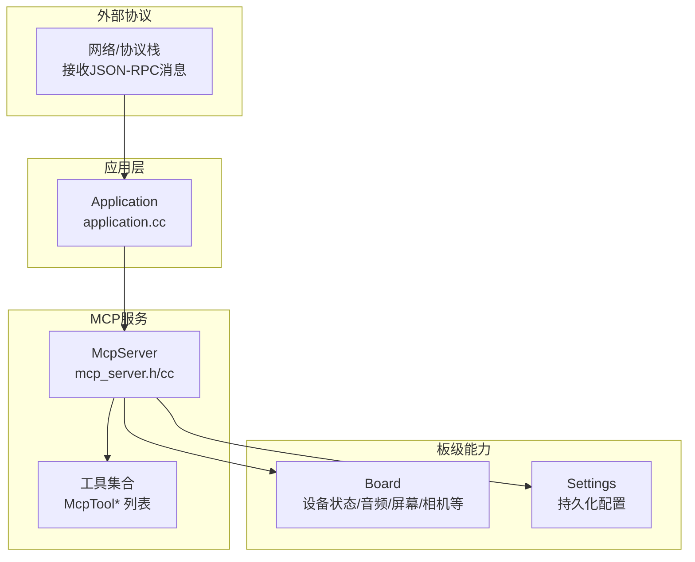
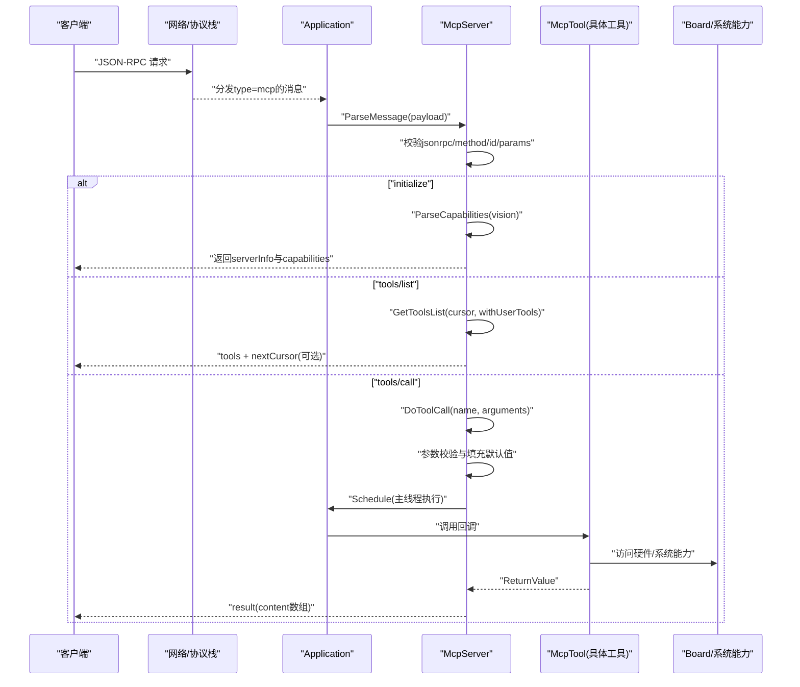
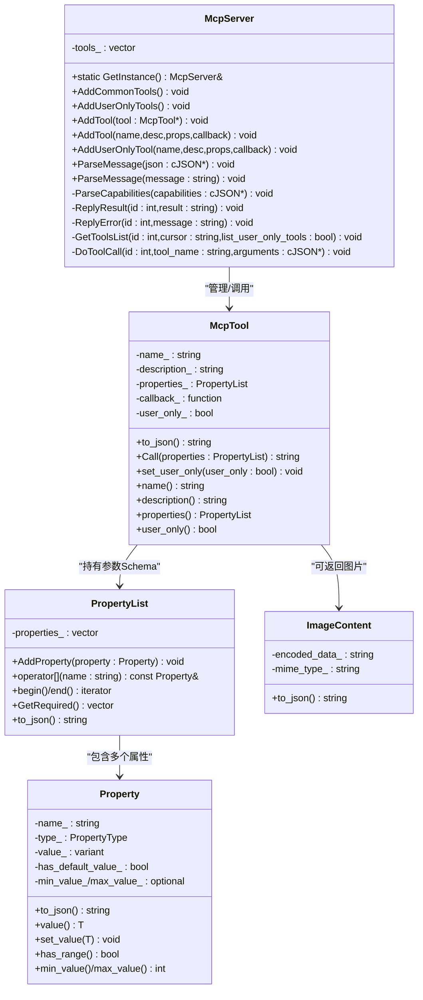
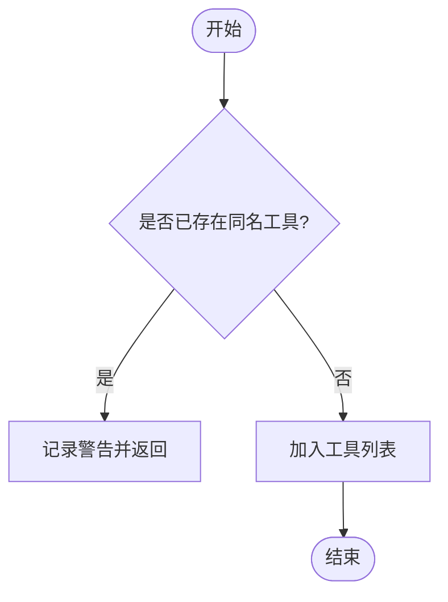
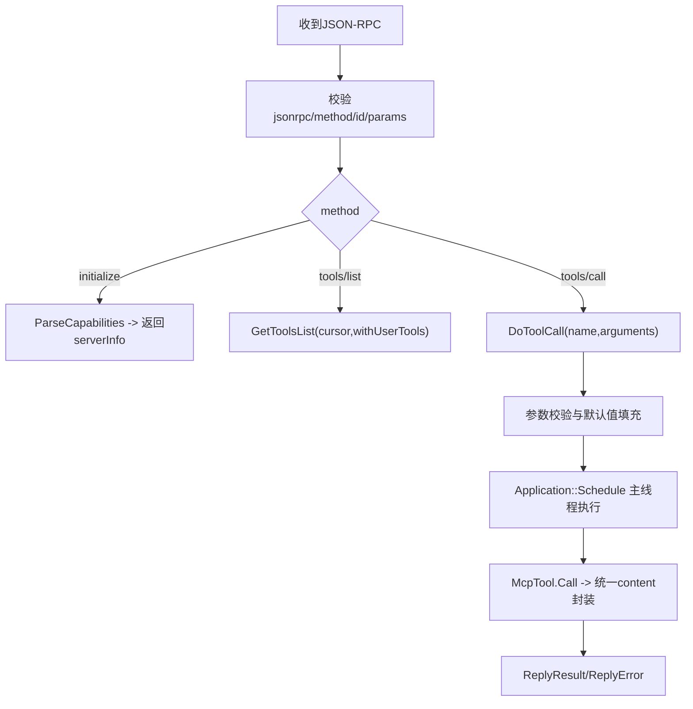
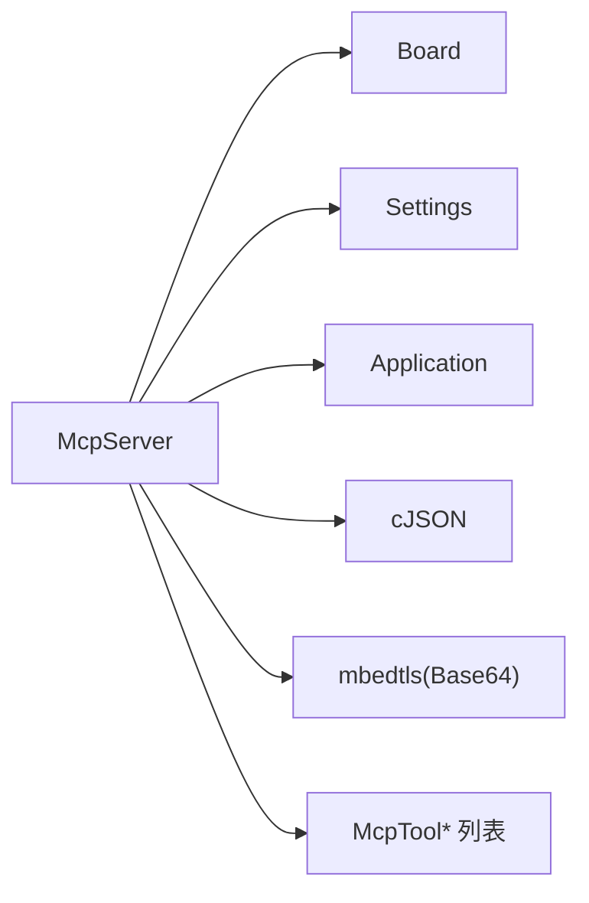

# 设备端MCP服务器实现

<cite>
**本文引用的文件**   
- [main/mcp_server.h](file://main/mcp_server.h)
- [main/mcp_server.cc](file://main/mcp_server.cc)
- [main/application.cc](file://main/application.cc)
- [main/boards/common/press_to_talk_mcp_tool.h](file://main/boards/common/press_to_talk_mcp_tool.h)
- [main/boards/common/press_to_talk_mcp_tool.cc](file://main/boards/common/press_to_talk_mcp_tool.cc)
</cite>

## 目录
1. [简介](#简介)
2. [项目结构](#项目结构)
3. [核心组件](#核心组件)
4. [架构总览](#架构总览)
5. [详细组件分析](#详细组件分析)
6. [依赖关系分析](#依赖关系分析)
7. [性能与内存管理](#性能与内存管理)
8. [错误处理与调试](#错误处理与调试)
9. [集成与使用示例](#集成与使用示例)
10. [结论](#结论)

## 简介
本文件面向设备端（ESP32）的MCP（Model Context Protocol）服务器实现，围绕 McpServer 类展开，系统性阐述其单例模式、线程安全、内存管理、工具注册机制（含 AddTool 与 AddUserOnlyTool 的差异）、消息解析链路（从JSON到工具调用）、错误处理策略、性能优化技巧与调试方法，并提供可操作的集成与使用示例。

## 项目结构
与MCP服务器直接相关的代码主要位于 main 目录下：
- mcp_server.h / mcp_server.cc：MCP协议解析、工具注册与调度、结果封装与发送
- application.cc：应用启动时注册通用工具，并将网络层收到的MCP消息路由至MCP服务器
- boards/common/press_to_talk_mcp_tool.*：一个可复用的“按键说话模式”MCP工具示例，展示如何动态注册自定义工具

图表来源
- [main/application.cc:96-100](file://main/application.cc#L96-L100)
- [main/mcp_server.h:314-342](file://main/mcp_server.h#L314-L342)
- [main/mcp_server.cc:33-126](file://main/mcp_server.cc#L33-L126)

章节来源
- [main/mcp_server.h:1-345](file://main/mcp_server.h#L1-L345)
- [main/mcp_server.cc:1-561](file://main/mcp_server.cc#L1-L561)
- [main/application.cc:96-100](file://main/application.cc#L96-L100)

## 核心组件
- ImageContent：用于在工具返回中携带图片内容（Base64编码），并生成标准JSON片段
- Property / PropertyList：描述工具的输入参数类型、默认值、取值范围，以及将属性序列化为JSON Schema
- McpTool：封装单个工具的名称、描述、参数Schema、回调函数及是否仅用户可见标记；负责将返回值统一包装为MCP content数组
- McpServer：MCP服务端核心，提供单例访问、工具注册、消息解析、工具调用调度、分页列出工具、结果/错误回复

章节来源
- [main/mcp_server.h:16-312](file://main/mcp_server.h#L16-L312)
- [main/mcp_server.h:314-342](file://main/mcp_server.h#L314-L342)

## 架构总览
MCP服务器遵循JSON-RPC 2.0规范，支持以下方法：
- initialize：握手与能力协商（如vision能力）
- tools/list：分页列出可用工具，支持 withUserTools 控制是否包含仅用户可见工具
- tools/call：根据名称查找工具，校验参数后在主线程执行回调，返回统一content格式

图表来源
- [main/mcp_server.cc:350-433](file://main/mcp_server.cc#L350-L433)
- [main/mcp_server.cc:452-506](file://main/mcp_server.cc#L452-L506)
- [main/mcp_server.cc:508-560](file://main/mcp_server.cc#L508-L560)
- [main/application.cc:565-569](file://main/application.cc#L565-L569)

## 详细组件分析

### McpServer 类设计
- 单例模式：GetInstance() 使用静态局部变量保证线程安全的构造与唯一实例
- 生命周期与内存管理：析构遍历删除所有注册的 McpTool 指针，避免泄漏
- 线程模型：工具回调通过 Application::Schedule 投递到主线程执行，避免跨线程访问共享资源
- 工具注册：
  - AddTool：普通工具，AI可见
  - AddUserOnlyTool：仅用户可见，AI不可见（在 to_json 输出中添加 annotations.audience=user）
  - AddCommonTools/AddUserOnlyTools：分别注册常用系统与用户专属工具，且常用工具优先插入以利用提示缓存
- 消息解析：
  - ParseMessage(string/json)：先解析JSON，再进入内部解析流程
  - ParseCapabilities：处理 vision.url/token 能力，设置相机解释URL与token
  - GetToolsList：按cursor分页，过滤 user_only 工具，限制单次payload大小
  - DoToolCall：查找工具、拷贝并填充参数（含默认值与范围检查）、异常捕获、主线程执行、统一结果封装
- 回复机制：ReplyResult/ReplyError 构建JSON-RPC响应并通过 Application::SendMcpMessage 发送

图表来源
- [main/mcp_server.h:16-312](file://main/mcp_server.h#L16-L312)
- [main/mcp_server.h:314-342](file://main/mcp_server.h#L314-L342)

章节来源
- [main/mcp_server.h:314-342](file://main/mcp_server.h#L314-L342)
- [main/mcp_server.cc:23-31](file://main/mcp_server.cc#L23-L31)
- [main/mcp_server.cc:300-319](file://main/mcp_server.cc#L300-L319)
- [main/mcp_server.cc:350-433](file://main/mcp_server.cc#L350-L433)
- [main/mcp_server.cc:452-506](file://main/mcp_server.cc#L452-L506)
- [main/mcp_server.cc:508-560](file://main/mcp_server.cc#L508-L560)

### 工具注册机制与生命周期
- 注册入口
  - AddTool：创建 McpTool 并加入工具列表，若同名则告警跳过
  - AddUserOnlyTool：创建 McpTool 并标记 user_only=true，随后走 AddTool
- 内置工具分组
  - AddCommonTools：优先插入常用工具（如获取设备状态、音量调节、屏幕亮度/主题、拍照等），以提升提示缓存命中率
  - AddUserOnlyTools：系统信息、重启、固件升级、屏幕截图/预览、资产下载URL设置等
- 生命周期
  - 构造：空
  - 析构：遍历删除所有 McpTool 指针，清空容器
  - 运行时：工具对象由服务器持有，直到服务器析构释放
- 动态加载
  - 通过 AddTool/AddUserOnlyTool 可在任意时机动态注册新工具（例如各板级初始化时）
  - 示例：PressToTalkMcpTool 在 Initialize 中向服务器注册 self.set_press_to_talk 工具

图表来源
- [main/mcp_server.cc:300-309](file://main/mcp_server.cc#L300-L309)

章节来源
- [main/mcp_server.cc:33-126](file://main/mcp_server.cc#L33-L126)
- [main/mcp_server.cc:128-298](file://main/mcp_server.cc#L128-L298)
- [main/mcp_server.cc:300-319](file://main/mcp_server.cc#L300-L319)
- [main/boards/common/press_to_talk_mcp_tool.cc:10-29](file://main/boards/common/press_to_talk_mcp_tool.cc#L10-L29)

### 消息解析与工具调用链路
- JSON-RPC校验：版本必须为2.0，method非空且为字符串，id为数字，params为对象或空
- 方法分发：
  - initialize：解析 capabilities.vision.url/token，设置相机解释URL与token，返回 serverInfo 与 capabilities
  - tools/list：支持 cursor 分页与 withUserTools 开关，按最大payload限制切分
  - tools/call：查找工具、复制并填充参数（布尔/整数/字符串），缺失必填参数报错，异常捕获，主线程执行回调，统一封装 result.content 数组
- 结果/错误：ReplyResult/ReplyError 构造JSON-RPC响应并通过 Application::SendMcpMessage 发送

图表来源
- [main/mcp_server.cc:350-433](file://main/mcp_server.cc#L350-L433)
- [main/mcp_server.cc:452-506](file://main/mcp_server.cc#L452-L506)
- [main/mcp_server.cc:508-560](file://main/mcp_server.cc#L508-L560)

章节来源
- [main/mcp_server.cc:350-433](file://main/mcp_server.cc#L350-L433)
- [main/mcp_server.cc:452-506](file://main/mcp_server.cc#L452-L506)
- [main/mcp_server.cc:508-560](file://main/mcp_server.cc#L508-L560)

### 工具返回类型与内容封装
- ReturnValue 支持多种类型：bool/int/string/cJSON*/ImageContent*
- McpTool::Call 将返回值转换为统一的 content 数组：
  - 文本：text 字段
  - 图片：image 字段，内部使用 ImageContent.to_json 生成 base64 数据
  - JSON：将 cJSON* 序列化为字符串放入 text
- 图片返回需确保正确释放 ImageContent 指针（已在 Call 中 delete）

章节来源
- [main/mcp_server.h:50-50](file://main/mcp_server.h#L50-L50)
- [main/mcp_server.h:16-47](file://main/mcp_server.h#L16-L47)
- [main/mcp_server.h:272-312](file://main/mcp_server.h#L272-L312)

### 仅用户可见工具（AddUserOnlyTool）
- 作用：对AI不可见，仅用户侧可见，适合系统维护、调试、升级等操作
- 实现：在 McpTool::to_json 中为 user_only 工具添加 annotations.audience=["user"]
- 典型工具：self.get_system_info、self.reboot、self.upgrade_firmware、self.screen.get_info、self.screen.snapshot、self.screen.preview_image、self.assets.set_download_url

章节来源
- [main/mcp_server.h:232-270](file://main/mcp_server.h#L232-L270)
- [main/mcp_server.cc:128-298](file://main/mcp_server.cc#L128-L298)

### 动态工具示例：PressToTalkMcpTool
- 功能：切换“长按说话/单击说话”模式，状态持久化到 Settings
- 注册方式：Initialize 中通过 McpServer::GetInstance().AddTool 注册 self.set_press_to_talk
- 适用场景：不同板级可在各自初始化流程中按需注册此类工具

章节来源
- [main/boards/common/press_to_talk_mcp_tool.h:1-29](file://main/boards/common/press_to_talk_mcp_tool.h#L1-L29)
- [main/boards/common/press_to_talk_mcp_tool.cc:1-57](file://main/boards/common/press_to_talk_mcp_tool.cc#L1-L57)

## 依赖关系分析
- McpServer 依赖：
  - Board：获取设备状态、音频编解码器、背光、显示、相机、网络HTTP等能力
  - Settings：读写配置（如assets下载URL、按键说话模式）
  - Application：Schedule 主线程任务、SendMcpMessage 发送响应
  - cJSON：JSON解析与序列化
  - mbedtls：Base64编码（图片内容）
- 耦合与内聚：
  - McpServer 与 McpTool 高内聚，工具回调通过函数对象注入，降低耦合
  - 工具注册与业务逻辑解耦，便于扩展与测试

图表来源
- [main/mcp_server.cc:6-19](file://main/mcp_server.cc#L6-L19)
- [main/mcp_server.h:11-14](file://main/mcp_server.h#L11-L14)

章节来源
- [main/mcp_server.cc:6-19](file://main/mcp_server.cc#L6-L19)
- [main/mcp_server.h:11-14](file://main/mcp_server.h#L11-L14)

## 性能与内存管理
- 性能优化
  - 常用工具前置：AddCommonTools 将高频工具置于列表前端，提升提示缓存命中
  - 工具列表分页：GetToolsList 基于 cursor 分页，限制单次payload大小（约8KB），避免大报文阻塞
  - 主线程执行：DoToolCall 通过 Application::Schedule 在主线程执行，减少上下文切换与锁竞争
- 内存管理
  - 工具对象：McpServer 析构时遍历删除所有 McpTool 指针
  - 图片返回：ImageContent 在 McpTool::Call 中返回后由服务器负责释放
  - 网络上传：部分工具（如屏幕快照）使用 heap_caps_malloc 分配内存，失败路径抛出异常并清理
- 复杂度
  - 工具查找：线性扫描 O(n)，n 为工具数量（通常较小）
  - 参数填充：O(m)，m 为参数个数
  - 列表分页：O(k)，k 为当前批次工具数

章节来源
- [main/mcp_server.cc:33-126](file://main/mcp_server.cc#L33-L126)
- [main/mcp_server.cc:452-506](file://main/mcp_server.cc#L452-L506)
- [main/mcp_server.cc:508-560](file://main/mcp_server.cc#L508-L560)
- [main/mcp_server.cc:26-31](file://main/mcp_server.cc#L26-L31)
- [main/mcp_server.h:272-312](file://main/mcp_server.h#L272-L312)

## 错误处理与调试
- 错误分类
  - 协议层：jsonrpc版本不匹配、缺少method/id、params类型非法
  - 工具层：未知工具名、缺少必填参数、参数类型不匹配、工具回调抛异常
  - 系统层：相机拍摄失败、HTTP请求失败、内存分配失败
- 处理策略
  - 早期校验：在 ParseMessage 阶段快速失败，避免无效调用
  - 参数校验：DoToolCall 中对每个参数进行类型匹配与必填检查，缺失则 ReplyError
  - 异常捕获：工具执行前后 try-catch，捕获 std::exception 并返回错误消息
  - 资源清理：网络/内存分配失败路径显式清理，防止泄漏
- 调试建议
  - 启用 ESP_LOGE/W/I 日志，关注 TAG="MCP" 相关输出
  - 针对 tools/call 的参数问题，优先检查 required 字段与类型约束
  - 对于图片/网络操作，确认 URL、Token、网络连通性与内存余量

章节来源
- [main/mcp_server.cc:350-433](file://main/mcp_server.cc#L350-L433)
- [main/mcp_server.cc:508-560](file://main/mcp_server.cc#L508-L560)
- [main/mcp_server.cc:435-450](file://main/mcp_server.cc#L435-L450)

## 集成与使用示例
- 应用启动时注册通用工具
  - 在 Application 初始化阶段调用 McpServer::GetInstance().AddCommonTools() 与 AddUserOnlyTools()
  - 参考路径：[main/application.cc:96-100](file://main/application.cc#L96-L100)
- 接收并解析MCP消息
  - 当网络层收到 type=mcp 的消息时，提取 payload 并调用 ParseMessage
  - 参考路径：[main/application.cc:565-569](file://main/application.cc#L565-L569)
- 动态注册自定义工具
  - 在板级初始化或模块初始化中，通过 McpServer::GetInstance().AddTool(...) 或 AddUserOnlyTool(...) 注册
  - 示例：PressToTalkMcpTool::Initialize 注册 self.set_press_to_talk
  - 参考路径：[main/boards/common/press_to_talk_mcp_tool.cc:10-29](file://main/boards/common/press_to_talk_mcp_tool.cc#L10-L29)
- 工具回调最佳实践
  - 避免在回调中进行长时间阻塞操作，必要时通过 Application::Schedule 异步执行
  - 对可能失败的I/O操作（相机、网络）做好异常与错误码处理
  - 返回类型尽量使用简单类型（bool/int/string），复杂数据用 cJSON* 或 ImageContent*

章节来源
- [main/application.cc:96-100](file://main/application.cc#L96-L100)
- [main/application.cc:565-569](file://main/application.cc#L565-L569)
- [main/boards/common/press_to_talk_mcp_tool.cc:10-29](file://main/boards/common/press_to_talk_mcp_tool.cc#L10-L29)

## 结论
McpServer 以单例形式提供稳定的MCP服务能力，采用清晰的工具注册与分层解析机制，结合主线程调度与严格的参数校验，实现了在资源受限设备上的高效与可靠运行。通过 AddCommonTools 与 AddUserOnlyTools 的分类管理，既提升了AI交互效率，又保障了系统维护与安全边界。开发者可按需在板级初始化中动态注册工具，借助统一的返回值封装与错误处理策略，快速构建丰富的设备端能力。