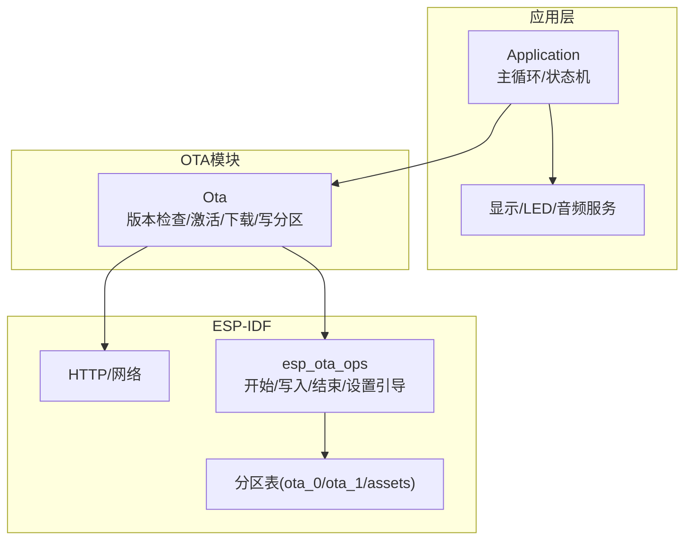
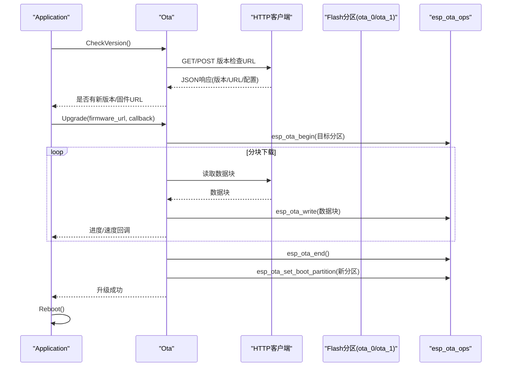
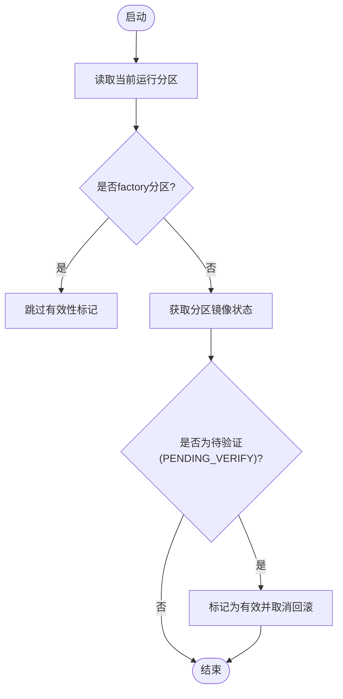
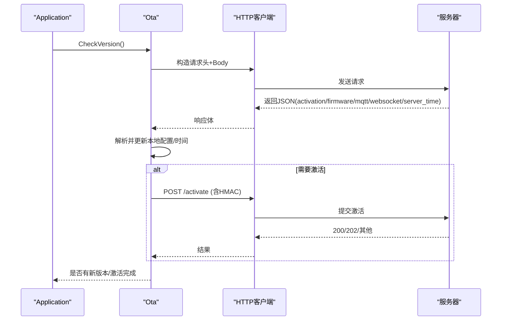
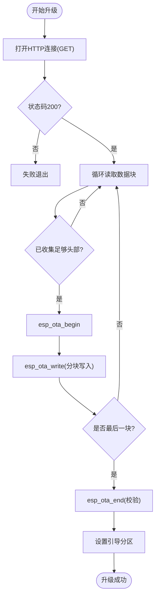
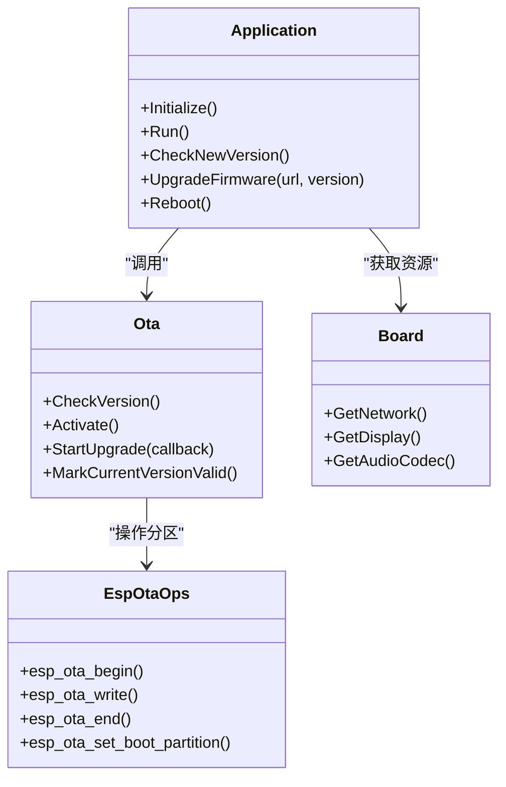

# OTA固件升级

<cite>
**本文引用的文件**   
- [main/ota.h](file://main/ota.h)
- [main/ota.cc](file://main/ota.cc)
- [main/application.h](file://main/application.h)
- [main/application.cc](file://main/application.cc)
- [partitions/v2/README.md](file://partitions/v2/README.md)
- [partitions/v2/16m.csv](file://partitions/v2/16m.csv)
</cite>

## 目录
1. [简介](#简介)
2. [项目结构](#项目结构)
3. [核心组件](#核心组件)
4. [架构总览](#架构总览)
5. [详细组件分析](#详细组件分析)
6. [依赖关系分析](#依赖关系分析)
7. [性能与可靠性考量](#性能与可靠性考量)
8. [故障排查指南](#故障排查指南)
9. [结论](#结论)
10. [附录](#附录)

## 简介
本技术文档围绕设备端OTA（Over-The-Air）固件升级系统，系统性阐述从版本检查、下载、完整性校验、分区切换到回滚恢复的完整流程。重点说明A/B双分区升级机制与失败回退策略，并给出增量/全量升级的实现思路、打包工具使用与自定义固件制作流程、错误处理与用户反馈机制，以及生产环境批量升级与远程管理方案建议。

## 项目结构
与OTA相关的关键代码位于应用层与底层ESP-IDF接口之间：
- 应用层协调：Application负责启动流程、网络就绪后的激活与版本检查、升级触发与UI/音频资源管理。
- OTA模块：Ota封装了版本检查、激活认证、固件下载与写入、分区标记等能力。
- 分区表：v2分区表引入独立的assets分区，支持动态内容更新；应用与OTA通过esp_ota_ops操作app分区。

图表来源
- [main/application.cc:398-471](file://main/application.cc#L398-L471)
- [main/ota.cc:77-245](file://main/ota.cc#L77-L245)
- [main/ota.cc:267-387](file://main/ota.cc#L267-L387)
- [partitions/v2/README.md:1-107](file://partitions/v2/README.md#L1-L107)

章节来源
- [main/application.h:1-194](file://main/application.h#L1-L194)
- [main/application.cc:398-471](file://main/application.cc#L398-L471)
- [main/ota.h:1-59](file://main/ota.h#L1-L59)
- [main/ota.cc:77-245](file://main/ota.cc#L77-L245)
- [partitions/v2/README.md:1-107](file://partitions/v2/README.md#L1-L107)

## 核心组件
- Ota类
  - 版本检查：向配置URL发起请求，解析JSON返回，比较版本号，决定是否升级。
  - 激活流程：根据服务器下发的challenge计算HMAC并提交激活。
  - 固件下载与写入：按页读取HTTP流，边读边写目标app分区，完成后设置引导分区。
  - 有效性标记：在运行分区为“pending verify”时标记当前版本有效，避免回滚。
- Application类
  - 启动后在网络就绪时执行资产检查、版本检查、协议初始化。
  - 发现新版本时触发升级，提供进度回调与用户提示。
  - 升级失败时恢复音频服务并继续运行；成功则重启进入新分区。

章节来源
- [main/ota.h:10-56](file://main/ota.h#L10-L56)
- [main/ota.cc:77-245](file://main/ota.cc#L77-L245)
- [main/ota.cc:267-387](file://main/ota.cc#L267-L387)
- [main/ota.cc:247-265](file://main/ota.cc#L247-L265)
- [main/application.cc:398-471](file://main/application.cc#L398-L471)
- [main/application.cc:972-1022](file://main/application.cc#L972-L1022)

## 架构总览
下图展示一次完整的OTA升级时序，包括版本检查、下载、写入、设置引导与重启。

图表来源
- [main/application.cc:398-471](file://main/application.cc#L398-L471)
- [main/ota.cc:77-245](file://main/ota.cc#L77-L245)
- [main/ota.cc:267-387](file://main/ota.cc#L267-L387)

## 详细组件分析

### A/B分区与回滚机制
- 分区布局
  - v2分区表包含两个app分区（ota_0、ota_1）和一个assets分区。升级时将新镜像写入非运行分区，完成后切换引导至新分区。
- 回滚策略
  - 若新分区未标记为有效，且处于“待验证”状态，系统会在特定条件下回滚至旧分区。
  - 应用侧在确认新分区稳定后可调用“标记当前版本有效”，取消回滚。

图表来源
- [main/ota.cc:247-265](file://main/ota.cc#L247-L265)
- [partitions/v2/README.md:24-41](file://partitions/v2/README.md#L24-L41)

章节来源
- [partitions/v2/README.md:1-107](file://partitions/v2/README.md#L1-L107)
- [partitions/v2/16m.csv:1-9](file://partitions/v2/16m.csv#L1-L9)
- [main/ota.cc:247-265](file://main/ota.cc#L247-L265)

### 版本检查与激活流程
- 版本检查
  - 从配置或默认值获取检查URL，携带设备信息（User-Agent、Device-Id、Client-Id、Serial-Number等）发起请求。
  - 解析JSON中的firmware字段（version/url/force），比较当前版本与最新版本，必要时强制升级。
  - 同时可下发mqtt/websocket配置与server_time，设备侧自动更新本地存储与时钟。
- 激活流程
  - 若服务器返回activation挑战，设备基于硬件密钥计算HMAC并提交激活。
  - 激活成功后继续后续流程，否则按超时/错误重试或提示用户。

图表来源
- [main/ota.cc:77-245](file://main/ota.cc#L77-L245)
- [main/ota.cc:458-492](file://main/ota.cc#L458-L492)

章节来源
- [main/ota.cc:77-245](file://main/ota.cc#L77-L245)
- [main/ota.cc:458-492](file://main/ota.cc#L458-L492)

### 固件下载与写入（全量升级）
- 下载策略
  - 以固定页大小（如4KB）循环读取HTTP流，累计进度与速率，回调给上层用于UI展示。
- 写入与校验
  - 首次读到足够头部后调用begin，随后持续write，最后end进行完整性校验。
  - 校验失败会返回特定错误码，表示镜像损坏。
- 引导切换
  - 成功后设置新的引导分区，随后由应用触发重启进入新镜像。

图表来源
- [main/ota.cc:267-387](file://main/ota.cc#L267-L387)

章节来源
- [main/ota.cc:267-387](file://main/ota.cc#L267-L387)

### 增量升级（实现方案）
仓库当前实现为全量镜像下载与写入。增量升级可在以下层面扩展：
- 服务端生成差分包（如bsdiff/xdelta），设备端下载差分包并在内存/临时分区中合并为完整镜像后再写入。
- 采用ESP-IDF的OTA增量特性（如适用平台与镜像格式支持），减少带宽与时间。
- 注意：需保证镜像签名与校验链一致，确保安全性与一致性。

[本节为概念性方案说明，不直接分析具体源码]

### 打包工具与自定义固件
- 资源打包
  - assets分区支持SPIFFS文件系统，可通过脚本将主题、音效、字体等资源打包成镜像并烧录。
  - 构建脚本位于scripts/spiffs_assets目录，提供打包与批量构建能力。
- 自定义固件
  - 遵循ESP-IDF工程规范编译生成.bin/.elf，确保分区表与目标设备匹配。
  - 发布前建议对镜像进行签名与校验，便于设备端验证。

章节来源
- [partitions/v2/README.md:86-107](file://partitions/v2/README.md#L86-L107)
- [scripts/spiffs_assets/build.py](file://scripts/spiffs_assets/build.py)
- [scripts/spiffs_assets/pack_model.py](file://scripts/spiffs_assets/pack_model.py)
- [scripts/spiffs_assets/spiffs_assets_gen.py](file://scripts/spiffs_assets/spiffs_assets_gen.py)

### 错误处理与用户反馈
- 网络与协议错误
  - 版本检查失败时，应用层记录错误并指数退避重试；达到最大重试次数则退出检查。
  - 协议层错误通过事件上报，界面弹出告警并播放提示音。
- 升级失败
  - 下载或写入失败时，恢复音频服务与电源模式，提示升级失败并继续运行。
  - 若新分区未标记有效，系统可能回滚至旧分区，保障可用性。
- 用户反馈
  - 升级过程中实时显示百分比与速度；失败/成功均有明确提示与声音反馈。

章节来源
- [main/application.cc:398-471](file://main/application.cc#L398-L471)
- [main/application.cc:972-1022](file://main/application.cc#L972-L1022)
- [main/ota.cc:267-387](file://main/ota.cc#L267-L387)

## 依赖关系分析
- Application依赖Ota进行版本检查与升级，依赖Board/Display/AudioService进行UI与音频反馈。
- Ota依赖ESP-IDF的HTTP客户端与esp_ota_ops，间接依赖分区表定义。
- 分区表决定app与assets空间分配，影响升级策略与资源管理能力。

图表来源
- [main/application.h:43-176](file://main/application.h#L43-L176)
- [main/ota.h:10-56](file://main/ota.h#L10-L56)
- [main/ota.cc:267-387](file://main/ota.cc#L267-L387)

章节来源
- [main/application.h:43-176](file://main/application.h#L43-L176)
- [main/ota.h:10-56](file://main/ota.h#L10-L56)
- [main/ota.cc:267-387](file://main/ota.cc#L267-L387)

## 性能与可靠性考量
- 下载与写入
  - 使用固定页大小（如4KB）缓冲，降低SRAM占用；按秒统计速度与进度，减少频繁回调开销。
- 内存与功耗
  - 升级期间切换到高性能模式，结束后恢复低功耗；音频服务在升级前停止以避免冲突。
- 完整性与安全
  - esp_ota_end内置镜像校验；建议结合镜像签名与哈希校验增强安全。
- 回滚保障
  - 仅在运行分区非factory且状态为待验证时标记有效，避免误回滚；失败场景下系统可自动回退。

[本节为通用指导，不直接分析具体源码]

## 故障排查指南
- 版本检查失败
  - 检查配置URL是否正确、网络连通性与HTTP状态码；查看日志中的错误码与重试次数。
- 激活失败
  - 确认challenge与HMAC计算逻辑；检查服务器返回的状态码与响应体。
- 下载/写入失败
  - 关注HTTP读取错误与esp_ota_write返回值；确认目标分区可用与镜像格式正确。
- 回滚异常
  - 确认当前运行分区与镜像状态；检查是否调用了“标记当前版本有效”。

章节来源
- [main/application.cc:398-471](file://main/application.cc#L398-L471)
- [main/ota.cc:77-245](file://main/ota.cc#L77-L245)
- [main/ota.cc:267-387](file://main/ota.cc#L267-L387)
- [main/ota.cc:247-265](file://main/ota.cc#L247-L265)

## 结论
该OTA系统基于A/B双分区与ESP-IDF的OTA接口，实现了稳定的版本检查、下载、写入与引导切换流程，并通过有效性标记与回滚机制保障升级失败时的设备可用性。结合assets分区与资源打包工具，可实现动态内容与主题的在线更新。建议在关键节点增加镜像签名与完整性校验，完善增量升级与批量部署策略，以提升整体效率与安全性。

## 附录
- 生产环境批量升级策略（建议）
  - 灰度发布：先对小比例设备进行推送，观察稳定性后再扩大范围。
  - 分批滚动：按区域/批次逐步升级，保留回滚窗口与监控指标。
  - 远程管理：通过MQTT/Websocket下发升级指令与参数，统一收集升级结果与日志。
- 远程管理方案（建议）
  - 设备上报：心跳中包含版本、分区状态、最近升级结果。
  - 指令下发：支持强制升级、延迟升级、回滚指令与查询。
  - 审计与告警：对失败率、回滚率进行阈值告警，辅助运维决策。

[本节为概念性建议，不直接分析具体源码]