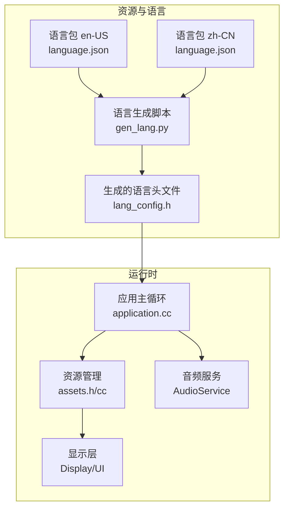
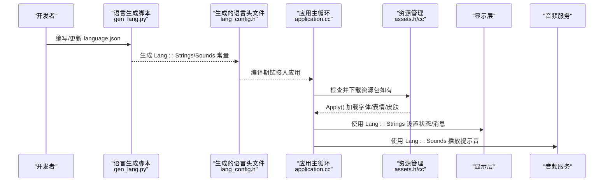
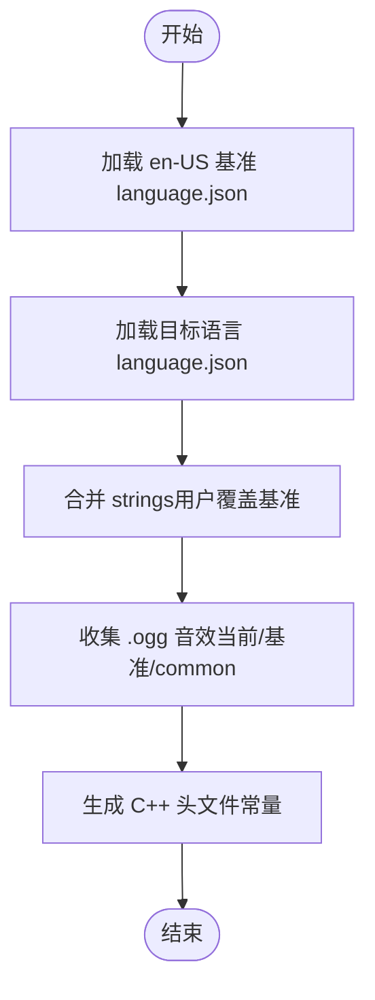
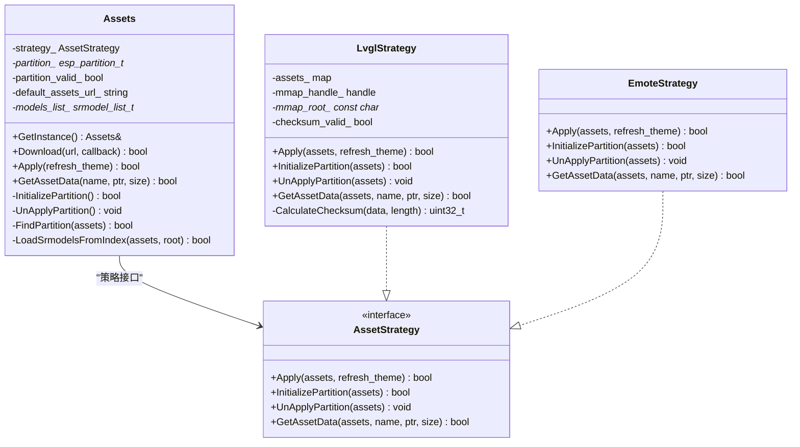
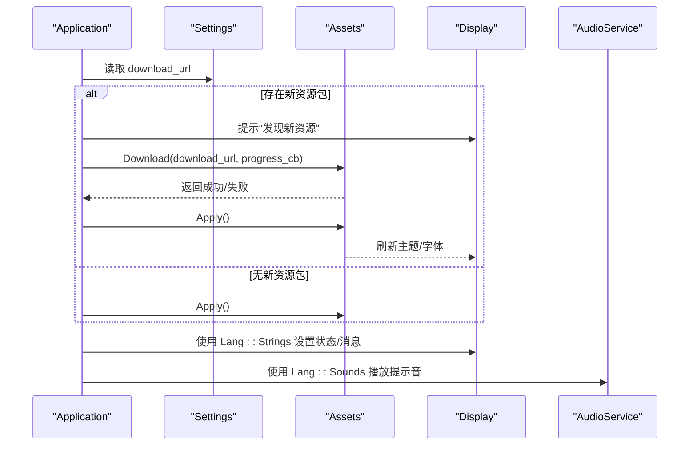
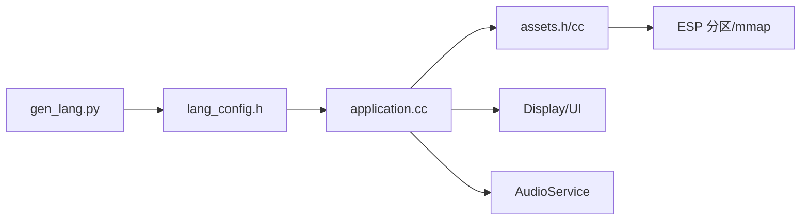

# 多语言国际化

<cite>
**本文引用的文件**   
- [assets.h](file://main/assets.h)
- [assets.cc](file://main/assets.cc)
- [application.cc](file://main/application.cc)
- [gen_lang.py](file://scripts/gen_lang.py)
- [language.json（en-US）](file://main/assets/locales/en-US/language.json)
- [language.json（zh-CN）](file://main/assets/locales/zh-CN/language.json)
</cite>

## 目录
1. [简介](#简介)
2. [项目结构](#项目结构)
3. [核心组件](#核心组件)
4. [架构总览](#架构总览)
5. [详细组件分析](#详细组件分析)
6. [依赖关系分析](#依赖关系分析)
7. [性能与资源考量](#性能与资源考量)
8. [故障排查指南](#故障排查指南)
9. [结论](#结论)
10. [附录：API 使用与最佳实践](#附录api-使用与最佳实践)

## 简介
本文件面向开发者，系统化阐述本项目中“多语言国际化”的完整实现方案。内容涵盖：
- 语言资源的组织与管理机制
- JSON 语言包结构与键值对规范
- 运行时语言切换与动态加载原理
- 新增语言支持的端到端流程（创建、编译集成、界面适配）
- 文本资源版本管理与更新策略
- 翻译工作流与协作规范
- 国际化 API 的使用指南与最佳实践

## 项目结构
多语言相关的关键位置与职责如下：
- 语言包源文件：位于 assets/locales/<语言代码>/language.json，采用统一的 JSON 结构定义字符串与元信息
- 构建期生成头文件：通过脚本将 language.json 编译为 C++ 常量头文件，供应用直接引用
- 运行时资源：Assets 模块负责从分区映射或外部资源加载字体、表情、皮肤等；语言文本在启动阶段即被注入 UI 与音频提示
- 应用入口：Application 在激活流程中检查并下载资源包，随后应用主题与字体，并在整个运行期间通过 Lang::Strings/Sounds 访问本地化文本与音效

图示来源
- [gen_lang.py:53-174](file://scripts/gen_lang.py#L53-L174)
- [assets.h:23-87](file://main/assets.h#L23-L87)
- [assets.cc:130-212](file://main/assets.cc#L130-L212)
- [application.cc:340-396](file://main/application.cc#L340-L396)

章节来源
- [gen_lang.py:1-187](file://scripts/gen_lang.py#L1-L187)
- [assets.h:1-90](file://main/assets.h#L1-L90)
- [assets.cc:1-615](file://main/assets.cc#L1-L615)
- [application.cc:1-800](file://main/application.cc#L1-L800)

## 核心组件
- 语言包定义（JSON）
  - 每个语言包包含 language.type 与 strings 字典，strings 中的键名需保持全局唯一且语义稳定，便于回退与合并
  - 基准语言为 en-US，其他语言可仅覆盖差异项，缺失键自动回退到 en-US
- 构建期生成器（Python 脚本）
  - 读取指定语言的 language.json，与 en-US 基准合并，生成 C++ 头文件，提供 Lang::Strings 与 Lang::Sounds 命名空间下的常量
  - 同时收集 .ogg 音效文件，生成对应的二进制嵌入符号与 std::string_view，支持按语言优先、公共目录兜底的音效选择
- 运行时资源管理（Assets）
  - 负责从 Flash 分区映射 index.json 等资源清单，加载字体、表情、皮肤等
  - 支持 OTA 下载新资源包并写入分区，完成后重新初始化映射表
- 应用集成（Application）
  - 在设备激活流程中检查并下载资源包，调用 Assets.Apply() 刷新主题与字体
  - 所有 UI 状态、通知、错误提示均通过 Lang::Strings 获取本地化文本，并通过 AudioService 播放对应音效

章节来源
- [language.json（en-US）:1-59](file://main/assets/locales/en-US/language.json#L1-L59)
- [language.json（zh-CN）:1-59](file://main/assets/locales/zh-CN/language.json#L1-L59)
- [gen_lang.py:32-100](file://scripts/gen_lang.py#L32-L100)
- [gen_lang.py:108-161](file://scripts/gen_lang.py#L108-L161)
- [assets.h:23-87](file://main/assets.h#L23-L87)
- [assets.cc:130-212](file://main/assets.cc#L130-L212)
- [application.cc:340-396](file://main/application.cc#L340-L396)

## 架构总览
下图展示了从语言包到运行时显示的端到端数据流与控制流。

图示来源
- [gen_lang.py:53-174](file://scripts/gen_lang.py#L53-L174)
- [assets.cc:214-358](file://main/assets.cc#L214-L358)
- [application.cc:340-396](file://main/application.cc#L340-L396)

## 详细组件分析

### 语言包结构与键值规范
- 文件路径约定
  - 每个语言包位于 main/assets/locales/<语言代码>/language.json
- JSON 结构要求
  - language.type：标识语言代码，如 en-US、zh-CN
  - strings：键值对集合，键名为大写英文字母与下划线组合，值为该语言的具体文案
- 回退策略
  - 构建时以 en-US 为基准，用户语言仅覆盖差异项；缺失键自动回退至 en-US
- 音效资源
  - 同目录下 .ogg 文件作为语言特定音效；common 目录提供公共音效；若当前语言缺少某音效，则回退到 en-US 同名文件

章节来源
- [language.json（en-US）:1-59](file://main/assets/locales/en-US/language.json#L1-L59)
- [language.json（zh-CN）:1-59](file://main/assets/locales/zh-CN/language.json#L1-L59)
- [gen_lang.py:32-100](file://scripts/gen_lang.py#L32-L100)
- [gen_lang.py:108-161](file://scripts/gen_lang.py#L108-L161)

### 构建期生成器（语言头文件）
- 输入输出
  - 输入：指定语言的 language.json
  - 输出：C++ 头文件，包含 Lang::Strings 与 Lang::Sounds 命名空间
- 合并逻辑
  - 先加载 en-US 基准，再合并用户语言 strings；统计基础、用户、总数与回退数量
- 音效处理
  - 收集当前语言、基准语言与 common 目录的 .ogg 文件，生成二进制嵌入符号与 string_view
  - 优先使用当前语言音效，不存在则回退到 en-US
- 模板与常量
  - 使用模板填充语言代码、字符串与音效常量，输出到 assets/lang_config.h

图示来源
- [gen_lang.py:32-100](file://scripts/gen_lang.py#L32-L100)
- [gen_lang.py:108-161](file://scripts/gen_lang.py#L108-L161)
- [gen_lang.py:163-174](file://scripts/gen_lang.py#L163-L174)

章节来源
- [gen_lang.py:1-187](file://scripts/gen_lang.py#L1-L187)

### 运行时资源管理（Assets）
- 分区映射与校验
  - 查找名为 assets 的分区，进行内存映射，计算并校验头部校验和，解析文件索引表
- 资源加载与应用
  - 解析 index.json，加载字体、表情集合、皮肤配置，必要时刷新显示主题
- 下载与升级
  - 支持从 HTTP 下载新资源包，分扇区擦写，进度回调，完成后重新初始化分区映射

图示来源
- [assets.h:23-87](file://main/assets.h#L23-L87)
- [assets.cc:130-212](file://main/assets.cc#L130-L212)
- [assets.cc:214-358](file://main/assets.cc#L214-L358)
- [assets.cc:361-426](file://main/assets.cc#L361-L426)
- [assets.cc:428-615](file://main/assets.cc#L428-L615)

章节来源
- [assets.h:1-90](file://main/assets.h#L1-L90)
- [assets.cc:1-615](file://main/assets.cc#L1-L615)

### 应用集成与运行时语言切换
- 启动与激活流程
  - 网络就绪后进入激活任务，先检查并下载资源包，再检查固件版本，最后初始化协议
- 资源下载与刷新
  - 若检测到新资源包，提示用户并执行下载，完成后调用 Assets.Apply() 刷新主题与字体
- 语言文本与音效使用
  - 所有 UI 状态、通知、错误提示均通过 Lang::Strings 获取本地化文本
  - 关键事件触发时通过 AudioService 播放 Lang::Sounds 中的音效

图示来源
- [application.cc:340-396](file://main/application.cc#L340-L396)
- [assets.cc:214-358](file://main/assets.cc#L214-L358)

章节来源
- [application.cc:323-396](file://main/application.cc#L323-L396)

## 依赖关系分析
- 构建期依赖
  - Python 脚本依赖标准库 json、os、argparse
  - 生成头文件被多个板级与业务模块 include，形成集中式语言常量入口
- 运行时依赖
  - Application 依赖 Board、Display、AudioService、Assets、Settings
  - Assets 依赖 ESP-IDF 分区与 SPI Flash mmap 能力
  - 语言常量通过编译期链接入二进制，避免运行时 I/O 开销

图示来源
- [gen_lang.py:53-174](file://scripts/gen_lang.py#L53-L174)
- [assets.cc:130-212](file://main/assets.cc#L130-L212)
- [application.cc:340-396](file://main/application.cc#L340-L396)

章节来源
- [gen_lang.py:1-187](file://scripts/gen_lang.py#L1-L187)
- [assets.cc:1-615](file://main/assets.cc#L1-L615)
- [application.cc:1-800](file://main/application.cc#L1-L800)

## 性能与资源考量
- 构建期优化
  - 字符串与音效常量在编译期嵌入，运行时零 I/O 开销
  - 音效以 string_view 形式提供，避免额外拷贝
- 运行时优化
  - 资源包通过内存映射访问，减少拷贝与延迟
  - 下载过程按扇区擦写，支持进度回调，避免长时间阻塞
- 内存与存储
  - 资源包大小受分区容量限制，下载前会校验内容长度与分区大小
  - 校验和验证确保资源完整性

[本节为通用指导，不直接分析具体文件]

## 故障排查指南
- 语言包解析失败
  - 检查 language.json 结构是否包含 language.type 与 strings
  - 确认 en-US 基准文件存在且可解析
- 音效缺失
  - 确认当前语言与 en-US 目录中存在对应 .ogg 文件
  - 公共音效应放置在 common 目录
- 资源下载失败
  - 检查网络连接与服务器可达性
  - 查看下载进度与速度日志，确认分区剩余空间足够
- 资源应用失败
  - 检查 index.json 是否存在且有效
  - 确认字体、表情、皮肤文件路径正确且可加载

章节来源
- [assets.cc:130-212](file://main/assets.cc#L130-L212)
- [assets.cc:214-358](file://main/assets.cc#L214-L358)
- [assets.cc:428-615](file://main/assets.cc#L428-L615)
- [gen_lang.py:32-100](file://scripts/gen_lang.py#L32-L100)

## 结论
本项目通过“JSON 语言包 + 构建期生成头文件 + 运行时资源管理”的分层设计，实现了高效、可扩展的多语言国际化体系。语言文本与音效在编译期静态嵌入，运行时通过统一 API 访问，既保证了性能，又简化了维护。结合 OTA 资源包下载与校验机制，系统可在不升级固件的情况下动态更新界面与交互体验。

[本节为总结性内容，不直接分析具体文件]

## 附录：API 使用与最佳实践

### 新增语言支持流程
- 准备语言包
  - 在 main/assets/locales/<新语言代码>/ 下创建 language.json，至少覆盖差异项，其余回退到 en-US
  - 如需自定义音效，放置 .ogg 文件于该语言目录；公共音效放入 common 目录
- 生成语言头文件
  - 运行脚本：python scripts/gen_lang.py --language <语言代码> --output main/assets/lang_config.h
  - 脚本将合并 en-US 基准并生成 Lang::Strings 与 Lang::Sounds 常量
- 编译与集成
  - 确保 lang_config.h 被需要使用的模块 include
  - 在 UI 与提示中使用 Lang::Strings 与 Lang::Sounds 访问文本与音效
- 界面适配
  - 根据语言特性调整布局与字体（例如中文/日文可能需要更宽字符集）
  - 通过 Assets.Apply() 刷新字体与主题，确保显示正常

章节来源
- [gen_lang.py:53-174](file://scripts/gen_lang.py#L53-L174)
- [assets.cc:214-358](file://main/assets.cc#L214-L358)

### 运行时语言切换与动态加载
- 语言切换时机
  - 建议在设备重启后生效，以确保资源与 UI 一致
- 动态加载机制
  - 通过 Assets.GetAssetData() 按需加载资源（如字体、表情、皮肤）
  - 资源包可通过 OTA 下载并写入分区，随后重新初始化映射表

章节来源
- [assets.h:23-87](file://main/assets.h#L23-L87)
- [assets.cc:130-212](file://main/assets.cc#L130-L212)
- [assets.cc:428-615](file://main/assets.cc#L428-L615)

### 文本资源版本管理与更新策略
- 资源包版本
  - index.json 中包含 version 字段，用于兼容性与升级控制
- 更新流程
  - 检测新资源包 URL，提示用户并下载，完成后 Apply() 刷新
  - 下载失败时给出明确错误提示，并允许重试

章节来源
- [assets.cc:214-358](file://main/assets.cc#L214-L358)
- [application.cc:340-396](file://main/application.cc#L340-L396)

### 翻译工作流与协作规范
- 基准先行
  - 以 en-US 为基准，新增语言仅覆盖差异项，降低重复工作量
- 键名规范
  - 使用大写英文字母与下划线组合，语义清晰、稳定不变
- 音效管理
  - 语言特定音效优先，公共音效共享，缺失时回退到 en-US
- 审核与回归
  - 每次变更语言包后，运行生成脚本并验证 UI 与音效表现

章节来源
- [gen_lang.py:32-100](file://scripts/gen_lang.py#L32-L100)
- [gen_lang.py:108-161](file://scripts/gen_lang.py#L108-L161)

### 国际化 API 使用指南与最佳实践
- 文本访问
  - 使用 Lang::Strings::KEY 获取本地化文本，避免硬编码字符串
- 音效播放
  - 使用 Lang::Sounds::OGG_* 播放提示音，确保音效文件存在
- 资源加载
  - 通过 Assets.GetAssetData() 获取资源指针与大小，注意校验魔数与有效性
- 错误处理
  - 对资源加载与下载失败进行日志记录与用户提示，保证用户体验

章节来源
- [application.cc:340-396](file://main/application.cc#L340-L396)
- [assets.cc:130-212](file://main/assets.cc#L130-L212)