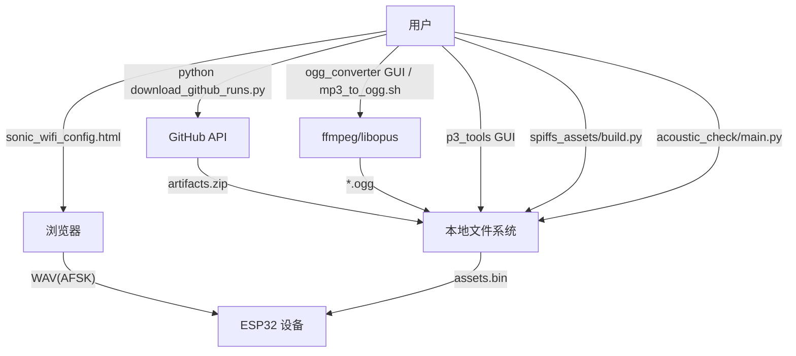
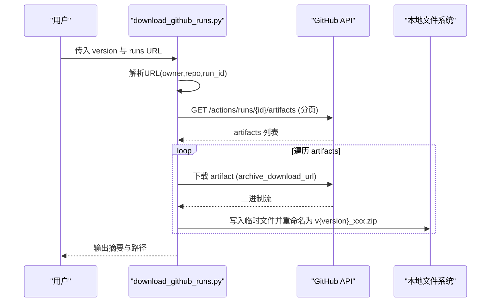
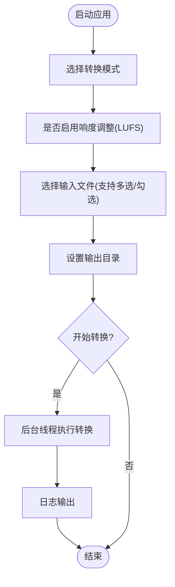
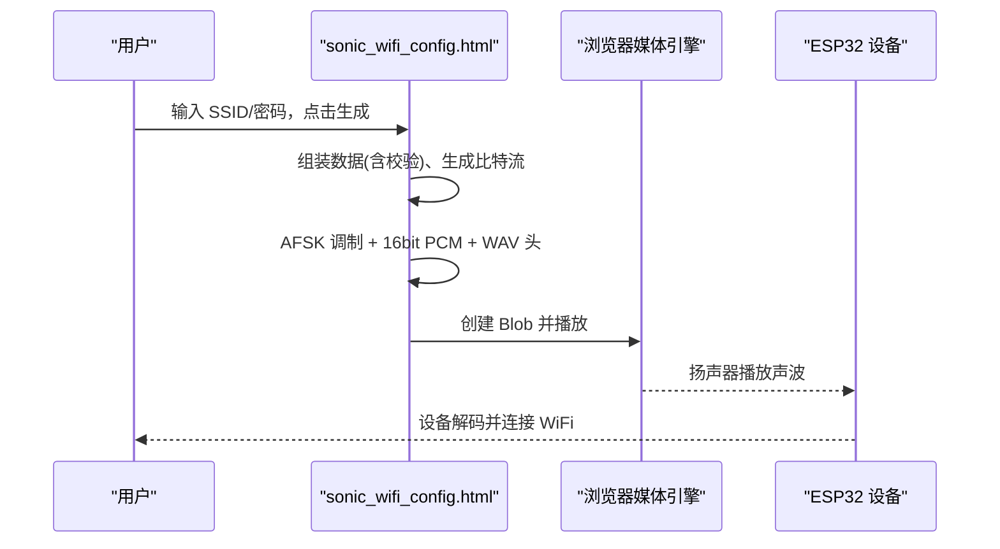
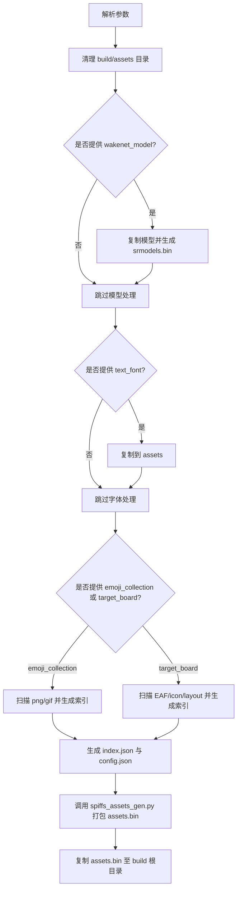
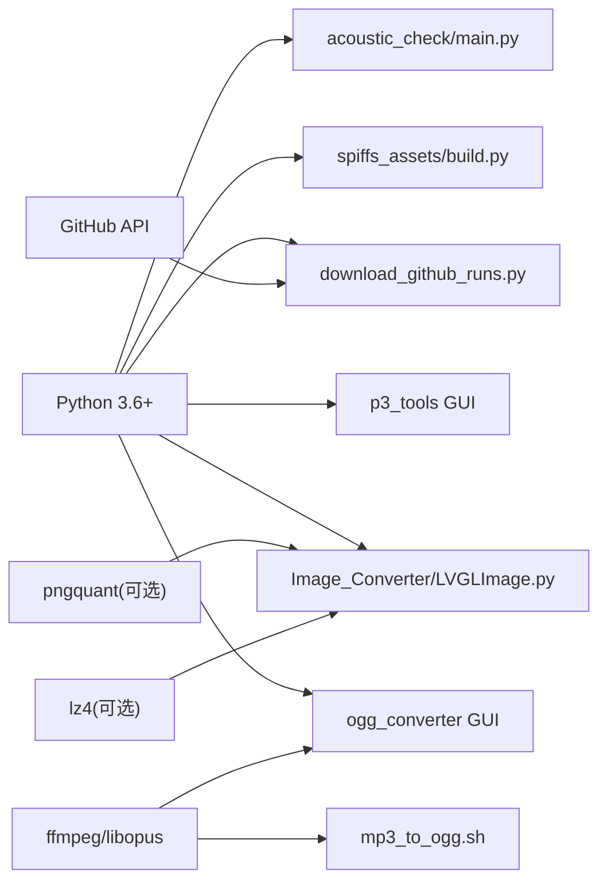

# 实用工具脚本

<cite>
**本文引用的文件**   
- [scripts/download_github_runs.py](file://scripts/download_github_runs.py)
- [scripts/ogg_converter/xiaozhi_ogg_converter.py](file://scripts/ogg_converter/xiaozhi_ogg_converter.py)
- [scripts/mp3_to_ogg.sh](file://scripts/mp3_to_ogg.sh)
- [scripts/sonic_wifi_config.html](file://scripts/sonic_wifi_config.html)
- [scripts/spiffs_assets/README.md](file://scripts/spiffs_assets/README.md)
- [scripts/spiffs_assets/build.py](file://scripts/spiffs_assets/build.py)
- [scripts/Image_Converter/README.md](file://scripts/Image_Converter/README.md)
- [scripts/Image_Converter/LVGLImage.py](file://scripts/Image_Converter/LVGLImage.py)
- [scripts/acoustic_check/readme.md](file://scripts/acoustic_check/readme.md)
- [scripts/acoustic_check/main.py](file://scripts/acoustic_check/main.py)
- [scripts/p3_tools/batch_convert_gui.py](file://scripts/p3_tools/batch_convert_gui.py)
- [scripts/p3_tools/requirements.txt](file://scripts/p3_tools/requirements.txt)
</cite>

## 目录
1. [简介](#简介)
2. [项目结构](#项目结构)
3. [核心组件](#核心组件)
4. [架构总览](#架构总览)
5. [详细组件分析](#详细组件分析)
6. [依赖关系分析](#依赖关系分析)
7. [性能与使用建议](#性能与使用建议)
8. [故障排查指南](#故障排查指南)
9. [结论](#结论)
10. [附录：扩展与二次开发](#附录扩展与二次开发)

## 简介
本文件面向开发者与使用者，系统化说明仓库 scripts 目录下的实用工具脚本，包括：
- GitHub Actions 构建产物下载与版本管理
- 音频格式转换（OGG、P3）的图形化与命令行工具
- WiFi 声波配网页面的定制与部署方法
- SPIFFS 资源打包工具的使用流程
- LVGL 图片转换工具的使用要点
- 声学调试与波形测试工具
- 脚本自定义开发与扩展方法

## 项目结构
scripts 目录按功能划分为多个子工具集：
- download_github_runs.py：从 GitHub Actions 运行记录中批量下载产物并统一命名
- ogg_converter：基于 ffmpeg 的 OGG 批量转换 GUI
- mp3_to_ogg.sh：命令行一键将 MP3 转为 OPUS/OGG
- sonic_wifi_config.html：浏览器端生成 AFSK 声波以完成设备配网
- spiffs_assets：SPIFFS 资源分区构建工具链（模型、字体、表情、图标、布局等）
- Image_Converter：LVGL 图片转换工具（含 GUI 入口与底层转换库）
- acoustic_check：UDP PCM 实时监听与频谱/时域可视化，辅助声波解码验证
- p3_tools：P3 封装/解封装与批量转换 GUI

```mermaid
graph TB
subgraph "下载与发布"
DGR["download_github_runs.py"]
end
subgraph "音频处理"
OGGGUI["ogg_converter/xiaozhi_ogg_converter.py"]
MP3SH["mp3_to_ogg.sh"]
P3GUI["p3_tools/batch_convert_gui.py"]
end
subgraph "配网工具"
WIFIHTML["sonic_wifi_config.html"]
end
subgraph "资源打包"
SP_README["spiffs_assets/README.md"]
SP_BUILD["spiffs_assets/build.py"]
end
subgraph "图像与显示"
IMG_README["Image_Converter/README.md"]
LVGLIMG["Image_Converter/LVGLImage.py"]
end
subgraph "声学调试"
AC_README["acoustic_check/readme.md"]
AC_MAIN["acoustic_check/main.py"]
end
DGR --> |"输出到 releases/<version>"| Releases["本地 releases 目录"]
OGGGUI --> |"ffmpeg/libopus"| OGGOUT["*.ogg"]
MP3SH --> |"ffmpeg/libopus"| OGGOUT
P3GUI --> |"libopus/opuslib"| P3OUT["*.p3"]
WIFIHTML --> |"AFSK 调制 WAV"| Device["ESP32 设备"]
SP_BUILD --> |"assets.bin"| Flash["烧录到 SPIFFS"]
LVGLIMG --> |"C数组/BIN"| LVGLBIN["LVGL 资源"]
AC_MAIN --> |"UDP PCM 接收/绘图"| Acoustic["声学调试界面"]
```

图表来源
- [scripts/download_github_runs.py:183-295](file://scripts/download_github_runs.py#L183-L295)
- [scripts/ogg_converter/xiaozhi_ogg_converter.py:164-225](file://scripts/ogg_converter/xiaozhi_ogg_converter.py#L164-L225)
- [scripts/mp3_to_ogg.sh:1-4](file://scripts/mp3_to_ogg.sh#L1-L4)
- [scripts/sonic_wifi_config.html:172-199](file://scripts/sonic_wifi_config.html#L172-L199)
- [scripts/spiffs_assets/README.md:1-111](file://scripts/spiffs_assets/README.md#L1-L111)
- [scripts/spiffs_assets/build.py:340-400](file://scripts/spiffs_assets/build.py#L340-L400)
- [scripts/Image_Converter/README.md:1-46](file://scripts/Image_Converter/README.md#L1-L46)
- [scripts/Image_Converter/LVGLImage.py:745-786](file://scripts/Image_Converter/LVGLImage.py#L745-L786)
- [scripts/acoustic_check/readme.md:1-23](file://scripts/acoustic_check/readme.md#L1-L23)
- [scripts/acoustic_check/main.py:1-19](file://scripts/acoustic_check/main.py#L1-L19)

章节来源
- [scripts/spiffs_assets/README.md:1-111](file://scripts/spiffs_assets/README.md#L1-L111)
- [scripts/Image_Converter/README.md:1-46](file://scripts/Image_Converter/README.md#L1-L46)
- [scripts/acoustic_check/readme.md:1-23](file://scripts/acoustic_check/readme.md#L1-L23)

## 核心组件
本节聚焦各工具的核心能力与典型用法。

- GitHub Actions 产物下载器
  - 支持解析 run URL、分页拉取 artifacts、流式下载、自动重命名为 v<version>_xxx.zip，默认输出到 releases/<version>
  - 通过环境变量 GITHUB_TOKEN 鉴权
  - 可指定自定义输出目录

- OGG 音频转换 GUI
  - 支持“音频转 OGG”和“OGG 转回音频”两种模式
  - 可选响度归一化（LUFS），默认 -16 LUFS
  - 批量选择、勾选、移除、清空；线程后台执行，日志实时输出

- MP3 转 OGG 命令行脚本
  - 单行调用，参数为输入 MP3 与输出 OGG 路径
  - 编码参数：libopus、16k、单声道、16kHz、帧时长 60ms

- WiFi 声波配网页面
  - 浏览器内对 SSID+密码进行校验和拼接，AFSK 调制为 PCM，封装为 WAV Blob 播放
  - 支持循环播放，便于设备侧麦克风采集解码

- SPIFFS 资源打包工具
  - 支持唤醒网络模型、文本字体、表情集合、图标、布局 JSON 的收集与索引
  - 生成 index.json 与 config.json，最终打包为 assets.bin

- LVGL 图片转换工具
  - 提供 GUI 批量转换与底层 LVGLImage 库（支持多种颜色格式、压缩、预乘 alpha、C 数组导出）

- 声学调试工具
  - UDP 接收固件回传的 PCM，绘制时域/频域图，辅助评估噪声与 AFSK 解码稳定性

- P3 工具集
  - 提供音频与 P3 互转的 GUI，支持响度调整与批量操作

章节来源
- [scripts/download_github_runs.py:183-295](file://scripts/download_github_runs.py#L183-L295)
- [scripts/ogg_converter/xiaozhi_ogg_converter.py:164-225](file://scripts/ogg_converter/xiaozhi_ogg_converter.py#L164-L225)
- [scripts/mp3_to_ogg.sh:1-4](file://scripts/mp3_to_ogg.sh#L1-L4)
- [scripts/sonic_wifi_config.html:172-199](file://scripts/sonic_wifi_config.html#L172-L199)
- [scripts/spiffs_assets/build.py:340-400](file://scripts/spiffs_assets/build.py#L340-L400)
- [scripts/Image_Converter/LVGLImage.py:745-786](file://scripts/Image_Converter/LVGLImage.py#L745-L786)
- [scripts/acoustic_check/main.py:1-19](file://scripts/acoustic_check/main.py#L1-L19)
- [scripts/p3_tools/batch_convert_gui.py:165-216](file://scripts/p3_tools/batch_convert_gui.py#L165-L216)

## 架构总览
下图展示了各工具之间的数据流向与外部依赖关系。

图表来源
- [scripts/download_github_runs.py:46-94](file://scripts/download_github_runs.py#L46-L94)
- [scripts/ogg_converter/xiaozhi_ogg_converter.py:189-206](file://scripts/ogg_converter/xiaozhi_ogg_converter.py#L189-L206)
- [scripts/mp3_to_ogg.sh:1-4](file://scripts/mp3_to_ogg.sh#L1-L4)
- [scripts/sonic_wifi_config.html:172-199](file://scripts/sonic_wifi_config.html#L172-L199)
- [scripts/spiffs_assets/build.py:384-396](file://scripts/spiffs_assets/build.py#L384-L396)
- [scripts/acoustic_check/main.py:1-19](file://scripts/acoustic_check/main.py#L1-L19)

## 详细组件分析

### GitHub Actions 下载器（download_github_runs.py）
- 功能要点
  - 解析 run URL，获取 owner/repo/run_id
  - 分页请求 artifacts 列表，流式下载每个 artifact
  - 按规则重命名：去除前缀与哈希后缀，添加版本前缀，统一 .zip 扩展名
  - 默认输出到 releases/<version>，支持 --output-dir 覆盖
  - 通过 .env 中的 GITHUB_TOKEN 鉴权
- 关键流程
  - 参数解析 → 读取 Token → 解析 URL → 拉取 artifacts → 遍历下载并重命名 → 汇总统计

图表来源
- [scripts/download_github_runs.py:25-43](file://scripts/download_github_runs.py#L25-L43)
- [scripts/download_github_runs.py:46-94](file://scripts/download_github_runs.py#L46-L94)
- [scripts/download_github_runs.py:97-123](file://scripts/download_github_runs.py#L97-L123)
- [scripts/download_github_runs.py:125-169](file://scripts/download_github_runs.py#L125-L169)
- [scripts/download_github_runs.py:183-295](file://scripts/download_github_runs.py#L183-L295)

章节来源
- [scripts/download_github_runs.py:183-295](file://scripts/download_github_runs.py#L183-L295)

### OGG 音频转换 GUI（xiaozhi_ogg_converter.py）
- 功能要点
  - 双模式：音频→OGG、OGG→音频
  - 可选响度归一化（LUFS），默认 -16 LUFS
  - 批量选择、勾选、移除、清空；多线程执行，日志窗口实时刷新
  - 使用 ffmpeg 调用 libopus 编码器
- 交互流程
  - 选择模式 → 配置响度 → 选择输入文件 → 设置输出目录 → 开始转换 → 查看日志

图表来源
- [scripts/ogg_converter/xiaozhi_ogg_converter.py:8-24](file://scripts/ogg_converter/xiaozhi_ogg_converter.py#L8-L24)
- [scripts/ogg_converter/xiaozhi_ogg_converter.py:164-225](file://scripts/ogg_converter/xiaozhi_ogg_converter.py#L164-L225)

章节来源
- [scripts/ogg_converter/xiaozhi_ogg_converter.py:164-225](file://scripts/ogg_converter/xiaozhi_ogg_converter.py#L164-L225)

### MP3 转 OGG 命令行脚本（mp3_to_ogg.sh）
- 用法
  - 传入两个参数：输入 MP3 路径、输出 OGG 路径
  - 内部调用 ffmpeg，编码参数：libopus、码率 16k、单声道、采样率 16kHz、帧时长 60ms
- 适用场景
  - CI/CD 或批处理流水线中快速将 MP3 转换为设备端使用的 OGG

章节来源
- [scripts/mp3_to_ogg.sh:1-4](file://scripts/mp3_to_ogg.sh#L1-L4)

### WiFi 声波配网页面（sonic_wifi_config.html）
- 功能要点
  - 在浏览器中生成 AFSK 调制的 WAV 音频，包含 SSID 与密码
  - 支持循环播放，方便设备侧持续采集
  - 前端实现：字节校验、位流生成、AFSK 正弦波合成、PCM 转 16bit、WAV 头拼装
- 部署方式
  - 可直接双击打开 HTML 使用
  - 也可部署到任意静态 Web 服务器供手机/平板访问

图表来源
- [scripts/sonic_wifi_config.html:101-134](file://scripts/sonic_wifi_config.html#L101-L134)
- [scripts/sonic_wifi_config.html:136-170](file://scripts/sonic_wifi_config.html#L136-L170)
- [scripts/sonic_wifi_config.html:172-199](file://scripts/sonic_wifi_config.html#L172-L199)

章节来源
- [scripts/sonic_wifi_config.html:172-199](file://scripts/sonic_wifi_config.html#L172-L199)

### SPIFFS 资源打包工具（spiffs_assets/build.py）
- 功能要点
  - 处理唤醒网络模型（生成 srmodels.bin）、文本字体、表情集合、图标、布局 JSON
  - 生成 index.json 与 config.json，调用 spiffs_assets_gen.py 打包为 assets.bin
  - 支持目标板集合（EAF 动画、icon、layout）合并处理
- 典型命令
  - 完整构建：传入 wakenet_model、text_font、emoji_collection
  - 仅处理字体或表情：按需传入对应参数
  - 目标板模式：传入 res_path 与 target_board，自动扫描 EAF/icon/layout

图表来源
- [scripts/spiffs_assets/build.py:340-400](file://scripts/spiffs_assets/build.py#L340-L400)
- [scripts/spiffs_assets/README.md:52-88](file://scripts/spiffs_assets/README.md#L52-L88)

章节来源
- [scripts/spiffs_assets/README.md:1-111](file://scripts/spiffs_assets/README.md#L1-L111)
- [scripts/spiffs_assets/build.py:340-400](file://scripts/spiffs_assets/build.py#L340-L400)

### LVGL 图片转换工具（Image_Converter）
- 工具组成
  - LVGLImage.py：底层转换库，支持多颜色格式、RLE/LZ4 压缩、预乘 alpha、C 数组导出、bin 读写
  - lvgl_tools_gui.py：GUI 入口，批量转换图片为 LVGL 格式
- 使用要点
  - 安装依赖后运行 GUI，选择输入图片与输出目录，自动识别最佳颜色格式
  - 适用于替换默认表情或批量生成 LVGL 资源

章节来源
- [scripts/Image_Converter/README.md:1-46](file://scripts/Image_Converter/README.md#L1-L46)
- [scripts/Image_Converter/LVGLImage.py:745-786](file://scripts/Image_Converter/LVGLImage.py#L745-L786)

### 声学调试工具（acoustic_check）
- 功能要点
  - 基于 Qt GUI + Matplotlib + UDP 接收 PCM，绘制时域/频域
  - 用于评估噪声分布与 AFSK 解码准确性
  - 配合 sonic_wifi_config.html 输出声波进行测试
- 使用前提
  - 固件需开启 USE_AUDIO_DEBUGGER，并配置 AUDIO_DEBUG_UDP_SERVER 为本机地址

章节来源
- [scripts/acoustic_check/readme.md:1-23](file://scripts/acoustic_check/readme.md#L1-L23)
- [scripts/acoustic_check/main.py:1-19](file://scripts/acoustic_check/main.py#L1-L19)

### P3 工具集（p3_tools）
- 功能要点
  - 提供音频与 P3 互转的 GUI，支持批量选择、勾选、移除、清空
  - 支持响度归一化（LUFS），默认 -16 LUFS
  - 依赖 librosa、opuslib、numpy、tqdm、sounddevice、pyloudnorm、soundfile
- 使用流程
  - 选择模式（音频→P3 或 P3→音频）→ 选择文件 → 设置输出目录 → 开始转换 → 查看日志

章节来源
- [scripts/p3_tools/batch_convert_gui.py:165-216](file://scripts/p3_tools/batch_convert_gui.py#L165-L216)
- [scripts/p3_tools/requirements.txt:1-8](file://scripts/p3_tools/requirements.txt#L1-L8)

## 依赖关系分析
- Python 环境
  - 多数脚本需要 Python 3.6+
  - OGG/P3 工具依赖 ffmpeg 与相关 Python 包（如 opuslib、librosa、pyloudnorm 等）
- 外部工具
  - ffmpeg：音频编解码核心
  - pngquant（可选）：LVGL 图片压缩预处理
  - lz4：LVGL 图片压缩算法
- 网络与权限
  - GitHub 下载器需要有效的 GITHUB_TOKEN（建议通过 .env 注入）

图表来源
- [scripts/ogg_converter/xiaozhi_ogg_converter.py:189-206](file://scripts/ogg_converter/xiaozhi_ogg_converter.py#L189-L206)
- [scripts/mp3_to_ogg.sh:1-4](file://scripts/mp3_to_ogg.sh#L1-L4)
- [scripts/p3_tools/requirements.txt:1-8](file://scripts/p3_tools/requirements.txt#L1-L8)
- [scripts/Image_Converter/LVGLImage.py:69-96](file://scripts/Image_Converter/LVGLImage.py#L69-L96)
- [scripts/download_github_runs.py:46-94](file://scripts/download_github_runs.py#L46-L94)

章节来源
- [scripts/p3_tools/requirements.txt:1-8](file://scripts/p3_tools/requirements.txt#L1-L8)
- [scripts/Image_Converter/LVGLImage.py:69-96](file://scripts/Image_Converter/LVGLImage.py#L69-L96)
- [scripts/download_github_runs.py:46-94](file://scripts/download_github_runs.py#L46-L94)

## 性能与使用建议
- 批量下载
  - 合理设置 per_page 与分页逻辑，避免一次性拉取过多导致超时
  - 使用流式下载减少内存占用
- 音频转换
  - 批量任务建议分批次执行，避免长时间阻塞 UI
  - 响度归一化会增加 CPU 开销，可在大批量任务中按需关闭
- 资源打包
  - 控制 assets.bin 大小，确保不超过 SPIFFS 分区限制
  - 提前准备高质量源素材，减少重复打包时间
- 声波配网
  - 在安静环境下播放声波，提高设备侧解码成功率
  - 适当增大音量，避免环境噪声干扰

[本节为通用建议，不直接分析具体文件]

## 故障排查指南
- GitHub 下载失败
  - 检查 .env 中 GITHUB_TOKEN 是否正确
  - 确认 run URL 格式正确且该 run 存在 artifacts
  - 网络问题可重试或更换代理
- 音频转换失败
  - 确认已安装 ffmpeg 且可被系统调用
  - 检查输入文件是否损坏或格式不支持
  - 若启用响度归一化，检查依赖库是否安装完整
- 声波配网无效
  - 确认浏览器允许媒体播放与自动循环
  - 设备侧需开启相应调试开关并配置正确的 UDP 服务器地址
- SPIFFS 打包错误
  - 检查输入路径是否存在，子脚本是否在同一目录
  - 关注生成的 index.json 与 config.json 内容是否符合预期

章节来源
- [scripts/download_github_runs.py:204-212](file://scripts/download_github_runs.py#L204-L212)
- [scripts/acoustic_check/readme.md:1-23](file://scripts/acoustic_check/readme.md#L1-L23)
- [scripts/spiffs_assets/README.md:97-111](file://scripts/spiffs_assets/README.md#L97-L111)

## 结论
本仓库的 scripts 目录提供了从构建产物管理、音频处理、配网工具到资源打包与图像转换的一整套实用工具。通过合理的组合与扩展，可以显著提升开发与发布效率，同时保证设备端资源的可用性与一致性。

[本节为总结性内容，不直接分析具体文件]

## 附录：扩展与二次开发
- 新增下载器过滤规则
  - 在重命名函数中增加匹配规则，支持更多文件名模式
  - 增加跳过条件（例如只下载特定平台产物）
- 扩展音频转换器
  - 在 GUI 中增加新的输出格式选项（如 flac、aac）
  - 集成更多响度标准（EBUR128、ITU-R BS.1770）
- 增强 SPIFFS 打包
  - 支持更多资源类型（视频片段、动态图标）
  - 增加增量打包与差异更新机制
- 改进 LVGL 转换
  - 增加 dithering 与量化策略的可配置项
  - 支持更高效的压缩后端（如 zstd）
- 完善声学调试
  - 增加自动降噪与峰值检测
  - 支持录制回放与对比分析

[本节为概念性指导，不直接分析具体文件]