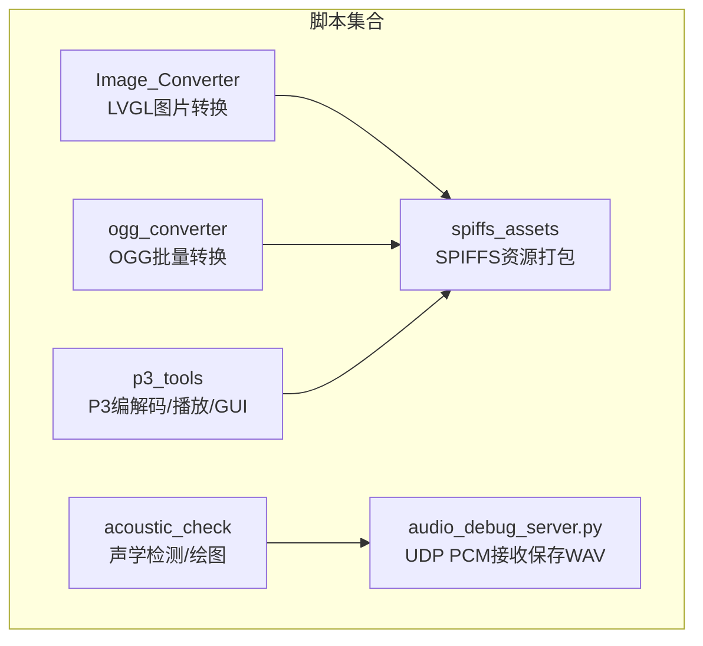
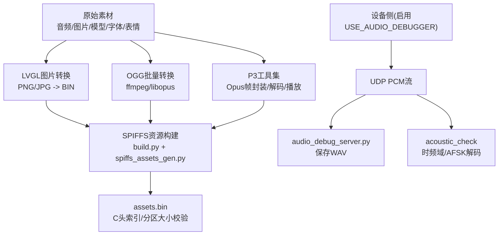
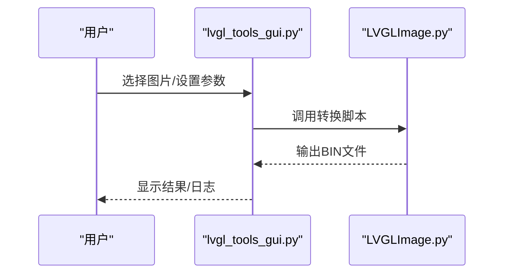
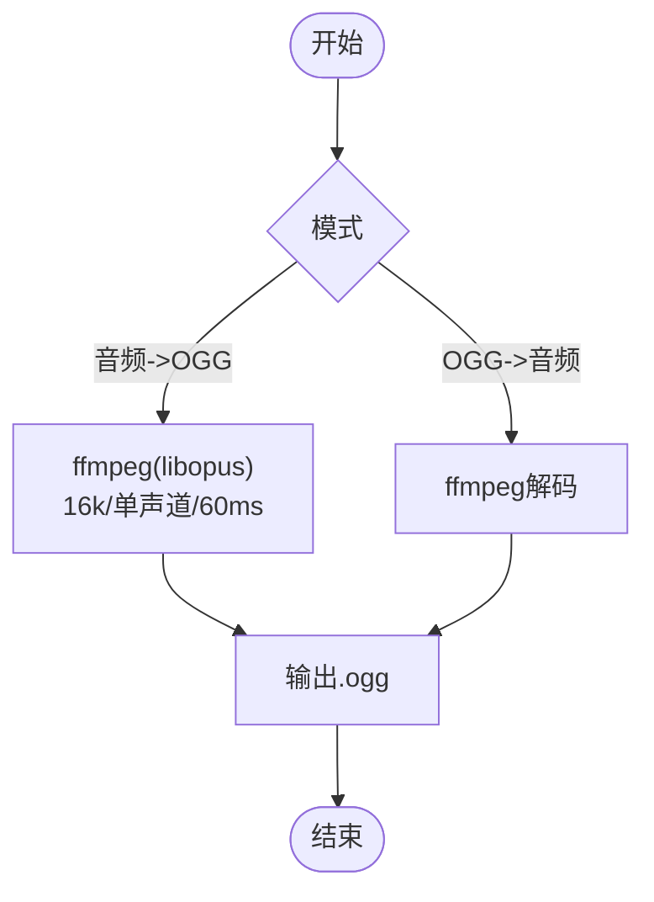
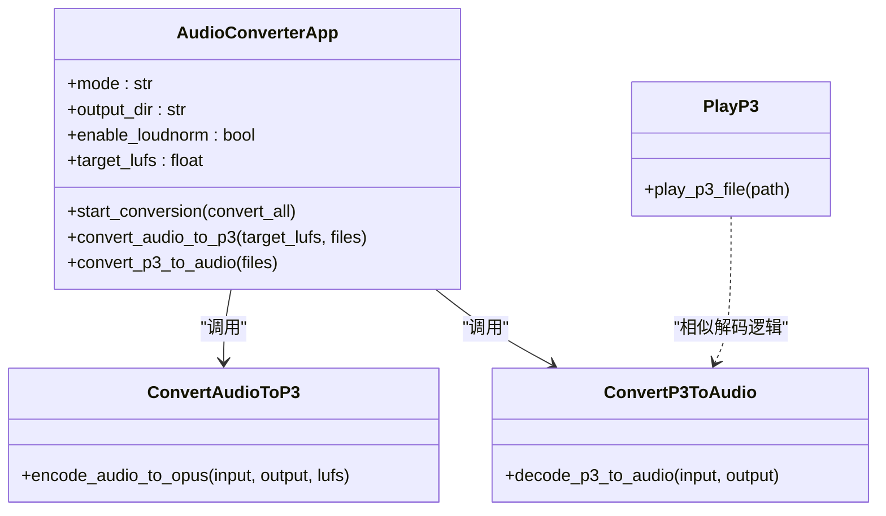
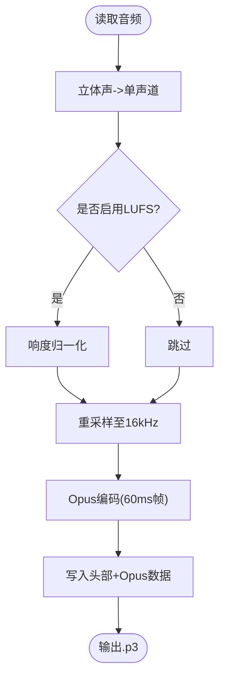
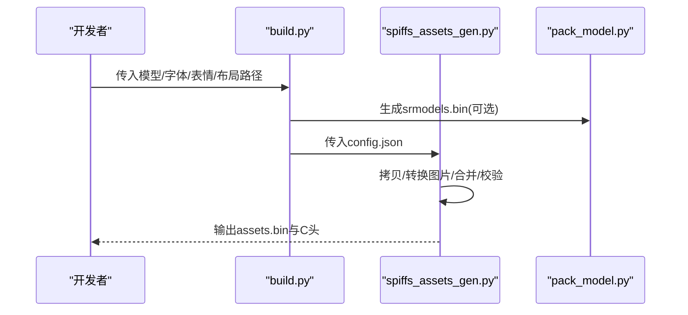
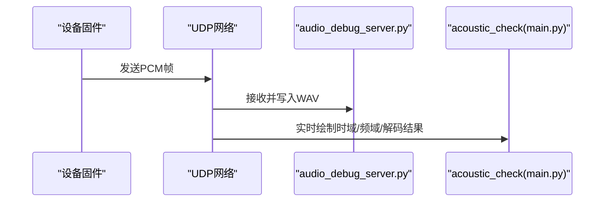
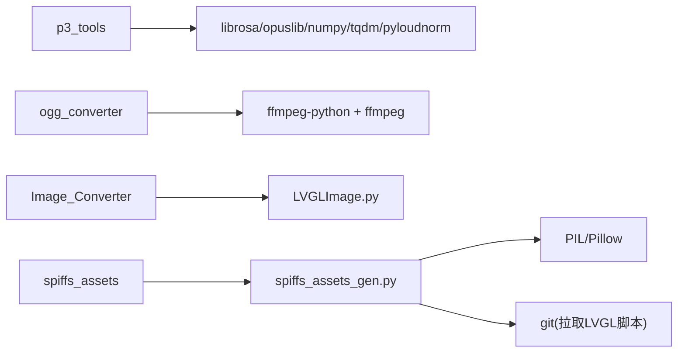

# 开发工具和脚本

<cite>
**本文引用的文件**   
- [README.md](file://README.md)
- [scripts/Image_Converter/README.md](file://scripts/Image_Converter/README.md)
- [scripts/acoustic_check/readme.md](file://scripts/acoustic_check/readme.md)
- [scripts/acoustic_check/main.py](file://scripts/acoustic_check/main.py)
- [scripts/audio_debug_server.py](file://scripts/audio_debug_server.py)
- [scripts/ogg_converter/README.md](file://scripts/ogg_converter/README.md)
- [scripts/ogg_converter/xiaozhi_ogg_converter.py](file://scripts/ogg_converter/xiaozhi_ogg_converter.py)
- [scripts/p3_tools/batch_convert_gui.py](file://scripts/p3_tools/batch_convert_gui.py)
- [scripts/p3_tools/convert_audio_to_p3.py](file://scripts/p3_tools/convert_audio_to_p3.py)
- [scripts/p3_tools/convert_p3_to_audio.py](file://scripts/p3_tools/convert_p3_to_audio.py)
- [scripts/p3_tools/play_p3.py](file://scripts/p3_tools/play_p3.py)
- [scripts/spiffs_assets/README.md](file://scripts/spiffs_assets/README.md)
- [scripts/spiffs_assets/build.py](file://scripts/spiffs_assets/build.py)
- [scripts/spiffs_assets/spiffs_assets_gen.py](file://scripts/spiffs_assets/spiffs_assets_gen.py)
- [scripts/spiffs_assets/pack_model.py](file://scripts/spiffs_assets/pack_model.py)
</cite>

## 目录
1. [简介](#简介)
2. [项目结构](#项目结构)
3. [核心组件](#核心组件)
4. [架构总览](#架构总览)
5. [详细组件分析](#详细组件分析)
6. [依赖关系分析](#依赖关系分析)
7. [性能与体积优化建议](#性能与体积优化建议)
8. [故障排查指南](#故障排查指南)
9. [结论](#结论)
10. [附录：常用任务速查](#附录常用任务速查)

## 简介
本指南聚焦于仓库中的“开发工具与脚本”，覆盖构建系统与自动化脚本、资源打包（音频转换、图片压缩、SPIFFS镜像生成）、音频调试（声学检测、质量分析、波形可视化）、P3音频格式工具（格式转换、播放测试、批量处理），并提供自定义工具开发的模板与示例。读者可据此快速搭建本地工具链，完成从素材到固件资源的端到端流水线。

## 项目结构
scripts 目录下按功能划分多个子工具集：
- Image_Converter：LVGL 图片转换与 GUI 批量处理
- acoustic_check：声波/时频域分析与解码验证
- ogg_converter：OGG 批量转换（基于 ffmpeg）
- p3_tools：P3 协议流（Opus 帧封装）的编解码、播放与批量 GUI
- spiffs_assets：SPIFFS 资源分区构建（模型、字体、表情、布局等）
- 其他：音频调试 UDP 服务器、语言生成、版本管理等辅助脚本

图表来源
- [scripts/Image_Converter/README.md](file://scripts/Image_Converter/README.md)
- [scripts/acoustic_check/readme.md](file://scripts/acoustic_check/readme.md)
- [scripts/ogg_converter/README.md](file://scripts/ogg_converter/README.md)
- [scripts/p3_tools/batch_convert_gui.py](file://scripts/p3_tools/batch_convert_gui.py)
- [scripts/spiffs_assets/README.md](file://scripts/spiffs_assets/README.md)
- [scripts/audio_debug_server.py](file://scripts/audio_debug_server.py)

章节来源
- [README.md](file://README.md)

## 核心组件
- LVGL 图片转换工具：将 PNG/JPG 等转换为 LVGL 兼容的二进制格式，支持批量与多分辨率；GUI 自动选择最佳颜色格式。
- OGG 批量转换器：基于 ffmpeg-python，提供音频与 OGG 互转、响度调整（LUFS）。
- P3 工具集：实现 P3 协议流（固定头部 + Opus 数据）的编码/解码/播放，并提供批量 GUI 和命令行工具。
- SPIFFS 资源构建器：统一处理唤醒模型、字体、表情图标与布局配置，生成 assets.bin 并输出 C 头索引。
- 声学检查工具：通过 UDP 接收设备回传的 PCM，进行时域/频域可视化与 AFSK 解码校验。
- 音频调试服务器：UDP 接收 PCM 并保存为 WAV，便于离线分析。

章节来源
- [scripts/Image_Converter/README.md](file://scripts/Image_Converter/README.md)
- [scripts/ogg_converter/README.md](file://scripts/ogg_converter/README.md)
- [scripts/p3_tools/batch_convert_gui.py](file://scripts/p3_tools/batch_convert_gui.py)
- [scripts/spiffs_assets/README.md](file://scripts/spiffs_assets/README.md)
- [scripts/acoustic_check/readme.md](file://scripts/acoustic_check/readme.md)
- [scripts/audio_debug_server.py](file://scripts/audio_debug_server.py)

## 架构总览
下图展示了从素材到最终资源分区的整体流程，以及调试链路。

图表来源
- [scripts/spiffs_assets/build.py](file://scripts/spiffs_assets/build.py)
- [scripts/spiffs_assets/spiffs_assets_gen.py](file://scripts/spiffs_assets/spiffs_assets_gen.py)
- [scripts/ogg_converter/xiaozhi_ogg_converter.py](file://scripts/ogg_converter/xiaozhi_ogg_converter.py)
- [scripts/p3_tools/convert_audio_to_p3.py](file://scripts/p3_tools/convert_audio_to_p3.py)
- [scripts/p3_tools/convert_p3_to_audio.py](file://scripts/p3_tools/convert_p3_to_audio.py)
- [scripts/audio_debug_server.py](file://scripts/audio_debug_server.py)
- [scripts/acoustic_check/main.py](file://scripts/acoustic_check/main.py)

## 详细组件分析

### 1) LVGL 图片转换工具
- 目标：将位图转换为 LVGL 二进制格式，适配不同 LVGL 版本与颜色格式。
- 关键能力：
  - 图形化批量转换，自动识别输入格式并选择最佳颜色格式。
  - 多分辨率支持，便于为不同屏幕尺寸准备资源。
- 使用要点：
  - 创建虚拟环境并安装依赖后运行 GUI。
  - 适用于修改默认表情或 UI 贴图。

图表来源
- [scripts/Image_Converter/README.md](file://scripts/Image_Converter/README.md)

章节来源
- [scripts/Image_Converter/README.md](file://scripts/Image_Converter/README.md)

### 2) OGG 批量转换器
- 目标：将任意音频转为小智可用的 OGG（libopus，16k 单声道，60ms 帧长），或反向转换。
- 依赖：系统需安装 ffmpeg，并通过 ffmpeg-python 调用。
- 特性：
  - 可选响度归一化（LUFS），提升一致性听感。
  - 批量操作与进度日志。

图表来源
- [scripts/ogg_converter/xiaozhi_ogg_converter.py](file://scripts/ogg_converter/xiaozhi_ogg_converter.py)
- [scripts/ogg_converter/README.md](file://scripts/ogg_converter/README.md)

章节来源
- [scripts/ogg_converter/README.md](file://scripts/ogg_converter/README.md)
- [scripts/ogg_converter/xiaozhi_ogg_converter.py](file://scripts/ogg_converter/xiaozhi_ogg_converter.py)

### 3) P3 音频格式工具
- 协议说明：P3 流由固定头部（类型+保留+长度）包裹 Opus 帧数据，帧时长通常为 60ms，采样率 16kHz，单声道。
- 主要脚本：
  - convert_audio_to_p3.py：音频 -> P3（含可选 LUFS 响度归一化、重采样至 16k、Opus 编码）。
  - convert_p3_to_audio.py：P3 -> WAV（逐包解码并拼接 PCM）。
  - play_p3.py：实时播放 P3 文件（sounddevice 流式播放）。
  - batch_convert_gui.py：Tkinter GUI，支持批量转换与日志输出。

图表来源
- [scripts/p3_tools/batch_convert_gui.py](file://scripts/p3_tools/batch_convert_gui.py)
- [scripts/p3_tools/convert_audio_to_p3.py](file://scripts/p3_tools/convert_audio_to_p3.py)
- [scripts/p3_tools/convert_p3_to_audio.py](file://scripts/p3_tools/convert_p3_to_audio.py)
- [scripts/p3_tools/play_p3.py](file://scripts/p3_tools/play_p3.py)

#### 音频转 P3 流程

图表来源
- [scripts/p3_tools/convert_audio_to_p3.py](file://scripts/p3_tools/convert_audio_to_p3.py)

章节来源
- [scripts/p3_tools/batch_convert_gui.py](file://scripts/p3_tools/batch_convert_gui.py)
- [scripts/p3_tools/convert_audio_to_p3.py](file://scripts/p3_tools/convert_audio_to_p3.py)
- [scripts/p3_tools/convert_p3_to_audio.py](file://scripts/p3_tools/convert_p3_to_audio.py)
- [scripts/p3_tools/play_p3.py](file://scripts/p3_tools/play_p3.py)

### 4) SPIFFS 资源构建器
- 目标：将唤醒网络模型、文本字体、表情图标与布局配置等资源打包为 SPIFFS 资源镜像 assets.bin，并生成 C 头索引。
- 工作流：
  - build.py：解析参数、复制/处理资源、生成 index.json 与 config.json，调用 spiffs_assets_gen.py 打包。
  - spiffs_assets_gen.py：根据配置拷贝/转换图片（SPNG/SJPG/QOI/Raw）、合并数据、计算校验和、生成 assets.bin 与 mmap 头。
  - pack_model.py：将 wakenet 模型目录打包为 srmodels.bin。

图表来源
- [scripts/spiffs_assets/build.py](file://scripts/spiffs_assets/build.py)
- [scripts/spiffs_assets/spiffs_assets_gen.py](file://scripts/spiffs_assets/spiffs_assets_gen.py)
- [scripts/spiffs_assets/pack_model.py](file://scripts/spiffs_assets/pack_model.py)
- [scripts/spiffs_assets/README.md](file://scripts/spiffs_assets/README.md)

章节来源
- [scripts/spiffs_assets/README.md](file://scripts/spiffs_assets/README.md)
- [scripts/spiffs_assets/build.py](file://scripts/spiffs_assets/build.py)
- [scripts/spiffs_assets/spiffs_assets_gen.py](file://scripts/spiffs_assets/spiffs_assets_gen.py)
- [scripts/spiffs_assets/pack_model.py](file://scripts/spiffs_assets/pack_model.py)

### 5) 声学检测与音频调试
- 声学检查（acoustic_check）：
  - 用于验证设备通过 UDP 回传的 PCM 在时域/频域的分布，并可进行 AFSK 字符串解码校验。
  - 需要设备侧开启 USE_AUDIO_DEBUGGER，并配置 AUDIO_DEBUG_UDP_SERVER 为本机地址。
- 音频调试服务器（audio_debug_server.py）：
  - 监听本机 UDP 端口，接收 PCM 并保存为 WAV，便于后续离线分析。

图表来源
- [scripts/acoustic_check/readme.md](file://scripts/acoustic_check/readme.md)
- [scripts/acoustic_check/main.py](file://scripts/acoustic_check/main.py)
- [scripts/audio_debug_server.py](file://scripts/audio_debug_server.py)

章节来源
- [scripts/acoustic_check/readme.md](file://scripts/acoustic_check/readme.md)
- [scripts/acoustic_check/main.py](file://scripts/acoustic_check/main.py)
- [scripts/audio_debug_server.py](file://scripts/audio_debug_server.py)

## 依赖关系分析
- Python 生态库：
  - librosa / opuslib / numpy / tqdm / pyloudnorm（P3 工具）
  - soundfile / sounddevice（P3 播放/导出）
  - ffmpeg-python（OGG 转换）
  - PIL/Pillow（图像处理）
  - tkinter（GUI）
- 外部工具：
  - ffmpeg（OGG 转换）
  - git（按需拉取 LVGL 转换脚本）
- 构建产物：
  - assets.bin（SPIFFS 资源镜像）
  - srmodels.bin（唤醒模型打包）
  - C 头索引（mmap_generate_xxx.h）

图表来源
- [scripts/p3_tools/convert_audio_to_p3.py](file://scripts/p3_tools/convert_audio_to_p3.py)
- [scripts/ogg_converter/xiaozhi_ogg_converter.py](file://scripts/ogg_converter/xiaozhi_ogg_converter.py)
- [scripts/spiffs_assets/spiffs_assets_gen.py](file://scripts/spiffs_assets/spiffs_assets_gen.py)
- [scripts/Image_Converter/README.md](file://scripts/Image_Converter/README.md)

章节来源
- [scripts/p3_tools/convert_audio_to_p3.py](file://scripts/p3_tools/convert_audio_to_p3.py)
- [scripts/ogg_converter/xiaozhi_ogg_converter.py](file://scripts/ogg_converter/xiaozhi_ogg_converter.py)
- [scripts/spiffs_assets/spiffs_assets_gen.py](file://scripts/spiffs_assets/spiffs_assets_gen.py)
- [scripts/Image_Converter/README.md](file://scripts/Image_Converter/README.md)

## 性能与体积优化建议
- 音频响度归一化：
  - 对 TTS 或已做响度处理的源可禁用 LUFS，避免二次处理引入失真。
- 采样率与帧长：
  - 统一 16kHz、60ms 帧长，有利于降低 CPU 与带宽占用。
- 图片资源：
  - 优先使用 SPNG/SJPG/QOI 等压缩格式，合理设置 split_height 以适配内存限制。
- 分区大小：
  - 构建完成后会提示推荐分区大小，确保 assets.bin 不超过分区容量。

[本节为通用指导，不直接分析具体文件]

## 故障排查指南
- 无法找到 ffmpeg：
  - 确认系统已安装 ffmpeg 且可执行文件在 PATH 中，或将可执行文件放置于脚本所在目录。
- P3 播放无声或卡顿：
  - 检查系统音频驱动与 sounddevice 可用设备；确认 P3 文件头部与帧长一致。
- SPIFFS 构建失败或溢出：
  - 检查 assets.bin 大小与分区大小配置；必要时减小图片尺寸或关闭不必要的资源。
- 声学检测无数据：
  - 确认设备侧已启用 USE_AUDIO_DEBUGGER 并正确设置 AUDIO_DEBUG_UDP_SERVER 地址。

章节来源
- [scripts/ogg_converter/README.md](file://scripts/ogg_converter/README.md)
- [scripts/p3_tools/play_p3.py](file://scripts/p3_tools/play_p3.py)
- [scripts/spiffs_assets/README.md](file://scripts/spiffs_assets/README.md)
- [scripts/acoustic_check/readme.md](file://scripts/acoustic_check/readme.md)

## 结论
本指南梳理了从素材到资源镜像的全链路工具链：图片转换、音频编解码与响度控制、SPIFFS 资源打包、以及音频调试与声学检测。借助这些脚本与 GUI，开发者可以高效完成日常开发与发布任务，并在资源体积与音质之间取得平衡。

[本节为总结性内容，不直接分析具体文件]

## 附录：常用任务速查
- 将音频批量转为 P3（带 LUFS 归一化）
  - 使用 GUI：scripts/p3_tools/batch_convert_gui.py
  - 或使用命令行：scripts/p3_tools/convert_audio_to_p3.py
- 将 P3 转回 WAV 或在线播放
  - 转 WAV：scripts/p3_tools/convert_p3_to_audio.py
  - 播放：scripts/p3_tools/play_p3.py
- 将音频批量转为 OGG
  - 使用 GUI：scripts/ogg_converter/xiaozhi_ogg_converter.py
- 将图片批量转为 LVGL 二进制
  - 使用 GUI：scripts/Image_Converter/lvgl_tools_gui.py（参考 README）
- 构建 SPIFFS 资源镜像
  - 使用入口：scripts/spiffs_assets/build.py（参考 README 与参数说明）
- 接收设备 PCM 并保存为 WAV
  - 启动：scripts/audio_debug_server.py
- 声学检测与 AFSK 解码验证
  - 启动：scripts/acoustic_check/main.py（参考 readme）

章节来源
- [scripts/p3_tools/batch_convert_gui.py](file://scripts/p3_tools/batch_convert_gui.py)
- [scripts/p3_tools/convert_audio_to_p3.py](file://scripts/p3_tools/convert_audio_to_p3.py)
- [scripts/p3_tools/convert_p3_to_audio.py](file://scripts/p3_tools/convert_p3_to_audio.py)
- [scripts/p3_tools/play_p3.py](file://scripts/p3_tools/play_p3.py)
- [scripts/ogg_converter/xiaozhi_ogg_converter.py](file://scripts/ogg_converter/xiaozhi_ogg_converter.py)
- [scripts/Image_Converter/README.md](file://scripts/Image_Converter/README.md)
- [scripts/spiffs_assets/README.md](file://scripts/spiffs_assets/README.md)
- [scripts/audio_debug_server.py](file://scripts/audio_debug_server.py)
- [scripts/acoustic_check/readme.md](file://scripts/acoustic_check/readme.md)
- [scripts/acoustic_check/main.py](file://scripts/acoustic_check/main.py)