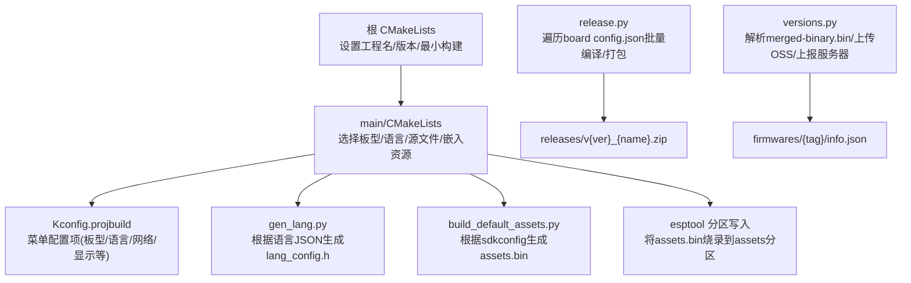
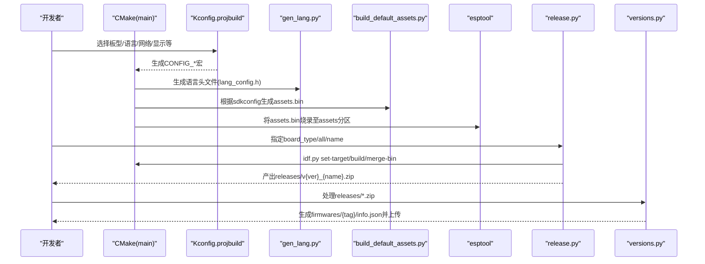
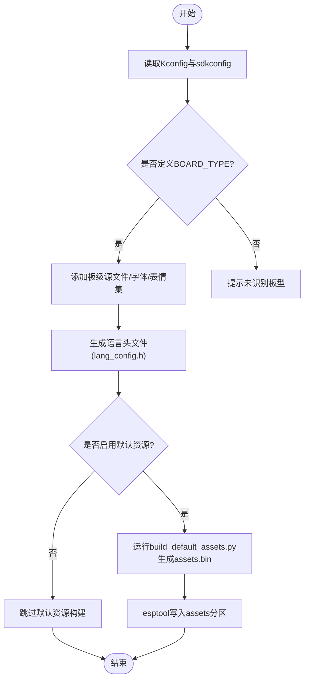
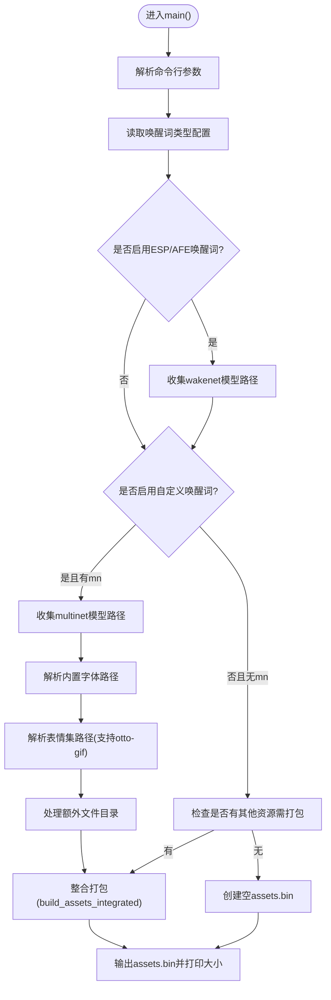
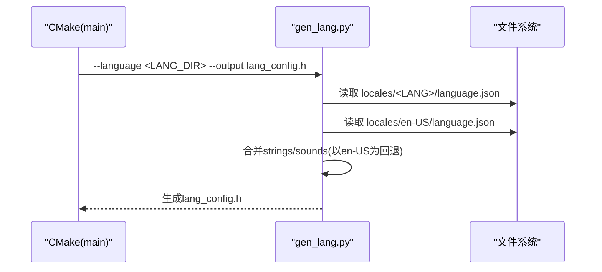
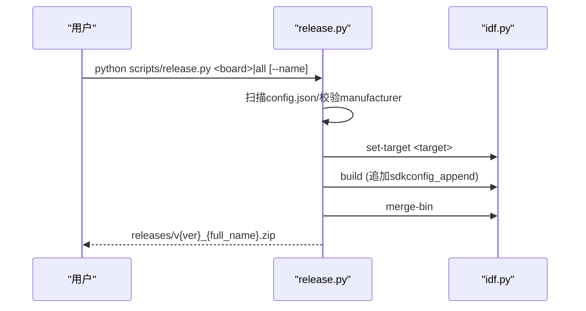
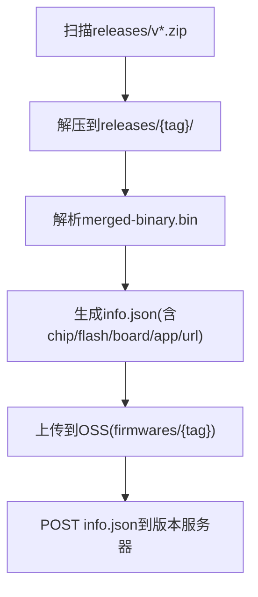
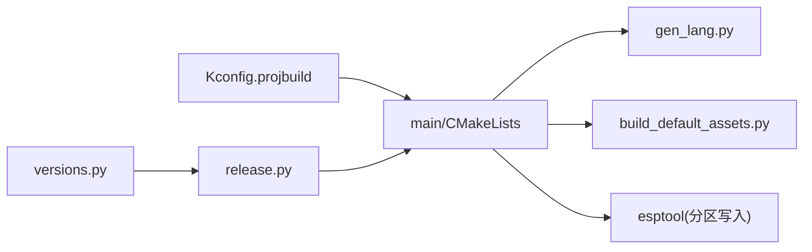

# 构建系统和脚本

<cite>
**本文引用的文件**   
- [CMakeLists.txt](file://CMakeLists.txt)
- [main/CMakeLists.txt](file://main/CMakeLists.txt)
- [main/Kconfig.projbuild](file://main/Kconfig.projbuild)
- [sdkconfig.defaults](file://sdkconfig.defaults)
- [scripts/build_default_assets.py](file://scripts/build_default_assets.py)
- [scripts/gen_lang.py](file://scripts/gen_lang.py)
- [scripts/release.py](file://scripts/release.py)
- [scripts/versions.py](file://scripts/versions.py)
</cite>

## 目录
1. [简介](#简介)
2. [项目结构](#项目结构)
3. [核心组件](#核心组件)
4. [架构总览](#架构总览)
5. [详细组件分析](#详细组件分析)
6. [依赖关系分析](#依赖关系分析)
7. [性能与体积优化](#性能与体积优化)
8. [故障排查指南](#故障排查指南)
9. [结论](#结论)
10. [附录：常用命令与模板](#附录常用命令与模板)

## 简介
本指南面向ESP-IDF工程使用者与维护者，系统化说明小智（xiaozhi-esp32）项目的构建系统与自动化脚本。内容覆盖：
- CMake 构建配置与自定义规则
- 资源构建流程（默认资源、语言文件、表情集、语音模型打包等）
- 发布与版本管理流程
- 自定义构建任务开发模板与最佳实践
- 常见问题定位与解决方案

## 项目结构
本项目采用 ESP-IDF + CMake 的模块化构建体系，顶层 CMakeLists 初始化工程并启用最小化构建；main 模块负责按 Kconfig 选择板型、语言、音频处理器、唤醒词类型等，并通过自定义命令生成语言头文件与默认资源包；scripts 目录提供资源构建、语言生成、批量发布与版本信息上传等工具。

图示来源
- [CMakeLists.txt:1-13](file://CMakeLists.txt#L1-L13)
- [main/CMakeLists.txt:1047-1081](file://main/CMakeLists.txt#L1047-L1081)
- [main/Kconfig.projbuild:1-26](file://main/Kconfig.projbuild#L1-L26)
- [scripts/gen_lang.py:176-187](file://scripts/gen_lang.py#L176-L187)
- [scripts/build_default_assets.py:811-935](file://scripts/build_default_assets.py#L811-L935)
- [scripts/release.py:307-394](file://scripts/release.py#L307-L394)
- [scripts/versions.py:223-250](file://scripts/versions.py#L223-L250)

章节来源
- [CMakeLists.txt:1-13](file://CMakeLists.txt#L1-L13)
- [main/CMakeLists.txt:1047-1081](file://main/CMakeLists.txt#L1047-L1081)
- [main/Kconfig.projbuild:1-26](file://main/Kconfig.projbuild#L1-L26)

## 核心组件
- 顶层 CMake 工程入口：定义最低 CMake 版本、关闭特定警告、包含 ESP-IDF 工程脚本、开启最小化构建、设置工程版本。
- main 模块 CMake：
  - 动态发现组件路径（如 esp-sr、xiaozhi-fonts），按 Kconfig 选择板型、语言、音频处理器、唤醒词实现等。
  - 通过 add_custom_command 调用 gen_lang.py 生成语言头文件。
  - 通过 build_default_assets_bin() 函数调用 build_default_assets.py 生成 assets.bin，并按配置写入 flash 的 assets 分区。
  - 支持从 URL 或本地路径获取自定义 assets 文件。
- 脚本工具：
  - build_default_assets.py：读取 sdkconfig，按唤醒词类型和模型选项打包 wakenet/multinet 模型、字体、表情集、额外文件，输出 assets.bin。
  - gen_lang.py：基于 en-US 基准语言合并当前语言 JSON，生成 C++ 头文件，同时收集 ogg 音效常量。
  - release.py：扫描 main/boards 下各板型的 config.json，自动推导 CONFIG_BOARD_TYPE，执行 set-target、build、merge-bin、zip 打包。
  - versions.py：从 releases 中 zip 提取 merged-binary.bin，解析应用描述、芯片/Flash 信息，生成 info.json，上传 OSS 并上报服务器。

章节来源
- [CMakeLists.txt:1-13](file://CMakeLists.txt#L1-L13)
- [main/CMakeLists.txt:1083-1098](file://main/CMakeLists.txt#L1083-L1098)
- [main/CMakeLists.txt:1178-1227](file://main/CMakeLists.txt#L1178-L1227)
- [main/CMakeLists.txt:1230-1283](file://main/CMakeLists.txt#L1230-L1283)
- [scripts/build_default_assets.py:811-935](file://scripts/build_default_assets.py#L811-L935)
- [scripts/gen_lang.py:176-187](file://scripts/gen_lang.py#L176-L187)
- [scripts/release.py:307-394](file://scripts/release.py#L307-L394)
- [scripts/versions.py:223-250](file://scripts/versions.py#L223-L250)

## 架构总览
下图展示了从配置到产物生成的端到端流程，包括语言头文件与默认资源包的生成、以及发布与版本信息上报。

图示来源
- [main/CMakeLists.txt:1083-1098](file://main/CMakeLists.txt#L1083-L1098)
- [main/CMakeLists.txt:1178-1227](file://main/CMakeLists.txt#L1178-L1227)
- [scripts/gen_lang.py:176-187](file://scripts/gen_lang.py#L176-L187)
- [scripts/build_default_assets.py:811-935](file://scripts/build_default_assets.py#L811-L935)
- [scripts/release.py:307-394](file://scripts/release.py#L307-L394)
- [scripts/versions.py:223-250](file://scripts/versions.py#L223-L250)

## 详细组件分析

### CMake 构建配置与自定义规则
- 顶层工程
  - 设置最低 CMake 版本、关闭缺失字段初始化警告、包含 ESP-IDF 工程脚本、启用最小化构建、设置工程版本。
- main 模块
  - 动态查找组件路径（esp-sr、xiaozhi-fonts），按 Kconfig 条件添加源文件与包含目录。
  - 根据 BOARD_TYPE 选择板级源文件与内置字体/图标/表情集。
  - 使用 add_custom_command 触发语言头文件生成；使用 build_default_assets_bin() 触发默认资源构建。
  - 支持三种资源烧录策略：默认资源、自定义资源、表情资源；也支持禁用资源烧录。
  - 支持从 URL 下载自定义 assets 文件，或从本地路径引用。

图示来源
- [main/CMakeLists.txt:1047-1081](file://main/CMakeLists.txt#L1047-L1081)
- [main/CMakeLists.txt:1083-1098](file://main/CMakeLists.txt#L1083-L1098)
- [main/CMakeLists.txt:1178-1227](file://main/CMakeLists.txt#L1178-L1227)
- [main/CMakeLists.txt:1230-1283](file://main/CMakeLists.txt#L1230-L1283)

章节来源
- [CMakeLists.txt:1-13](file://CMakeLists.txt#L1-L13)
- [main/CMakeLists.txt:1047-1081](file://main/CMakeLists.txt#L1047-L1081)
- [main/CMakeLists.txt:1083-1098](file://main/CMakeLists.txt#L1083-L1098)
- [main/CMakeLists.txt:1178-1227](file://main/CMakeLists.txt#L1178-L1227)
- [main/CMakeLists.txt:1230-1283](file://main/CMakeLists.txt#L1230-L1283)

### 资源构建脚本：build_default_assets.py
功能要点
- 参数：sdkconfig 路径、内置文本字体、默认表情集、输出路径、ESP-SR 模型路径、xiaozhi-fonts 路径、额外文件目录。
- 逻辑：
  - 从 sdkconfig 解析唤醒词类型（ESP/AFE/自定义/禁用）。
  - 仅当启用对应唤醒词时，才打包 wakenet 或 multinet 模型。
  - 若启用自定义唤醒词且未选择 multinet 模型，报错退出。
  - 根据内置字体名称映射到 xiaozhi-fonts 中的具体 bin 文件。
  - 支持 otto-gif 表情集别名映射。
  - 生成 index.json 与 config.json，随后打包为 assets.bin，并输出大小统计。
- 输出：assets.bin（含可选 srmodels.bin、text_font、emoji_collection、extra_files 等索引）。

图示来源
- [scripts/build_default_assets.py:811-935](file://scripts/build_default_assets.py#L811-L935)

章节来源
- [scripts/build_default_assets.py:811-935](file://scripts/build_default_assets.py#L811-L935)

### 语言文件生成：gen_lang.py
功能要点
- 输入：目标语言代码（如 zh-CN）、输出头文件路径。
- 逻辑：
  - 加载 en-US 基准 language.json，作为缺失键的回退。
  - 合并当前语言 strings 与 sounds（ogg 文件），生成 C++ 命名空间常量。
  - 对非 en-US 语言，若缺少某音效文件则回退到 en-US 同名文件。
- 输出：lang_config.h（包含字符串与音效常量，供运行时访问）。

图示来源
- [main/CMakeLists.txt:1083-1098](file://main/CMakeLists.txt#L1083-L1098)
- [scripts/gen_lang.py:176-187](file://scripts/gen_lang.py#L176-L187)

章节来源
- [scripts/gen_lang.py:176-187](file://scripts/gen_lang.py#L176-L187)
- [main/CMakeLists.txt:1083-1098](file://main/CMakeLists.txt#L1083-L1098)

### 发布流程脚本：release.py
功能要点
- 扫描 main/boards 下所有 board 目录的 config.json，校验 manufacturer 与目录一致性。
- 自动推导 CONFIG_BOARD_TYPE_xxx=y（可从 sdkconfig_append 显式指定，否则按目标芯片匹配）。
- 对每个变体执行：set-target、追加 sdkconfig、idf.py build、merge-bin、zip 打包到 releases。
- 支持列出所有 board 及变体（JSON/文本格式），支持按 name 过滤。

图示来源
- [scripts/release.py:307-394](file://scripts/release.py#L307-L394)

章节来源
- [scripts/release.py:307-394](file://scripts/release.py#L307-L394)

### 版本管理与上传：versions.py
功能要点
- 遍历 releases 目录下 v*.zip，解压出 merged-binary.bin。
- 解析分区表与应用描述，提取芯片类型、Flash 容量、应用版本、编译时间、ELF SHA256 等。
- 生成 info.json，上传至 OSS，并将 info.json 提交至版本服务器。

图示来源
- [scripts/versions.py:223-250](file://scripts/versions.py#L223-L250)

章节来源
- [scripts/versions.py:223-250](file://scripts/versions.py#L223-L250)

## 依赖关系分析
- 组件发现
  - main/CMakeLists 通过 find_component_by_pattern 动态查找 espressif__esp-sr 与 xiaozhi-fonts，从而确定模型与字体路径。
- 构建依赖
  - 语言头文件生成依赖语言 JSON 与 gen_lang.py。
  - 默认资源构建依赖 sdkconfig、build_default_assets.py 以及外部组件路径。
- 发布依赖
  - release.py 依赖各 board 的 config.json 与 Kconfig 符号解析逻辑。
  - versions.py 依赖 releases 产物与 OSS/服务器环境变量。

图示来源
- [main/CMakeLists.txt:1100-1110](file://main/CMakeLists.txt#L1100-L1110)
- [main/CMakeLists.txt:1083-1098](file://main/CMakeLists.txt#L1083-L1098)
- [main/CMakeLists.txt:1178-1227](file://main/CMakeLists.txt#L1178-L1227)
- [scripts/release.py:307-394](file://scripts/release.py#L307-L394)
- [scripts/versions.py:223-250](file://scripts/versions.py#L223-L250)

章节来源
- [main/CMakeLists.txt:1100-1110](file://main/CMakeLists.txt#L1100-L1110)
- [main/CMakeLists.txt:1083-1098](file://main/CMakeLists.txt#L1083-L1098)
- [main/CMakeLists.txt:1178-1227](file://main/CMakeLists.txt#L1178-L1227)
- [scripts/release.py:307-394](file://scripts/release.py#L307-L394)
- [scripts/versions.py:223-250](file://scripts/versions.py#L223-L250)

## 性能与体积优化
- 最小化构建：顶层 CMake 启用 MINIMAL_BUILD，减少无关组件参与编译。
- LVGL 裁剪：默认关闭大量不常用控件与示例，降低二进制体积。
- 资源按需打包：
  - 仅当启用相应唤醒词时才打包 wakenet/multinet 模型。
  - 内置字体与表情集可按板型选择，避免冗余。
- 分区策略：默认使用 v2 分区表，合理划分 app、nvs、ota、assets 等分区。

章节来源
- [CMakeLists.txt:1-13](file://CMakeLists.txt#L1-L13)
- [sdkconfig.defaults:43-79](file://sdkconfig.defaults#L43-L79)
- [scripts/build_default_assets.py:811-935](file://scripts/build_default_assets.py#L811-L935)

## 故障排查指南
- 语言头文件未生成
  - 现象：编译时报找不到 lang_config.h。
  - 排查：确认 Kconfig 已选择语言，且 assets/locales/<LANG>/language.json 存在；检查 CMake 自定义命令依赖是否正确。
  - 参考：[main/CMakeLists.txt:1083-1098](file://main/CMakeLists.txt#L1083-L1098)
- 默认资源构建失败
  - 现象：assets.bin 未生成或为空。
  - 排查：
    - 检查 sdkconfig 中唤醒词类型与模型选项是否一致（自定义唤醒词必须选择 multinet）。
    - 确认 ESP-SR 模型路径与 xiaozhi-fonts 路径正确。
    - 查看脚本输出日志，定位缺少的文件或目录。
  - 参考：[scripts/build_default_assets.py:811-935](file://scripts/build_default_assets.py#L811-L935)
- 发布脚本无法识别板型
  - 现象：release.py 报错 board_type 不存在或 manufacturer 不一致。
  - 排查：确保 main/CMakeLists.txt 中存在对应的 set(BOARD_TYPE "...") 分支；config.json 中 manufacturer 与目录层级一致。
  - 参考：[scripts/release.py:307-394](file://scripts/release.py#L307-L394)
- 版本信息上传失败
  - 现象：versions.py 报网络错误或缺少环境变量。
  - 排查：检查 OSS 与版本服务器的环境变量是否配置；确认 releases 目录结构与 merged-binary.bin 存在。
  - 参考：[scripts/versions.py:223-250](file://scripts/versions.py#L223-L250)

章节来源
- [main/CMakeLists.txt:1083-1098](file://main/CMakeLists.txt#L1083-L1098)
- [scripts/build_default_assets.py:811-935](file://scripts/build_default_assets.py#L811-L935)
- [scripts/release.py:307-394](file://scripts/release.py#L307-L394)
- [scripts/versions.py:223-250](file://scripts/versions.py#L223-L250)

## 结论
本项目通过 CMake 与 Python 脚本协同，实现了高度可配置的构建系统：按 Kconfig 选择板型与特性、自动生成语言头文件、按需打包资源与模型、一键批量发布与版本信息上报。遵循本文档的流程与最佳实践，可快速完成多板型、多语言的构建与发布工作。

## 附录：常用命令与模板
- 基础构建与烧录
  - 配置与构建：idf.py menuconfig / idf.py build
  - 合并镜像：idf.py merge-bin
  - 烧录默认资源：在 Kconfig 中选择“Flash Default Assets”，构建后会自动写入 assets 分区
- 语言与资源
  - 手动生成语言头文件：python scripts/gen_lang.py --language zh-CN --output main/assets/lang_config.h
  - 手动构建默认资源：python scripts/build_default_assets.py --sdkconfig sdkconfig --output build/generated_assets.bin
- 批量发布
  - 列出所有板型与变体：python scripts/release.py --list-boards [--json]
  - 编译指定板型的所有变体：python scripts/release.py all
  - 编译指定板型与变体：python scripts/release.py <board_type> --name <variant_name>
- 版本信息处理
  - 处理 releases 下的 zip 并上传：python scripts/versions.py

章节来源
- [main/CMakeLists.txt:1083-1098](file://main/CMakeLists.txt#L1083-L1098)
- [scripts/gen_lang.py:176-187](file://scripts/gen_lang.py#L176-L187)
- [scripts/build_default_assets.py:811-935](file://scripts/build_default_assets.py#L811-L935)
- [scripts/release.py:307-394](file://scripts/release.py#L307-L394)
- [scripts/versions.py:223-250](file://scripts/versions.py#L223-L250)