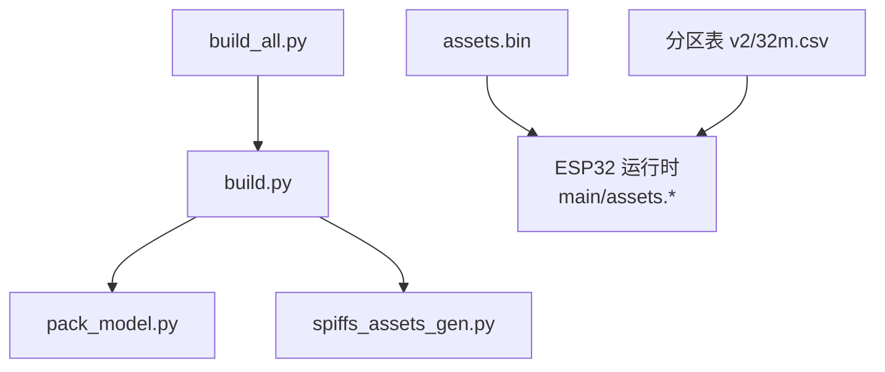
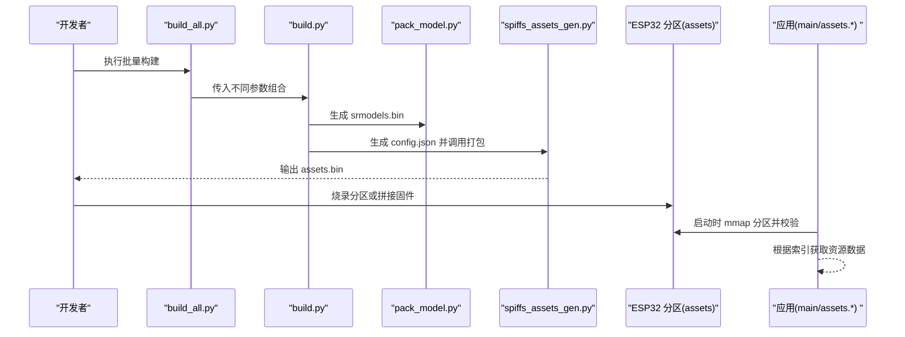
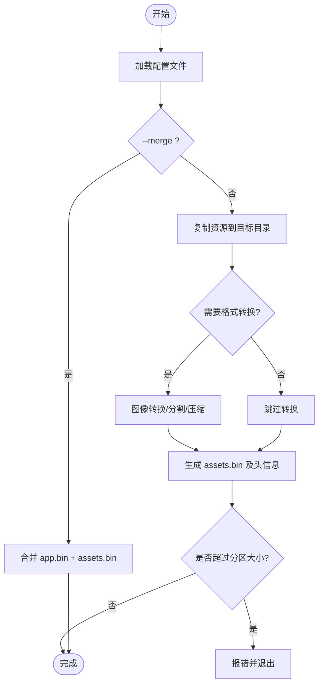
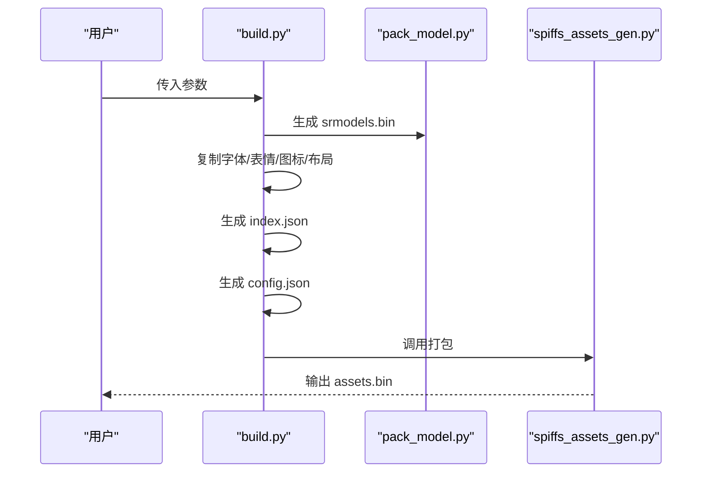
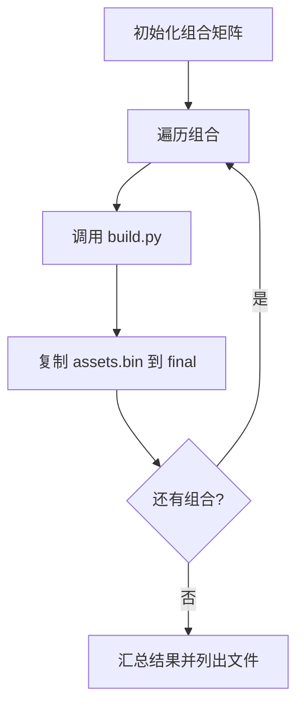
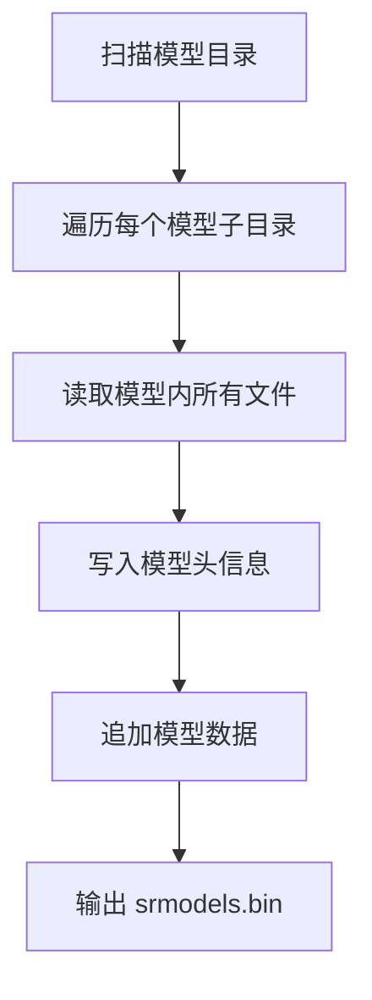
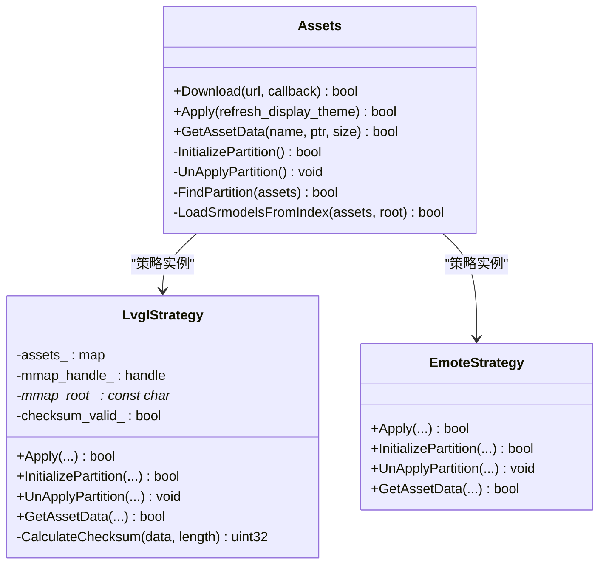
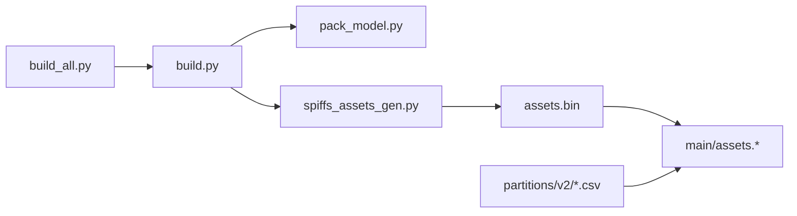

# SPIFFS资源打包工具

<cite>
**本文引用的文件列表**
- [scripts/spiffs_assets/README.md](file://scripts/spiffs_assets/README.md)
- [scripts/spiffs_assets/spiffs_assets_gen.py](file://scripts/spiffs_assets/spiffs_assets_gen.py)
- [scripts/spiffs_assets/build.py](file://scripts/spiffs_assets/build.py)
- [scripts/spiffs_assets/build_all.py](file://scripts/spiffs_assets/build_all.py)
- [scripts/spiffs_assets/pack_model.py](file://scripts/spiffs_assets/pack_model.py)
- [main/assets.h](file://main/assets.h)
- [main/assets.cc](file://main/assets.cc)
- [partitions/v2/32m.csv](file://partitions/v2/32m.csv)
</cite>

## 目录
1. [简介](#简介)
2. [项目结构](#项目结构)
3. [核心组件](#核心组件)
4. [架构总览](#架构总览)
5. [详细组件分析](#详细组件分析)
6. [依赖关系分析](#依赖关系分析)
7. [性能与优化建议](#性能与优化建议)
8. [故障排查指南](#故障排查指南)
9. [结论](#结论)
10. [附录：命令行参数与配置示例](#附录命令行参数与配置示例)

## 简介
本仓库提供一套用于将 ESP32 项目的静态资源（唤醒模型、字体、表情图片等）打包为 SPIFFS 分区的工具链。通过脚本组合，可将多种资源合并生成 assets.bin，并支持 LVGL 图像格式转换、QOI 压缩、行分割、以及最终与固件二进制拼接或映射到分区进行运行时访问。

该工具链包含以下关键能力：
- 资源收集与索引生成（index.json）
- 唤醒网络模型打包（pack_model.py）
- 图像格式转换与压缩（spiffs_assets_gen.py）
- 批量构建多套资源组合（build_all.py）
- 运行时读取与校验（main/assets.*）

## 项目结构
与 SPIFFS 资源打包相关的脚本位于 scripts/spiffs_assets 目录下，核心文件如下：
- spiffs_assets_gen.py：资源复制、格式转换、打包与合并的核心实现
- build.py：编排资源处理流程，生成 index.json 和 config.json，并调用 spiffs_assets_gen.py
- build_all.py：遍历多种模型/字体/表情组合，批量调用 build.py 产出多个 assets.bin
- pack_model.py：将模型目录下的多个文件打包成 srmodels.bin
- README.md：使用说明与工作流程概述

图表来源
- [scripts/spiffs_assets/build.py:340-400](file://scripts/spiffs_assets/build.py#L340-L400)
- [scripts/spiffs_assets/spiffs_assets_gen.py:534-648](file://scripts/spiffs_assets/spiffs_assets_gen.py#L534-L648)
- [scripts/spiffs_assets/pack_model.py:41-124](file://scripts/spiffs_assets/pack_model.py#L41-L124)
- [scripts/spiffs_assets/build_all.py:80-149](file://scripts/spiffs_assets/build_all.py#L80-L149)
- [main/assets.cc:130-185](file://main/assets.cc#L130-L185)
- [partitions/v2/32m.csv:1-10](file://partitions/v2/32m.csv#L1-L10)

章节来源
- [scripts/spiffs_assets/README.md:1-111](file://scripts/spiffs_assets/README.md#L1-L111)
- [scripts/spiffs_assets/build.py:340-400](file://scripts/spiffs_assets/build.py#L340-L400)
- [scripts/spiffs_assets/build_all.py:80-149](file://scripts/spiffs_assets/build_all.py#L80-L149)
- [scripts/spiffs_assets/spiffs_assets_gen.py:534-648](file://scripts/spiffs_assets/spiffs_assets_gen.py#L534-L648)
- [scripts/spiffs_assets/pack_model.py:41-124](file://scripts/spiffs_assets/pack_model.py#L41-L124)
- [main/assets.cc:130-185](file://main/assets.cc#L130-L185)
- [partitions/v2/32m.csv:1-10](file://partitions/v2/32m.csv#L1-L10)

## 核心组件
- spiffs_assets_gen.py
  - 负责资源复制、图像格式转换（LVGL BIN、sjpg/spng/sqoi）、行分割、打包生成 assets.bin，以及可选的与 app.bin 合并
  - 支持根据配置项控制是否启用 spng/sjpg/qoi/raw 等格式，以及分割高度、名称长度、LVGL 版本等
- build.py
  - 解析命令行参数，组织构建目录，调用 pack_model.py 生成 srmodels.bin，复制字体与表情资源，生成 index.json 与 config.json，最后调用 spiffs_assets_gen.py 完成打包
- build_all.py
  - 定义多组模型/字体/表情组合，循环调用 build.py，并将生成的 assets.bin 重命名输出到 final 目录
- pack_model.py
  - 将模型目录下的子目录视为独立模型，将其内部所有文件按固定结构打包为 srmodels.bin，供运行时加载
- main/assets.*
  - 运行时策略：查找并 mmap 分区，校验头部信息（文件数、校验和、长度），建立资源名到偏移/大小的映射，支持下载更新与写入分区

章节来源
- [scripts/spiffs_assets/spiffs_assets_gen.py:534-648](file://scripts/spiffs_assets/spiffs_assets_gen.py#L534-L648)
- [scripts/spiffs_assets/build.py:340-400](file://scripts/spiffs_assets/build.py#L340-L400)
- [scripts/spiffs_assets/build_all.py:80-149](file://scripts/spiffs_assets/build_all.py#L80-L149)
- [scripts/spiffs_assets/pack_model.py:41-124](file://scripts/spiffs_assets/pack_model.py#L41-L124)
- [main/assets.h:1-90](file://main/assets.h#L1-L90)
- [main/assets.cc:130-185](file://main/assets.cc#L130-L185)

## 架构总览
从“资源输入”到“设备运行”的整体流程如下：

图表来源
- [scripts/spiffs_assets/build_all.py:80-149](file://scripts/spiffs_assets/build_all.py#L80-L149)
- [scripts/spiffs_assets/build.py:340-400](file://scripts/spiffs_assets/build.py#L340-L400)
- [scripts/spiffs_assets/pack_model.py:41-124](file://scripts/spiffs_assets/pack_model.py#L41-L124)
- [scripts/spiffs_assets/spiffs_assets_gen.py:534-648](file://scripts/spiffs_assets/spiffs_assets_gen.py#L534-L648)
- [main/assets.cc:130-185](file://main/assets.cc#L130-L185)

## 详细组件分析

### spiffs_assets_gen.py 工作原理
- 配置驱动
  - 通过 --config 指定 JSON 配置文件，支持两种模式：
    - 构建模式：复制资源、转换格式、生成 assets.bin
    - 合并模式：将 assets.bin 与 app.bin 拼接为新的 app.bin
- 资源复制与格式转换
  - 支持 .png/.jpg 转换为 spiffs 专用格式：
    - .spng（PNG 序列）
    - .sjpg（JPEG 序列）
    - .sqoi（QOI 序列）
  - 支持 raw 模式（直接转 LVGL 兼容的 BIN），并根据 lvgl_ver 选择 v8 或 v9 的转换脚本
  - 支持按 split_height 对图像进行垂直切块，便于内存受限场景下逐块渲染
- 打包与头信息
  - 生成合并后的二进制文件，并在头部记录：
    - 文件数量、校验和、总长度
    - 每个文件的名称、大小、偏移、宽高（若为图像）
  - 同时生成对应的 C 头文件，导出枚举与常量，便于 C/C++ 侧引用
- 分区大小检查
  - 计算总大小并与配置的分区大小比较，若超出则提示推荐大小并退出

图表来源
- [scripts/spiffs_assets/spiffs_assets_gen.py:534-648](file://scripts/spiffs_assets/spiffs_assets_gen.py#L534-L648)

章节来源
- [scripts/spiffs_assets/spiffs_assets_gen.py:534-648](file://scripts/spiffs_assets/spiffs_assets_gen.py#L534-L648)

### build.py 编排逻辑
- 参数解析
  - --wakenet_model：唤醒模型目录
  - --text_font：文本字体文件
  - --emoji_collection：表情集合目录
  - --res_path / --target_board：板级资源（EAF 动画、图标、布局）
- 构建步骤
  - 清理并创建 build/ 与 build/assets/ 目录
  - 调用 pack_model.py 生成 srmodels.bin 并复制到 assets/
  - 复制字体与表情资源到 assets/
  - 生成 index.json（资源清单）
  - 生成 config.json（spiffs_assets_gen.py 的配置）
  - 调用 spiffs_assets_gen.py 生成 output/assets.bin，并复制到 build/assets.bin
- 板级资源支持
  - 支持从 emote.json 读取 EAF 动画配置，拷贝 eaf 文件并生成 emoji_collection 条目
  - 支持扫描 icon 目录中的 .bin 与 listen.eaf，生成 icon_collection
  - 支持 layout.json 布局描述，生成 layout 数组

图表来源
- [scripts/spiffs_assets/build.py:340-400](file://scripts/spiffs_assets/build.py#L340-L400)
- [scripts/spiffs_assets/pack_model.py:41-124](file://scripts/spiffs_assets/pack_model.py#L41-L124)
- [scripts/spiffs_assets/spiffs_assets_gen.py:534-648](file://scripts/spiffs_assets/spiffs_assets_gen.py#L534-L648)

章节来源
- [scripts/spiffs_assets/build.py:340-400](file://scripts/spiffs_assets/build.py#L340-L400)

### build_all.py 批量构建
- 组合矩阵
  - wakenet_models：none, wn9_nihaoxiaozhi_tts, wn9s_nihaoxiaozhi
  - text_fonts：none, font_puhui_common_14_1, font_puhui_common_16_4, font_puhui_common_20_4, font_puhui_common_30_4
  - emoji_collections：none, emojis_32, emojis_64
- 行为
  - 遍历所有组合，调用 build.py 生成 assets.bin
  - 将结果复制到 build/final 目录，并以组合名命名
  - 统计成功构建数量并列出产物

图表来源
- [scripts/spiffs_assets/build_all.py:80-149](file://scripts/spiffs_assets/build_all.py#L80-L149)

章节来源
- [scripts/spiffs_assets/build_all.py:80-149](file://scripts/spiffs_assets/build_all.py#L80-L149)

### pack_model.py 模型打包流程
- 输入：模型根目录，其下每个子目录为一个模型，包含若干文件
- 输出：srmodels.bin，包含：
  - 模型数量
  - 每个模型的名称、文件数量、文件名、起始偏移、长度
  - 所有模型数据的连续拼接
- 用途：被 build.py 调用后复制到 assets/，由运行时加载

图表来源
- [scripts/spiffs_assets/pack_model.py:41-124](file://scripts/spiffs_assets/pack_model.py#L41-L124)

章节来源
- [scripts/spiffs_assets/pack_model.py:41-124](file://scripts/spiffs_assets/pack_model.py#L41-L124)

### 运行时读取与校验（main/assets.*）
- 分区查找与映射
  - 查找名为 assets 的分区，使用 esp_partition_mmap 映射到内存
- 头部校验
  - 读取文件数、校验和、总长度，计算并比对校验和
- 资源索引
  - 遍历表项，建立资源名到 {size, offset} 的映射
- 下载更新
  - 支持从 HTTP 下载新 assets.bin，擦除并写入分区，带进度回调

图表来源
- [main/assets.h:1-90](file://main/assets.h#L1-L90)
- [main/assets.cc:130-185](file://main/assets.cc#L130-L185)

章节来源
- [main/assets.h:1-90](file://main/assets.h#L1-L90)
- [main/assets.cc:130-185](file://main/assets.cc#L130-L185)

## 依赖关系分析
- 脚本间依赖
  - build.py 依赖 pack_model.py 与 spiffs_assets_gen.py
  - build_all.py 依赖 build.py
- 运行时依赖
  - main/assets.* 依赖 ESP-IDF 分区 API 与 mmap 机制
  - 分区表需包含名为 assets 的 spiffs 分区

图表来源
- [scripts/spiffs_assets/build_all.py:80-149](file://scripts/spiffs_assets/build_all.py#L80-L149)
- [scripts/spiffs_assets/build.py:340-400](file://scripts/spiffs_assets/build.py#L340-L400)
- [scripts/spiffs_assets/spiffs_assets_gen.py:534-648](file://scripts/spiffs_assets/spiffs_assets_gen.py#L534-L648)
- [main/assets.cc:130-185](file://main/assets.cc#L130-L185)
- [partitions/v2/32m.csv:1-10](file://partitions/v2/32m.csv#L1-L10)

章节来源
- [scripts/spiffs_assets/build_all.py:80-149](file://scripts/spiffs_assets/build_all.py#L80-L149)
- [scripts/spiffs_assets/build.py:340-400](file://scripts/spiffs_assets/build.py#L340-L400)
- [scripts/spiffs_assets/spiffs_assets_gen.py:534-648](file://scripts/spiffs_assets/spiffs_assets_gen.py#L534-L648)
- [main/assets.cc:130-185](file://main/assets.cc#L130-L185)
- [partitions/v2/32m.csv:1-10](file://partitions/v2/32m.csv#L1-L10)

## 性能与优化建议
- 图像分割
  - 合理设置 split_height，避免单帧过大导致内存不足；在显示端可逐块渲染降低峰值内存
- 格式选择
  - 优先使用 spiffs 原生格式（spng/sjpg/sqoi）以减少运行时解压开销；raw 模式适合需要原始像素的场景
- 名称长度
  - name_length 不宜过大，否则会增加索引体积；默认 32 字节通常足够
- 分区大小
  - 确保分区大小大于等于 assets.bin 总大小；工具会给出推荐值，必要时调整分区表
- 批量构建
  - 使用 build_all.py 并行评估不同组合的体积与效果，选择最优方案

[本节为通用指导，不直接分析具体文件]

## 故障排查指南
- 构建失败：找不到源文件或目录
  - 检查 --wakenet_model、--text_font、--emoji_collection 路径是否正确
- 模型打包失败
  - 确认模型目录结构正确，pack_model.py 能遍历到子目录与文件
- 图像转换失败
  - 检查 LVGL 版本配置 lvgl_ver，v8 与 v9 的转换脚本不同
  - 确保网络可用以自动下载转换脚本（v9 直接从 GitHub 拉取）
- 分区大小不足
  - 当 assets.bin 超过分区大小时，工具会报错并给出推荐大小；请调整分区表或减少资源
- 运行时校验失败
  - 检查 assets.bin 头部校验和是否与运行时计算一致；确认分区未被损坏

章节来源
- [scripts/spiffs_assets/spiffs_assets_gen.py:534-648](file://scripts/spiffs_assets/spiffs_assets_gen.py#L534-L648)
- [scripts/spiffs_assets/build.py:340-400](file://scripts/spiffs_assets/build.py#L340-L400)
- [scripts/spiffs_assets/pack_model.py:41-124](file://scripts/spiffs_assets/pack_model.py#L41-L124)
- [main/assets.cc:130-185](file://main/assets.cc#L130-L185)

## 结论
本工具链提供了从资源准备、格式转换、打包到运行时读取的完整闭环。通过 build.py 与 build_all.py 的组合，可以快速生成多套资源包并进行对比评估；spiffs_assets_gen.py 提供灵活的格式与压缩选项；pack_model.py 简化了模型资源的统一封装。配合 ESP-IDF 分区表与运行时策略，可在资源体积与性能之间取得良好平衡。

[本节为总结性内容，不直接分析具体文件]

## 附录：命令行参数与配置示例

### build.py 参数说明
- --wakenet_model：唤醒模型目录路径
- --text_font：文本字体文件路径
- --emoji_collection：表情集合目录路径
- --res_path：板级资源目录（含 emote.json、icon 等）
- --target_board：目标板目录（含 layout.json）

示例
- 仅处理字体文件
- 仅处理表情符号
- 完整参数示例（包含模型、字体、表情）

章节来源
- [scripts/spiffs_assets/README.md:22-50](file://scripts/spiffs_assets/README.md#L22-L50)
- [scripts/spiffs_assets/build.py:340-400](file://scripts/spiffs_assets/build.py#L340-L400)

### build_all.py 批量构建
- 自动遍历 wakenet_models、text_fonts、emoji_collections 的组合
- 输出到 build/final 目录，文件名形如 wn9_nihaoxiaozhi_tts-font_puhui_common_20_4-emojis_64.bin

章节来源
- [scripts/spiffs_assets/build_all.py:80-149](file://scripts/spiffs_assets/build_all.py#L80-L149)

### spiffs_assets_gen.py 配置项（config.json）
- include_path：生成的 C 头文件输出目录
- assets_path：资源目录
- image_file：输出的 assets.bin 路径
- lvgl_ver：LVGL 版本（影响 raw 转换脚本）
- assets_size：分区大小（十六进制），用于容量检查
- support_format：支持的文件扩展名列表
- name_length：资源名称最大长度
- split_height：图像垂直分割高度
- support_qoi / support_spng / support_sjpg / support_sqoi / support_raw：各格式开关
- support_raw_dither / support_raw_bgr：raw 转换相关选项

章节来源
- [scripts/spiffs_assets/build.py:308-337](file://scripts/spiffs_assets/build.py#L308-L337)
- [scripts/spiffs_assets/spiffs_assets_gen.py:534-648](file://scripts/spiffs_assets/spiffs_assets_gen.py#L534-L648)

### 分区表示例（v2/32m.csv）
- 包含 nvs、otadata、phy_init、ota_0、ota_1、assets（spiffs）等分区
- assets 分区大小为 16M，可根据实际资源大小调整

章节来源
- [partitions/v2/32m.csv:1-10](file://partitions/v2/32m.csv#L1-L10)