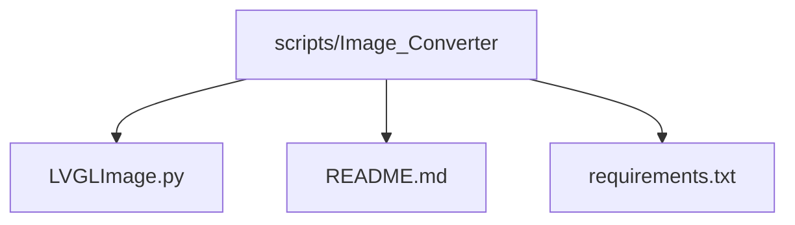
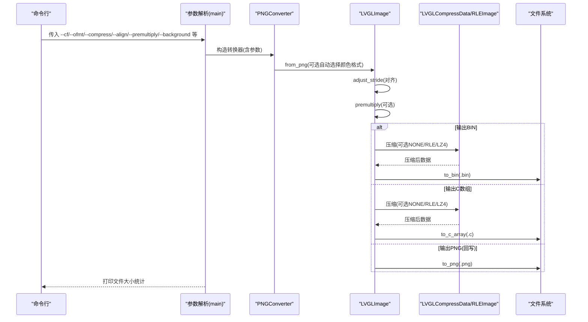
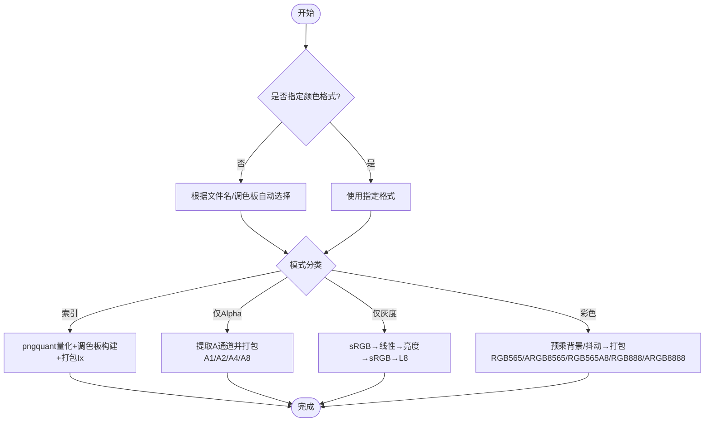
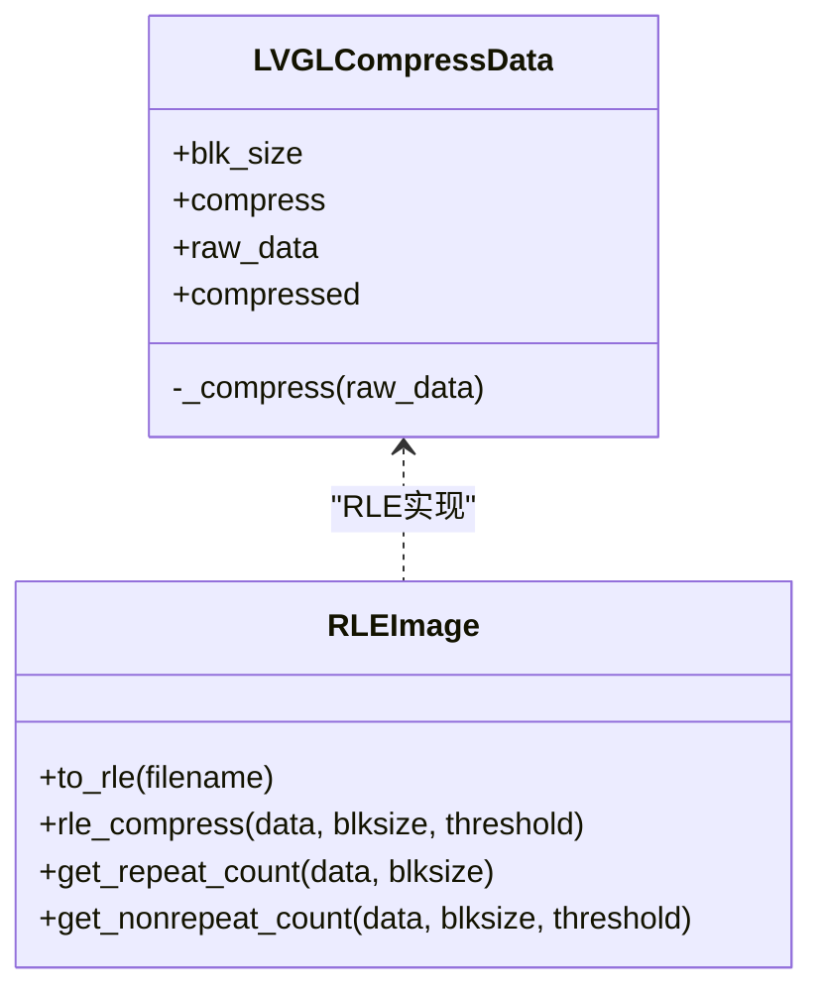

# 图片转换工具

<cite>
**本文引用的文件**   
- [scripts/Image_Converter/LVGLImage.py](file://scripts/Image_Converter/LVGLImage.py)
- [scripts/Image_Converter/README.md](file://scripts/Image_Converter/README.md)
- [scripts/Image_Converter/requirements.txt](file://scripts/Image_Converter/requirements.txt)
</cite>

## 目录
1. [简介](#简介)
2. [项目结构](#项目结构)
3. [核心组件](#核心组件)
4. [架构总览](#架构总览)
5. [详细组件分析](#详细组件分析)
6. [依赖与环境](#依赖与环境)
7. [使用指南与最佳实践](#使用指南与最佳实践)
8. [性能与压缩优化](#性能与压缩优化)
9. [常见问题排查](#常见问题排查)
10. [结论](#结论)

## 简介
本指南面向需要在嵌入式或 LVGL 环境中高效使用图片资源的开发者，围绕仓库中的图片转换脚本 LVGLImage.py，系统讲解：
- 支持的输入/输出格式
- 颜色深度、尺寸与步长（stride）配置
- 预乘 Alpha、抖动等画质优化策略
- 压缩算法与体积控制
- 批量处理与命令行参数
- 环境安装与常见错误定位
- 不同应用场景下的推荐配置

## 项目结构
该工具位于 scripts/Image_Converter 目录下，包含：
- LVGLImage.py：核心转换脚本，提供 PNG→LVGL 二进制/C 数组/PNG 的转换能力
- README.md：简要说明与 GUI 工具入口（GUI 工具不在本文范围）
- requirements.txt：Python 依赖清单

图表来源
- [scripts/Image_Converter/README.md:1-46](file://scripts/Image_Converter/README.md#L1-L46)

章节来源
- [scripts/Image_Converter/README.md:1-46](file://scripts/Image_Converter/README.md#L1-L46)

## 核心组件
- 颜色格式枚举 ColorFormat：定义所有支持的像素格式与位深、索引色数量、是否带 Alpha 等属性
- 图像对象 LVGLImage：封装宽高、颜色格式、数据、步长、预乘标志，并提供从 PNG 读取、写入 BIN/C/PNG、调整步长、预乘 Alpha 等方法
- 压缩模块 CompressMethod/RLEImage/LVGLCompressData：支持 NONE、RLE、LZ4 三种压缩方式
- 导出器 PNGConverter：批量处理一组 PNG，按指定颜色格式、对齐、预乘、压缩、背景色等参数生成目标产物
- 命令行入口 main()：解析参数、扫描输入文件或目录、调用转换器并输出统计信息

章节来源
- [scripts/Image_Converter/LVGLImage.py:99-193](file://scripts/Image_Converter/LVGLImage.py#L99-L193)
- [scripts/Image_Converter/LVGLImage.py:491-873](file://scripts/Image_Converter/LVGLImage.py#L491-L873)
- [scripts/Image_Converter/LVGLImage.py:454-489](file://scripts/Image_Converter/LVGLImage.py#L454-L489)
- [scripts/Image_Converter/LVGLImage.py:1104-1207](file://scripts/Image_Converter/LVGLImage.py#L1104-L1207)
- [scripts/Image_Converter/LVGLImage.py:1247-1311](file://scripts/Image_Converter/LVGLImage.py#L1247-L1311)
- [scripts/Image_Converter/LVGLImage.py:1313-1399](file://scripts/Image_Converter/LVGLImage.py#L1313-L1399)

## 架构总览
下图展示了从命令行到具体转换流程的关键路径。

图表来源
- [scripts/Image_Converter/LVGLImage.py:1313-1399](file://scripts/Image_Converter/LVGLImage.py#L1313-L1399)
- [scripts/Image_Converter/LVGLImage.py:1247-1311](file://scripts/Image_Converter/LVGLImage.py#L1247-L1311)
- [scripts/Image_Converter/LVGLImage.py:491-873](file://scripts/Image_Converter/LVGLImage.py#L491-L873)
- [scripts/Image_Converter/LVGLImage.py:454-489](file://scripts/Image_Converter/LVGLImage.py#L454-L489)

## 详细组件分析

### 颜色格式与位深
- 支持灰度 L8、索引 I1/I2/I4/I8、Alpha 通道 A1/A2/A4/A8、彩色 ARGB8888/XRGB8888/RGB888/RGB565/ARGB8565/RGB565A8
- 每个格式提供 bpp（每像素位数）、ncolors（调色板大小）、is_indexed/is_alpha_only/is_colormap/is_luma_only 等判断属性，便于自动选择与分支处理

章节来源
- [scripts/Image_Converter/LVGLImage.py:105-193](file://scripts/Image_Converter/LVGLImage.py#L105-L193)

### 图像对象与数据布局
- LVGLImageHeader：负责写入/读取 LVGL 头（魔数、颜色格式、标志、宽高、步长等），并计算默认步长与对齐
- LVGLImage：维护 cf/w/h/stride/data/premultiplied 等状态，提供 set_data/from_bin/from_png/to_bin/to_c_array/to_png/adjust_stride/premultiply 等接口
- RGB565A8 特殊处理：RGB 数据与独立 A8 掩码拼接，调整步长时分别处理

章节来源
- [scripts/Image_Converter/LVGLImage.py:388-452](file://scripts/Image_Converter/LVGLImage.py#L388-L452)
- [scripts/Image_Converter/LVGLImage.py:491-716](file://scripts/Image_Converter/LVGLImage.py#L491-L716)
- [scripts/Image_Converter/LVGLImage.py:509-574](file://scripts/Image_Converter/LVGLImage.py#L509-L574)

### 从 PNG 到 LVGL 的转换流程
- 自动颜色格式推断：若未显式指定 cf，则根据文件名片段匹配；否则在索引模式下基于调色板规模自动选择 I1/I2/I4/I8
- 索引模式：通过 pngquant 量化至目标色表，再打包为 Ix 数据
- Alpha 模式：提取透明度通道并按位深打包
- 灰度模式：将 RGBA 转换为线性空间亮度再转回 sRGB 得到 L8
- 彩色模式：对 RGB565/ARGB8565/RGB565A8 等执行预乘与位域打包，支持 8x8 抖动以缓解色带

图表来源
- [scripts/Image_Converter/LVGLImage.py:839-873](file://scripts/Image_Converter/LVGLImage.py#L839-L873)
- [scripts/Image_Converter/LVGLImage.py:875-926](file://scripts/Image_Converter/LVGLImage.py#L875-L926)
- [scripts/Image_Converter/LVGLImage.py:928-947](file://scripts/Image_Converter/LVGLImage.py#L928-L947)
- [scripts/Image_Converter/LVGLImage.py:959-976](file://scripts/Image_Converter/LVGLImage.py#L959-L976)
- [scripts/Image_Converter/LVGLImage.py:978-1048](file://scripts/Image_Converter/LVGLImage.py#L978-L1048)

### 压缩与存储
- 压缩方法：NONE、RLE、LZ4
- RLE：按像素块进行游程编码，适合重复区域较多的图像
- LZ4：通用快速压缩，适合复杂纹理
- 压缩结果会附加元数据（方法、压缩长度、原始长度）

图表来源
- [scripts/Image_Converter/LVGLImage.py:454-489](file://scripts/Image_Converter/LVGLImage.py#L454-L489)
- [scripts/Image_Converter/LVGLImage.py:1104-1207](file://scripts/Image_Converter/LVGLImage.py#L1104-L1207)

章节来源
- [scripts/Image_Converter/LVGLImage.py:454-489](file://scripts/Image_Converter/LVGLImage.py#L454-L489)
- [scripts/Image_Converter/LVGLImage.py:1104-1207](file://scripts/Image_Converter/LVGLImage.py#L1104-L1207)

### 批量处理与输出
- PNGConverter 接收文件列表与统一参数，遍历执行：from_png → adjust_stride → premultiply（可选）→ 按 ofmt 输出 .bin/.c/.png
- 支持保留/丢弃原目录结构、自定义输出目录、日志输出

章节来源
- [scripts/Image_Converter/LVGLImage.py:1247-1311](file://scripts/Image_Converter/LVGLImage.py#L1247-L1311)

### 命令行参数一览
- --ofmt：输出格式 C/BIN/PNG
- --cf：颜色格式，支持 AUTO 自动选择，或指定 L8/I1/I2/I4/I8/A1/A2/A4/A8/ARGB8888/XRGB8888/RGB565/RGB565A8/ARGB8565/RGB888/RAW/RAW_ALPHA
- --rgb565dither：启用 8x8 抖动，改善渐变平滑度
- --premultiply：预乘 Alpha
- --compress：压缩 NONE/RLE/LZ4
- --align：行步长字节对齐
- --background：无 Alpha 格式的背景色（十六进制）
- -o/--output：输出目录
- -v/--verbose：开启详细日志
- input：文件或目录（递归扫描 PNG）

章节来源
- [scripts/Image_Converter/LVGLImage.py:1313-1399](file://scripts/Image_Converter/LVGLImage.py#L1313-L1399)

## 依赖与环境
- Python 包依赖：lz4、Pillow、pypng
- 外部工具：pngquant（用于索引模式量化）
  - Linux：sudo apt install pngquant
  - macOS：brew install pngquant
  - Windows：下载 pngquant.exe 并确保 PATH 可找到

章节来源
- [scripts/Image_Converter/requirements.txt:1-4](file://scripts/Image_Converter/requirements.txt#L1-L4)
- [scripts/Image_Converter/LVGLImage.py:69-96](file://scripts/Image_Converter/LVGLImage.py#L69-L96)

## 使用指南与最佳实践

### 基本用法
- 单文件转换（输出 BIN）
  - python LVGLImage.py --ofmt BIN --cf AUTO --compress NONE -o ./out input.png
- 批量转换（目录递归）
  - python LVGLImage.py --ofmt C --cf RGB565 --premultiply --align 16 --compress LZ4 -o ./out ./images
- 输出 PNG（验证中间结果）
  - python LVGLImage.py --ofmt PNG --cf ARGB8888 -o ./out ./images

提示
- 当 cf=AUTO 时，脚本会根据文件名片段或调色板规模自动选择合适格式
- 对于无 Alpha 的目标格式，建议设置 --background 以避免透明区域显示异常

章节来源
- [scripts/Image_Converter/LVGLImage.py:1313-1399](file://scripts/Image_Converter/LVGLImage.py#L1313-L1399)

### 颜色深度与尺寸调整
- 颜色深度选择
  - 图标/表情：优先 I4/I8，必要时用 RGB565/ARGB8565
  - 照片类：RGB565/ARGB8565/ARGB8888，配合抖动减少色带
  - 灰度图：L8
  - 纯透明度蒙版：A8/A4/A2/A1
- 尺寸与步长
  - 通过 --align 控制行对齐，常用 1/2/4/8/16 等，影响内存访问效率与体积
  - 注意 RGB565A8 的 A8 掩码行宽为 RGB 的一半，调整步长时会分别处理

章节来源
- [scripts/Image_Converter/LVGLImage.py:509-574](file://scripts/Image_Converter/LVGLImage.py#L509-L574)
- [scripts/Image_Converter/LVGLImage.py:839-873](file://scripts/Image_Converter/LVGLImage.py#L839-L873)

### 预乘 Alpha 与抖动
- 预乘 Alpha：--premultiply，可减少合成开销，提升渲染质量
- 抖动：--rgb565dither，针对 RGB565/ARGB8565/RGB565A8 启用 8x8 抖动，显著改善渐变过渡

章节来源
- [scripts/Image_Converter/LVGLImage.py:576-666](file://scripts/Image_Converter/LVGLImage.py#L576-L666)
- [scripts/Image_Converter/LVGLImage.py:1033-1048](file://scripts/Image_Converter/LVGLImage.py#L1033-L1048)

### 压缩策略
- NONE：体积最大，解压最快
- RLE：适合大面积纯色或规则图案
- LZ4：通用压缩，体积与速度平衡良好

章节来源
- [scripts/Image_Converter/LVGLImage.py:454-489](file://scripts/Image_Converter/LVGLImage.py#L454-L489)

### 批量处理与自定义参数
- 使用 PNGConverter 统一参数批量处理，支持：
  - 统一颜色格式、对齐、预乘、压缩、背景色
  - 输出目录与是否保留子目录
  - 日志输出便于追踪

章节来源
- [scripts/Image_Converter/LVGLImage.py:1247-1311](file://scripts/Image_Converter/LVGLImage.py#L1247-L1311)

### 不同场景的最佳实践配置
- 小图标/表情（少量颜色）
  - cf=I4/I8，compress=LZ4，align=1，premultiply=开
- UI 按钮/矢量风格（中等色彩）
  - cf=RGB565 或 ARGB8565，rgb565dither=开，compress=LZ4，align=16
- 照片/复杂纹理
  - cf=ARGB8888 或 RGB888，premultiply=开，compress=LZ4，align=16
- 灰度界面/低资源设备
  - cf=L8，compress=RLE/LZ4，align=1
- 透明度蒙版
  - cf=A8，compress=NONE，align=1

[本节为概念性指导，不直接分析具体代码文件]

## 性能与压缩优化
- 先选择合适的颜色格式与位深，再考虑压缩
- 对渐变丰富的图像启用抖动，避免肉眼可见的色带
- 合理设置 stride 对齐，兼顾内存带宽与体积
- 对大量纯色区域优先尝试 RLE，复杂纹理优先 LZ4
- 使用 --verbose 观察各文件 data_len，评估优化效果

章节来源
- [scripts/Image_Converter/LVGLImage.py:1395-1399](file://scripts/Image_Converter/LVGLImage.py#L1395-L1399)

## 常见问题排查
- 缺少 pypng/lz4 依赖
  - 现象：导入失败报错
  - 解决：pip install -r requirements.txt
- 找不到 pngquant
  - 现象：索引模式转换时报错提示无法找到 pngquant
  - 解决：按平台安装 pngquant 并确保 PATH 可找到
- 输入文件不是 PNG
  - 现象：扩展名校验失败
  - 解决：确保输入为 .png 或使用 RAW 模式
- 颜色格式不支持或不匹配
  - 现象：抛出 FormatError/ParameterError
  - 解决：检查 --cf 与图像内容是否匹配，必要时改为 AUTO
- 步长过小导致溢出
  - 现象：报 stride 太小或 w/h 溢出
  - 解决：增大 --align 或降低分辨率
- 无 Alpha 格式出现透明黑边
  - 现象：背景透明处显示黑色
  - 解决：设置 --background 为目标背景色

章节来源
- [scripts/Image_Converter/LVGLImage.py:11-19](file://scripts/Image_Converter/LVGLImage.py#L11-L19)
- [scripts/Image_Converter/LVGLImage.py:69-96](file://scripts/Image_Converter/LVGLImage.py#L69-L96)
- [scripts/Image_Converter/LVGLImage.py:735-744](file://scripts/Image_Converter/LVGLImage.py#L735-L744)
- [scripts/Image_Converter/LVGLImage.py:388-452](file://scripts/Image_Converter/LVGLImage.py#L388-L452)
- [scripts/Image_Converter/LVGLImage.py:698-716](file://scripts/Image_Converter/LVGLImage.py#L698-L716)

## 结论
LVGLImage.py 提供了从 PNG 到 LVGL 兼容格式的完整转换链路，涵盖颜色格式选择、步长对齐、预乘 Alpha、抖动、多压缩方案与批量处理。通过合理配置 cf、align、premultiply、compress 与 background，可在保证画质的前提下有效减小资源体积，适配多种终端与显示需求。