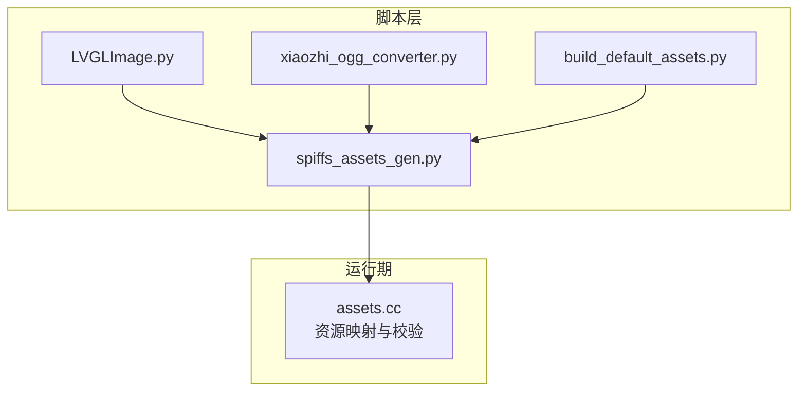
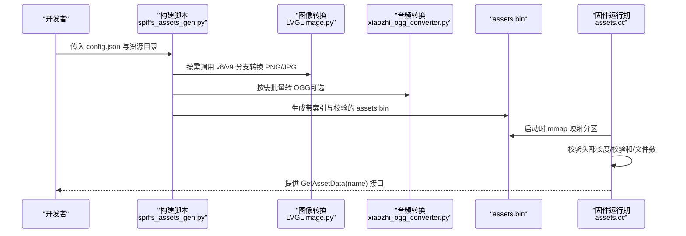
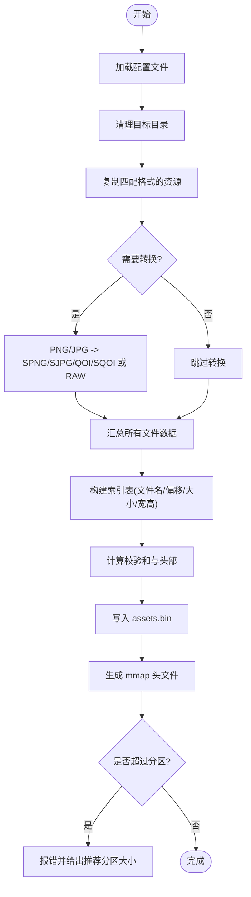
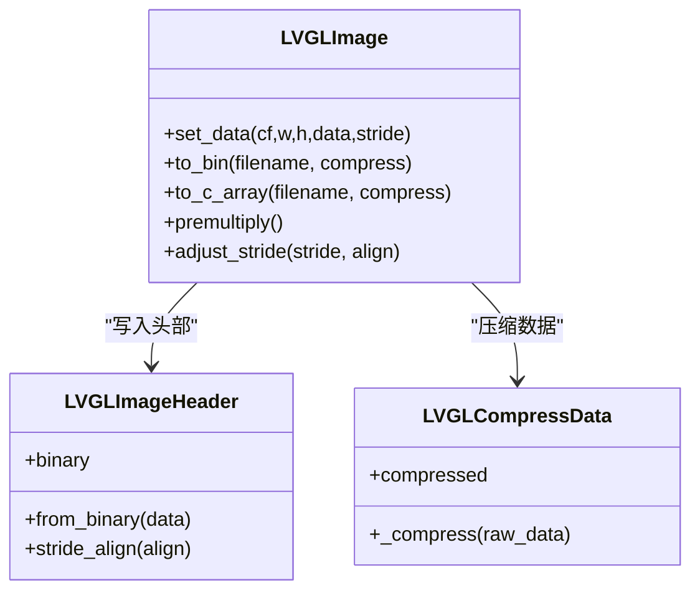
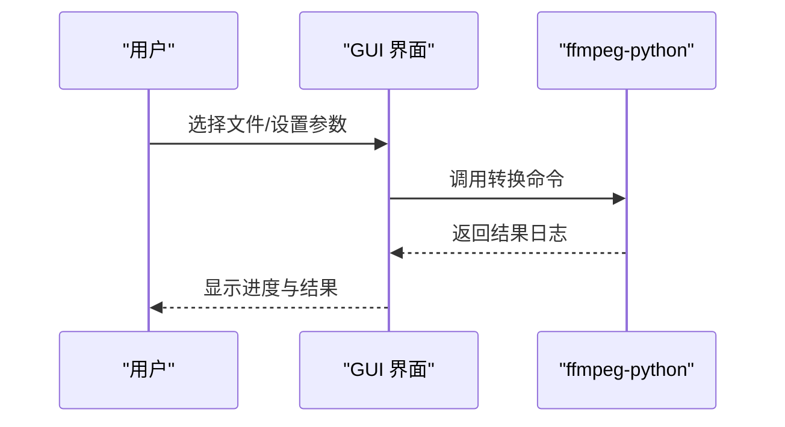
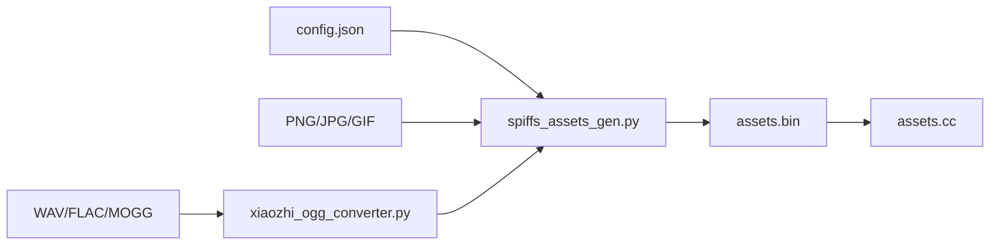

# 资源打包工具

<cite>
**本文引用的文件**
- [spiffs_assets_gen.py](file://scripts/spiffs_assets/spiffs_assets_gen.py)
- [README.md（SPIFFS）](file://scripts/spiffs_assets/README.md)
- [LVGLImage.py](file://scripts/Image_Converter/LVGLImage.py)
- [README.md（图像转换）](file://scripts/Image_Converter/README.md)
- [xiaozhi_ogg_converter.py](file://scripts/ogg_converter/xiaozhi_ogg_converter.py)
- [README.md（OGG转换）](file://scripts/ogg_converter/README.md)
- [build_default_assets.py](file://scripts/build_default_assets.py)
- [assets.cc](file://main/assets.cc)
</cite>

## 目录
1. [简介](#简介)
2. [项目结构](#项目结构)
3. [核心组件](#核心组件)
4. [架构总览](#架构总览)
5. [详细组件分析](#详细组件分析)
6. [依赖关系分析](#依赖关系分析)
7. [性能与优化建议](#性能与优化建议)
8. [故障排查指南](#故障排查指南)
9. [结论](#结论)
10. [附录](#附录)

## 简介
本手册面向需要在 ESP32 设备上使用 SPIFFS 分区承载资源的开发者，系统讲解以下能力：
- SPIFFS 资源打包流程与 spiffs_assets_gen.py 的使用方法与配置项
- LVGL 图片格式转换、压缩与分块策略
- OGG 音频批量转换与响度处理
- 资源管理最佳实践与性能优化建议
- 自定义资源格式的扩展方法

## 项目结构
与资源打包相关的脚本与说明集中在 scripts 目录下，运行时由 main 中的资源加载逻辑读取生成的 assets.bin。

图表来源
- [spiffs_assets_gen.py:1-648](file://scripts/spiffs_assets/spiffs_assets_gen.py#L1-L648)
- [LVGLImage.py:1-800](file://scripts/Image_Converter/LVGLImage.py#L1-L800)
- [xiaozhi_ogg_converter.py:1-231](file://scripts/ogg_converter/xiaozhi_ogg_converter.py#L1-L231)
- [build_default_assets.py:1-800](file://scripts/build_default_assets.py#L1-L800)
- [assets.cc:47-159](file://main/assets.cc#L47-L159)

章节来源
- [spiffs_assets_gen.py:1-648](file://scripts/spiffs_assets/spiffs_assets_gen.py#L1-L648)
- [build_default_assets.py:1-800](file://scripts/build_default_assets.py#L1-L800)
- [assets.cc:47-159](file://main/assets.cc#L47-L159)

## 核心组件
- spiffs_assets_gen.py：负责将多种资源（图片、字体、模型等）转换为设备可直映射的 assets.bin，并生成配套头文件；支持按高度切图、QOI/SJPG/SPNG 等格式输出，以及合并到应用二进制。
- LVGLImage.py：官方 LVGL 图片转换脚本，提供 BIN/C 数组输出、颜色格式选择、RLE/LZ4 压缩、预乘 alpha 等能力。
- xiaozhi_ogg_converter.py：基于 ffmpeg-python 的 OGG 批量转换 GUI 工具，支持音频转 OGG、OGG 回放参数设置、可选响度归一化。
- build_default_assets.py：根据 sdkconfig 自动组装默认资源（唤醒词模型、文本字体、表情集合等），并调用打包流程生成 assets.bin。
- assets.cc：运行期解析 assets.bin 头部、校验和、索引表，通过 mmap 映射分区进行零拷贝访问。

章节来源
- [spiffs_assets_gen.py:1-648](file://scripts/spiffs_assets/spiffs_assets_gen.py#L1-L648)
- [LVGLImage.py:1-800](file://scripts/Image_Converter/LVGLImage.py#L1-L800)
- [xiaozhi_ogg_converter.py:1-231](file://scripts/ogg_converter/xiaozhi_ogg_converter.py#L1-L231)
- [build_default_assets.py:1-800](file://scripts/build_default_assets.py#L1-L800)
- [assets.cc:47-159](file://main/assets.cc#L47-L159)

## 架构总览
资源构建与运行期加载的整体流程如下：

图表来源
- [spiffs_assets_gen.py:534-648](file://scripts/spiffs_assets/spiffs_assets_gen.py#L534-L648)
- [LVGLImage.py:388-489](file://scripts/Image_Converter/LVGLImage.py#L388-L489)
- [xiaozhi_ogg_converter.py:164-225](file://scripts/ogg_converter/xiaozhi_ogg_converter.py#L164-L225)
- [assets.cc:130-159](file://main/assets.cc#L130-L159)

## 详细组件分析

### SPIFFS 资源打包器（spiffs_assets_gen.py）
- 入口与模式
  - 命令行参数：--config 指定配置文件路径；--merge 表示将 assets.bin 追加到应用二进制末尾。
  - 两种工作流：
    - 构建模式：扫描输入资源，执行必要的格式转换与切图，生成 assets.bin 及对应头文件。
    - 合并模式：将 assets.bin 直接拼接到 app.bin 之后，便于烧录。
- 关键配置项（来自配置文件 JSON）
  - assets_path：资源源目录
  - image_file：输出的 assets.bin 路径
  - include_path：生成的头文件存放目录
  - lvgl_ver：LVGL 版本（影响内部调用的转换脚本分支）
  - assets_size：SPIFFS 分区大小（十六进制字符串），用于容量检查
  - support_format：允许处理的原始格式列表（如 .png, .jpg, .gif, .bin, .json）
  - name_length：文件名在索引表中固定宽度（字节）
  - split_height：图片按行高切分的阈值（0 表示不切）
  - support_qoi / support_sqoi：是否启用 QOI 相关转换
  - support_spng / support_sjpg：是否生成 SPNG/SJPG 分块格式
  - support_raw：是否生成 LVGL 兼容的 raw BIN（受 lvgl_ver 控制）
  - support_raw_dither / support_raw_bgr：raw 转换时的抖动与 BGR 标志
- 图像处理流水线
  - 复制匹配格式的文件到目标目录
  - 若启用 spng/sjpg/qoi/sqoi，则对 PNG/JPG 进行相应转换；当 split_height > 0 时，先按行切块再拼接为分块容器（SJPG/SPNG/SQOI）
  - 若启用 raw，则调用 LVGLImage.py 生成 BIN（v9 走下载脚本，v8 走本地仓库）
- 打包与索引
  - 遍历目标目录，收集每个文件的名称、偏移、大小、宽高（从 SJPG/SPNG/SQOI 或原图提取）
  - 生成内存映射表（文件名定长 + 文件大小 + 偏移 + 宽高）
  - 计算整体校验和，写入最终 header（文件数、校验和、数据区长度）+ 数据区
  - 生成 mmap_generate_xxx.h 头文件，包含枚举与常量，供 C/C++ 侧引用
- 容量校验
  - 对比 assets.bin 大小与配置的分区大小，超限则提示推荐分区大小并退出
- 合并模式
  - 将 assets.bin 直接追加到 app.bin 末尾，并重命名覆盖

图表来源
- [spiffs_assets_gen.py:534-648](file://scripts/spiffs_assets/spiffs_assets_gen.py#L534-L648)
- [spiffs_assets_gen.py:391-491](file://scripts/spiffs_assets/spiffs_assets_gen.py#L391-L491)
- [spiffs_assets_gen.py:492-533](file://scripts/spiffs_assets/spiffs_assets_gen.py#L492-L533)
- [spiffs_assets_gen.py:298-390](file://scripts/spiffs_assets/spiffs_assets_gen.py#L298-L390)

章节来源
- [spiffs_assets_gen.py:1-648](file://scripts/spiffs_assets/spiffs_assets_gen.py#L1-L648)
- [README.md（SPIFFS）:1-111](file://scripts/spiffs_assets/README.md#L1-L111)

### LVGL 图像转换（LVGLImage.py）
- 功能要点
  - 支持多种颜色格式（RAW、RGB565、ARGB8888、索引色等）
  - 支持 RLE/LZ4 压缩与预乘 alpha
  - 输出 BIN 或 C 数组，适配 LVGL 9.x 新头部格式
- 与本项目的集成
  - spiffs_assets_gen.py 会根据 lvgl_ver 自动选择 v8 或 v9 分支：
    - v9：动态下载官方脚本并执行
    - v8：拉取特定提交并使用内置转换函数
  - 通过 --cf/--ofmt/--compress 等参数控制输出格式与压缩方式
- 典型用法
  - 作为子进程被 spiffs_assets_gen.py 调用，无需手动执行
  - 也可独立使用以调试或批量转换

图表来源
- [LVGLImage.py:491-772](file://scripts/Image_Converter/LVGLImage.py#L491-L772)
- [LVGLImage.py:388-489](file://scripts/Image_Converter/LVGLImage.py#L388-L489)

章节来源
- [LVGLImage.py:1-800](file://scripts/Image_Converter/LVGLImage.py#L1-L800)
- [README.md（图像转换）:1-46](file://scripts/Image_Converter/README.md#L1-L46)

### OGG 音频批量转换（xiaozhi_ogg_converter.py）
- 功能要点
  - 图形界面，支持批量添加/移除/清空文件
  - 支持“音频转 OGG”和“OGG 转回音频”两种模式
  - 可选响度调整（LUFS 目标值）
  - 基于 ffmpeg-python 调用 ffmpeg 进行编解码
- 典型参数
  - 采样率：16000 Hz
  - 声道：单声道
  - 码率：16k
  - 帧时长：60ms
- 使用方式
  - 安装依赖后运行脚本，选择输入文件与输出目录，点击转换即可

图表来源
- [xiaozhi_ogg_converter.py:164-225](file://scripts/ogg_converter/xiaozhi_ogg_converter.py#L164-L225)

章节来源
- [xiaozhi_ogg_converter.py:1-231](file://scripts/ogg_converter/xiaozhi_ogg_converter.py#L1-231)
- [README.md（OGG转换）:1-37](file://scripts/ogg_converter/README.md#L1-L37)

### 默认资源构建（build_default_assets.py）
- 作用
  - 根据 sdkconfig 自动识别要集成的唤醒词模型、多语种语音模型、文本字体、表情集合等
  - 生成 index.json 与 config.json，并调用打包流程生成 assets.bin
- 主要步骤
  - 处理 SR 模型（wakenet/multinet），生成 srmodels.bin
  - 复制文本字体与表情集合
  - 生成 index.json（记录各资源清单）
  - 生成 config.json（驱动 spiffs_assets_gen.py 的打包参数）
  - 调用简化版打包函数生成 assets.bin

章节来源
- [build_default_assets.py:1-800](file://scripts/build_default_assets.py#L1-L800)

### 运行期资源加载（assets.cc）
- 职责
  - 查找并映射 SPIFFS 资源分区
  - 校验分区可用空间、mmap 映射、头部长度与校验和
  - 提供 GetAssetData(name) 接口，按文件名获取资源指针与大小
- 关键点
  - 头部前 12 字节包含：文件数、校验和、数据区长度
  - 校验失败或长度越界会拒绝加载

章节来源
- [assets.cc:47-159](file://main/assets.cc#L47-L159)

## 依赖关系分析
- 构建期依赖
  - Python 3.6+
  - Pillow（PIL）、numpy、packaging、qoi-conv（可选）
  - LVGLImage.py（v9 分支需联网下载；v8 分支需 git 仓库）
  - ffmpeg（OGG 转换）
- 运行期依赖
  - ESP-IDF 的 SPI Flash mmap 能力
  - cJSON（解析 index.json）

图表来源
- [spiffs_assets_gen.py:534-648](file://scripts/spiffs_assets/spiffs_assets_gen.py#L534-L648)
- [xiaozhi_ogg_converter.py:164-225](file://scripts/ogg_converter/xiaozhi_ogg_converter.py#L164-L225)
- [assets.cc:130-159](file://main/assets.cc#L130-L159)

章节来源
- [spiffs_assets_gen.py:1-648](file://scripts/spiffs_assets/spiffs_assets_gen.py#L1-L648)
- [xiaozhi_ogg_converter.py:1-231](file://scripts/ogg_converter/xiaozhi_ogg_converter.py#L1-231)
- [assets.cc:47-159](file://main/assets.cc#L47-L159)

## 性能与优化建议
- 图片资源
  - 优先使用 SPNG/SJPG/SQOI 分块格式，结合 split_height 降低单次解压/渲染压力
  - 合理选择颜色格式：图标/小图用 RGB565，复杂图用 ARGB8888；必要时开启预乘 alpha
  - 对大图采用分块存储，避免一次性载入大内存
- 音频资源
  - 统一 16kHz 单声道、16k 码率，帧时长 60ms，兼顾实时性与体积
  - 使用响度归一化保证播放一致性
- 打包与分区
  - 严格核对 assets_size 与实际大小，预留余量
  - 使用 --merge 将资源与固件合并，减少分区碎片
- 运行期
  - 利用 mmap 零拷贝优势，避免重复分配
  - 按需加载，避免一次性映射全部资源

[本节为通用指导，不直接分析具体文件]

## 故障排查指南
- 构建阶段
  - 未找到依赖库（Pillow、numpy、qoi-conv、ffmpeg）：安装对应依赖
  - LVGL 转换失败：检查网络（v9 分支需下载脚本）或本地仓库（v8 分支）
  - 资源超出分区：根据提示增大 assets_size 或精简资源
- 运行阶段
  - 无法映射分区：检查分区布局与可用页数量
  - 校验失败：确认 assets.bin 未被损坏或截断
  - 找不到 index.json：确认资源构建流程完整且 index.json 已生成

章节来源
- [spiffs_assets_gen.py:590-648](file://scripts/spiffs_assets/spiffs_assets_gen.py#L590-L648)
- [assets.cc:130-159](file://main/assets.cc#L130-L159)

## 结论
通过 spiffs_assets_gen.py、LVGLImage.py 与 xiaozhi_ogg_converter.py 的组合，本项目实现了从多源资源到设备端高效加载的一体化方案。配合 build_default_assets.py 的自动化装配与运行期 assets.cc 的零拷贝访问，可在有限资源下获得良好的体验。遵循本文的最佳实践与排障建议，可进一步提升构建稳定性与运行效率。

[本节为总结性内容，不直接分析具体文件]

## 附录

### 常用命令速查
- 构建资源
  - python scripts/spiffs_assets/spiffs_assets_gen.py --config <路径>/config.json
- 合并资源到固件
  - python scripts/spiffs_assets/spiffs_assets_gen.py --config <路径>/config.json --merge
- 运行 OGG 转换器
  - python scripts/ogg_converter/xiaozhi_ogg_converter.py
- 运行 LVGL 转换工具（GUI）
  - 参考 Image_Converter/README.md 中环境准备与运行说明

章节来源
- [README.md（SPIFFS）:18-50](file://scripts/spiffs_assets/README.md#L18-L50)
- [README.md（图像转换）:21-46](file://scripts/Image_Converter/README.md#L21-L46)
- [README.md（OGG转换）:25-37](file://scripts/ogg_converter/README.md#L25-L37)

### 配置项参考（节选）
- assets_path：资源源目录
- image_file：输出 assets.bin 路径
- include_path：生成头文件目录
- lvgl_ver：LVGL 版本（v8/v9）
- assets_size：分区大小（十六进制）
- support_format：允许处理的原始格式
- name_length：文件名固定宽度
- split_height：图片切块高度
- support_qoi/support_sqoi/support_spng/support_sjpg/support_raw：开关
- support_raw_dither/support_raw_bgr：raw 转换选项

章节来源
- [build_default_assets.py:325-351](file://scripts/build_default_assets.py#L325-L351)
- [spiffs_assets_gen.py:534-589](file://scripts/spiffs_assets/spiffs_assets_gen.py#L534-L589)

### 自定义资源格式扩展方法
- 新增一种静态资源类型（例如 .dat）
  - 在 copy_assets 中扩展支持的后缀判断与复制逻辑
  - 在 pack_assets 中确保该类型被纳入索引表（文件名、偏移、大小）
  - 如需元信息（如宽高），可扩展解析逻辑并在索引表中增加字段
- 新增一种图片编码（例如 .xxx）
  - 在 process_image 中添加新的输出后缀与头部标识
  - 在 create_header 中为该格式定义专属魔数字段
  - 在运行期 assets.cc 中扩展解析逻辑，识别新头部并正确定位数据区
- 注意事项
  - 保持索引表定长字段一致，避免破坏向后兼容
  - 更新 include 头文件生成逻辑，确保枚举与常量同步
  - 完善容量校验与错误提示

章节来源
- [spiffs_assets_gen.py:492-533](file://scripts/spiffs_assets/spiffs_assets_gen.py#L492-L533)
- [spiffs_assets_gen.py:391-491](file://scripts/spiffs_assets/spiffs_assets_gen.py#L391-L491)
- [spiffs_assets_gen.py:176-215](file://scripts/spiffs_assets/spiffs_assets_gen.py#L176-L215)
- [assets.cc:130-159](file://main/assets.cc#L130-L159)