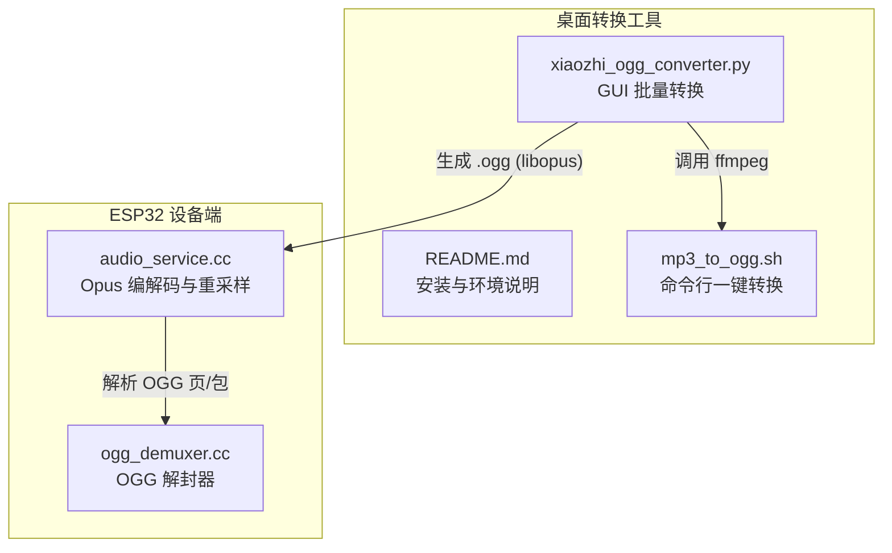
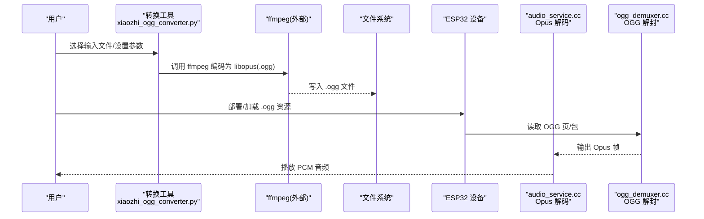
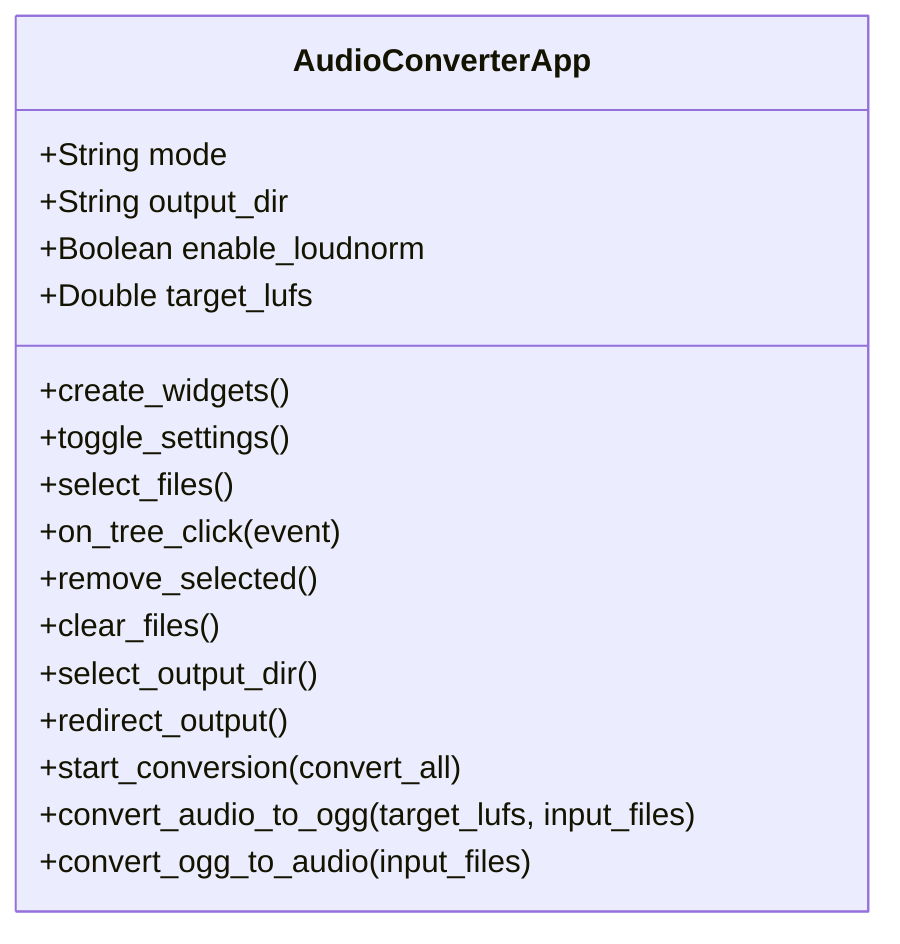
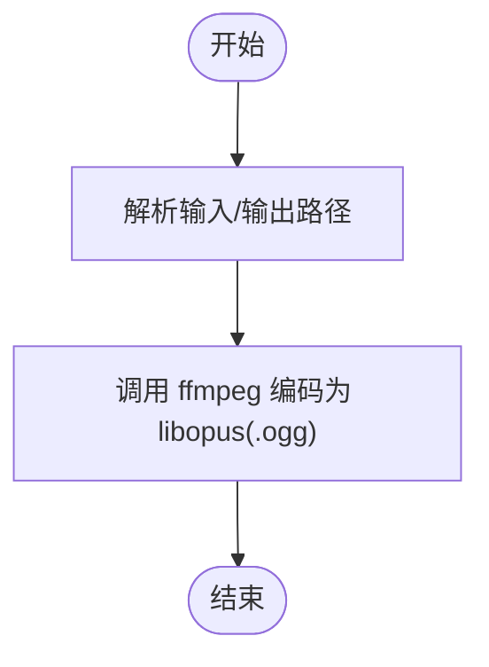
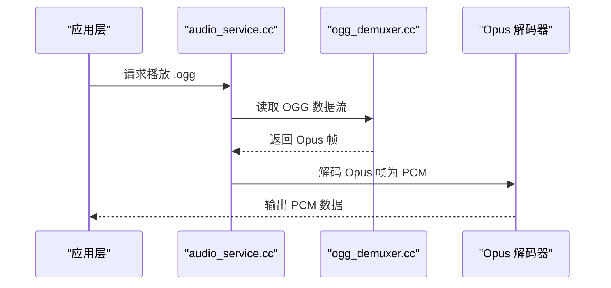
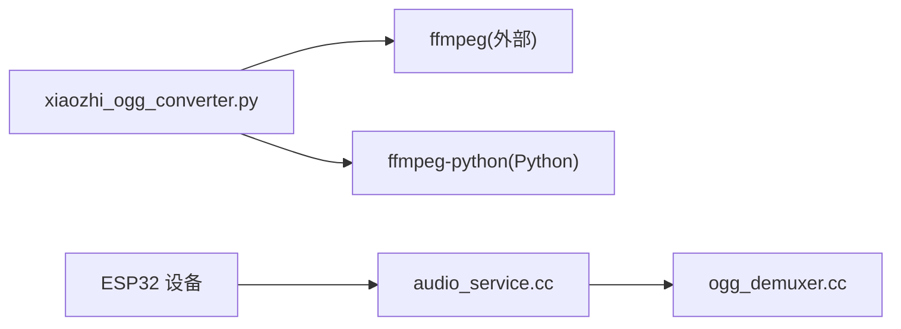

# 音频转换工具

<cite>
**本文引用的文件**
- [xiaozhi_ogg_converter.py](file://scripts/ogg_converter/xiaozhi_ogg_converter.py)
- [README.md](file://scripts/ogg_converter/README.md)
- [mp3_to_ogg.sh](file://scripts/mp3_to_ogg.sh)
- [audio_service.cc](file://main/audio/audio_service.cc)
- [ogg_demuxer.cc](file://main/audio/demuxer/ogg_demuxer.cc)
</cite>

## 目录
1. [简介](#简介)
2. [项目结构](#项目结构)
3. [核心组件](#核心组件)
4. [架构总览](#架构总览)
5. [详细组件分析](#详细组件分析)
6. [依赖关系分析](#依赖关系分析)
7. [性能与音质权衡](#性能与音质权衡)
8. [故障排查指南](#故障排查指南)
9. [结论](#结论)
10. [附录：使用示例与脚本](#附录使用示例与脚本)

## 简介
本手册面向需要在 ESP32 小智项目中准备 OGG/Opus 音频资源的用户，围绕 scripts/ogg_converter/xiaozhi_ogg_converter.py 提供的图形化批量转换工具进行说明。该工具基于 ffmpeg-python 调用系统 ffmpeg，将多种常见音频格式（如 WAV、FLAC、OGG）转换为设备端播放所需的 OGG/Opus 流，并支持响度归一化等预处理选项。同时提供命令行脚本 mp3_to_ogg.sh 用于快速批处理。文档还结合设备端解码器配置，解释采样率、码率、帧时长等参数对文件大小与音质的影响，给出选择建议与常见问题解决方案。

## 项目结构
与本工具相关的代码与脚本位于 scripts 目录下，设备端解码逻辑位于 main/audio 中。下图展示与音频转换相关的关键文件及其职责。

图表来源
- [xiaozhi_ogg_converter.py:1-231](file://scripts/ogg_converter/xiaozhi_ogg_converter.py#L1-L231)
- [README.md:1-37](file://scripts/ogg_converter/README.md#L1-L37)
- [mp3_to_ogg.sh:1-4](file://scripts/mp3_to_ogg.sh#L1-L4)
- [audio_service.cc:65-93](file://main/audio/audio_service.cc#L65-L93)
- [ogg_demuxer.cc:1-46](file://main/audio/demuxer/ogg_demuxer.cc#L1-L46)

章节来源
- [xiaozhi_ogg_converter.py:1-231](file://scripts/ogg_converter/xiaozhi_ogg_converter.py#L1-L231)
- [README.md:1-37](file://scripts/ogg_converter/README.md#L1-L37)
- [mp3_to_ogg.sh:1-4](file://scripts/mp3_to_ogg.sh#L1-L4)
- [audio_service.cc:65-93](file://main/audio/audio_service.cc#L65-L93)
- [ogg_demuxer.cc:1-46](file://main/audio/demuxer/ogg_demuxer.cc#L1-L46)

## 核心组件
- GUI 转换应用（AudioConverterApp）
  - 功能：选择输入文件、设置输出目录、选择转换模式（音频转 OGG / OGG 转回）、可选启用响度调整、批量转换、实时日志显示。
  - 关键流程：收集文件列表 → 创建输出目录 → 启动线程执行转换 → 逐文件调用 ffmpeg 完成编码。
- 命令行脚本（mp3_to_ogg.sh）
  - 功能：一行命令将 MP3 转为设备兼容的 OGG/Opus 流。
- 设备端解码链路
  - audio_service.cc：初始化 Opus 解码器/编码器、统一采样率为 16kHz、按固定帧时长切分数据。
  - ogg_demuxer.cc：实现 OGG 解封，读取页头“OggS”，解析包长度与分段表，逐步重组 Opus 包。

章节来源
- [xiaozhi_ogg_converter.py:8-231](file://scripts/ogg_converter/xiaozhi_ogg_converter.py#L8-L231)
- [mp3_to_ogg.sh:1-4](file://scripts/mp3_to_ogg.sh#L1-L4)
- [audio_service.cc:65-93](file://main/audio/audio_service.cc#L65-L93)
- [ogg_demuxer.cc:1-46](file://main/audio/demuxer/ogg_demuxer.cc#L1-L46)

## 架构总览
从资源准备到设备播放的整体流程如下：

图表来源
- [xiaozhi_ogg_converter.py:189-206](file://scripts/ogg_converter/xiaozhi_ogg_converter.py#L189-L206)
- [mp3_to_ogg.sh:1-4](file://scripts/mp3_to_ogg.sh#L1-L4)
- [audio_service.cc:65-93](file://main/audio/audio_service.cc#L65-L93)
- [ogg_demuxer.cc:1-46](file://main/audio/demuxer/ogg_demuxer.cc#L1-L46)

## 详细组件分析

### 组件A：GUI 转换应用（AudioConverterApp）
- 主要职责
  - 管理 UI 状态（模式、目标 LUFS、输出目录）。
  - 维护文件列表与选中状态。
  - 在后台线程中串行处理每个文件的转换任务。
  - 捕获 ffmpeg 输出并重定向至日志区。
- 关键方法
  - start_conversion：汇总待转文件、创建输出目录、根据模式选择具体转换函数。
  - convert_audio_to_ogg：以 libopus 编码为 OGG，固定采样率 16kHz、单声道、码率 16kbps、帧时长 60ms。
  - convert_ogg_to_audio：当前实现仍输出 OGG（保持与音频转 OGG 一致），便于校验或二次处理。
- 错误处理
  - 无输入文件时弹窗提示。
  - 单个文件异常被 try/except 捕获并打印失败信息，不影响其他文件继续处理。

图表来源
- [xiaozhi_ogg_converter.py:8-231](file://scripts/ogg_converter/xiaozhi_ogg_converter.py#L8-L231)

章节来源
- [xiaozhi_ogg_converter.py:102-187](file://scripts/ogg_converter/xiaozhi_ogg_converter.py#L102-L187)
- [xiaozhi_ogg_converter.py:189-225](file://scripts/ogg_converter/xiaozhi_ogg_converter.py#L189-L225)

### 组件B：命令行脚本（mp3_to_ogg.sh）
- 功能：接收输入 MP3 与输出 OGG 路径，调用 ffmpeg 以 libopus 编码，参数与 GUI 默认值保持一致（16k 码率、单声道、16kHz、60ms 帧）。
- 适用场景：CI/CD 流水线、批量构建资源、自动化测试。

图表来源
- [mp3_to_ogg.sh:1-4](file://scripts/mp3_to_ogg.sh#L1-L4)

章节来源
- [mp3_to_ogg.sh:1-4](file://scripts/mp3_to_ogg.sh#L1-L4)

### 组件C：设备端解码链路（audio_service.cc 与 ogg_demuxer.cc）
- audio_service.cc
  - 初始化 Opus 解码器/编码器，统一采样率为 16kHz，按固定帧时长（OPUS_FRAME_DURATION_MS）计算每帧样本数。
  - 若输入采样率非 16kHz，则插入重采样器以保证后续处理一致性。
- ogg_demuxer.cc
  - 实现 OGG 解封：寻找页头“OggS”，解析分段表与包体，逐步重组 Opus 包供解码器使用。

图表来源
- [audio_service.cc:65-93](file://main/audio/audio_service.cc#L65-L93)
- [ogg_demuxer.cc:1-46](file://main/audio/demuxer/ogg_demuxer.cc#L1-L46)

章节来源
- [audio_service.cc:65-93](file://main/audio/audio_service.cc#L65-L93)
- [ogg_demuxer.cc:1-46](file://main/audio/demuxer/ogg_demuxer.cc#L1-L46)

## 依赖关系分析
- 外部依赖
  - ffmpeg：实际音视频编解码引擎，需安装并可被系统 PATH 访问。
  - ffmpeg-python：Python 封装库，用于在 GUI 应用中构造 ffmpeg 命令。
- 内部依赖
  - GUI 应用通过 ffmpeg-python 调用系统 ffmpeg。
  - 设备端 audio_service.cc 与 ogg_demuxer.cc 共同完成 OGG/Opus 的解封与解码。

图表来源
- [xiaozhi_ogg_converter.py:1-231](file://scripts/ogg_converter/xiaozhi_ogg_converter.py#L1-L231)
- [audio_service.cc:65-93](file://main/audio/audio_service.cc#L65-L93)
- [ogg_demuxer.cc:1-46](file://main/audio/demuxer/ogg_demuxer.cc#L1-L46)

章节来源
- [xiaozhi_ogg_converter.py:1-231](file://scripts/ogg_converter/xiaozhi_ogg_converter.py#L1-L231)
- [audio_service.cc:65-93](file://main/audio/audio_service.cc#L65-L93)
- [ogg_demuxer.cc:1-46](file://main/audio/demuxer/ogg_demuxer.cc#L1-L46)

## 性能与音质权衡
- 采样率（ar=16000）
  - 设备端统一使用 16kHz，语音清晰度足够且节省带宽与内存。
  - 过低会损失高频细节；过高会增加体积与解码负担。
- 码率（audio_bitrate='16k'）
  - 16kbps 适合语音通话场景，体积小、延迟低；音乐或复杂环境声可能显得单薄。
  - 提高码率可改善音质但增大文件体积与网络传输压力。
- 帧时长（frame_duration=60）
  - 60ms 帧长兼顾延迟与压缩效率；更短帧降低延迟但增加开销，更长帧提升压缩效率但增加延迟。
- 声道数（ac=1）
  - 单声道显著减小体积，语音场景通常无需立体声。
- 响度调整（LUFS）
  - 可在转换前进行响度归一化，使不同素材音量一致，避免播放时忽大忽小。
  - 目标 LUFS 越小（负值越大）整体越安静，需结合实际听感与设备增益调节。

章节来源
- [xiaozhi_ogg_converter.py:189-206](file://scripts/ogg_converter/xiaozhi_ogg_converter.py#L189-L206)
- [audio_service.cc:65-93](file://main/audio/audio_service.cc#L65-L93)

## 故障排查指南
- 找不到 ffmpeg
  - 现象：运行 GUI 或脚本时报错无法找到 ffmpeg。
  - 解决：安装 ffmpeg 并将其加入系统 PATH，或将可执行文件放置于脚本所在目录。
- 转换后设备无法播放
  - 现象：OGG 文件存在但设备端报错或无声。
  - 排查要点：
    - 确认采样率、声道数、帧时长与设备端一致（16kHz、单声道、60ms）。
    - 检查 OGG 页头是否完整，解封器是否能正确解析。
- 播放音量不一致
  - 现象：不同素材播放音量差异明显。
  - 解决：开启响度调整并设置合适的目标 LUFS，确保各素材响度一致。
- 转换速度慢
  - 现象：大批量转换耗时较长。
  - 优化：减少不必要的预处理；合理设置码率与帧时长；必要时分批处理。

章节来源
- [README.md:1-37](file://scripts/ogg_converter/README.md#L1-L37)
- [ogg_demuxer.cc:1-46](file://main/audio/demuxer/ogg_demuxer.cc#L1-L46)
- [audio_service.cc:65-93](file://main/audio/audio_service.cc#L65-L93)

## 结论
xiaozhi_ogg_converter.py 提供了直观的批量转换能力，配合 mp3_to_ogg.sh 可实现高效的一键式资源生产。结合设备端解码器的固定参数（16kHz、单声道、60ms 帧），建议在资源制作阶段严格对齐这些参数，以获得稳定一致的播放体验。对于语音为主的场景，16kbps 已能取得良好平衡；如需更高音质，可适当上调码率并评估体积与延迟代价。

## 附录：使用示例与脚本

- 安装与运行（GUI）
  - 参考 README 中的虚拟环境与依赖安装步骤，确保 ffmpeg 可用后运行脚本打开 GUI。
  - 在 GUI 中选择输入文件、设置输出目录、按需启用响度调整，点击“转换全部文件”或“转换选中文件”。

- 命令行批量转换（MP3→OGG）
  - 使用脚本：./mp3_to_ogg.sh <输入MP3> <输出OGG>
  - 适用于 CI/CD 或大量文件的一次性转换。

- 设备端兼容性要点
  - 采样率：16kHz
  - 声道：单声道
  - 帧时长：60ms
  - 编码：libopus（容器：OGG）

章节来源
- [README.md:1-37](file://scripts/ogg_converter/README.md#L1-L37)
- [mp3_to_ogg.sh:1-4](file://scripts/mp3_to_ogg.sh#L1-L4)
- [audio_service.cc:65-93](file://main/audio/audio_service.cc#L65-L93)