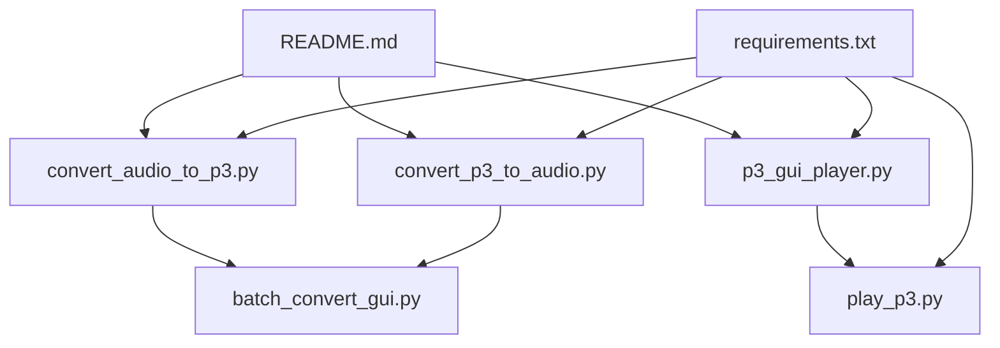
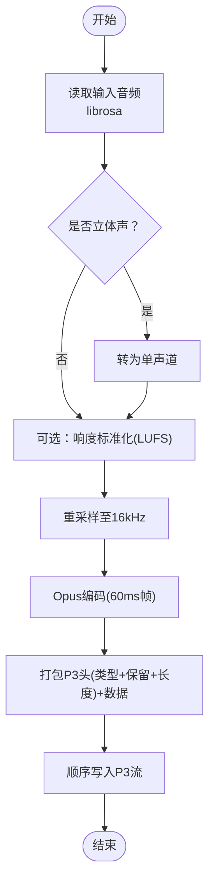
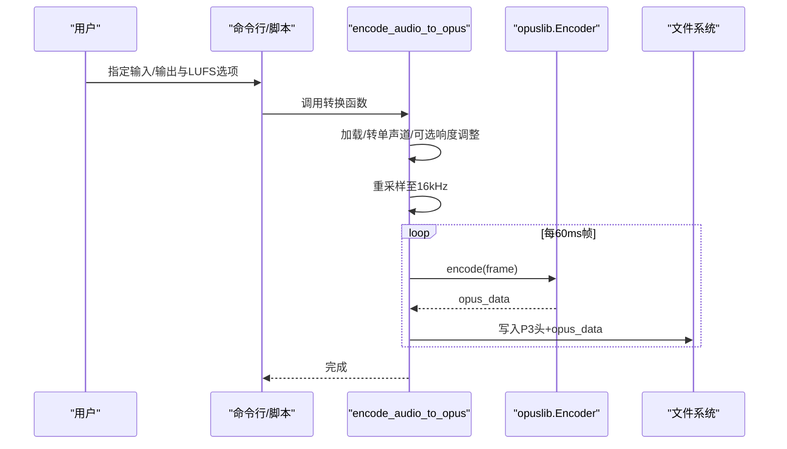
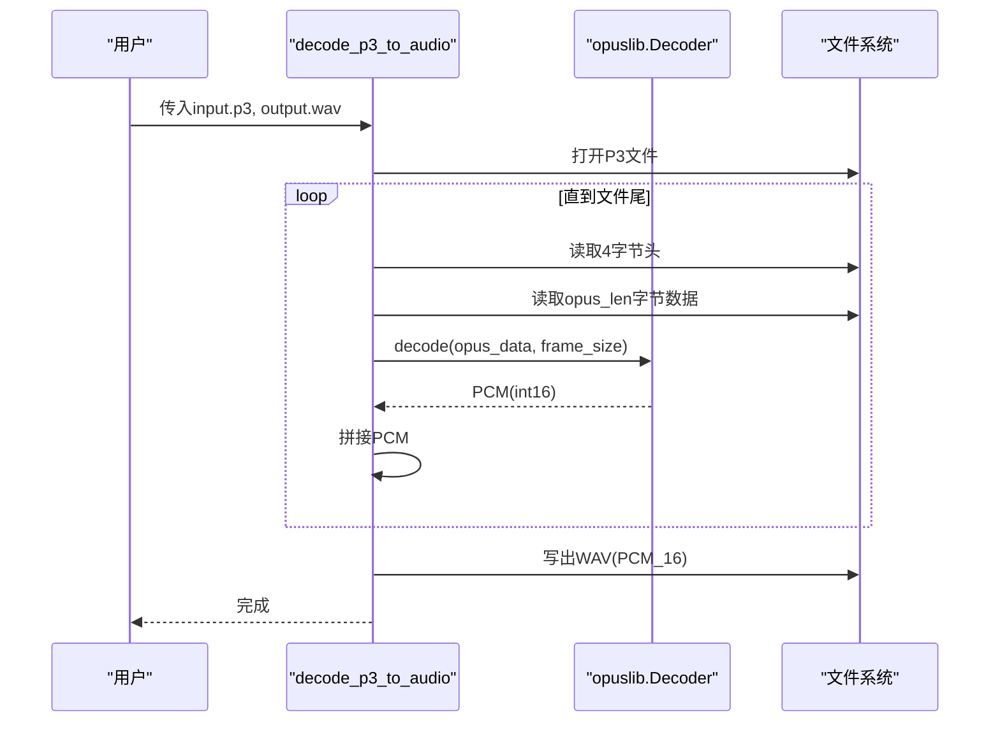
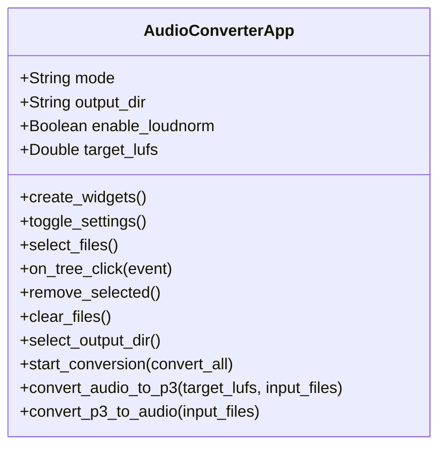
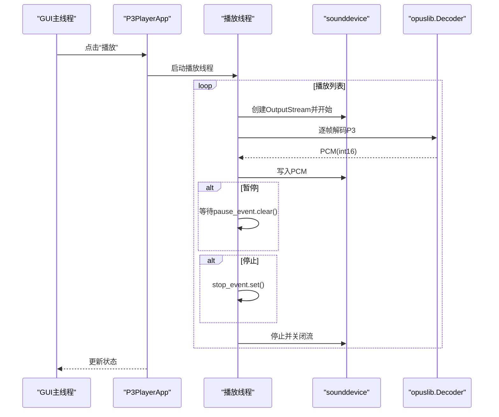
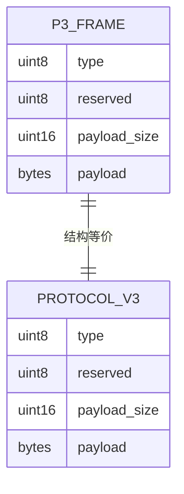

# P3音频格式工具集

<cite>
**本文引用的文件**   
- [convert_audio_to_p3.py](file://scripts/p3_tools/convert_audio_to_p3.py)
- [convert_p3_to_audio.py](file://scripts/p3_tools/convert_p3_to_audio.py)
- [batch_convert_gui.py](file://scripts/p3_tools/batch_convert_gui.py)
- [p3_gui_player.py](file://scripts/p3_tools/p3_gui_player.py)
- [play_p3.py](file://scripts/p3_tools/play_p3.py)
- [README.md](file://scripts/p3_tools/README.md)
- [requirements.txt](file://scripts/p3_tools/requirements.txt)
- [protocol.h](file://main/protocols/protocol.h)
- [websocket_protocol.cc](file://main/protocols/websocket_protocol.cc)
</cite>

## 目录
1. [简介](#简介)
2. [项目结构](#项目结构)
3. [核心组件](#核心组件)
4. [架构总览](#架构总览)
5. [详细组件分析](#详细组件分析)
6. [依赖与安装](#依赖与安装)
7. [P3格式技术规格](#p3格式技术规格)
8. [性能优化建议](#性能优化建议)
9. [故障排查指南](#故障排查指南)
10. [结论](#结论)

## 简介
本文件为“P3音频格式工具集”的完整使用文档，覆盖以下能力：
- 将普通音频批量转换为P3格式（含响度标准化选项）
- 将P3格式回退为普通音频文件（如WAV）
- GUI播放器播放P3文件（支持播放列表、暂停/停止、循环播放）
- 命令行工具的参数说明与典型使用场景
- 批处理转换自动化脚本使用方法
- P3格式的技术规格与性能优化建议

## 项目结构
P3工具集位于 scripts/p3_tools 目录下，包含如下关键文件：
- convert_audio_to_p3.py：音频转P3（含响度归一化）
- convert_p3_to_audio.py：P3转音频（输出PCM/WAV）
- batch_convert_gui.py：图形化批量转换工具
- p3_gui_player.py：图形化P3播放器
- play_p3.py：命令行P3播放器
- README.md：使用说明与格式说明
- requirements.txt：Python依赖清单

图表来源
- [convert_audio_to_p3.py:1-62](file://scripts/p3_tools/convert_audio_to_p3.py#L1-L62)
- [convert_p3_to_audio.py:1-52](file://scripts/p3_tools/convert_p3_to_audio.py#L1-L52)
- [batch_convert_gui.py:1-221](file://scripts/p3_tools/batch_convert_gui.py#L1-L221)
- [p3_gui_player.py:1-242](file://scripts/p3_tools/p3_gui_player.py#L1-L242)
- [play_p3.py:1-72](file://scripts/p3_tools/play_p3.py#L1-L72)
- [README.md:1-95](file://scripts/p3_tools/README.md#L1-L95)
- [requirements.txt:1-8](file://scripts/p3_tools/requirements.txt#L1-L8)

章节来源
- [README.md:1-95](file://scripts/p3_tools/README.md#L1-L95)

## 核心组件
- 音频转P3：读取任意常见音频，统一采样率至16kHz单声道，可选进行响度标准化（LUFS），按60ms帧切分并Opus编码，写入P3流式包。
- P3转音频：解析P3头部，解码Opus帧，拼接PCM后以WAV保存。
- 批量转换GUI：提供模式切换（音频→P3 / P3→音频）、文件选择、勾选控制、输出目录设置、进度日志与线程化执行。
- GUI播放器：加载P3播放列表，支持播放/暂停/停止、循环播放、当前项高亮与状态提示。
- 命令行播放器：直接播放单个P3文件，适合快速验证或集成到脚本。

章节来源
- [convert_audio_to_p3.py:11-49](file://scripts/p3_tools/convert_audio_to_p3.py#L11-L49)
- [convert_p3_to_audio.py:9-43](file://scripts/p3_tools/convert_p3_to_audio.py#L9-L43)
- [batch_convert_gui.py:9-221](file://scripts/p3_tools/batch_convert_gui.py#L9-L221)
- [p3_gui_player.py:75-242](file://scripts/p3_tools/p3_gui_player.py#L75-L242)
- [play_p3.py:8-61](file://scripts/p3_tools/play_p3.py#L8-L61)

## 架构总览
下图展示了从原始音频到P3文件的转换流程，以及P3播放与回退路径。

图表来源
- [convert_audio_to_p3.py:11-49](file://scripts/p3_tools/convert_audio_to_p3.py#L11-L49)

章节来源
- [convert_audio_to_p3.py:11-49](file://scripts/p3_tools/convert_audio_to_p3.py#L11-L49)

## 详细组件分析

### 组件A：音频转P3（convert_audio_to_p3.py）
- 功能要点
  - 自动检测并转为单声道
  - 可选响度标准化（pyloudnorm），默认目标-16 LUFS
  - 统一采样率至16kHz
  - 60ms Opus帧打包，固定P3头部格式
- 关键流程
  - 加载音频 → 可选响度调整 → 重采样 → 编码 → 写包
- 复杂度与性能
  - I/O为主，CPU集中在Opus编码；tqdm用于进度显示
- 错误处理
  - 异常捕获由上层GUI或调用方处理；脚本本身未显式抛出业务异常

图表来源
- [convert_audio_to_p3.py:11-49](file://scripts/p3_tools/convert_audio_to_p3.py#L11-L49)

章节来源
- [convert_audio_to_p3.py:11-49](file://scripts/p3_tools/convert_audio_to_p3.py#L11-L49)

### 组件B：P3转音频（convert_p3_to_audio.py）
- 功能要点
  - 解析P3头（类型+保留+长度）
  - 逐帧解码Opus为PCM
  - 拼接PCM并保存为WAV（PCM_16）
- 关键流程
  - 打开P3 → 读头 → 解码 → 拼接 → 写出WAV
- 复杂度与性能
  - 线性遍历，I/O与解码为主；tqdm显示字节级进度

图表来源
- [convert_p3_to_audio.py:9-43](file://scripts/p3_tools/convert_p3_to_audio.py#L9-L43)

章节来源
- [convert_p3_to_audio.py:9-43](file://scripts/p3_tools/convert_p3_to_audio.py#L9-L43)

### 组件C：批量转换GUI（batch_convert_gui.py）
- 界面与交互
  - 模式选择：音频→P3 / P3→音频
  - 响度设置：启用/禁用与目标LUFS值（仅音频→P3时可见）
  - 文件管理：多选、勾选、移除、清空
  - 输出目录：可浏览选择
  - 日志区：实时打印转换过程
- 执行模型
  - 通过线程启动转换任务，避免阻塞UI
  - 根据模式分别调用对应转换函数
- 注意事项
  - 音频→P3模式下，短音频或已调响度的TTS音频建议关闭响度调整

图表来源
- [batch_convert_gui.py:9-221](file://scripts/p3_tools/batch_convert_gui.py#L9-L221)

章节来源
- [batch_convert_gui.py:9-221](file://scripts/p3_tools/batch_convert_gui.py#L9-L221)

### 组件D：GUI播放器（p3_gui_player.py）
- 功能特性
  - 添加多个P3文件形成播放列表
  - 播放/暂停/停止控制
  - 循环播放开关
  - 当前播放项高亮与状态栏提示
- 播放实现
  - 使用sounddevice.OutputStream实时输出PCM
  - 内部线程驱动播放循环，事件控制暂停/停止
- 适用场景
  - 本地调试、预览、演示

图表来源
- [p3_gui_player.py:75-242](file://scripts/p3_tools/p3_gui_player.py#L75-L242)

章节来源
- [p3_gui_player.py:75-242](file://scripts/p3_tools/p3_gui_player.py#L75-L242)

### 组件E：命令行播放器（play_p3.py）
- 功能要点
  - 直接播放单个P3文件
  - 基于sounddevice输出PCM
- 使用场景
  - 快速验证P3文件有效性
  - 在CI或脚本中作为播放断言

章节来源
- [play_p3.py:8-61](file://scripts/p3_tools/play_p3.py#L8-L61)

## 依赖与安装
- 依赖清单见 requirements.txt，包括 librosa、opuslib、numpy、tqdm、sounddevice、pyloudnorm、soundfile。
- 安装方式
  - pip install -r scripts/p3_tools/requirements.txt
- 平台注意
  - sounddevice 需要系统音频后端可用（Windows/Mac/Linux）
  - librosa/soundfile 可能依赖FFmpeg等外部库，请确保环境满足要求

章节来源
- [requirements.txt:1-8](file://scripts/p3_tools/requirements.txt#L1-L8)

## P3格式技术规格
- 基本定义
  - 每个音频帧由一个4字节头部与紧随其后的Opus数据包组成
  - 头部字段：类型(1字节)、保留(1字节)、长度(2字节，网络序)
  - 音频参数：采样率16kHz，单声道，每帧时长60ms
- 与协议层的映射
  - 该P3帧结构与二进制协议V3的载荷一致，便于在网络传输中使用
  - 协议V3结构包含类型、保留、payload_size及payload[]，与P3帧头含义一致

图表来源
- [protocol.h:26-31](file://main/protocols/protocol.h#L26-L31)
- [websocket_protocol.cc:128-137](file://main/protocols/websocket_protocol.cc#L128-L137)

章节来源
- [README.md:89-95](file://scripts/p3_tools/README.md#L89-L95)
- [protocol.h:26-31](file://main/protocols/protocol.h#L26-L31)
- [websocket_protocol.cc:128-137](file://main/protocols/websocket_protocol.cc#L128-L137)

## 性能优化建议
- 编码阶段
  - 合理设置LUFS目标值，避免过度响度调整导致失真
  - 对长音频可考虑多线程预处理（如重采样/响度计算）后再编码
- 解码与播放
  - 使用sounddevice的低延迟配置（buffer size）以降低端到端延迟
  - 预缓冲策略：先解码若干帧再开始播放，减少首开卡顿
- I/O优化
  - 批量转换时尽量使用SSD存储，减少磁盘瓶颈
  - 大文件处理时避免频繁小对象分配（当前实现已采用数组拼接）

[本节为通用指导，不直接分析具体文件]

## 故障排查指南
- 无法找到输入文件
  - 检查路径是否正确，GUI中选择文件后确认列表中存在
- 转换失败或无输出
  - 查看GUI日志区域输出的错误信息
  - 确认依赖库版本满足 requirements.txt 要求
- 播放无声或爆音
  - 检查系统音频设备是否正常
  - 尝试降低sounddevice缓冲区大小以减少延迟
- 响度异常
  - 对于短音频或TTS音频，建议在GUI中关闭响度调整或使用-d参数

章节来源
- [batch_convert_gui.py:149-163](file://scripts/p3_tools/batch_convert_gui.py#L149-L163)
- [README.md:17-25](file://scripts/p3_tools/README.md#L17-L25)

## 结论
P3工具集提供了从音频到P3的完整工作流：高质量编码、便捷批量转换、可视化播放与回退能力。结合P3与协议V3的结构一致性，可在离线与在线场景中无缝衔接。建议在生产环境中结合缓存与预缓冲策略，以获得更优的端到端体验。