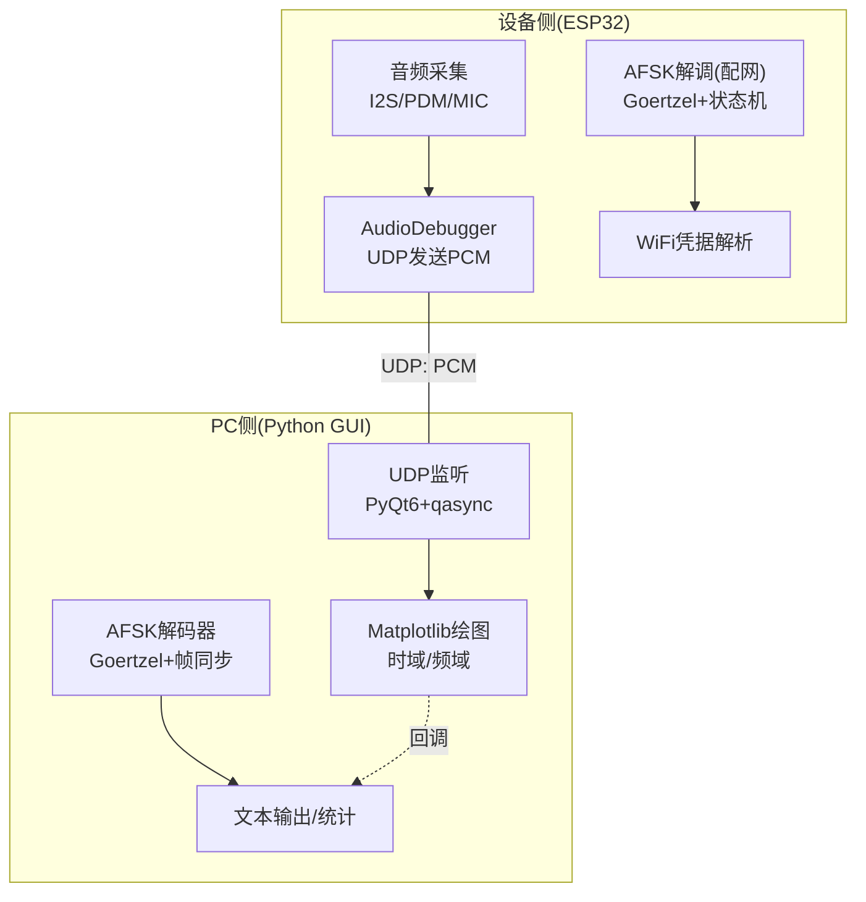
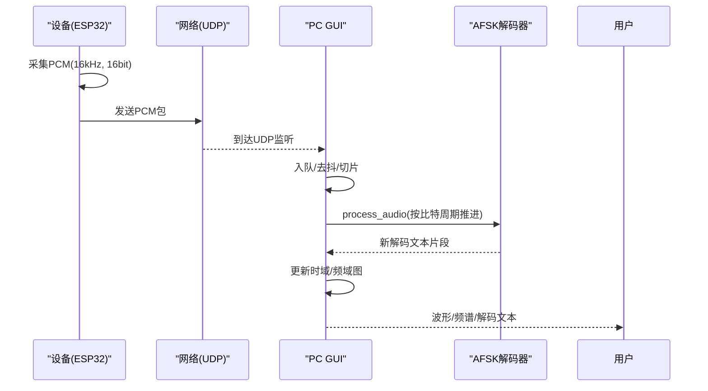
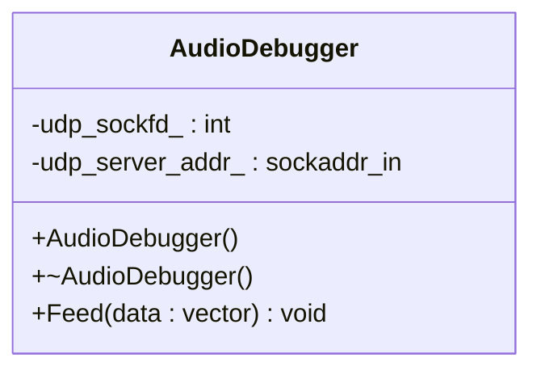
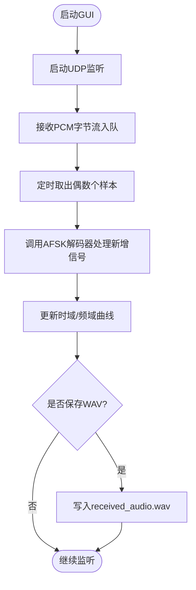
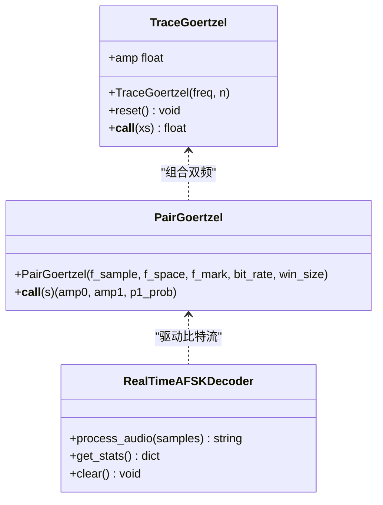
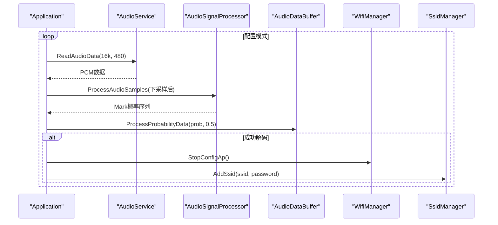
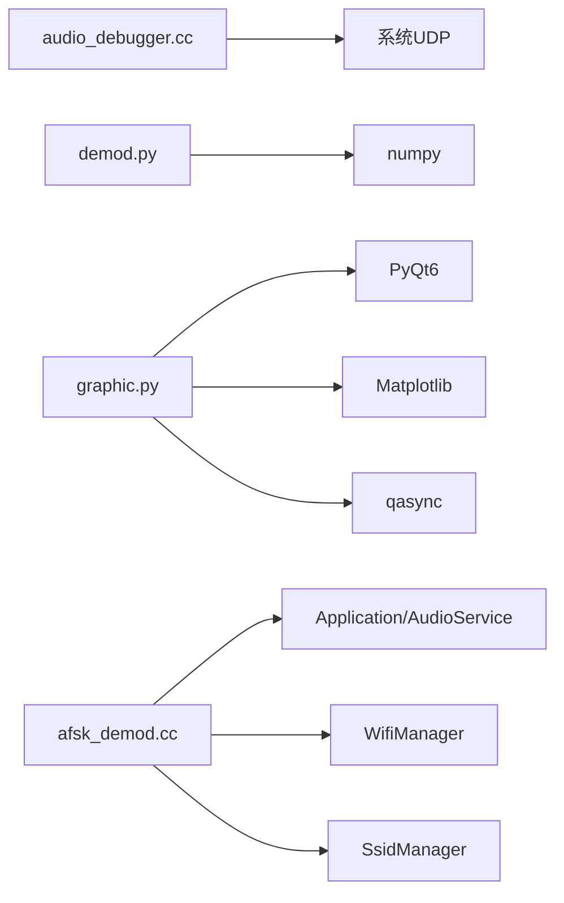

# 声学检测分析工具

<cite>
**本文引用的文件列表**
- [scripts/acoustic_check/readme.md](file://scripts/acoustic_check/readme.md)
- [scripts/acoustic_check/main.py](file://scripts/acoustic_check/main.py)
- [scripts/acoustic_check/graphic.py](file://scripts/acoustic_check/graphic.py)
- [scripts/acoustic_check/demod.py](file://scripts/acoustic_check/demod.py)
- [main/audio/processors/audio_debugger.h](file://main/audio/processors/audio_debugger.h)
- [main/audio/processors/audio_debugger.cc](file://main/audio/processors/audio_debugger.cc)
- [main/boards/common/afsk_demod.h](file://main/boards/common/afsk_demod.h)
- [main/boards/common/afsk_demod.cc](file://main/boards/common/afsk_demod.cc)
</cite>

## 目录
1. [简介](#简介)
2. [项目结构](#项目结构)
3. [核心组件](#核心组件)
4. [架构总览](#架构总览)
5. [详细组件分析](#详细组件分析)
6. [依赖关系分析](#依赖关系分析)
7. [性能与实时性考虑](#性能与实时性考虑)
8. [故障诊断与排错指南](#故障诊断与排错指南)
9. [结论](#结论)
10. [附录：标准测试流程与结果解读](#附录：标准测试流程与结果解读)

## 简介
本指南面向使用“小智”设备的声学检测与分析人员，提供一套基于现有代码的端到端使用说明。重点覆盖：
- 音频质量分析：信噪比、频率响应、失真度等指标的计算方法与观测手段
- 波形可视化：实时波形、频谱图、瀑布图的实现与使用方法
- 解调模块：AFSK 解调原理、参数配置与应用场景（如声波配网）
- 调试最佳实践：设备侧 UDP 回传、PC 端接收与解码、常见问题定位
- 标准测试流程：从准备到执行、记录与结果判读

## 项目结构
本项目包含两部分关键内容：
- 设备侧（ESP32 固件）：音频采集、可选降噪、UDP 回传 PCM 数据、AFSK 解调（用于声波配网）
- PC 侧（Python GUI）：UDP 接收 PCM、实时时域/频域显示、AFSK 文本解码、保存 WAV

图表来源
- [main/audio/processors/audio_debugger.cc:16-66](file://main/audio/processors/audio_debugger.cc#L16-L66)
- [scripts/acoustic_check/graphic.py:23-109](file://scripts/acoustic_check/graphic.py#L23-L109)
- [scripts/acoustic_check/demod.py:126-224](file://scripts/acoustic_check/demod.py#L126-L224)
- [main/boards/common/afsk_demod.cc:16-108](file://main/boards/common/afsk_demod.cc#L16-L108)

章节来源
- [scripts/acoustic_check/readme.md:1-23](file://scripts/acoustic_check/readme.md#L1-L23)

## 核心组件
- 设备侧音频调试通道
  - 通过 AudioDebugger 将 PCM 数据以 UDP 发送到配置的服务器地址和端口
  - 需要启用编译选项并设置目标地址
- PC 侧图形界面
  - 基于 PyQt6 + Matplotlib 的实时波形与频谱显示
  - 内置 AFSK 解码器，支持起始/结束帧识别与 ASCII 文本输出
- 设备侧 AFSK 解调（配网用途）
  - 基于 Goertzel 的双频检测与概率判决
  - 帧头/帧尾匹配与校验和验证，最终提取 SSID/密码

章节来源
- [main/audio/processors/audio_debugger.h:10-20](file://main/audio/processors/audio_debugger.h#L10-L20)
- [main/audio/processors/audio_debugger.cc:16-66](file://main/audio/processors/audio_debugger.cc#L16-L66)
- [scripts/acoustic_check/graphic.py:23-109](file://scripts/acoustic_check/graphic.py#L23-L109)
- [scripts/acoustic_check/demod.py:126-224](file://scripts/acoustic_check/demod.py#L126-L224)
- [main/boards/common/afsk_demod.h:12-23](file://main/boards/common/afsk_demod.h#L12-L23)
- [main/boards/common/afsk_demod.cc:16-108](file://main/boards/common/afsk_demod.cc#L16-L108)

## 架构总览
下图展示了从设备采集到 PC 可视化的完整链路，以及 AFSK 解调在两端的一致性设计。

图表来源
- [main/audio/processors/audio_debugger.cc:54-66](file://main/audio/processors/audio_debugger.cc#L54-L66)
- [scripts/acoustic_check/graphic.py:118-182](file://scripts/acoustic_check/graphic.py#L118-L182)
- [scripts/acoustic_check/demod.py:179-224](file://scripts/acoustic_check/demod.py#L179-L224)

## 详细组件分析

### 设备侧：音频调试通道（UDP 回传 PCM）
- 功能要点
  - 构造 UDP Socket，解析配置的目标地址与端口
  - 将 PCM 数据直接 sendto 至 PC 端监听程序
  - 仅在启用相应编译开关时生效
- 关键接口
  - 构造函数：初始化 socket 与远端地址
  - Feed：发送 PCM 向量
- 注意事项
  - 若地址格式不正确或创建 socket 失败，会记录警告日志
  - 需确保设备与 PC 在同一网络且防火墙允许 UDP

图表来源
- [main/audio/processors/audio_debugger.h:10-20](file://main/audio/processors/audio_debugger.h#L10-L20)
- [main/audio/processors/audio_debugger.cc:16-66](file://main/audio/processors/audio_debugger.cc#L16-L66)

章节来源
- [main/audio/processors/audio_debugger.h:10-20](file://main/audio/processors/audio_debugger.h#L10-L20)
- [main/audio/processors/audio_debugger.cc:16-66](file://main/audio/processors/audio_debugger.cc#L16-L66)

### PC 侧：实时波形与频谱可视化
- 功能要点
  - 启动 UDP 监听，接收 PCM 字节流
  - 将数据转换为归一化浮点序列，维护滑动窗口
  - 每 100ms 刷新一次：绘制时域波形与 FFT 频谱（限制显示范围）
  - 提供保存为 WAV 的功能
- 交互控制
  - 输入监听地址与端口，点击开始/停止监听
  - 显示接收采样数与解码统计
- 扩展建议
  - 增加瀑布图（短时能量谱随时间变化）
  - 增加噪声底估计与 SNR 计算面板

图表来源
- [scripts/acoustic_check/graphic.py:23-109](file://scripts/acoustic_check/graphic.py#L23-L109)
- [scripts/acoustic_check/graphic.py:118-182](file://scripts/acoustic_check/graphic.py#L118-L182)
- [scripts/acoustic_check/graphic.py:402-423](file://scripts/acoustic_check/graphic.py#L402-L423)

章节来源
- [scripts/acoustic_check/graphic.py:185-444](file://scripts/acoustic_check/graphic.py#L185-L444)

### PC 侧：AFSK 解调器（Goertzel + 帧同步）
- 算法要点
  - TraceGoertzel：单频能量检测，按窗口递推计算振幅
  - PairGoertzel：双频（Mark/Space）并行检测，输出 Mark 概率
  - RealTimeAFSKDecoder：按比特周期推进，维护前置缓冲，匹配起始/结束帧，ASCII 文本输出
- 参数说明
  - 采样率、Mark/Space 频率、比特率、窗口系数、判决阈值
- 输出
  - 增量式返回新解码文本片段，便于 UI 滚动显示

图表来源
- [scripts/acoustic_check/demod.py:9-62](file://scripts/acoustic_check/demod.py#L9-L62)
- [scripts/acoustic_check/demod.py:64-124](file://scripts/acoustic_check/demod.py#L64-L124)
- [scripts/acoustic_check/demod.py:126-224](file://scripts/acoustic_check/demod.py#L126-L224)

章节来源
- [scripts/acoustic_check/demod.py:1-281](file://scripts/acoustic_check/demod.py#L1-281)

### 设备侧：AFSK 解调（声波配网）
- 功能要点
  - 在 WiFi 配置模式下循环读取音频，下采样后送入处理器
  - 使用 Goertzel 对 Mark/Space 双频进行幅度检测，得到 Mark 概率序列
  - 状态机匹配起始/结束标识，校验和验证后提取 SSID/密码
- 关键常量
  - 采样率、Mark/Space 频率、比特率、窗口大小
- 集成点
  - 与 Display/WifiManager/SsidManager 协作完成配网流程

图表来源
- [main/boards/common/afsk_demod.cc:16-108](file://main/boards/common/afsk_demod.cc#L16-L108)
- [main/boards/common/afsk_demod.h:71-99](file://main/boards/common/afsk_demod.h#L71-L99)
- [main/boards/common/afsk_demod.cc:169-223](file://main/boards/common/afsk_demod.cc#L169-L223)
- [main/boards/common/afsk_demod.cc:225-356](file://main/boards/common/afsk_demod.cc#L225-L356)

章节来源
- [main/boards/common/afsk_demod.h:12-23](file://main/boards/common/afsk_demod.h#L12-L23)
- [main/boards/common/afsk_demod.cc:16-108](file://main/boards/common/afsk_demod.cc#L16-L108)
- [main/boards/common/afsk_demod.cc:169-223](file://main/boards/common/afsk_demod.cc#L169-L223)
- [main/boards/common/afsk_demod.cc:225-356](file://main/boards/common/afsk_demod.cc#L225-L356)

## 依赖关系分析
- 设备侧
  - AudioDebugger 依赖系统 UDP Socket API 与配置项
  - AFSK 解调依赖音频服务读取 PCM、Display/WifiManager/SsidManager 协作
- PC 侧
  - graphic.py 依赖 PyQt6、Matplotlib、qasync、numpy
  - demod.py 依赖 numpy 与 deque
- 外部依赖
  - 设备侧 SDK 配置宏（USE_AUDIO_DEBUGGER、AUDIO_DEBUG_UDP_SERVER）
  - Python 环境依赖（见 requirements.txt）

图表来源
- [main/audio/processors/audio_debugger.cc:16-66](file://main/audio/processors/audio_debugger.cc#L16-L66)
- [scripts/acoustic_check/demod.py:1-20](file://scripts/acoustic_check/demod.py#L1-L20)
- [scripts/acoustic_check/graphic.py:1-20](file://scripts/acoustic_check/graphic.py#L1-L20)
- [main/boards/common/afsk_demod.cc:16-108](file://main/boards/common/afsk_demod.cc#L16-L108)

章节来源
- [scripts/acoustic_check/readme.md:1-23](file://scripts/acoustic_check/readme.md#L1-L23)

## 性能与实时性考虑
- 设备侧
  - 音频读取周期与丢包：部分设备存在高丢包率，影响解调稳定性
  - 下采样与窗口长度：窗口越大分辨率越高但延迟增大；需权衡
- PC 侧
  - 绘图刷新间隔：默认 100ms，可调整以平衡流畅度与 CPU 占用
  - FFT 长度与显示范围：限制正频率与最大显示频率，避免密集渲染
- 建议
  - 在安静环境下测试，避免强背景噪声干扰
  - 合理设置阈值与窗口系数，提升解调鲁棒性

[本节为通用指导，不直接分析具体文件]

## 故障诊断与排错指南
- 无法收到 UDP 数据
  - 检查设备侧是否启用调试开关与正确配置目标地址
  - 确认 PC 端监听地址与端口一致，防火墙放行 UDP
- 解码不稳定或频繁中断
  - 参考设备兼容性记录，某些板卡需关闭特定降噪路径或额外降噪
  - 适当提高阈值或增大窗口系数
- 频谱异常或无峰值
  - 确认采样率与频率参数一致
  - 检查麦克风增益与硬件通路是否正常
- 保存 WAV 失败
  - 检查磁盘权限与路径，确保有足够空间

章节来源
- [scripts/acoustic_check/readme.md:7-23](file://scripts/acoustic_check/readme.md#L7-L23)
- [main/audio/processors/audio_debugger.cc:34-41](file://main/audio/processors/audio_debugger.cc#L34-L41)
- [scripts/acoustic_check/graphic.py:402-423](file://scripts/acoustic_check/graphic.py#L402-L423)

## 结论
本工具链将设备侧 PCM 回传与 PC 侧可视化、AFSK 解码整合在一起，既可用于日常声学调试，也可支撑声波配网等应用。通过合理的参数配置与环境控制，可获得稳定的波形与频谱观测，并实现可靠的文本解调。

[本节为总结性内容，不直接分析具体文件]

## 附录：标准测试流程与结果解读

### 准备工作
- 设备侧
  - 启用音频调试开关，配置目标 UDP 地址与端口
  - 进入待测模式（如配网模式或常规录音）
- PC 侧
  - 安装依赖，运行主程序，设置监听地址与端口，开始监听
  - 打开波形与频谱视图，必要时开启保存功能

章节来源
- [scripts/acoustic_check/readme.md:1-6](file://scripts/acoustic_check/readme.md#L1-L6)
- [scripts/acoustic_check/main.py:1-19](file://scripts/acoustic_check/main.py#L1-L19)
- [scripts/acoustic_check/graphic.py:185-238](file://scripts/acoustic_check/graphic.py#L185-L238)

### 音频质量分析步骤
- 信噪比（SNR）
  - 方法：在静默段估计噪声功率，在有声段估计信号功率，取比值（dB）
  - 观测：利用频谱图观察噪声底与信号峰，结合时域波形判断动态范围
- 频率响应
  - 方法：播放扫频或宽带噪声，记录各频段幅值，绘制响应曲线
  - 观测：关注低频滚降与高频衰减，评估麦克风流形与前端滤波
- 失真度（THD/N）
  - 方法：纯音激励下测量基波与各次谐波幅值，计算总谐波失真
  - 观测：频谱图中谐波峰高度与分布，注意削顶与饱和现象

[本节为方法论说明，不直接分析具体文件]

### 波形与频谱可视化操作
- 实时波形
  - 观察幅度范围与动态变化，判断是否存在削顶或静音异常
- 频谱图
  - 关注主要频率成分与噪声底，辅助定位干扰源
- 瀑布图（建议扩展）
  - 展示短时能量谱随时间演化，便于发现间歇性干扰与瞬态事件

章节来源
- [scripts/acoustic_check/graphic.py:118-182](file://scripts/acoustic_check/graphic.py#L118-L182)

### 解调模块使用与场景
- 声波配网
  - 设备在配网模式下持续监听音频，解调出 SSID/密码并保存
  - 需要稳定传输与较低误码率，建议在安静环境测试
- 文本回传
  - 通过 AFSK 编码 ASCII 文本，设备端解码并显示或转发

章节来源
- [main/boards/common/afsk_demod.cc:16-108](file://main/boards/common/afsk_demod.cc#L16-L108)
- [scripts/acoustic_check/demod.py:126-224](file://scripts/acoustic_check/demod.py#L126-L224)

### 结果解读与判定
- 正常
  - 波形无明显削顶，频谱中信号峰清晰，噪声底平稳
  - AFSK 解码文本连续、无乱码，统计信息稳定
- 异常
  - 波形削顶或过弱：调整增益或距离
  - 频谱出现强干扰：排查环境噪声或电磁干扰
  - 解码频繁中断：降低速率、增大窗口、优化阈值

章节来源
- [scripts/acoustic_check/readme.md:7-23](file://scripts/acoustic_check/readme.md#L7-L23)
- [scripts/acoustic_check/graphic.py:394-401](file://scripts/acoustic_check/graphic.py#L394-L401)