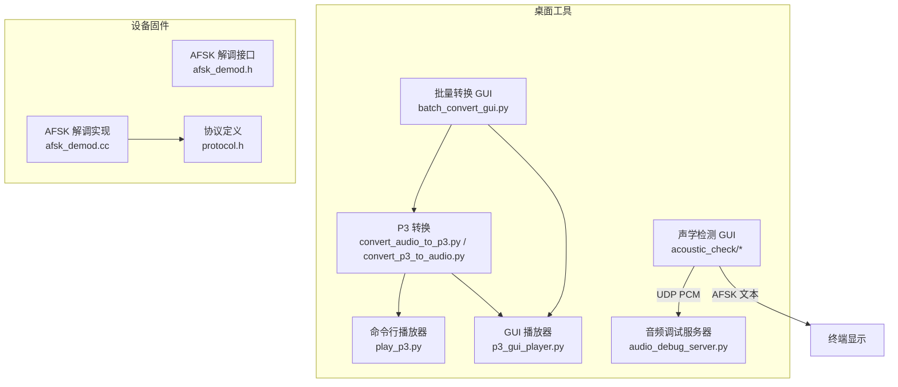
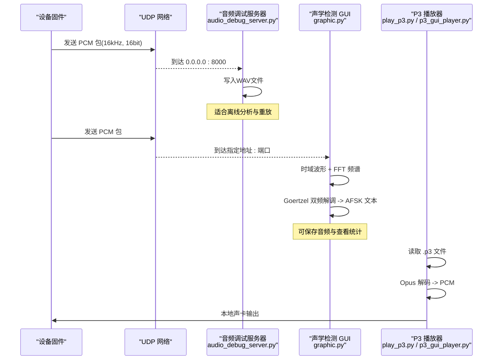
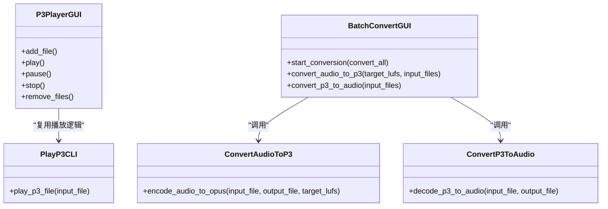
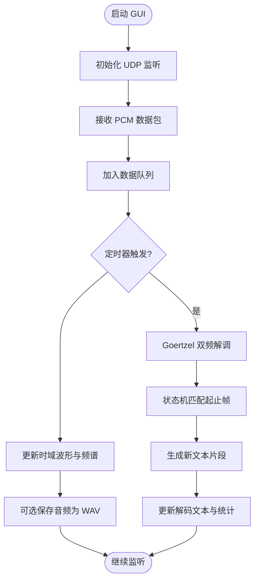
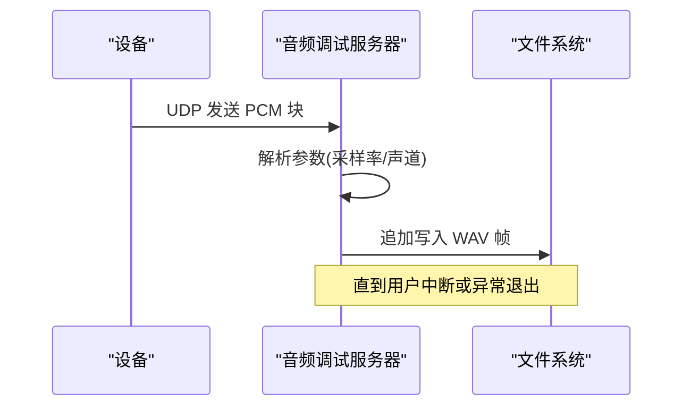
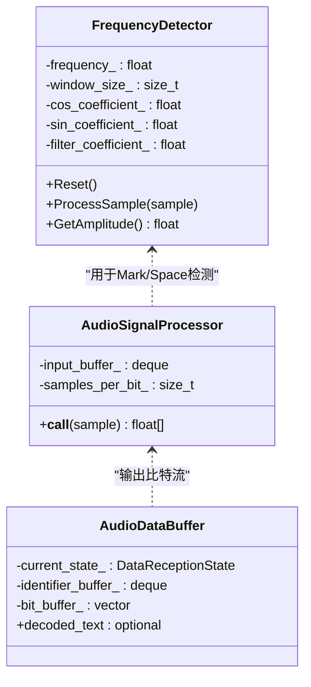
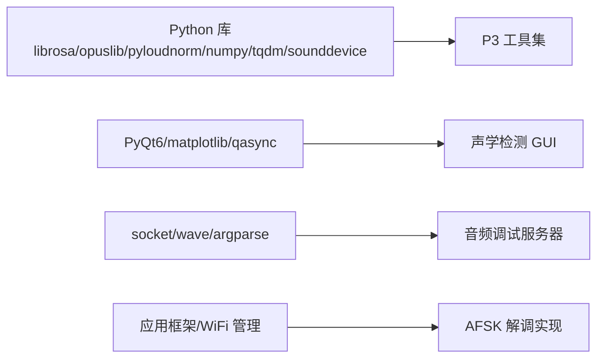

# 音频处理工具

<cite>
**本文引用的文件**
- [scripts/p3_tools/convert_audio_to_p3.py](file://scripts/p3_tools/convert_audio_to_p3.py)
- [scripts/p3_tools/convert_p3_to_audio.py](file://scripts/p3_tools/convert_p3_to_audio.py)
- [scripts/p3_tools/play_p3.py](file://scripts/p3_tools/play_p3.py)
- [scripts/p3_tools/p3_gui_player.py](file://scripts/p3_tools/p3_gui_player.py)
- [scripts/p3_tools/batch_convert_gui.py](file://scripts/p3_tools/batch_convert_gui.py)
- [scripts/audio_debug_server.py](file://scripts/audio_debug_server.py)
- [scripts/acoustic_check/readme.md](file://scripts/acoustic_check/readme.md)
- [scripts/acoustic_check/main.py](file://scripts/acoustic_check/main.py)
- [scripts/acoustic_check/demod.py](file://scripts/acoustic_check/demod.py)
- [scripts/acoustic_check/graphic.py](file://scripts/acoustic_check/graphic.py)
- [main/boards/common/afsk_demod.h](file://main/boards/common/afsk_demod.h)
- [main/boards/common/afsk_demod.cc](file://main/boards/common/afsk_demod.cc)
- [main/protocols/protocol.h](file://main/protocols/protocol.h)
</cite>

## 目录
1. [简介](#简介)
2. [项目结构](#项目结构)
3. [核心组件](#核心组件)
4. [架构总览](#架构总览)
5. [详细组件分析](#详细组件分析)
6. [依赖关系分析](#依赖关系分析)
7. [性能与质量建议](#性能与质量建议)
8. [故障排查指南](#故障排查指南)
9. [结论](#结论)
10. [附录](#附录)

## 简介
本指南面向需要开发与调试音频功能的工程师，聚焦以下目标：
- P3 音频格式工具集：格式转换、播放测试、GUI 批量转换与播放器使用。
- 声学检测工具：实时波形可视化、频谱分析、AFSK 解码与保存回放。
- 音频调试服务器：UDP PCM 接收并落盘为 WAV，便于离线分析。
- 最佳实践与问题诊断：从采集到传输、解码的全链路优化建议。
- 自定义算法集成：如何在现有管线中接入新的音频处理模块。

## 项目结构
本项目在 scripts 目录下提供多套工具脚本，涵盖 P3 编解码、GUI 播放与批量转换、声学检查与 AFSK 解调、以及 UDP 音频调试服务器。固件侧包含 AFSK 解调实现与协议定义，便于端到端联调。

图表来源
- [scripts/p3_tools/convert_audio_to_p3.py:1-62](file://scripts/p3_tools/convert_audio_to_p3.py#L1-L62)
- [scripts/p3_tools/convert_p3_to_audio.py:1-52](file://scripts/p3_tools/convert_p3_to_audio.py#L1-L52)
- [scripts/p3_tools/play_p3.py:1-72](file://scripts/p3_tools/play_p3.py#L1-L72)
- [scripts/p3_tools/p3_gui_player.py:1-242](file://scripts/p3_tools/p3_gui_player.py#L1-L242)
- [scripts/p3_tools/batch_convert_gui.py:1-221](file://scripts/p3_tools/batch_convert_gui.py#L1-L221)
- [scripts/acoustic_check/main.py:1-19](file://scripts/acoustic_check/main.py#L1-L19)
- [scripts/acoustic_check/demod.py:1-281](file://scripts/acoustic_check/demod.py#L1-L281)
- [scripts/acoustic_check/graphic.py:1-444](file://scripts/acoustic_check/graphic.py#L1-L444)
- [scripts/audio_debug_server.py:1-55](file://scripts/audio_debug_server.py#L1-L55)
- [main/boards/common/afsk_demod.h:1-138](file://main/boards/common/afsk_demod.h#L1-L138)
- [main/boards/common/afsk_demod.cc:1-375](file://main/boards/common/afsk_demod.cc#L1-L375)
- [main/protocols/protocol.h:1-55](file://main/protocols/protocol.h#L1-L55)

章节来源
- [scripts/p3_tools/convert_audio_to_p3.py:1-62](file://scripts/p3_tools/convert_audio_to_p3.py#L1-L62)
- [scripts/p3_tools/convert_p3_to_audio.py:1-52](file://scripts/p3_tools/convert_p3_to_audio.py#L1-L52)
- [scripts/p3_tools/play_p3.py:1-72](file://scripts/p3_tools/play_p3.py#L1-L72)
- [scripts/p3_tools/p3_gui_player.py:1-242](file://scripts/p3_tools/p3_gui_player.py#L1-L242)
- [scripts/p3_tools/batch_convert_gui.py:1-221](file://scripts/p3_tools/batch_convert_gui.py#L1-L221)
- [scripts/acoustic_check/main.py:1-19](file://scripts/acoustic_check/main.py#L1-L19)
- [scripts/acoustic_check/demod.py:1-281](file://scripts/acoustic_check/demod.py#L1-L281)
- [scripts/acoustic_check/graphic.py:1-444](file://scripts/acoustic_check/graphic.py#L1-L444)
- [scripts/audio_debug_server.py:1-55](file://scripts/audio_debug_server.py#L1-L55)
- [main/boards/common/afsk_demod.h:1-138](file://main/boards/common/afsk_demod.h#L1-L138)
- [main/boards/common/afsk_demod.cc:1-375](file://main/boards/common/afsk_demod.cc#L1-L375)
- [main/protocols/protocol.h:1-55](file://main/protocols/protocol.h#L1-L55)

## 核心组件
- P3 格式转换与播放
  - 将任意音频转换为 P3（Opus 帧流），支持响度归一化与采样率统一。
  - 将 P3 还原为 PCM/WAV，便于离线验证。
  - 提供命令行与 GUI 两种播放方式，支持列表与循环播放。
- 声学检测与 AFSK 解调
  - 基于 UDP 接收 PCM，实时绘制时域波形与频谱。
  - 内置 Goertzel 双频解调器，解析 AFSK 文本数据，支持状态机与统计信息。
- 音频调试服务器
  - 监听 UDP 端口，持续写入 PCM 至 WAV 文件，便于后续分析与回放。

章节来源
- [scripts/p3_tools/convert_audio_to_p3.py:1-62](file://scripts/p3_tools/convert_audio_to_p3.py#L1-L62)
- [scripts/p3_tools/convert_p3_to_audio.py:1-52](file://scripts/p3_tools/convert_p3_to_audio.py#L1-L52)
- [scripts/p3_tools/play_p3.py:1-72](file://scripts/p3_tools/play_p3.py#L1-L72)
- [scripts/p3_tools/p3_gui_player.py:1-242](file://scripts/p3_tools/p3_gui_player.py#L1-L242)
- [scripts/p3_tools/batch_convert_gui.py:1-221](file://scripts/p3_tools/batch_convert_gui.py#L1-L221)
- [scripts/acoustic_check/demod.py:1-281](file://scripts/acoustic_check/demod.py#L1-L281)
- [scripts/acoustic_check/graphic.py:1-444](file://scripts/acoustic_check/graphic.py#L1-L444)
- [scripts/audio_debug_server.py:1-55](file://scripts/audio_debug_server.py#L1-L55)

## 架构总览
下图展示了从设备到桌面工具的完整链路：设备侧通过 UDP 发送 PCM 或 AFSK 文本；桌面侧分别由“音频调试服务器”和“声学检测 GUI”接收与展示；P3 工具链用于离线编解码与播放。

图表来源
- [scripts/audio_debug_server.py:1-55](file://scripts/audio_debug_server.py#L1-L55)
- [scripts/acoustic_check/graphic.py:1-444](file://scripts/acoustic_check/graphic.py#L1-L444)
- [scripts/p3_tools/play_p3.py:1-72](file://scripts/p3_tools/play_p3.py#L1-L72)
- [scripts/p3_tools/p3_gui_player.py:1-242](file://scripts/p3_tools/p3_gui_player.py#L1-L242)

## 详细组件分析

### P3 格式工具集
- 音频转 P3
  - 功能要点：加载音频、可选响度归一化、统一采样率为 16kHz、按 60ms 分帧编码为 Opus，并以固定头部打包写入。
  - 关键参数：目标 LUFS、是否禁用响度调整。
  - 参考路径：[convert_audio_to_p3.py:1-62](file://scripts/p3_tools/convert_audio_to_p3.py#L1-L62)
- P3 转音频
  - 功能要点：读取 P3 头部，逐帧解码 Opus，拼接 PCM 后以 16bit WAV 输出。
  - 参考路径：[convert_p3_to_audio.py:1-52](file://scripts/p3_tools/convert_p3_to_audio.py#L1-L52)
- 命令行播放器
  - 功能要点：打开 P3 文件，按帧解码并通过系统声卡输出。
  - 参考路径：[play_p3.py:1-72](file://scripts/p3_tools/play_p3.py#L1-L72)
- GUI 播放器
  - 功能要点：支持添加多个 P3 文件、播放/暂停/停止、循环播放、当前项高亮与状态提示。
  - 参考路径：[p3_gui_player.py:1-242](file://scripts/p3_tools/p3_gui_player.py#L1-L242)
- 批量转换 GUI
  - 功能要点：选择输入文件、设置输出目录、勾选响度调整与目标 LUFS、批量执行转换并在日志区反馈进度。
  - 参考路径：[batch_convert_gui.py:1-221](file://scripts/p3_tools/batch_convert_gui.py#L1-L221)

图表来源
- [scripts/p3_tools/convert_audio_to_p3.py:1-62](file://scripts/p3_tools/convert_audio_to_p3.py#L1-L62)
- [scripts/p3_tools/convert_p3_to_audio.py:1-52](file://scripts/p3_tools/convert_p3_to_audio.py#L1-L52)
- [scripts/p3_tools/play_p3.py:1-72](file://scripts/p3_tools/play_p3.py#L1-L72)
- [scripts/p3_tools/p3_gui_player.py:1-242](file://scripts/p3_tools/p3_gui_player.py#L1-L242)
- [scripts/p3_tools/batch_convert_gui.py:1-221](file://scripts/p3_tools/batch_convert_gui.py#L1-L221)

章节来源
- [scripts/p3_tools/convert_audio_to_p3.py:1-62](file://scripts/p3_tools/convert_audio_to_p3.py#L1-L62)
- [scripts/p3_tools/convert_p3_to_audio.py:1-52](file://scripts/p3_tools/convert_p3_to_audio.py#L1-L52)
- [scripts/p3_tools/play_p3.py:1-72](file://scripts/p3_tools/play_p3.py#L1-L72)
- [scripts/p3_tools/p3_gui_player.py:1-242](file://scripts/p3_tools/p3_gui_player.py#L1-L242)
- [scripts/p3_tools/batch_convert_gui.py:1-221](file://scripts/p3_tools/batch_convert_gui.py#L1-L221)

### 声学检测工具（实时波形、频谱与 AFSK 解码）
- 启动入口
  - 主程序通过异步事件循环启动 GUI。
  - 参考路径：[main.py:1-19](file://scripts/acoustic_check/main.py#L1-L19)
- 图形界面与数据处理
  - 使用 PyQt6 + Matplotlib 绘制时域波形与频谱，定时刷新。
  - 通过 UDP 接收 PCM 数据，入队后在定时器回调中进行解码与绘图。
  - 参考路径：[graphic.py:1-444](file://scripts/acoustic_check/graphic.py#L1-L444)
- AFSK 解调器
  - 基于 Goertzel 的双频检测，计算 Mark/Space 振幅比进行比特判决。
  - 状态机识别起始/结束标识，累积比特流并尝试解码为 ASCII 文本。
  - 参考路径：[demod.py:1-281](file://scripts/acoustic_check/demod.py#L1-L281)
- 使用说明与注意事项
  - 需在固件开启相关开关并配置本机 UDP 地址。
  - 不同硬件平台降噪需求不同，部分需关闭参考通道或额外降噪。
  - 参考路径：[readme.md:1-23](file://scripts/acoustic_check/readme.md#L1-L23)

图表来源
- [scripts/acoustic_check/main.py:1-19](file://scripts/acoustic_check/main.py#L1-L19)
- [scripts/acoustic_check/graphic.py:1-444](file://scripts/acoustic_check/graphic.py#L1-L444)
- [scripts/acoustic_check/demod.py:1-281](file://scripts/acoustic_check/demod.py#L1-L281)
- [scripts/acoustic_check/readme.md:1-23](file://scripts/acoustic_check/readme.md#L1-L23)

章节来源
- [scripts/acoustic_check/main.py:1-19](file://scripts/acoustic_check/main.py#L1-L19)
- [scripts/acoustic_check/graphic.py:1-444](file://scripts/acoustic_check/graphic.py#L1-L444)
- [scripts/acoustic_check/demod.py:1-281](file://scripts/acoustic_check/demod.py#L1-L281)
- [scripts/acoustic_check/readme.md:1-23](file://scripts/acoustic_check/readme.md#L1-L23)

### 音频调试服务器（UDP PCM 接收与落盘）
- 功能说明
  - 绑定 0.0.0.0:8000，持续接收 UDP 包，将 PCM 帧直接写入 WAV 文件。
  - 支持命令行参数设置采样率与声道数。
- 使用步骤
  - 运行脚本，等待设备向本机 8000 端口发送 PCM。
  - 结束后自动生成 WAV 文件，可用常规播放器回放。
- 参考路径
  - [audio_debug_server.py:1-55](file://scripts/audio_debug_server.py#L1-L55)

图表来源
- [scripts/audio_debug_server.py:1-55](file://scripts/audio_debug_server.py#L1-L55)

章节来源
- [scripts/audio_debug_server.py:1-55](file://scripts/audio_debug_server.py#L1-L55)

### 设备侧 AFSK 解调与协议
- 解调实现
  - 采用 Goertzel 单频检测器，对 Mark/Space 频率进行幅度估计，结合窗口与阈值完成比特判决。
  - 提供音频信号处理器与数据缓冲类，负责帧同步、校验与文本重组。
  - 参考路径：
    - [afsk_demod.h:1-138](file://main/boards/common/afsk_demod.h#L1-L138)
    - [afsk_demod.cc:1-375](file://main/boards/common/afsk_demod.cc#L1-L375)
- 协议定义
  - 定义了二进制协议结构与音频流包字段，便于上层统一封装与解析。
  - 参考路径：[protocol.h:1-55](file://main/protocols/protocol.h#L1-L55)

图表来源
- [main/boards/common/afsk_demod.h:1-138](file://main/boards/common/afsk_demod.h#L1-L138)
- [main/boards/common/afsk_demod.cc:1-375](file://main/boards/common/afsk_demod.cc#L1-L375)

章节来源
- [main/boards/common/afsk_demod.h:1-138](file://main/boards/common/afsk_demod.h#L1-L138)
- [main/boards/common/afsk_demod.cc:1-375](file://main/boards/common/afsk_demod.cc#L1-L375)
- [main/protocols/protocol.h:1-55](file://main/protocols/protocol.h#L1-L55)

## 依赖关系分析
- Python 工具链
  - P3 工具依赖 librosa、opuslib、pyloudnorm、numpy、tqdm、sounddevice、struct 等。
  - 声学检测 GUI 依赖 PyQt6、matplotlib、qasync、numpy、wave、collections.deque。
  - 音频调试服务器依赖标准库 socket、wave、argparse。
- 设备固件
  - AFSK 解调依赖应用框架与 WiFi 管理模块，遵循统一的协议结构。

图表来源
- [scripts/p3_tools/convert_audio_to_p3.py:1-62](file://scripts/p3_tools/convert_audio_to_p3.py#L1-L62)
- [scripts/p3_tools/convert_p3_to_audio.py:1-52](file://scripts/p3_tools/convert_p3_to_audio.py#L1-L52)
- [scripts/p3_tools/play_p3.py:1-72](file://scripts/p3_tools/play_p3.py#L1-L72)
- [scripts/p3_tools/p3_gui_player.py:1-242](file://scripts/p3_tools/p3_gui_player.py#L1-L242)
- [scripts/p3_tools/batch_convert_gui.py:1-221](file://scripts/p3_tools/batch_convert_gui.py#L1-L221)
- [scripts/acoustic_check/graphic.py:1-444](file://scripts/acoustic_check/graphic.py#L1-L444)
- [scripts/audio_debug_server.py:1-55](file://scripts/audio_debug_server.py#L1-L55)
- [main/boards/common/afsk_demod.h:1-138](file://main/boards/common/afsk_demod.h#L1-L138)
- [main/boards/common/afsk_demod.cc:1-375](file://main/boards/common/afsk_demod.cc#L1-L375)

章节来源
- [scripts/p3_tools/convert_audio_to_p3.py:1-62](file://scripts/p3_tools/convert_audio_to_p3.py#L1-L62)
- [scripts/p3_tools/convert_p3_to_audio.py:1-52](file://scripts/p3_tools/convert_p3_to_audio.py#L1-L52)
- [scripts/p3_tools/play_p3.py:1-72](file://scripts/p3_tools/play_p3.py#L1-L72)
- [scripts/p3_tools/p3_gui_player.py:1-242](file://scripts/p3_tools/p3_gui_player.py#L1-L242)
- [scripts/p3_tools/batch_convert_gui.py:1-221](file://scripts/p3_tools/batch_convert_gui.py#L1-L221)
- [scripts/acoustic_check/graphic.py:1-444](file://scripts/acoustic_check/graphic.py#L1-L444)
- [scripts/audio_debug_server.py:1-55](file://scripts/audio_debug_server.py#L1-L55)
- [main/boards/common/afsk_demod.h:1-138](file://main/boards/common/afsk_demod.h#L1-L138)
- [main/boards/common/afsk_demod.cc:1-375](file://main/boards/common/afsk_demod.cc#L1-L375)

## 性能与质量建议
- 采样率与帧长
  - 统一使用 16kHz、60ms 帧长，有利于降低 CPU 占用与网络抖动影响。
- 响度控制
  - 使用 LUFS 归一化提升一致性，但需注意过度调整可能引入失真；TTS 或已归一化音频可禁用该功能。
- 噪声与误码
  - 不同硬件的 MIC/ADC 特性差异较大，必要时关闭参考通道或增加降噪预处理。
- 丢包与稳定性
  - 若出现高丢包率，优先检查 Wi-Fi 环境、缓冲区大小与解码门限，适当放宽阈值或增大窗口。
- 可视化与定位
  - 借助频谱图观察主要能量集中在 1500Hz/1800Hz 附近，有助于快速判断信号质量。

[本节为通用指导，不直接分析具体文件]

## 故障排查指南
- 无法连接 UDP 服务
  - 确认防火墙放行 8000 端口，设备侧配置的服务器地址为本机 IP。
  - 参考路径：[audio_debug_server.py:1-55](file://scripts/audio_debug_server.py#L1-L55)
- 无波形或频谱异常
  - 检查采样率与声道数是否与设备一致；确认数据是否为 16bit PCM。
  - 参考路径：[graphic.py:1-444](file://scripts/acoustic_check/graphic.py#L1-L444)
- AFSK 解码不稳定
  - 调整阈值与窗口大小，观察概率曲线；核对起始/结束标识是否匹配。
  - 参考路径：[demod.py:1-281](file://scripts/acoustic_check/demod.py#L1-L281)
- 硬件平台差异
  - 某些平台需关闭参考通道或额外降噪；参考各平台测试结果与备注。
  - 参考路径：[readme.md:1-23](file://scripts/acoustic_check/readme.md#L1-L23)
- 设备侧解码失败
  - 检查音频读取与下采样流程、单/双声道转换与位流组装是否正确。
  - 参考路径：[afsk_demod.cc:1-375](file://main/boards/common/afsk_demod.cc#L1-L375)

章节来源
- [scripts/audio_debug_server.py:1-55](file://scripts/audio_debug_server.py#L1-L55)
- [scripts/acoustic_check/graphic.py:1-444](file://scripts/acoustic_check/graphic.py#L1-L444)
- [scripts/acoustic_check/demod.py:1-281](file://scripts/acoustic_check/demod.py#L1-L281)
- [scripts/acoustic_check/readme.md:1-23](file://scripts/acoustic_check/readme.md#L1-L23)
- [main/boards/common/afsk_demod.cc:1-375](file://main/boards/common/afsk_demod.cc#L1-L375)

## 结论
本工具集覆盖了从音频编解码、可视化分析到 AFSK 通信调试的完整链路。通过 P3 工具链可实现高效的离线验证与批量处理；声学检测 GUI 与音频调试服务器则提供了直观的在线调试能力。结合设备侧 AFSK 解调与协议定义，能够快速定位问题并优化整体音频体验。

[本节为总结性内容，不直接分析具体文件]

## 附录
- 常用命令与用法
  - 音频转 P3：参考 [convert_audio_to_p3.py:1-62](file://scripts/p3_tools/convert_audio_to_p3.py#L1-L62)
  - P3 转音频：参考 [convert_p3_to_audio.py:1-52](file://scripts/p3_tools/convert_p3_to_audio.py#L1-L52)
  - 命令行播放 P3：参考 [play_p3.py:1-72](file://scripts/p3_tools/play_p3.py#L1-L72)
  - GUI 批量转换：参考 [batch_convert_gui.py:1-221](file://scripts/p3_tools/batch_convert_gui.py#L1-L221)
  - GUI 播放器：参考 [p3_gui_player.py:1-242](file://scripts/p3_tools/p3_gui_player.py#L1-L242)
  - 声学检测 GUI：参考 [graphic.py:1-444](file://scripts/acoustic_check/graphic.py#L1-L444)、[demod.py:1-281](file://scripts/acoustic_check/demod.py#L1-L281)
  - 音频调试服务器：参考 [audio_debug_server.py:1-55](file://scripts/audio_debug_server.py#L1-L55)
- 自定义音频处理算法集成方法
  - 在 GUI 的数据处理回调中插入新的 DSP 模块（如降噪、均衡、VAD），保持输入输出为 16bit PCM 数组。
  - 在 AFSK 解调前增加预处理阶段，确保与设备侧处理一致（如下采样、去直流、窗函数）。
  - 如需改变协议帧结构，请同步更新协议定义与两端解析逻辑。
  - 参考路径：
    - [graphic.py:1-444](file://scripts/acoustic_check/graphic.py#L1-L444)
    - [demod.py:1-281](file://scripts/acoustic_check/demod.py#L1-L281)
    - [afsk_demod.h:1-138](file://main/boards/common/afsk_demod.h#L1-L138)
    - [afsk_demod.cc:1-375](file://main/boards/common/afsk_demod.cc#L1-L375)
    - [protocol.h:1-55](file://main/protocols/protocol.h#L1-L55)