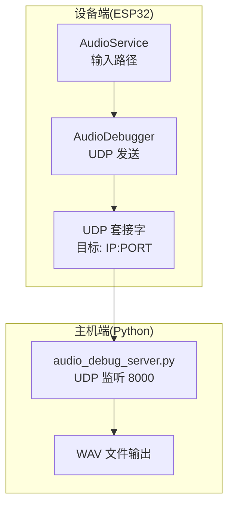
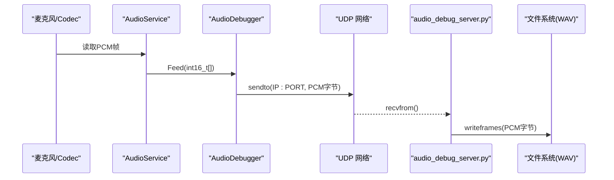
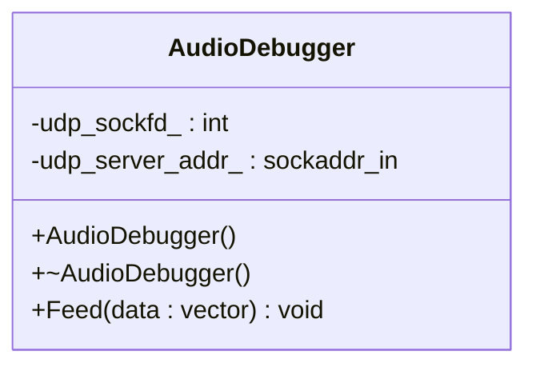
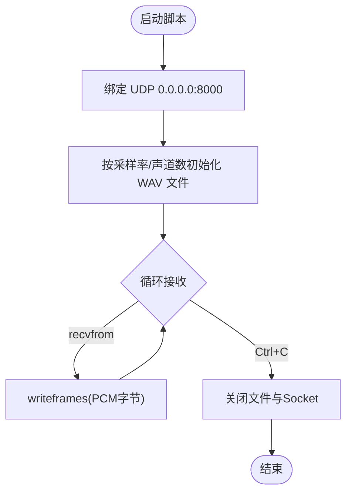
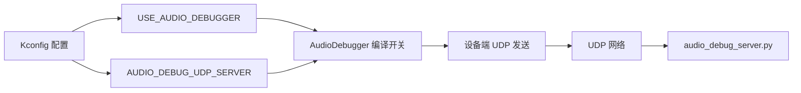

# 音频调试服务器

<cite>
**本文引用的文件**   
- [audio_debug_server.py](file://scripts/audio_debug_server.py)
- [audio_debugger.h](file://main/audio/processors/audio_debugger.h)
- [audio_debugger.cc](file://main/audio/processors/audio_debugger.cc)
- [audio_service.h](file://main/audio/audio_service.h)
- [audio_service.cc](file://main/audio/audio_service.cc)
- [Kconfig.projbuild](file://main/Kconfig.projbuild)
</cite>

## 目录
1. [简介](#简介)
2. [项目结构](#项目结构)
3. [核心组件](#核心组件)
4. [架构总览](#架构总览)
5. [详细组件分析](#详细组件分析)
6. [依赖关系分析](#依赖关系分析)
7. [性能与网络配置](#性能与网络配置)
8. [部署与使用指南](#部署与使用指南)
9. [故障排查](#故障排查)
10. [结论](#结论)

## 简介
本文件面向需要在 ESP32 设备上启用“音频调试”能力的工程师，提供从编译配置、设备端发送、到主机端接收与保存的完整说明。该功能通过 UDP 将设备采集到的原始 PCM 数据发送到主机，由 Python 脚本接收并保存为 WAV 文件，便于离线回放与分析。当前仓库未包含 Web 界面实现，因此不提供基于 Web 的实时可视化能力；如需 Web 展示，可在现有 UDP 流基础上自行扩展。

## 项目结构
与音频调试相关的代码主要分布在以下位置：
- 设备端（ESP32）：
  - 处理器模块：AudioDebugger 类负责创建 UDP Socket、解析目标地址、发送 PCM 帧
  - 集成点：AudioService 在输入路径中调用 AudioDebugger::Feed 发送数据
  - 配置项：Kconfig 定义是否启用音频调试以及 UDP 服务器地址
- 主机端（Python）：
  - 脚本 audio_debug_server.py 监听 UDP 端口，接收 PCM 并写入 WAV 文件

图表来源
- [audio_service.cc:218-226](file://main/audio/audio_service.cc#L218-L226)
- [audio_debugger.cc:16-42](file://main/audio/processors/audio_debugger.cc#L16-L42)
- [audio_debug_server.py:11-23](file://scripts/audio_debug_server.py#L11-L23)

章节来源
- [audio_service.cc:218-226](file://main/audio/audio_service.cc#L218-L226)
- [audio_debugger.h:10-20](file://main/audio/processors/audio_debugger.h#L10-L20)
- [audio_debugger.cc:16-42](file://main/audio/processors/audio_debugger.cc#L16-L42)
- [audio_debug_server.py:11-23](file://scripts/audio_debug_server.py#L11-L23)
- [Kconfig.projbuild:945-979](file://main/Kconfig.projbuild#L945-L979)

## 核心组件
- AudioDebugger（设备端）
  - 职责：构造时创建 UDP Socket，解析配置的服务器地址（IP:PORT），在 Feed 接口中将 PCM 帧以 UDP 报文形式发送至目标地址
  - 关键行为：
    - 构造：打开 UDP Socket，解析 CONFIG_AUDIO_DEBUG_UDP_SERVER，初始化 sockaddr_in
    - 析构：关闭 UDP Socket
    - Feed：将 int16_t PCM 数据直接 sendto 到目标地址
- AudioService（设备端集成点）
  - 职责：在音频输入路径中，首次需要调试时懒加载 AudioDebugger，并将每帧 PCM 数据送入 Feed
- audio_debug_server.py（主机端）
  - 职责：绑定 0.0.0.0:8000 的 UDP 端口，循环 recvfrom 接收 PCM 帧，按采样率与声道数写入 WAV 文件

章节来源
- [audio_debugger.h:10-20](file://main/audio/processors/audio_debugger.h#L10-L20)
- [audio_debugger.cc:16-42](file://main/audio/processors/audio_debugger.cc#L16-L42)
- [audio_debugger.cc:54-66](file://main/audio/processors/audio_debugger.cc#L54-L66)
- [audio_service.cc:218-226](file://main/audio/audio_service.cc#L218-L226)
- [audio_debug_server.py:11-23](file://scripts/audio_debug_server.py#L11-L23)

## 架构总览
设备端通过 Kconfig 启用音频调试后，AudioService 在读取麦克风数据后将 PCM 帧交给 AudioDebugger，后者通过 UDP 将数据发送到主机。主机运行 Python 脚本，持续接收并落盘为 WAV 文件，供后续播放或分析。

图表来源
- [audio_service.cc:218-226](file://main/audio/audio_service.cc#L218-L226)
- [audio_debugger.cc:54-66](file://main/audio/processors/audio_debugger.cc#L54-L66)
- [audio_debug_server.py:25-35](file://scripts/audio_debug_server.py#L25-L35)

## 详细组件分析

### 设备端：AudioDebugger 类
- 设计要点
  - 仅在启用 CONFIG_USE_AUDIO_DEBUGGER 时编译和运行
  - 构造阶段完成 UDP Socket 创建与目标地址解析
  - Feed 方法无阻塞地将整帧 PCM 作为 UDP 报文发出
- 错误处理
  - 构造失败：记录警告日志并置无效句柄
  - 发送失败：记录警告日志，不中断主流程
- 复杂度
  - 时间复杂度：O(n)，n 为单帧样本数（仅拷贝+发送）
  - 空间复杂度：O(1)，不额外分配内存

图表来源
- [audio_debugger.h:10-20](file://main/audio/processors/audio_debugger.h#L10-L20)
- [audio_debugger.cc:16-42](file://main/audio/processors/audio_debugger.cc#L16-L42)
- [audio_debugger.cc:54-66](file://main/audio/processors/audio_debugger.cc#L54-L66)

章节来源
- [audio_debugger.h:10-20](file://main/audio/processors/audio_debugger.h#L10-L20)
- [audio_debugger.cc:16-42](file://main/audio/processors/audio_debugger.cc#L16-L42)
- [audio_debugger.cc:54-66](file://main/audio/processors/audio_debugger.cc#L54-L66)

### 设备端：AudioService 集成点
- 触发时机
  - 在输入路径中，当启用音频调试且尚未创建实例时，懒加载 AudioDebugger
  - 每次成功读取一帧 PCM 后，调用 Feed 发送
- 线程模型
  - 输入任务周期性读取 PCM，随后分发至唤醒词/音频处理器/调试器
- 注意事项
  - 若输入通道为双声道，测试路径会抽取左声道；但调试路径直接发送原始 PCM，需确保主机端参数一致

章节来源
- [audio_service.cc:218-226](file://main/audio/audio_service.cc#L218-L226)
- [audio_service.h:141-142](file://main/audio/audio_service.h#L141-L142)

### 主机端：audio_debug_server.py
- 功能
  - 监听 0.0.0.0:8000 的 UDP 端口
  - 根据命令行参数设置采样率和声道数，生成对应 WAV 文件
  - 循环接收 UDP 报文，将 PCM 帧写入 WAV
- 参数
  - --samplerate/-s：采样率（默认 16000）
  - --channels/-c：声道数（默认 2）
- 输出
  - 文件名格式：<采样率>_<声道数>.wav

图表来源
- [audio_debug_server.py:11-23](file://scripts/audio_debug_server.py#L11-L23)
- [audio_debug_server.py:25-35](file://scripts/audio_debug_server.py#L25-L35)
- [audio_debug_server.py:46-54](file://scripts/audio_debug_server.py#L46-L54)

章节来源
- [audio_debug_server.py:11-23](file://scripts/audio_debug_server.py#L11-L23)
- [audio_debug_server.py:25-35](file://scripts/audio_debug_server.py#L25-L35)
- [audio_debug_server.py:46-54](file://scripts/audio_debug_server.py#L46-L54)

## 依赖关系分析
- 编译期依赖
  - USE_AUDIO_DEBUGGER：控制是否编译音频调试相关代码
  - AUDIO_DEBUG_UDP_SERVER：指定目标 UDP 服务器地址（IP:PORT）
- 运行时依赖
  - 设备端：网络栈可用、UDP Socket 可创建、目标可达
  - 主机端：Python 环境、socket/wave 标准库可用

图表来源
- [Kconfig.projbuild:945-979](file://main/Kconfig.projbuild#L945-L979)

章节来源
- [Kconfig.projbuild:945-979](file://main/Kconfig.projbuild#L945-L979)

## 性能与网络配置
- 网络建议
  - 设备与主机在同一局域网，避免跨网段丢包
  - 防火墙放行 UDP 8000 端口
  - 主机网卡开启混杂模式非必需，但建议关闭不必要的流量干扰
- 参数一致性
  - 设备端 PCM 采样率与声道数必须与主机端脚本参数一致，否则 WAV 播放速度/声像异常
  - 设备端默认发送的是原始 PCM 字节，不做压缩或封装
- 资源占用
  - 设备端：每帧一次 UDP 发送，CPU 开销较小，注意网络拥塞时的丢包
  - 主机端：顺序写盘，磁盘 IO 为主要瓶颈，建议使用 SSD 或高速存储

[本节为通用指导，无需源码引用]

## 部署与使用指南

### 1. 设备端配置（Kconfig）
- 启用音频调试
  - 选项：USE_AUDIO_DEBUGGER
  - 作用：编译并启用音频调试功能
- 配置目标地址
  - 选项：AUDIO_DEBUG_UDP_SERVER
  - 格式：IP:PORT（例如 192.168.2.100:8000）
  - 作用：指定主机端 UDP 监听地址与端口

章节来源
- [Kconfig.projbuild:945-979](file://main/Kconfig.projbuild#L945-L979)

### 2. 设备端构建与烧录
- 在 IDF 工程中启用上述 Kconfig 选项
- 重新编译固件并烧录到设备
- 启动设备后，观察串口日志确认：
  - 已初始化服务器地址
  - 发送/失败日志（用于定位网络问题）

章节来源
- [audio_debugger.cc:32-41](file://main/audio/processors/audio_debugger.cc#L32-L41)
- [audio_debugger.cc:59-63](file://main/audio/processors/audio_debugger.cc#L59-L63)

### 3. 主机端准备
- 安装 Python 3 环境（标准库 socket/wave 即可）
- 准备本地存储目录用于保存 WAV 文件

### 4. 启动主机端接收脚本
- 基本用法
  - python scripts/audio_debug_server.py --samplerate 16000 --channels 2
- 参数说明
  - --samplerate/-s：采样率，需与设备端一致
  - --channels/-c：声道数，需与设备端一致
- 输出
  - 在当前目录生成 <采样率>_<声道数>.wav 文件

章节来源
- [audio_debug_server.py:46-54](file://scripts/audio_debug_server.py#L46-L54)
- [audio_debug_server.py:11-23](file://scripts/audio_debug_server.py#L11-L23)

### 5. 验证链路
- 设备侧日志出现“已初始化服务器地址”与“发送了 N 字节”
- 主机侧控制台打印“收到 N 字节”，并生成 WAV 文件
- 使用任意播放器打开 WAV 文件进行回放验证

章节来源
- [audio_debugger.cc:32-41](file://main/audio/processors/audio_debugger.cc#L32-L41)
- [audio_debug_server.py:25-35](file://scripts/audio_debug_server.py#L25-L35)

### 6. 远程音频调试工作流与最佳实践
- 工作流
  - 设备端：启用调试 -> 配置目标地址 -> 启动应用 -> 产生音频输入
  - 主机端：启动脚本 -> 等待 UDP 数据 -> 生成 WAV -> 回放/分析
- 最佳实践
  - 固定主机 IP 并在设备端配置静态地址，减少动态变更带来的配置成本
  - 使用有线网络或稳定 Wi-Fi，降低丢包
  - 对长时间录制场景，建议分片保存或定期归档，避免单文件过大
  - 在开发阶段开启调试，发布版本关闭以减少网络与 CPU 开销

[本节为通用指导，无需源码引用]

## 故障排查
- 无法收到数据
  - 检查设备端 AUDIO_DEBUG_UDP_SERVER 是否正确（IP:PORT）
  - 检查主机端脚本是否以相同采样率/声道数启动
  - 检查防火墙/路由器是否放行 UDP 8000
  - 查看设备端日志是否有“创建 UDP Socket 失败”或“发送失败”
- 播放异常（速度/音调不对）
  - 确认主机端 --samplerate/--channels 与设备端一致
- 文件损坏或无法播放
  - 确认主机端正常退出（Ctrl+C），确保文件被正确关闭
  - 检查磁盘空间与权限

章节来源
- [audio_debugger.cc:39-41](file://main/audio/processors/audio_debugger.cc#L39-L41)
- [audio_debugger.cc:59-63](file://main/audio/processors/audio_debugger.cc#L59-L63)
- [audio_debug_server.py:36-43](file://scripts/audio_debug_server.py#L36-L43)

## 结论
本项目提供了轻量级的音频调试方案：设备端通过 UDP 发送原始 PCM，主机端用 Python 脚本接收并保存为 WAV。该方案易于部署、便于离线分析。由于仓库未包含 Web 界面，如需在线可视化，可在现有 UDP 流基础上扩展 Web 服务与前端展示。建议在开发阶段启用调试，发布版本关闭以降低资源占用。