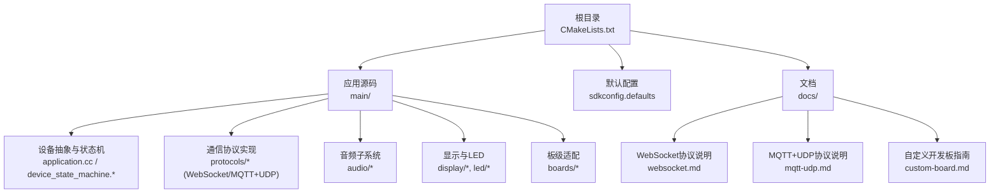
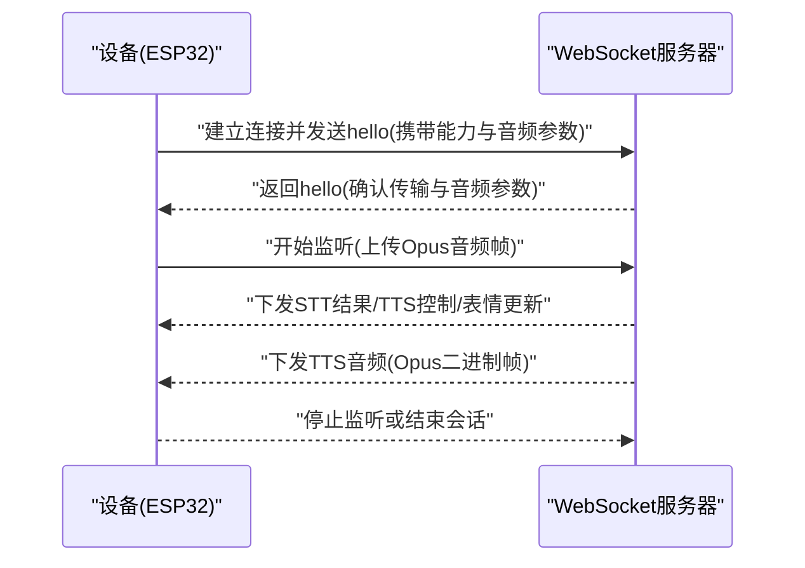
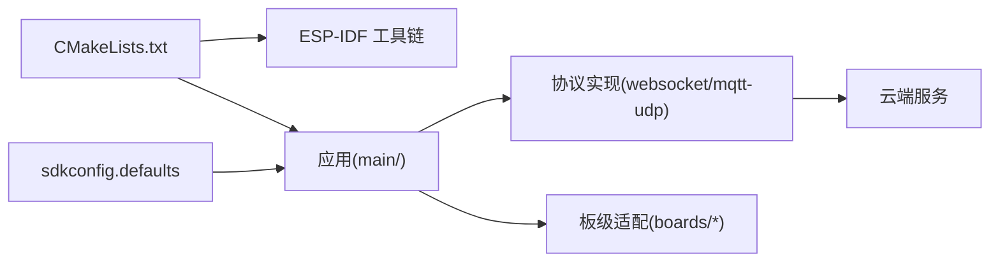

# 快速开始

<cite>
**本文引用的文件**
- [README_zh.md](file://README_zh.md)
- [CMakeLists.txt](file://CMakeLists.txt)
- [sdkconfig.defaults](file://sdkconfig.defaults)
- [custom-board.md](file://docs/custom-board.md)
- [websocket.md](file://docs/websocket.md)
- [mqtt-udp.md](file://docs/mqtt-udp.md)
</cite>

## 目录
1. [简介](#简介)
2. [项目结构](#项目结构)
3. [核心组件](#核心组件)
4. [架构总览](#架构总览)
5. [详细组件分析](#详细组件分析)
6. [依赖关系分析](#依赖关系分析)
7. [性能与资源建议](#性能与资源建议)
8. [故障排除指南](#故障排除指南)
9. [结论](#结论)
10. [附录](#附录)

## 简介
本指南面向首次接触小智AI聊天机器人的开发者，目标是帮助你在最短时间内完成环境搭建、编译第一个固件、烧录到开发板并连接WiFi网络，体验语音交互功能。文档同时提供预编译固件的下载与烧录指引，以及常见问题排查方法。

## 项目结构
仓库采用ESP-IDF工程结构，顶层包含构建配置与默认选项；应用代码位于main目录；多硬件支持通过boards子目录组织；协议与使用文档集中在docs目录。

图表来源
- [CMakeLists.txt:1-14](file://CMakeLists.txt#L1-L14)
- [sdkconfig.defaults:1-79](file://sdkconfig.defaults#L1-L79)
- [websocket.md:1-531](file://docs/websocket.md#L1-L531)
- [mqtt-udp.md:1-410](file://docs/mqtt-udp.md#L1-L410)
- [custom-board.md:1-474](file://docs/custom-board.md#L1-L474)

章节来源
- [CMakeLists.txt:1-14](file://CMakeLists.txt#L1-L14)
- [sdkconfig.defaults:1-79](file://sdkconfig.defaults#L1-L79)

## 核心组件
- 构建系统：基于ESP-IDF，顶层CMakeLists引入IDF工具链并启用最小化构建，定义项目版本。
- 默认配置：集中管理编译器优化、分区表、LVGL、Wi-Fi等常用宏开关。
- 通信协议：支持WebSocket与MQTT+UDP两种模式，分别用于控制信令与音频流传输。
- 设备状态机：驱动从启动、配网、激活、空闲、连接、监听、说话到升级等状态流转。
- 板级适配：通过boards目录为不同硬件提供引脚、音频编解码器、显示、按键等初始化逻辑。

章节来源
- [CMakeLists.txt:1-14](file://CMakeLists.txt#L1-L14)
- [sdkconfig.defaults:1-79](file://sdkconfig.defaults#L1-L79)
- [websocket.md:1-531](file://docs/websocket.md#L1-L531)
- [mqtt-udp.md:1-410](file://docs/mqtt-udp.md#L1-L410)
- [custom-board.md:1-474](file://docs/custom-board.md#L1-L474)

## 架构总览
下图展示了设备端在WebSocket模式下与服务器交互的整体流程，包括握手、音频双向流与控制消息。

图表来源
- [websocket.md:1-531](file://docs/websocket.md#L1-L531)

## 详细组件分析

### 环境搭建（ESP-IDF + VSCode）
- 编辑器：推荐使用VSCode或Cursor。
- ESP-IDF插件：安装ESP-IDF插件并选择SDK版本5.4或以上。
- 平台建议：Linux下编译更快且驱动问题更少。
- 代码风格：遵循Google C++风格。

章节来源
- [README_zh.md:115-121](file://README_zh.md#L115-L121)

### 编译与烧录（从零开始）
- 设置目标芯片：根据开发板选择esp32/esp32c3/esp32s3等。
- 清理旧配置：执行全量清理以避免残留配置影响。
- 选择板型：通过menuconfig选择对应板型。
- 构建与烧录：构建后直接烧录并打开串口监视器查看日志。
- 自动化打包：若板目录含config.json，可使用release脚本一键构建打包。

章节来源
- [custom-board.md:331-371](file://docs/custom-board.md#L331-L371)

### 连接WiFi网络（首次运行）
- 进入配网模式：在设备启动阶段长按特定按键可进入WiFi配网模式（具体按键由板级实现决定）。
- 配网方式：可通过内置Web页面或手机App进行配网（参考官方新手教程链接）。
- 成功后：设备将保存WiFi凭据并在下次启动自动连接。

章节来源
- [custom-board.md:195-204](file://docs/custom-board.md#L195-L204)
- [README_zh.md:107-113](file://README_zh.md#L107-L113)

### 预编译固件下载与烧录（免开发环境）
- 推荐新手先不搭建开发环境，直接使用预编译固件。
- 默认接入官方服务器，个人用户注册账号即可免费使用实时模型。
- 新手固件烧录教程请参考官方飞书文档链接。

章节来源
- [README_zh.md:107-113](file://README_zh.md#L107-L113)

### 常见开发板接线与初始配置
- 面包板DIY实践与接线图：详见飞书百科文档中的面包板效果图与步骤。
- 已支持70+开源硬件：可在README中查看部分示例图片与链接，按所选板型查阅其README与config.h/pin定义。
- 自定义板指南：如需新增板型，参考“自定义开发板指南”创建目录、编写config.h/config.json、实现板类并加入Kconfig与CMake分支。

章节来源
- [README_zh.md:41-64](file://README_zh.md#L41-L64)
- [custom-board.md:11-20](file://docs/custom-board.md#L11-L20)
- [custom-board.md:32-134](file://docs/custom-board.md#L32-L134)
- [custom-board.md:281-330](file://docs/custom-board.md#L281-L330)

### 通信协议要点（WebSocket与MQTT+UDP）
- WebSocket：设备与服务器通过JSON文本与二进制Opus音频帧交互，包含hello握手、listen/tts/stt/mcp/system/alert等消息类型。
- MQTT+UDP：控制面走MQTT，数据面走加密UDP（AES-CTR），具备低延迟特性，适合实时语音。

章节来源
- [websocket.md:1-531](file://docs/websocket.md#L1-L531)
- [mqtt-udp.md:1-410](file://docs/mqtt-udp.md#L1-L410)

## 依赖关系分析
- 构建层：顶层CMakeLists引入ESP-IDF工具链，启用最小化构建，定义项目版本。
- 配置层：sdkconfig.defaults统一开启/关闭多项功能，如分区表、LVGL、Wi-Fi内存优化等。
- 协议层：WebSocket与MQTT+UDP两套实现，均围绕Application与设备状态机工作。
- 板级层：各boards目录提供具体硬件初始化与外设驱动集成。

图表来源
- [CMakeLists.txt:1-14](file://CMakeLists.txt#L1-L14)
- [sdkconfig.defaults:1-79](file://sdkconfig.defaults#L1-L79)
- [websocket.md:1-531](file://docs/websocket.md#L1-L531)
- [mqtt-udp.md:1-410](file://docs/mqtt-udp.md#L1-L410)

章节来源
- [CMakeLists.txt:1-14](file://CMakeLists.txt#L1-L14)
- [sdkconfig.defaults:1-79](file://sdkconfig.defaults#L1-L79)

## 性能与资源建议
- 构建优化：默认已开启尺寸优化与异常/RTTI相关配置，有助于减小固件体积。
- Wi-Fi内存：默认调整了静态/动态RX缓冲数量以降低内存占用。
- LVGL裁剪：禁用非必要控件以节省Flash空间。
- 分区表：默认使用v2分区表，注意v1与v2不兼容，需手动烧录升级。

章节来源
- [sdkconfig.defaults:1-79](file://sdkconfig.defaults#L1-L79)
- [README_zh.md:15-21](file://README_zh.md#L15-L21)

## 故障排除指南
- 无法连接WiFi：检查WiFi凭据与配网流程是否正确；必要时重新进入配网模式。
- 无法连接服务器：确认WebSocket/MQTT地址与鉴权信息；查看串口日志中的错误提示。
- 无音频输出：检查I2S连线、PA使能引脚与编解码器I2C地址；确认音量与背光设置。
- 显示异常：核对SPI配置、镜像与颜色反转设置。
- 构建失败：确保ESP-IDF版本≥5.4；执行全量清理后重试；确认目标芯片与板型匹配。

章节来源
- [custom-board.md:462-468](file://docs/custom-board.md#L462-L468)
- [websocket.md:402-440](file://docs/websocket.md#L402-L440)
- [mqtt-udp.md:297-336](file://docs/mqtt-udp.md#L297-L336)

## 结论
通过以上步骤，你可以在最短时间内完成环境搭建、编译与烧录，并成功让设备联网与云端交互。若遇到环境问题或功能异常，可参考故障排除章节定位问题。对于进阶需求，可参考自定义开发板指南与协议文档进行扩展。

## 附录
- 新手固件烧录教程：参考README中的飞书文档链接。
- 自定义开发板指南：参考docs/custom-board.md。
- 协议文档：参考docs/websocket.md与docs/mqtt-udp.md。