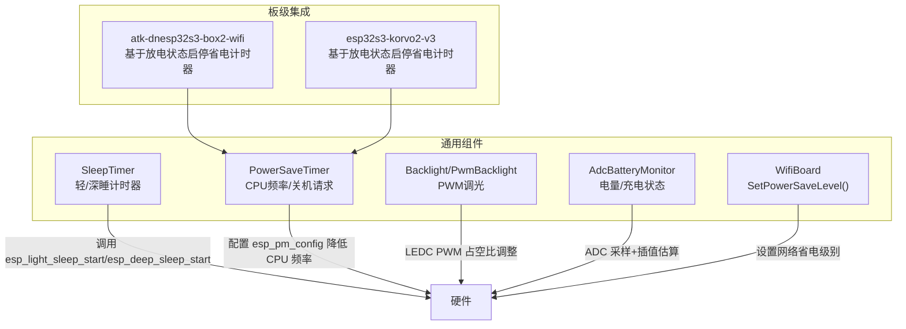
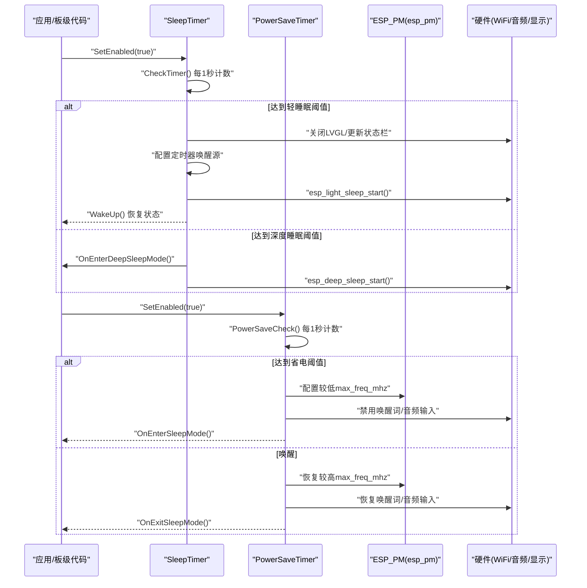
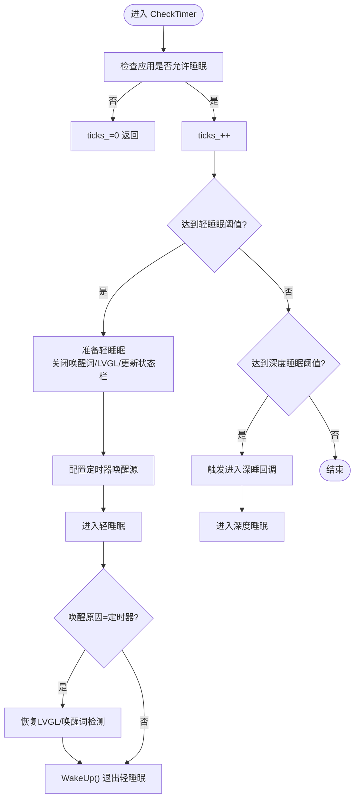
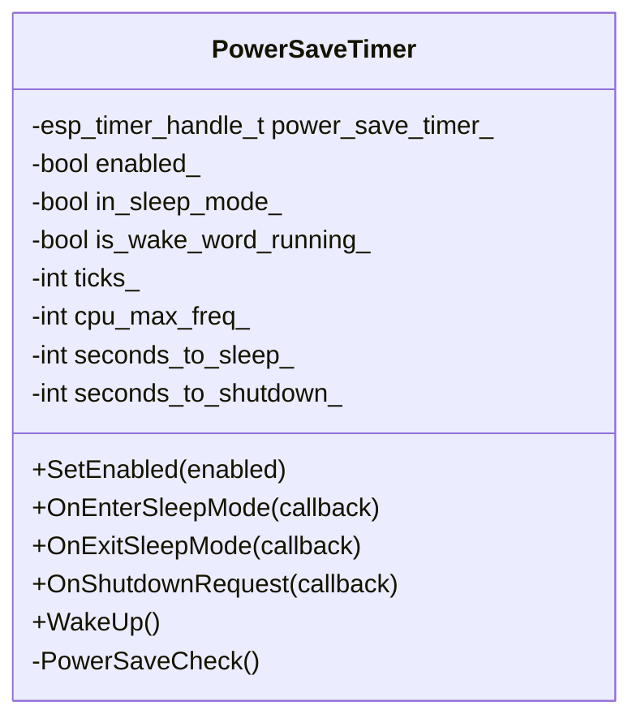
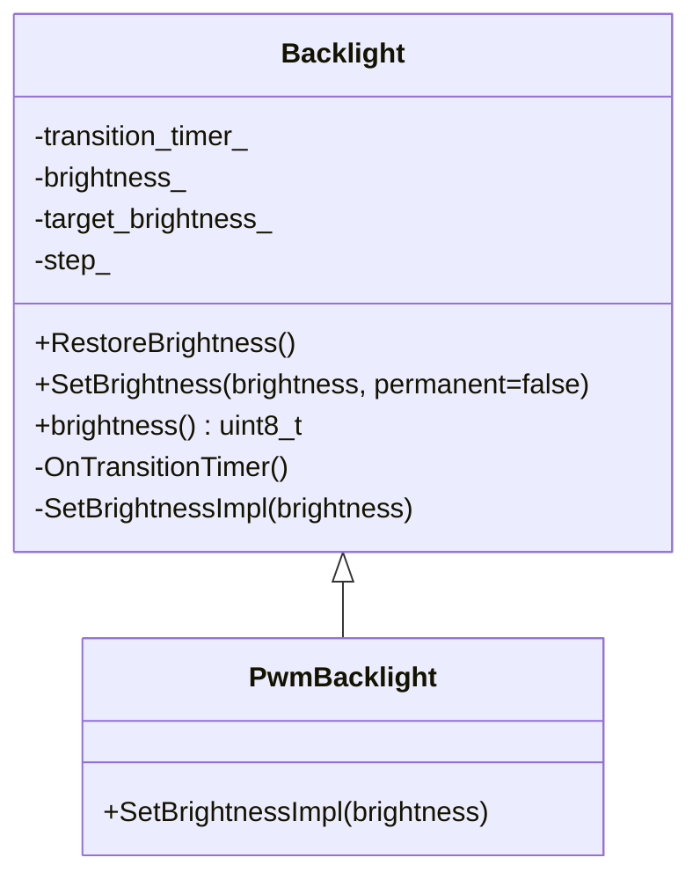
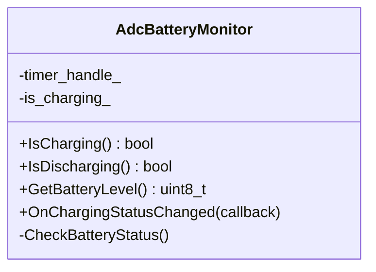
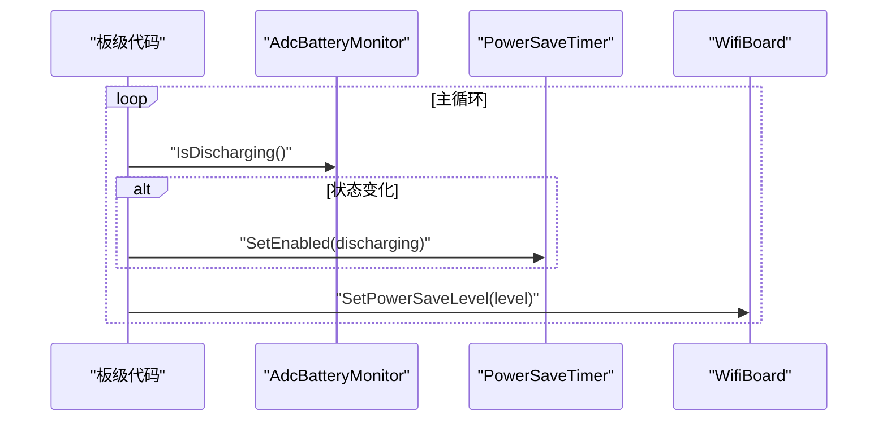
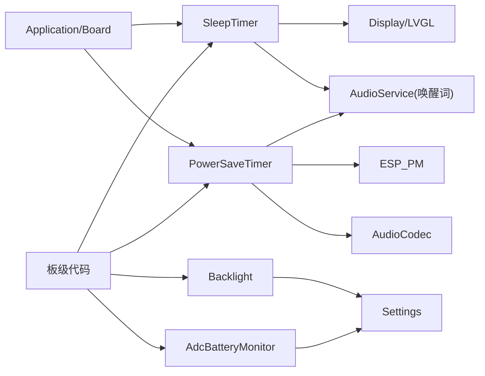

# 功耗优化与电源管理

<cite>
**本文引用的文件**   
- [sleep_timer.h](file://main/boards/common/sleep_timer.h)
- [sleep_timer.cc](file://main/boards/common/sleep_timer.cc)
- [power_save_timer.h](file://main/boards/common/power_save_timer.h)
- [power_save_timer.cc](file://main/boards/common/power_save_timer.cc)
- [backlight.h](file://main/boards/common/backlight.h)
- [backlight.cc](file://main/boards/common/backlight.cc)
- [adc_battery_monitor.h](file://main/boards/common/adc_battery_monitor.h)
- [adc_battery_monitor.cc](file://main/boards/common/adc_battery_monitor.cc)
- [wifi_board.h](file://main/boards/common/wifi_board.h)
- [atk_dnesp32s3_box2.cc](file://main/boards/atk-dnesp32s3-box2-wifi/atk_dnesp32s3_box2.cc)
- [esp32s3_korvo2_v3_board.cc](file://main/boards/esp32s3-korvo2-v3/esp32s3_korvo2_v3_board.cc)
- [audio README.md](file://main/audio/README.md)
</cite>

## 目录
1. [简介](#简介)
2. [项目结构](#项目结构)
3. [核心组件](#核心组件)
4. [架构总览](#架构总览)
5. [详细组件分析](#详细组件分析)
6. [依赖关系分析](#依赖关系分析)
7. [性能与功耗考量](#性能与功耗考量)
8. [故障排查指南](#故障排查指南)
9. [结论](#结论)
10. [附录](#附录)

## 简介
本指南面向在 ESP32 平台上进行功耗优化与电源管理的开发者，结合仓库中现有实现，系统阐述：
- 深度睡眠与轻睡眠的启用、唤醒机制与生命周期回调
- 外设功耗策略（WiFi 休眠、音频模块电源控制、显示背光调节）
- 电池续航优化方案（任务调度、中断处理、内存使用）
- 功耗测量方法与实际优化案例

## 项目结构
本项目将电源管理与低功耗能力集中在 boards/common 下的通用组件中，并通过各板级实现接入。关键文件包括：
- 睡眠与省电计时器：SleepTimer、PowerSaveTimer
- 背光控制：Backlight/PwmBacklight
- 电池监测：AdcBatteryMonitor
- WiFi 板级基类接口：WifiBoard（含 SetPowerSaveLevel）
- 典型板级集成示例：atk-dnesp32s3-box2-wifi、esp32s3-korvo2-v3

图表来源
- [sleep_timer.h:1-33](file://main/boards/common/sleep_timer.h#L1-L33)
- [sleep_timer.cc:1-134](file://main/boards/common/sleep_timer.cc#L1-L134)
- [power_save_timer.h:1-35](file://main/boards/common/power_save_timer.h#L1-L35)
- [power_save_timer.cc:1-133](file://main/boards/common/power_save_timer.cc#L1-L133)
- [backlight.h:1-37](file://main/boards/common/backlight.h#L1-L37)
- [backlight.cc:1-122](file://main/boards/common/backlight.cc#L1-L122)
- [adc_battery_monitor.h:1-31](file://main/boards/common/adc_battery_monitor.h#L1-L31)
- [adc_battery_monitor.cc:1-116](file://main/boards/common/adc_battery_monitor.cc#L1-L116)
- [wifi_board.h:48-69](file://main/boards/common/wifi_board.h#L48-L69)
- [atk_dnesp32s3_box2.cc:437-456](file://main/boards/atk-dnesp32s3-box2-wifi/atk_dnesp32s3_box2.cc#L437-L456)
- [esp32s3_korvo2_v3_board.cc:437-454](file://main/boards/esp32s3-korvo2-v3/esp32s3_korvo2_v3_board.cc#L437-L454)

章节来源
- [sleep_timer.h:1-33](file://main/boards/common/sleep_timer.h#L1-L33)
- [sleep_timer.cc:1-134](file://main/boards/common/sleep_timer.cc#L1-L134)
- [power_save_timer.h:1-35](file://main/boards/common/power_save_timer.h#L1-L35)
- [power_save_timer.cc:1-133](file://main/boards/common/power_save_timer.cc#L1-L133)
- [backlight.h:1-37](file://main/boards/common/backlight.h#L1-L37)
- [backlight.cc:1-122](file://main/boards/common/backlight.cc#L1-L122)
- [adc_battery_monitor.h:1-31](file://main/boards/common/adc_battery_monitor.h#L1-L31)
- [adc_battery_monitor.cc:1-116](file://main/boards/common/adc_battery_monitor.cc#L1-L116)
- [wifi_board.h:48-69](file://main/boards/common/wifi_board.h#L48-L69)
- [atk_dnesp32s3_box2.cc:437-456](file://main/boards/atk-dnesp32s3-box2-wifi/atk_dnesp32s3_box2.cc#L437-L456)
- [esp32s3_korvo2_v3_board.cc:437-454](file://main/boards/esp32s3-korvo2-v3/esp32s3_korvo2_v3_board.cc#L437-L454)

## 核心组件
- SleepTimer：按空闲时长触发轻睡眠或深度睡眠，提供进入/退出回调，支持唤醒后恢复逻辑。
- PowerSaveTimer：按空闲时长降低 CPU 最大频率并可选触发“关机请求”回调；唤醒时恢复频率与外设状态。
- Backlight/PwmBacklight：通过 LEDC PWM 平滑调节背光亮度，支持持久化保存与渐变过渡。
- AdcBatteryMonitor：周期读取 ADC 估算电池电量，检测充电状态变化并回调。
- WifiBoard：提供 SetPowerSaveLevel 接口，用于在不同网络省电级别间切换。

章节来源
- [sleep_timer.h:1-33](file://main/boards/common/sleep_timer.h#L1-L33)
- [sleep_timer.cc:1-134](file://main/boards/common/sleep_timer.cc#L1-L134)
- [power_save_timer.h:1-35](file://main/boards/common/power_save_timer.h#L1-L35)
- [power_save_timer.cc:1-133](file://main/boards/common/power_save_timer.cc#L1-L133)
- [backlight.h:1-37](file://main/boards/common/backlight.h#L1-L37)
- [backlight.cc:1-122](file://main/boards/common/backlight.cc#L1-L122)
- [adc_battery_monitor.h:1-31](file://main/boards/common/adc_battery_monitor.h#L1-L31)
- [adc_battery_monitor.cc:1-116](file://main/boards/common/adc_battery_monitor.cc#L1-L116)
- [wifi_board.h:48-69](file://main/boards/common/wifi_board.h#L48-L69)

## 架构总览
下图展示了从应用层到硬件层的功耗控制路径：应用根据业务状态与用户交互驱动 SleepTimer/PowerSaveTimer，后者分别控制睡眠模式与 CPU 频率；背光与音频模块配合省电策略动态降功耗；电池监测为省电策略提供输入。

图表来源
- [sleep_timer.cc:66-123](file://main/boards/common/sleep_timer.cc#L66-L123)
- [power_save_timer.cc:62-133](file://main/boards/common/power_save_timer.cc#L62-L133)

## 详细组件分析

### 睡眠计时器 SleepTimer（轻/深睡）
- 功能要点
  - 周期性检查是否可进入睡眠（依赖应用 CanEnterSleepMode）。
  - 到达轻睡眠阈值：暂停 LVGL、更新状态栏、配置定时器唤醒源、进入轻睡眠；唤醒后恢复。
  - 到达深度睡眠阈值：触发进入回调并进入深度睡眠。
  - WakeUp：重置计数与状态，触发退出回调。
- 关键流程
  - CheckTimer 内部维护 ticks_，比较 seconds_to_light_sleep_/seconds_to_deep_sleep_。
  - 在进入轻睡眠前会临时关闭唤醒词检测，避免误唤醒与额外功耗。
- 适用场景
  - 无交互长时间待机，需要快速响应唤醒的场景优先使用轻睡眠；需要极致功耗时使用深度睡眠。

图表来源
- [sleep_timer.cc:66-123](file://main/boards/common/sleep_timer.cc#L66-L123)

章节来源
- [sleep_timer.h:1-33](file://main/boards/common/sleep_timer.h#L1-L33)
- [sleep_timer.cc:1-134](file://main/boards/common/sleep_timer.cc#L1-L134)

### 省电计时器 PowerSaveTimer（CPU 频率/关机请求）
- 功能要点
  - 周期性检查是否可进入省电模式（依赖应用 CanEnterSleepMode）。
  - 达到省电阈值：降低 CPU 最大频率、关闭唤醒词检测与音频输入、触发进入回调。
  - 达到关机请求阈值：触发关机回调（由板级实现具体断电逻辑）。
  - WakeUp：恢复 CPU 频率、恢复唤醒词检测与音频输入、触发退出回调。
- 适用场景
  - 设备处于非活跃期但需保持连接或后台任务，通过降频显著降低功耗。

图表来源
- [power_save_timer.h:1-35](file://main/boards/common/power_save_timer.h#L1-L35)
- [power_save_timer.cc:1-133](file://main/boards/common/power_save_timer.cc#L1-L133)

章节来源
- [power_save_timer.h:1-35](file://main/boards/common/power_save_timer.h#L1-L35)
- [power_save_timer.cc:1-133](file://main/boards/common/power_save_timer.cc#L1-L133)

### 背光控制 Backlight/PwmBacklight
- 功能要点
  - 通过 LEDC PWM 以固定步长渐变调节亮度，避免突变。
  - 支持持久化保存亮度值，启动时自动恢复。
  - 与省电策略联动：进入省电/睡眠时降低亮度，退出时恢复。
- 典型用法
  - 在板级初始化中将背光对象交给 Display/Backlight 管理层，并在省电回调中调用 SetBrightness(低)/RestoreBrightness()。

图表来源
- [backlight.h:1-37](file://main/boards/common/backlight.h#L1-L37)
- [backlight.cc:1-122](file://main/boards/common/backlight.cc#L1-L122)

章节来源
- [backlight.h:1-37](file://main/boards/common/backlight.h#L1-L37)
- [backlight.cc:1-122](file://main/boards/common/backlight.cc#L1-L122)

### 电池监测 AdcBatteryMonitor
- 功能要点
  - 周期定时读取 ADC，利用分压电阻参数估算电压与电量百分比。
  - 支持可选充电引脚检测，若未配置则回退软件估算。
  - 当充电状态变化时触发回调，便于上层据此调整省电策略。
- 典型用法
  - 在板级主循环中根据 IsDischarging()/GetBatteryLevel() 决定是否启用 PowerSaveTimer。

图表来源
- [adc_battery_monitor.h:1-31](file://main/boards/common/adc_battery_monitor.h#L1-L31)
- [adc_battery_monitor.cc:1-116](file://main/boards/common/adc_battery_monitor.cc#L1-L116)

章节来源
- [adc_battery_monitor.h:1-31](file://main/boards/common/adc_battery_monitor.h#L1-L31)
- [adc_battery_monitor.cc:1-116](file://main/boards/common/adc_battery_monitor.cc#L1-L116)

### WiFi 省电级别与板级集成
- WifiBoard 暴露 SetPowerSaveLevel 接口，供上层统一设置网络省电级别。
- 典型板级（如 atk-dnesp32s3-box2-wifi、esp32s3-korvo2-v3）在检测到放电状态变化时，动态启用/禁用 PowerSaveTimer，从而在无交流供电时自动进入省电模式。

图表来源
- [wifi_board.h:48-69](file://main/boards/common/wifi_board.h#L48-L69)
- [atk_dnesp32s3_box2.cc:437-456](file://main/boards/atk-dnesp32s3-box2-wifi/atk_dnesp32s3_box2.cc#L437-L456)
- [esp32s3_korvo2_v3_board.cc:437-454](file://main/boards/esp32s3-korvo2-v3/esp32s3_korvo2_v3_board.cc#L437-L454)

章节来源
- [wifi_board.h:48-69](file://main/boards/common/wifi_board.h#L48-L69)
- [atk_dnesp32s3_box2.cc:437-456](file://main/boards/atk-dnesp32s3-box2-wifi/atk_dnesp32s3_box2.cc#L437-L456)
- [esp32s3_korvo2_v3_board.cc:437-454](file://main/boards/esp32s3-korvo2-v3/esp32s3_korvo2_v3_board.cc#L437-L454)

## 依赖关系分析
- SleepTimer 依赖 Application/Board/Display/Settings 等高层服务，负责协调外设与系统睡眠。
- PowerSaveTimer 依赖 Application/Settings 与 ESP_PM，负责 CPU 频率与外设电源策略。
- Backlight 依赖 Settings 与 LEDC 驱动，负责显示功耗控制。
- AdcBatteryMonitor 依赖 ADC 与可选 GPIO，为上层省电策略提供输入。
- 板级代码组合上述组件，形成完整的功耗管理闭环。

图表来源
- [sleep_timer.cc:1-134](file://main/boards/common/sleep_timer.cc#L1-L134)
- [power_save_timer.cc:1-133](file://main/boards/common/power_save_timer.cc#L1-L133)
- [backlight.cc:1-122](file://main/boards/common/backlight.cc#L1-L122)
- [adc_battery_monitor.cc:1-116](file://main/boards/common/adc_battery_monitor.cc#L1-L116)

章节来源
- [sleep_timer.cc:1-134](file://main/boards/common/sleep_timer.cc#L1-L134)
- [power_save_timer.cc:1-133](file://main/boards/common/power_save_timer.cc#L1-L133)
- [backlight.cc:1-122](file://main/boards/common/backlight.cc#L1-L122)
- [adc_battery_monitor.cc:1-116](file://main/boards/common/adc_battery_monitor.cc#L1-L116)

## 性能与功耗考量
- 轻睡眠 vs 深度睡眠
  - 轻睡眠适合短时休眠且需快速恢复的场景，唤醒延迟低，但功耗高于深度睡眠。
  - 深度睡眠适合长时间待机，功耗极低，但唤醒后需完整重启部分子系统。
- CPU 频率与外设
  - 降低 max_freq_mhz 能显著减少静态与动态功耗，同时可能影响实时性。
  - 关闭唤醒词检测与音频输入可在省电模式下进一步节能。
- 显示与背光
  - 降低刷新率、减少全屏刷新、缩短亮屏时间、降低背光亮度均可有效省电。
- 电池监测与策略
  - 基于放电状态动态启用省电计时器，避免交流供电时不必要的降频。
  - 低电量时可提前进入更激进省电策略。

[本节为通用指导，不直接分析具体文件]

## 故障排查指南
- 无法进入睡眠
  - 检查应用是否允许进入睡眠（CanEnterSleepMode），以及是否有前台任务阻止。
  - 确认 SleepTimer/PowerSaveTimer 已正确启用且阈值合理。
- 唤醒后状态异常
  - 确保在 WakeUp 回调中恢复必要的状态（LVGL、音频输入、唤醒词检测）。
- 背光不恢复
  - 检查 RestoreBrightness 是否被调用，Settings 中 brightness 是否有效。
- 电池电量不准
  - 校验分压电阻参数与 ADC 衰减配置；必要时校准零点与满量程点。
- WiFi 连接不稳定
  - 在低电量下适当提高最小频率或放宽省电阈值，平衡稳定性与功耗。

章节来源
- [sleep_timer.cc:66-123](file://main/boards/common/sleep_timer.cc#L66-L123)
- [power_save_timer.cc:62-133](file://main/boards/common/power_save_timer.cc#L62-L133)
- [backlight.cc:32-44](file://main/boards/common/backlight.cc#L32-L44)
- [adc_battery_monitor.cc:108-116](file://main/boards/common/adc_battery_monitor.cc#L108-L116)

## 结论
通过将 SleepTimer、PowerSaveTimer、Backlight 与 AdcBatteryMonitor 有机结合，并结合板级对 WiFi 省电级别的统一管理，可实现从“系统级睡眠—CPU 降频—外设关断—显示调暗—电池自适应”的全链路功耗优化。建议在实际产品中依据场景调优阈值与回调行为，并以实测数据验证收益。

[本节为总结，不直接分析具体文件]

## 附录

### 音频模块电源管理
- 音频编解码器的输入（ADC）与输出（DAC）通道会在一段时间无活动后自动关闭，并由定时器周期性检查活动状态，有新音频需求时再自动开启。
- 参考路径：[audio README.md](file://main/audio/README.md)

章节来源
- [audio README.md:86-88](file://main/audio/README.md#L86-L88)

### 功耗测量方法
- 电流表串联法
  - 使用高精度数字万用表或专用电流表串联至电池正极，记录不同状态下的平均电流与峰值电流。
- 分压采样法
  - 通过已知内阻的分压电路与 ADC 采样估算负载电流，适用于在线监控。
- 平台工具
  - 使用 ESP-IDF 功耗统计 API 与日志标记关键阶段，结合外部示波器/功率分析仪对比验证。

[本节为通用指导，不直接分析具体文件]

### 实际优化案例（基于仓库实现）
- 案例一：无交流供电时自动进入省电模式
  - 板级在检测到放电状态变化时启用 PowerSaveTimer，降低 CPU 频率并关闭唤醒词与音频输入；恢复供电时退出省电模式。
  - 参考路径：
    - [atk_dnesp32s3_box2.cc:437-456](file://main/boards/atk-dnesp32s3-box2-wifi/atk_dnesp32s3_box2.cc#L437-L456)
    - [esp32s3_korvo2_v3_board.cc:437-454](file://main/boards/esp32s3-korvo2-v3/esp32s3_korvo2_v3_board.cc#L437-L454)
- 案例二：长时间无交互进入轻/深睡眠
  - 通过 SleepTimer 在达到阈值后进入轻睡眠（定时器唤醒）或深度睡眠，并在唤醒后恢复必要状态。
  - 参考路径：
    - [sleep_timer.cc:66-123](file://main/boards/common/sleep_timer.cc#L66-L123)
- 案例三：背光节能
  - 进入省电/睡眠时降低背光亮度，退出时恢复；支持持久化保存与平滑过渡。
  - 参考路径：
    - [backlight.cc:46-82](file://main/boards/common/backlight.cc#L46-L82)