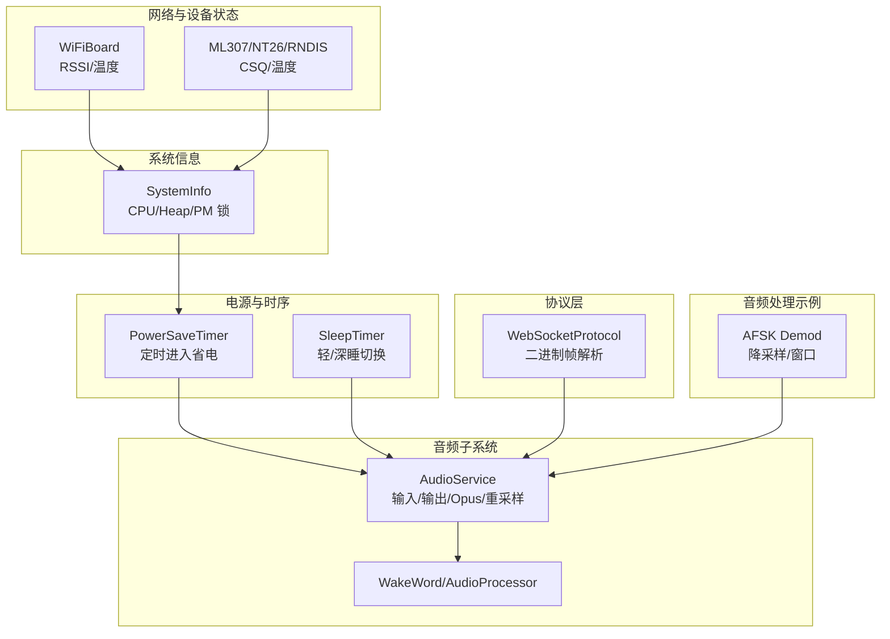
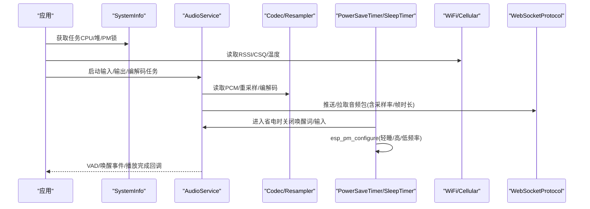
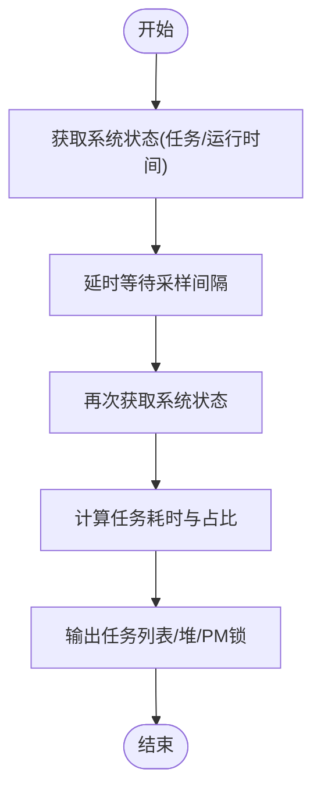
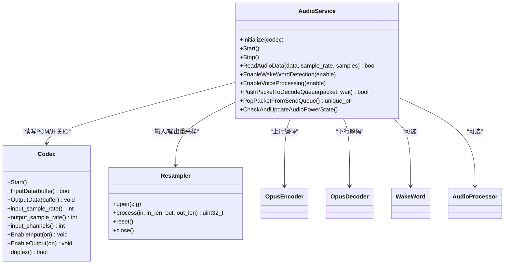
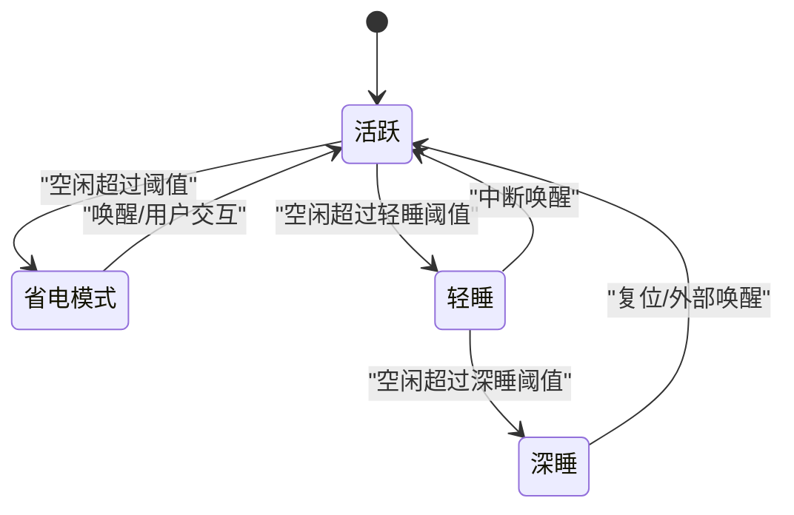
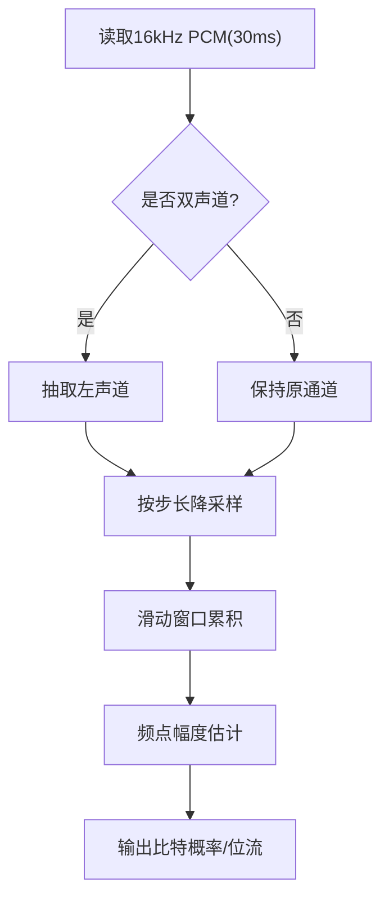
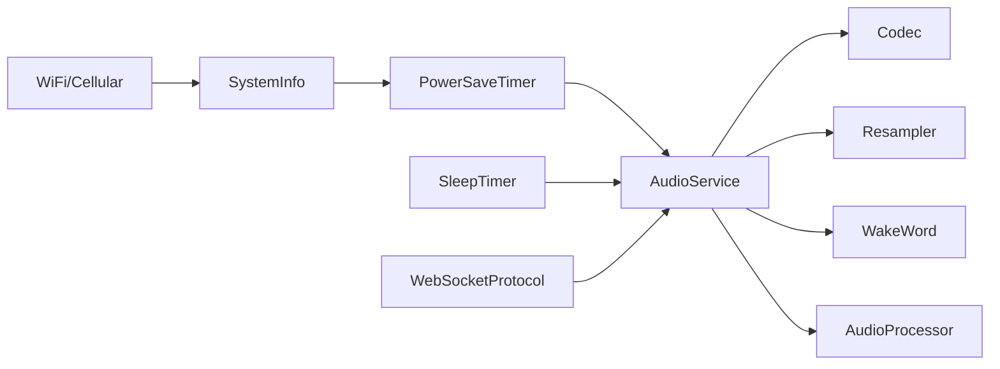

# 性能优化与调试

<cite>
**本文引用的文件**   
- [README.md](file://README.md)
- [system_info.cc](file://main/system_info.cc)
- [system_info.h](file://main/system_info.h)
- [audio_service.cc](file://main/audio/audio_service.cc)
- [power_save_timer.cc](file://main/boards/common/power_save_timer.cc)
- [power_save_timer.h](file://main/boards/common/power_save_timer.h)
- [sleep_timer.h](file://main/boards/common/sleep_timer.h)
- [wifi_board.cc](file://main/boards/common/wifi_board.cc)
- [rndis_board.cc](file://main/boards/common/rndis_board.cc)
- [ml307_board.cc](file://main/boards/common/ml307_board.cc)
- [nt26_board.cc](file://main/boards/common/nt26_board.cc)
- [afsk_demod.cc](file://main/boards/common/afsk_demod.cc)
- [websocket_protocol.cc](file://main/protocols/websocket_protocol.cc)
</cite>

## 目录
1. [简介](#简介)
2. [项目结构](#项目结构)
3. [核心组件](#核心组件)
4. [架构总览](#架构总览)
5. [详细组件分析](#详细组件分析)
6. [依赖关系分析](#依赖关系分析)
7. [性能考量](#性能考量)
8. [故障排查指南](#故障排查指南)
9. [结论](#结论)
10. [附录](#附录)

## 简介
本指南聚焦于在 ESP32 平台上进行系统级性能监控、分析与优化，覆盖 CPU 使用率、内存占用、网络延迟等关键指标；针对音频处理链路给出采样率、缓冲区大小与算法复杂度优化策略；提供功耗分析与休眠模式配置方法；并介绍基于 ESP-IDF 的性能分析工具与实践案例。内容以仓库现有实现为依据，帮助开发者快速定位瓶颈并落地调优方案。

## 项目结构
本项目为基于 ESP-IDF 的语音交互应用，包含音频采集/编码/解码、唤醒词检测、协议栈（WebSocket/MQTT+UDP）、显示与板级适配等模块。与性能相关的关键位置包括：
- 系统信息统计与任务 CPU 使用率打印
- 音频服务（输入/输出/编解码/重采样）
- 电源与休眠管理（轻睡/深睡/外设功耗控制）
- 网络信号强度与芯片温度上报
- AFSK 解调中的音频降采样与窗口处理

图表来源
- [system_info.cc:59-158](file://main/system_info.cc#L59-L158)
- [audio_service.cc:125-167](file://main/audio/audio_service.cc#L125-L167)
- [power_save_timer.cc:62-104](file://main/boards/common/power_save_timer.cc#L62-L104)
- [sleep_timer.h:1-32](file://main/boards/common/sleep_timer.h#L1-L32)
- [wifi_board.cc:339-357](file://main/boards/common/wifi_board.cc#L339-L357)
- [ml307_board.cc:256-270](file://main/boards/common/ml307_board.cc#L256-L270)
- [nt26_board.cc:257-271](file://main/boards/common/nt26_board.cc#L257-L271)
- [rndis_board.cc:231-247](file://main/boards/common/rndis_board.cc#L231-L247)
- [websocket_protocol.cc:115-137](file://main/protocols/websocket_protocol.cc#L115-L137)
- [afsk_demod.cc:33-50](file://main/boards/common/afsk_demod.cc#L33-L50)

章节来源
- [README.md:1-173](file://README.md#L1-L173)

## 核心组件
- 系统信息与性能统计
  - 任务 CPU 使用率统计、任务列表、堆内存统计、PM 锁打印
- 音频服务
  - 输入/输出任务、Opus 编解码、动态重采样、VAD/唤醒词/处理器集成、音频功耗定时器
- 电源与休眠
  - 周期性检查进入轻睡/深睡、关闭唤醒词与音频输入、调整 PM 配置、唤醒恢复
- 网络与设备状态
  - WiFi RSSI、蜂窝 CSQ、芯片温度上报
- 协议与数据流
  - WebSocket 二进制帧解析，携带采样率与帧时长
- 音频处理示例
  - AFSK 解调中按固定采样率读取、可选双声道转单声道、降采样与窗口处理

章节来源
- [system_info.cc:59-158](file://main/system_info.cc#L59-L158)
- [system_info.h:1-23](file://main/system_info.h#L1-L23)
- [audio_service.cc:125-167](file://main/audio/audio_service.cc#L125-L167)
- [power_save_timer.cc:62-104](file://main/boards/common/power_save_timer.cc#L62-L104)
- [sleep_timer.h:1-32](file://main/boards/common/sleep_timer.h#L1-L32)
- [wifi_board.cc:339-357](file://main/boards/common/wifi_board.cc#L339-L357)
- [ml307_board.cc:256-270](file://main/boards/common/ml307_board.cc#L256-L270)
- [nt26_board.cc:257-271](file://main/boards/common/nt26_board.cc#L257-L271)
- [rndis_board.cc:231-247](file://main/boards/common/rndis_board.cc#L231-L247)
- [websocket_protocol.cc:115-137](file://main/protocols/websocket_protocol.cc#L115-L137)
- [afsk_demod.cc:33-50](file://main/boards/common/afsk_demod.cc#L33-L50)

## 架构总览
下图展示性能相关的数据与控制流：系统信息用于诊断与上报；音频服务负责实时链路；电源管理根据空闲与超时进入低功耗；网络模块提供信号质量与温度；协议层将带时间戳的音频帧送入解码队列。

图表来源
- [system_info.cc:59-158](file://main/system_info.cc#L59-L158)
- [audio_service.cc:125-167](file://main/audio/audio_service.cc#L125-L167)
- [power_save_timer.cc:62-104](file://main/boards/common/power_save_timer.cc#L62-L104)
- [sleep_timer.h:1-32](file://main/boards/common/sleep_timer.h#L1-L32)
- [wifi_board.cc:339-357](file://main/boards/common/wifi_board.cc#L339-L357)
- [ml307_board.cc:256-270](file://main/boards/common/ml307_board.cc#L256-L270)
- [websocket_protocol.cc:115-137](file://main/protocols/websocket_protocol.cc#L115-L137)

## 详细组件分析

### 系统信息与性能监控
- 任务 CPU 使用率
  - 通过 FreeRTOS 的系统状态接口两次采样，计算各任务运行时间与占比，便于识别热点任务。
- 堆内存与最小空闲堆
  - 报告当前空闲内部 SRAM 与历史最小空闲堆，辅助发现内存泄漏或峰值分配问题。
- PM 锁诊断
  - 打印电源管理锁持有情况，定位导致无法进入低功耗的原因。
- 设备状态上报
  - WiFi RSSI 分级、蜂窝 CSQ 分级、芯片温度，结合网络与负载判断系统稳定性。

图表来源
- [system_info.cc:59-142](file://main/system_info.cc#L59-L142)
- [system_info.cc:150-158](file://main/system_info.cc#L150-L158)
- [wifi_board.cc:339-357](file://main/boards/common/wifi_board.cc#L339-L357)
- [ml307_board.cc:256-270](file://main/boards/common/ml307_board.cc#L256-L270)
- [nt26_board.cc:257-271](file://main/boards/common/nt26_board.cc#L257-L271)
- [rndis_board.cc:231-247](file://main/boards/common/rndis_board.cc#L231-L247)

章节来源
- [system_info.cc:59-158](file://main/system_info.cc#L59-L158)
- [system_info.h:1-23](file://main/system_info.h#L1-L23)
- [wifi_board.cc:339-357](file://main/boards/common/wifi_board.cc#L339-L357)
- [ml307_board.cc:256-270](file://main/boards/common/ml307_board.cc#L256-L270)
- [nt26_board.cc:257-271](file://main/boards/common/nt26_board.cc#L257-L271)
- [rndis_board.cc:231-247](file://main/boards/common/rndis_board.cc#L231-L247)

### 音频处理性能优化
- 采样率与重采样
  - 输入路径：若 Codec 输入采样率非 16kHz，则通过重采样器转换至 16kHz，统一后续处理与编码格式。
  - 输出路径：当解码采样率与 Codec 输出不一致时，动态重建输出重采样器，避免额外插值开销。
- 帧时长与缓冲
  - 采用固定 Opus 帧时长（毫秒），编码器/解码器据此计算每帧样本数，平衡延迟与压缩效率。
- 任务与队列
  - 输入/输出/编解码分任务执行，使用条件变量与互斥量协调队列长度，防止积压与抖动。
- 功耗联动
  - 音频功率定时器周期性检查输入/输出活跃度，长时间无 IO 则关闭 Codec 输入/输出以降低功耗。
- 唤醒词与语音处理
  - 支持按需启用唤醒词与语音处理器，并在切换时重置重采样器缓存，避免溢出与卡顿。

图表来源
- [audio_service.cc:62-123](file://main/audio/audio_service.cc#L62-L123)
- [audio_service.cc:184-228](file://main/audio/audio_service.cc#L184-L228)
- [audio_service.cc:448-482](file://main/audio/audio_service.cc#L448-L482)
- [audio_service.cc:682-698](file://main/audio/audio_service.cc#L682-L698)

章节来源
- [audio_service.cc:62-123](file://main/audio/audio_service.cc#L62-L123)
- [audio_service.cc:184-228](file://main/audio/audio_service.cc#L184-L228)
- [audio_service.cc:448-482](file://main/audio/audio_service.cc#L448-L482)
- [audio_service.cc:682-698](file://main/audio/audio_service.cc#L682-L698)

### 功耗分析与休眠模式
- 省电计时器
  - 周期性计数，达到阈值后进入省电模式：关闭唤醒词检测、禁用音频输入、降低 CPU 频率上限并允许轻睡。
  - 唤醒时恢复频率与功能，触发退出回调。
- 睡眠计时器
  - 支持轻睡与深睡切换，提供进入/退出回调钩子，便于挂起外设与恢复上下文。
- 音频功耗联动
  - 音频服务内定时器检测输入/输出空闲超时，自动关闭 Codec 端口，减少静态功耗。

图表来源
- [power_save_timer.cc:62-104](file://main/boards/common/power_save_timer.cc#L62-L104)
- [power_save_timer.cc:106-132](file://main/boards/common/power_save_timer.cc#L106-L132)
- [sleep_timer.h:1-32](file://main/boards/common/sleep_timer.h#L1-L32)
- [audio_service.cc:682-698](file://main/audio/audio_service.cc#L682-L698)

章节来源
- [power_save_timer.cc:62-104](file://main/boards/common/power_save_timer.cc#L62-L104)
- [power_save_timer.cc:106-132](file://main/boards/common/power_save_timer.cc#L106-L132)
- [sleep_timer.h:1-32](file://main/boards/common/sleep_timer.h#L1-L32)
- [audio_service.cc:682-698](file://main/audio/audio_service.cc#L682-L698)

### 网络延迟与稳定性观测
- WiFi 场景
  - 读取 RSSI 并转换为信号等级，结合芯片温度评估射频与散热对吞吐的影响。
- 蜂窝场景
  - 读取 CSQ 并分级，作为网络质量代理指标。
- 协议层
  - WebSocket 二进制帧携带服务器端采样率与帧时长，客户端据此设置解码器参数，保证端到端一致性与低延迟。

章节来源
- [wifi_board.cc:339-357](file://main/boards/common/wifi_board.cc#L339-L357)
- [ml307_board.cc:256-270](file://main/boards/common/ml307_board.cc#L256-L270)
- [nt26_board.cc:257-271](file://main/boards/common/nt26_board.cc#L257-L271)
- [websocket_protocol.cc:115-137](file://main/protocols/websocket_protocol.cc#L115-L137)

### 音频处理示例：AFSK 解调中的降采样与窗口
- 固定采样率读取
  - 以 16kHz、固定样本数（对应 30ms）从音频服务读取数据，确保后续处理时序稳定。
- 双声道转单声道
  - 若输入为立体声，抽取左声道简化处理。
- 降采样与窗口
  - 按步长降采样，配合窗口大小与 Goertzel 类频点检测，降低计算量并保持解调精度。

图表来源
- [afsk_demod.cc:33-50](file://main/boards/common/afsk_demod.cc#L33-L50)
- [afsk_demod.cc:52-60](file://main/boards/common/afsk_demod.cc#L52-L60)

章节来源
- [afsk_demod.cc:33-50](file://main/boards/common/afsk_demod.cc#L33-L50)
- [afsk_demod.cc:52-60](file://main/boards/common/afsk_demod.cc#L52-L60)

## 依赖关系分析
- 组件耦合
  - AudioService 强依赖 Codec 与重采样器，并通过事件组与队列与唤醒词/语音处理器协作。
  - PowerSaveTimer 与 SleepTimer 通过 esp_pm 与回调影响 AudioService 的工作模式。
  - SystemInfo 独立提供诊断能力，被上层应用调用。
- 外部依赖
  - ESP-IDF 的 FreeRTOS、esp_pm、esp_opus、esp_ae_rate_cvt 等库。
- 潜在循环依赖
  - 通过回调与事件组解耦，未见直接循环引用；注意在回调中避免阻塞。

图表来源
- [audio_service.cc:125-167](file://main/audio/audio_service.cc#L125-L167)
- [power_save_timer.cc:62-104](file://main/boards/common/power_save_timer.cc#L62-L104)
- [sleep_timer.h:1-32](file://main/boards/common/sleep_timer.h#L1-L32)
- [system_info.cc:59-158](file://main/system_info.cc#L59-L158)
- [websocket_protocol.cc:115-137](file://main/protocols/websocket_protocol.cc#L115-L137)

章节来源
- [audio_service.cc:125-167](file://main/audio/audio_service.cc#L125-L167)
- [power_save_timer.cc:62-104](file://main/boards/common/power_save_timer.cc#L62-L104)
- [sleep_timer.h:1-32](file://main/boards/common/sleep_timer.h#L1-L32)
- [system_info.cc:59-158](file://main/system_info.cc#L59-L158)
- [websocket_protocol.cc:115-137](file://main/protocols/websocket_protocol.cc#L115-L137)

## 性能考量
- CPU 使用率
  - 使用任务 CPU 使用率统计定位热点任务；关注音频输入/输出与编解码任务占比，必要时拆分或降低优先级。
- 内存占用
  - 关注最小空闲堆，避免大对象频繁分配；合理设置队列最大长度，防止突发流量导致 OOM。
- 网络延迟
  - 结合 RSSI/CSQ 与日志时间戳估算端到端延迟；在弱网下适当增大缓冲或降低码率。
- 音频链路
  - 优先使用硬件支持的采样率以减少重采样；固定帧时长与队列长度，降低抖动；仅在需要时开启唤醒词/语音处理。
- 功耗
  - 利用音频功率定时器与省电计时器，及时关闭未用外设；轻睡/深睡阈值按产品形态调优。

[本节为通用指导，不直接分析具体文件]

## 故障排查指南
- 任务卡死或高占用
  - 调用任务 CPU 使用率统计与任务列表，观察是否有任务长期占用 CPU 或频繁创建/删除。
- 内存不足
  - 查看堆统计与最小空闲堆，定位峰值分配点；检查队列长度与临时向量分配。
- 无法进入低功耗
  - 打印 PM 锁，确认是否有任务持有锁阻止轻睡；检查唤醒词与音频输入是否已关闭。
- 音频卡顿或爆音
  - 核对输入/输出采样率与重采样器配置；检查队列是否积压；确认帧时长与解码器匹配。
- 网络不稳定
  - 记录 RSSI/CSQ 与温度，关联卡顿时段；必要时降低码率或增加缓冲。

章节来源
- [system_info.cc:59-158](file://main/system_info.cc#L59-L158)
- [audio_service.cc:682-698](file://main/audio/audio_service.cc#L682-L698)
- [power_save_timer.cc:62-104](file://main/boards/common/power_save_timer.cc#L62-L104)

## 结论
通过在系统信息、音频服务与电源管理三个层面建立可观测性与可控性，可在资源受限的 ESP32 平台上实现稳定的低延迟语音交互。建议以“先观测、后优化”的流程推进：先用系统信息定位瓶颈，再针对性调整采样率、缓冲与算法复杂度，最后结合休眠与外设功耗管理达成整体能效目标。

[本节为总结，不直接分析具体文件]

## 附录
- 常用命令与入口
  - 任务 CPU 使用率与任务列表：参考系统信息接口
  - 堆与 PM 锁：参考系统信息接口
  - 音频功率与休眠：参考音频服务与省电计时器
- 参考文档
  - 项目概览与特性说明见 README

章节来源
- [README.md:1-173](file://README.md#L1-L173)