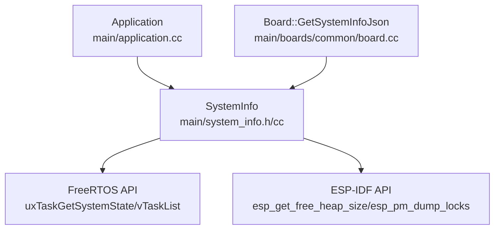
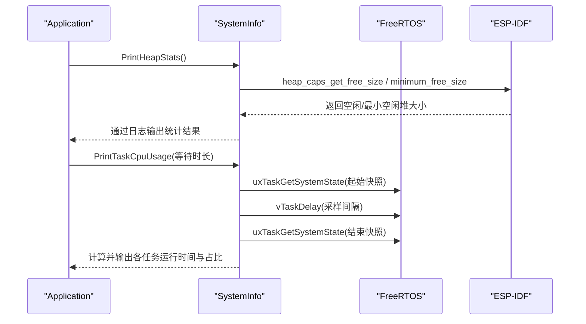
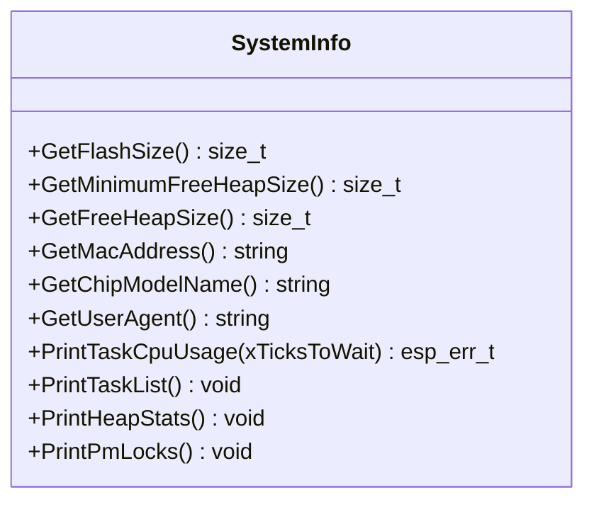
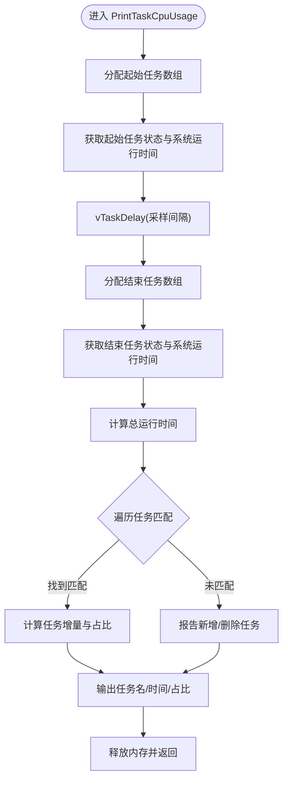
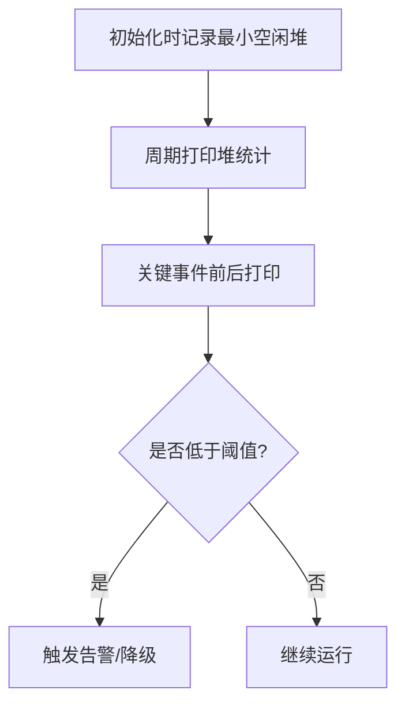
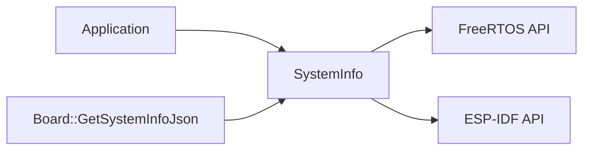

# 系统监控与分析

<cite>
**本文引用的文件**
- [main/system_info.h](file://main/system_info.h)
- [main/system_info.cc](file://main/system_info.cc)
- [main/application.cc](file://main/application.cc)
- [main/boards/common/board.cc](file://main/boards/common/board.cc)
</cite>

## 目录
1. [简介](#简介)
2. [项目结构](#项目结构)
3. [核心组件](#核心组件)
4. [架构总览](#架构总览)
5. [详细组件分析](#详细组件分析)
6. [依赖关系分析](#依赖关系分析)
7. [性能考量](#性能考量)
8. [故障排查指南](#故障排查指南)
9. [结论](#结论)
10. [附录](#附录)

## 简介
本文件面向需要在 ESP32 设备上采集与诊断系统运行指标（CPU、内存、任务状态等）的开发者，围绕 SystemInfo 类展开，说明如何获取关键指标、如何使用 PrintTaskCpuUsage() 进行任务级 CPU 占用分析、如何进行内存监控与最佳实践，并提供可落地的监控代码示例与基准测试方法。

## 项目结构
SystemInfo 相关能力集中在 main/system_info.{h,cc}，并在应用层（application.cc）和板级信息聚合（board.cc）中被调用，用于运行时日志输出与设备信息上报。

图表来源
- [main/system_info.h:9-21](file://main/system_info.h#L9-L21)
- [main/system_info.cc:59-158](file://main/system_info.cc#L59-L158)
- [main/application.cc:248-258](file://main/application.cc#L248-L258)
- [main/boards/common/board.cc:110-116](file://main/boards/common/board.cc#L110-L116)

章节来源
- [main/system_info.h:1-24](file://main/system_info.h#L1-L24)
- [main/system_info.cc:1-159](file://main/system_info.cc#L1-L159)
- [main/application.cc:248-258](file://main/application.cc#L248-L258)
- [main/boards/common/board.cc:110-116](file://main/boards/common/board.cc#L110-L116)

## 核心组件
SystemInfo 提供一组静态方法，用于：
- 获取 Flash 容量、最小空闲堆、当前空闲堆
- 获取 MAC 地址、芯片型号、User-Agent
- 打印任务 CPU 使用率、任务列表、堆统计、PM 锁信息

这些方法封装了 FreeRTOS 与 ESP-IDF 的系统接口，为上层应用提供统一的监控入口。

章节来源
- [main/system_info.h:9-21](file://main/system_info.h#L9-L21)
- [main/system_info.cc:18-57](file://main/system_info.cc#L18-L57)

## 架构总览
SystemInfo 作为“系统观测面”的统一入口，被 Application 与 Board 模块消费：
- Application 周期性打印堆统计，便于观察长期趋势
- Board 在生成系统信息 JSON 时，聚合 Flash、最小空闲堆、MAC、芯片型号等元数据

图表来源
- [main/application.cc:248-258](file://main/application.cc#L248-L258)
- [main/system_info.cc:150-154](file://main/system_info.cc#L150-L154)
- [main/system_info.cc:59-142](file://main/system_info.cc#L59-L142)

## 详细组件分析

### SystemInfo 类概览
SystemInfo 暴露以下关键能力：
- 存储与设备标识：Flash 容量、MAC、芯片型号、User-Agent
- 内存监控：最小空闲堆、当前空闲堆、内部 SRAM 堆统计
- 任务与 CPU：任务 CPU 使用率、任务列表
- 电源管理：PM 锁信息导出

图表来源
- [main/system_info.h:9-21](file://main/system_info.h#L9-L21)

章节来源
- [main/system_info.h:1-24](file://main/system_info.h#L1-L24)

### 任务 CPU 使用率分析：PrintTaskCpuUsage()
工作原理
- 在开始时刻调用 FreeRTOS 接口获取所有任务的运行时间计数器与句柄，记录系统运行时间起点
- 等待一段由 xTicksToWait 指定的时间（采样窗口）
- 再次获取任务状态与系统运行时间终点
- 计算总耗时与每个任务的增量运行时间，按多核归一化后得到百分比
- 输出表格：任务名、运行时间、占用百分比；同时报告新增或删除的任务

图表来源
- [main/system_info.cc:59-142](file://main/system_info.cc#L59-L142)

使用场景
- 定位热点任务：识别长时间占用 CPU 的任务，辅助优化调度或算法复杂度
- 验证多核负载分布：结合 CONFIG_FREERTOS_NUMBER_OF_CORES 理解每核实际占用
- 评估新特性引入对实时性的影响：对比前后版本的任务占比变化

注意事项
- 采样间隔需合理设置：过短导致噪声大，过长可能错过短时峰值
- 任务动态创建/删除会影响匹配逻辑，已做“新增/删除”提示
- 返回值包含错误码，如内存不足、无效尺寸/状态等

章节来源
- [main/system_info.cc:59-142](file://main/system_info.cc#L59-L142)

### 内存监控与最佳实践
可用接口
- 最小空闲堆：GetMinimumFreeHeapSize()
- 当前空闲堆：GetFreeHeapSize()
- 内部 SRAM 堆统计：PrintHeapStats()（输出当前空闲与历史最小值）

监控策略
- 启动阶段：记录初始最小空闲堆，作为基线
- 运行期：周期性打印堆统计（例如每 10 秒），观察趋势
- 事件触发：在网络连接、音频通道打开/关闭、OTA 升级前后打印，捕捉突变点
- 告警阈值：当最小空闲堆低于预设阈值时触发告警或降级策略

章节来源
- [main/system_info.cc:27-33](file://main/system_info.cc#L27-L33)
- [main/system_info.cc:150-154](file://main/system_info.cc#L150-L154)
- [main/application.cc:248-258](file://main/application.cc#L248-L258)
- [main/application.cc:300-303](file://main/application.cc#L300-L303)

### 其他系统指标
- Flash 容量：GetFlashSize()
- MAC 地址：GetMacAddress()
- 芯片型号：GetChipModelName()
- User-Agent：GetUserAgent()
- 任务列表：PrintTaskList()
- PM 锁信息：PrintPmLocks()

这些指标常用于设备信息上报、调试与问题复现。

章节来源
- [main/system_info.cc:18-57](file://main/system_info.cc#L18-L57)
- [main/system_info.cc:144-158](file://main/system_info.cc#L144-L158)

## 依赖关系分析
SystemInfo 依赖 FreeRTOS 与 ESP-IDF 的系统接口，被上层模块以静态方式调用，耦合度低、内聚度高。

图表来源
- [main/system_info.cc:1-15](file://main/system_info.cc#L1-L15)
- [main/application.cc:248-258](file://main/application.cc#L248-L258)
- [main/boards/common/board.cc:110-116](file://main/boards/common/board.cc#L110-L116)

章节来源
- [main/system_info.cc:1-15](file://main/system_info.cc#L1-L15)
- [main/application.cc:248-258](file://main/application.cc#L248-L258)
- [main/boards/common/board.cc:110-116](file://main/boards/common/board.cc#L110-L116)

## 性能考量
- 采样开销：PrintTaskCpuUsage() 会两次遍历任务表并进行字符串格式化输出，建议控制调用频率
- 多核归一化：CPU 占用百分比基于总运行时间乘以核心数进行归一化，避免单核误判
- 内存碎片：频繁分配 TaskStatus_t 数组可能加剧碎片，可在长生命周期对象中复用缓冲区（如需扩展）
- 日志带宽：大量日志输出可能阻塞高优先级任务，建议按需开关或降低频率

[本节为通用指导，不直接分析具体文件]

## 故障排查指南
常见问题与定位步骤
- 任务 CPU 占用异常偏高
  - 使用 PrintTaskCpuUsage() 定位热点任务
  - 检查对应任务是否存在忙轮询、过大临界区或阻塞时间过长
- 内存泄漏或耗尽
  - 关注最小空闲堆是否持续下降
  - 在可疑路径前后增加 PrintHeapStats() 输出，缩小范围
- 任务动态变化导致统计不准
  - 关注“新增/删除”提示，必要时延长采样间隔或在稳定态下测量
- PM 锁竞争
  - 使用 PrintPmLocks() 查看电源管理锁持有情况，排查高频唤醒或长时间持锁

章节来源
- [main/system_info.cc:59-142](file://main/system_info.cc#L59-L142)
- [main/system_info.cc:150-154](file://main/system_info.cc#L150-L154)
- [main/system_info.cc:156-158](file://main/system_info.cc#L156-L158)

## 结论
SystemInfo 提供了轻量而实用的系统观测能力，覆盖 CPU、内存、任务与设备元数据。结合 Application 的周期性打印与 Board 的信息聚合，可在资源受限的嵌入式环境中实现有效的运行态监控与问题定位。建议在关键路径与事件边界处嵌入监控点，形成稳定的基线与告警机制。

[本节为总结性内容，不直接分析具体文件]

## 附录

### 监控代码示例（路径引用）
- 周期性打印堆统计（每 10 秒）
  - [main/application.cc:248-258](file://main/application.cc#L248-L258)
- 激活完成后打印堆统计
  - [main/application.cc:300-303](file://main/application.cc#L300-L303)
- 生成系统信息 JSON（含最小空闲堆、MAC、芯片型号等）
  - [main/boards/common/board.cc:110-116](file://main/boards/common/board.cc#L110-L116)
- 任务 CPU 使用率打印
  - [main/system_info.cc:59-142](file://main/system_info.cc#L59-L142)

### 性能基准测试方法
- 任务 CPU 基准
  - 在稳态负载下，多次调用 PrintTaskCpuUsage()，取平均值与方差，评估稳定性
  - 对比不同采样间隔下的结果，选择合适的时间窗口
- 内存基准
  - 启动后记录最小空闲堆基线
  - 执行典型工作流（网络收发、音频编解码、OTA 检查等），记录最小空闲堆变化
  - 重复 N 次，观察是否有单调下降趋势（潜在泄漏）
- 日志与 I/O 开销
  - 开启/关闭日志输出对比，评估对主循环与实时性的影响

[本节为方法论指导，不直接分析具体文件]