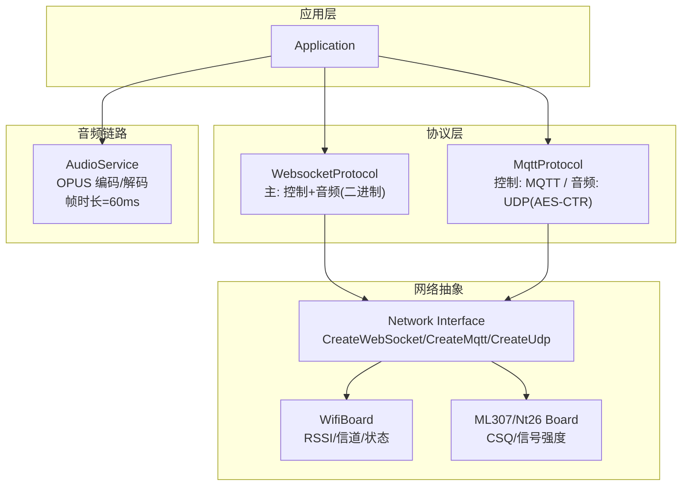
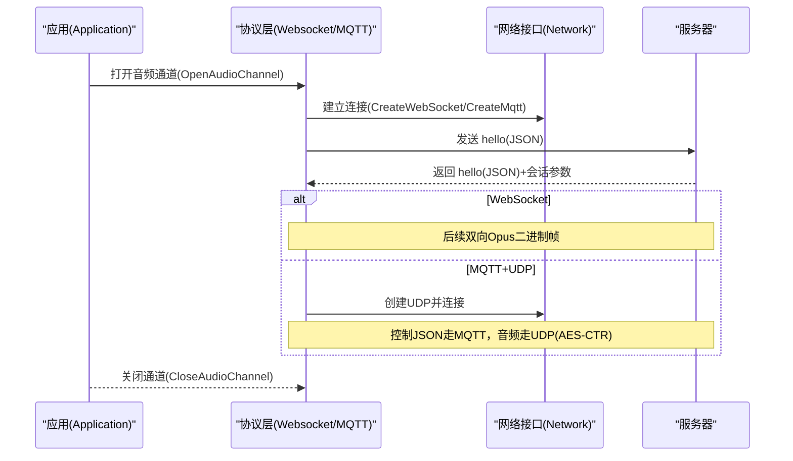
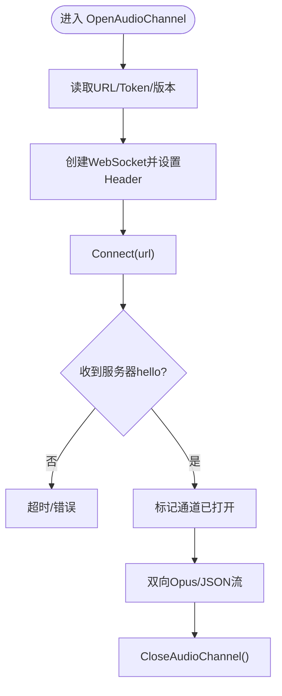
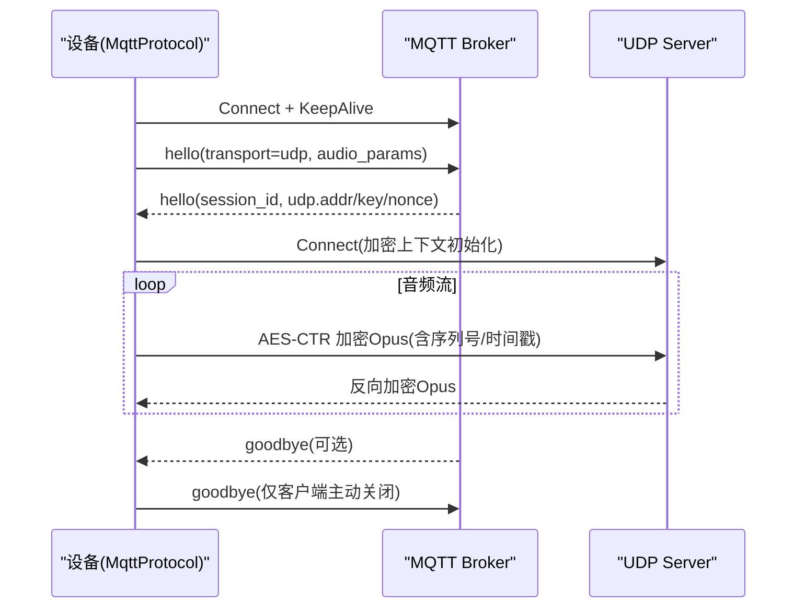
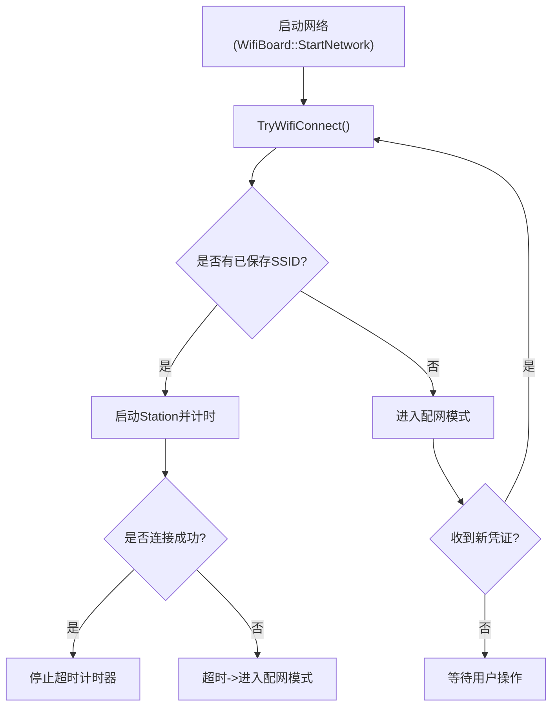
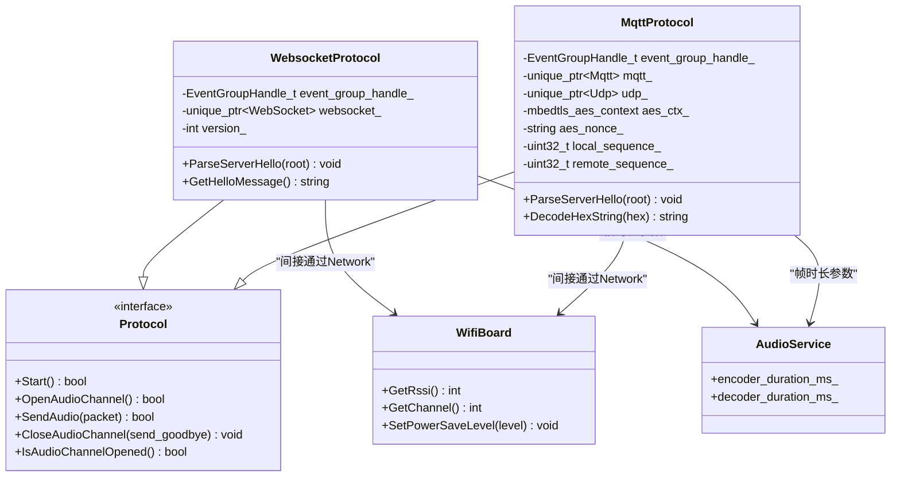

# 网络性能优化

<cite>
**本文引用的文件**   
- [README.md](file://README.md)
- [websocket.md](file://docs/websocket.md)
- [mqtt-udp.md](file://docs/mqtt-udp.md)
- [websocket_protocol.h](file://main/protocols/websocket_protocol.h)
- [websocket_protocol.cc](file://main/protocols/websocket_protocol.cc)
- [mqtt_protocol.h](file://main/protocols/mqtt_protocol.h)
- [mqtt_protocol.cc](file://main/protocols/mqtt_protocol.cc)
- [wifi_board.cc](file://main/boards/common/wifi_board.cc)
- [ml307_board.cc](file://main/boards/common/ml307_board.cc)
- [nt26_board.cc](file://main/boards/common/nt26_board.cc)
- [audio_service.h](file://main/audio/audio_service.h)
- [audio_service.cc](file://main/audio/audio_service.cc)
</cite>

## 目录
1. [简介](#简介)
2. [项目结构](#项目结构)
3. [核心组件](#核心组件)
4. [架构总览](#架构总览)
5. [详细组件分析](#详细组件分析)
6. [依赖关系分析](#依赖关系分析)
7. [性能考虑](#性能考虑)
8. [故障诊断指南](#故障诊断指南)
9. [结论](#结论)
10. [附录](#附录)

## 简介
本文件聚焦于设备侧的网络性能优化，围绕 WebSocket 与 MQTT+UDP 两种通信路径，系统阐述连接管理、消息队列、重连机制、WiFi 稳定性优化、延迟分析与优化方法，以及监控与排障手段。内容基于代码实现与协议文档，确保可落地、可验证。

## 项目结构
本项目在 main/protocols 下提供统一的协议抽象（Protocol），并分别实现了 WebSocket 与 MQTT+UDP 的具体实现；在 boards/common 下提供 WiFi/蜂窝等网络能力封装；音频链路通过 audio_service 与 OPUS 帧时长参数联动，影响端到端时延与吞吐。

图示来源
- [websocket_protocol.h:1-34](file://main/protocols/websocket_protocol.h#L1-L34)
- [websocket_protocol.cc:1-255](file://main/protocols/websocket_protocol.cc#L1-L255)
- [mqtt_protocol.h:1-65](file://main/protocols/mqtt_protocol.h#L1-L65)
- [mqtt_protocol.cc:1-390](file://main/protocols/mqtt_protocol.cc#L1-L390)
- [wifi_board.cc:1-358](file://main/boards/common/wifi_board.cc#L1-L358)
- [ml307_board.cc:256-270](file://main/boards/common/ml307_board.cc#L256-L270)
- [nt26_board.cc:257-271](file://main/boards/common/nt26_board.cc#L257-L271)
- [audio_service.h:38-42](file://main/audio/audio_service.h#L38-L42)
- [audio_service.cc:65-80](file://main/audio/audio_service.cc#L65-L80)

章节来源
- [README.md:1-173](file://README.md#L1-L173)

## 核心组件
- 协议抽象与实现
  - WebsocketProtocol：单通道承载控制 JSON 与 Opus 二进制音频，支持 v1/v2/v3 二进制变体。
  - MqttProtocol：控制面走 MQTT，数据面走 UDP（AES-CTR 加密），具备自动重连与序列号保护。
- 网络能力
  - WifiBoard：WiFi 扫描/连接/配置模式、RSSI/信道/状态上报、功耗等级设置。
  - ML307/Nt26 Board：蜂窝 CSQ 信号强度分级。
- 音频链路
  - AudioService：统一 OPUS 编解码与队列长度限制，默认帧时长 60 ms，直接影响端到端时延与缓冲。

章节来源
- [websocket_protocol.h:1-34](file://main/protocols/websocket_protocol.h#L1-L34)
- [websocket_protocol.cc:1-255](file://main/protocols/websocket_protocol.cc#L1-L255)
- [mqtt_protocol.h:1-65](file://main/protocols/mqtt_protocol.h#L1-L65)
- [mqtt_protocol.cc:1-390](file://main/protocols/mqtt_protocol.cc#L1-L390)
- [wifi_board.cc:1-358](file://main/boards/common/wifi_board.cc#L1-L358)
- [ml307_board.cc:256-270](file://main/boards/common/ml307_board.cc#L256-L270)
- [nt26_board.cc:257-271](file://main/boards/common/nt26_board.cc#L257-L271)
- [audio_service.h:38-42](file://main/audio/audio_service.h#L38-L42)
- [audio_service.cc:65-80](file://main/audio/audio_service.cc#L65-L80)

## 架构总览
下图展示典型语音交互流程中，控制面与数据面的分离与协作。

图示来源
- [websocket_protocol.cc:83-201](file://main/protocols/websocket_protocol.cc#L83-L201)
- [mqtt_protocol.cc:215-295](file://main/protocols/mqtt_protocol.cc#L215-L295)
- [mqtt-udp.md:23-58](file://docs/mqtt-udp.md#L23-L58)

## 详细组件分析

### WebSocket 性能调优
- 连接与握手
  - 通过 OpenAudioChannel 读取 URL、Token、版本等配置，设置请求头后发起连接，等待服务器 hello 响应，超时则报错。
  - 建议：合理设置 Token 有效期与鉴权策略，减少握手失败重试风暴。
- 二进制协议版本
  - v1：裸 Opus 帧；v2：带时间戳与元数据；v3：轻量头部。选择 v2 有助于服务端 AEC 对齐与延迟估算。
- 文本/二进制分流
  - OnData 回调按 binary 标志区分处理，JSON 由 cJSON 解析，缺失 type 字段会记录错误并丢弃。
- 错误与断开
  - OnDisconnected 触发通道关闭回调，上层应回到空闲或尝试重建。
- 性能要点
  - 使用 v2 可获得更精确的时序信息，利于服务端做回声消除与时序补偿。
  - 避免频繁切换版本，保持客户端与服务端一致。

图示来源
- [websocket_protocol.cc:83-201](file://main/protocols/websocket_protocol.cc#L83-L201)
- [websocket.md:1-120](file://docs/websocket.md#L1-L120)

章节来源
- [websocket_protocol.h:1-34](file://main/protocols/websocket_protocol.h#L1-L34)
- [websocket_protocol.cc:1-255](file://main/protocols/websocket_protocol.cc#L1-L255)
- [websocket.md:1-120](file://docs/websocket.md#L1-L120)

### MQTT + UDP 性能调优
- 双通道设计
  - 控制面：MQTT（JSON）；数据面：UDP（AES-CTR 加密 Opus）。
  - 优势：低延迟、可控重传（上层可选）、抗拥塞更好。
- 握手与密钥分发
  - 通过 MQTT hello 交换 session_id、音频参数与 UDP 地址、AES key/nonce。
- 序列号与反重放
  - 发送端单调递增 local_sequence_；接收端校验 remote_sequence_，丢弃旧包，容忍小范围乱序。
- 自动重连
  - MQTT 断开后通过定时器周期性重连；收到 goodbye 不回复以避免乒乓。
- 性能要点
  - 合理设置 keepalive 与重连间隔，避免雪崩式重连。
  - UDP 复用连接，减少建链开销。

图示来源
- [mqtt_protocol.cc:59-152](file://main/protocols/mqtt_protocol.cc#L59-L152)
- [mqtt_protocol.cc:215-295](file://main/protocols/mqtt_protocol.cc#L215-L295)
- [mqtt-udp.md:62-190](file://docs/mqtt-udp.md#L62-L190)

章节来源
- [mqtt_protocol.h:1-65](file://main/protocols/mqtt_protocol.h#L1-L65)
- [mqtt_protocol.cc:1-390](file://main/protocols/mqtt_protocol.cc#L1-L390)
- [mqtt-udp.md:1-120](file://docs/mqtt-udp.md#L1-L120)

### WiFi 稳定性优化
- 信号强度与图标
  - 根据 RSSI 划分 strong/medium/weak，并提供不同图标显示。
- 连接超时与配置模式
  - 连接超时进入配置模式，支持热点/Blufi/声学配网等多种方式。
- 信道与 SSID 管理
  - 获取当前 SSID、信道、IP、MAC 等信息，便于定位干扰与漫游问题。
- 功耗等级
  - 支持低功耗/均衡/高性能三种 Wi-Fi 省电级别，按需调整。

图示来源
- [wifi_board.cc:52-157](file://main/boards/common/wifi_board.cc#L52-L157)
- [wifi_board.cc:159-238](file://main/boards/common/wifi_board.cc#L159-L238)
- [wifi_board.cc:268-282](file://main/boards/common/wifi_board.cc#L268-L282)
- [wifi_board.cc:301-357](file://main/boards/common/wifi_board.cc#L301-L357)

章节来源
- [wifi_board.cc:1-358](file://main/boards/common/wifi_board.cc#L1-L358)

### 蜂窝网络信号质量
- CSQ 分级
  - 将 CSQ 映射为 weak/medium/strong，用于状态上报与告警。
- 适用场景
  - 弱信号下降低采样率或帧长、提高重连退避，保障基本连通性。

章节来源
- [ml307_board.cc:256-270](file://main/boards/common/ml307_board.cc#L256-L270)
- [nt26_board.cc:257-271](file://main/boards/common/nt26_board.cc#L257-L271)

### 音频与传输参数对延迟的影响
- 帧时长
  - 默认 OPUS_FRAME_DURATION_MS = 60 ms，直接影响编解码缓冲与端到端时延。
- 队列长度
  - 解码/发送队列上限与帧时长相关，过大增加时延，过小易丢包。
- 采样率
  - 上行通常 16 kHz，下行可能 24 kHz（音乐播放更佳），需两端协商。

章节来源
- [audio_service.h:38-42](file://main/audio/audio_service.h#L38-L42)
- [audio_service.cc:65-80](file://main/audio/audio_service.cc#L65-L80)
- [websocket.md:420-436](file://docs/websocket.md#L420-L436)
- [mqtt-udp.md:288-295](file://docs/mqtt-udp.md#L288-L295)

## 依赖关系分析
- 组件耦合
  - Application 通过 Board 获取 Network 接口，再创建具体协议实例。
  - 协议层依赖 Settings 读取配置，依赖 SystemInfo 获取 MAC/UUID。
- 外部依赖
  - cJSON 用于 JSON 解析；mbedtls 用于 AES-CTR；ESP-IDF 网络栈与定时器。
- 潜在循环
  - 协议层不直接依赖 Application 业务逻辑，仅通过回调通知，降低耦合。

图示来源
- [websocket_protocol.h:1-34](file://main/protocols/websocket_protocol.h#L1-L34)
- [mqtt_protocol.h:1-65](file://main/protocols/mqtt_protocol.h#L1-L65)
- [wifi_board.cc:284-299](file://main/boards/common/wifi_board.cc#L284-L299)
- [audio_service.h:38-42](file://main/audio/audio_service.h#L38-L42)

章节来源
- [websocket_protocol.h:1-34](file://main/protocols/websocket_protocol.h#L1-L34)
- [mqtt_protocol.h:1-65](file://main/protocols/mqtt_protocol.h#L1-L65)
- [wifi_board.cc:284-299](file://main/boards/common/wifi_board.cc#L284-L299)
- [audio_service.h:38-42](file://main/audio/audio_service.h#L38-L42)

## 性能考虑
- 连接池管理
  - WebSocket：单会话连接，避免多路复用带来的复杂度；必要时在服务端实现连接池。
  - MQTT：长连接复用，配合 keepalive 保活；UDP 复用同一 socket，减少建链开销。
- 消息队列优化
  - 音频队列上限与帧时长联动，建议结合带宽与 CPU 能力微调，平衡时延与稳定性。
- 重连机制配置
  - MQTT 断线重连间隔固定，建议在应用层加入指数退避与抖动，避免集中重连。
- 数据包大小优化
  - 优先使用 Opus 压缩；在弱网环境下可适当增大帧时长以降低小包开销，但会增加时延。
- 传输协议选择
  - 低延迟优先选 MQTT+UDP；穿透性与防火墙友好选 WebSocket。
- 时钟与同步
  - 使用 v2 二进制协议携带时间戳，辅助服务端做 AEC 与乱序补偿。

[本节为通用指导，无需源码引用]

## 故障诊断指南
- 常见问题定位
  - 握手失败：检查 URL/Token/版本一致性；确认服务器 hello 是否按时返回。
  - 解密失败：核对 AES key/nonce 是否正确，序列号是否连续。
  - 连接中断：查看 MQTT 心跳与 UDP 可达性；关注 RSSI/CSQ 指标。
- 日志与事件
  - 协议层在缺少 type 字段、解密失败、序列号异常时会记录错误/警告。
  - WiFi 事件包含扫描/连接/断开/配网模式等，便于追踪网络状态变化。
- 监控指标
  - 连接成功率、握手耗时、音频丢包率、解密失败次数、RSSI/CSQ、信道占用情况。
- 快速恢复
  - 自动重连（MQTT）、通道关闭回调（WebSocket）、goodbye 优雅退出。

章节来源
- [websocket_protocol.cc:148-173](file://main/protocols/websocket_protocol.cc#L148-L173)
- [mqtt_protocol.cc:85-132](file://main/protocols/mqtt_protocol.cc#L85-L132)
- [mqtt_protocol.cc:243-287](file://main/protocols/mqtt_protocol.cc#L243-L287)
- [wifi_board.cc:106-145](file://main/boards/common/wifi_board.cc#L106-L145)

## 结论
通过“控制面与数据面分离”的双通道设计与严格的握手/序列号/加密机制，项目在低延迟与可靠性之间取得良好平衡。结合合理的帧时长、队列上限与重连退避策略，可在不同网络条件下获得稳定体验。建议在生产环境持续采集关键指标，动态调参以适配真实部署环境。

[本节为总结，无需源码引用]

## 附录
- 术语
  - RSSI：接收信号强度指示；CSQ：蜂窝信号质量；AEC：回声消除。
- 参考文档
  - WebSocket 协议说明与示例
  - MQTT+UDP 混合协议说明与对比

章节来源
- [websocket.md:1-120](file://docs/websocket.md#L1-L120)
- [mqtt-udp.md:362-410](file://docs/mqtt-udp.md#L362-L410)