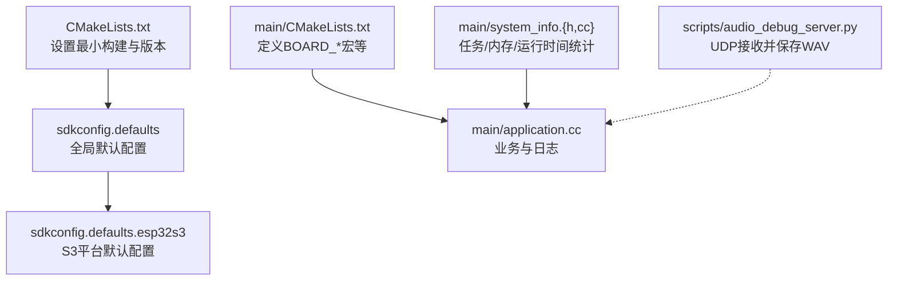
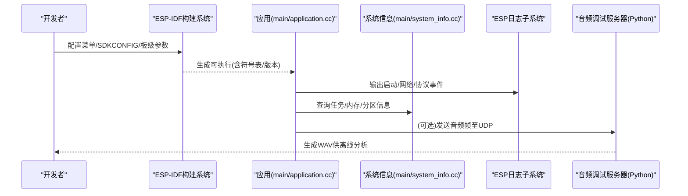
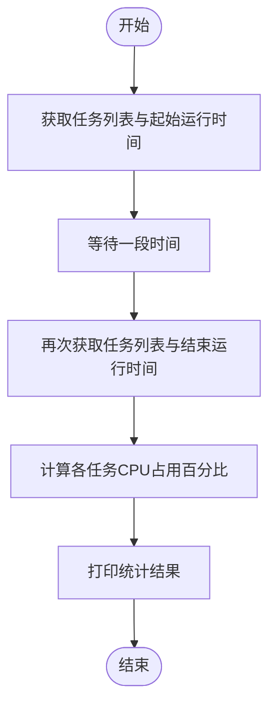
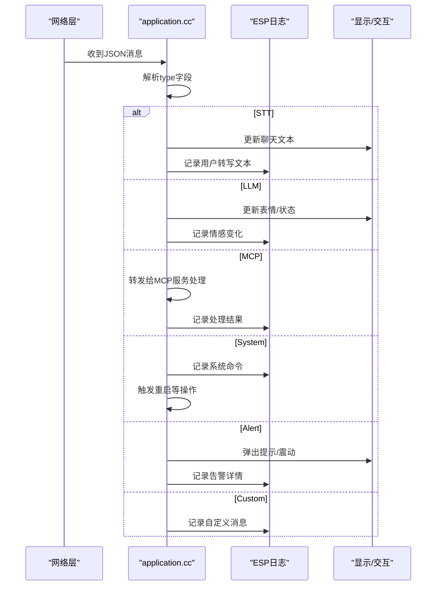
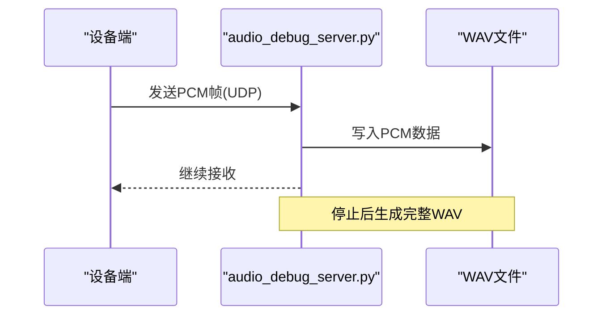
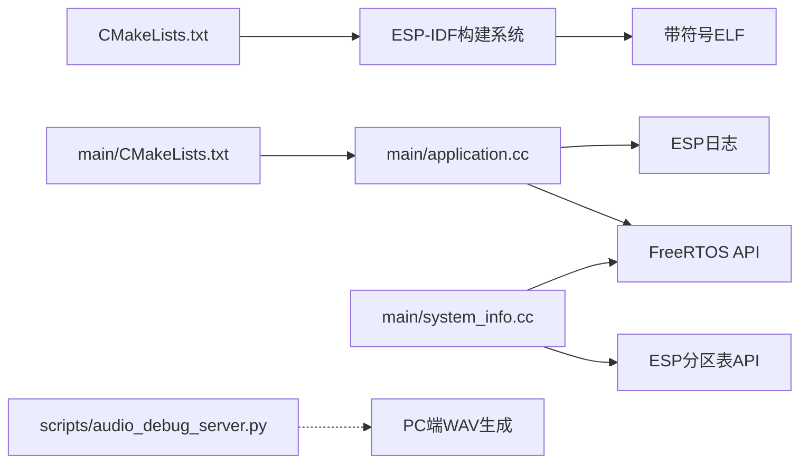

# ESP-IDF调试工具链

<cite>
**本文引用的文件**   
- [CMakeLists.txt](file://CMakeLists.txt)
- [sdkconfig.defaults](file://sdkconfig.defaults)
- [sdkconfig.defaults.esp32s3](file://sdkconfig.defaults.esp32s3)
- [main/CMakeLists.txt](file://main/CMakeLists.txt)
- [main/system_info.h](file://main/system_info.h)
- [main/system_info.cc](file://main/system_info.cc)
- [main/application.cc](file://main/application.cc)
- [scripts/audio_debug_server.py](file://scripts/audio_debug_server.py)
</cite>

## 目录
1. [简介](#简介)
2. [项目结构](#项目结构)
3. [核心组件](#核心组件)
4. [架构总览](#架构总览)
5. [详细组件分析](#详细组件分析)
6. [依赖关系分析](#依赖关系分析)
7. [性能考虑](#性能考虑)
8. [故障排查指南](#故障排查指南)
9. [结论](#结论)
10. [附录](#附录)

## 简介
本指南面向使用ESP-IDF进行嵌入式开发的工程师，聚焦于在该项目中如何高效配置和使用调试工具链。内容涵盖：
- GDB调试器配置与常用操作（断点、变量查看、调用栈）
- 日志输出系统配置（级别、格式化、运行时统计）
- 编译期调试选项（符号表、优化级别、最小构建）
- 常见调试场景步骤与最佳实践
- IDE集成调试与快捷键技巧

本项目基于ESP-IDF v5.4+，默认采用“最小化构建”策略以减小体积并提升构建速度；同时提供多平台默认配置与板级扩展机制，便于在不同目标芯片上启用合适的调试能力。

## 项目结构
与调试相关的核心位置：
- 顶层构建脚本与全局默认配置：CMakeLists.txt、sdkconfig.defaults、sdkconfig.defaults.*
- 应用层主逻辑与系统信息/性能统计：main/application.cc、main/system_info.{h,cc}
- 音频调试辅助脚本：scripts/audio_debug_server.py

图表来源
- [CMakeLists.txt:1-13](file://CMakeLists.txt#L1-L13)
- [sdkconfig.defaults:1-79](file://sdkconfig.defaults#L1-L79)
- [sdkconfig.defaults.esp32s3:1-32](file://sdkconfig.defaults.esp32s3#L1-L32)
- [main/CMakeLists.txt:1071-1111](file://main/CMakeLists.txt#L1071-L1111)
- [main/system_info.h:1-23](file://main/system_info.h#L1-L23)
- [main/system_info.cc:46-85](file://main/system_info.cc#L46-L85)
- [main/application.cc:261-604](file://main/application.cc#L261-L604)
- [scripts/audio_debug_server.py:1-55](file://scripts/audio_debug_server.py#L1-L55)

章节来源
- [CMakeLists.txt:1-13](file://CMakeLists.txt#L1-L13)
- [sdkconfig.defaults:1-79](file://sdkconfig.defaults#L1-L79)
- [sdkconfig.defaults.esp32s3:1-32](file://sdkconfig.defaults.esp32s3#L1-L32)
- [main/CMakeLists.txt:1071-1111](file://main/CMakeLists.txt#L1071-L1111)

## 核心组件
- 构建与链接
  - 最小化构建：通过构建属性开启最小化包含，减少组件数量，缩短构建时间，降低二进制体积。
  - 编译器警告控制：关闭特定告警以减少噪声。
  - 版本号注入：为产物附加项目版本以便定位问题。
- 默认配置
  - 全局默认：优化策略、异常与RTTI开关、看门狗超时、FreeRTOS运行时间统计、LVGL裁剪等。
  - 平台默认（以ESP32-S3为例）：Flash大小/模式、CPU频率、外部SPIRAM、缓存行大小、USB主机传输大小等。
- 运行时诊断
  - 系统信息接口：获取堆、分区、MAC、芯片型号、用户代理等。
  - 任务CPU占用统计：基于FreeRTOS运行时间计数器，计算任务耗时占比。
- 日志与消息
  - 应用层广泛使用ESP_LOG*系列宏输出结构化日志，便于GDB/串口联调。
- 音频调试
  - 提供Python脚本监听UDP端口，将PCM数据流保存为WAV，用于离线回放与分析。

章节来源
- [CMakeLists.txt:1-13](file://CMakeLists.txt#L1-L13)
- [sdkconfig.defaults:1-79](file://sdkconfig.defaults#L1-L79)
- [sdkconfig.defaults.esp32s3:1-32](file://sdkconfig.defaults.esp32s3#L1-L32)
- [main/system_info.h:1-23](file://main/system_info.h#L1-L23)
- [main/system_info.cc:46-85](file://main/system_info.cc#L46-L85)
- [main/application.cc:261-604](file://main/application.cc#L261-L604)
- [scripts/audio_debug_server.py:1-55](file://scripts/audio_debug_server.py#L1-L55)

## 架构总览
下图展示了从构建到运行期的关键路径，以及调试相关入口点。

图表来源
- [CMakeLists.txt:1-13](file://CMakeLists.txt#L1-L13)
- [main/application.cc:261-604](file://main/application.cc#L261-L604)
- [main/system_info.cc:46-85](file://main/system_info.cc#L46-L85)
- [scripts/audio_debug_server.py:1-55](file://scripts/audio_debug_server.py#L1-L55)

## 详细组件分析

### 构建与链接（最小构建与符号）
- 最小构建：通过构建属性启用最小化包含，有助于加快构建并减少不必要的依赖。
- 符号与版本：确保生成带符号的ELF，便于GDB反汇编与源码级调试；项目版本由构建系统注入，便于问题回溯。
- 编译器选项：关闭特定告警以减少干扰；可根据需要调整优化级别与调试信息粒度。

章节来源
- [CMakeLists.txt:1-13](file://CMakeLists.txt#L1-L13)

### 默认配置（全局与平台）
- 全局默认（sdkconfig.defaults）
  - 优化策略：默认按体积优化，可按需改为性能或无优化以增强调试体验。
  - 异常与RTTI：启用C++异常与RTTI，便于在复杂逻辑中使用异常处理与类型信息。
  - 看门狗与FreeRTOS：配置看门狗超时；启用运行时间统计与格式化函数，支持任务CPU占用分析。
  - LVGL裁剪：禁用不需要的部件以节省空间。
- 平台默认（sdkconfig.defaults.esp32s3）
  - Flash与缓存：指定Flash大小/模式、指令/数据缓存行大小。
  - SPIRAM：启用外部SRAM及动态分配策略，影响内存布局与调试时的堆视图。
  - USB主机：调整最大控制传输大小，避免大数据包导致的问题。

章节来源
- [sdkconfig.defaults:1-79](file://sdkconfig.defaults#L1-L79)
- [sdkconfig.defaults.esp32s3:1-32](file://sdkconfig.defaults.esp32s3#L1-L32)

### 运行时诊断（系统信息与任务统计）
- 系统信息接口
  - 提供获取Flash大小、最小空闲堆、当前空闲堆、MAC地址、芯片型号、用户代理等方法。
  - 用户代理包含板卡名称与应用版本，便于云端/服务端识别设备身份。
- 任务CPU占用统计
  - 基于FreeRTOS运行时间计数器，两次采样间隔内统计各任务CPU占用，帮助定位热点任务。
  - 需要启用运行时间统计与格式化函数（已在默认配置中启用）。

图表来源
- [main/system_info.h:1-23](file://main/system_info.h#L1-L23)
- [main/system_info.cc:46-85](file://main/system_info.cc#L46-L85)

章节来源
- [main/system_info.h:1-23](file://main/system_info.h#L1-L23)
- [main/system_info.cc:46-85](file://main/system_info.cc#L46-L85)

### 日志系统与消息处理
- 日志级别与输出
  - 应用层广泛使用ESP_LOGI/W/E等宏输出结构化日志，便于在串口/GDB会话中观察。
  - 可通过menuconfig调整日志级别与后端（如UART），以满足不同阶段的调试需求。
- 消息处理流程（示例）
  - 解析JSON消息后，根据type分支处理STT/LLM/MCP/System/Alert/Custom等消息，并在处理前后输出相应日志。
  - 对未知类型或格式错误给出告警日志，便于快速定位问题。

图表来源
- [main/application.cc:261-604](file://main/application.cc#L261-L604)

章节来源
- [main/application.cc:261-604](file://main/application.cc#L261-L604)

### 音频调试（UDP接收与WAV保存）
- 用途：在开发阶段，将设备端采集的PCM音频流发送至PC端的UDP服务，自动保存为WAV文件，便于离线回放与频谱分析。
- 使用方法：
  - 启动Python脚本，指定采样率与声道数。
  - 设备端将音频帧发送到该脚本监听的UDP端口。
  - 脚本持续写入WAV，直到手动停止。

图表来源
- [scripts/audio_debug_server.py:1-55](file://scripts/audio_debug_server.py#L1-L55)

章节来源
- [scripts/audio_debug_server.py:1-55](file://scripts/audio_debug_server.py#L1-L55)

### 编译期调试选项与符号表
- 符号表与调试信息
  - 确保生成带符号的ELF，以便GDB能正确映射源码与函数名。
  - 若遇到符号缺失，检查是否启用了最小构建且未裁剪掉必要组件。
- 优化级别
  - 默认按体积优化，调试时可临时调整为性能或无优化，以获得更稳定的行为与更好的单步调试体验。
- 最小构建
  - 最小构建会剔除非必要组件，可能影响某些调试特性（如部分组件的调试输出）。必要时可关闭最小构建以包含更多调试能力。

章节来源
- [CMakeLists.txt:1-13](file://CMakeLists.txt#L1-L13)
- [sdkconfig.defaults:1-79](file://sdkconfig.defaults#L1-L79)

### IDE集成调试（VSCode + ESP-IDF插件）
- 环境准备
  - 安装ESP-IDF插件，选择SDK版本5.4或以上。
  - 建议使用Linux以获得更快的编译与更少的驱动问题。
- 调试配置要点
  - 目标芯片与下载器：在IDE中选择正确的目标与烧录器。
  - 符号加载：确保ELF与固件同步，避免符号不一致导致无法定位源码。
  - 日志输出：将串口终端与GDB会话并行打开，便于对照日志与断点。
- 常用快捷键（参考ESP-IDF插件默认）
  - 启动调试：通常对应“Start Debugging”。
  - 切换断点：F9。
  - 单步进入/跳出：F11/F10。
  - 继续执行：F5。
  - 查看变量/调用栈：在调试视图中展开。
  - 条件断点/数据断点：右键断点图标进行设置。

章节来源
- [README.md:115-120](file://README.md#L115-L120)

## 依赖关系分析
- 构建依赖
  - 顶层CMakeLists引入ESP-IDF工程模板，并设置最小构建与项目版本。
  - main/CMakeLists通过编译定义注入板卡信息（BOARD_TYPE/BOARD_NAME），便于运行时区分。
- 运行时依赖
  - application.cc依赖ESP日志子系统与FreeRTOS API。
  - system_info.cc依赖FreeRTOS任务统计API与ESP分区表API。
  - audio_debug_server.py独立于设备端，仅作为PC端辅助工具。

图表来源
- [CMakeLists.txt:1-13](file://CMakeLists.txt#L1-L13)
- [main/CMakeLists.txt:1071-1111](file://main/CMakeLists.txt#L1071-L1111)
- [main/application.cc:261-604](file://main/application.cc#L261-L604)
- [main/system_info.cc:46-85](file://main/system_info.cc#L46-L85)
- [scripts/audio_debug_server.py:1-55](file://scripts/audio_debug_server.py#L1-L55)

章节来源
- [CMakeLists.txt:1-13](file://CMakeLists.txt#L1-L13)
- [main/CMakeLists.txt:1071-1111](file://main/CMakeLists.txt#L1071-L1111)
- [main/application.cc:261-604](file://main/application.cc#L261-L604)
- [main/system_info.cc:46-85](file://main/system_info.cc#L46-L85)
- [scripts/audio_debug_server.py:1-55](file://scripts/audio_debug_server.py#L1-L55)

## 性能考虑
- 最小构建与组件裁剪
  - 最小构建可减少链接时间与二进制体积，但可能移除部分调试输出。建议在功能验证阶段保持最小构建，在深度调试时按需扩大包含范围。
- FreeRTOS运行时间统计
  - 已启用运行时间统计与格式化函数，可用于任务CPU占用分析。注意统计本身会带来少量开销，生产环境建议谨慎使用。
- 内存与缓存
  - S3平台默认启用外部SRAM与较大缓存行，有助于吞吐与稳定性。调试时关注堆碎片与内存峰值，结合系统信息接口进行观测。
- 日志开销
  - 高频日志会影响实时性。建议在热路径使用低级别日志或条件编译开关控制。

[本节为通用指导，无需具体文件引用]

## 故障排查指南
- 无法连接调试器
  - 确认目标芯片与下载器选择正确；检查串口权限与驱动；在Windows下优先使用Linux环境以避免驱动问题。
- 符号缺失或无法定位源码
  - 确保ELF与固件一致；检查是否启用了最小构建导致组件被裁剪；确认编译选项保留了调试信息。
- 任务卡顿或看门狗复位
  - 使用系统信息接口打印任务CPU占用，定位热点任务；适当调整看门狗超时或优化任务逻辑。
- 音频失真或丢帧
  - 核对设备端与服务器端采样率一致性；使用UDP音频调试脚本保存WAV进行离线分析。
- 未知消息类型或格式错误
  - 检查JSON结构与type字段；关注应用层日志中的告警信息，逐步缩小问题范围。

章节来源
- [README.md:115-120](file://README.md#L115-L120)
- [main/system_info.cc:46-85](file://main/system_info.cc#L46-L85)
- [main/application.cc:261-604](file://main/application.cc#L261-L604)
- [scripts/audio_debug_server.py:1-55](file://scripts/audio_debug_server.py#L1-L55)

## 结论
通过在构建阶段启用最小构建与必要的调试信息，在运行时利用ESP日志与FreeRTOS统计接口，并结合IDE集成的GDB调试能力，可以在本项目中高效完成从代码级到系统级的全链路调试。配合UDP音频调试脚本，可进一步覆盖音视频链路的问题定位。建议在功能验证阶段保持最小构建，在深度调试时按需扩大包含范围，并根据平台特性调整内存与缓存配置以获得更稳定的调试体验。

[本节为总结性内容，无需具体文件引用]

## 附录
- 常用配置项速查
  - 最小构建：在顶层CMakeLists中设置构建属性。
  - 日志级别：通过menuconfig调整ESP日志后端与级别。
  - 运行时间统计：默认已启用，可直接使用系统信息接口。
  - 平台默认：针对ESP32-S3的Flash/SPIRAM/缓存等默认值位于平台默认配置文件。
- 参考路径
  - 构建与版本：[CMakeLists.txt:1-13](file://CMakeLists.txt#L1-L13)
  - 全局默认：[sdkconfig.defaults:1-79](file://sdkconfig.defaults#L1-L79)
  - S3默认：[sdkconfig.defaults.esp32s3:1-32](file://sdkconfig.defaults.esp32s3#L1-L32)
  - 板卡宏注入：[main/CMakeLists.txt:1071-1111](file://main/CMakeLists.txt#L1071-L1111)
  - 系统信息接口：[main/system_info.h:1-23](file://main/system_info.h#L1-L23), [main/system_info.cc:46-85](file://main/system_info.cc#L46-L85)
  - 应用日志与消息处理：[main/application.cc:261-604](file://main/application.cc#L261-L604)
  - 音频调试脚本：[scripts/audio_debug_server.py:1-55](file://scripts/audio_debug_server.py#L1-L55)