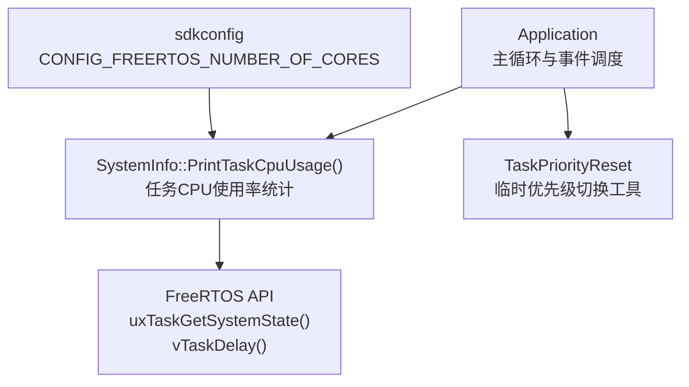
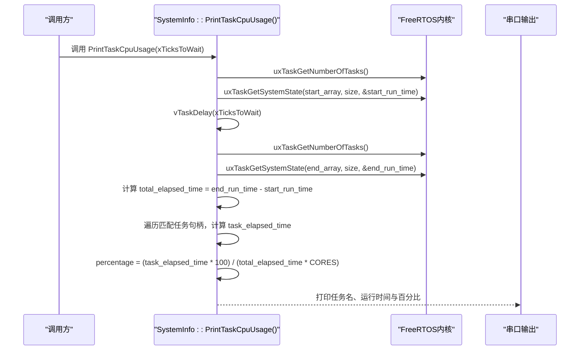
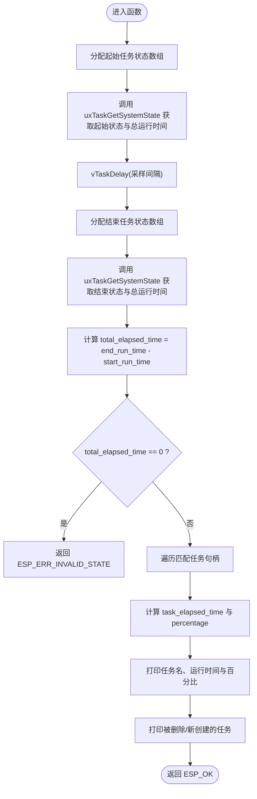
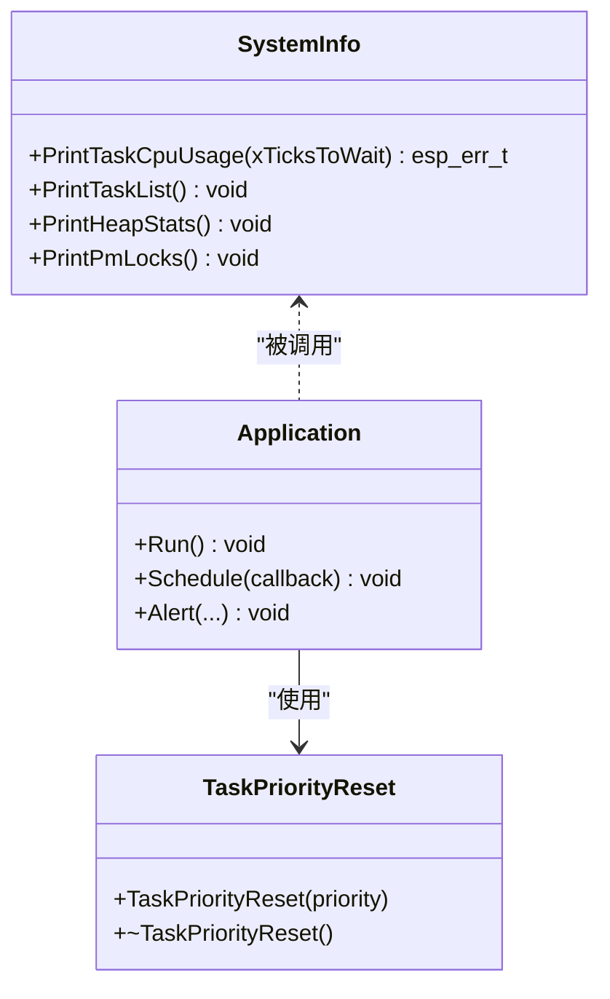

# CPU性能分析

<cite>
**本文引用的文件**   
- [main/system_info.h](file://main/system_info.h)
- [main/system_info.cc](file://main/system_info.cc)
- [main/application.h](file://main/application.h)
- [main/application.cc](file://main/application.cc)
- [main/boards/waveshare/esp32-s3-touch-lcd-4.3c/sdkconfig.4_3c](file://main/boards/waveshare/esp32-s3-touch-lcd-4.3c/sdkconfig.4_3c)
</cite>

## 目录
1. [简介](#简介)
2. [项目结构](#项目结构)
3. [核心组件](#核心组件)
4. [架构总览](#架构总览)
5. [详细组件分析](#详细组件分析)
6. [依赖关系分析](#依赖关系分析)
7. [性能考量与优化建议](#性能考量与优化建议)
8. [故障排查指南](#故障排查指南)
9. [结论](#结论)
10. [附录：测试案例与操作步骤](#附录测试案例与操作步骤)

## 简介
本指南面向在 ESP-IDF + FreeRTOS 环境下进行 CPU 性能分析的开发者，聚焦任务级 CPU 使用率分析方法。文档围绕以下目标展开：
- 如何使用 PrintTaskCpuUsage() 获取并输出每个任务的 CPU 占用百分比
- 如何通过 uxTaskGetSystemState() 采集任务运行状态，并结合运行时计数器计算占比
- 如何识别性能瓶颈与热点代码（长时间运行的任务、临界区等）
- 多核 CPU 场景下的分析方法与 CONFIG_FREERTOS_NUMBER_OF_CORES 的作用
- 任务优先级调整策略与双核负载均衡优化思路
- 提供可复现的性能测试案例与优化建议，帮助提升系统响应速度与整体性能

## 项目结构
本项目将系统信息统计与调试能力集中在 SystemInfo 模块中，并在 Application 主循环中集成周期性打印与事件处理。关键路径如下：
- system_info.h/cc：定义并实现 PrintTaskCpuUsage() 等系统信息接口
- application.h/cc：应用主循环、事件调度、任务优先级设置与周期任务触发
- sdkconfig.*：平台配置项，包括多核数量等

图表来源
- [main/system_info.cc:59-142](file://main/system_info.cc#L59-L142)
- [main/application.cc:165-259](file://main/application.cc#L165-L259)
- [main/application.h:179-191](file://main/application.h#L179-L191)
- [main/boards/waveshare/esp32-s3-touch-lcd-4.3c/sdkconfig.4_3c:1796](file://main/boards/waveshare/esp32-s3-touch-lcd-4.3c/sdkconfig.4_3c#L1796)

章节来源
- [main/system_info.h:9-21](file://main/system_info.h#L9-L21)
- [main/system_info.cc:59-142](file://main/system_info.cc#L59-L142)
- [main/application.cc:165-259](file://main/application.cc#L165-L259)
- [main/application.h:179-191](file://main/application.h#L179-L191)
- [main/boards/waveshare/esp32-s3-touch-lcd-4.3c/sdkconfig.4_3c:1796](file://main/boards/waveshare/esp32-s3-touch-lcd-4.3c/sdkconfig.4_3c#L1796)

## 核心组件
- SystemInfo 类
  - 提供静态方法 PrintTaskCpuUsage(TickType_t xTicksToWait)，用于按时间窗口统计各任务 CPU 占用百分比
  - 内部通过 FreeRTOS 的 uxTaskGetSystemState() 获取任务列表与运行时间计数，结合 vTaskDelay() 控制采样间隔
  - 支持检测任务创建/删除情况，并输出“Created/Deleted”提示
- Application 类
  - 主循环 Run() 负责事件分发与 UI 更新
  - 提供 TaskPriorityReset RAII 工具，便于在关键代码段临时提升当前任务优先级，降低抖动
  - 主任务优先级设置为较高值，确保系统交互及时响应

章节来源
- [main/system_info.h:9-21](file://main/system_info.h#L9-L21)
- [main/system_info.cc:59-142](file://main/system_info.cc#L59-L142)
- [main/application.h:179-191](file://main/application.h#L179-L191)
- [main/application.cc:165-259](file://main/application.cc#L165-L259)

## 架构总览
下图展示了 CPU 使用率统计的关键调用链与数据流：从上层调用到 FreeRTOS 内核 API，再到结果计算与输出。

图表来源
- [main/system_info.cc:59-142](file://main/system_info.cc#L59-L142)

## 详细组件分析

### SystemInfo::PrintTaskCpuUsage() 使用方法与配置
- 基本用法
  - 在任意任务中调用 SystemInfo::PrintTaskCpuUsage(xTicksToWait)，xTicksToWait 为采样间隔（以 Tick 为单位）
  - 函数会分配两个 TaskStatus_t 数组，分别记录采样开始和结束时的任务状态
  - 通过 uxTaskGetSystemState() 获取每个任务的 ulRunTimeCounter 与系统总运行时间计数
  - 根据任务句柄匹配前后两次快照，计算每个任务的增量运行时间，再除以总时间得到百分比
- 返回值与错误码
  - 成功返回 ESP_OK
  - 内存不足返回 ESP_ERR_NO_MEM
  - 缓冲区大小不足返回 ESP_ERR_INVALID_SIZE
  - 总运行时间为零（未启用或时钟异常）返回 ESP_ERR_INVALID_STATE
- 注意事项
  - 需要确保 FreeRTOS 已启用运行时统计功能（否则 uxTaskGetSystemState 无法正常工作）
  - 在多核平台上，百分比分母包含 CORES 因子，避免单核视角下超过 100% 的情况
  - 采样间隔不宜过短，以免频繁分配内存与上下文切换影响被测系统行为

章节来源
- [main/system_info.h:16-17](file://main/system_info.h#L16-L17)
- [main/system_info.cc:59-142](file://main/system_info.cc#L59-L142)

#### 算法流程图

图表来源
- [main/system_info.cc:59-142](file://main/system_info.cc#L59-L142)

### 多核 CPU 分析与 CONFIG_FREERTOS_NUMBER_OF_CORES
- 作用说明
  - 在多核 FreeRTOS 环境中，uxTaskGetSystemState 返回的系统总运行时间是所有核心累计的时间
  - 为了得到合理的任务占用百分比，需要将分母乘以 CORES 数量，避免单核视角下出现超 100% 的结果
- 配置位置
  - 不同板级配置文件可能设置不同的 CORES 值，例如某 4.3 寸触控屏板级配置中将 CONFIG_FREERTOS_NUMBER_OF_CORES 设为 2
- 实践建议
  - 确认目标平台的 CONFIG_FREERTOS_NUMBER_OF_CORES 与实际芯片一致
  - 若发现百分比异常偏高，检查该宏是否被正确配置
  - 对于双核设备，可将高负载任务绑定到特定核心，或通过优先级与亲和性策略优化负载分布

章节来源
- [main/system_info.cc:118-121](file://main/system_info.cc#L118-L121)
- [main/boards/waveshare/esp32-s3-touch-lcd-4.3c/sdkconfig.4_3c:1796](file://main/boards/waveshare/esp32-s3-touch-lcd-4.3c/sdkconfig.4_3c#L1796)

### 任务优先级调整策略
- 临时提升优先级
  - 使用 TaskPriorityReset RAII 对象，在进入关键代码块时自动提升当前任务优先级，退出时恢复原优先级
  - 适用于短时关键路径（如音频编解码、网络发送），减少中断抖动与延迟
- 主任务优先级
  - 主循环任务优先级设置为较高值，保证 UI 更新与事件处理的及时性
- 注意事项
  - 避免长期持有高优先级，防止低优先级任务饥饿
  - 合理划分任务职责，必要时拆分长耗时操作为多个小任务

章节来源
- [main/application.h:179-191](file://main/application.h#L179-L191)
- [main/application.cc:165-168](file://main/application.cc#L165-L168)

### 热点代码与瓶颈识别
- 观察指标
  - 任务 CPU 占用百分比持续偏高
  - 任务运行时间增量增长过快
  - 存在大量 Created/Deleted 任务，表明任务生命周期管理不稳定
- 定位手段
  - 缩短采样间隔，多次采样取平均，排除瞬时峰值干扰
  - 结合 PrintTaskList() 查看任务状态与栈使用情况
  - 对疑似热点函数插入轻量级计时点，对比前后增量
- 常见瓶颈
  - 阻塞式 I/O 或长临界区
  - 频繁的内存分配/释放
  - 未合理切分的长任务

章节来源
- [main/system_info.cc:125-135](file://main/system_info.cc#L125-L135)
- [main/system_info.cc:144-148](file://main/system_info.cc#L144-L148)

## 依赖关系分析
- SystemInfo 依赖 FreeRTOS 内核 API 与 ESP-IDF 日志/PM 接口
- Application 依赖 Board、Display、AudioService、Protocol 等子系统，并通过事件组协调
- 多核配置由 sdkconfig 提供，直接影响 CPU 使用率计算的分母

图表来源
- [main/system_info.h:9-21](file://main/system_info.h#L9-L21)
- [main/application.h:179-191](file://main/application.h#L179-L191)
- [main/application.cc:165-259](file://main/application.cc#L165-L259)

章节来源
- [main/system_info.h:9-21](file://main/system_info.h#L9-L21)
- [main/application.h:179-191](file://main/application.h#L179-L191)
- [main/application.cc:165-259](file://main/application.cc#L165-L259)

## 性能考量与优化建议
- 采样策略
  - 选择合适采样间隔，避免过于频繁导致额外开销
  - 多次采样取均值，过滤瞬时尖峰
- 任务设计
  - 将长耗时操作拆分为多个小任务，配合队列/事件组协作
  - 避免在高频路径中进行大对象分配与复杂计算
- 优先级与亲和性
  - 对实时性要求高的任务提升优先级，但需评估对其他任务的影响
  - 在多核平台上，考虑将 CPU 密集型任务绑定到空闲核心，降低抢占冲突
- 内存与 PM
  - 监控最小空闲堆与动态分配频率，避免碎片化
  - 利用 PM 锁与功耗模式切换，平衡性能与功耗

[本节为通用指导，不直接分析具体文件]

## 故障排查指南
- 常见问题
  - 返回 ESP_ERR_NO_MEM：数组分配失败，检查可用堆空间与任务栈大小
  - 返回 ESP_ERR_INVALID_SIZE：提供的缓冲太小，增大数组容量
  - 返回 ESP_ERR_INVALID_STATE：总运行时间为零，检查运行时统计是否启用
- 诊断步骤
  - 调用 PrintTaskList() 查看任务状态与栈使用
  - 调用 PrintHeapStats() 检查堆使用情况
  - 调用 PrintPmLocks() 查看 PM 锁占用，判断是否存在锁竞争导致的卡顿

章节来源
- [main/system_info.cc:70-78](file://main/system_info.cc#L70-L78)
- [main/system_info.cc:92-102](file://main/system_info.cc#L92-L102)
- [main/system_info.cc:144-158](file://main/system_info.cc#L144-L158)

## 结论
通过 SystemInfo::PrintTaskCpuUsage() 与 FreeRTOS 运行时统计，可以在嵌入式系统中快速定位任务级 CPU 热点与瓶颈。结合任务优先级调整、多核配置与合理的任务拆分策略，能够显著提升系统响应速度与整体性能。建议在开发阶段建立常态化的性能观测流程，持续跟踪关键任务的行为变化。

[本节为总结，不直接分析具体文件]

## 附录：测试案例与操作步骤
- 基础用例：单次采样
  - 在主循环或按键回调中调用 SystemInfo::PrintTaskCpuUsage(pdMS_TO_TICKS(1000))
  - 观察串口输出，识别占用最高的任务
- 进阶用例：周期性采样
  - 创建一个低优先级任务，每隔固定时间调用 PrintTaskCpuUsage()
  - 将结果写入文件或通过协议上报，便于离线分析
- 热点定位
  - 针对高占用任务，在其关键路径前后插入轻量级计时点，对比增量
  - 使用 TaskPriorityReset 临时提升优先级，验证是否因抢占导致抖动
- 多核验证
  - 确认 CONFIG_FREERTOS_NUMBER_OF_CORES 与实际平台一致
  - 尝试将 CPU 密集任务迁移至另一核心，观察占用变化

章节来源
- [main/system_info.cc:59-142](file://main/system_info.cc#L59-L142)
- [main/application.cc:165-259](file://main/application.cc#L165-L259)
- [main/boards/waveshare/esp32-s3-touch-lcd-4.3c/sdkconfig.4_3c:1796](file://main/boards/waveshare/esp32-s3-touch-lcd-4.3c/sdkconfig.4_3c#L1796)