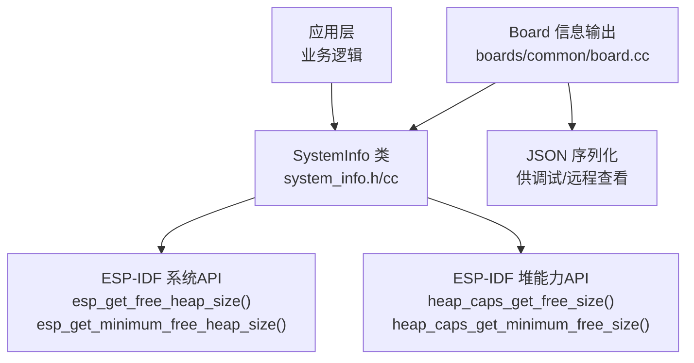
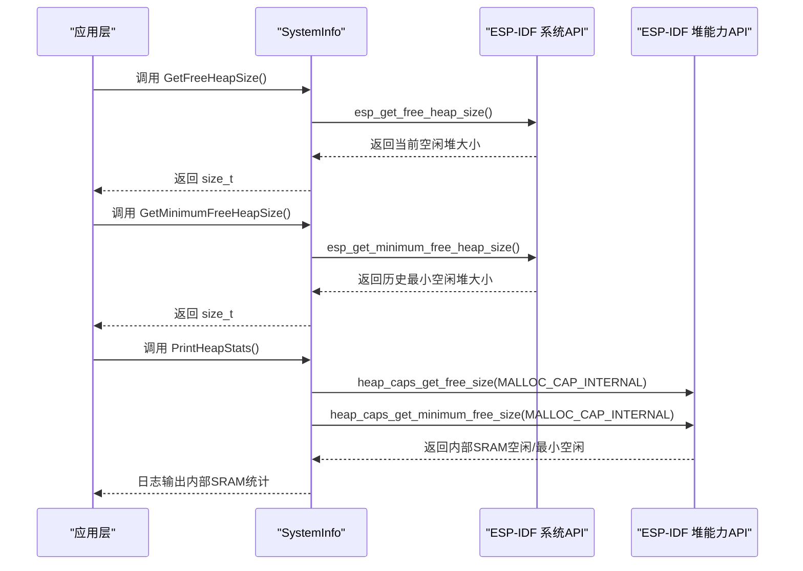
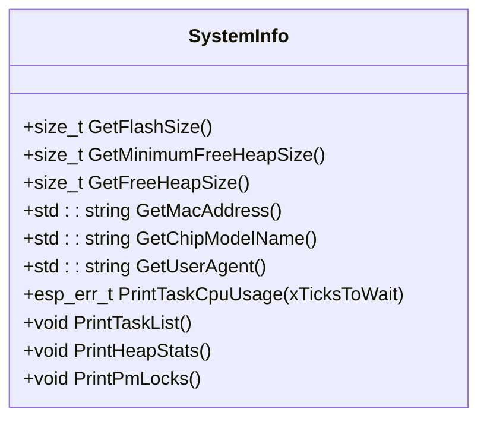
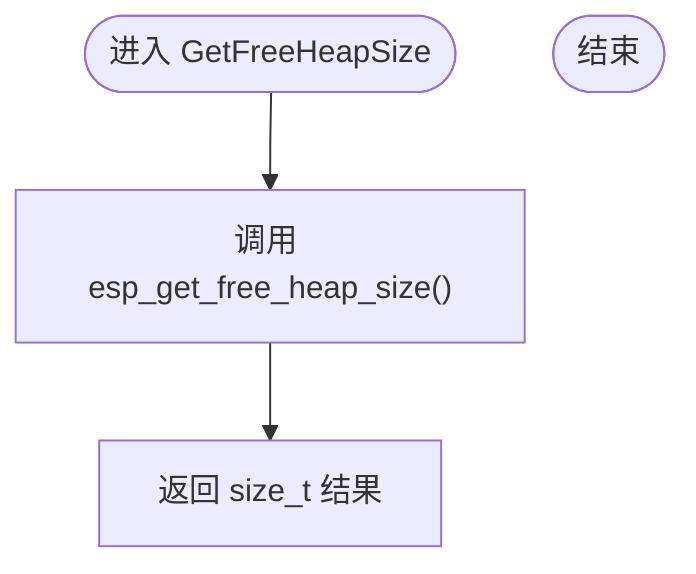
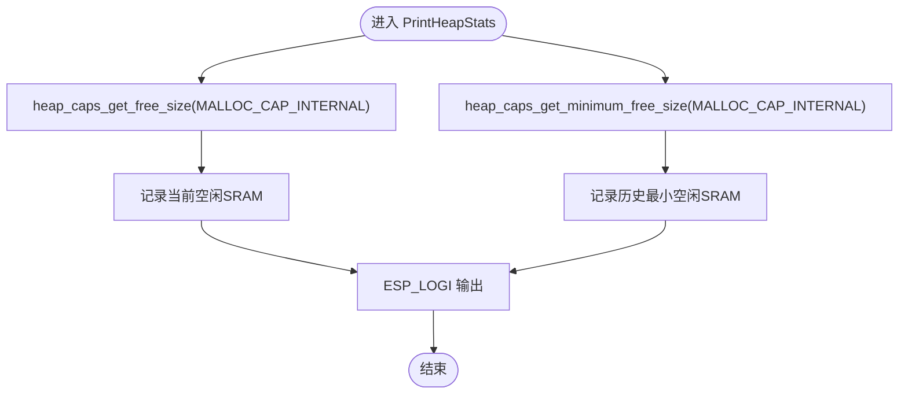
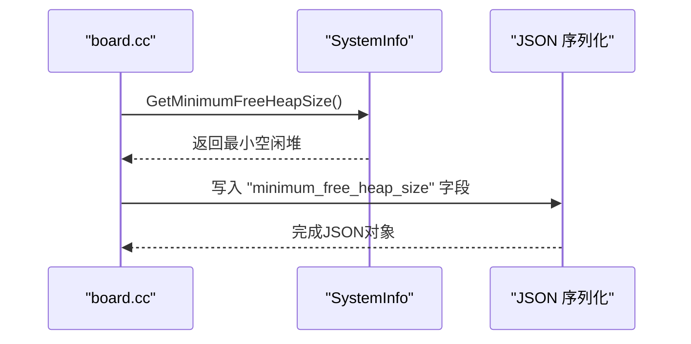
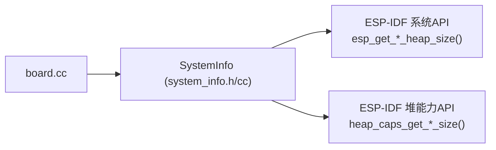

# 内存分析工具

<cite>
**本文引用的文件**   
- [system_info.h](file://main/system_info.h)
- [system_info.cc](file://main/system_info.cc)
- [board.cc](file://main/boards/common/board.cc)
</cite>

## 目录
1. [简介](#简介)
2. [项目结构](#项目结构)
3. [核心组件](#核心组件)
4. [架构总览](#架构总览)
5. [详细组件分析](#详细组件分析)
6. [依赖关系分析](#依赖关系分析)
7. [性能与内存特性](#性能与内存特性)
8. [故障排查指南](#故障排查指南)
9. [结论](#结论)
10. [附录：使用示例与最佳实践](#附录使用示例与最佳实践)

## 简介
本指南面向ESP32系列设备的开发者，聚焦于内存分析与监控能力。文档围绕SystemInfo类提供的接口，说明如何获取系统堆栈信息、最小空闲堆大小、内部SRAM分配情况，并结合heap_caps_get_free_size()与heap_caps_get_minimum_free_size()进行更细粒度的内存观测。同时提供内存泄漏检测的实用方法、关键路径监控策略与趋势分析方法，帮助快速定位和解决内存问题。

## 项目结构
与内存分析直接相关的代码集中在系统信息模块与板级信息输出中：
- system_info.h/cc：封装系统信息查询（包括堆大小、任务列表、CPU占用等）
- boards/common/board.cc：将系统信息（含最小空闲堆大小）序列化为JSON，便于外部查看或上报

图表来源
- [system_info.h:9-21](file://main/system_info.h#L9-L21)
- [system_info.cc:27-33](file://main/system_info.cc#L27-L33)
- [system_info.cc:150-154](file://main/system_info.cc#L150-L154)
- [board.cc:110-116](file://main/boards/common/board.cc#L110-L116)

章节来源
- [system_info.h:9-21](file://main/system_info.h#L9-L21)
- [system_info.cc:27-33](file://main/system_info.cc#L27-L33)
- [board.cc:110-116](file://main/boards/common/board.cc#L110-L116)

## 核心组件
- SystemInfo::GetFreeHeapSize()：返回当前可用堆大小
- SystemInfo::GetMinimumFreeHeapSize()：返回运行以来最小可用堆大小
- SystemInfo::PrintHeapStats()：打印内部SRAM的当前空闲与历史最小空闲大小
- Board 信息输出：在JSON中包含“minimum_free_heap_size”字段，便于统一采集

章节来源
- [system_info.h:11-13](file://main/system_info.h#L11-L13)
- [system_info.cc:27-33](file://main/system_info.cc#L27-L33)
- [system_info.cc:150-154](file://main/system_info.cc#L150-L154)
- [board.cc:110-116](file://main/boards/common/board.cc#L110-L116)

## 架构总览
下图展示了从上层调用到底层ESP-IDF API的调用链，以及内部SRAM统计的分支。

图表来源
- [system_info.cc:27-33](file://main/system_info.cc#L27-L33)
- [system_info.cc:150-154](file://main/system_info.cc#L150-L154)

## 详细组件分析

### SystemInfo 类概览
SystemInfo 提供静态方法用于查询系统资源与运行时状态，其中与内存相关的方法如下：
- GetFlashSize()：读取Flash容量
- GetMinimumFreeHeapSize()：历史最小空闲堆
- GetFreeHeapSize()：当前空闲堆
- PrintTaskList() / PrintTaskCpuUsage()：任务与CPU占用辅助
- PrintHeapStats()：内部SRAM空闲与最小空闲统计
- PrintPmLocks()：电源管理锁信息

图表来源
- [system_info.h:9-21](file://main/system_info.h#L9-L21)

章节来源
- [system_info.h:9-21](file://main/system_info.h#L9-L21)

### 堆大小查询实现
- GetFreeHeapSize() 直接调用 ESP-IDF 的系统API获取当前空闲堆大小
- GetMinimumFreeHeapSize() 直接调用 ESP-IDF 的系统API获取历史最小空闲堆大小

图表来源
- [system_info.cc:31-33](file://main/system_info.cc#L31-L33)

章节来源
- [system_info.cc:27-33](file://main/system_info.cc#L27-L33)

### 内部SRAM统计（heap_caps）
PrintHeapStats() 通过 heap_caps_get_free_size() 与 heap_caps_get_minimum_free_size() 针对 MALLOC_CAP_INTERNAL 能力位进行统计，适用于关注内部SRAM分配的场景。

图表来源
- [system_info.cc:150-154](file://main/system_info.cc#L150-L154)

章节来源
- [system_info.cc:150-154](file://main/system_info.cc#L150-L154)

### 板级信息中的最小空闲堆
board.cc 在构建设备信息JSON时，包含 minimum_free_heap_size 字段，便于统一收集与分析。

图表来源
- [board.cc:110-116](file://main/boards/common/board.cc#L110-L116)
- [system_info.cc:27-29](file://main/system_info.cc#L27-L29)

章节来源
- [board.cc:110-116](file://main/boards/common/board.cc#L110-L116)

## 依赖关系分析
- SystemInfo 对 ESP-IDF 系统API的依赖：esp_get_free_heap_size()、esp_get_minimum_free_heap_size()
- SystemInfo 对 ESP-IDF 堆能力API的依赖：heap_caps_get_free_size()、heap_caps_get_minimum_free_size()
- board.cc 对 SystemInfo 的依赖：GetMinimumFreeHeapSize()

图表来源
- [board.cc:110-116](file://main/boards/common/board.cc#L110-L116)
- [system_info.cc:27-33](file://main/system_info.cc#L27-L33)
- [system_info.cc:150-154](file://main/system_info.cc#L150-L154)

章节来源
- [board.cc:110-116](file://main/boards/common/board.cc#L110-L116)
- [system_info.cc:27-33](file://main/system_info.cc#L27-L33)
- [system_info.cc:150-154](file://main/system_info.cc#L150-L154)

## 性能与内存特性
- 获取堆大小的API为轻量级查询，适合周期性调用；但频繁调用仍会带来额外开销，建议合理控制采样频率
- 内部SRAM统计（MALLOC_CAP_INTERNAL）有助于识别紧耦合于内部SRAM的分配热点，避免外部PSRAM或缓存带来的干扰
- 最小空闲堆是判断潜在内存不足的关键指标，若该值持续下降，需警惕内存泄漏或峰值分配未释放

[本节为通用指导，不直接分析具体文件]

## 故障排查指南
- 现象：设备运行一段时间后出现崩溃或异常重启
  - 检查最小空闲堆是否持续降低：对比不同时间点的 minimum_free_heap_size
  - 观察内部SRAM的空闲与最小空闲变化，定位是否由特定模块导致
- 现象：音频/网络/OTA等关键路径偶发失败
  - 在这些路径前后插入堆大小快照，确认是否存在短时峰值导致分配失败
- 现象：任务切换卡顿或CPU占用异常
  - 结合 PrintTaskCpuUsage() 与 PrintTaskList() 分析任务行为，排除长时间阻塞导致的内存持有

章节来源
- [system_info.cc:59-142](file://main/system_info.cc#L59-L142)
- [system_info.cc:144-148](file://main/system_info.cc#L144-L148)
- [system_info.cc:150-154](file://main/system_info.cc#L150-L154)

## 结论
通过 SystemInfo 提供的堆大小查询与内部SRAM统计，配合板级信息的统一输出，可以建立完善的内存监控体系。建议在关键路径与定时任务中引入定期采样，结合最小空闲堆与内部SRAM趋势分析，尽早发现并修复内存泄漏与峰值分配问题。

[本节为总结性内容，不直接分析具体文件]

## 附录：使用示例与最佳实践

- 定期内存检查
  - 在低优先级任务或定时器中周期调用 GetFreeHeapSize() 与 GetMinimumFreeHeapSize()，记录日志或上报至云端
  - 参考路径：[system_info.cc:27-33](file://main/system_info.cc#L27-L33)

- 关键路径内存监控
  - 在网络收发、音频编解码、模型加载等关键路径入口与出口处分别记录堆大小，计算差值评估峰值占用
  - 参考路径：[system_info.cc:27-33](file://main/system_info.cc#L27-L33)

- 内部SRAM分配分析
  - 使用 PrintHeapStats() 或自行调用 heap_caps_get_free_size()/heap_caps_get_minimum_free_size() 针对 MALLOC_CAP_INTERNAL 进行观测
  - 参考路径：[system_info.cc:150-154](file://main/system_info.cc#L150-L154)

- 内存使用趋势分析
  - 将 minimum_free_heap_size 纳入长期监控，绘制趋势图；若曲线持续下行，应重点排查新增分配点与释放路径
  - 参考路径：[board.cc:110-116](file://main/boards/common/board.cc#L110-L116)

- 调试技巧
  - 结合 PrintTaskList() 与 PrintTaskCpuUsage() 分析任务生命周期与CPU占用，辅助定位内存持有原因
  - 参考路径：[system_info.cc:59-142](file://main/system_info.cc#L59-L142)、[system_info.cc:144-148](file://main/system_info.cc#L144-L148)

章节来源
- [system_info.cc:27-33](file://main/system_info.cc#L27-L33)
- [system_info.cc:150-154](file://main/system_info.cc#L150-L154)
- [board.cc:110-116](file://main/boards/common/board.cc#L110-L116)
- [system_info.cc:59-142](file://main/system_info.cc#L59-L142)
- [system_info.cc:144-148](file://main/system_info.cc#L144-L148)