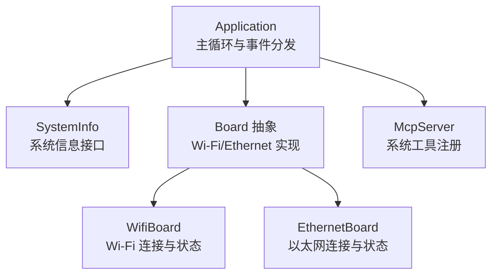
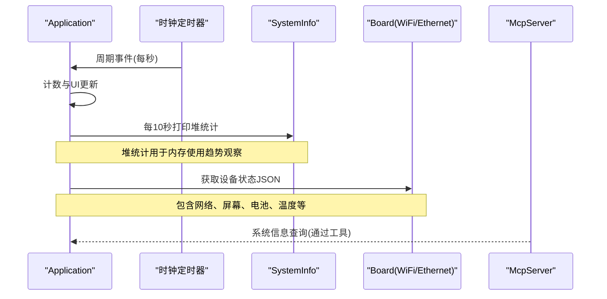
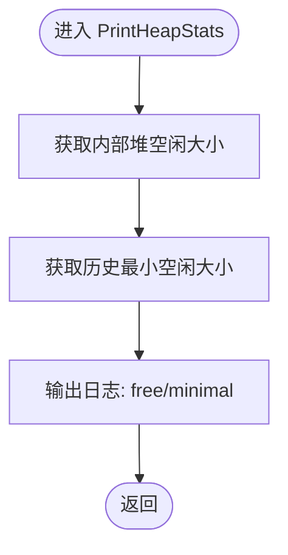
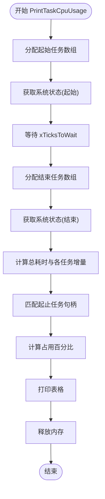
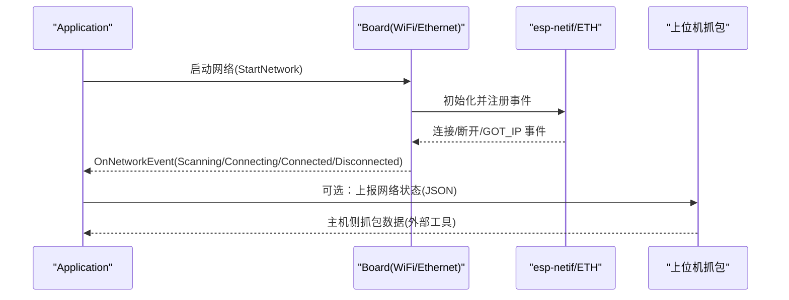
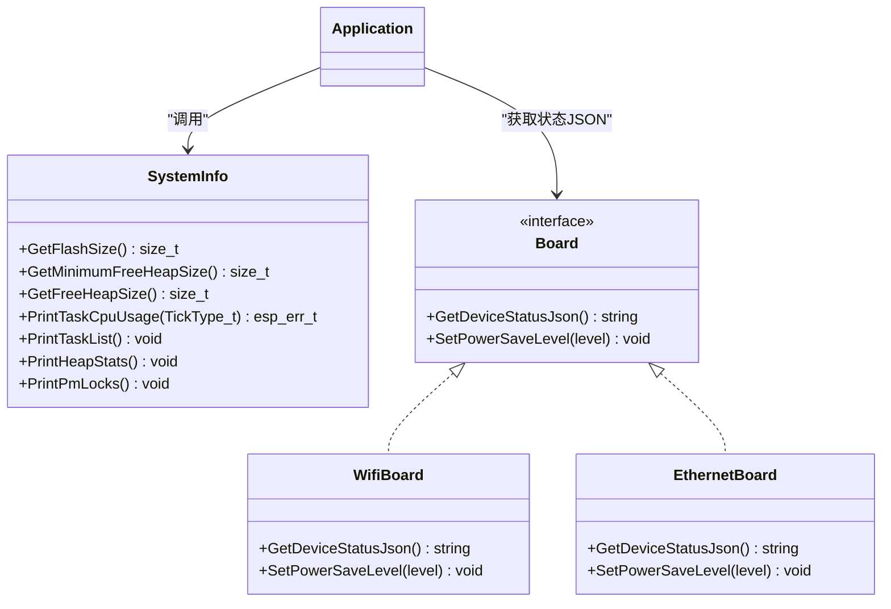
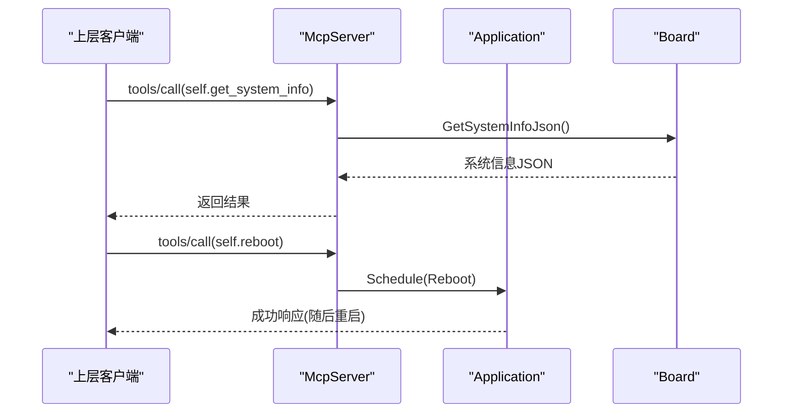
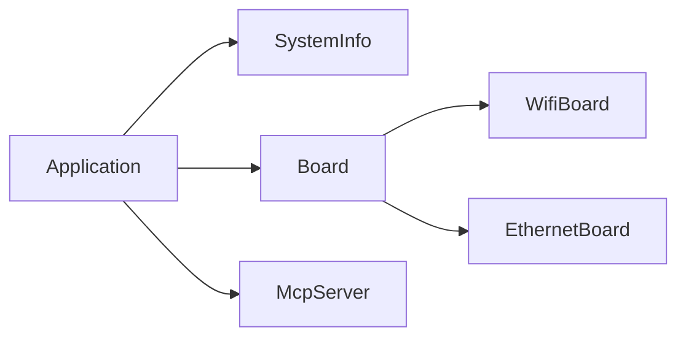

# 性能分析工具

<cite>
**本文引用的文件**   
- [README.md](file://README.md)
- [application.cc](file://main/application.cc)
- [application.h](file://main/application.h)
- [system_info.cc](file://main/system_info.cc)
- [system_info.h](file://main/system_info.h)
- [wifi_board.cc](file://main/boards/common/wifi_board.cc)
- [ethernet_board.cc](file://main/boards/common/ethernet_board.cc)
- [mcp_server.cc](file://main/mcp_server.cc)
</cite>

## 目录
1. [简介](#简介)
2. [项目结构](#项目结构)
3. [核心组件](#核心组件)
4. [架构总览](#架构总览)
5. [详细组件分析](#详细组件分析)
6. [依赖关系分析](#依赖关系分析)
7. [性能考量与优化建议](#性能考量与优化建议)
8. [故障排查指南](#故障排查指南)
9. [结论](#结论)
10. [附录](#附录)

## 简介
本指南面向在 ESP32 系列设备上运行的小智（XiaoZhi）固件，提供一套“轻量级、可集成”的性能分析与监控方法。由于该工程为嵌入式 C++ 应用，未内置专用内存/CPU/网络抓包工具，因此我们基于现有系统信息接口与应用事件循环，给出：
- 内存使用统计与最小空闲堆跟踪
- 任务级 CPU 占用估算
- 网络状态与设备状态 JSON 导出（便于外部采集）
- 通过 MCP 工具暴露的系统信息查询能力
- 结合 IDF 运行时能力的扩展建议（如启用 FreeRTOS 运行时统计、PM 锁打印等）

注意：本项目 README 中未包含专门的“性能分析工具”章节，以下内容为基于源码实现的系统化使用说明与最佳实践。

**章节来源**
- [README.md:1-173](file://README.md#L1-L173)

## 项目结构
围绕性能分析相关能力，主要涉及以下模块：
- 应用主循环与定时任务：周期性打印内存统计、驱动 UI 更新
- 系统信息接口：获取堆大小、任务列表、CPU 占用估算、PM 锁信息
- 网络层抽象：Wi-Fi/Ethernet 板级实现，统一上报网络事件与状态 JSON
- MCP 服务器：对外暴露系统信息查询工具（例如重启、升级、系统信息等）

**图表来源**
- [application.cc:165-259](file://main/application.cc#L165-L259)
- [system_info.h:9-21](file://main/system_info.h#L9-L21)
- [wifi_board.cc:268-358](file://main/boards/common/wifi_board.cc#L268-L358)
- [ethernet_board.cc:236-303](file://main/boards/common/ethernet_board.cc#L236-L303)
- [mcp_server.cc:128-161](file://main/mcp_server.cc#L128-L161)

**章节来源**
- [application.cc:165-259](file://main/application.cc#L165-L259)
- [system_info.h:9-21](file://main/system_info.h#L9-L21)
- [wifi_board.cc:268-358](file://main/boards/common/wifi_board.cc#L268-L358)
- [ethernet_board.cc:236-303](file://main/boards/common/ethernet_board.cc#L236-L303)
- [mcp_server.cc:128-161](file://main/mcp_server.cc#L128-L161)

## 核心组件
- SystemInfo：提供 Flash 容量、堆大小、MAC、芯片型号、用户代理、任务 CPU 占用估算、任务列表、堆统计、PM 锁打印等静态接口。
- Application：主循环每 10 秒调用一次堆统计；在网络/音频通道打开时切换功耗模式；处理各类事件并调度任务。
- WifiBoard/EthernetBoard：分别实现 Wi-Fi 与以太网接入，提供 GetDeviceStatusJson 输出设备状态（含网络、屏幕、电池、温度等）。
- McpServer：注册系统工具（如重启、升级、系统信息），供云端或上层调用。

**章节来源**
- [system_info.cc:18-57](file://main/system_info.cc#L18-L57)
- [system_info.cc:59-158](file://main/system_info.cc#L59-L158)
- [application.cc:248-259](file://main/application.cc#L248-L259)
- [application.cc:504-519](file://main/application.cc#L504-L519)
- [wifi_board.cc:301-358](file://main/boards/common/wifi_board.cc#L301-L358)
- [ethernet_board.cc:251-303](file://main/boards/common/ethernet_board.cc#L251-L303)
- [mcp_server.cc:128-161](file://main/mcp_server.cc#L128-L161)

## 架构总览
下图展示了性能相关数据流：Application 定时触发系统信息收集，Board 层提供设备状态 JSON，MCP 将系统信息作为工具暴露给上层。

**图表来源**
- [application.cc:36-47](file://main/application.cc#L36-L47)
- [application.cc:248-259](file://main/application.cc#L248-L259)
- [system_info.cc:150-154](file://main/system_info.cc#L150-L154)
- [wifi_board.cc:301-358](file://main/boards/common/wifi_board.cc#L301-L358)
- [ethernet_board.cc:251-303](file://main/boards/common/ethernet_board.cc#L251-L303)
- [mcp_server.cc:128-161](file://main/mcp_server.cc#L128-L161)

## 详细组件分析

### 内存分析器（堆统计与最小空闲堆）
- 功能说明
  - 获取当前内部 SRAM 空闲大小与历史最小空闲大小，用于判断是否存在持续增长的内存占用风险。
  - 在主循环中每 10 秒自动打印一次，便于长期观测。
- 使用方法
  - 直接调用 SystemInfo::PrintHeapStats() 进行一次性输出。
  - 或通过 Application 的定时逻辑自动输出。
- 指标解读
  - free sram：当前可用内部堆大小。
  - minimal sram：运行期间出现过的最小空闲堆大小，若持续下降需关注潜在泄漏或峰值分配。
- 局限与建议
  - 仅覆盖内部堆，不包含外部 PSRAM（如有）。
  - 如需更细粒度定位，可在关键路径增加自定义日志点，或使用 IDF 的 heap profiler（需在配置中启用）。

**图表来源**
- [system_info.cc:150-154](file://main/system_info.cc#L150-L154)

**章节来源**
- [system_info.cc:150-154](file://main/system_info.cc#L150-L154)
- [application.cc:248-259](file://main/application.cc#L248-L259)

### CPU 性能分析器（任务级 CPU 占用估算）
- 功能说明
  - 通过两次 uxTaskGetSystemState 采样，计算各任务在采样间隔内的运行时间占比，近似反映任务 CPU 占用。
- 使用方法
  - 调用 SystemInfo::PrintTaskCpuUsage(xTicksToWait)，xTicksToWait 为采样间隔。
  - 也可配合 SystemInfo::PrintTaskList() 查看任务清单。
- 指标解读
  - Run Time：任务在采样间隔内累计运行时间（单位取决于运行时计数器）。
  - Percentage：任务占用百分比（已考虑多核因子）。
- 局限与建议
  - 需要启用 FreeRTOS 运行时统计（CONFIG_FREERTOS_GENERATE_RUN_TIME_STATS）。
  - 结果受调度粒度影响，适合趋势对比而非绝对精确值。
  - 热点识别建议结合多次采样与业务场景复现。

**图表来源**
- [system_info.cc:59-142](file://main/system_info.cc#L59-L142)

**章节来源**
- [system_info.cc:59-142](file://main/system_info.cc#L59-L142)
- [system_info.h:17-18](file://main/system_info.h#L17-L18)

### 网络抓包工具（协议分析与延迟测量）
- 现状说明
  - 代码库未内置网络抓包工具（如 tcpdump/Wireshark 插件）。
- 可行方案
  - 使用 IDF 提供的 esp_netif 事件回调与日志，结合上位机侧抓包（主机端抓包）。
  - 通过 Board 层的 GetDeviceStatusJson 获取网络类型、信号强度、IP 等信息，辅助关联分析。
- 延迟测量建议
  - 在应用层对关键请求打点（发送/接收时间戳），计算端到端 RTT。
  - 利用 Application 的网络事件回调记录连接建立耗时。

**图表来源**
- [wifi_board.cc:52-87](file://main/boards/common/wifi_board.cc#L52-L87)
- [ethernet_board.cc:65-151](file://main/boards/common/ethernet_board.cc#L65-L151)
- [application.cc:102-156](file://main/application.cc#L102-L156)

**章节来源**
- [wifi_board.cc:52-87](file://main/boards/common/wifi_board.cc#L52-L87)
- [ethernet_board.cc:65-151](file://main/boards/common/ethernet_board.cc#L65-L151)
- [application.cc:102-156](file://main/application.cc#L102-L156)

### 系统资源监控（CPU、内存、磁盘 IO、温度）
- CPU 利用率
  - 使用 SystemInfo::PrintTaskCpuUsage 进行任务级估算。
  - 使用 SystemInfo::PrintPmLocks 查看 PM 锁占用情况（频率调节相关）。
- 内存占用
  - 使用 SystemInfo::PrintHeapStats 定期输出内部堆使用情况。
- 磁盘 IO
  - 工程未直接暴露文件系统 IO 统计接口；可通过 IDF 分区与 OTA 流程间接评估（OTA 下载/写入阶段）。
- 温度
  - Board 层 GetDeviceStatusJson 中包含 chip.temperature 字段（若硬件支持）。

**图表来源**
- [system_info.h:9-21](file://main/system_info.h#L9-L21)
- [system_info.cc:18-57](file://main/system_info.cc#L18-L57)
- [system_info.cc:150-158](file://main/system_info.cc#L150-L158)
- [wifi_board.cc:301-358](file://main/boards/common/wifi_board.cc#L301-L358)
- [ethernet_board.cc:251-303](file://main/boards/common/ethernet_board.cc#L251-L303)

**章节来源**
- [system_info.cc:18-57](file://main/system_info.cc#L18-L57)
- [system_info.cc:150-158](file://main/system_info.cc#L150-L158)
- [wifi_board.cc:301-358](file://main/boards/common/wifi_board.cc#L301-L358)
- [ethernet_board.cc:251-303](file://main/boards/common/ethernet_board.cc#L251-L303)

### MCP 工具（系统信息查询与远程诊断）
- 功能说明
  - 通过 McpServer 注册系统工具，如 self.get_system_info、self.reboot、self.upgrade_firmware 等，供上层调用以获取系统信息或执行操作。
- 使用方式
  - 上层通过 MCP 协议调用 tools/call，传入工具名与参数。
  - 设备侧解析后执行对应逻辑并返回结果。
- 适用场景
  - 远程诊断：查询系统信息、触发重启、拉取固件升级等。

**图表来源**
- [mcp_server.cc:128-161](file://main/mcp_server.cc#L128-L161)

**章节来源**
- [mcp_server.cc:128-161](file://main/mcp_server.cc#L128-L161)

## 依赖关系分析
- Application 依赖 SystemInfo 进行堆统计与任务信息输出。
- Board 抽象由具体平台实现（Wi-Fi/Ethernet），负责网络事件与状态 JSON。
- McpServer 依赖 Board 与 Application 的能力，向上层暴露系统工具。

**图表来源**
- [application.cc:165-259](file://main/application.cc#L165-L259)
- [system_info.h:9-21](file://main/system_info.h#L9-L21)
- [wifi_board.cc:268-358](file://main/boards/common/wifi_board.cc#L268-L358)
- [ethernet_board.cc:236-303](file://main/boards/common/ethernet_board.cc#L236-L303)
- [mcp_server.cc:128-161](file://main/mcp_server.cc#L128-L161)

**章节来源**
- [application.cc:165-259](file://main/application.cc#L165-L259)
- [system_info.h:9-21](file://main/system_info.h#L9-L21)
- [wifi_board.cc:268-358](file://main/boards/common/wifi_board.cc#L268-L358)
- [ethernet_board.cc:236-303](file://main/boards/common/ethernet_board.cc#L236-L303)
- [mcp_server.cc:128-161](file://main/mcp_server.cc#L128-L161)

## 性能考量与优化建议
- 内存
  - 关注 minimal sram 是否持续下降；必要时拆分大对象分配、复用缓冲区。
  - 避免在高频路径中进行大量动态分配。
- CPU
  - 通过任务级 CPU 占用估算识别热点任务；降低高优先级任务的阻塞时间。
  - 合理设置任务优先级与栈大小，避免抢占导致抖动。
- 网络
  - 在音频通道打开时切换到高性能模式，关闭后恢复低功耗，减少整体能耗与发热。
  - 使用 GetDeviceStatusJson 中的网络信号强度与 IP 信息辅助定位弱网问题。
- 电源管理
  - 使用 PrintPmLocks 检查 PM 锁是否长时间持有，避免不必要的频率锁定。
- 日志与采样
  - 控制日志级别与采样频率，避免日志本身成为性能瓶颈。
  - 对关键路径增加打点，结合外部抓包进行端到端分析。

[本节为通用指导，不直接分析具体文件]

## 故障排查指南
- 内存异常
  - 现象：minimal sram 持续下降，free sram 接近零。
  - 排查：结合业务场景复现，分段打印分配点；检查是否有未释放的资源。
- CPU 占用过高
  - 现象：某任务占用百分比长期偏高。
  - 排查：缩短采样间隔多次验证；检查是否存在阻塞式 I/O 或长临界区。
- 网络连接不稳定
  - 现象：频繁断连或握手慢。
  - 排查：查看网络事件回调日志；通过 GetDeviceStatusJson 获取 RSSI 与 IP；主机侧抓包确认握手过程。
- 温度过高
  - 现象：chip.temperature 升高。
  - 排查：降低 CPU 频率或负载；检查 PM 锁持有情况；优化音频/网络并发策略。

**章节来源**
- [system_info.cc:150-158](file://main/system_info.cc#L150-L158)
- [system_info.cc:59-142](file://main/system_info.cc#L59-L142)
- [wifi_board.cc:301-358](file://main/boards/common/wifi_board.cc#L301-L358)
- [ethernet_board.cc:251-303](file://main/boards/common/ethernet_board.cc#L251-L303)

## 结论
本项目提供了轻量但实用的性能分析基础能力：堆统计、任务 CPU 占用估算、设备状态 JSON 输出以及 MCP 工具暴露的系统信息查询。通过这些能力，可以在资源受限的嵌入式平台上进行有效的性能观测与问题定位。对于更深入的内存泄漏检测、函数级热点分析与网络抓包，建议在 IDF 配置中启用相应运行时统计，并结合主机侧工具完成闭环分析。

[本节为总结性内容，不直接分析具体文件]

## 附录
- 常用命令与入口
  - 堆统计：SystemInfo::PrintHeapStats()
  - 任务 CPU 占用：SystemInfo::PrintTaskCpuUsage(xTicksToWait)
  - 任务列表：SystemInfo::PrintTaskList()
  - PM 锁信息：SystemInfo::PrintPmLocks()
  - 设备状态 JSON：Board::GetDeviceStatusJson()（Wi-Fi/Ethernet 实现）
  - MCP 工具：self.get_system_info / self.reboot / self.upgrade_firmware

**章节来源**
- [system_info.h:9-21](file://main/system_info.h#L9-L21)
- [system_info.cc:150-158](file://main/system_info.cc#L150-L158)
- [wifi_board.cc:301-358](file://main/boards/common/wifi_board.cc#L301-L358)
- [ethernet_board.cc:251-303](file://main/boards/common/ethernet_board.cc#L251-L303)
- [mcp_server.cc:128-161](file://main/mcp_server.cc#L128-L161)