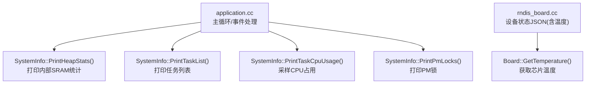
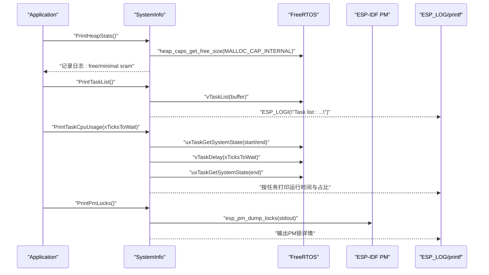
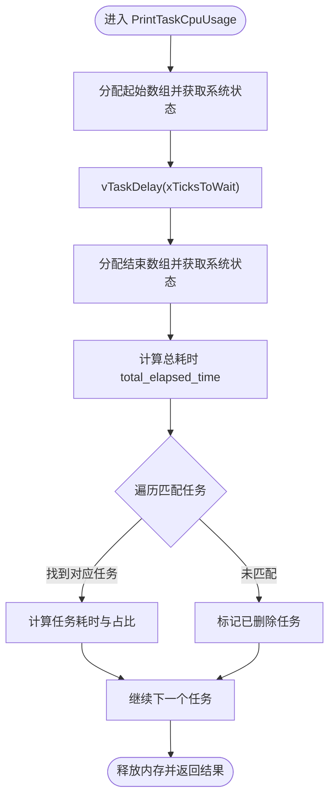
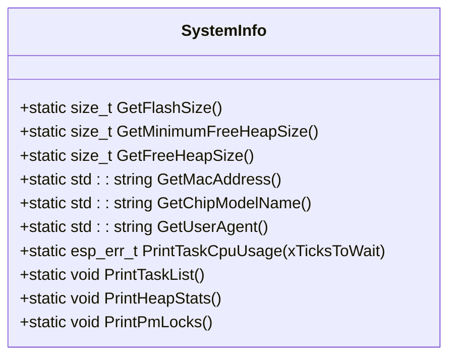
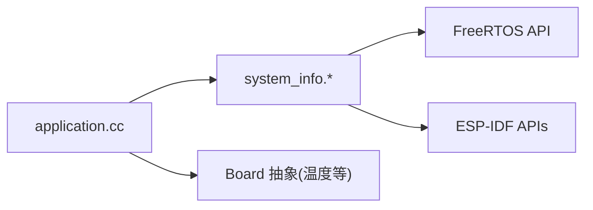

# 系统资源监控

<cite>
**本文引用的文件**   
- [main/system_info.h](file://main/system_info.h)
- [main/system_info.cc](file://main/system_info.cc)
- [main/application.cc](file://main/application.cc)
- [main/boards/common/rndis_board.cc](file://main/boards/common/rndis_board.cc)
</cite>

## 目录
1. [简介](#简介)
2. [项目结构](#项目结构)
3. [核心组件](#核心组件)
4. [架构总览](#架构总览)
5. [详细组件分析](#详细组件分析)
6. [依赖关系分析](#依赖关系分析)
7. [性能考量](#性能考量)
8. [故障排查指南](#故障排查指南)
9. [结论](#结论)
10. [附录](#附录)

## 简介
本指南面向在 ESP32 平台上进行系统资源实时监控的开发者，围绕 CPU 利用率、内存占用、电源管理等关键指标，提供可操作的采集与分析方法。重点说明以下能力：
- 使用 PrintTaskList() 与 PrintTaskCpuUsage() 监控任务状态与 CPU 占用
- 使用 PrintHeapStats() 了解内部 SRAM 使用情况（并给出扩展至 PSRAM 的建议）
- 使用 PrintPmLocks() 查看电源管理锁与功耗模式切换情况
- 设计系统健康检查方案：阈值设置、异常告警、性能基线建立
- 构建监控仪表板与数据分析技巧

## 项目结构
本项目将系统信息收集封装为 SystemInfo 类，并在应用主循环中周期性调用以输出日志。相关实现位于 main/system_info.*；应用层定时触发位于 main/application.cc；部分平台能力（如温度上报）通过 Board 接口暴露。

图表来源
- [main/application.cc:250-310](file://main/application.cc#L250-L310)
- [main/system_info.cc:144-158](file://main/system_info.cc#L144-L158)
- [main/boards/common/rndis_board.cc:231-247](file://main/boards/common/rndis_board.cc#L231-L247)

章节来源
- [main/system_info.h:9-21](file://main/system_info.h#L9-L21)
- [main/system_info.cc:1-158](file://main/system_info.cc#L1-L158)
- [main/application.cc:250-310](file://main/application.cc#L250-L310)
- [main/boards/common/rndis_board.cc:231-247](file://main/boards/common/rndis_board.cc#L231-L247)

## 核心组件
- SystemInfo 类
  - 提供静态方法用于获取 Flash 大小、MAC 地址、芯片型号、用户代理等
  - 提供系统监控方法：
    - PrintTaskCpuUsage(TickType_t xTicksToWait)：基于 FreeRTOS 运行时间计数器计算任务 CPU 占用百分比
    - PrintTaskList()：汇总当前任务名、状态、优先级、剩余栈空间等
    - PrintHeapStats()：打印内部 SRAM 空闲与历史最小空闲
    - PrintPmLocks()：打印 PM 锁状态，辅助诊断功耗模式切换问题
- Application 主循环
  - 每 10 秒调用一次 PrintHeapStats()，便于观察内存趋势
  - 激活完成后再次打印内存统计，作为启动阶段参考点

章节来源
- [main/system_info.h:9-21](file://main/system_info.h#L9-L21)
- [main/system_info.cc:59-158](file://main/system_info.cc#L59-L158)
- [main/application.cc:250-310](file://main/application.cc#L250-L310)

## 架构总览
下图展示了从应用层到系统内核与外设的监控数据流：应用定时触发 -> SystemInfo 调用 FreeRTOS/ESP-IDF API -> 输出日志或返回错误码。

图表来源
- [main/system_info.cc:59-158](file://main/system_info.cc#L59-L158)
- [main/application.cc:250-310](file://main/application.cc#L250-L310)

## 详细组件分析

### 任务与 CPU 占用监控
- PrintTaskList()
  - 作用：一次性列出所有任务名称、状态、优先级、剩余栈等
  - 适用场景：快速定位阻塞任务、僵尸任务、栈溢出风险
  - 输出位置：ESP_LOGI 日志
- PrintTaskCpuUsage(xTicksToWait)
  - 原理：两次调用 uxTaskGetSystemState 获取任务运行时间计数差值，结合总耗时与核心数计算各任务 CPU 占比
  - 返回值：成功返回 OK，失败返回相应错误码（如内存不足、无效尺寸/状态）
  - 注意事项：
    - 需要启用 FreeRTOS 运行时间统计功能
    - 采样间隔 xTicksToWait 需合理设置，避免过长导致抖动或过短导致开销增大
    - 多核环境下会考虑 CONFIG_FREERTOS_NUMBER_OF_CORES 归一化

图表来源
- [main/system_info.cc:59-142](file://main/system_info.cc#L59-L142)

章节来源
- [main/system_info.h:17-18](file://main/system_info.h#L17-L18)
- [main/system_info.cc:59-148](file://main/system_info.cc#L59-L148)

### 内存占用监控（内部 SRAM 与外部 PSRAM）
- PrintHeapStats()
  - 当前实现：仅查询内部 SRAM 的空闲与历史最小空闲
  - 建议扩展：增加对 PSRAM 的统计（MALLOC_CAP_SPIRAM），以便掌握大对象与视频/音频缓冲的内存分布
- 应用层集成
  - 主循环每 10 秒输出一次内存统计，便于观察长期趋势
  - 激活完成后再次输出，作为“冷启动后稳定态”的基准

图表来源
- [main/system_info.h:9-21](file://main/system_info.h#L9-L21)

章节来源
- [main/system_info.cc:150-154](file://main/system_info.cc#L150-L154)
- [main/application.cc:250-310](file://main/application.cc#L250-L310)

### 电源管理与功耗模式监控
- PrintPmLocks()
  - 作用：打印 PM 锁状态，帮助判断是否存在阻止降频/睡眠的锁
  - 典型用法：在怀疑功耗异常时调用，观察是否有长时间持有的锁
- 与功耗相关的其他模块
  - SleepTimer：支持轻睡/深睡回调，可用于在休眠前后记录指标
  - PowerController：统一电源状态机（活跃/轻睡/深睡/关机），可配合监控输出

章节来源
- [main/system_info.cc:156-158](file://main/system_info.cc#L156-L158)
- [main/boards/common/sleep_timer.h:8-32](file://main/boards/common/sleep_timer.h#L8-L32)
- [main/boards/jiuchuan-s3/power_controller.h:15-58](file://main/boards/jiuchuan-s3/power_controller.h#L15-L58)

### 磁盘 IO 与文件系统监控
- 现状：仓库中未发现直接针对 SPIFFS/LittleFS 的 IO 统计封装
- 建议方案：
  - 使用 ESP-IDF 提供的分区/文件系统 API 定期查询可用空间、擦写次数等
  - 在应用层维护读写延迟直方图，识别慢路径
  - 将结果纳入统一监控日志或 JSON 状态接口（可复用 rndis_board.cc 中的 JSON 组装方式）

章节来源
- [main/boards/common/rndis_board.cc:231-247](file://main/boards/common/rndis_board.cc#L231-L247)

### 系统健康检查与告警
- 指标与阈值（示例）
  - 内部 SRAM 空闲低于阈值（如 10% 总量）持续 N 次采样 -> 告警
  - 某任务 CPU 占比超过阈值（如 >80%）持续 M 秒 -> 告警
  - PM 锁持有时间过长 -> 告警
  - 芯片温度高于阈值 -> 告警（可通过 Board::GetTemperature 获取）
- 告警机制
  - 本地：ESP_LOGE/Alert 接口显示提示音/表情
  - 远端：通过现有消息通道发送自定义消息（参考 application.cc 的消息分发逻辑）
- 性能基线
  - 在典型负载下采集一段时间内的 CPU/内存/温度曲线，形成基线
  - 上线后对比基线，偏差过大即触发预警

章节来源
- [main/application.cc:574-597](file://main/application.cc#L574-L597)
- [main/boards/common/rndis_board.cc:231-247](file://main/boards/common/rndis_board.cc#L231-L247)

## 依赖关系分析
- SystemInfo 依赖
  - FreeRTOS：任务状态与运行时间统计
  - ESP-IDF：PM、Flash、MAC、系统 API
- 应用层耦合
  - Application 在主循环中周期调用 SystemInfo 的统计函数
  - 平台差异通过 Board 抽象（如温度读取）解耦

图表来源
- [main/system_info.cc:1-158](file://main/system_info.cc#L1-L158)
- [main/application.cc:250-310](file://main/application.cc#L250-L310)

章节来源
- [main/system_info.cc:1-158](file://main/system_info.cc#L1-L158)
- [main/application.cc:250-310](file://main/application.cc#L250-L310)

## 性能考量
- 采样频率
  - 内存统计每 10 秒一次较为合适，避免频繁 I/O 与日志开销
  - CPU 占用采样间隔建议 1~5 秒，兼顾精度与开销
- 日志量控制
  - 生产环境建议降低日志级别或按需开关监控输出
- 内存分配
  - PrintTaskCpuUsage 会在采样前后分配临时数组，需确保堆充足
- 多核影响
  - 多核情况下 CPU 占比计算已考虑核心数，但仍需注意任务迁移带来的波动

[本节为通用指导，不直接分析具体文件]

## 故障排查指南
- 内存泄漏/碎片
  - 关注最小空闲堆是否持续下降
  - 若频繁出现分配失败，优先检查大对象（图像/音频）是否使用了合适的内存域（SPIRAM）
- 任务阻塞/死锁
  - 使用 PrintTaskList() 查看任务状态是否为阻塞态且栈剩余过小
  - 使用 PrintTaskCpuUsage() 定位高占用任务
- 功耗异常
  - 使用 PrintPmLocks() 检查是否存在长持锁
  - 结合 SleepTimer 回调在休眠前后记录指标，确认休眠是否生效
- 温度过高
  - 通过 Board::GetTemperature 获取温度，必要时调整工作模式或散热

章节来源
- [main/system_info.cc:144-158](file://main/system_info.cc#L144-L158)
- [main/boards/common/rndis_board.cc:231-247](file://main/boards/common/rndis_board.cc#L231-L247)

## 结论
通过 SystemInfo 提供的任务、内存、电源管理监控能力，结合应用层的定时触发与告警机制，可在 ESP32 设备上构建轻量而有效的系统健康监控体系。建议在开发期完善 PSRAM 统计、磁盘 IO 指标与可视化仪表板，在生产期建立性能基线与阈值策略，持续提升稳定性与能效。

[本节为总结性内容，不直接分析具体文件]

## 附录

### 常用监控命令与调用位置
- 打印任务列表
  - 调用：SystemInfo::PrintTaskList()
  - 位置：main/system_info.cc
- 打印任务 CPU 占用
  - 调用：SystemInfo::PrintTaskCpuUsage(xTicksToWait)
  - 位置：main/system_info.cc
- 打印内部 SRAM 统计
  - 调用：SystemInfo::PrintHeapStats()
  - 位置：main/system_info.cc
- 打印 PM 锁
  - 调用：SystemInfo::PrintPmLocks()
  - 位置：main/system_info.cc
- 应用层定时触发
  - 位置：main/application.cc（每 10 秒输出内存统计）

章节来源
- [main/system_info.h:17-20](file://main/system_info.h#L17-L20)
- [main/system_info.cc:144-158](file://main/system_info.cc#L144-L158)
- [main/application.cc:250-310](file://main/application.cc#L250-L310)

### 仪表板设计与数据分析技巧
- 指标面板
  - CPU：各任务占比折线图、峰值柱状图
  - 内存：内部 SRAM 空闲、PSRAM 空闲（建议扩展）、历史最小空闲
  - 电源：PM 锁数量/持有时长、进入轻睡/深睡次数
  - 温度：芯片温度曲线
- 数据采集
  - 将 SystemInfo 的输出解析为结构化数据（JSON），复用 rndis_board.cc 的 JSON 组装思路
- 分析与告警
  - 滑动窗口统计均值/方差，检测异常突刺
  - 设定多级阈值（警告/严重），结合本地 Alert 与远程消息通道推送

章节来源
- [main/boards/common/rndis_board.cc:231-247](file://main/boards/common/rndis_board.cc#L231-L247)