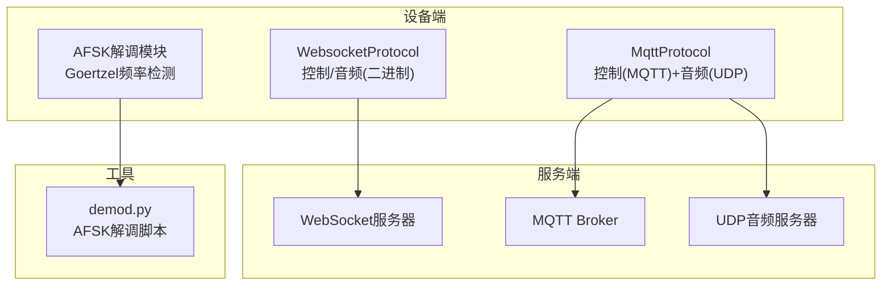
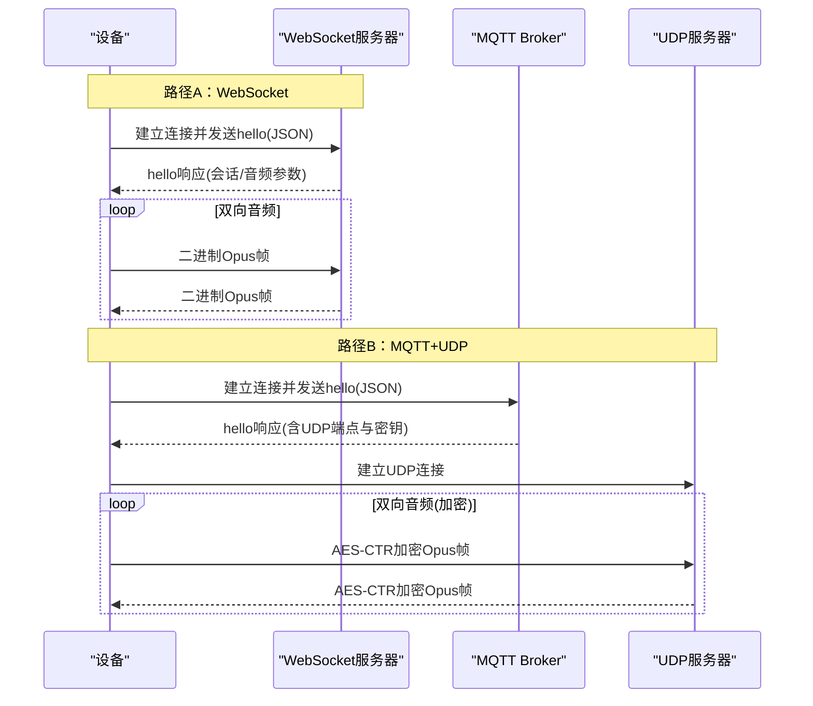
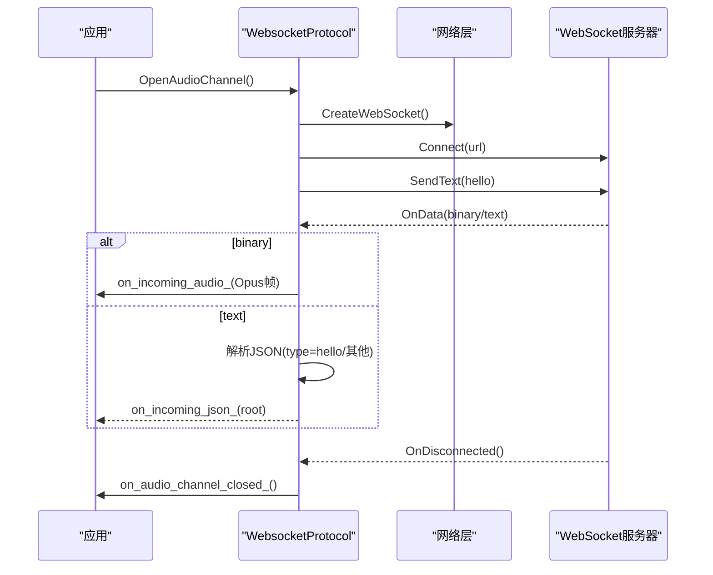
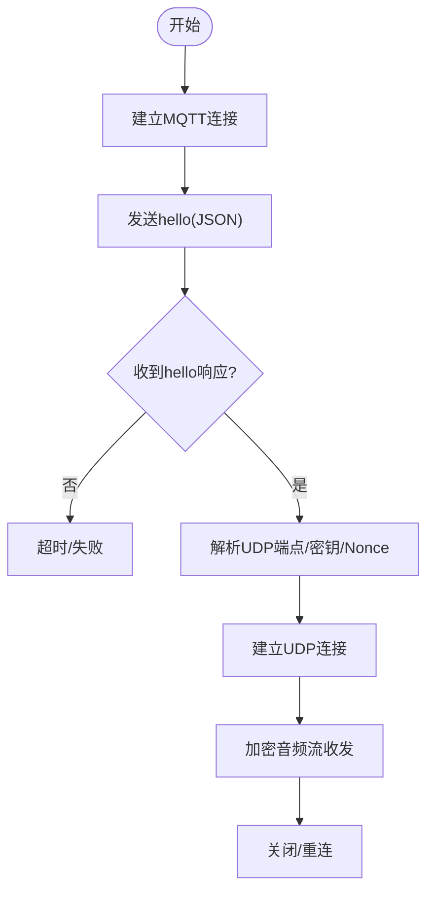
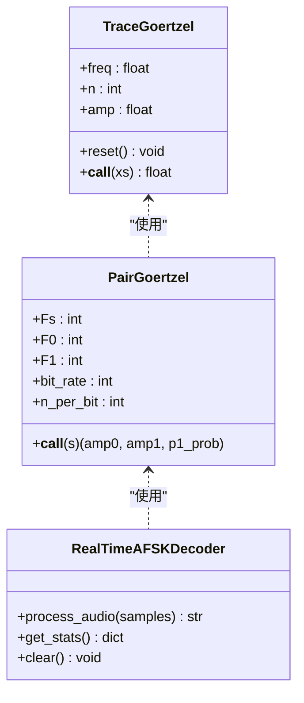
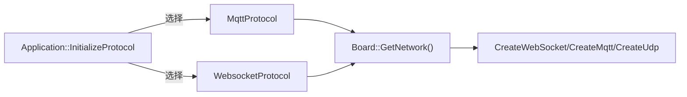

# 网络性能分析

<cite>
**本文引用的文件列表**
- [demod.py](file://scripts/acoustic_check/demod.py)
- [afsk_demod.h](file://main/boards/common/afsk_demod.h)
- [afsk_demod.cc](file://main/boards/common/afsk_demod.cc)
- [websocket_protocol.cc](file://main/protocols/websocket_protocol.cc)
- [mqtt_protocol.cc](file://main/protocols/mqtt_protocol.cc)
- [websocket.md](file://docs/websocket.md)
- [mqtt-udp.md](file://docs/mqtt-udp.md)
- [wifi_board.cc](file://main/boards/common/wifi_board.cc)
- [ml307_board.cc](file://main/boards/common/ml307_board.cc)
- [nt26_board.cc](file://main/boards/common/nt26_board.cc)
- [application.cc](file://main/application.cc)
</cite>

## 目录
1. [简介](#简介)
2. [项目结构](#项目结构)
3. [核心组件](#核心组件)
4. [架构总览](#架构总览)
5. [详细组件分析](#详细组件分析)
6. [依赖关系分析](#依赖关系分析)
7. [性能考量](#性能考量)
8. [故障排查指南](#故障排查指南)
9. [结论](#结论)
10. [附录](#附录)

## 简介
本指南面向需要在嵌入式设备与服务器之间进行网络性能分析与优化的开发者，覆盖以下主题：
- 网络数据包捕获与分析方法（WiFi连接质量、延迟、吞吐量）
- 音频数据流分析与信号解调（Python脚本与C++实现）
- 协议层性能监控（WebSocket、MQTT+UDP）
- 网络优化最佳实践（连接池、压缩、重连机制）
- 测试工具与调试技巧

## 项目结构
本项目在“协议实现 + 文档说明 + 声学检测脚本”三个层面提供网络与音频链路能力：
- 协议实现：WebSocket 与 MQTT+UDP 双通道方案，分别用于控制面与实时音频面
- 文档说明：对握手流程、消息类型、安全与性能要点进行了系统化描述
- 声学检测脚本：基于Goertzel算法的AFSK解调，可用于音频链路的连通性与误码率评估

图表来源
- [websocket_protocol.cc:1-255](file://main/protocols/websocket_protocol.cc#L1-L255)
- [mqtt_protocol.cc:1-390](file://main/protocols/mqtt_protocol.cc#L1-L390)
- [afsk_demod.h:1-177](file://main/boards/common/afsk_demod.h#L1-L177)
- [afsk_demod.cc:1-376](file://main/boards/common/afsk_demod.cc#L1-L376)
- [demod.py:1-281](file://scripts/acoustic_check/demod.py#L1-L281)

章节来源
- [websocket.md:1-531](file://docs/websocket.md#L1-L531)
- [mqtt-udp.md:1-410](file://docs/mqtt-udp.md#L1-L410)

## 核心组件
- WebSocket协议栈：负责建立长连接、握手协商、双向Opus音频流传输与JSON控制消息分发
- MQTT+UDP混合协议：控制面通过MQTT，实时音频面通过AES-CTR加密的UDP；具备序列号与超时保护
- AFSK解调模块：基于Goertzel的双频检测，支持从音频中恢复数字比特流，便于端到端链路诊断
- 网络质量上报：不同板级实现将RSSI/CSQ映射为强/中/弱等级，辅助定位无线侧问题

章节来源
- [websocket_protocol.cc:23-201](file://main/protocols/websocket_protocol.cc#L23-L201)
- [mqtt_protocol.cc:55-390](file://main/protocols/mqtt_protocol.cc#L55-L390)
- [afsk_demod.h:12-177](file://main/boards/common/afsk_demod.h#L12-L177)
- [afsk_demod.cc:16-108](file://main/boards/common/afsk_demod.cc#L16-L108)
- [wifi_board.cc:339-357](file://main/boards/common/wifi_board.cc#L339-L357)
- [ml307_board.cc:256-270](file://main/boards/common/ml307_board.cc#L256-L270)
- [nt26_board.cc:257-271](file://main/boards/common/nt26_board.cc#L257-L271)

## 架构总览
下图展示了两种典型的数据路径：纯WebSocket与MQTT+UDP混合模式。

图表来源
- [websocket.md:1-531](file://docs/websocket.md#L1-L531)
- [mqtt-udp.md:23-58](file://docs/mqtt-udp.md#L23-L58)

## 详细组件分析

### WebSocket协议性能监控
- 连接建立与握手：客户端设置鉴权与协议版本头，发送hello后等待服务器hello，超时则报错
- 音频通道：二进制Opus帧直传，支持多版本二进制封装（v1/v2/v3），便于携带时间戳等元信息
- 状态与错误：断开回调触发关闭流程；未收到hello或连接失败会设置错误并上报

图表来源
- [websocket_protocol.cc:83-201](file://main/protocols/websocket_protocol.cc#L83-L201)
- [websocket.md:1-531](file://docs/websocket.md#L1-L531)

章节来源
- [websocket_protocol.cc:15-201](file://main/protocols/websocket_protocol.cc#L15-L201)
- [websocket.md:83-127](file://docs/websocket.md#L83-L127)

### MQTT+UDP混合协议性能监控
- 控制面：MQTT承载JSON控制消息，支持自动重连与keepalive
- 数据面：UDP承载AES-CTR加密的Opus帧，包含序列号与时间戳，具备防重放与乱序容忍
- 握手：通过MQTT hello交换UDP端点、密钥与nonce，随后建立UDP通道

图表来源
- [mqtt_protocol.cc:55-390](file://main/protocols/mqtt_protocol.cc#L55-L390)
- [mqtt-udp.md:23-58](file://docs/mqtt-udp.md#L23-L58)

章节来源
- [mqtt_protocol.cc:55-390](file://main/protocols/mqtt_protocol.cc#L55-L390)
- [mqtt-udp.md:297-316](file://docs/mqtt-udp.md#L297-L316)

### AFSK音频解调与链路诊断
- Python脚本demod.py：实现实时Goertzel双频检测与AFSK解码，输出比特概率与文本，适合离线回放与可视化分析
- C++实现afsk_demod.*：在设备上完成降采样、双频检测、状态机与校验，可提取WiFi凭证或作为链路质量探针

图表来源
- [demod.py:9-124](file://scripts/acoustic_check/demod.py#L9-L124)
- [demod.py:126-281](file://scripts/acoustic_check/demod.py#L126-L281)

章节来源
- [demod.py:1-281](file://scripts/acoustic_check/demod.py#L1-L281)
- [afsk_demod.h:29-99](file://main/boards/common/afsk_demod.h#L29-L99)
- [afsk_demod.cc:119-223](file://main/boards/common/afsk_demod.cc#L119-L223)

### WiFi/蜂窝网络质量上报
- WiFi：根据RSSI划分强/中/弱等级，便于快速判断无线环境
- 蜂窝（ML307/NT26）：根据CSQ区间映射信号强度，辅助定位弱网场景

章节来源
- [wifi_board.cc:339-357](file://main/boards/common/wifi_board.cc#L339-L357)
- [ml307_board.cc:256-270](file://main/boards/common/ml307_board.cc#L256-L270)
- [nt26_board.cc:257-271](file://main/boards/common/nt26_board.cc#L257-L271)

## 依赖关系分析
- 应用层选择协议：根据OTA配置决定实例化MqttProtocol或WebsocketProtocol
- 协议间复用：均依赖Board网络抽象创建WebSocket/MQTT/UDP对象
- 文档与实现对齐：文档描述了握手、消息类型与安全特性，代码实现了相应逻辑

图表来源
- [application.cc:473-497](file://main/application.cc#L473-L497)
- [websocket_protocol.cc:94-110](file://main/protocols/websocket_protocol.cc#L94-L110)
- [mqtt_protocol.cc:81-83](file://main/protocols/mqtt_protocol.cc#L81-L83)

章节来源
- [application.cc:473-497](file://main/application.cc#L473-L497)

## 性能考量
- 连接管理
  - WebSocket：建议服务端维护连接池与会话上下文，避免频繁握手开销
  - MQTT：合理设置Keep Alive与重连退避，避免风暴式重连
- 数据面优化
  - Opus帧时长：默认60ms，可在低时延与编码效率间权衡
  - UDP：复用连接、控制包大小、利用序列号连续性检查减少丢包影响
- 安全与CPU
  - AES-CTR加解密开销需结合CPU能力评估，必要时调整帧率或采样率
- 监控指标
  - 连接成功率、首包时延、端到端时延、UDP丢包率、解密失败率、RSSI/CSQ分布

[本节为通用指导，不直接分析具体文件]

## 故障排查指南
- WebSocket常见问题
  - 握手失败：检查Authorization、Protocol-Version、URL可达性
  - 无hello响应：确认服务端hello格式与transport字段匹配
  - 断线重连：观察OnDisconnected回调是否被触发，上层是否执行关闭流程
- MQTT+UDP常见问题
  - 无法建立UDP：核对hello响应中的server/port/key/nonce是否正确下发
  - 解密失败：检查AES-CTR初始化与nonce/counter构造
  - 序列异常：关注日志中的旧序列/错序警告，定位网络抖动或重排
- 音频链路诊断
  - 使用demod.py回放录音，观察p1_prob曲线与起始/结束帧匹配情况
  - 对比设备端AFSK统计信息（窗口大小、阈值、比特率）以定位参数失配

章节来源
- [websocket_protocol.cc:168-201](file://main/protocols/websocket_protocol.cc#L168-L201)
- [mqtt_protocol.cc:243-287](file://main/protocols/mqtt_protocol.cc#L243-L287)
- [demod.py:179-224](file://scripts/acoustic_check/demod.py#L179-L224)

## 结论
本项目提供了两套成熟的音视频通信路径：WebSocket与MQTT+UDP混合模式。前者部署简单、防火墙友好；后者在低时延与安全性方面更具优势。配合AFSK解调工具与网络质量上报，可形成从物理层到应用层的完整诊断闭环。建议在真实网络环境中持续采集关键指标，并结合重连策略与参数调优，达成稳定、低时延的语音交互体验。

[本节为总结性内容，不直接分析具体文件]

## 附录

### 实用测试与调试清单
- 抓包与回放
  - 使用Wireshark抓取WebSocket/UDP流量，导出PCAP后用demod.py回放分析
- 指标采集
  - 记录握手RTT、首包到达时间、端到端时延、UDP丢包率、解密失败次数
- 参数调优
  - 调整Opus帧时长、采样率、Goertzel窗口大小与判决阈值，平衡时延与鲁棒性
- 压力与稳定性
  - 长时间运行压测，观察内存占用、CPU峰值与重连次数

[本节为通用指导，不直接分析具体文件]