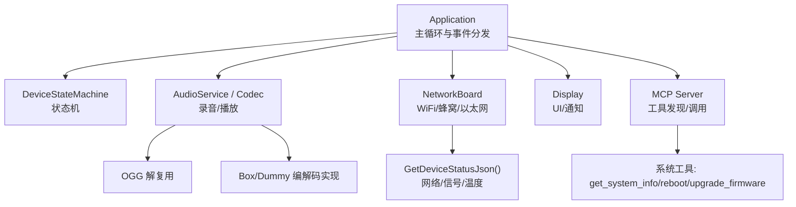
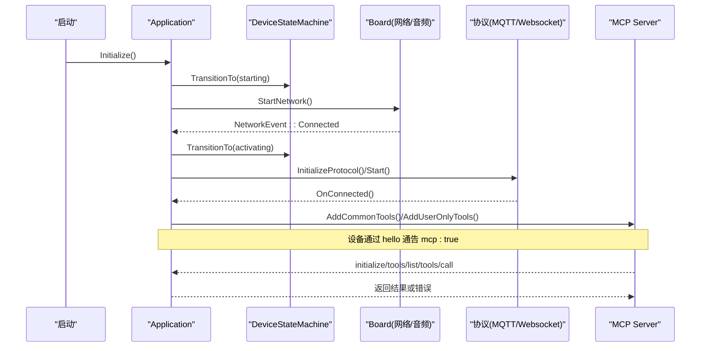
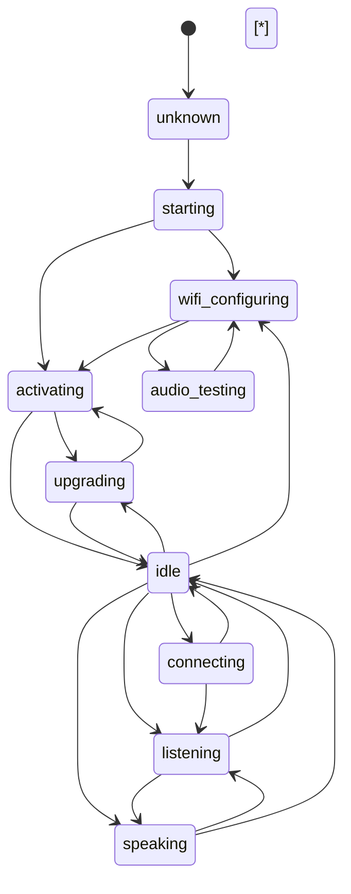
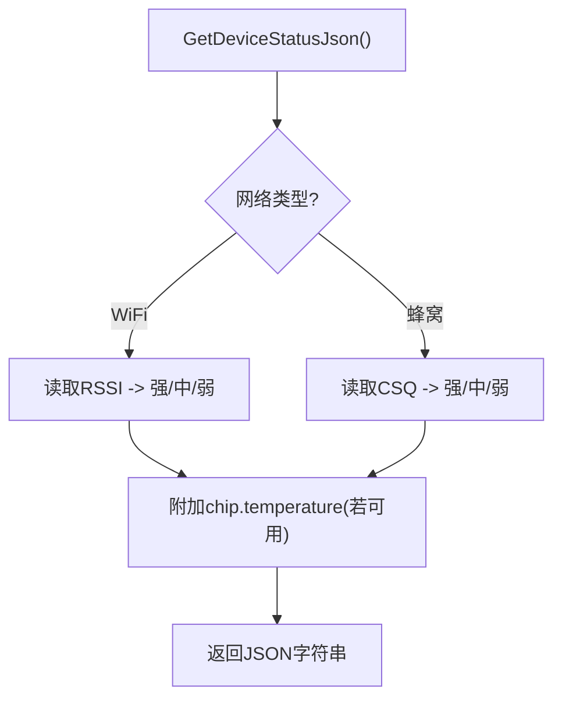
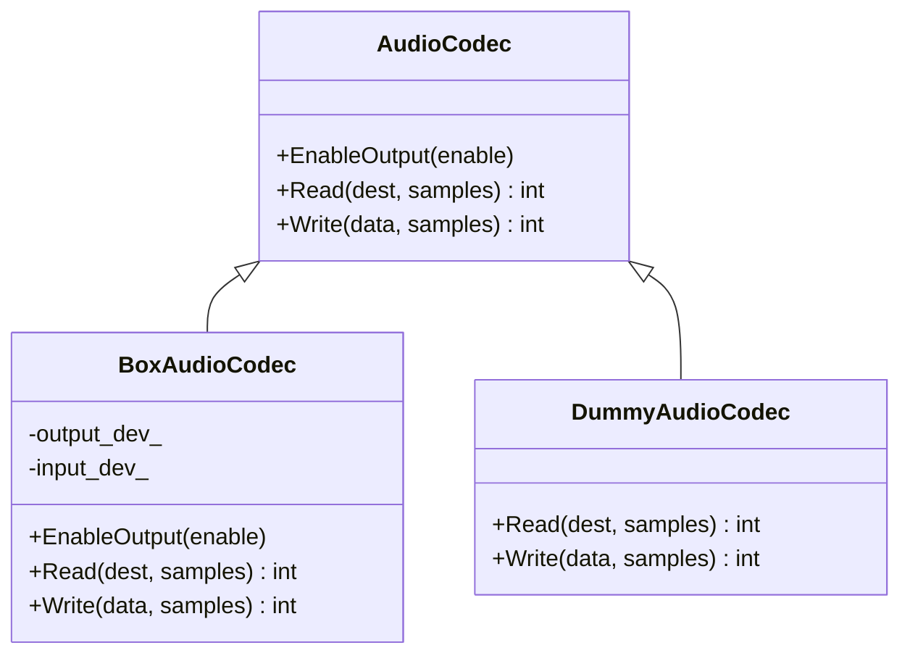
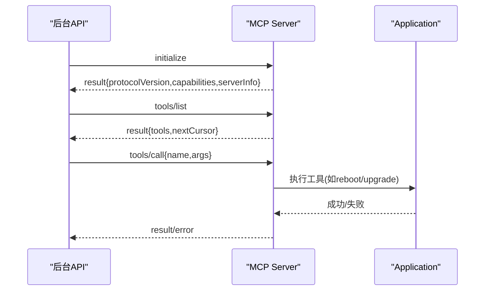
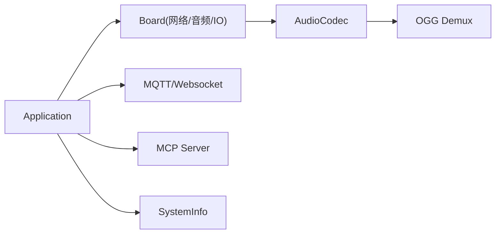

# 故障排除指南

<cite>
**本文引用的文件**   
- [README.md](file://README.md)
- [application.cc](file://main/application.cc)
- [application.h](file://main/application.h)
- [device_state_machine.cc](file://main/device_state_machine.cc)
- [device_state_machine.h](file://main/device_state_machine.h)
- [system_info.cc](file://main/system_info.cc)
- [system_info.h](file://main/system_info.h)
- [mcp_server.cc](file://main/mcp_server.cc)
- [mcp_server.h](file://main/mcp_server.h)
- [wifi_board.cc](file://main/boards/common/wifi_board.cc)
- [ml307_board.cc](file://main/boards/common/ml307_board.cc)
- [nt26_board.cc](file://main/boards/common/nt26_board.cc)
- [esp_video.cc](file://main/boards/common/esp_video.cc)
- [ogg_demuxer.cc](file://main/audio/demuxer/ogg_demuxer.cc)
- [box_audio_codec.cc](file://main/audio/codecs/box_audio_codec.cc)
- [dummy_audio_codec.cc](file://main/audio/codecs/dummy_audio_codec.cc)
- [esp_spot_board.cc](file://main/boards/esp-spot/esp_spot_board.cc)
- [esp_vocat.cc](file://main/boards/esp-vocat/esp_vocat.cc)
- [atk_dnesp32s3_box0.cc](file://main/boards/atk-dnesp32s3-box0/atk_dnesp32s3_box0.cc)
- [power_manager.h (jiuchuan-s3)](file://main/boards/jiuchuan-s3/power_manager.h)
- [power_manager.h (electron-bot)](file://main/boards/electron-bot/power_manager.h)
</cite>

## 目录
1. [简介](#简介)
2. [项目结构](#项目结构)
3. [核心组件](#核心组件)
4. [架构总览](#架构总览)
5. [详细组件分析](#详细组件分析)
6. [依赖关系分析](#依赖关系分析)
7. [性能与稳定性考量](#性能与稳定性考量)
8. [故障排除指南](#故障排除指南)
9. [结论](#结论)
10. [附录：常用诊断命令与工具](#附录常用诊断命令与工具)

## 简介
本指南面向设备端开发者与维护人员，聚焦于常见问题的快速定位与修复，覆盖启动失败、网络连接异常、音频异常、内存溢出等典型场景；并提供系统状态检查方法（设备状态机、错误码解读、日志解析）、硬件相关问题排查（引脚配置、外设驱动、电源管理）以及软件调试技巧（死锁检测、竞态条件、资源竞争）。同时给出社区支持渠道。

## 项目结构
本项目基于 ESP-IDF，应用层以 Application 为核心，协调显示、音频、网络协议栈与 MCP 服务；设备状态由 DeviceStateMachine 统一管理；SystemInfo 提供系统级诊断能力；各 Board 实现具体硬件差异（WiFi/蜂窝、音频编解码器、GPIO/I2C/SPI 初始化等）。

图表来源
- [application.cc:1-120](file://main/application.cc#L1-L120)
- [device_state_machine.cc:1-162](file://main/device_state_machine.cc#L1-L162)
- [mcp_server.cc:120-170](file://main/mcp_server.cc#L120-L170)
- [wifi_board.cc:339-357](file://main/boards/common/wifi_board.cc#L339-L357)
- [ml307_board.cc:256-270](file://main/boards/common/ml307_board.cc#L256-L270)
- [esp_video.cc:409-436](file://main/boards/common/esp_video.cc#L409-L436)
- [ogg_demuxer.cc:46-75](file://main/audio/demuxer/ogg_demuxer.cc#L46-L75)
- [box_audio_codec.cc:216-247](file://main/audio/codecs/box_audio_codec.cc#L216-L247)

章节来源
- [README.md:1-173](file://README.md#L1-L173)
- [application.cc:1-120](file://main/application.cc#L1-L120)
- [device_state_machine.cc:1-162](file://main/device_state_machine.cc#L1-L162)

## 核心组件
- Application：负责初始化显示、音频、网络回调，维护主事件循环，处理连接、激活、TTS/STT/LLM/MCP 消息，调度任务与状态切换。
- DeviceStateMachine：严格的状态转换规则与监听机制，用于避免非法状态跳转并统一日志输出。
- SystemInfo：堆内存、任务列表/CPU 使用率、PM 锁等诊断接口。
- MCP Server：注册系统工具（获取系统信息、重启、升级固件），解析 JSON-RPC 请求并路由到具体实现。
- Board 抽象：不同板卡实现网络、音频、GPIO/I2C/SPI 初始化与设备状态 JSON 生成。

章节来源
- [application.h:46-89](file://main/application.h#L46-L89)
- [device_state_machine.h:1-83](file://main/device_state_machine.h#L1-L83)
- [system_info.h:1-23](file://main/system_info.h#L1-L23)
- [mcp_server.h:81-111](file://main/mcp_server.h#L81-L111)

## 架构总览
下图展示从启动到正常交互的关键流程，包括网络就绪后的激活、协议初始化、MCP 会话建立与工具调用。

图表来源
- [application.cc:61-163](file://main/application.cc#L61-L163)
- [application.cc:473-610](file://main/application.cc#L473-L610)
- [mcp_server.cc:360-397](file://main/mcp_server.cc#L360-L397)

## 详细组件分析

### 设备状态机与状态流转
- 关键状态：unknown、starting、wifi_configuring、idle、connecting、listening、speaking、upgrading、activating、audio_testing、fatal_error。
- 合法转换：例如 starting -> wifi_configuring/activating；idle -> connecting/listening/speaking/upgrading；connecting -> idle/listening；speaking -> listening/idle；audio_testing <-> wifi_configuring；fatal_error 不可退出。
- 变更通知：TransitionTo 成功后记录日志并通过监听器回调，便于 UI/其他模块响应。

图表来源
- [device_state_machine.cc:34-102](file://main/device_state_machine.cc#L34-L102)

章节来源
- [device_state_machine.cc:1-162](file://main/device_state_machine.cc#L1-L162)
- [device_state_machine.h:1-83](file://main/device_state_machine.h#L1-L83)

### 网络与设备状态 JSON
- WiFi 板卡：在 GetDeviceStatusJson 中填充 network.signal（strong/medium/weak）与 chip.temperature。
- 蜂窝板卡（ML307/NT26）：根据 CSQ 区间映射信号强度，并输出 network 对象。
- 这些 JSON 可被 MCP 工具 self.get_device_status 或上位机读取，用于远程诊断。

图表来源
- [wifi_board.cc:339-357](file://main/boards/common/wifi_board.cc#L339-L357)
- [ml307_board.cc:256-270](file://main/boards/common/ml307_board.cc#L256-L270)
- [nt26_board.cc:257-271](file://main/boards/common/nt26_board.cc#L257-L271)

章节来源
- [wifi_board.cc:339-357](file://main/boards/common/wifi_board.cc#L339-L357)
- [ml307_board.cc:256-270](file://main/boards/common/ml307_board.cc#L256-L270)
- [nt26_board.cc:257-271](file://main/boards/common/nt26_board.cc#L257-L271)

### 音频子系统与异常点
- 编解码器：BoxAudioCodec 封装 I2S/Codec 的打开、音量设置、读写；DummyAudioCodec 为无硬件占位实现。
- OGG 解复用：按 OggS 标志同步帧头，滑动匹配，避免粘包/丢包导致解析失败。
- 常见问题：采样率不匹配导致失真、PA 未开启无声、I2C 探测失败、DMA/队列满导致丢帧。

图表来源
- [box_audio_codec.cc:216-247](file://main/audio/codecs/box_audio_codec.cc#L216-L247)
- [dummy_audio_codec.cc:1-20](file://main/audio/codecs/dummy_audio_codec.cc#L1-L20)

章节来源
- [box_audio_codec.cc:216-247](file://main/audio/codecs/box_audio_codec.cc#L216-L247)
- [dummy_audio_codec.cc:1-20](file://main/audio/codecs/dummy_audio_codec.cc#L1-L20)
- [ogg_demuxer.cc:46-75](file://main/audio/demuxer/ogg_demuxer.cc#L46-L75)

### MCP 工具与远程诊断
- 系统工具：self.get_system_info、self.reboot、self.upgrade_firmware。
- 参数校验：initialize/tools/list/tools/call 的 JSON 字段校验，缺失 method/params/id 将记录错误并忽略。
- 错误码：遵循 JSON-RPC 约定，如 Method not found(-32601)。

图表来源
- [mcp_server.cc:129-161](file://main/mcp_server.cc#L129-L161)
- [mcp_server.cc:360-397](file://main/mcp_server.cc#L360-L397)

章节来源
- [mcp_server.cc:129-161](file://main/mcp_server.cc#L129-L161)
- [mcp_server.cc:360-397](file://main/mcp_server.cc#L360-L397)
- [mcp_server.h:81-111](file://main/mcp_server.h#L81-L111)

## 依赖关系分析
- Application 依赖 Board、Display、AudioService、协议栈、MCP Server、SystemInfo。
- Board 抽象下包含 WiFi/蜂窝/以太网实现，各自提供网络事件与设备状态 JSON。
- 音频链路：AudioService -> Codec -> I2S/Codec 驱动；OGG 解复用位于数据路径。
- MCP Server 作为工具总线，向上暴露给协议层，向下调用 Board/System 能力。

图表来源
- [application.cc:1-120](file://main/application.cc#L1-L120)
- [system_info.cc:1-159](file://main/system_info.cc#L1-L159)
- [mcp_server.cc:129-161](file://main/mcp_server.cc#L129-L161)

章节来源
- [application.cc:1-120](file://main/application.cc#L1-L120)
- [system_info.cc:1-159](file://main/system_info.cc#L1-L159)

## 性能与稳定性考量
- 任务与CPU占用：使用 PrintTaskCpuUsage 对比两个时间点的任务运行计数器，识别高占用任务。
- 堆内存：PrintHeapStats 输出当前空闲与历史最小空闲，辅助判断内存泄漏或峰值不足。
- PM 锁：PrintPmLocks 查看功耗管理锁持有情况，排查因锁导致的降频/唤醒问题。
- 视频帧分配：摄像头帧拷贝时若 SPIRAM 分配失败会回退并记录错误，需关注内存碎片与峰值。

章节来源
- [system_info.cc:59-158](file://main/system_info.cc#L59-L158)
- [esp_video.cc:409-436](file://main/boards/common/esp_video.cc#L409-L436)

## 故障排除指南

### 一、启动失败
症状
- 卡在 starting/wifi_configuring/activating，无法进入 idle。
- 屏幕无输出或反复重启。

排查步骤
- 检查状态机日志：确认是否出现非法状态转换或长时间停留在某状态。
- 验证网络回调：确保 Connected 事件触发后进入 activating，随后完成协议初始化。
- 检查显示与音频初始化顺序：Initialize 中先 SetupUI，再初始化音频服务。
- 查看 OTA/激活流程：CheckNewVersion/Activate 失败会重试并提示错误，必要时手动降级或跳过。

参考位置
- [application.cc:61-163](file://main/application.cc#L61-L163)
- [application.cc:261-338](file://main/application.cc#L261-L338)
- [device_state_machine.cc:34-102](file://main/device_state_machine.cc#L34-L102)

章节来源
- [application.cc:61-163](file://main/application.cc#L61-L163)
- [device_state_machine.cc:34-102](file://main/device_state_machine.cc#L34-L102)

### 二、网络连接问题（WiFi/蜂窝/以太网）
症状
- 无法连接 WiFi/蜂窝，或频繁断开。
- 信号弱导致 TTS/ASR 卡顿。

排查步骤
- 使用 GetDeviceStatusJson 获取 network.signal 与 chip.temperature，评估环境。
- 观察网络事件：Scanning/Connecting/Connected/Disconnected 及蜂窝特定 ModemError*。
- 蜂窝模组：检查 SIM 检测、注册拒绝、初始化超时等事件分支。
- 天线/供电：确认外部天线连接与供电稳定，避免高温导致射频性能下降。

参考位置
- [wifi_board.cc:339-357](file://main/boards/common/wifi_board.cc#L339-L357)
- [ml307_board.cc:256-270](file://main/boards/common/ml307_board.cc#L256-L270)
- [nt26_board.cc:257-271](file://main/boards/common/nt26_board.cc#L257-L271)
- [application.cc:102-156](file://main/application.cc#L102-L156)

章节来源
- [wifi_board.cc:339-357](file://main/boards/common/wifi_board.cc#L339-L357)
- [ml307_board.cc:256-270](file://main/boards/common/ml307_board.cc#L256-L270)
- [nt26_board.cc:257-271](file://main/boards/common/nt26_board.cc#L257-L271)
- [application.cc:102-156](file://main/application.cc#L102-L156)

### 三、音频异常（无声/杂音/断流）
症状
- 无声音或音量极低。
- 语音断续、爆音、采样率不一致导致的失真。
- 唤醒词无效或 VAD 无变化。

排查步骤
- 编解码器初始化：确认 PA 控制 GPIO 已置位，I2C 探测成功，I2S 引脚正确。
- 采样率匹配：协议侧 server_sample_rate 与 codec output_sample_rate 不一致会告警，必要时调整。
- 数据路径：检查 OGG 解复用是否找到 OggS 标志，避免粘包/错位。
- 占位实现：若使用 DummyAudioCodec，Read/Write 直接返回 0，不会真正发声。

参考位置
- [box_audio_codec.cc:216-247](file://main/audio/codecs/box_audio_codec.cc#L216-L247)
- [dummy_audio_codec.cc:1-20](file://main/audio/codecs/dummy_audio_codec.cc#L1-L20)
- [ogg_demuxer.cc:46-75](file://main/audio/demuxer/ogg_demuxer.cc#L46-L75)
- [application.cc:504-519](file://main/application.cc#L504-L519)

章节来源
- [box_audio_codec.cc:216-247](file://main/audio/codecs/box_audio_codec.cc#L216-L247)
- [dummy_audio_codec.cc:1-20](file://main/audio/codecs/dummy_audio_codec.cc#L1-L20)
- [ogg_demuxer.cc:46-75](file://main/audio/demuxer/ogg_demuxer.cc#L46-L75)
- [application.cc:504-519](file://main/application.cc#L504-L519)

### 四、内存溢出与资源耗尽
症状
- 运行时崩溃、看门狗复位、任务创建失败。
- 视频帧拷贝失败、SPIRAM 分配失败。

排查步骤
- 周期性打印堆统计：每 10 秒输出 free/min_free sram，观察趋势。
- 任务 CPU 使用率：对比前后两次系统状态，识别长期占用任务。
- 视频路径：当 heap_caps_malloc 失败时，记录需要分配的字节数并清理缓冲区。
- 降低并发/分辨率：减少帧尺寸或关闭旋转，降低峰值内存。

参考位置
- [application.cc:248-258](file://main/application.cc#L248-L258)
- [system_info.cc:150-158](file://main/system_info.cc#L150-L158)
- [esp_video.cc:409-436](file://main/boards/common/esp_video.cc#L409-L436)

章节来源
- [application.cc:248-258](file://main/application.cc#L248-L258)
- [system_info.cc:150-158](file://main/system_info.cc#L150-L158)
- [esp_video.cc:409-436](file://main/boards/common/esp_video.cc#L409-L436)

### 五、硬件相关问题（引脚配置、外设驱动、电源管理）
症状
- I2C 设备探测不到、LCD 无显示、按键无响应。
- 充电状态异常、电池电量不更新。

排查步骤
- GPIO 初始化：确认输出/输入模式、上下拉、中断配置正确，PA 控制电平符合预期。
- I2C 扫描：对常见地址进行探测，定位设备是否存在或地址冲突。
- 电源管理：检查充电引脚电平、ADC 采样周期与阈值，避免误判。
- 多版本 PCB：某些板卡会根据 I2C 探测结果动态切换引脚定义，需核对版本。

参考位置
- [esp_spot_board.cc:265-293](file://main/boards/esp-spot/esp_spot_board.cc#L265-L293)
- [esp_vocat.cc:682-711](file://main/boards/esp-vocat/esp_vocat.cc#L682-L711)
- [atk_dnesp32s3_box0.cc:43-73](file://main/boards/atk-dnesp32s3-box0/atk_dnesp32s3_box0.cc#L43-L73)
- [power_manager.h (jiuchuan-s3):41-79](file://main/boards/jiuchuan-s3/power_manager.h#L41-L79)
- [power_manager.h (electron-bot):109-128](file://main/boards/electron-bot/power_manager.h#L109-L128)

章节来源
- [esp_spot_board.cc:265-293](file://main/boards/esp-spot/esp_spot_board.cc#L265-L293)
- [esp_vocat.cc:682-711](file://main/boards/esp-vocat/esp_vocat.cc#L682-L711)
- [atk_dnesp32s3_box0.cc:43-73](file://main/boards/atk-dnesp32s3-box0/atk_dnesp32s3_box0.cc#L43-L73)
- [power_manager.h (jiuchuan-s3):41-79](file://main/boards/jiuchuan-s3/power_manager.h#L41-L79)
- [power_manager.h (electron-bot):109-128](file://main/boards/electron-bot/power_manager.h#L109-L128)

### 六、软件调试技巧（死锁、竞态、资源竞争）
建议方法
- 任务列表与 CPU 使用率：PrintTaskList/PrintTaskCpuUsage 帮助识别阻塞任务与热点。
- PM 锁分析：PrintPmLocks 查看功耗管理锁持有者，定位可能导致休眠/唤醒异常的代码。
- 事件组与调度：Application 主循环通过 EventGroup 分发事件，注意跨任务调度的临界区与互斥量使用。
- 日志分级：ESP_LOGE/W/I 配合 TAG 定位模块，结合 MCP 工具远程触发诊断。

参考位置
- [system_info.cc:59-158](file://main/system_info.cc#L59-L158)
- [application.cc:165-259](file://main/application.cc#L165-L259)

章节来源
- [system_info.cc:59-158](file://main/system_info.cc#L59-L158)
- [application.cc:165-259](file://main/application.cc#L165-L259)

### 七、错误码与日志解读
- JSON-RPC 错误：Method not found(-32601)、缺少 method/params/id 等，均会在 MCP 层记录并忽略。
- 网络错误：OnNetworkError 回调携带错误消息，主循环收到 MAIN_EVENT_ERROR 后弹出 Alert。
- 状态机警告：非法状态转换会输出 Warning 日志，便于回溯调用链。

参考位置
- [mcp_server.cc:360-397](file://main/mcp_server.cc#L360-L397)
- [application.cc:187-190](file://main/application.cc#L187-L190)
- [device_state_machine.cc:117-121](file://main/device_state_machine.cc#L117-L121)

章节来源
- [mcp_server.cc:360-397](file://main/mcp_server.cc#L360-L397)
- [application.cc:187-190](file://main/application.cc#L187-L190)
- [device_state_machine.cc:117-121](file://main/device_state_machine.cc#L117-L121)

### 八、社区支持与获取帮助
- 官方文档与协议说明：WebSocket/MQTT+UDP、MCP 协议与用法。
- 开源服务器与客户端：Python/Java/Golang 服务端，Android/Linux 客户端。
- 社区渠道：Discord、QQ 群、Issue 提交。

章节来源
- [README.md:122-173](file://README.md#L122-L173)

## 结论
通过状态机约束、系统信息诊断、MCP 工具与网络事件回调，可以快速定位并解决大多数启动、网络、音频与内存问题。建议在部署前完成硬件引脚与电源管理的自检，并在运行期定期采集堆与任务指标，持续优化稳定性。

## 附录：常用诊断命令与工具
- 获取系统信息：通过 MCP 工具 self.get_system_info 或 GetDeviceStatusJson。
- 重启设备：self.reboot。
- 升级固件：self.upgrade_firmware(url)。
- 打印堆与任务：SystemInfo::PrintHeapStats / PrintTaskCpuUsage / PrintTaskList。
- 查看 PM 锁：SystemInfo::PrintPmLocks。

章节来源
- [mcp_server.cc:129-161](file://main/mcp_server.cc#L129-L161)
- [system_info.cc:59-158](file://main/system_info.cc#L59-L158)