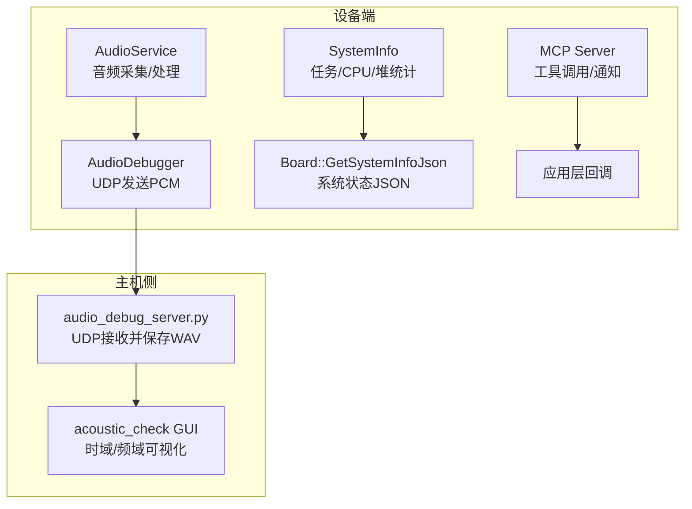
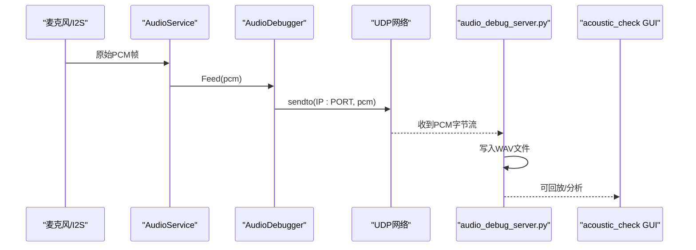
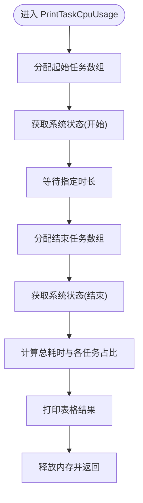
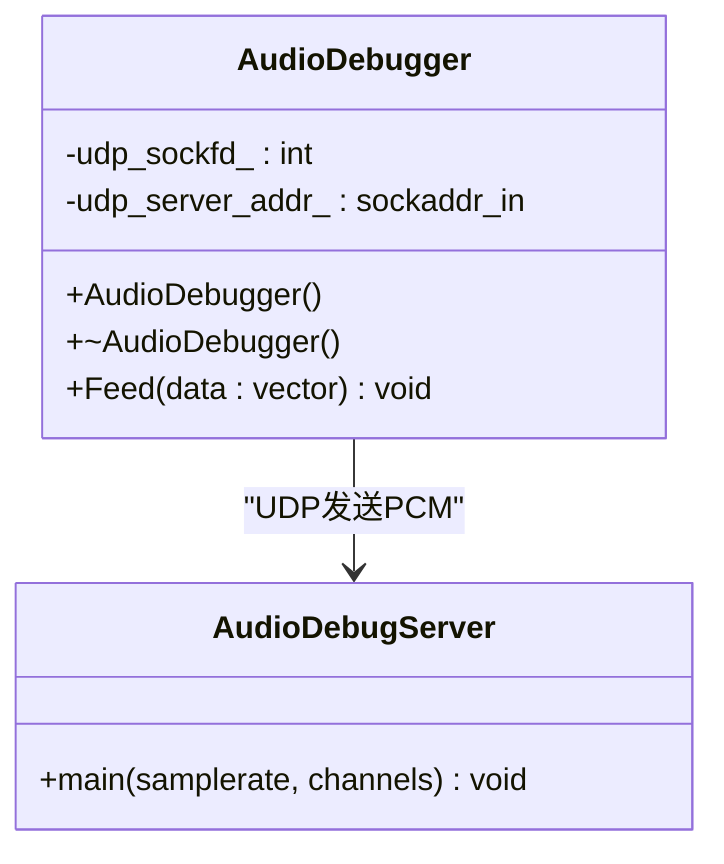
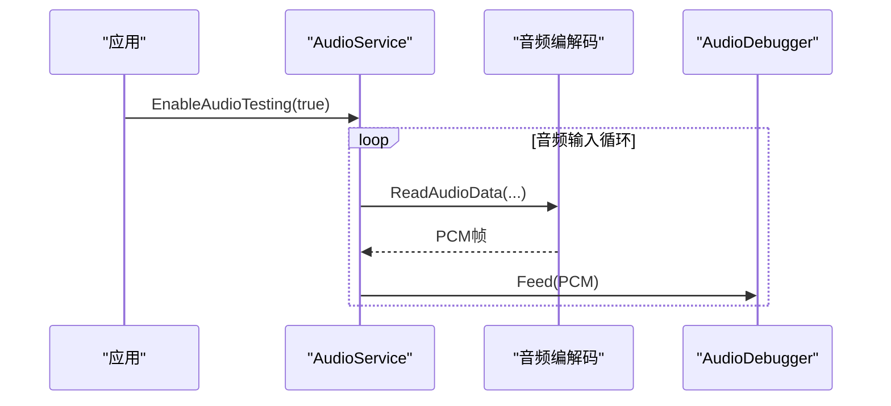
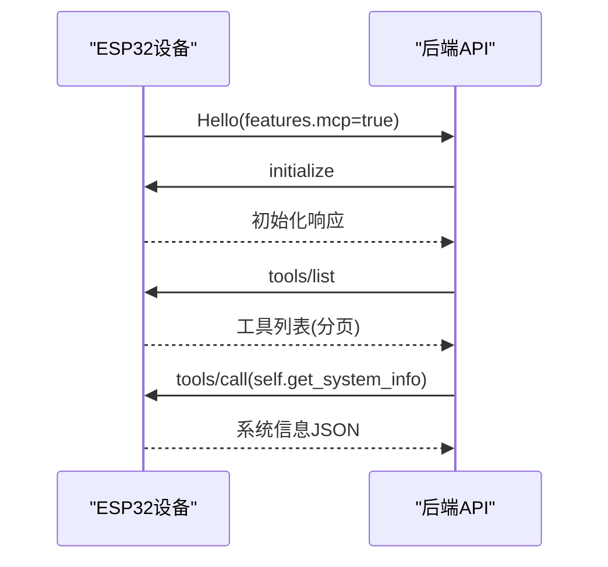
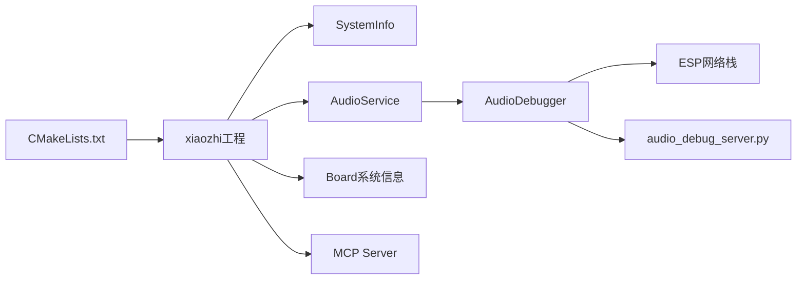

# 调试工具与技术

<cite>
**本文引用的文件**   
- [README.md](file://README.md)
- [CMakeLists.txt](file://CMakeLists.txt)
- [main/system_info.h](file://main/system_info.h)
- [main/system_info.cc](file://main/system_info.cc)
- [main/audio/processors/audio_debugger.h](file://main/audio/processors/audio_debugger.h)
- [main/audio/processors/audio_debugger.cc](file://main/audio/processors/audio_debugger.cc)
- [scripts/audio_debug_server.py](file://scripts/audio_debug_server.py)
- [scripts/acoustic_check/readme.md](file://scripts/acoustic_check/readme.md)
- [main/audio/audio_service.h](file://main/audio/audio_service.h)
- [main/audio/audio_service.cc](file://main/audio/audio_service.cc)
- [main/boards/common/board.cc](file://main/boards/common/board.cc)
- [main/boards/common/rndis_board.cc](file://main/boards/common/rndis_board.cc)
- [docs/mcp-protocol.md](file://docs/mcp-protocol.md)
</cite>

## 目录
1. [简介](#简介)
2. [项目结构](#项目结构)
3. [核心组件](#核心组件)
4. [架构总览](#架构总览)
5. [详细组件分析](#详细组件分析)
6. [依赖关系分析](#依赖关系分析)
7. [性能考量](#性能考量)
8. [故障排除指南](#故障排除指南)
9. [结论](#结论)
10. [附录](#附录)

## 简介
本指南面向ESP-IDF与音频链路调试，覆盖以下主题：
- ESP-IDF调试工具链：GDB调试、日志输出配置、断点设置等
- 音频调试工具：声学检查脚本、音频调试服务器、波形与时域/频域分析
- 性能分析：内存分析器、CPU性能分析器、网络抓包工具
- 常见问题定位与排障技巧

本项目基于ESP-IDF构建，提供系统信息、任务与堆统计、音频数据UDP回传、以及MCP协议交互能力，便于在设备端进行端到端调试。

## 项目结构
与调试相关的核心位置：
- 系统信息与性能统计：main/system_info.*
- 音频调试通道：main/audio/processors/audio_debugger.*
- 音频服务与事件：main/audio/audio_service.*
- 桌面侧接收与分析：scripts/audio_debug_server.py、scripts/acoustic_check/*
- 系统状态JSON导出：main/boards/common/board.cc、rndis_board.cc
- 构建与版本：CMakeLists.txt、README.md
- MCP协议流程（用于远程诊断与控制）：docs/mcp-protocol.md

图表来源
- [main/audio/processors/audio_debugger.cc:16-42](file://main/audio/processors/audio_debugger.cc#L16-L42)
- [main/system_info.cc:144-158](file://main/system_info.cc#L144-L158)
- [main/boards/common/board.cc:124-150](file://main/boards/common/board.cc#L124-L150)
- [scripts/audio_debug_server.py:11-43](file://scripts/audio_debug_server.py#L11-L43)
- [scripts/acoustic_check/readme.md:1-6](file://scripts/acoustic_check/readme.md#L1-L6)

章节来源
- [README.md:105-128](file://README.md#L105-L128)
- [CMakeLists.txt:1-13](file://CMakeLists.txt#L1-L13)

## 核心组件
- SystemInfo：提供Flash大小、最小空闲堆、当前空闲堆、MAC地址、芯片型号、用户代理、任务CPU使用率、任务列表、堆统计、PM锁信息等。
- AudioDebugger：通过UDP将PCM数据发送到配置的服务器地址，供上位机录制或实时分析。
- AudioService：管理音频输入/输出、编码、测试模式、唤醒词检测等；在启用调试时将PCM喂给AudioDebugger。
- Board系统信息：聚合设备硬件与应用信息，生成JSON供外部查询。
- 桌面脚本：audio_debug_server.py接收UDP PCM并保存为WAV；acoustic_check提供GUI进行声学与调制解调测试。

章节来源
- [main/system_info.h:9-21](file://main/system_info.h#L9-L21)
- [main/system_info.cc:18-57](file://main/system_info.cc#L18-L57)
- [main/system_info.cc:59-142](file://main/system_info.cc#L59-L142)
- [main/system_info.cc:144-158](file://main/system_info.cc#L144-L158)
- [main/audio/processors/audio_debugger.h:10-20](file://main/audio/processors/audio_debugger.h#L10-L20)
- [main/audio/processors/audio_debugger.cc:16-42](file://main/audio/processors/audio_debugger.cc#L16-L42)
- [main/audio/audio_service.h:98-129](file://main/audio/audio_service.h#L98-L129)
- [main/audio/audio_service.cc:224-257](file://main/audio/audio_service.cc#L224-L257)
- [main/boards/common/board.cc:124-150](file://main/boards/common/board.cc#L124-L150)
- [scripts/audio_debug_server.py:11-43](file://scripts/audio_debug_server.py#L11-L43)
- [scripts/acoustic_check/readme.md:1-6](file://scripts/acoustic_check/readme.md#L1-L6)

## 架构总览
下图展示从音频采集到上位机分析的完整链路，以及系统信息收集路径。

图表来源
- [main/audio/audio_service.cc:224-257](file://main/audio/audio_service.cc#L224-L257)
- [main/audio/processors/audio_debugger.cc:54-66](file://main/audio/processors/audio_debugger.cc#L54-L66)
- [scripts/audio_debug_server.py:11-43](file://scripts/audio_debug_server.py#L11-L43)
- [scripts/acoustic_check/readme.md:1-6](file://scripts/acoustic_check/readme.md#L1-L6)

## 详细组件分析

### 系统信息与性能统计（SystemInfo）
- 功能要点
  - 获取Flash大小、最小空闲堆、当前空闲堆、MAC地址、芯片型号、用户代理
  - 打印任务CPU使用率（基于FreeRTOS运行时间计数器）
  - 打印任务列表、内部SRAM堆统计、PM锁信息
- 复杂度与影响
  - PrintTaskCpuUsage需要两次uxTaskGetSystemState与一次vTaskDelay，时间复杂度O(N^2)匹配任务句柄，N为任务数；适合短时采样，不建议高频调用
  - PrintHeapStats与PrintPmLocks开销较低，适合按需调用
- 使用建议
  - 在关键路径前后调用以评估CPU占用
  - 结合Board系统信息JSON进行问题复现与上报

图表来源
- [main/system_info.cc:59-142](file://main/system_info.cc#L59-L142)

章节来源
- [main/system_info.h:9-21](file://main/system_info.h#L9-L21)
- [main/system_info.cc:18-57](file://main/system_info.cc#L18-L57)
- [main/system_info.cc:59-142](file://main/system_info.cc#L59-L142)
- [main/system_info.cc:144-158](file://main/system_info.cc#L144-L158)

### 音频调试通道（AudioDebugger + 桌面接收）
- 设备端
  - 通过配置项启用USE_AUDIO_DEBUGGER，并设置AUDIO_DEBUG_UDP_SERVER为“IP:PORT”
  - 初始化UDP套接字，解析目标地址，失败则记录警告
  - Feed接口将PCM直接sendto至服务器
- 主机端
  - audio_debug_server.py监听UDP 8000端口，持续接收PCM并写入WAV文件
  - acoustic_check GUI支持时域/频域显示与保存窗口长度声音，辅助判断噪声分布与声波传输准确性

图表来源
- [main/audio/processors/audio_debugger.h:10-20](file://main/audio/processors/audio_debugger.h#L10-L20)
- [main/audio/processors/audio_debugger.cc:16-42](file://main/audio/processors/audio_debugger.cc#L16-L42)
- [main/audio/processors/audio_debugger.cc:54-66](file://main/audio/processors/audio_debugger.cc#L54-L66)
- [scripts/audio_debug_server.py:11-43](file://scripts/audio_debug_server.py#L11-L43)

章节来源
- [main/audio/processors/audio_debugger.cc:16-42](file://main/audio/processors/audio_debugger.cc#L16-L42)
- [main/audio/processors/audio_debugger.cc:54-66](file://main/audio/processors/audio_debugger.cc#L54-L66)
- [scripts/audio_debug_server.py:11-43](file://scripts/audio_debug_server.py#L11-L43)
- [scripts/acoustic_check/readme.md:1-6](file://scripts/acoustic_check/readme.md#L1-L6)

### 音频服务集成点（AudioService）
- 在音频输入任务中，当处于音频测试或处理模式时，读取PCM并通过AudioDebugger::Feed转发
- 提供事件标志位控制音频测试、唤醒词检测、音频处理器运行状态
- 提供调试统计结构体，便于观察输入/解码/编码/播放计数

图表来源
- [main/audio/audio_service.cc:224-257](file://main/audio/audio_service.cc#L224-L257)
- [main/audio/audio_service.h:98-129](file://main/audio/audio_service.h#L98-L129)

章节来源
- [main/audio/audio_service.cc:224-257](file://main/audio/audio_service.cc#L224-L257)
- [main/audio/audio_service.h:98-129](file://main/audio/audio_service.h#L98-L129)

### 系统状态JSON导出（Board）
- 聚合应用版本、分区表、网络、芯片温度等信息，生成JSON字符串
- 便于通过MCP或HTTP接口对外暴露，辅助远程诊断

章节来源
- [main/boards/common/board.cc:124-150](file://main/boards/common/board.cc#L124-L150)
- [main/boards/common/rndis_board.cc:231-247](file://main/boards/common/rndis_board.cc#L231-L247)

### MCP协议交互（远程诊断与控制）
- 设备端维护两类工具：常规工具与仅用户可见工具
- 后端可通过tools/list与tools/call进行设备能力发现与操作，包含系统信息查询等
- 适用于远程抓取设备状态、触发诊断动作

图表来源
- [docs/mcp-protocol.md:209-268](file://docs/mcp-protocol.md#L209-L268)

章节来源
- [docs/mcp-protocol.md:209-268](file://docs/mcp-protocol.md#L209-L268)

## 依赖关系分析
- 构建与版本
  - 顶层CMakeLists.txt定义最低CMake版本、最小化构建开关与项目版本
- 运行时依赖
  - SystemInfo依赖FreeRTOS与ESP系统API
  - AudioDebugger依赖ESP-IDF网络栈与配置项
  - 桌面脚本依赖Python标准库socket与wave

图表来源
- [CMakeLists.txt:1-13](file://CMakeLists.txt#L1-L13)
- [main/system_info.cc:1-15](file://main/system_info.cc#L1-L15)
- [main/audio/processors/audio_debugger.cc:1-11](file://main/audio/processors/audio_debugger.cc#L1-L11)
- [scripts/audio_debug_server.py:1-10](file://scripts/audio_debug_server.py#L1-L10)

章节来源
- [CMakeLists.txt:1-13](file://CMakeLists.txt#L1-L13)

## 性能考量
- CPU使用率
  - 使用SystemInfo::PrintTaskCpuUsage进行短时采样，避免频繁调用导致额外负载
- 内存使用
  - 关注最小空闲堆与当前空闲堆，识别潜在泄漏或峰值占用
- 音频链路
  - 合理设置OPUS帧长与队列长度，避免丢包与卡顿
  - 使用AudioDebugger+acoustic_check快速验证前端降噪与传输质量
- 网络
  - 使用UDP直传PCM，注意防火墙与路由可达性；必要时改用TCP或封装协议

[本节为通用指导，不直接分析具体文件]

## 故障排除指南
- 无法连接UDP服务器
  - 确认已启用USE_AUDIO_DEBUGGER且AUDIO_DEBUG_UDP_SERVER格式正确（IP:PORT）
  - 检查设备与主机网络连通性与端口开放情况
- 上位机未收到数据
  - 确认audio_debug_server.py已启动并监听8000端口
  - 检查防火墙与安全软件拦截
- 音频质量差或误触发
  - 使用acoustic_check查看频谱与噪声分布，调整前端降噪参数
  - 参考声学检查文档中的设备适配备注
- 系统不稳定或崩溃
  - 打印任务列表与堆统计，定位高CPU占用任务与内存瓶颈
  - 通过MCP工具调用self.get_system_info获取设备状态快照

章节来源
- [scripts/acoustic_check/readme.md:1-6](file://scripts/acoustic_check/readme.md#L1-L6)
- [main/system_info.cc:144-158](file://main/system_info.cc#L144-L158)
- [main/system_info.cc:59-142](file://main/system_info.cc#L59-L142)
- [main/audio/processors/audio_debugger.cc:16-42](file://main/audio/processors/audio_debugger.cc#L16-L42)
- [scripts/audio_debug_server.py:11-43](file://scripts/audio_debug_server.py#L11-L43)

## 结论
通过SystemInfo、AudioDebugger与桌面脚本的组合，可在设备端实现低侵入的音频与系统级调试。配合MCP协议，可实现远程诊断与受控操作，提升问题定位效率与可观测性。

[本节为总结，不直接分析具体文件]

## 附录

### ESP-IDF调试工具链速览（GDB、日志、断点）
- 环境准备
  - 安装ESP-IDF插件并选择SDK版本5.4及以上
  - 建议使用Linux以获得更快编译与更少驱动问题
- GDB调试
  - 使用ESP-IDF提供的GDB会话，加载ELF后连接目标板
  - 设置断点于关键函数入口，单步执行并观察变量与寄存器
- 日志输出
  - 使用ESP_LOGI/ESP_LOGE等宏输出结构化日志
  - 通过串口或网络转发日志，便于远程收集
- 断点与条件断点
  - 针对音频输入/处理路径设置断点，捕获异常帧或状态变化
  - 结合SystemInfo打印任务与堆信息，辅助定位资源问题

章节来源
- [README.md:115-128](file://README.md#L115-L128)