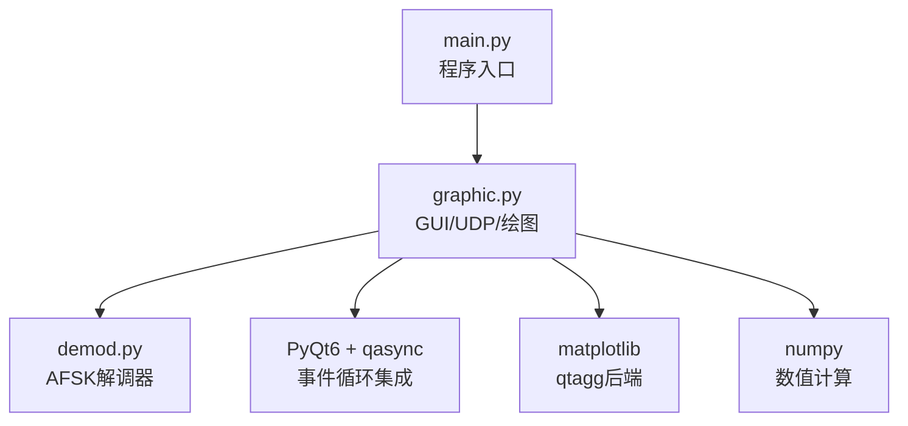
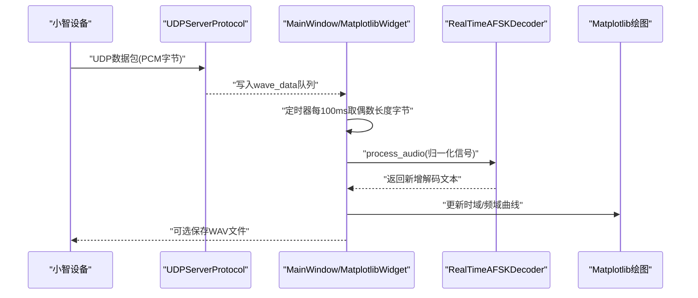
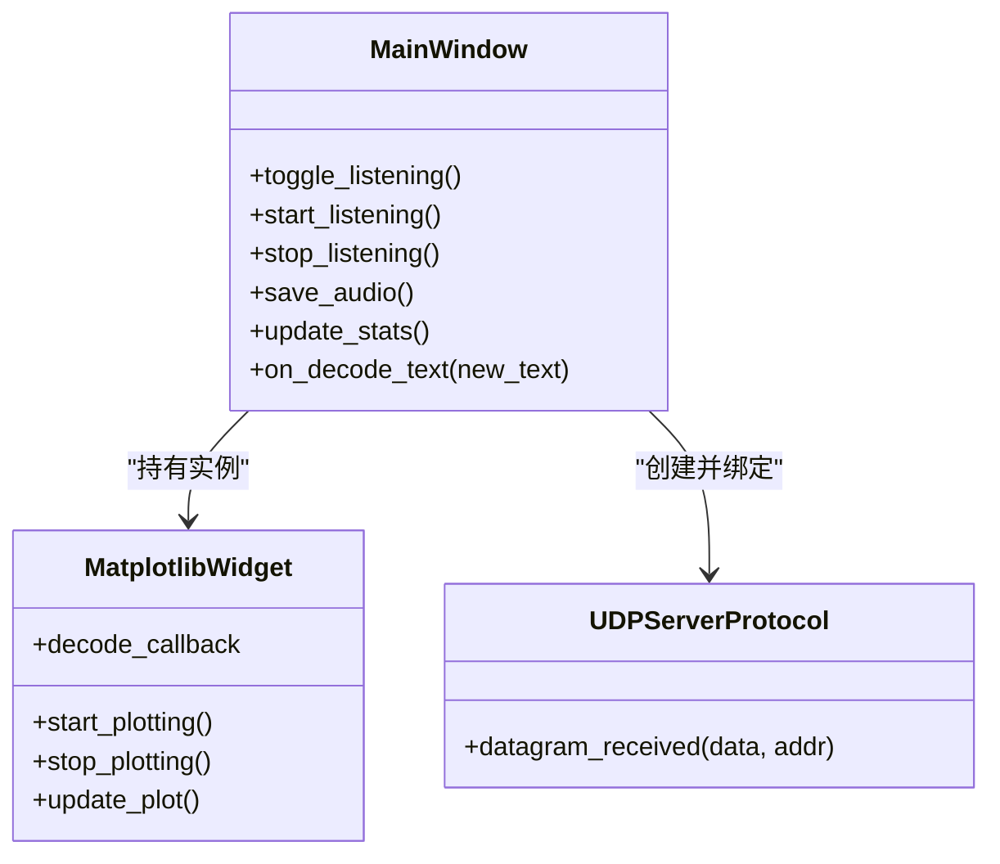
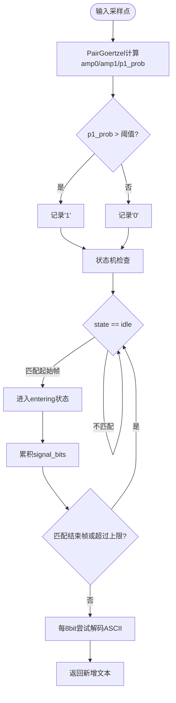
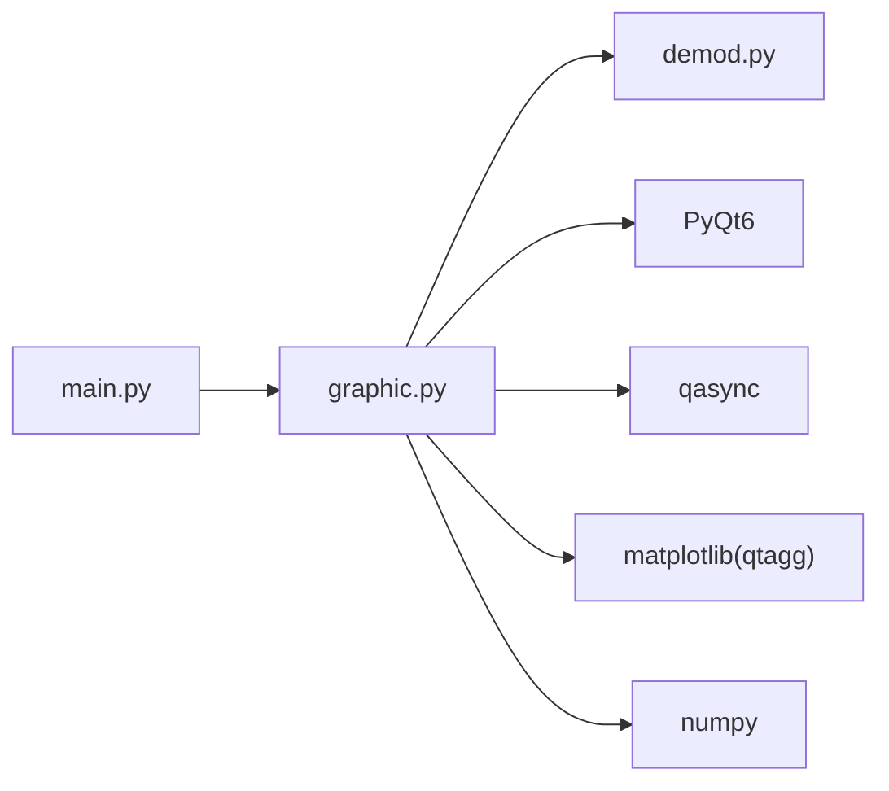

# 声学检查脚本

<cite>
**本文引用的文件**   
- [scripts/acoustic_check/readme.md](file://scripts/acoustic_check/readme.md)
- [scripts/acoustic_check/requirements.txt](file://scripts/acoustic_check/requirements.txt)
- [scripts/acoustic_check/main.py](file://scripts/acoustic_check/main.py)
- [scripts/acoustic_check/graphic.py](file://scripts/acoustic_check/graphic.py)
- [scripts/acoustic_check/demod.py](file://scripts/acoustic_check/demod.py)
</cite>

## 目录
1. [简介](#简介)
2. [项目结构](#项目结构)
3. [核心组件](#核心组件)
4. [架构总览](#架构总览)
5. [详细组件分析](#详细组件分析)
6. [依赖与安装](#依赖与安装)
7. [启动参数与网络配置](#启动参数与网络配置)
8. [使用方法](#使用方法)
9. [依赖关系分析](#依赖关系分析)
10. [性能考虑](#性能考虑)
11. [故障排查指南](#故障排查指南)
12. [结论](#结论)

## 简介
本脚本提供基于 Qt GUI + Matplotlib 的实时音频监听系统，用于接收小智设备通过 UDP 回传的 PCM 数据，进行波形显示、频谱分析、频率响应可视化，并内置 AFSK 解码器以解析音频中的 ASCII 字符串。该工具适用于：
- 验证设备端音频采集链路（ADC/MIC）质量
- 评估噪声分布与频域特征
- 测试声波传输 ASCII 的准确度与稳定性
- 快速定位解调失败原因（如门限、窗口大小、比特率等）

## 项目结构
声学检查脚本位于 scripts/acoustic_check 目录下，包含以下关键文件：
- main.py：程序入口，使用 asyncio 启动主界面
- graphic.py：Qt GUI 主窗口、Matplotlib 绘图、UDP 接收与保存音频逻辑
- demod.py：AFSK 实时解调器（Goertzel 双频检测 + 起始帧触发状态机）
- requirements.txt：Python 依赖清单
- readme.md：使用说明与设备兼容性记录

图表来源
- [scripts/acoustic_check/main.py:1-19](file://scripts/acoustic_check/main.py#L1-L19)
- [scripts/acoustic_check/graphic.py:1-444](file://scripts/acoustic_check/graphic.py#L1-L444)
- [scripts/acoustic_check/demod.py:1-281](file://scripts/acoustic_check/demod.py#L1-L281)

章节来源
- [scripts/acoustic_check/readme.md:1-23](file://scripts/acoustic_check/readme.md#L1-L23)
- [scripts/acoustic_check/requirements.txt:1-5](file://scripts/acoustic_check/requirements.txt#L1-L5)
- [scripts/acoustic_check/main.py:1-19](file://scripts/acoustic_check/main.py#L1-L19)

## 核心组件
- 图形界面与数据流
  - MainWindow：管理 UI 控件、监听按钮、状态标签、统计更新、保存音频
  - MatplotlibWidget：封装 FigureCanvas，维护时域/频域子图，定时器驱动刷新，调用解码器处理新增采样
  - UDPServerProtocol：基于 asyncio 的 UDP 数据报协议，将收到的字节追加到队列
- 解码器
  - RealTimeAFSKDecoder：基于 Goertzel 的双频检测 + 起始帧触发状态机，输出可打印 ASCII 文本
  - PairGoertzel / TraceGoertzel：实现单频/双频能量检测，按比特周期输出概率

章节来源
- [scripts/acoustic_check/graphic.py:185-444](file://scripts/acoustic_check/graphic.py#L185-L444)
- [scripts/acoustic_check/graphic.py:46-183](file://scripts/acoustic_check/graphic.py#L46-L183)
- [scripts/acoustic_check/graphic.py:23-44](file://scripts/acoustic_check/graphic.py#L23-L44)
- [scripts/acoustic_check/demod.py:126-281](file://scripts/acoustic_check/demod.py#L126-L281)
- [scripts/acoustic_check/demod.py:64-124](file://scripts/acoustic_check/demod.py#L64-L124)
- [scripts/acoustic_check/demod.py:9-62](file://scripts/acoustic_check/demod.py#L9-L62)

## 架构总览
整体流程：设备端启用音频调试并通过 UDP 发送 PCM 数据 → 本机运行脚本监听指定端口 → 将字节缓冲转换为归一化信号 → 解码器逐点处理并输出新解码文本 → GUI 定时刷新时域波形与频谱。

图表来源
- [scripts/acoustic_check/graphic.py:23-44](file://scripts/acoustic_check/graphic.py#L23-L44)
- [scripts/acoustic_check/graphic.py:118-183](file://scripts/acoustic_check/graphic.py#L118-L183)
- [scripts/acoustic_check/demod.py:179-224](file://scripts/acoustic_check/demod.py#L179-L224)

## 详细组件分析

### 图形界面与数据流（graphic.py）
- 异步事件循环
  - 使用 qasync 将 PyQt6 事件循环与 asyncio 集成，便于在 GUI 中运行 UDP 服务器
- UDP 接收
  - UDPServerProtocol 仅接受首个客户端地址的数据，后续忽略未知地址，避免多源干扰
- 绘图与刷新
  - MatplotlibWidget 维护两个子图：时域波形与频谱；定时器每 100ms 触发一次 update_plot
  - 从 wave_data 取出偶数个字节，转为 int16 并归一化为 [-1, 1]，送入解码器
  - 对最近 N 秒数据进行 FFT，限制显示范围至 0–4000Hz，自动缩放 Y 轴
- 解码回调
  - 解码器返回的新增文本通过回调追加到 QTextEdit，并滚动到底部
- 保存音频
  - 将当前 signals 保存为 received_audio.wav（单声道、16bit、16kHz）

图表来源
- [scripts/acoustic_check/graphic.py:185-444](file://scripts/acoustic_check/graphic.py#L185-L444)
- [scripts/acoustic_check/graphic.py:46-183](file://scripts/acoustic_check/graphic.py#L46-L183)
- [scripts/acoustic_check/graphic.py:23-44](file://scripts/acoustic_check/graphic.py#L23-L44)

章节来源
- [scripts/acoustic_check/graphic.py:185-444](file://scripts/acoustic_check/graphic.py#L185-L444)
- [scripts/acoustic_check/graphic.py:46-183](file://scripts/acoustic_check/graphic.py#L46-L183)
- [scripts/acoustic_check/graphic.py:23-44](file://scripts/acoustic_check/graphic.py#L23-L44)

### AFSK 实时解调器（demod.py）
- Goertzel 算法
  - TraceGoertzel：针对目标频率的递归滤波器，计算振幅
  - PairGoertzel：同时跟踪 Space/Mark 两频，按比特周期输出 p1_prob
- 实时解码
  - RealTimeAFSKDecoder：
    - 初始化窗口大小 win_size = f_sample / mark_freq * s_goertzel
    - 定义起始帧与结束帧位序列，进入“entering”状态后收集比特
    - 每 8 bit 尝试解码为 ASCII，过滤非打印字符
    - 提供 get_stats 获取前置位、状态、已接收字符数、缓冲位数等

图表来源
- [scripts/acoustic_check/demod.py:9-62](file://scripts/acoustic_check/demod.py#L9-L62)
- [scripts/acoustic_check/demod.py:64-124](file://scripts/acoustic_check/demod.py#L64-L124)
- [scripts/acoustic_check/demod.py:126-224](file://scripts/acoustic_check/demod.py#L126-L224)

章节来源
- [scripts/acoustic_check/demod.py:9-62](file://scripts/acoustic_check/demod.py#L9-L62)
- [scripts/acoustic_check/demod.py:64-124](file://scripts/acoustic_check/demod.py#L64-L124)
- [scripts/acoustic_check/demod.py:126-224](file://scripts/acoustic_check/demod.py#L126-L224)

## 依赖与安装
- Python 依赖
  - matplotlib==3.10.5
  - numpy==2.3.2
  - PyQt6==6.9.1
  - qasync==0.27.1
- 安装方式
  - 在项目根目录执行：pip install -r scripts/acoustic_check/requirements.txt
- 运行环境建议
  - 建议使用 Python 3.9+，确保系统音频库与 Qt 后端可用

章节来源
- [scripts/acoustic_check/requirements.txt:1-5](file://scripts/acoustic_check/requirements.txt#L1-L5)

## 启动参数与网络配置
- 启动命令
  - python scripts/acoustic_check/main.py
- 启动参数
  - 无命令行参数；所有配置通过 GUI 输入框设置
- 网络端口与地址
  - 监听地址：默认 0.0.0.0（所有网卡）
  - 监听端口：默认 8000
  - 固件侧需开启音频调试并设置 AUDIO_DEBUG_UDP_SERVER 为本机地址
- 设备端要求
  - 固件需启用 USE_AUDIO_DEBUGGER，并将音频数据发送至本机地址与端口

章节来源
- [scripts/acoustic_check/main.py:1-19](file://scripts/acoustic_check/main.py#L1-L19)
- [scripts/acoustic_check/graphic.py:206-216](file://scripts/acoustic_check/graphic.py#L206-L216)
- [scripts/acoustic_check/readme.md:1-6](file://scripts/acoustic_check/readme.md#L1-L6)

## 使用方法
- 基本步骤
  1) 安装依赖并运行脚本
  2) 在 GUI 中输入监听地址与端口，点击“开始监听”
  3) 设备端开启音频调试并发送 PCM 数据
  4) 观察时域波形与频谱，查看实时 AFSK 解码结果
  5) 需要时点击“保存音频”，生成 received_audio.wav
- 波形显示
  - 时域图：横轴为采样索引，纵轴为归一化幅度；自动调整坐标范围
  - 频域图：横轴为频率（Hz），纵轴为幅度；默认显示 0–4000Hz
- 频谱分析与频率响应
  - 使用短时 FFT 计算频谱，适合观察主要能量集中在 1500Hz/1800Hz 附近的情况
  - 若背景噪声较大，可在设备端适当降噪或调整增益
- 解码结果
  - 解码文本区会追加新解码出的 ASCII 字符，支持清空与统计信息查看
- 实际调试场景示例
  - 场景A：确认设备端音频是否到达本机
    - 打开监听，观察“接收数据”计数是否增长；若无变化，检查防火墙与端口占用
  - 场景B：波形存在但无法解码
    - 检查设备端比特率、Space/Mark 频率是否与脚本一致；必要时调整阈值或窗口系数
  - 场景C：解码不稳定或丢包严重
    - 参考 readme 中设备兼容表，某些板卡需关闭 INPUT_REFERENCE 或额外降噪

章节来源
- [scripts/acoustic_check/graphic.py:118-183](file://scripts/acoustic_check/graphic.py#L118-L183)
- [scripts/acoustic_check/graphic.py:285-319](file://scripts/acoustic_check/graphic.py#L285-L319)
- [scripts/acoustic_check/readme.md:7-23](file://scripts/acoustic_check/readme.md#L7-L23)

## 依赖关系分析
- 模块耦合
  - main.py 仅负责启动 graphic.main 的异步主函数
  - graphic.py 依赖 demod.py 的解码器，依赖 PyQt6/qasync 的事件循环，依赖 matplotlib 的 qtagg 后端
  - demod.py 依赖 numpy 进行数值计算
- 外部依赖
  - PyQt6：GUI 框架
  - qasync：将 asyncio 与 Qt 事件循环桥接
  - matplotlib：绘图，使用 qtagg 后端以嵌入 Qt
  - numpy：FFT、数组操作

图表来源
- [scripts/acoustic_check/main.py:1-19](file://scripts/acoustic_check/main.py#L1-L19)
- [scripts/acoustic_check/graphic.py:1-21](file://scripts/acoustic_check/graphic.py#L1-L21)
- [scripts/acoustic_check/demod.py:1-10](file://scripts/acoustic_check/demod.py#L1-L10)

章节来源
- [scripts/acoustic_check/main.py:1-19](file://scripts/acoustic_check/main.py#L1-L19)
- [scripts/acoustic_check/graphic.py:1-21](file://scripts/acoustic_check/graphic.py#L1-L21)
- [scripts/acoustic_check/demod.py:1-10](file://scripts/acoustic_check/demod.py#L1-L10)

## 性能考虑
- 更新频率
  - 定时器间隔为 100ms，兼顾实时性与渲染开销
- 数据窗口
  - 时域显示固定时间窗口（默认 20s），超出部分丢弃，避免内存增长
- FFT 计算
  - 仅在信号长度大于 1 时计算，且限制显示频率范围，降低 CPU 负载
- 解码器
  - Goertzel 算法复杂度低，适合逐点处理；窗口大小与比特率需匹配以保证稳定度

[本节为通用指导，无需特定文件引用]

## 故障排查指南
- 无法收到数据
  - 检查防火墙是否放行 UDP 端口；确认设备端 AUDIO_DEBUG_UDP_SERVER 指向本机地址
  - 在 GUI 中观察“状态”与“接收数据”计数
- 端口冲突
  - 更换端口号并确保未被其他进程占用
- 解码不出文本
  - 核对设备端比特率、Space/Mark 频率与脚本一致
  - 调整阈值或窗口系数（s_goertzel）以提升稳定性
- 解码不稳定或丢包率高
  - 参考 readme 的设备兼容表，某些板卡需关闭 INPUT_REFERENCE 或进行额外降噪
- 保存失败
  - 检查磁盘权限与路径；确保有足够数据可保存

章节来源
- [scripts/acoustic_check/graphic.py:320-393](file://scripts/acoustic_check/graphic.py#L320-L393)
- [scripts/acoustic_check/readme.md:7-23](file://scripts/acoustic_check/readme.md#L7-L23)

## 结论
本脚本提供了轻量、直观的声学检查工具，结合 UDP 接收、实时波形与频谱展示以及 AFSK 解码能力，可有效辅助设备端音频链路与声波通信的调试与验证。通过合理配置网络端口与解码参数，并结合 readme 中的设备兼容性建议，可显著提升解码成功率与稳定性。