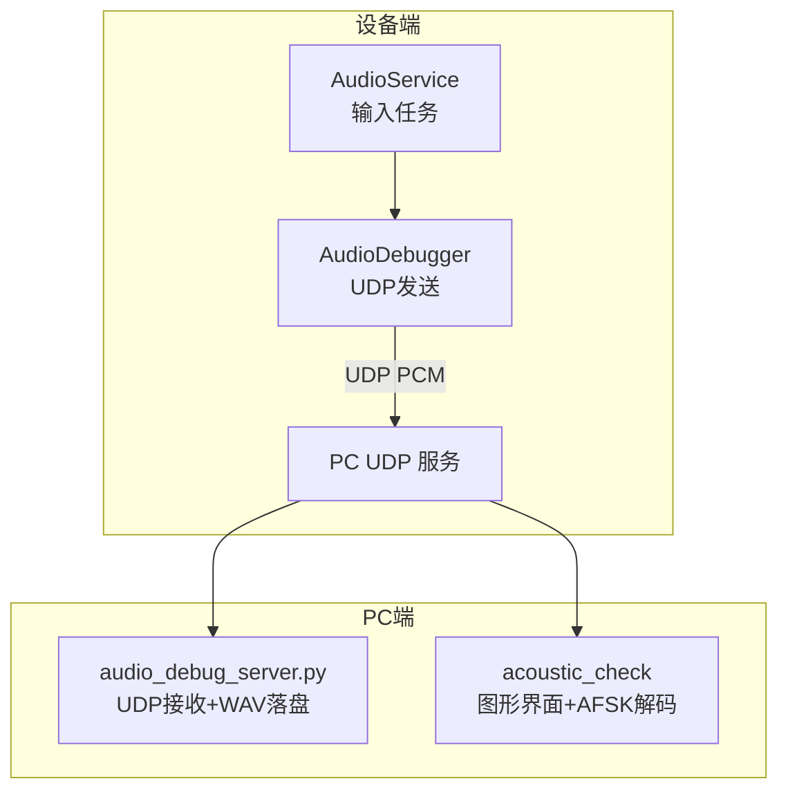
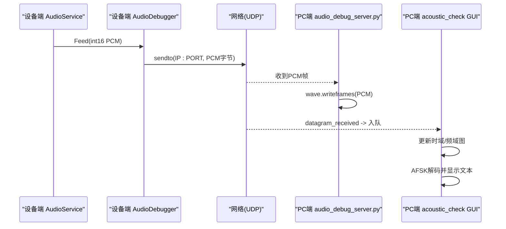
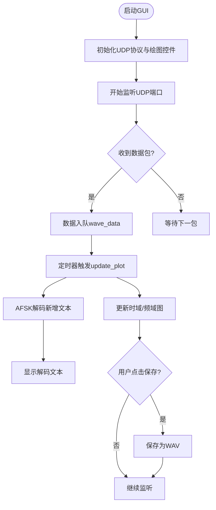
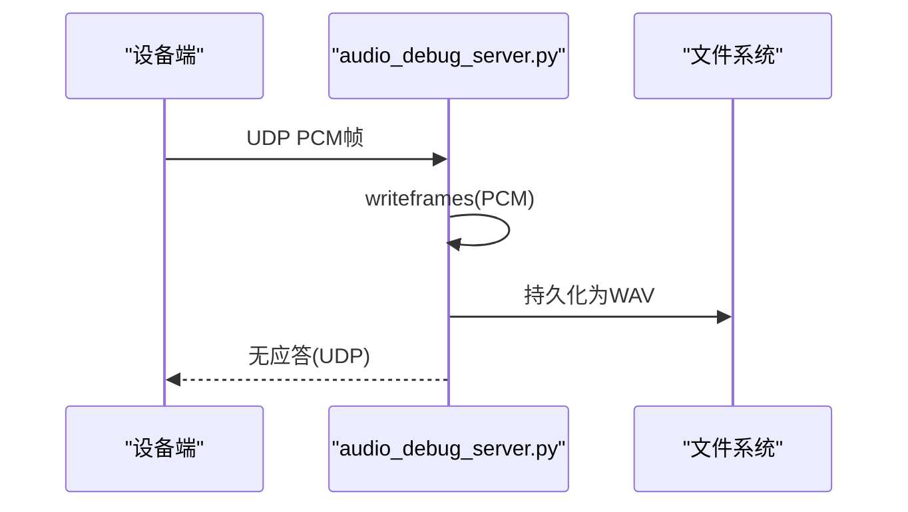
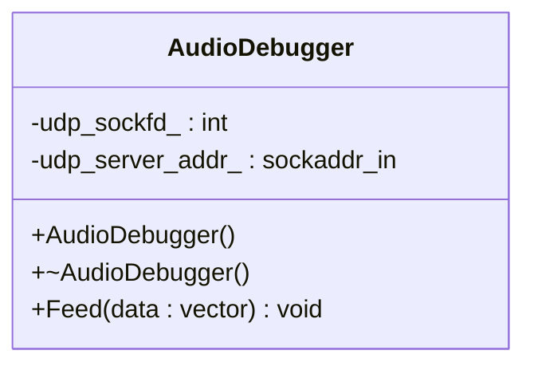
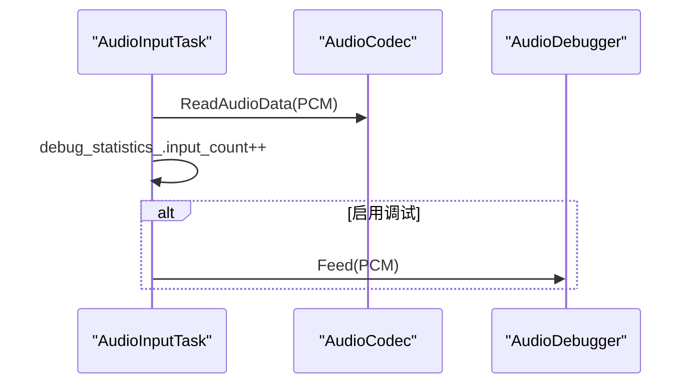
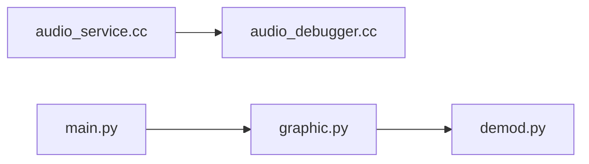

# 音频调试工具

<cite>
**本文引用的文件**   
- [main.py](file://scripts/acoustic_check/main.py)
- [graphic.py](file://scripts/acoustic_check/graphic.py)
- [demod.py](file://scripts/acoustic_check/demod.py)
- [audio_debug_server.py](file://scripts/audio_debug_server.py)
- [audio_debugger.h](file://main/audio/processors/audio_debugger.h)
- [audio_debugger.cc](file://main/audio/processors/audio_debugger.cc)
- [audio_service.h](file://main/audio/audio_service.h)
- [audio_service.cc](file://main/audio/audio_service.cc)
</cite>

## 目录
1. [简介](#简介)
2. [项目结构](#项目结构)
3. [核心组件](#核心组件)
4. [架构总览](#架构总览)
5. [详细组件分析](#详细组件分析)
6. [依赖关系分析](#依赖关系分析)
7. [性能与实时性考虑](#性能与实时性考虑)
8. [常见问题诊断与排障](#常见问题诊断与排障)
9. [结论](#结论)
10. [附录：使用步骤与最佳实践](#附录使用步骤与最佳实践)

## 简介
本指南面向需要在嵌入式设备上采集、传输并可视化音频数据的工程师，提供一套完整的“音频调试工具”使用方法。内容涵盖：
- 声学检查脚本：实时音频监听、波形显示、频谱分析、AFSK文本解码展示
- 音频调试服务器：基于UDP的PCM数据接收与WAV落盘
- AudioDebugger类：设备端音频流捕获与UDP发送API
- 音频质量评估方法：信噪比测量、频率响应分析、延迟测试等
- 常见音频问题诊断与解决方案

## 项目结构
本项目在脚本层与设备端分别提供了音频调试能力：
- 脚本侧（PC）
  - acoustic_check：Python GUI + Matplotlib + asyncio UDP 客户端，实现实时波形/频谱显示与AFSK文本解码
  - audio_debug_server.py：纯Python UDP服务端，将收到的PCM帧保存为WAV文件
- 设备端（ESP-IDF）
  - AudioDebugger：通过UDP将原始PCM数据发送到指定IP:PORT
  - AudioService：集成AudioDebugger，在输入路径中调用Feed进行透传

图表来源
- [audio_service.cc:210-228](file://main/audio/audio_service.cc#L210-L228)
- [audio_debugger.cc:16-66](file://main/audio/processors/audio_debugger.cc#L16-L66)
- [audio_debug_server.py:11-43](file://scripts/audio_debug_server.py#L11-L43)
- [graphic.py:23-44](file://scripts/acoustic_check/graphic.py#L23-L44)

章节来源
- [main.py:1-19](file://scripts/acoustic_check/main.py#L1-L19)
- [graphic.py:1-444](file://scripts/acoustic_check/graphic.py#L1-L444)
- [demod.py:1-281](file://scripts/acoustic_check/demod.py#L1-L281)
- [audio_debug_server.py:1-55](file://scripts/audio_debug_server.py#L1-L55)
- [audio_debugger.h:1-22](file://main/audio/processors/audio_debugger.h#L1-L22)
- [audio_debugger.cc:1-68](file://main/audio/processors/audio_debugger.cc#L1-L68)
- [audio_service.h:97-104](file://main/audio/audio_service.h#L97-L104)
- [audio_service.cc:210-228](file://main/audio/audio_service.cc#L210-L228)

## 核心组件
- 声学检查脚本（GUI）
  - 入口：主程序启动异步事件循环并创建GUI窗口
  - 功能：UDP监听、时域波形与频域频谱绘制、AFSK文本解码输出、WAV导出
- 音频调试服务器（CLI）
  - 功能：绑定本地端口接收UDP PCM帧，按采样率与声道数写入WAV文件
- 设备端AudioDebugger
  - 功能：构造UDP套接字，解析配置的目标地址，将int16 PCM数据直接sendto到目标
- 设备端AudioService集成点
  - 在输入路径读取PCM后，若启用调试开关，则调用AudioDebugger::Feed透传

章节来源
- [main.py:11-18](file://scripts/acoustic_check/main.py#L11-L18)
- [graphic.py:185-444](file://scripts/acoustic_check/graphic.py#L185-L444)
- [demod.py:126-281](file://scripts/acoustic_check/demod.py#L126-L281)
- [audio_debug_server.py:11-55](file://scripts/audio_debug_server.py#L11-L55)
- [audio_debugger.h:10-20](file://main/audio/processors/audio_debugger.h#L10-L20)
- [audio_debugger.cc:16-66](file://main/audio/processors/audio_debugger.cc#L16-L66)
- [audio_service.cc:210-228](file://main/audio/audio_service.cc#L210-L228)

## 架构总览
下图展示了从设备端到PC端的完整数据流与控制流。

图表来源
- [audio_service.cc:210-228](file://main/audio/audio_service.cc#L210-L228)
- [audio_debugger.cc:54-66](file://main/audio/processors/audio_debugger.cc#L54-L66)
- [audio_debug_server.py:25-43](file://scripts/audio_debug_server.py#L25-L43)
- [graphic.py:23-44](file://scripts/acoustic_check/graphic.py#L23-L44)
- [graphic.py:118-183](file://scripts/acoustic_check/graphic.py#L118-L183)

## 详细组件分析

### 声学检查脚本（GUI）
- 启动流程
  - main.py作为入口，运行asyncio事件循环并调用graphic.main()
- 图形界面
  - MainWindow负责UI布局、按钮控制、状态标签、统计信息
  - MatplotlibWidget封装绘图逻辑，包含时域波形与频域频谱两个子图
- UDP监听
  - UDPServerProtocol继承asyncio.DatagramProtocol，记录首个客户端地址并仅处理该地址的数据包
  - 数据入队至MatplotlibWidget.wave_data，供定时器刷新绘图
- 实时绘图
  - 定时器周期触发update_plot，从队列取最新数据，归一化后更新时域曲线
  - 对当前信号做FFT，取正频率部分更新频谱曲线，限制显示范围便于观察
- AFSK解码
  - 使用RealTimeAFSKDecoder，基于Goertzel算法检测Mark/Space频率，识别起始/结束帧，输出可打印ASCII文本
  - 解码结果回调至MainWindow，追加显示并自动滚动到底部
- 数据保存
  - 支持将缓存的采样序列保存为单声道16位WAV文件

图表来源
- [graphic.py:23-44](file://scripts/acoustic_check/graphic.py#L23-L44)
- [graphic.py:118-183](file://scripts/acoustic_check/graphic.py#L118-L183)
- [graphic.py:402-423](file://scripts/acoustic_check/graphic.py#L402-L423)
- [demod.py:179-224](file://scripts/acoustic_check/demod.py#L179-L224)

章节来源
- [main.py:11-18](file://scripts/acoustic_check/main.py#L11-L18)
- [graphic.py:185-444](file://scripts/acoustic_check/graphic.py#L185-L444)
- [demod.py:126-281](file://scripts/acoustic_check/demod.py#L126-L281)

### 音频调试服务器（CLI）
- 参数
  - --samplerate/-s：采样率（默认16000）
  - --channels/-c：声道数（默认2）
- 行为
  - 绑定0.0.0.0:8000，持续recvfrom接收UDP数据
  - 以二进制PCM帧写入WAV文件，文件名由采样率与声道数决定
  - 控制台打印接收字节长度与来源地址
- 适用场景
  - 快速验证设备端UDP发送是否正常
  - 离线回放与分析WAV文件

图表来源
- [audio_debug_server.py:11-43](file://scripts/audio_debug_server.py#L11-L43)

章节来源
- [audio_debug_server.py:46-55](file://scripts/audio_debug_server.py#L46-L55)

### 设备端AudioDebugger类
- 设计要点
  - 构造函数：创建UDP套接字，解析CONFIG_AUDIO_DEBUG_UDP_SERVER（格式“IP:PORT”），填充sockaddr_in
  - 析构函数：关闭套接字
  - Feed接口：将int16 PCM向量直接sendto到目标地址
- 编译开关
  - 仅在启用CONFIG_USE_AUDIO_DEBUGGER时生效，否则为空实现，避免运行时开销
- 错误处理
  - 套接字创建失败、地址格式非法、发送失败均记录日志

图表来源
- [audio_debugger.h:10-20](file://main/audio/processors/audio_debugger.h#L10-L20)
- [audio_debugger.cc:16-66](file://main/audio/processors/audio_debugger.cc#L16-L66)

章节来源
- [audio_debugger.h:1-22](file://main/audio/processors/audio_debugger.h#L1-22)
- [audio_debugger.cc:1-68](file://main/audio/processors/audio_debugger.cc#L1-68)

### 设备端AudioService集成点
- 集成位置
  - 在输入路径读取PCM后，若启用调试开关，则创建AudioDebugger实例并调用Feed
- 统计指标
  - DebugStatistics包含input_count、decode_count、encode_count、playback_count，用于跟踪各阶段处理计数

图表来源
- [audio_service.cc:210-228](file://main/audio/audio_service.cc#L210-L228)
- [audio_service.h:97-104](file://main/audio/audio_service.h#L97-L104)

章节来源
- [audio_service.cc:210-228](file://main/audio/audio_service.cc#L210-L228)
- [audio_service.h:97-104](file://main/audio/audio_service.h#L97-L104)

## 依赖关系分析
- 脚本侧
  - graphic.py依赖demod.py中的AFSK解码器
  - main.py仅作为入口，调用graphic.main()
- 设备侧
  - audio_service.cc在输入路径调用audio_debugger.cc提供的Feed接口
  - 两者通过UDP协议解耦，便于独立部署与替换

图表来源
- [audio_service.cc:210-228](file://main/audio/audio_service.cc#L210-L228)
- [audio_debugger.cc:54-66](file://main/audio/processors/audio_debugger.cc#L54-L66)
- [graphic.py:1-444](file://scripts/acoustic_check/graphic.py#L1-444)
- [demod.py:1-281](file://scripts/acoustic_check/demod.py#L1-L281)
- [main.py:1-19](file://scripts/acoustic_check/main.py#L1-L19)

章节来源
- [audio_service.cc:210-228](file://main/audio/audio_service.cc#L210-L228)
- [audio_debugger.cc:54-66](file://main/audio/processors/audio_debugger.cc#L54-L66)
- [graphic.py:1-444](file://scripts/acoustic_check/graphic.py#L1-L444)
- [demod.py:1-281](file://scripts/acoustic_check/demod.py#L1-L281)
- [main.py:1-19](file://scripts/acoustic_check/main.py#L1-L19)

## 性能与实时性考虑
- 设备端
  - Feed为阻塞式sendto，需确保网络稳定且目标端口可用；建议在空闲或低负载时段开启调试
  - 建议合理设置UDP缓冲区大小，避免丢包
- 脚本端
  - GUI线程与UDP接收线程分离，定时器刷新频率影响CPU占用与流畅度
  - FFT计算量随窗口长度增长，建议限制显示频率范围以降低渲染压力
- 服务器端
  - 磁盘IO可能成为瓶颈，建议使用SSD或临时目录以减少写入延迟

[本节为通用指导，不直接分析具体文件]

## 常见问题诊断与排障
- 无法收到数据
  - 检查设备端是否启用调试开关与正确的UDP目标地址
  - 确认PC防火墙允许UDP 8000端口入站
  - 使用audio_debug_server.py先验证UDP连通性与WAV落盘
- 波形异常或无声
  - 核对设备端PCM采样率与声道数是否与服务器一致
  - 检查麦克风驱动与输入通道选择（双声道时可能需要左声道抽取）
- 频谱显示空白
  - 确认数据已入队且定时器正常触发
  - 检查FFT窗口长度与采样率匹配
- AFSK解码无文本
  - 调整阈值与频率参数，确保Mark/Space频率与比特率匹配
  - 检查起始/结束帧是否正确被识别
- 保存WAV播放无声
  - 核对WAV头参数（采样率、声道数、位宽）与实际数据一致
  - 使用标准播放器验证文件完整性

章节来源
- [audio_debug_server.py:11-43](file://scripts/audio_debug_server.py#L11-L43)
- [graphic.py:118-183](file://scripts/acoustic_check/graphic.py#L118-L183)
- [demod.py:179-224](file://scripts/acoustic_check/demod.py#L179-L224)

## 结论
本工具链通过设备端轻量级UDP发送与PC端多形态接收（WAV落盘与GUI可视化），实现了端到端的音频调试闭环。结合AFSK文本解码，可用于链路质量与协议一致性验证。配合合理的统计指标与排障手段，可快速定位音频链路问题并优化系统性能。

[本节为总结性内容，不直接分析具体文件]

## 附录：使用步骤与最佳实践

### 设备端配置与启动
- 启用调试开关
  - 在构建配置中启用音频调试开关（例如CONFIG_USE_AUDIO_DEBUGGER）
- 配置UDP目标地址
  - 设置CONFIG_AUDIO_DEBUG_UDP_SERVER为“IP:PORT”，如“192.168.1.100:8000”
- 运行设备应用
  - 启动后，设备会在输入路径自动调用AudioDebugger::Feed发送PCM

章节来源
- [audio_debugger.cc:16-42](file://main/audio/processors/audio_debugger.cc#L16-L42)
- [audio_service.cc:210-228](file://main/audio/audio_service.cc#L210-L228)

### PC端：使用音频调试服务器
- 安装依赖
  - Python环境，标准库socket与wave
- 启动服务器
  - 命令行参数示例：--samplerate 16000 --channels 2
- 验证数据
  - 查看控制台输出与生成的WAV文件

章节来源
- [audio_debug_server.py:46-55](file://scripts/audio_debug_server.py#L46-L55)

### PC端：使用声学检查脚本
- 安装依赖
  - PyQt6、qasync、matplotlib、numpy
- 启动GUI
  - 运行main.py，进入图形界面
- 开始监听
  - 输入监听地址与端口（默认0.0.0.0:8000），点击“开始监听”
- 观察波形与频谱
  - 时域波形与频域频谱实时更新
- 查看AFSK文本
  - 解码结果在文本区域显示，支持清空与统计
- 保存音频
  - 点击“保存音频”导出received_audio.wav

章节来源
- [main.py:11-18](file://scripts/acoustic_check/main.py#L11-L18)
- [graphic.py:185-444](file://scripts/acoustic_check/graphic.py#L185-L444)
- [demod.py:126-281](file://scripts/acoustic_check/demod.py#L126-L281)

### 音频质量评估方法与标准
- 信噪比（SNR）测量
  - 方法：采集静噪段估计噪声功率，再计算含声段的信号功率比值
  - 参考：使用WAV文件离线分析，或在GUI中截取片段进行FFT对比
- 频率响应分析
  - 方法：对稳态正弦扫频或白噪声输入，计算幅频响应曲线
  - 参考：GUI频谱视图可辅助观察峰值与带宽
- 延迟测试
  - 方法：在输入端注入已知脉冲或同步码，测量从输入到输出的时间差
  - 参考：结合设备端时间戳与PC端接收时间估算端到端延迟
- 失真与动态范围
  - 方法：THD+N测量与最大不失真电平评估
  - 参考：利用WAV文件进行谱分析与峰值统计

[本节为通用指导，不直接分析具体文件]