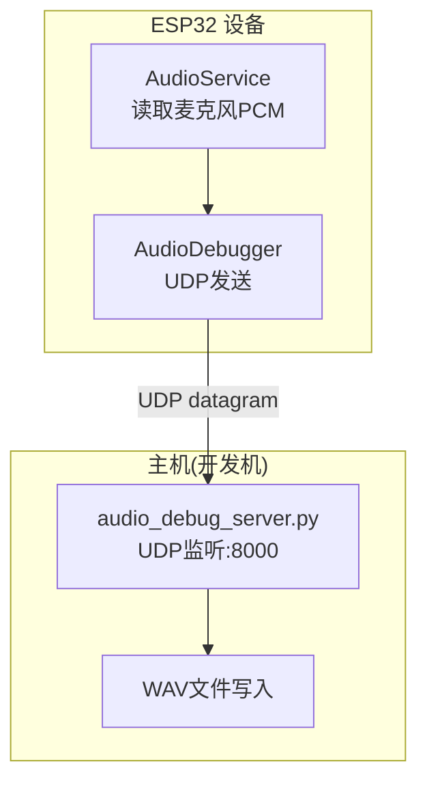
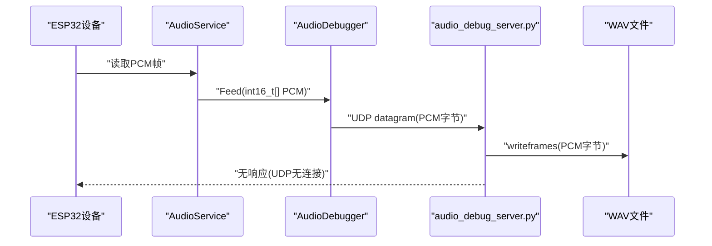
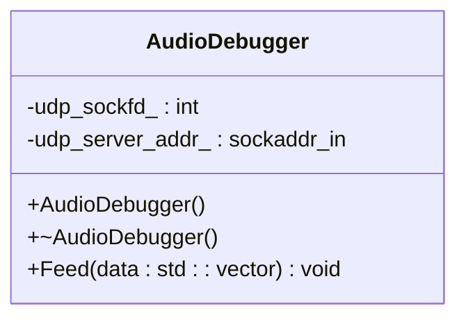
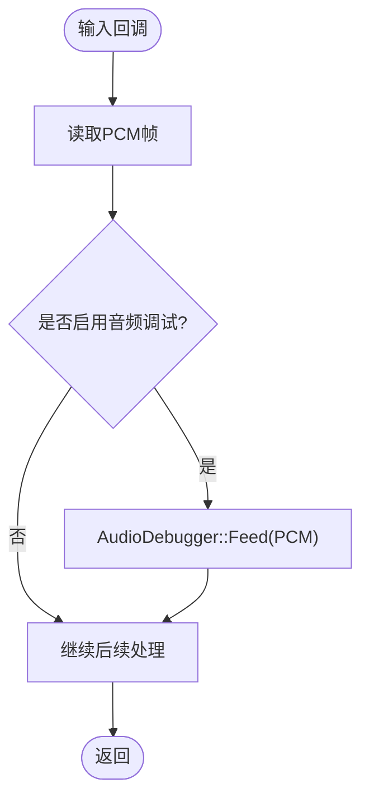
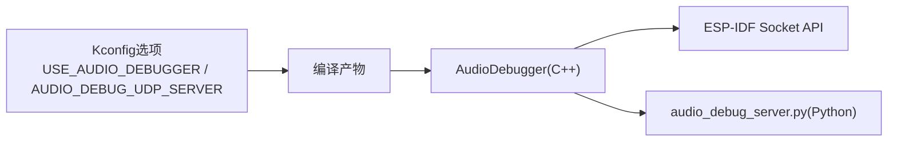

# 音频调试服务器

<cite>
**本文引用的文件**   
- [scripts/audio_debug_server.py](file://scripts/audio_debug_server.py)
- [main/audio/processors/audio_debugger.h](file://main/audio/processors/audio_debugger.h)
- [main/audio/processors/audio_debugger.cc](file://main/audio/processors/audio_debugger.cc)
- [main/audio/audio_service.cc](file://main/audio/audio_service.cc)
- [main/Kconfig.projbuild](file://main/Kconfig.projbuild)
</cite>

## 目录
1. [简介](#简介)
2. [项目结构](#项目结构)
3. [核心组件](#核心组件)
4. [架构总览](#架构总览)
5. [详细组件分析](#详细组件分析)
6. [依赖关系分析](#依赖关系分析)
7. [性能与稳定性](#性能与稳定性)
8. [故障排查指南](#故障排查指南)
9. [结论](#结论)
10. [附录：ESP32集成步骤与技巧](#附录esp32集成步骤与技巧)

## 简介
本指南面向需要在 ESP32 设备上采集并调试音频数据的工程师，提供“Python 音频调试服务器”的部署、配置与使用说明。内容涵盖：
- UDP 通信协议实现与数据帧格式
- 客户端连接管理与生命周期
- AudioDebugger 类的 C++ 接口使用方法（音频流捕获、处理结果转发、性能指标收集）
- 服务器启动参数、网络配置、日志输出等配置项
- 与 ESP32 设备集成的具体步骤与调试技巧

该方案通过 ESP32 端将 PCM 原始音频以 UDP 报文直接发送到主机 Python 服务，便于离线回放、频谱分析与问题定位。

## 项目结构
与音频调试相关的代码主要分布在以下位置：
- 服务端脚本：scripts/audio_debug_server.py
- 客户端 C++ 类：main/audio/processors/audio_debugger.{h,cc}
- 集成入口：main/audio/audio_service.cc
- 构建配置：main/Kconfig.projbuild

图表来源
- [main/audio/audio_service.cc:218-225](file://main/audio/audio_service.cc#L218-L225)
- [main/audio/processors/audio_debugger.cc:16-42](file://main/audio/processors/audio_debugger.cc#L16-L42)
- [scripts/audio_debug_server.py:11-23](file://scripts/audio_debug_server.py#L11-L23)

章节来源
- [main/audio/processors/audio_debugger.h:1-22](file://main/audio/processors/audio_debugger.h#L1-L22)
- [main/audio/processors/audio_debugger.cc:1-68](file://main/audio/processors/audio_debugger.cc#L1-L68)
- [main/audio/audio_service.cc:218-225](file://main/audio/audio_service.cc#L218-L225)
- [scripts/audio_debug_server.py:1-55](file://scripts/audio_debug_server.py#L1-L55)
- [main/Kconfig.projbuild:945-980](file://main/Kconfig.projbuild#L945-L980)

## 核心组件
- Python 音频调试服务器
  - 功能：在主机上监听 UDP 端口，接收来自设备的 PCM 数据，按采样率与声道数写入 WAV 文件，并在控制台打印接收统计。
  - 关键特性：无额外协议头，直接透传 PCM 字节；支持命令行参数设置采样率与声道数。
- ESP32 端 AudioDebugger
  - 功能：封装 UDP Socket 初始化、目标地址解析、数据发送与资源释放；仅在启用编译开关时生效。
  - 数据格式：直接将 int16_t PCM 样本序列作为 UDP 载荷发送，不附加任何帧头或长度字段。
- 集成点 AudioService
  - 功能：在输入路径中调用 AudioDebugger::Feed，将原始 PCM 数据转发到调试服务器。

章节来源
- [scripts/audio_debug_server.py:11-43](file://scripts/audio_debug_server.py#L11-L43)
- [main/audio/processors/audio_debugger.h:10-20](file://main/audio/processors/audio_debugger.h#L10-L20)
- [main/audio/processors/audio_debugger.cc:54-66](file://main/audio/processors/audio_debugger.cc#L54-L66)
- [main/audio/audio_service.cc:218-225](file://main/audio/audio_service.cc#L218-L225)

## 架构总览
端到端流程如下：
- ESP32 侧从音频编解码器读取 PCM，进入 AudioService 输入路径
- 若启用音频调试，AudioService 调用 AudioDebugger::Feed 发送整段 PCM
- 主机 audio_debug_server.py 持续接收 UDP 包，追加写入 WAV 文件

图表来源
- [main/audio/audio_service.cc:218-225](file://main/audio/audio_service.cc#L218-L225)
- [main/audio/processors/audio_debugger.cc:54-66](file://main/audio/processors/audio_debugger.cc#L54-L66)
- [scripts/audio_debug_server.py:25-35](file://scripts/audio_debug_server.py#L25-L35)

## 详细组件分析

### Python 音频调试服务器
- 启动方式
  - 运行脚本后默认监听本机所有接口的 8000 端口
  - 可通过命令行参数指定采样率与声道数
- 数据帧格式
  - 无协议头，每个 UDP 数据包即为一段 PCM 字节流
  - 字节序为小端，样本宽度固定为 16-bit
  - 声道排列由传入的 channels 决定（例如双声道为 LRLR...）
- 文件命名
  - 自动以“采样率_声道数.wav”命名输出文件
- 日志输出
  - 控制台打印每次接收到的字节数与来源地址
- 退出与清理
  - 收到中断信号后关闭文件与套接字，并提示保存完成

章节来源
- [scripts/audio_debug_server.py:11-23](file://scripts/audio_debug_server.py#L11-L23)
- [scripts/audio_debug_server.py:25-43](file://scripts/audio_debug_server.py#L25-L43)
- [scripts/audio_debug_server.py:46-55](file://scripts/audio_debug_server.py#L46-L55)

#### 启动参数与示例
- 参数
  - --samplerate/-s：采样率，默认 16000
  - --channels/-c：声道数，默认 2
- 示例
  - python scripts/audio_debug_server.py --samplerate 16000 --channels 2

章节来源
- [scripts/audio_debug_server.py:46-55](file://scripts/audio_debug_server.py#L46-L55)

### ESP32 端 AudioDebugger 类
- 职责
  - 构造时创建 UDP Socket，解析配置的服务器地址（IP:PORT），记录目标地址
  - Feed 方法将传入的 int16_t PCM 向量直接 sendto 到目标地址
  - 析构时关闭 Socket
- 条件编译
  - 仅在启用 USE_AUDIO_DEBUGGER 时生成相关代码
- 错误处理
  - 创建 Socket 失败、地址格式非法、sendto 失败均会记录警告日志
- 性能特征
  - 零拷贝发送（直接使用 vector 底层缓冲区）
  - 无重传、无拥塞控制，适合短时调试

图表来源
- [main/audio/processors/audio_debugger.h:10-20](file://main/audio/processors/audio_debugger.h#L10-L20)
- [main/audio/processors/audio_debugger.cc:16-42](file://main/audio/processors/audio_debugger.cc#L16-L42)
- [main/audio/processors/audio_debugger.cc:54-66](file://main/audio/processors/audio_debugger.cc#L54-L66)

章节来源
- [main/audio/processors/audio_debugger.h:1-22](file://main/audio/processors/audio_debugger.h#L1-L22)
- [main/audio/processors/audio_debugger.cc:1-68](file://main/audio/processors/audio_debugger.cc#L1-L68)

### 集成点：AudioService
- 触发时机
  - 在输入路径成功从编解码器读取 PCM 后，若启用调试，则调用 AudioDebugger::Feed
- 线程模型
  - 输入任务循环读取 PCM，必要时进行单声道转换后再送入后续处理链
- 统计信息
  - 维护输入计数等调试统计，可用于评估丢帧与吞吐

图表来源
- [main/audio/audio_service.cc:218-225](file://main/audio/audio_service.cc#L218-L225)

章节来源
- [main/audio/audio_service.cc:218-225](file://main/audio/audio_service.cc#L218-L225)

## 依赖关系分析
- 构建配置
  - USE_AUDIO_DEBUGGER：布尔开关，决定是否包含音频调试逻辑
  - AUDIO_DEBUG_UDP_SERVER：字符串配置，格式为 IP:PORT，用于指定主机服务地址
- 运行时依赖
  - ESP-IDF 网络栈（socket/sendto/close）
  - Python 标准库 socket/wave 与 argparse

图表来源
- [main/Kconfig.projbuild:945-980](file://main/Kconfig.projbuild#L945-L980)
- [main/audio/processors/audio_debugger.cc:16-42](file://main/audio/processors/audio_debugger.cc#L16-L42)
- [scripts/audio_debug_server.py:11-23](file://scripts/audio_debug_server.py#L11-L23)

章节来源
- [main/Kconfig.projbuild:945-980](file://main/Kconfig.projbuild#L945-L980)

## 性能与稳定性
- 传输开销
  - 每帧 PCM 大小 = 样本数 × 2 字节 × 声道数。例如 10ms@16kHz 单声道约 320 字节，立体声约 640 字节
- 丢包影响
  - UDP 无保证，丢包会导致 WAV 出现爆音或静音片段；建议在同一局域网内使用
- 磁盘 I/O
  - 主机端连续 writeframes 可能受文件系统影响；建议使用 SSD 或关闭不必要的后台写入
- 内存占用
  - ESP32 端仅持有当前帧缓冲，内存占用低；Python 端逐块写入，峰值内存取决于系统缓存
- 并发与阻塞
  - 发送失败仅记录警告，不会阻塞主流程；长时间发送失败需检查网络连通性

[本节为通用指导，无需源码引用]

## 故障排查指南
- 无法收到数据
  - 确认主机防火墙放行 UDP 8000 端口
  - 检查 ESP32 配置的 AUDIO_DEBUG_UDP_SERVER 是否与主机实际 IP:PORT 一致
  - 使用抓包工具验证 UDP 报文是否到达主机
- WAV 播放异常
  - 核对 Python 启动参数中的采样率与声道数是否与设备一致
  - 检查是否存在大量丢包导致波形断裂
- 日志定位
  - ESP32 端日志：查看“初始化服务器地址”“发送失败”等关键字
  - Python 端日志：观察“Received X bytes from ...”是否正常打印

章节来源
- [main/audio/processors/audio_debugger.cc:32-41](file://main/audio/processors/audio_debugger.cc#L32-L41)
- [main/audio/processors/audio_debugger.cc:59-63](file://main/audio/processors/audio_debugger.cc#L59-L63)
- [scripts/audio_debug_server.py:25-35](file://scripts/audio_debug_server.py#L25-L35)

## 结论
本方案以极简的 UDP 透传方式实现了高效的音频调试链路：ESP32 端以最低开销将 PCM 直发主机，Python 端负责持久化与可视化。通过合理的网络与参数配置，可在本地快速复现与诊断音频相关问题。

[本节为总结，无需源码引用]

## 附录：ESP32集成步骤与技巧
- 启用调试开关
  - 在配置菜单中启用 USE_AUDIO_DEBUGGER
  - 设置 AUDIO_DEBUG_UDP_SERVER 为目标主机地址（如 192.168.2.100:8000）
- 编译与烧录
  - 重新编译固件并烧录至设备
- 启动主机服务
  - 在主机终端执行：python scripts/audio_debug_server.py --samplerate 16000 --channels 2
- 开始录音
  - 设备进入语音交互或测试模式后，主机将开始写入 WAV 文件
- 常见问题
  - 若未收到数据，优先检查 IP 可达性与端口占用
  - 若 WAV 播放无声，核对采样率与声道数是否匹配
  - 如需降低网络压力，可考虑减少帧长或降低采样率（注意对算法的影响）

章节来源
- [main/Kconfig.projbuild:945-980](file://main/Kconfig.projbuild#L945-L980)
- [scripts/audio_debug_server.py:46-55](file://scripts/audio_debug_server.py#L46-L55)
- [main/audio/audio_service.cc:218-225](file://main/audio/audio_service.cc#L218-L225)