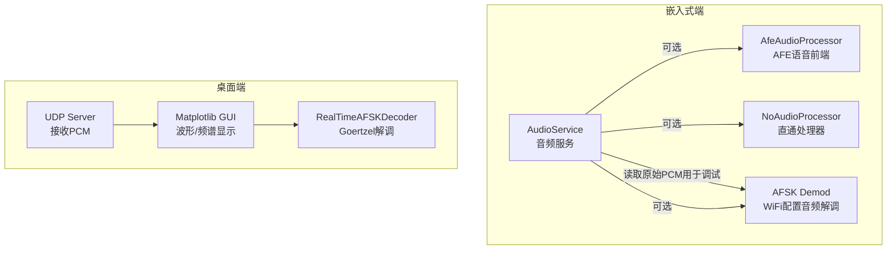
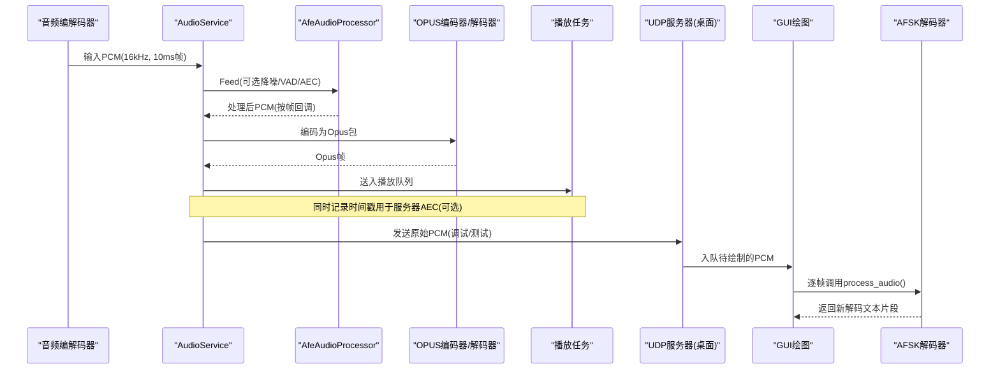
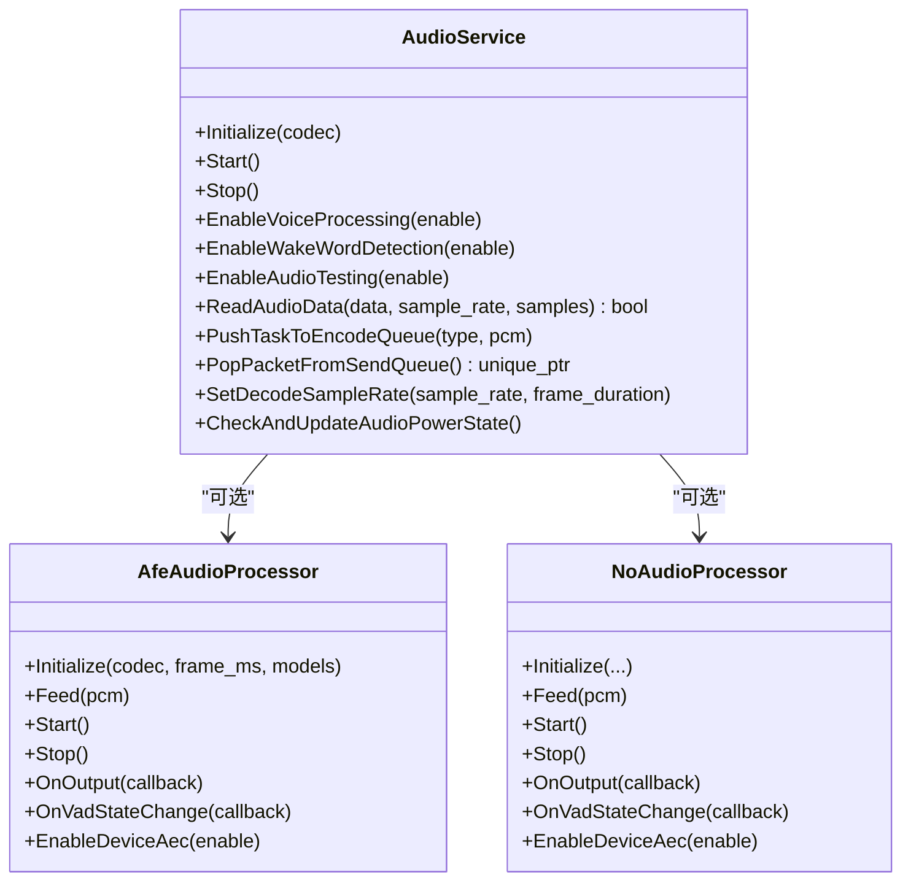
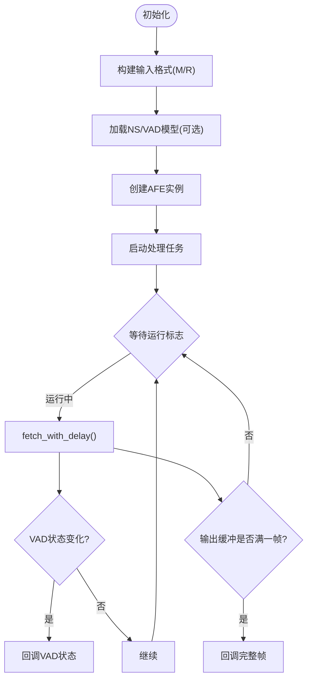
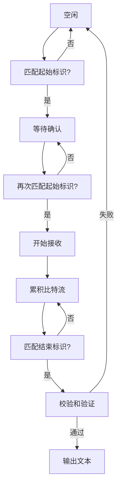
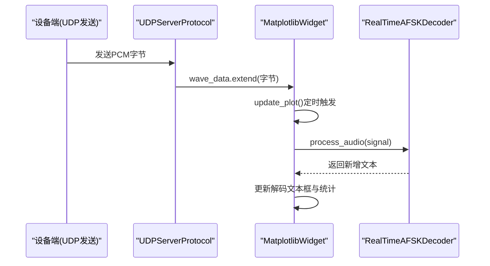
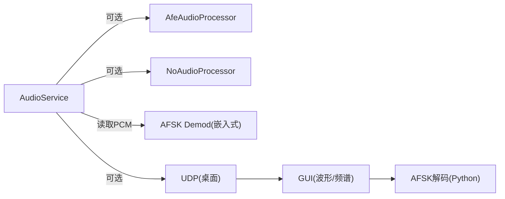

# 音频质量分析

<cite>
**本文引用的文件**   
- [audio_service.h](file://main/audio/audio_service.h)
- [audio_service.cc](file://main/audio/audio_service.cc)
- [afe_audio_processor.h](file://main/audio/processors/afe_audio_processor.h)
- [afe_audio_processor.cc](file://main/audio/processors/afe_audio_processor.cc)
- [no_audio_processor.cc](file://main/audio/processors/no_audio_processor.cc)
- [afsk_demod.h](file://main/boards/common/afsk_demod.h)
- [afsk_demod.cc](file://main/boards/common/afsk_demod.cc)
- [demod.py](file://scripts/acoustic_check/demod.py)
- [graphic.py](file://scripts/acoustic_check/graphic.py)
- [main.py](file://scripts/acoustic_check/main.py)
</cite>

## 目录
1. [简介](#简介)
2. [项目结构](#项目结构)
3. [核心组件](#核心组件)
4. [架构总览](#架构总览)
5. [详细组件分析](#详细组件分析)
6. [依赖关系分析](#依赖关系分析)
7. [性能考量](#性能考量)
8. [故障排查指南](#故障排查指南)
9. [结论](#结论)
10. [附录](#附录)

## 简介
本使用文档面向音频质量分析与评估，围绕以下目标展开：
- 信噪比测量方法、频率响应分析技术、延迟测试流程等评估标准与实操建议
- 波形可视化、频谱图生成、AFSK信号解调的实现原理与使用方法
- 失真检测、回声消除效果评估、语音清晰度测试的实用工具与步骤
- 基于现有代码库（ESP32端音频服务与Python侧实时监听/解码工具）给出可落地的最佳实践

## 项目结构
本项目在嵌入式端提供音频采集、处理、编解码与任务调度能力；在桌面端提供UDP接收、实时波形/频谱显示与AFSK解调。关键路径如下：
- 嵌入式音频服务：负责音频输入/输出、重采样、OPUS编解码、VAD/AEC开关、任务队列与事件控制
- AFE语音前端：可选降噪、VAD、设备AEC（硬件或软件），并回调处理后的PCM帧
- AFSK解调（嵌入式）：通过Goertzel算法对Mark/Space双频进行概率估计，结合状态机完成文本解析
- Python声学检查工具：UDP接收PCM、实时绘制时域/频域、Goertzel-based AFSK解码与统计展示

图表来源
- [audio_service.cc:125-167](file://main/audio/audio_service.cc#L125-L167)
- [afe_audio_processor.cc:13-75](file://main/audio/processors/afe_audio_processor.cc#L13-L75)
- [afsk_demod.cc:16-108](file://main/boards/common/afsk_demod.cc#L16-L108)
- [graphic.py:23-110](file://scripts/acoustic_check/graphic.py#L23-L110)
- [demod.py:126-178](file://scripts/acoustic_check/demod.py#L126-L178)

章节来源
- [audio_service.h:43-88](file://main/audio/audio_service.h#L43-L88)
- [audio_service.cc:125-167](file://main/audio/audio_service.cc#L125-L167)
- [afe_audio_processor.h:17-46](file://main/audio/processors/afe_audio_processor.h#L17-L46)
- [afe_audio_processor.cc:13-75](file://main/audio/processors/afe_audio_processor.cc#L13-L75)
- [afsk_demod.h:12-24](file://main/boards/common/afsk_demod.h#L12-L24)
- [afsk_demod.cc:16-108](file://main/boards/common/afsk_demod.cc#L16-L108)
- [graphic.py:23-110](file://scripts/acoustic_check/graphic.py#L23-L110)
- [demod.py:126-178](file://scripts/acoustic_check/demod.py#L126-L178)

## 核心组件
- 音频服务（AudioService）
  - 管理输入/输出任务、OPUS编解码、重采样、队列与事件组
  - 支持唤醒词检测、语音处理（VAD/AEC）、音频测试模式
- AFE语音前端（AfeAudioProcessor）
  - 集成降噪、VAD、设备AEC（视配置），以固定帧长输出处理后的PCM
- NoAudioProcessor（直通）
  - 无处理直通，便于对比基线
- AFSK解调（嵌入式）
  - Goertzel单频检测 + Mark/Space双频概率估计 + 起始/结束标识状态机
- Python声学检查工具
  - UDP接收PCM、实时波形/频谱、Goertzel-based AFSK解码与统计

章节来源
- [audio_service.h:43-88](file://main/audio/audio_service.h#L43-L88)
- [audio_service.cc:230-288](file://main/audio/audio_service.cc#L230-L288)
- [afe_audio_processor.h:17-46](file://main/audio/processors/afe_audio_processor.h#L17-L46)
- [afe_audio_processor.cc:135-187](file://main/audio/processors/afe_audio_processor.cc#L135-L187)
- [no_audio_processor.cc:39-71](file://main/audio/processors/no_audio_processor.cc#L39-L71)
- [afsk_demod.h:29-99](file://main/boards/common/afsk_demod.h#L29-L99)
- [afsk_demod.cc:169-223](file://main/boards/common/afsk_demod.cc#L169-L223)
- [demod.py:9-124](file://scripts/acoustic_check/demod.py#L9-L124)
- [graphic.py:46-110](file://scripts/acoustic_check/graphic.py#L46-L110)

## 架构总览
下图展示了从音频采集到处理、编码/播放以及桌面端可视化与AFSK解调的整体数据流。

图表来源
- [audio_service.cc:230-288](file://main/audio/audio_service.cc#L230-L288)
- [audio_service.cc:327-446](file://main/audio/audio_service.cc#L327-L446)
- [afe_audio_processor.cc:135-187](file://main/audio/processors/afe_audio_processor.cc#L135-L187)
- [graphic.py:118-183](file://scripts/acoustic_check/graphic.py#L118-L183)
- [demod.py:179-224](file://scripts/acoustic_check/demod.py#L179-L224)

## 详细组件分析

### 音频服务（AudioService）
- 功能要点
  - 输入任务：按事件驱动读取PCM，支持双声道转单声道、重采样至16kHz
  - 输出任务：从播放队列取PCM并写入Codec，必要时做输出重采样
  - 编解码任务：将PCM编码为Opus，或将Opus解码为PCM并进入播放队列
  - 事件与队列：使用事件组协调“音频测试/唤醒词/语音处理”三种工作模式
  - 电源管理：空闲超时自动关闭输入/输出以降低功耗
- 关键参数
  - 帧时长：由宏定义决定（如10ms），影响延迟与码率
  - 最大队列长度：限制发送/解码/播放/测试队列深度，避免内存溢出
  - 时间戳队列：用于服务器AEC对齐

图表来源
- [audio_service.h:157-195](file://main/audio/audio_service.h#L157-L195)
- [audio_service.cc:125-167](file://main/audio/audio_service.cc#L125-L167)
- [afe_audio_processor.h:17-46](file://main/audio/processors/afe_audio_processor.h#L17-L46)
- [no_audio_processor.cc:39-71](file://main/audio/processors/no_audio_processor.cc#L39-L71)

章节来源
- [audio_service.h:43-88](file://main/audio/audio_service.h#L43-L88)
- [audio_service.cc:230-288](file://main/audio/audio_service.cc#L230-L288)
- [audio_service.cc:327-446](file://main/audio/audio_service.cc#L327-L446)
- [audio_service.cc:682-698](file://main/audio/audio_service.cc#L682-L698)

### AFE语音前端（AfeAudioProcessor）
- 功能要点
  - 初始化时根据输入通道数构建输入格式，加载降噪/静音检测模型
  - 支持设备AEC开关（受编译选项控制），并在运行时切换
  - 后台任务持续fetch处理结果，按帧回调上层
  - VAD状态变化回调，便于上层判断说话/静默
- 复杂度与性能
  - 采用PSRAM分配策略，降低SRAM压力
  - 固定feed/fetch chunksize，保证稳定吞吐

图表来源
- [afe_audio_processor.cc:13-75](file://main/audio/processors/afe_audio_processor.cc#L13-L75)
- [afe_audio_processor.cc:135-187](file://main/audio/processors/afe_audio_processor.cc#L135-L187)

章节来源
- [afe_audio_processor.h:17-46](file://main/audio/processors/afe_audio_processor.h#L17-L46)
- [afe_audio_processor.cc:135-187](file://main/audio/processors/afe_audio_processor.cc#L135-L187)

### AFSK解调（嵌入式）
- 实现原理
  - 使用Goertzel算法对Mark(1800Hz)/Space(1500Hz)进行单频能量估计
  - 每比特周期输出一次Mark概率，阈值判决得到比特流
  - 状态机识别起始/结束标识，校验和验证后输出ASCII文本
- 使用方式
  - 在WiFi配置模式下循环读取音频，下采样至6400Hz，计算概率序列并解析

图表来源
- [afsk_demod.h:115-172](file://main/boards/common/afsk_demod.h#L115-L172)
- [afsk_demod.cc:262-356](file://main/boards/common/afsk_demod.cc#L262-L356)

章节来源
- [afsk_demod.h:12-24](file://main/boards/common/afsk_demod.h#L12-L24)
- [afsk_demod.cc:169-223](file://main/boards/common/afsk_demod.cc#L169-L223)
- [afsk_demod.cc:262-356](file://main/boards/common/afsk_demod.cc#L262-L356)

### Python声学检查工具（UDP+可视化+AFSK）
- 功能要点
  - UDP服务器接收PCM字节，入队供GUI消费
  - Matplotlib绘制时域波形与短时FFT频谱（0-4kHz范围）
  - RealTimeAFSKDecoder基于Goertzel进行实时解调，输出新解码文本片段
- 使用步骤
  - 运行主程序，设置监听地址与端口，点击“开始监听”
  - 设备端将PCM发送至该UDP端口
  - 观察波形/频谱，查看AFSK解码结果与统计信息

图表来源
- [graphic.py:23-44](file://scripts/acoustic_check/graphic.py#L23-L44)
- [graphic.py:118-183](file://scripts/acoustic_check/graphic.py#L118-L183)
- [demod.py:179-224](file://scripts/acoustic_check/demod.py#L179-L224)

章节来源
- [main.py:1-19](file://scripts/acoustic_check/main.py#L1-L19)
- [graphic.py:46-110](file://scripts/acoustic_check/graphic.py#L46-L110)
- [graphic.py:118-183](file://scripts/acoustic_check/graphic.py#L118-L183)
- [demod.py:9-124](file://scripts/acoustic_check/demod.py#L9-L124)

## 依赖关系分析
- 模块耦合
  - AudioService与音频处理器（AFE/No）松耦合，通过接口回调传递PCM
  - AFSK解调独立于音频服务，仅通过读取PCM数据进行离线/在线分析
  - Python工具与设备端通过UDP协议解耦，便于扩展其他传输方式
- 外部依赖
  - ESP-IDF音频栈（OPUS编解码、重采样、AFE）
  - Python生态（numpy、matplotlib、PyQt6、qasync）

图表来源
- [audio_service.cc:125-167](file://main/audio/audio_service.cc#L125-L167)
- [afsk_demod.cc:16-108](file://main/boards/common/afsk_demod.cc#L16-L108)
- [graphic.py:23-110](file://scripts/acoustic_check/graphic.py#L23-L110)

章节来源
- [audio_service.h:157-195](file://main/audio/audio_service.h#L157-L195)
- [afsk_demod.h:12-24](file://main/boards/common/afsk_demod.h#L12-L24)
- [graphic.py:23-110](file://scripts/acoustic_check/graphic.py#L23-L110)

## 性能考量
- 帧时长与延迟
  - 更短帧（如10ms）降低端到端延迟，但增加CPU开销与网络负载
  - 需平衡OPUS帧时长与队列深度，避免抖动
- 重采样与通道数
  - 输入/输出重采样引入额外计算，尽量保持与Codec一致以减少转换
  - 双声道转单声道仅在需要时执行，避免不必要拷贝
- 队列与背压
  - 合理设置最大队列长度，防止内存占用过高
  - 当队列满时，应停止采集或丢弃旧数据，避免雪崩
- 电源管理
  - 长时间无I/O时关闭Codec输入/输出，降低功耗
- AEC/VAD/降噪
  - 开启设备AEC可降低回声，但可能引入轻微延迟
  - VAD可减少无效编码，节省带宽与算力

[本节为通用指导，不直接分析具体文件]

## 故障排查指南
- 常见问题
  - 无法读取音频：检查输入使能、采样率一致性、重采样器状态
  - 解码失败：检查Opus帧大小与配置是否匹配
  - 播放卡顿：检查播放队列是否积压，适当增大队列或降低帧时长
  - AFSK解码不稳定：调整阈值、窗口大小、比特率与采样率匹配
- 定位手段
  - 启用音频调试（若配置），导出原始PCM进行离线分析
  - 使用Python工具观察波形/频谱，定位噪声与干扰
  - 查看日志标签（如“AudioService”、“AUDIO_WIFI_CONFIG”）定位错误码

章节来源
- [audio_service.cc:230-288](file://main/audio/audio_service.cc#L230-L288)
- [audio_service.cc:327-446](file://main/audio/audio_service.cc#L327-L446)
- [afsk_demod.cc:16-108](file://main/boards/common/afsk_demod.cc#L16-L108)

## 结论
本项目提供了完整的音频链路：采集→处理→编码/播放→可视化与AFSK解调。借助AFE的前端能力与Python侧的实时分析工具，可实现对音频质量的系统评估与优化。建议在工程中结合VAD/AEC与合适的帧时长/队列配置，以获得低延迟、高清晰度的通话体验。

[本节为总结性内容，不直接分析具体文件]

## 附录

### 音频质量评估方法与流程
- 信噪比（SNR）测量
  - 采集安静环境下的底噪样本与含声样本
  - 计算功率谱密度，估算噪声功率与信号功率
  - SNR(dB)=10·log10(P_signal/P_noise)
  - 参考：使用Python工具获取频谱，手动或脚本化计算
- 频率响应分析
  - 使用扫频信号或宽带噪声作为激励
  - 比较输入与输出频谱，观察幅频特性与相位
  - 关注语音频段（300-3400Hz）平坦度与峰值
- 延迟测试
  - 在输入端注入已知脉冲或正弦突发
  - 在输出端检测对应响应，计算端到端延迟
  - 考虑网络与编解码延迟，分别测量本地与远端部分
- 失真检测
  - THD+N：注入纯净正弦，测量谐波与噪声总和
  - 互调失真：双音测试，观察互调产物
  - 动态范围：最小可分辨信号与饱和阈值的比值
- 回声消除效果评估
  - 开启/关闭AEC对比听感与客观指标（ERLE）
  - 使用Python工具录制近端/远端信号，离线评估
- 语音清晰度测试
  - 主观：MOS评分
  - 客观：STOI、PESQ（需参考信号）
  - 结合VAD与丢包模拟，评估鲁棒性

[本节为通用指导，不直接分析具体文件]

### 工具使用清单
- 嵌入式端
  - 启用音频测试模式：用于录制一段音频并回放，便于快速验证链路
  - 开启设备AEC：在强混响环境下提升清晰度
- 桌面端
  - 启动Python工具，设置UDP端口，观察波形/频谱
  - 使用AFSK解码面板，验证通信链路

章节来源
- [audio_service.cc:606-617](file://main/audio/audio_service.cc#L606-L617)
- [graphic.py:206-274](file://scripts/acoustic_check/graphic.py#L206-L274)