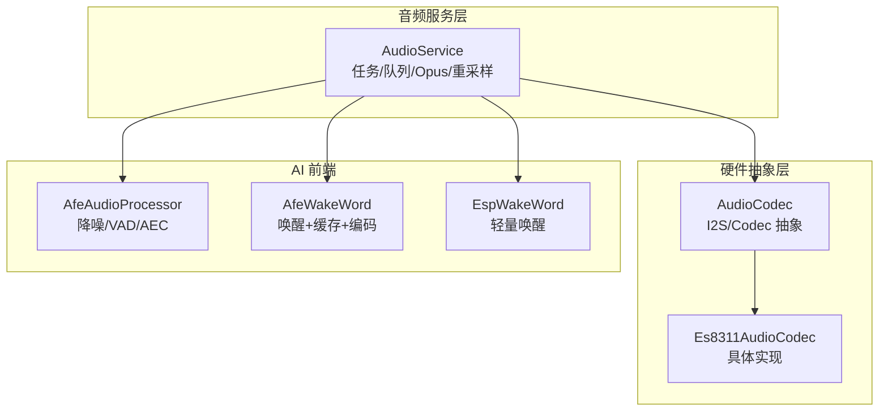
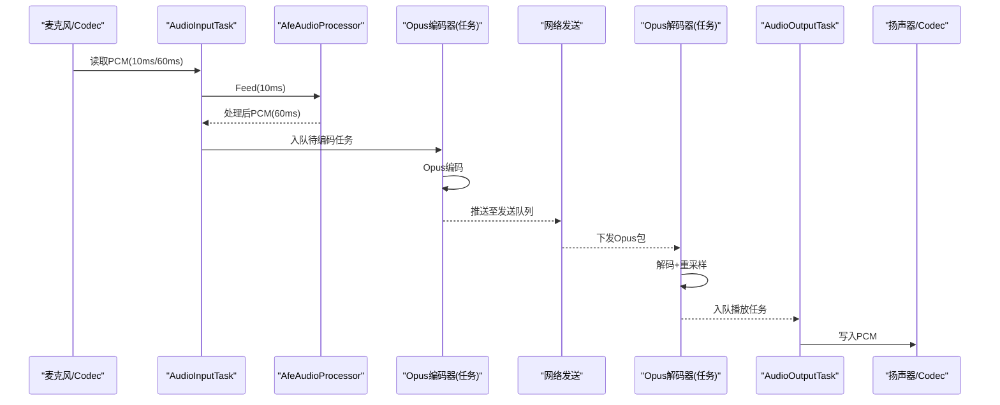
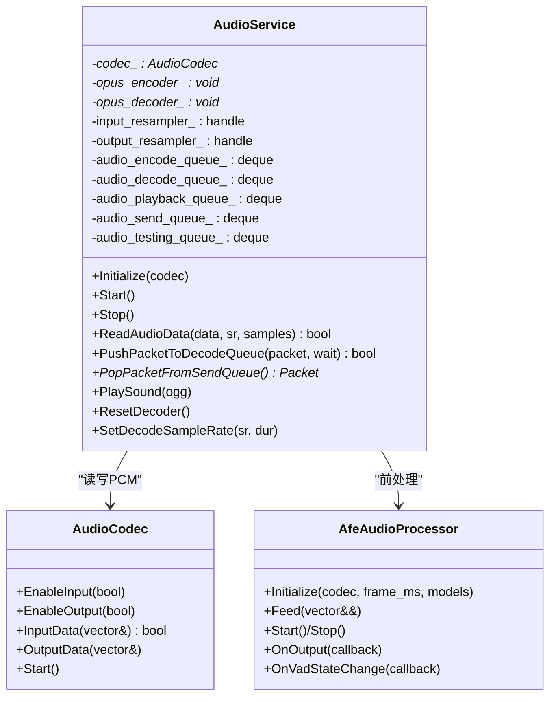
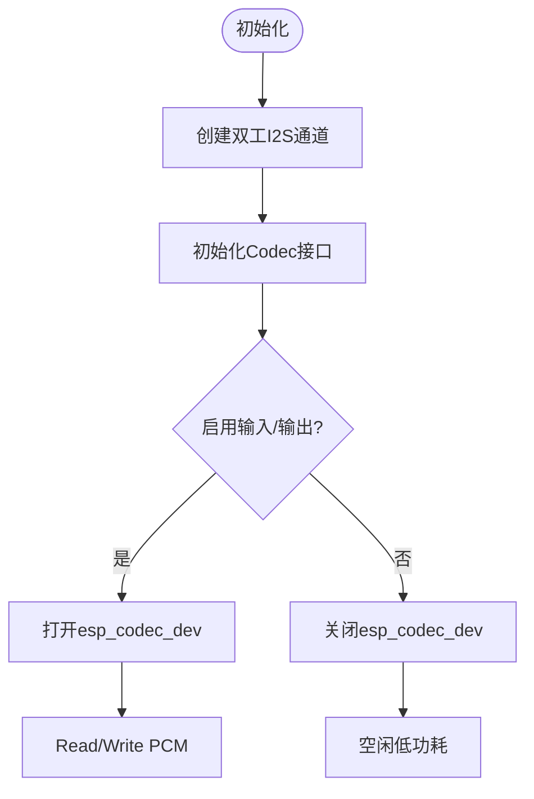
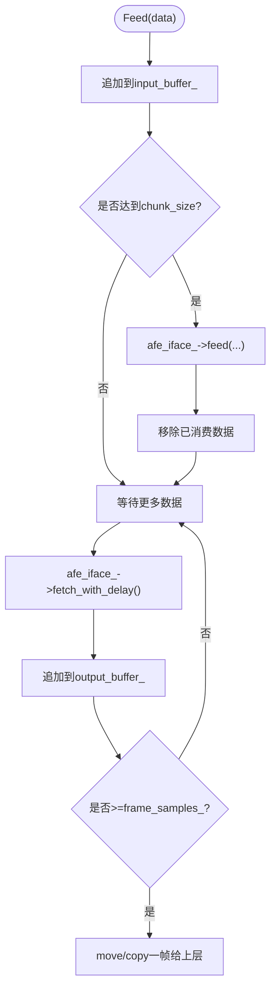
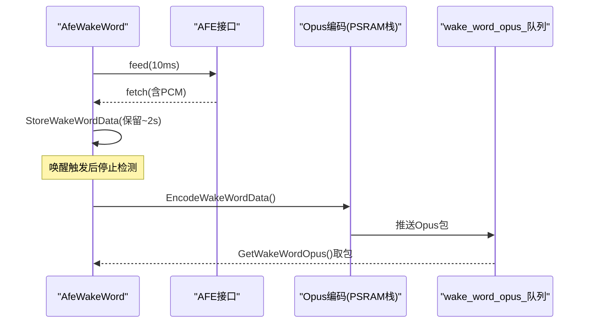
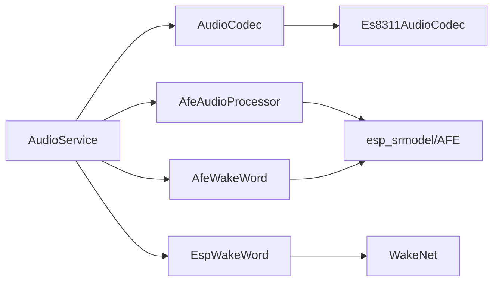

# 内存使用优化

<cite>
**本文引用的文件**   
- [audio_service.h](file://main\audio\audio_service.h)
- [audio_service.cc](file://main\audio\audio_service.cc)
- [audio_codec.h](file://main\audio\audio_codec.h)
- [audio_codec.cc](file://main\audio\audio_codec.cc)
- [es8311_audio_codec.h](file://main\audio\codecs\es8311_audio_codec.h)
- [es8311_audio_codec.cc](file://main\audio\codecs\es8311_audio_codec.cc)
- [afe_audio_processor.h](file://main\audio\processors\afe_audio_processor.h)
- [afe_audio_processor.cc](file://main\audio\processors\afe_audio_processor.cc)
- [afe_wake_word.h](file://main\audio\wake_words\afe_wake_word.h)
- [afe_wake_word.cc](file://main\audio\wake_words\afe_wake_word.cc)
- [esp_wake_word.h](file://main\audio\wake_words\esp_wake_word.h)
- [esp_wake_word.cc](file://main\audio\wake_words\esp_wake_word.cc)
</cite>

## 目录
1. [简介](#简介)
2. [项目结构](#项目结构)
3. [核心组件](#核心组件)
4. [架构总览](#架构总览)
5. [详细组件分析](#详细组件分析)
6. [依赖关系分析](#依赖关系分析)
7. [性能与内存特征](#性能与内存特征)
8. [故障排查指南](#故障排查指南)
9. [结论](#结论)
10. [附录](#附录)

## 简介
本指南聚焦于音频处理流水线的内存优化，围绕缓冲区管理、对象生命周期、内存池策略、向量容器与智能指针的使用影响、内存碎片化预防与回收优化、不同音频格式/采样率下的内存占用特征、动态内存调整策略、内存泄漏检测方法与性能监控工具，以及针对 ESP32 芯片特性的最佳实践进行系统化分析与建议。文档中的实现细节均来源于仓库源码，并结合嵌入式实时系统的通用经验给出可操作的优化路径。

## 项目结构
本项目音频子系统位于 main/audio 下，包含编解码服务、硬件编解码器抽象、语音前端处理器（AFE）与唤醒词模块。关键文件如下：
- 音频服务：负责任务调度、队列缓冲、Opus 编解码、重采样、电源管理与回调分发
- 编解码器抽象：统一 I2S/Codec 的输入输出接口
- AFE 处理器：降噪、VAD、AEC 等前端处理
- 唤醒词：基于 AFE 或轻量 WakeNet 的唤醒检测与可选编码

图表来源
- [audio_service.h:105-195](file://main\audio\audio_service.h#L105-L195)
- [audio_codec.h:17-62](file://main\audio\audio_codec.h#L17-L62)
- [es8311_audio_codec.h:13-42](file://main\audio\codecs\es8311_audio_codec.h#L13-L42)
- [afe_audio_processor.h:17-48](file://main\audio\processors\afe_audio_processor.h#L17-L48)
- [afe_wake_word.h:22-63](file://main\audio\wake_words\afe_wake_word.h#L22-L63)
- [esp_wake_word.h:17-46](file://main\audio\wake_words\esp_wake_word.h#L17-L46)

章节来源
- [audio_service.h:105-195](file://main\audio\audio_service.h#L105-L195)
- [audio_codec.h:17-62](file://main\audio\audio_codec.h#L17-L62)
- [es8311_audio_codec.h:13-42](file://main\audio\codecs\es8311_audio_codec.h#L13-L42)
- [afe_audio_processor.h:17-48](file://main\audio\processors\afe_audio_processor.h#L17-L48)
- [afe_wake_word.h:22-63](file://main\audio\wake_words\afe_wake_word.h#L22-L63)
- [esp_wake_word.h:17-46](file://main\audio\wake_words\esp_wake_word.h#L17-L46)

## 核心组件
- AudioService：维护多队列（解码、发送、播放、测试）、Opus 编解码、输入/输出重采样、事件组与定时器驱动的任务协作；提供 VAD 状态回调与唤醒词集成。
- AudioCodec 抽象与 Es8311AudioCodec：封装 I2S 双工通道与 Codec 设备生命周期，按需打开/关闭设备以降低功耗与内存占用。
- AfeAudioProcessor：基于 AFE 的前端处理，内部维护输入/输出环形缓冲，按帧大小切分并回调上层。
- AfeWakeWord/EspWakeWord：唤醒检测与可选 PCM->Opus 离线编码，前者在 PSRAM 上分配任务栈以规避内部 RAM 不足。

章节来源
- [audio_service.cc:125-167](file://main\audio\audio_service.cc#L125-L167)
- [audio_service.cc:327-446](file://main\audio\audio_service.cc#L327-L446)
- [audio_codec.cc:17-27](file://main\audio\audio_codec.cc#L17-L27)
- [es8311_audio_codec.cc:100-156](file://main\audio\codecs\es8311_audio_codec.cc#L100-L156)
- [afe_audio_processor.cc:13-75](file://main\audio\processors\afe_audio_processor.cc#L13-L75)
- [afe_wake_word.cc:172-253](file://main\audio\wake_words\afe_wake_word.cc#L172-L253)

## 架构总览
音频数据流分为两条主路径：
- 上行：麦克风 -> 预处理(AFE/唤醒) -> Opus 编码 -> 发送队列 -> 网络
- 下行：网络 -> 解码队列 -> Opus 解码 -> 重采样 -> 播放队列 -> 扬声器

图表来源
- [audio_service.cc:230-288](file://main\audio\audio_service.cc#L230-L288)
- [audio_service.cc:327-446](file://main\audio\audio_service.cc#L327-L446)
- [audio_service.cc:290-325](file://main\audio\audio_service.cc#L290-L325)
- [afe_audio_processor.cc:135-187](file://main\audio\processors\afe_audio_processor.cc#L135-L187)

## 详细组件分析

### AudioService 内存模型与任务协作
- 队列与缓冲
  - 解码队列、发送队列、播放队列、测试队列均为 std::deque<std::unique_ptr<AudioStreamPacket>>，避免频繁拷贝，采用移动语义传递数据包。
  - 编码/播放任务队列使用 std::deque<std::unique_ptr<AudioTask>>，其中 AudioTask 内嵌 std::vector<int16_t> 作为 PCM 缓冲。
- 线程同步
  - 全局互斥 audio_queue_mutex_ + 条件变量 audio_queue_cv_ 协调三任务（输入、输出、编解码）。
  - 解码器操作使用独立 decoder_mutex_ 保护，避免阻塞其他队列。
- 重采样
  - 输入侧：当 codec 输入采样率非 16k 时，创建 esp_ae_rate_cvt_handle_t 进行降采样到 16k。
  - 输出侧：当解码采样率与硬件输出不一致时，动态重建 output_resampler_。
- 资源生命周期
  - 构造/析构中创建/销毁事件组、Opus 编解码器、重采样器；Stop() 清空所有队列并通知等待者。
- 电源管理
  - 周期性定时器检查最近输入/输出时间，超过阈值自动关闭 Codec 输入/输出以降低功耗。

图表来源
- [audio_service.h:105-195](file://main\audio\audio_service.h#L105-L195)
- [audio_codec.h:17-62](file://main\audio\audio_codec.h#L17-L62)
- [afe_audio_processor.h:17-48](file://main\audio\processors\afe_audio_processor.h#L17-L48)

章节来源
- [audio_service.h:39-76](file://main\audio\audio_service.h#L39-L76)
- [audio_service.cc:62-123](file://main\audio\audio_service.cc#L62-L123)
- [audio_service.cc:169-182](file://main\audio\audio_service.cc#L169-L182)
- [audio_service.cc:448-482](file://main\audio\audio_service.cc#L448-L482)
- [audio_service.cc:682-698](file://main\audio\audio_service.cc#L682-L698)

### 编解码器抽象与 Es8311 实现
- AudioCodec 抽象了 I2S 读写的统一接口，默认 OutputData/InputData 直接调用底层 Write/Read。
- Es8311AudioCodec 创建双工 I2S 通道，按需打开/关闭 esp_codec_dev 实例，控制 PA 引脚电平，降低空闲功耗。
- DMA 描述符与帧数常量用于平衡吞吐与内存占用。

图表来源
- [es8311_audio_codec.cc:100-156](file://main\audio\codecs\es8311_audio_codec.cc#L100-L156)
- [es8311_audio_codec.cc:166-188](file://main\audio\codecs\es8311_audio_codec.cc#L166-L188)
- [audio_codec.cc:17-27](file://main\audio\audio_codec.cc#L17-L27)

章节来源
- [audio_codec.h:17-62](file://main\audio\audio_codec.h#L17-L62)
- [audio_codec.cc:17-27](file://main\audio\audio_codec.cc#L17-L27)
- [es8311_audio_codec.cc:100-156](file://main\audio\codecs\es8311_audio_codec.cc#L100-L156)
- [es8311_audio_codec.cc:166-188](file://main\audio\codecs\es8311_audio_codec.cc#L166-L188)

### AFE 处理器内存与缓冲策略
- 输入缓冲 input_buffer_ 累积小片段，按 afe_iface_->get_feed_chunksize 切块喂入 AFE。
- 输出缓冲 output_buffer_ 聚合 AFE 返回帧，按固定 frame_samples_ 切割后通过 move 语义交给上层，减少拷贝。
- 启动时预分配 output_buffer_.reserve(frame_samples_) 以降低扩容开销。
- 停止时 reset_buffer 并清空输入缓冲，避免残留数据导致溢出。

图表来源
- [afe_audio_processor.cc:91-107](file://main\audio\processors\afe_audio_processor.cc#L91-L107)
- [afe_audio_processor.cc:135-187](file://main\audio\processors\afe_audio_processor.cc#L135-L187)

章节来源
- [afe_audio_processor.cc:13-75](file://main\audio\processors\afe_audio_processor.cc#L13-L75)
- [afe_audio_processor.cc:91-107](file://main\audio\processors\afe_audio_processor.cc#L91-L107)
- [afe_audio_processor.cc:135-187](file://main\audio\processors\afe_audio_processor.cc#L135-L187)

### 唤醒词模块内存与编码
- AfeWakeWord：
  - 使用 event_group 控制检测任务，输入缓冲 input_buffer_ 按 chunk 喂入 AFE。
  - 保留约 2 秒 PCM 历史用于后续编码，超出则丢弃最旧片段。
  - 编码阶段在 PSRAM 分配任务栈，避免内部 RAM 不足；将 PCM 合并为连续缓冲并按帧编码，结果入队 wake_word_opus_。
- EspWakeWord：
  - 轻量级唤醒，不执行离线编码；输入缓冲按 chunk 推进，检测到唤醒后回调并清理缓冲。

图表来源
- [afe_wake_word.cc:135-161](file://main\audio\wake_words\afe_wake_word.cc#L135-L161)
- [afe_wake_word.cc:163-170](file://main\audio\wake_words\afe_wake_word.cc#L163-L170)
- [afe_wake_word.cc:172-253](file://main\audio\wake_words\afe_wake_word.cc#L172-L253)
- [esp_wake_word.cc:62-96](file://main\audio\wake_words\esp_wake_word.cc#L62-L96)

章节来源
- [afe_wake_word.h:22-63](file://main\audio\wake_words\afe_wake_word.h#L22-L63)
- [afe_wake_word.cc:135-161](file://main\audio\wake_words\afe_wake_word.cc#L135-L161)
- [afe_wake_word.cc:172-253](file://main\audio\wake_words\afe_wake_word.cc#L172-L253)
- [esp_wake_word.h:17-46](file://main\audio\wake_words\esp_wake_word.h#L17-L46)
- [esp_wake_word.cc:62-96](file://main\audio\wake_words\esp_wake_word.cc#L62-L96)

## 依赖关系分析
- AudioService 依赖 AudioCodec 完成硬件 I/O，依赖 AFE/WakeWord 完成前端处理，依赖 Opus 库完成压缩。
- Es8311AudioCodec 依赖 ESP-IDF 的 i2s 与 codec_dev 接口。
- AFE 与唤醒词模块依赖 esp_srmodel 与 AFE 运行时。

图表来源
- [audio_service.h:105-195](file://main\audio\audio_service.h#L105-L195)
- [es8311_audio_codec.h:13-42](file://main\audio\codecs\es8311_audio_codec.h#L13-L42)
- [afe_audio_processor.h:17-48](file://main\audio\processors\afe_audio_processor.h#L17-L48)
- [afe_wake_word.h:22-63](file://main\audio\wake_words\afe_wake_word.h#L22-L63)
- [esp_wake_word.h:17-46](file://main\audio\wake_words\esp_wake_word.h#L17-L46)

章节来源
- [audio_service.h:105-195](file://main\audio\audio_service.h#L105-L195)
- [es8311_audio_codec.h:13-42](file://main\audio\codecs\es8311_audio_codec.h#L13-L42)
- [afe_audio_processor.h:17-48](file://main\audio\processors\afe_audio_processor.h#L17-L48)
- [afe_wake_word.h:22-63](file://main\audio\wake_words\afe_wake_word.h#L22-L63)
- [esp_wake_word.h:17-46](file://main\audio\wake_words\esp_wake_word.h#L17-L46)

## 性能与内存特征

### 缓冲区与队列容量
- 发送/解码队列上限由 OPUS 帧时长决定，典型 60ms 帧对应每队列约 40 个包，避免过大延迟与内存膨胀。
- 编码/播放任务队列限制较小（2），防止上游堆积造成抖动。

章节来源
- [audio_service.h:39-46](file://main\audio\audio_service.h#L39-L46)
- [audio_service.cc:327-334](file://main\audio\audio_service.cc#L327-L334)

### 向量容器与智能指针的影响
- 使用 std::vector<int16_t> 承载 PCM，配合 reserve/move 减少重复分配与拷贝。
- 使用 std::unique_ptr 管理 packet/task 生命周期，避免手动释放遗漏。
- 注意：在高频路径中，vector 的 push_back/insert 可能引发扩容；建议在已知尺寸场景使用 reserve 或复用缓冲。

章节来源
- [audio_service.cc:484-504](file://main\audio\audio_service.cc#L484-L504)
- [afe_audio_processor.cc:17-18](file://main\audio\processors\afe_audio_processor.cc#L17-L18)
- [afe_audio_processor.cc:166-184](file://main\audio\processors\afe_audio_processor.cc#L166-L184)

### 重采样与动态配置
- 输入侧：仅在需要时将硬件采样率转换到 16k，避免不必要的计算与临时缓冲。
- 输出侧：根据解码采样率动态重建 resampler，确保与硬件输出一致。

章节来源
- [audio_service.cc:86-93](file://main\audio\audio_service.cc#L86-L93)
- [audio_service.cc:448-482](file://main\audio\audio_service.cc#L448-L482)

### 不同格式/采样率的内存占用
- PCM 单声道 16bit：每毫秒 16 字节（16kHz）。
- Opus 60ms 帧：通常远小于同时长 PCM，显著降低网络传输与队列内存占用。
- 高采样率（如 48kHz）会线性增加 PCM 缓冲与重采样中间缓冲大小。

章节来源
- [audio_service.h:65-76](file://main\audio\audio_service.h#L65-L76)
- [audio_service.cc:350-380](file://main\audio\audio_service.cc#L350-L380)

### 动态内存调整策略
- 根据网络状况与 CPU 负载，动态调整 OPUS 帧时长（5/10/20/40/60/80/100/120ms）以平衡延迟与带宽。
- 在低内存平台优先选择较大帧长以减少队列项数量与锁竞争。

章节来源
- [audio_service.h:55-63](file://main\audio\audio_service.h#L55-L63)

### 内存碎片化预防与回收优化
- 预分配：对已知尺寸的缓冲使用 reserve；对固定大小的 packet/task 尽量复用。
- 批量移动：使用 std::move 转移 vector 所有权，避免深拷贝。
- 及时释放：Stop/Reset 时清空队列并重置解码器，避免长期持有大对象。
- 避免频繁小对象分配：将小片段合并后再处理（如唤醒词编码前的 PCM 拼接）。

章节来源
- [audio_service.cc:169-182](file://main\audio\audio_service.cc#L169-L182)
- [afe_audio_processor.cc:17-18](file://main\audio\processors\afe_audio_processor.cc#L17-L18)
- [afe_wake_word.cc:212-240](file://main\audio\wake_words\afe_wake_word.cc#L212-L240)

### ESP32 特性与最佳实践
- PSRAM 利用：唤醒词编码任务栈分配在 PSRAM，避免内部 RAM 不足。
- 任务栈大小：为 CPU 密集任务（如 Opus 编码）分配足够栈空间，防止栈溢出。
- 定时器与电源管理：无 IO 活动时关闭 Codec 输入/输出，降低功耗与总线占用。

章节来源
- [afe_wake_word.cc:172-182](file://main\audio\wake_words\afe_wake_word.cc#L172-L182)
- [audio_service.cc:125-167](file://main\audio\audio_service.cc#L125-L167)
- [audio_service.cc:682-698](file://main\audio\audio_service.cc#L682-L698)

## 故障排查指南
- 常见问题定位
  - 解码失败：检查 opus_decoder_ 是否已正确初始化与配置，确认 sample_rate/frame_duration 匹配。
  - 编码失败：确认 encoder_frame_size 与输入 PCM 长度一致，检查 outbuf_size 是否足够。
  - 重采样异常：切换模式时复位输入 resampler，避免缓存污染。
  - 队列满：适当增大队列上限或降低帧率/码率；检查下游消费速度。
- 日志与统计
  - 关注各阶段计数（input/decode/encode/playback_count）判断瓶颈位置。
  - 使用 IsIdle/WaitForPlaybackQueueEmpty 辅助诊断卡顿。
- 内存相关
  - 若出现堆碎片或 OOM，检查是否存在未释放的队列项或长时间持有的大缓冲。
  - 在唤醒词编码路径，确认 PSRAM 分配成功且任务栈足够。

章节来源
- [audio_service.cc:350-392](file://main\audio\audio_service.cc#L350-L392)
- [audio_service.cc:406-446](file://main\audio\audio_service.cc#L406-L446)
- [audio_service.cc:549-577](file://main\audio\audio_service.cc#L549-L577)
- [audio_service.cc:656-680](file://main\audio\audio_service.cc#L656-L680)
- [afe_wake_word.cc:172-182](file://main\audio\wake_words\afe_wake_word.cc#L172-L182)

## 结论
通过对音频服务、编解码器抽象、AFE 与唤醒词模块的深入分析，可以明确以下优化要点：
- 以队列与任务解耦上下游，结合条件变量与互斥量保证并发安全。
- 用 reserve/move 与 unique_ptr 降低拷贝与释放成本，提升实时性。
- 依据网络与算力动态调整 OPUS 帧长与队列容量，平衡延迟与内存。
- 充分利用 PSRAM 与电源管理，适配 ESP32 的资源约束。
- 建立完善的日志与统计机制，快速定位内存与性能问题。

## 附录
- 术语
  - AFE：音频前端（降噪、VAD、AEC 等）
  - Opus：低延迟音频编码格式
  - I2S：数字音频串行总线
- 参考实现路径
  - 音频服务与任务：[audio_service.cc](file://main\audio\audio_service.cc)
  - 编解码器抽象与实现：[audio_codec.cc](file://main\audio\audio_codec.cc), [es8311_audio_codec.cc](file://main\audio\codecs\es8311_audio_codec.cc)
  - AFE 处理器：[afe_audio_processor.cc](file://main\audio\processors\afe_audio_processor.cc)
  - 唤醒词模块：[afe_wake_word.cc](file://main\audio\wake_words\afe_wake_word.cc), [esp_wake_word.cc](file://main\audio\wake_words\esp_wake_word.cc)