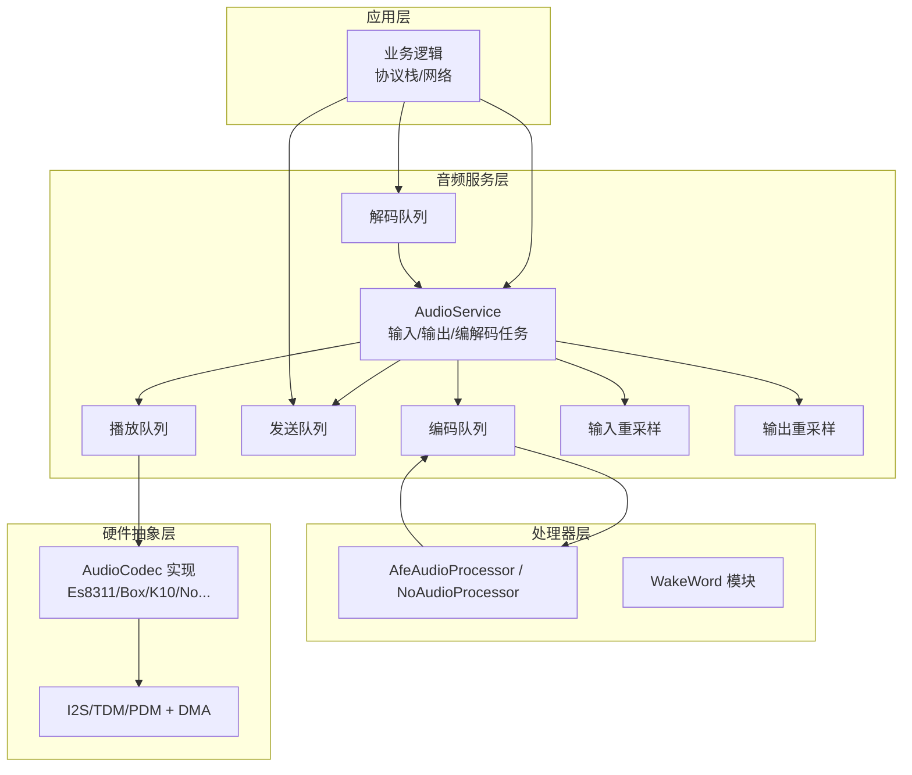
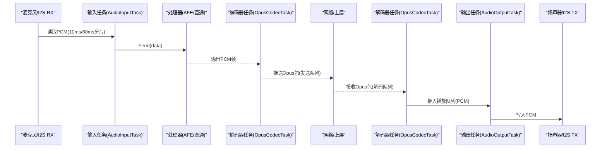
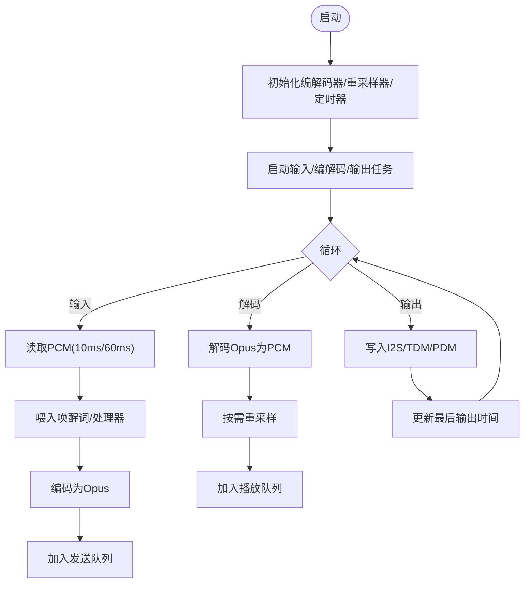
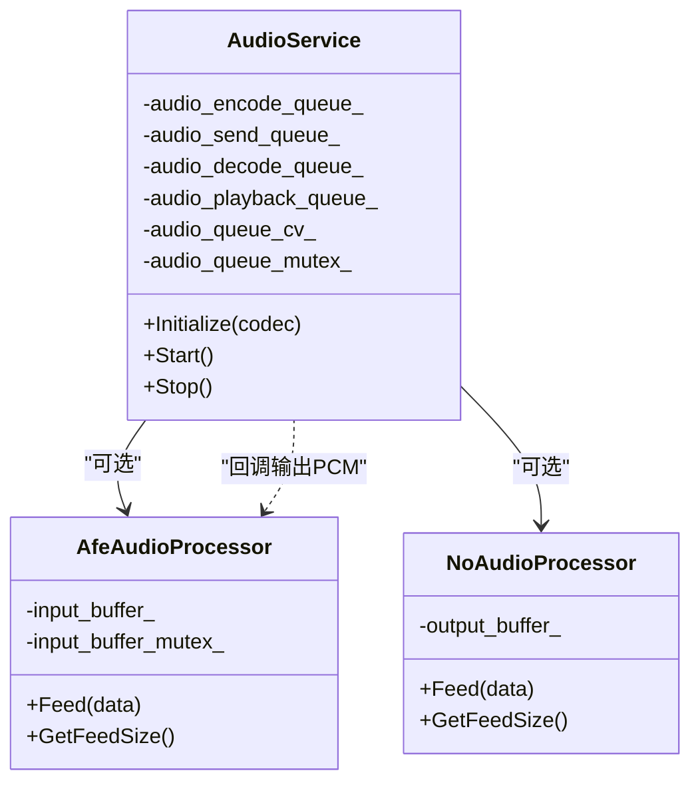
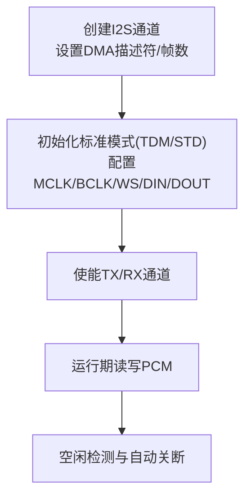
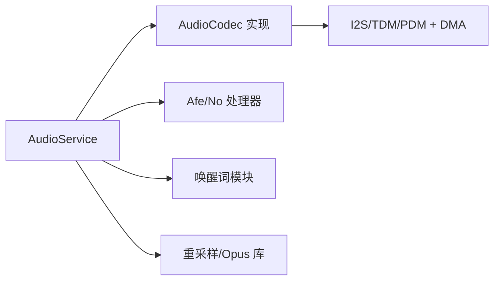

# 延迟优化技术

<cite>
**本文引用的文件**   
- [audio_service.h](file://main/audio/audio_service.h)
- [audio_service.cc](file://main/audio/audio_service.cc)
- [es8311_audio_codec.h](file://main/audio/codecs/es8311_audio_codec.h)
- [es8311_audio_codec.cc](file://main/audio/codecs/es8311_audio_codec.cc)
- [no_audio_codec.cc](file://main/audio/codecs/no_audio_codec.cc)
- [k10_audio_codec.cc](file://main/boards/df-k10/k10_audio_codec.cc)
- [box_audio_codec.cc](file://main/audio/codecs/box_audio_codec.cc)
- [afe_audio_processor.h](file://main/audio/processors/afe_audio_processor.h)
- [afe_audio_processor.cc](file://main/audio/processors/afe_audio_processor.cc)
- [no_audio_processor.h](file://main/audio/processors/no_audio_processor.h)
- [no_audio_processor.cc](file://main/audio/processors/no_audio_processor.cc)
</cite>

## 目录
1. [引言](#引言)
2. [项目结构](#项目结构)
3. [核心组件](#核心组件)
4. [架构总览](#架构总览)
5. [详细组件分析](#详细组件分析)
6. [依赖关系分析](#依赖关系分析)
7. [性能与延迟特性](#性能与延迟特性)
8. [端到端延迟测量与瓶颈定位](#端到端延迟测量与瓶颈定位)
9. [故障排查指南](#故障排查指南)
10. [结论](#结论)
11. [附录：配置与最佳实践清单](#附录配置与最佳实践清单)

## 引言
本技术文档聚焦于在 ESP32 平台上实现低延迟音频流水线的关键技术与工程实践，围绕双缓冲、异步处理、DMA 传输、任务优先级与核心绑定、以及实时操作系统（FreeRTOS）调度策略展开。文档结合仓库中音频服务、编解码器驱动与处理器模块的实现，给出可操作的优化方案与验证方法，帮助读者在不同应用场景下达成更低的端到端延迟与更稳定的吞吐表现。

## 项目结构
本项目采用分层组织方式：
- 音频服务层：负责 I/O 调度、队列编排、编码/解码、重采样与唤醒词/语音处理集成
- 编解码器抽象层：封装不同硬件 Codec 的 I2S/TDM/PDM 接口与 DMA 配置
- 处理器层：提供 AFE 语音增强或直通模式的数据处理路径
- 唤醒词模块：支持多种唤醒模型与数据编码输出

图表来源
- [audio_service.h:28-44](file://main/audio/audio_service.h#L28-L44)
- [audio_service.cc:125-167](file://main/audio/audio_service.cc#L125-L167)
- [es8311_audio_codec.cc:100-156](file://main/audio/codecs/es8311_audio_codec.cc#L100-L156)

章节来源
- [audio_service.h:28-44](file://main/audio/audio_service.h#L28-L44)
- [audio_service.cc:125-167](file://main/audio/audio_service.cc#L125-L167)

## 核心组件
- AudioService：管理输入/输出任务、Opus 编解码任务、队列与事件组；负责重采样、时间戳传递、电源状态管理与回调分发
- AudioCodec 系列：封装具体硬件的 I2S/TDM/PDM 通道创建、DMA 描述符与帧数配置、设备开关与音量控制
- AfeAudioProcessor/NoAudioProcessor：前者为 AFE 语音增强路径，后者为直通路径，均按固定帧长聚合 PCM 并回调上层
- WakeWord 模块：采集音频流、检测唤醒词并输出 Opus 片段

章节来源
- [audio_service.h:105-195](file://main/audio/audio_service.h#L105-L195)
- [audio_service.cc:62-123](file://main/audio/audio_service.cc#L62-L123)
- [afe_audio_processor.h:17-46](file://main/audio/processors/afe_audio_processor.h#L17-L46)
- [no_audio_processor.h:11-33](file://main/audio/processors/no_audio_processor.h#L11-L33)

## 架构总览
下图展示从麦克风到扬声器/网络的完整数据流，包括任务划分、队列边界与编解码位置。

图表来源
- [audio_service.cc:230-288](file://main/audio/audio_service.cc#L230-L288)
- [audio_service.cc:327-446](file://main/audio/audio_service.cc#L327-L446)
- [audio_service.cc:290-325](file://main/audio/audio_service.cc#L290-L325)

## 详细组件分析

### 音频服务与任务流水线
- 任务划分
  - 输入任务：周期读取 PCM，按 10ms 喂给唤醒词与处理器，或按 60ms 进入测试路径
  - 编解码任务：统一处理编码与解码，避免热点路径阻塞 I/O
  - 输出任务：从播放队列取 PCM 并写回硬件
- 队列与背压
  - 编码/发送/解码/播放队列均有上限，使用条件变量进行等待与通知，防止溢出与抖动放大
- 时间戳与服务器 AEC
  - 输出侧记录时间戳，编码侧复用该时间戳，便于服务端做回声消除对齐
- 动态重采样
  - 输入/输出路径根据实际采样率动态创建重采样器，减少跨速率带来的额外时延

图表来源
- [audio_service.cc:125-167](file://main/audio/audio_service.cc#L125-L167)
- [audio_service.cc:327-446](file://main/audio/audio_service.cc#L327-L446)
- [audio_service.cc:290-325](file://main/audio/audio_service.cc#L290-L325)

章节来源
- [audio_service.h:28-44](file://main/audio/audio_service.h#L28-L44)
- [audio_service.cc:125-167](file://main/audio/audio_service.cc#L125-L167)
- [audio_service.cc:327-446](file://main/audio/audio_service.cc#L327-L446)
- [audio_service.cc:290-325](file://main/audio/audio_service.cc#L290-L325)

### 双缓冲与异步处理机制
- 双缓冲体现
  - 处理器内部维护输入缓冲，按 AFE 要求的 chunk size 累积后一次性 feed，降低频繁调用开销
  - 编解码任务通过独立队列解耦 I/O 与 CPU 密集计算，形成“生产者-消费者”异步流水线
- 异步与锁
  - 输入任务与处理器之间通过回调与互斥保护共享缓冲，避免竞态
  - 编解码任务对解码器句柄加锁，保证线程安全
- 背压与稳定性
  - 各队列长度限制配合条件变量，确保系统在高负载下不丢帧、不爆栈

图表来源
- [audio_service.h:105-195](file://main/audio/audio_service.h#L105-L195)
- [afe_audio_processor.h:17-46](file://main/audio/processors/afe_audio_processor.h#L17-L46)
- [no_audio_processor.h:11-33](file://main/audio/processors/no_audio_processor.h#L11-L33)

章节来源
- [afe_audio_processor.cc:91-126](file://main/audio/processors/afe_audio_processor.cc#L91-L126)
- [no_audio_processor.cc:12-37](file://main/audio/processors/no_audio_processor.cc#L12-L37)
- [audio_service.cc:327-446](file://main/audio/audio_service.cc#L327-L446)

### DMA 传输配置与硬件特性利用
- I2S/TDM/PDM 通道创建
  - 设置 dma_desc_num 与 dma_frame_num 以平衡内存占用与中断频率
  - 启用 auto_clear_after_cb 减少手动清理开销
- 时钟与位宽
  - MCLK 倍频选择（如 256x），16bit 数据位宽，标准/左对齐等格式匹配 Codec
- 典型实现参考
  - Es8311 双工通道创建与使能
  - K10 板卡 I2S 配置示例
  - Box 多 Codec 组合（ES8311+ES7210）TDM 配置
  - PDM 上采样与时钟重配（部分板卡）

图表来源
- [es8311_audio_codec.cc:100-156](file://main/audio/codecs/es8311_audio_codec.cc#L100-L156)
- [k10_audio_codec.cc:71-110](file://main/boards/df-k10/k10_audio_codec.cc#L71-L110)
- [box_audio_codec.cc:105-146](file://main/audio/codecs/box_audio_codec.cc#L105-L146)
- [no_audio_codec.cc:254-289](file://main/audio/codecs/no_audio_codec.cc#L254-L289)

章节来源
- [es8311_audio_codec.cc:100-156](file://main/audio/codecs/es8311_audio_codec.cc#L100-L156)
- [k10_audio_codec.cc:71-110](file://main/boards/df-k10/k10_audio_codec.cc#L71-L110)
- [box_audio_codec.cc:105-146](file://main/audio/codecs/box_audio_codec.cc#L105-L146)
- [no_audio_codec.cc:254-289](file://main/audio/codecs/no_audio_codec.cc#L254-L289)

### 任务优先级与CPU核心分配
- 输入任务：高优先级（例如 8），必要时绑定至特定核心以降低抖动
- 编解码任务：中等优先级（例如 2），集中处理 CPU 密集操作
- 输出任务：较低优先级（例如 4），但需稳定及时消费播放队列
- 建议
  - 将输入与编解码任务分别绑定到不同核心，避免互相抢占
  - 保持输出任务不被长时间阻塞，必要时提升其优先级或减小临界区

章节来源
- [audio_service.cc:131-167](file://main/audio/audio_service.cc#L131-L167)

### 处理器与唤醒词路径
- AFE 处理器
  - 按 AFE 接口要求的最小 feed 块大小累积数据，批量送入以降低上下文切换成本
  - 提供 VAD 状态回调，便于上层快速响应
- 直通处理器
  - 简单地将 PCM 按帧长聚合输出，适合无 AFE 场景
- 唤醒词
  - 支持多模型与编码输出，可在检测到唤醒词后触发后续流程

章节来源
- [afe_audio_processor.cc:82-126](file://main/audio/processors/afe_audio_processor.cc#L82-L126)
- [no_audio_processor.cc:1-39](file://main/audio/processors/no_audio_processor.cc#L1-L39)

## 依赖关系分析
- 组件耦合
  - AudioService 依赖 AudioCodec 抽象、处理器与唤醒词接口
  - 编解码器实现依赖底层 I2S/TDM/PDM 驱动与 DMA
- 外部库
  - ESP-IDF I2S/Codec Dev、ESP-Audio-Engine 重采样、Opus 编解码
- 可能的环路与风险
  - 处理器回调与队列写入需在互斥保护下进行
  - 解码器句柄访问需要加锁

图表来源
- [audio_service.h:105-195](file://main/audio/audio_service.h#L105-L195)
- [es8311_audio_codec.h:13-40](file://main/audio/codecs/es8311_audio_codec.h#L13-L40)

章节来源
- [audio_service.h:105-195](file://main/audio/audio_service.h#L105-L195)
- [es8311_audio_codec.h:13-40](file://main/audio/codecs/es8311_audio_codec.h#L13-L40)

## 性能与延迟特性
- 帧长与抖动
  - 默认 60ms 帧长兼顾带宽与延迟；若需更低延迟，可降低帧长并评估 CPU 与网络影响
- 队列深度
  - 合理设置最大队列长度，避免积压导致尾延迟增大
- 重采样
  - 仅在采样率不一致时启用，减少不必要的计算
- DMA 参数
  - 适当增加 DMA 描述符数量可降低中断频率，但会增加首包延迟；需权衡

[本节为通用指导，无需源码引用]

## 端到端延迟测量与瓶颈定位
- 测量点建议
  - 输入侧：记录首次读取时间戳
  - 编码侧：记录打包完成时间戳
  - 输出侧：记录写入 I2S 的时间戳
  - 网络往返：在上层协议栈打点
- 指标
  - 端到端延迟 = 输出时间戳 - 输入时间戳
  - 各阶段耗时 = 相邻打点差值
- 瓶颈识别
  - 若编码队列长期接近上限，说明 CPU 不足或帧长过小
  - 若播放队列堆积，可能是输出任务被抢占或 DMA 写入慢
  - 若重采样频繁重建，可能采样率切换过于频繁

章节来源
- [audio_service.cc:327-446](file://main/audio/audio_service.cc#L327-L446)
- [audio_service.cc:290-325](file://main/audio/audio_service.cc#L290-L325)

## 故障排查指南
- 常见问题
  - 解码失败：检查解码器是否已正确配置与重置
  - 编码失败：确认帧尺寸与编码器期望一致
  - 播放卡顿：检查播放队列是否为空、输出任务是否被阻塞
  - 功耗异常：确认空闲检测与自动关闭逻辑生效
- 定位手段
  - 观察调试统计计数（输入/解码/编码/播放次数）
  - 打印队列长度与等待条件变化
  - 使用音频调试器导出原始 PCM 进行离线分析

章节来源
- [audio_service.cc:327-446](file://main/audio/audio_service.cc#L327-L446)
- [audio_service.cc:682-698](file://main/audio/audio_service.cc#L682-L698)

## 结论
通过在输入/编解码/输出三段引入独立任务与队列，结合 DMA 与重采样优化，可以在 ESP32 平台上实现稳定且低延迟的音频流水线。针对不同的应用场景，可通过调整帧长、队列深度、任务优先级与核心绑定来进一步逼近目标延迟。建议在真实设备上建立端到端打点与可视化监控，持续迭代优化。

[本节为总结性内容，无需源码引用]

## 附录：配置与最佳实践清单
- 帧长与采样率
  - 优先使用 16kHz 单声道；如需更低延迟，尝试 10ms 帧长并评估 CPU 占用
- DMA 与 I2S
  - 合理设置 DMA 描述符与帧数；开启自动清理回调
  - 使用 256x MCLK 倍频，确保时钟稳定
- 任务与调度
  - 输入任务高优先级并可绑定核心；编解码任务居中；输出任务保持稳定
- 队列与背压
  - 限制队列长度并使用条件变量同步，避免溢出与抖动放大
- 重采样
  - 仅在必要时启用，并在模式切换时重置以避免缓存污染
- 电源与空闲
  - 启用空闲检测，自动关闭未使用的 I/O 通道以降低功耗

[本节为通用指导，无需源码引用]