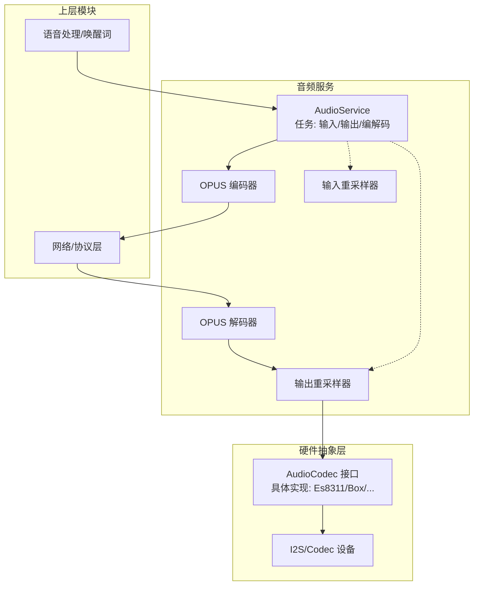
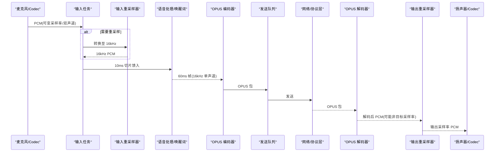
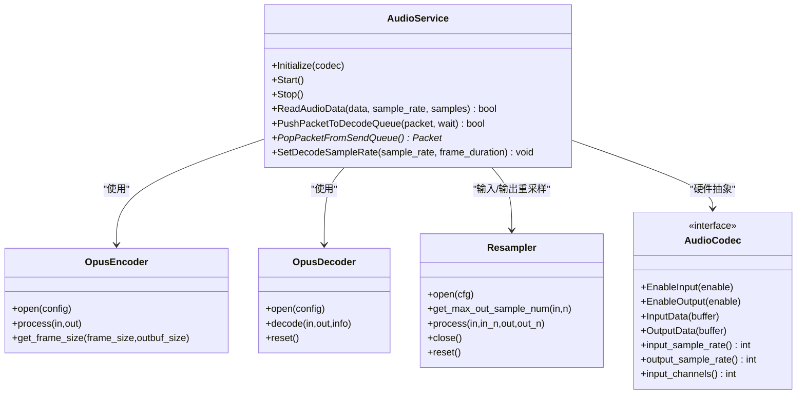
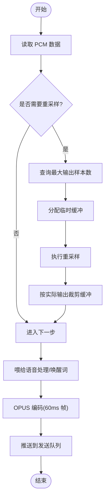
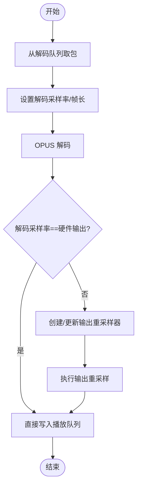

# 编解码器优化

<cite>
**本文引用的文件**   
- [audio_service.h](file://main/audio/audio_service.h)
- [audio_service.cc](file://main/audio/audio_service.cc)
- [es8311_audio_codec.h](file://main/audio/codecs/es8311_audio_codec.h)
- [box_audio_codec.h](file://main/audio/codecs/box_audio_codec.h)
- [atoms3r_echo_pyramid.cc](file://main/boards/atoms3r-echo-pyramid/atoms3r_echo_pyramid.cc)
</cite>

## 目录
1. [简介](#简介)
2. [项目结构](#项目结构)
3. [核心组件](#核心组件)
4. [架构总览](#架构总览)
5. [详细组件分析](#详细组件分析)
6. [依赖关系分析](#依赖关系分析)
7. [性能考量](#性能考量)
8. [故障排查指南](#故障排查指南)
9. [结论](#结论)
10. [附录](#附录)

## 简介
本指南聚焦于在 ESP32 系列平台上对 OPUS 编解码与输入输出重采样器的配置与优化，涵盖以下方面：
- OPUS 编码器/解码器关键参数（采样率、帧长、比特率、复杂度、VBR/DTX/FEC）对延迟、音质与 CPU 的影响
- 输入/输出重采样器算法选择与缓冲区管理策略
- 不同硬件平台下的最佳实践与差异点
- 初始化流程的性能分析与内存使用优化技巧

## 项目结构
本项目将音频采集、处理、编码、网络发送与播放路径解耦为多个任务与队列，OPUS 编解码与重采样集中在音频服务中实现。

图表来源
- [audio_service.h:28-76](file://main/audio/audio_service.h#L28-L76)
- [audio_service.cc:62-123](file://main/audio/audio_service.cc#L62-L123)
- [es8311_audio_codec.h:13-40](file://main/audio/codecs/es8311_audio_codec.h#L13-L40)
- [box_audio_codec.h:11-38](file://main/audio/codecs/box_audio_codec.h#L11-L38)

章节来源
- [audio_service.h:28-76](file://main/audio/audio_service.h#L28-L76)
- [audio_service.cc:62-123](file://main/audio/audio_service.cc#L62-L123)

## 核心组件
- AudioService：协调输入/输出任务与 OPUS 编解码任务，管理队列、事件组、定时器与资源生命周期
- OPUS 编码器/解码器：通过 ESP-IDF 的 opus 扩展 API 打开、配置与运行
- 重采样器：基于 esp_ae_rate_cvt 的输入/输出重采样，用于适配不同采样率
- 硬件 Codec 抽象：Es8311AudioCodec、BoxAudioCodec 等实现 I2S/Codec 设备的读写与通道控制

章节来源
- [audio_service.h:105-195](file://main/audio/audio_service.h#L105-L195)
- [audio_service.cc:62-123](file://main/audio/audio_service.cc#L62-L123)
- [es8311_audio_codec.h:13-40](file://main/audio/codecs/es8311_audio_codec.h#L13-L40)
- [box_audio_codec.h:11-38](file://main/audio/codecs/box_audio_codec.h#L11-L38)

## 架构总览
下图展示了从麦克风到扬声器/网络的端到端数据流，以及关键配置点。

图表来源
- [audio_service.cc:184-228](file://main/audio/audio_service.cc#L184-L228)
- [audio_service.cc:230-288](file://main/audio/audio_service.cc#L230-L288)
- [audio_service.cc:327-446](file://main/audio/audio_service.cc#L327-L446)
- [audio_service.cc:448-482](file://main/audio/audio_service.cc#L448-L482)

## 详细组件分析

### OPUS 编码器配置与调优
- 采样率：固定 16kHz，满足语音通话质量与低延迟需求
- 帧长度：默认 60ms，可通过宏定义调整；更短帧降低延迟但增加开销，更长帧提升压缩效率但增大延迟
- 比特率：自动模式，结合 VBR 动态调整；如需稳定带宽可改为固定比特率
- 应用模式：语音/音乐模式选择，语音场景建议“音频”模式
- 复杂度：较低复杂度适合低功耗 MCU，提高复杂度可改善压缩比但增加 CPU
- DTX/VBR/FEC：DTX 静音抑制节省带宽；VBR 自适应码率；FEC 在网络丢包时增强鲁棒性

关键位置
- 编码器配置宏与默认值
- 编码器打开与帧大小查询
- 编码过程调用与错误处理

章节来源
- [audio_service.h:65-76](file://main/audio/audio_service.h#L65-L76)
- [audio_service.cc:75-84](file://main/audio/audio_service.cc#L75-L84)
- [audio_service.cc:406-446](file://main/audio/audio_service.cc#L406-L446)

### OPUS 解码器配置与动态切换
- 采样率：根据网络侧或本地源决定，支持运行时切换
- 帧长度：与编码器一致，确保正确解析
- 动态重建：当目标采样率或帧长变化时，关闭并重新打开解码器实例
- 输出重采样：若解码采样率与硬件输出不一致，启用输出重采样器进行转换

关键位置
- 解码器配置宏与打开
- 动态切换逻辑与输出重采样器创建

章节来源
- [audio_service.cc:16-23](file://main/audio/audio_service.cc#L16-L23)
- [audio_service.cc:66-74](file://main/audio/audio_service.cc#L66-L74)
- [audio_service.cc:448-482](file://main/audio/audio_service.cc#L448-L482)

### 输入重采样器：算法与缓冲区管理
- 算法选择：复杂度设为中等，性能类型优先速度，兼顾实时性与 CPU 占用
- 缓冲区策略：先查询最大输出样本数，再分配临时缓冲，避免溢出与重复拷贝
- 多通道处理：保持与硬件输入通道数一致，必要时在后续阶段转为单声道
- 状态重置：在模式切换（如唤醒词/语音处理）间重置重采样器，防止缓存污染

关键位置
- 输入重采样配置与打开
- 读取与重采样流程
- 模式切换时的重置

章节来源
- [audio_service.cc:5-14](file://main/audio/audio_service.cc#L5-L14)
- [audio_service.cc:184-228](file://main/audio/audio_service.cc#L184-L228)
- [audio_service.cc:563-576](file://main/audio/audio_service.cc#L563-L576)

### 输出重采样器：对齐硬件采样率
- 触发条件：解码采样率与硬件输出采样率不一致时启用
- 缓冲区策略：同输入重采样，先查询最大输出样本数，再分配与裁剪
- 线程安全：解码与重采样在编解码任务中串行执行，避免竞争

关键位置
- 输出重采样器创建与配置
- 解码后重采样流程

章节来源
- [audio_service.cc:468-482](file://main/audio/audio_service.cc#L468-L482)
- [audio_service.cc:370-382](file://main/audio/audio_service.cc#L370-L382)

### 硬件平台差异与最佳实践
- ESP32S3/P4：支持 AFE 唤醒词与更高算力，可适当提高编码器复杂度或开启更多特性
- 典型板卡示例：部分板卡在输入/输出采样率、通道掩码与增益设置上存在差异，需按硬件配置
- 通用建议：
  - 语音通话：16kHz、60ms 帧、VBR+DTX、低复杂度
  - 弱网环境：开启 FEC，适当提高平均码率
  - 超低延迟：缩短帧长至 20ms，权衡 CPU 与带宽

章节来源
- [audio_service.cc:31-36](file://main/audio/audio_service.cc#L31-36)
- [atoms3r_echo_pyramid.cc:373-405](file://main/boards/atoms3r-echo-pyramid/atoms3r_echo_pyramid.cc#L373-L405)

## 依赖关系分析
- AudioService 依赖：
  - ESP-IDF opus 扩展（编码器/解码器）
  - esp_ae_rate_cvt（重采样）
  - AudioCodec 抽象（硬件驱动封装）
  - FreeRTOS 任务/队列/事件组/定时器
- 外部耦合：
  - 网络/协议层负责 OPUS 包的收发
  - 语音处理/唤醒词模块消费 16kHz 10ms 切片

图表来源
- [audio_service.h:105-195](file://main/audio/audio_service.h#L105-L195)
- [audio_service.cc:62-123](file://main/audio/audio_service.cc#L62-L123)
- [es8311_audio_codec.h:13-40](file://main/audio/codecs/es8311_audio_codec.h#L13-L40)
- [box_audio_codec.h:11-38](file://main/audio/codecs/box_audio_codec.h#L11-L38)

章节来源
- [audio_service.h:105-195](file://main/audio/audio_service.h#L105-L195)
- [audio_service.cc:62-123](file://main/audio/audio_service.cc#L62-L123)

## 性能考量
- 延迟与帧长
  - 60ms 帧平衡了压缩效率与延迟；若需更低延迟，可降至 20ms，但会增加 CPU 与包头开销
- 比特率与 VBR
  - 自动比特率+VBR 能根据内容动态调整；在弱网下可配合 FEC 提升鲁棒性
- 复杂度
  - 低复杂度适合 ESP32C3/C6 等资源受限平台；ESP32S3/P4 可适度提高复杂度以换取更好压缩比
- 重采样
  - 优先速度型算法，减少 CPU 抖动；合理预估输出缓冲大小，避免频繁扩容
- 任务与队列
  - 编解码任务独立，避免阻塞输入/输出；队列容量限制防止内存暴涨
- 电源管理
  - 无输入/输出活动时关闭 Codec，降低功耗

章节来源
- [audio_service.h:39-48](file://main/audio/audio_service.h#L39-L48)
- [audio_service.cc:125-167](file://main/audio/audio_service.cc#L125-L167)
- [audio_service.cc:682-698](file://main/audio/audio_service.cc#L682-L698)

## 故障排查指南
- 编码器失败
  - 现象：日志提示编码器未配置或帧尺寸不匹配
  - 排查：确认输入帧长度为预期值；检查编码器是否成功打开
- 解码失败
  - 现象：解码返回错误码
  - 排查：确认帧时长与采样率与编码器一致；必要时重置解码器
- 重采样异常
  - 现象：输出样本数异常或卡顿
  - 排查：检查 get_max_out_sample_num 返回值与实际输出裁剪；模式切换时调用 reset
- 硬件访问问题
  - 现象：I2S/Codec 读写出错
  - 排查：确认 EnableInput/EnableOutput 状态；检查采样率与通道配置是否与硬件一致

章节来源
- [audio_service.cc:406-446](file://main/audio/audio_service.cc#L406-L446)
- [audio_service.cc:365-392](file://main/audio/audio_service.cc#L365-L392)
- [audio_service.cc:196-207](file://main/audio/audio_service.cc#L196-L207)
- [audio_service.cc:563-576](file://main/audio/audio_service.cc#L563-L576)

## 结论
通过在 AudioService 中集中管理 OPUS 编解码与重采样，并结合硬件抽象层，可在多种 ESP32 平台上实现稳定的语音通信链路。推荐在语音场景采用 16kHz、60ms 帧、VBR+DTX、低复杂度的默认配置；在弱网环境下开启 FEC；在资源受限平台优先保证实时性与稳定性，在高算力平台可适度提升复杂度以获得更好的压缩效果。

## 附录

### 关键流程图：输入重采样与编码

图表来源
- [audio_service.cc:184-228](file://main/audio/audio_service.cc#L184-L228)
- [audio_service.cc:406-446](file://main/audio/audio_service.cc#L406-L446)

### 关键流程图：解码与输出重采样

图表来源
- [audio_service.cc:448-482](file://main/audio/audio_service.cc#L448-L482)
- [audio_service.cc:350-382](file://main/audio/audio_service.cc#L350-L382)