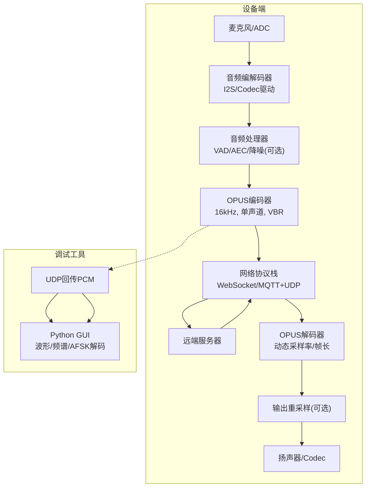
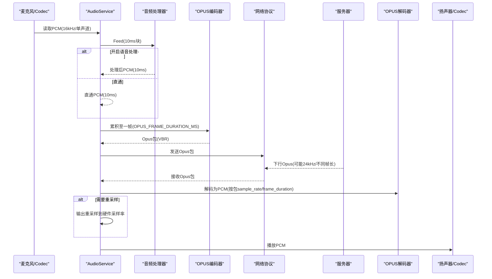
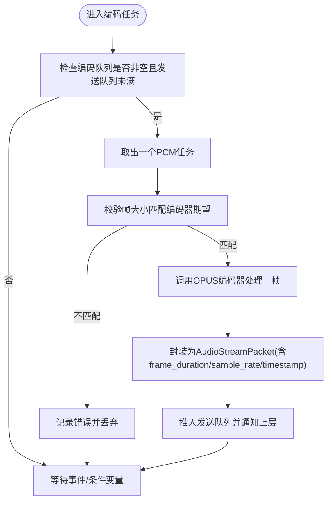
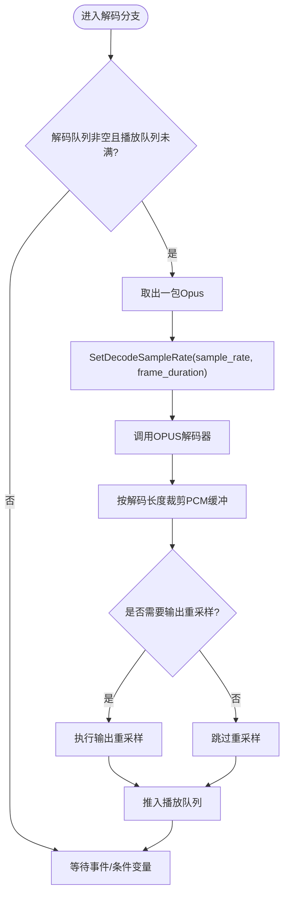
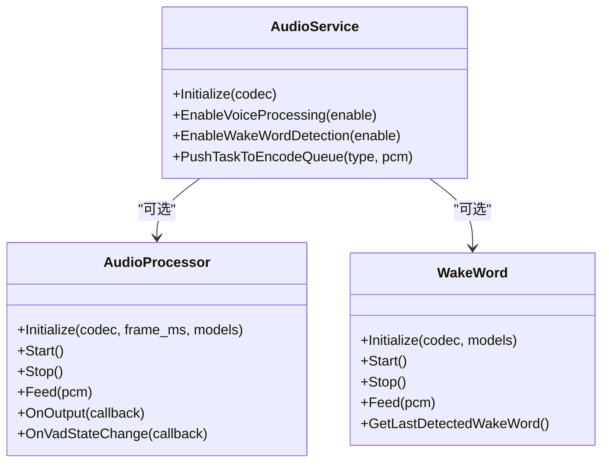
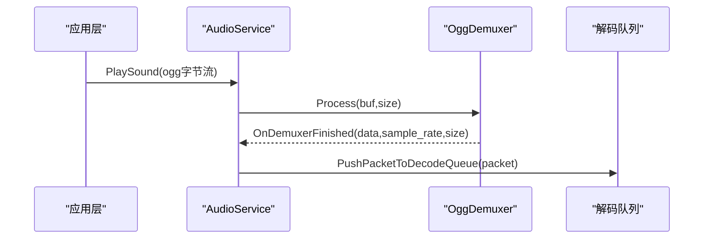
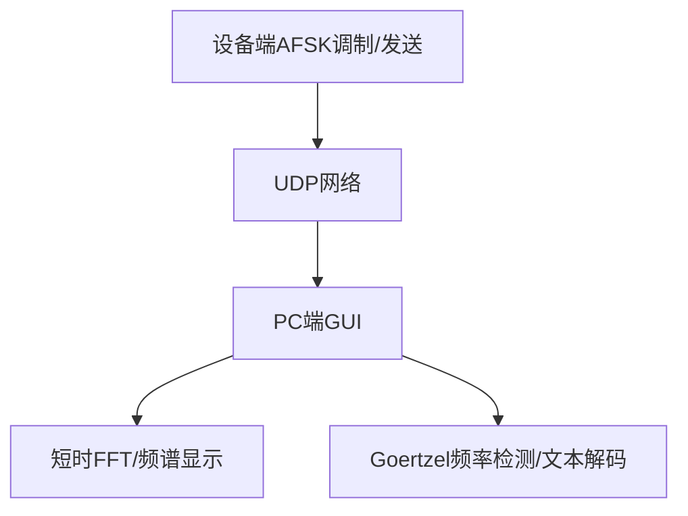
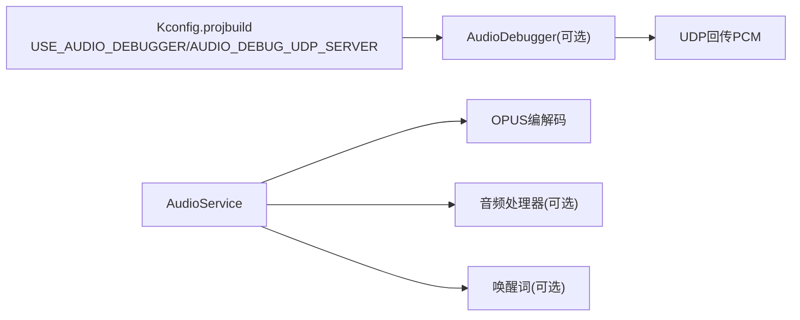
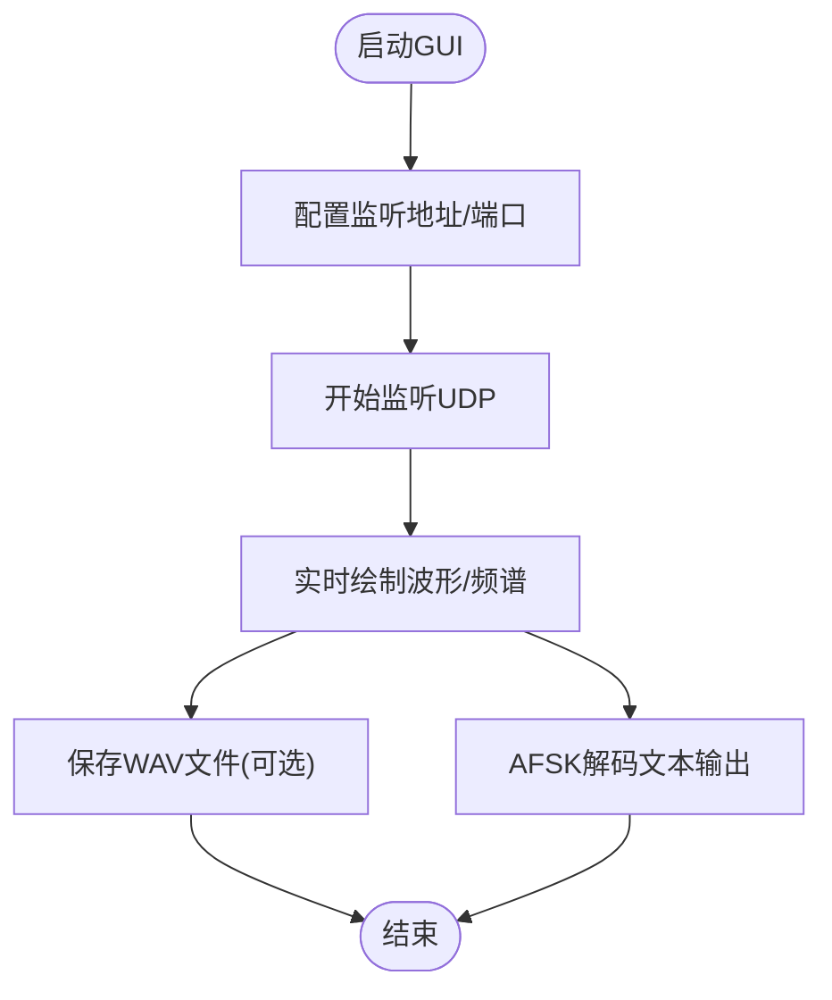

# 音质与性能平衡

<cite>
**本文引用的文件**   
- [README.md](file://README.md)
- [audio_service.h](file://main/audio/audio_service.h)
- [audio_service.cc](file://main/audio/audio_service.cc)
- [websocket_zh.md](file://docs/websocket_zh.md)
- [ogg_demuxer.cc](file://main/audio/demuxer/ogg_demuxer.cc)
- [afsk_demod.h](file://main/boards/common/afsk_demod.h)
- [afsk_demod.cc](file://main/boards/common/afsk_demod.cc)
- [graphic.py](file://scripts/acoustic_check/graphic.py)
- [main.py](file://scripts/acoustic_check/main.py)
- [readme.md](file://scripts/acoustic_check/readme.md)
- [Kconfig.projbuild](file://main/Kconfig.projbuild)
</cite>

## 目录
1. [简介](#简介)
2. [项目结构](#项目结构)
3. [核心组件](#核心组件)
4. [架构总览](#架构总览)
5. [详细组件分析](#详细组件分析)
6. [依赖关系分析](#依赖关系分析)
7. [性能与音质权衡指南](#性能与音质权衡指南)
8. [声学检查工具使用指南](#声学检查工具使用指南)
9. [故障排查](#故障排查)
10. [结论](#结论)

## 简介
本指南围绕“音质与性能的平衡”展开，聚焦以下目标：
- 解释关键音频质量指标（信噪比 SNR、总谐波失真 THD、频响）与系统性能（CPU、功耗、带宽、时延）的权衡关系。
- 给出不同场景下的最优配置建议，重点覆盖 OPUS 编码参数（帧时长、码率自适应 VBR、复杂度等）。
- 深入分析压缩算法选择对音质与带宽的影响，包括 OPUS 模式切换与码率自适应策略。
- 提供声学检查工具的使用方法（频谱分析、噪声检测、回声评估），并包含实际测试案例与基准测试方法。

## 项目结构
本项目在 ESP32 平台上实现语音交互链路，涉及采集、处理、编码、传输、解码与播放。与音质和性能相关的关键路径集中在音频服务与编解码模块，以及配套的声学调试工具链。

图表来源
- [audio_service.h:38-76](file://main/audio/audio_service.h#L38-L76)
- [audio_service.cc:62-123](file://main/audio/audio_service.cc#L62-L123)
- [audio_service.cc:327-446](file://main/audio/audio_service.cc#L327-L446)
- [audio_service.cc:448-482](file://main/audio/audio_service.cc#L448-L482)
- [websocket_zh.md:390-423](file://docs/websocket_zh.md#L390-L423)
- [graphic.py:23-109](file://scripts/acoustic_check/graphic.py#L23-L109)

章节来源
- [README.md:23-37](file://README.md#L23-L37)
- [audio_service.h:38-76](file://main/audio/audio_service.h#L38-L76)
- [audio_service.cc:62-123](file://main/audio/audio_service.cc#L62-L123)
- [websocket_zh.md:390-423](file://docs/websocket_zh.md#L390-L423)

## 核心组件
- 音频服务 AudioService：负责输入采集、唤醒词检测、语音处理、OPUS 编解码、队列调度、电源管理与回调通知。
- OPUS 编解码：上行采用 16kHz 单声道，默认帧时长 60ms，启用 VBR 与 DTX；下行支持动态采样率与帧长切换，必要时进行输出重采样。
- 音频处理器：可选项（AfeAudioProcessor/NoAudioProcessor），用于 VAD、AEC、降噪等，影响时延与 CPU 占用。
- 唤醒词模块：根据模型类型自动选择 AFE 或 ESP-WakeWord 实现。
- 调试通道：可选的音频调试器通过 UDP 回传 PCM，配合 Python GUI 进行实时波形/频谱显示与 AFSK 解码。

章节来源
- [audio_service.h:38-76](file://main/audio/audio_service.h#L38-L76)
- [audio_service.cc:62-123](file://main/audio/audio_service.cc#L62-L123)
- [audio_service.cc:327-446](file://main/audio/audio_service.cc#L327-L446)
- [audio_service.cc:448-482](file://main/audio/audio_service.cc#L448-L482)
- [audio_service.cc:579-604](file://main/audio/audio_service.cc#L579-L604)
- [audio_service.cc:700-726](file://main/audio/audio_service.cc#L700-L726)

## 架构总览
下图展示了从采集到播放的完整数据流，以及关键的质量与性能控制点。

图表来源
- [audio_service.cc:230-288](file://main/audio/audio_service.cc#L230-L288)
- [audio_service.cc:327-446](file://main/audio/audio_service.cc#L327-L446)
- [audio_service.cc:448-482](file://main/audio/audio_service.cc#L448-L482)
- [websocket_zh.md:390-423](file://docs/websocket_zh.md#L390-L423)

## 详细组件分析

### 组件A：OPUS 编码与码率自适应
- 上行编码参数
  - 采样率：16kHz，单声道，16bit
  - 帧时长：由宏定义控制，默认 60ms
  - 码率：ESP_OPUS_BITRATE_AUTO（VBR），启用 DTX 与 VBR
  - 复杂度：低复杂度（适合嵌入式）
- 下行解码参数
  - 动态适配包的 sample_rate 与 frame_duration
  - 若与硬件输出采样率不一致，则触发输出重采样
- 性能与音质权衡
  - 帧时长越短：时延越低，但每帧开销占比越高，整体码率可能上升
  - VBR：在安静段降低码率，节省带宽；在复杂段提升码率，改善音质
  - DTX：静音抑制，显著降低空闲期带宽
  - 复杂度：提高可改善编码效率与音质，但增加 CPU 占用

图表来源
- [audio_service.cc:394-446](file://main/audio/audio_service.cc#L394-L446)
- [audio_service.h:65-76](file://main/audio/audio_service.h#L65-L76)

章节来源
- [audio_service.h:38-76](file://main/audio/audio_service.h#L38-L76)
- [audio_service.cc:62-123](file://main/audio/audio_service.cc#L62-L123)
- [audio_service.cc:394-446](file://main/audio/audio_service.cc#L394-L446)

### 组件B：OPUS 解码与动态重采样
- 动态参数
  - 根据包中的 sample_rate 与 frame_duration 重建解码器
  - 若与硬件输出采样率不一致，创建输出重采样器
- 关键流程
  - 解码后按实际解码长度裁剪缓冲
  - 必要时执行输出重采样再送入播放队列

图表来源
- [audio_service.cc:339-393](file://main/audio/audio_service.cc#L339-L393)
- [audio_service.cc:448-482](file://main/audio/audio_service.cc#L448-L482)

章节来源
- [audio_service.cc:339-393](file://main/audio/audio_service.cc#L339-L393)
- [audio_service.cc:448-482](file://main/audio/audio_service.cc#L448-L482)

### 组件C：音频处理器与唤醒词
- 音频处理器
  - 可选项：AfeAudioProcessor（带AEC/VAD/降噪）或 NoAudioProcessor（直通）
  - 初始化时传入帧时长，影响后续编码帧对齐
- 唤醒词
  - 根据模型前缀自动选择 AFE 或 ESP-WakeWord 实现
  - 切换模式时会重置输入重采样器以避免缓存溢出

图表来源
- [audio_service.cc:579-604](file://main/audio/audio_service.cc#L579-L604)
- [audio_service.cc:700-726](file://main/audio/audio_service.cc#L700-L726)

章节来源
- [audio_service.cc:579-604](file://main/audio/audio_service.cc#L579-L604)
- [audio_service.cc:700-726](file://main/audio/audio_service.cc#L700-L726)

### 组件D：OGG 解复用与TTS片段播放
- 内置 OGG Demuxer 解析 OpusHead/OpusTags，提取采样率信息
- PlaySound 将内嵌 TTS 片段解复用后推入解码队列

图表来源
- [ogg_demuxer.cc:224-273](file://main/audio/demuxer/ogg_demuxer.cc#L224-L273)
- [audio_service.cc:633-654](file://main/audio/audio_service.cc#L633-L654)

章节来源
- [ogg_demuxer.cc:224-273](file://main/audio/demuxer/ogg_demuxer.cc#L224-L273)
- [audio_service.cc:633-654](file://main/audio/audio_service.cc#L633-L654)

### 组件E：AFSK 音频配网与声学调试
- 设备侧 AFSK 解调：基于 Goertzel 的频率检测，用于音频配网
- 调试侧 Python GUI：UDP 接收 PCM，实时绘制波形与频谱，集成 AFSK 解码

图表来源
- [afsk_demod.h:13-17](file://main/boards/common/afsk_demod.h#L13-L17)
- [afsk_demod.cc:138-171](file://main/boards/common/afsk_demod.cc#L138-L171)
- [afsk_demod.cc:195-226](file://main/boards/common/afsk_demod.cc#L195-L226)
- [graphic.py:23-109](file://scripts/acoustic_check/graphic.py#L23-L109)

章节来源
- [afsk_demod.h:13-17](file://main/boards/common/afsk_demod.h#L13-L17)
- [afsk_demod.cc:138-171](file://main/boards/common/afsk_demod.cc#L138-L171)
- [afsk_demod.cc:195-226](file://main/boards/common/afsk_demod.cc#L195-L226)
- [graphic.py:23-109](file://scripts/acoustic_check/graphic.py#L23-L109)

## 依赖关系分析
- 编译开关
  - USE_AUDIO_DEBUGGER：启用音频调试器，通过 UDP 回传 PCM
  - AUDIO_DEBUG_UDP_SERVER：设置调试服务器地址
- 运行时依赖
  - OPUS 编解码库
  - 音频处理器（可选）
  - 唤醒词模型（可选）
  - 网络协议栈（WebSocket/MQTT+UDP）

图表来源
- [Kconfig.projbuild:944-976](file://main/Kconfig.projbuild#L944-L976)
- [audio_service.cc:218-228](file://main/audio/audio_service.cc#L218-L228)

章节来源
- [Kconfig.projbuild:944-976](file://main/Kconfig.projbuild#L944-L976)
- [audio_service.cc:218-228](file://main/audio/audio_service.cc#L218-L228)

## 性能与音质权衡指南

### 关键指标与权衡
- 信噪比 SNR
  - 受前端模拟链路（MIC/ADC/Codec）、数字增益与降噪算法影响
  - 降噪/AEC 会引入额外 CPU 与时延，需结合场景取舍
- 总谐波失真 THD
  - 与 Codec 线性度、数字增益、音量曲线有关
  - 避免过高的数字增益导致削波失真
- 频响
  - 硬件频响与采样率/重采样算法共同决定
  - 下行音乐播放可能需要更高采样率（如 24kHz）以获得更佳频响

### OPUS 参数对音质与带宽的影响
- 帧时长
  - 60ms：默认值，兼顾时延与编码效率
  - 更短帧（如 10-20ms）：降低时延，但每帧头部开销占比增大，平均码率可能上升
  - 更长帧（如 80-120ms）：提升编码效率，但时延增加
- 码率与 VBR
  - 自动码率（VBR）：在安静段降低码率，复杂段提升码率，综合节省带宽并保持音质
  - 固定码率：便于带宽规划，但在静默段浪费资源
- DTX
  - 静音抑制：显著降低空闲期带宽，适合长时间对话
- 复杂度
  - 低复杂度：适合嵌入式平台，CPU 占用低
  - 高复杂度：编码效率更高，音质略优，但 CPU 压力更大

### 不同场景的最优配置建议
- 语音通话（优先低时延）
  - 帧时长：10-20ms
  - VBR：开启
  - DTX：开启
  - 复杂度：低~中
  - 采样率：16kHz
- 音乐播放（优先音质）
  - 帧时长：40-60ms
  - VBR：开启
  - DTX：关闭（保留音乐细节）
  - 复杂度：中~高（视平台能力）
  - 采样率：24kHz（下行）
- 弱网环境（优先稳定性）
  - 帧时长：20-40ms
  - VBR：开启
  - DTX：开启
  - 复杂度：低
  - 采样率：16kHz
- 低功耗待机（优先省电）
  - 帧时长：60ms
  - VBR：开启
  - DTX：开启
  - 复杂度：低
  - 采样率：16kHz

章节来源
- [audio_service.h:38-76](file://main/audio/audio_service.h#L38-L76)
- [websocket_zh.md:390-423](file://docs/websocket_zh.md#L390-L423)

## 声学检查工具使用指南

### 工具概览
- 用途：接收设备通过 UDP 回传的 PCM，实时显示时域波形与频谱，并进行 AFSK 解码，辅助判断噪音分布与声波传输准确性
- 运行方式：Python GUI，基于 PyQt6 + Matplotlib + asyncio

### 前置准备
- 固件侧启用音频调试器并配置 UDP 服务器地址
- 确保设备与 PC 在同一网络，端口可达

### 操作步骤
- 启动 GUI 主程序
- 输入监听地址与端口，点击“开始监听”
- 观察时域波形与频谱，确认信号强度与噪声分布
- 如需保存音频，点击“保存音频”，生成 WAV 文件
- 查看 AFSK 解码结果，验证声波配网或测试信号的完整性

图表来源
- [main.py:1-19](file://scripts/acoustic_check/main.py#L1-L19)
- [graphic.py:185-444](file://scripts/acoustic_check/graphic.py#L185-L444)
- [readme.md:1-23](file://scripts/acoustic_check/readme.md#L1-L23)

章节来源
- [main.py:1-19](file://scripts/acoustic_check/main.py#L1-L19)
- [graphic.py:185-444](file://scripts/acoustic_check/graphic.py#L185-L444)
- [readme.md:1-23](file://scripts/acoustic_check/readme.md#L1-L23)

### 频谱分析与噪声检测
- 频谱分析
  - 观察主要能量集中在语音频段（约 300-3400Hz）
  - 异常峰值可能指示干扰或硬件问题
- 噪声检测
  - 背景噪声水平过高会影响 SNR
  - 可通过调整硬件增益或软件降噪改善

### 回声评估
- 设备侧 AEC 开启时，观察回声残留情况
- 若回声明显，可尝试：
  - 调整 AEC 参数（如滤波器长度、步长）
  - 优化麦克风与扬声器布局，减少声学耦合

## 故障排查
- 常见问题
  - 解码失败：检查包中的 sample_rate 与 frame_duration 是否与解码器配置一致
  - 播放卡顿：检查播放队列长度与重采样开销
  - 编码失败：检查 PCM 帧大小是否与编码器期望一致
  - 调试无数据：确认 USE_AUDIO_DEBUGGER 已启用且 AUDIO_DEBUG_UDP_SERVER 配置正确
- 定位方法
  - 查看日志中的错误码与提示
  - 使用 GUI 工具观察波形与频谱，定位噪声与失真
  - 对比不同帧时长与码率配置的效果

章节来源
- [audio_service.cc:384-393](file://main/audio/audio_service.cc#L384-L393)
- [audio_service.cc:434-446](file://main/audio/audio_service.cc#L434-L446)
- [Kconfig.projbuild:944-976](file://main/Kconfig.projbuild#L944-L976)

## 结论
- 在语音通话场景中，优先降低时延，适当牺牲部分音质；在音乐播放场景中，优先保证音质，接受稍高的时延与带宽。
- OPUS 的 VBR 与 DTX 是平衡音质与带宽的有效手段；帧时长与复杂度需结合平台能力与网络状况进行调优。
- 利用声学检查工具进行频谱分析与噪声检测，有助于快速定位硬件与算法问题，提升整体体验。