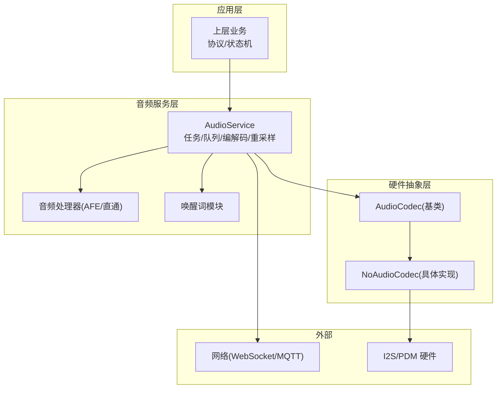
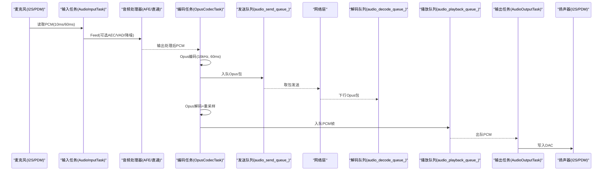
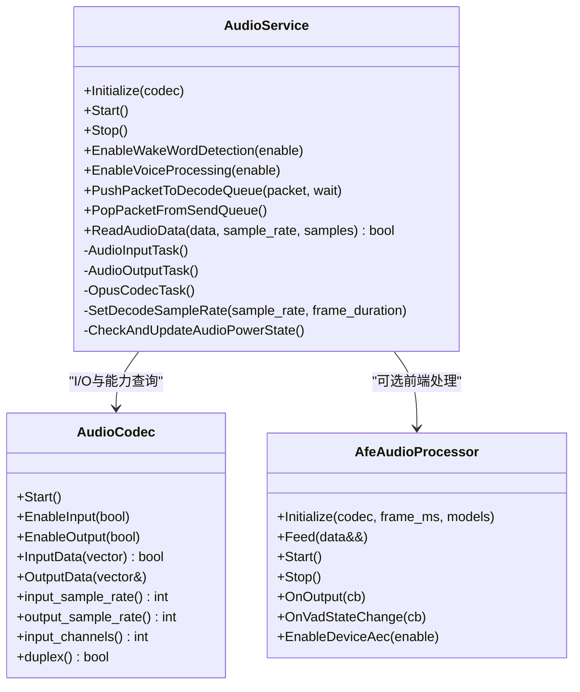
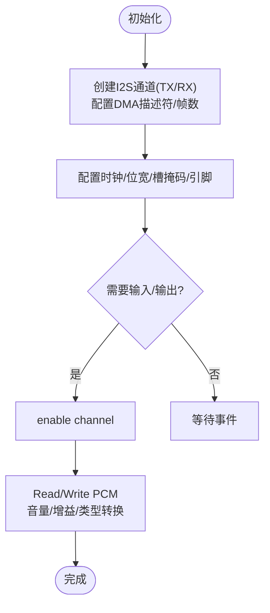
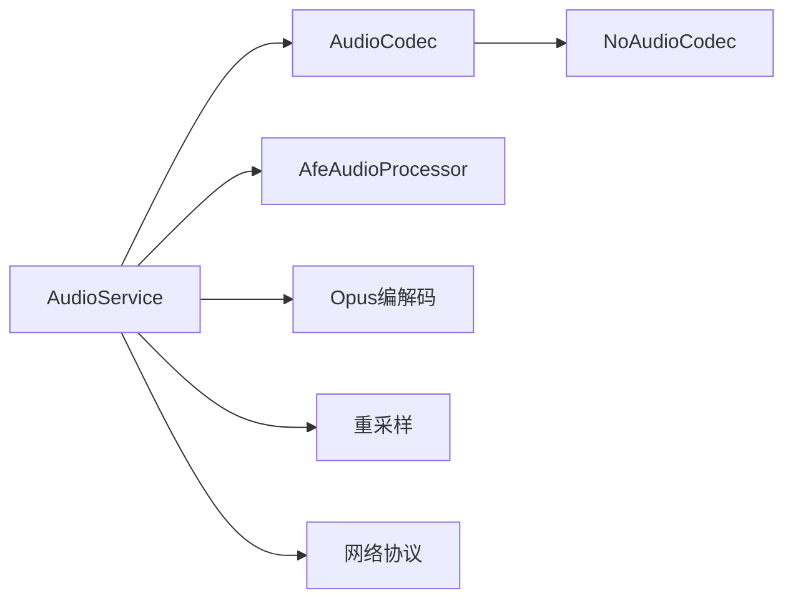

# 音频性能优化

<cite>
**本文引用的文件**   
- [audio_service.h](file://main\audio\audio_service.h)
- [audio_service.cc](file://main\audio\audio_service.cc)
- [audio_codec.h](file://main\audio\audio_codec.h)
- [audio_codec.cc](file://main\audio\audio_codec.cc)
- [no_audio_codec.h](file://main\audio\codecs\no_audio_codec.h)
- [no_audio_codec.cc](file://main\audio\codecs\no_audio_codec.cc)
- [afe_audio_processor.h](file://main\audio\processors\afe_audio_processor.h)
- [afe_audio_processor.cc](file://main\audio\processors\afe_audio_processor.cc)
- [audio_debugger.h](file://main\audio\processors\audio_debugger.h)
- [audio_debugger.cc](file://main\audio\processors\audio_debugger.cc)
- [README.md](file://main\audio\README.md)
- [websocket_zh.md](file://docs\websocket_zh.md)
</cite>

## 目录
1. [引言](#引言)
2. [项目结构](#项目结构)
3. [核心组件](#核心组件)
4. [架构总览](#架构总览)
5. [详细组件分析](#详细组件分析)
6. [依赖关系分析](#依赖关系分析)
7. [性能考量与优化策略](#性能考量与优化策略)
8. [故障排查指南](#故障排查指南)
9. [结论](#结论)
10. [附录](#附录)

## 引言
本指南面向在 ESP32/ESP32S3/P4 等平台上实现低延迟、高质量实时语音通信的工程师。围绕仓库中的音频子系统，系统性地梳理音频处理流水线的关键路径、瓶颈识别方法与优化策略，涵盖采样率与帧长配置、缓冲区与 DMA 参数、编解码器选择与参数调优、双缓冲与异步流水线、以及声学调试工具的使用。目标是帮助读者在保证可接受音质的前提下，将端到端延迟降至最低并提升稳定性。

## 项目结构
本项目采用分层与模块化组织：
- 音频服务层：负责任务调度、队列管理、编解码控制、重采样与电源管理。
- 硬件抽象层（Codec）：封装 I2S/PDM 驱动、DMA 配置、音量与增益控制。
- 信号处理层：可选 AFE 前端（降噪、VAD、设备侧 AEC）。
- 调试与工具：UDP 原始音频导出、OGG 解复用播放测试。

图表来源
- [audio_service.h:105-195](file://main\audio\audio_service.h#L105-L195)
- [audio_service.cc:125-167](file://main\audio\audio_service.cc#L125-L167)
- [audio_codec.h:17-59](file://main\audio\audio_codec.h#L17-L59)
- [no_audio_codec.h:10-41](file://main\audio\codecs\no_audio_codec.h#L10-L41)

章节来源
- [audio_service.h:105-195](file://main\audio\audio_service.h#L105-L195)
- [audio_service.cc:125-167](file://main\audio\audio_service.cc#L125-L167)
- [audio_codec.h:17-59](file://main\audio\audio_codec.h#L17-L59)
- [no_audio_codec.h:10-41](file://main\audio\codecs\no_audio_codec.h#L10-L41)

## 核心组件
- AudioService：音频主控制器，维护输入/输出/编码/解码任务与多队列，协调 Opus 编解码、重采样、VAD/AEC 开关、电源管理与回调。
- AudioCodec 及 NoAudioCodec：统一 I/O 接口，内部通过 I2S/PDM 通道读写 PCM，支持半双工/全双工、PDM 麦克风、音量与增益控制。
- AfeAudioProcessor：可选的前端处理（降噪、VAD、设备侧 AEC），以独立任务运行，按固定帧大小产出处理后的 PCM。
- AudioDebugger：可选的 UDP 原始音频导出，用于离线分析与可视化。

章节来源
- [audio_service.h:105-195](file://main\audio\audio_service.h#L105-L195)
- [audio_service.cc:62-123](file://main\audio\audio_service.cc#L62-L123)
- [audio_codec.h:17-59](file://main\audio\audio_codec.h#L17-L59)
- [no_audio_codec.cc:218-282](file://main\audio\codecs\no_audio_codec.cc#L218-L282)
- [afe_audio_processor.h:17-46](file://main\audio\processors\afe_audio_processor.h#L17-L46)
- [audio_debugger.h:10-22](file://main\audio\processors\audio_debugger.h#L10-L22)

## 架构总览
下图展示上行（采集→处理→编码→发送）与下行（接收→解码→重采样→播放）两条数据流，以及关键队列与任务边界。

图表来源
- [audio_service.cc:230-288](file://main\audio\audio_service.cc#L230-L288)
- [audio_service.cc:327-446](file://main\audio\audio_service.cc#L327-L446)
- [audio_service.cc:290-325](file://main\audio\audio_service.cc#L290-L325)
- [websocket_zh.md:390-423](file://docs\websocket_zh.md#L390-L423)

## 详细组件分析

### 音频服务（AudioService）
- 任务划分
  - 输入任务：周期性从 Codec 读取 PCM，喂给唤醒词与/或音频处理器；支持测试模式直接入队。
  - 编码/解码任务：统一处理 Opus 编解码、动态重采样、队列背压与通知。
  - 输出任务：从播放队列取 PCM 写回 DAC，记录时间戳供服务器 AEC 使用。
- 队列与背压
  - 发送队列与解码队列上限由帧时长决定，避免内存暴涨与抖动放大。
  - 编码队列限制任务数，防止 CPU 峰值。
- 重采样
  - 输入侧：当 Codec 采样率非 16kHz 时启用输入重采样至 16kHz。
  - 输出侧：当解码采样率与 Codec 输出不一致时启用输出重采样。
- 电源管理
  - 无活动超时自动关闭 ADC/DAC，降低功耗；有活动时再开启。

图表来源
- [audio_service.h:105-195](file://main\audio\audio_service.h#L105-L195)
- [audio_service.cc:62-123](file://main\audio\audio_service.cc#L62-L123)
- [audio_codec.h:17-59](file://main\audio\audio_codec.h#L17-L59)
- [afe_audio_processor.h:17-46](file://main\audio\processors\afe_audio_processor.h#L17-L46)

章节来源
- [audio_service.h:38-76](file://main\audio\audio_service.h#L38-L76)
- [audio_service.cc:125-167](file://main\audio\audio_service.cc#L125-L167)
- [audio_service.cc:230-288](file://main\audio\audio_service.cc#L230-L288)
- [audio_service.cc:290-325](file://main\audio\audio_service.cc#L290-L325)
- [audio_service.cc:327-446](file://main\audio\audio_service.cc#L327-L446)
- [audio_service.cc:448-482](file://main\audio\audio_service.cc#L448-L482)
- [audio_service.cc:484-518](file://main\audio\audio_service.cc#L484-L518)
- [audio_service.cc:682-698](file://main\audio\audio_service.cc#L682-L698)

### 硬件抽象层（AudioCodec / NoAudioCodec）
- 统一接口：提供输入/输出使能、音量/增益设置、数据读写。
- DMA 与缓冲：
  - 描述符数量与每帧样本数作为全局常量，影响吞吐与延迟。
  - 典型值：描述符=6，每帧样本=240（对应 16kHz 下约 15ms 一帧）。
- 具体实现：
  - 全双工/半双工通道创建，分别配置 TX/RX。
  - PDM 麦克风直读 16bit，标准 I2S 读 32bit 后右对齐到 16bit。
  - 输出路径对 16bit 进行平方律音量缩放后转为 32bit 写入。

图表来源
- [audio_codec.h:14-15](file://main\audio\audio_codec.h#L14-L15)
- [no_audio_codec.cc:19-76](file://main\audio\codecs\no_audio_codec.cc#L19-L76)
- [no_audio_codec.cc:218-282](file://main\audio\codecs\no_audio_codec.cc#L218-L282)

章节来源
- [audio_codec.h:17-59](file://main\audio\audio_codec.h#L17-L59)
- [audio_codec.cc:29-46](file://main\audio\audio_codec.cc#L29-L46)
- [no_audio_codec.h:10-41](file://main\audio\codecs\no_audio_codec.h#L10-L41)
- [no_audio_codec.cc:19-76](file://main\audio\codecs\no_audio_codec.cc#L19-L76)
- [no_audio_codec.cc:218-282](file://main\audio\codecs\no_audio_codec.cc#L218-L282)

### 前端处理（AfeAudioProcessor）
- 功能：降噪、VAD、设备侧 AEC（可选），以独立任务运行。
- 帧对齐：根据 AFE 的 feed/fetch chunksize 聚合输入，按目标帧大小切分输出。
- 状态切换：运行时重置内部缓冲，避免跨模式残留导致溢出。

章节来源
- [afe_audio_processor.h:17-46](file://main\audio\processors\afe_audio_processor.h#L17-L46)
- [afe_audio_processor.cc:13-75](file://main\audio\processors\afe_audio_processor.cc#L13-L75)
- [afe_audio_processor.cc:91-121](file://main\audio\processors\afe_audio_processor.cc#L91-L121)
- [afe_audio_processor.cc:135-187](file://main\audio\processors\afe_audio_processor.cc#L135-L187)

### 音频调试（AudioDebugger）
- 通过 UDP 将原始 PCM 发送到主机，便于频谱/波形分析。
- 仅在编译选项启用时生效，不影响正常路径。

章节来源
- [audio_debugger.h:10-22](file://main\audio\processors\audio_debugger.h#L10-L22)
- [audio_debugger.cc:54-66](file://main\audio\processors\audio_debugger.cc#L54-L66)

## 依赖关系分析
- 组件耦合
  - AudioService 强依赖 AudioCodec 的能力（采样率、声道、双工）与 AfeAudioProcessor 的接口。
  - NoAudioCodec 依赖 ESP-IDF I2S/PDM 驱动与 DMA 配置。
- 外部依赖
  - Opus 编解码库、重采样库、AFE 模型。
  - 网络协议栈（WebSocket/MQTT）与 OGG 解复用器。

图表来源
- [audio_service.h:105-195](file://main\audio\audio_service.h#L105-L195)
- [audio_codec.h:17-59](file://main\audio\audio_codec.h#L17-L59)
- [no_audio_codec.h:10-41](file://main\audio\codecs\no_audio_codec.h#L10-L41)

章节来源
- [audio_service.h:105-195](file://main\audio\audio_service.h#L105-L195)
- [audio_codec.h:17-59](file://main\audio\audio_codec.h#L17-L59)
- [no_audio_codec.h:10-41](file://main\audio\codecs\no_audio_codec.h#L10-L41)

## 性能考量与优化策略

### 采样率与帧长
- 上行固定 16kHz 单声道，帧长默认 60ms，兼顾带宽与延迟。
- 下行可能为 24kHz（音乐场景），需输出重采样匹配 DAC。
- 建议
  - 通话优先：保持 16kHz/60ms，必要时可尝试 20ms 帧长以降低延迟（需评估 CPU 与网络开销）。
  - 音乐优先：保持 24kHz，适当增大帧长以提升音质与稳定性。

章节来源
- [audio_service.h:38-76](file://main\audio\audio_service.h#L38-L76)
- [websocket_zh.md:390-423](file://docs\websocket_zh.md#L390-L423)

### 缓冲区与 DMA 配置
- 关键常量
  - DMA 描述符数量：6
  - 每帧样本数：240（16kHz 下约 15ms）
- 作用
  - 描述符越多，吞吐越稳，但占用更多 RAM。
  - 帧越大，CPU 中断越少，但端到端延迟增加。
- 建议
  - 在可用内存允许范围内适度提高描述符数量以降低丢包风险。
  - 若追求更低延迟，可在保证不欠载的前提下减小每帧样本数（注意中断频率上升带来的 CPU 压力）。

章节来源
- [audio_codec.h:14-15](file://main\audio\audio_codec.h#L14-L15)
- [no_audio_codec.cc:19-76](file://main\audio\codecs\no_audio_codec.cc#L19-L76)

### 编解码器与比特率
- 编码器：Opus，16kHz 单声道，帧长 60ms，VBR 开启，DTX 开启，复杂度较低。
- 建议
  - 弱网环境：保持 VBR 与 DTX，必要时降低复杂度以减少 CPU。
  - 高保真需求：可适当提高复杂度与平均码率（需权衡功耗与发热）。

章节来源
- [audio_service.h:65-76](file://main\audio\audio_service.h#L65-L76)
- [audio_service.cc:75-84](file://main\audio\audio_service.cc#L75-L84)

### 重采样与通道数
- 输入重采样：当硬件采样率非 16kHz 时启用，确保与 AFE/编码器一致。
- 输出重采样：当下行采样率与 DAC 不一致时启用。
- 双声道转单声道：在测试/直通模式下提取左声道。
- 建议
  - 尽量让硬件采样率与 16kHz 一致，减少重采样开销。
  - 切换模式（唤醒词↔语音处理）前重置重采样器，避免缓存污染。

章节来源
- [audio_service.cc:86-93](file://main\audio\audio_service.cc#L86-L93)
- [audio_service.cc:448-482](file://main\audio\audio_service.cc#L448-L482)
- [audio_service.cc:252-266](file://main\audio\audio_service.cc#L252-L266)
- [audio_service.cc:563-576](file://main\audio\audio_service.cc#L563-L576)

### 双缓冲与异步流水线
- 设计要点
  - 输入/输出/编解码任务分离，通过条件变量与互斥锁协调。
  - 发送/解码/播放/编码四组队列，按容量上限做背压。
- 效果
  - 解耦 I/O 与计算，降低抖动；队列上限控制内存峰值。
- 建议
  - 合理设置队列上限，使其覆盖网络抖动与 CPU 峰值窗口。
  - 在高负载场景下，优先保障解码与播放队列空间，避免卡顿。

章节来源
- [audio_service.h:38-46](file://main\audio\audio_service.h#L38-L46)
- [audio_service.cc:327-446](file://main\audio\audio_service.cc#L327-L446)

### 电源管理与功耗
- 空闲超时自动关闭 ADC/DAC，周期性检查恢复。
- 建议
  - 在长时间静默场景下，缩短检查间隔可降低功耗，但会增加定时器开销。
  - 全双工且输入活跃时，保持 TX 时钟以避免某些板卡 RX 停滞。

章节来源
- [audio_service.cc:682-698](file://main\audio\audio_service.cc#L682-L698)
- [README.md:86-88](file://main\audio\README.md#L86-L88)

### 设备侧 AEC 与 VAD
- 设备侧 AEC 与 VAD 可单独开关；启用 AEC 时通常关闭 VAD，避免冲突。
- 建议
  - 回声较强环境优先启用设备侧 AEC；否则使用服务端 AEC 配合 VAD。
  - 切换 AEC/VAD 时需重置处理器缓冲，避免状态残留。

章节来源
- [afe_audio_processor.cc:189-201](file://main\audio\processors\afe_audio_processor.cc#L189-L201)
- [audio_service.cc:579-604](file://main\audio\audio_service.cc#L579-L604)

### 质量与性能的平衡
- 帧长与延迟：更短帧长降低延迟，但增加 CPU 与网络开销。
- 比特率与音质：VBR 自适应，复杂度高则音质更好但 CPU 更高。
- 采样率：24kHz 适合音乐，16kHz 适合语音。
- 建议
  - 语音为主：16kHz/60ms，VBR 开启，复杂度适中。
  - 音乐为主：24kHz/60ms，适当提高复杂度与码率。

章节来源
- [audio_service.h:65-76](file://main\audio\audio_service.h#L65-L76)
- [websocket_zh.md:390-423](file://docs\websocket_zh.md#L390-L423)

## 故障排查指南
- 常见问题定位
  - 解码失败/乱码：检查下行帧时长与采样率是否与编码器一致；确认重采样链路与目标 DAC 匹配。
  - 爆音/断续：检查 DMA 描述符与每帧样本是否过小；观察队列是否频繁满/空。
  - 回声/啸叫：确认设备侧 AEC 与参考通道配置；必要时切换到服务端 AEC。
  - 功耗异常：检查空闲超时逻辑与双工状态下 TX 时钟保持。
- 调试手段
  - 启用音频调试器，通过 UDP 导出原始 PCM，结合频谱/波形工具分析噪声、削波与延迟。
  - 使用内置测试模式录制本地音频并回放，隔离网络因素。

章节来源
- [audio_debugger.cc:54-66](file://main\audio\processors\audio_debugger.cc#L54-L66)
- [audio_service.cc:327-446](file://main\audio\audio_service.cc#L327-L446)
- [audio_service.cc:682-698](file://main\audio\audio_service.cc#L682-L698)

## 结论
该音频子系统通过清晰的任务拆分、队列背压与重采样链路，实现了在资源受限平台上的稳定实时语音通信。优化重点在于：
- 合理设置帧长与采样率，平衡延迟与质量；
- 调整 DMA 描述符与每帧样本，兼顾吞吐与抖动；
- 选择合适的编解码参数与前端处理组合；
- 利用调试工具定位问题，持续迭代参数。

## 附录
- 关键常量与默认值
  - 帧时长：60ms（可配置）
  - 上行采样率：16kHz，单声道
  - 下行采样率：可能为 24kHz（音乐）
  - DMA 描述符：6
  - 每帧样本：240（16kHz 下约 15ms）
- 相关文档
  - WebSocket 音频参数说明与默认格式

章节来源
- [audio_service.h:38-76](file://main\audio\audio_service.h#L38-L76)
- [audio_codec.h:14-15](file://main\audio\audio_codec.h#L14-L15)
- [websocket_zh.md:390-423](file://docs\websocket_zh.md#L390-L423)