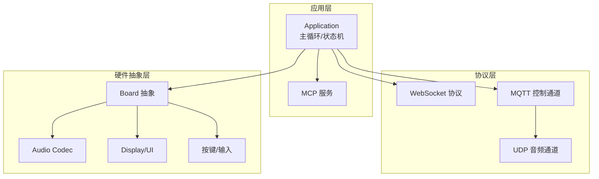
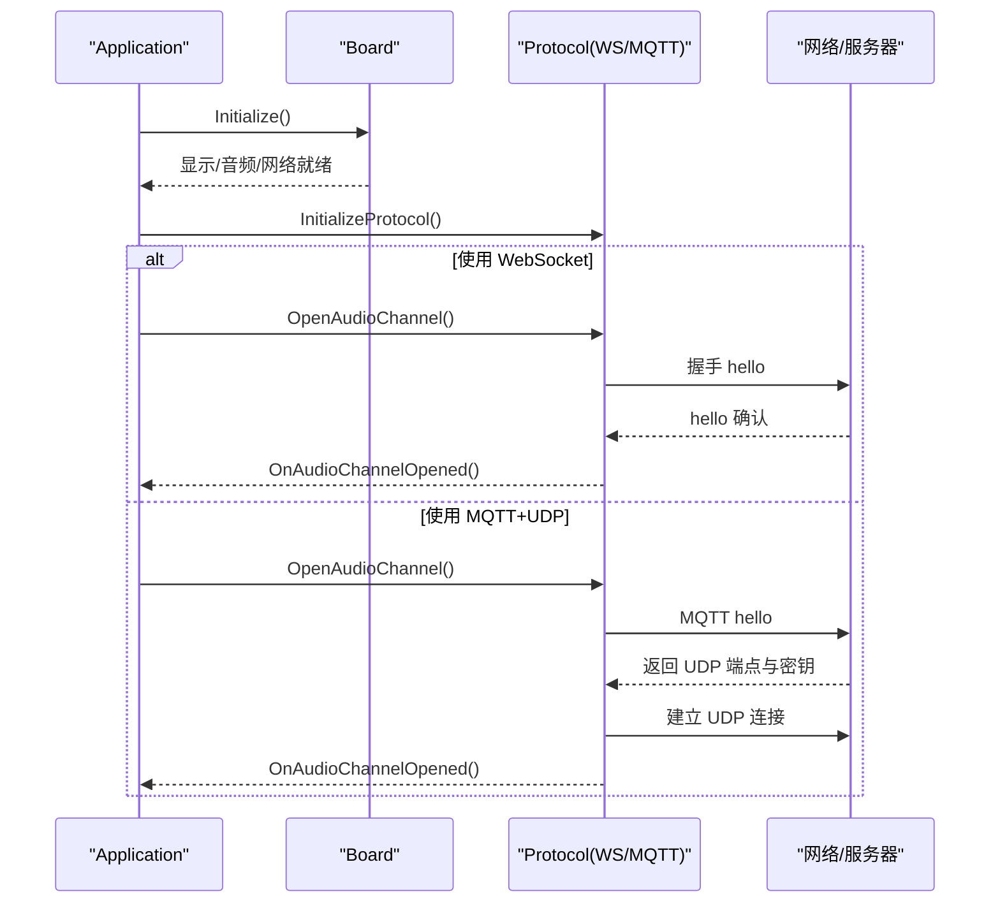
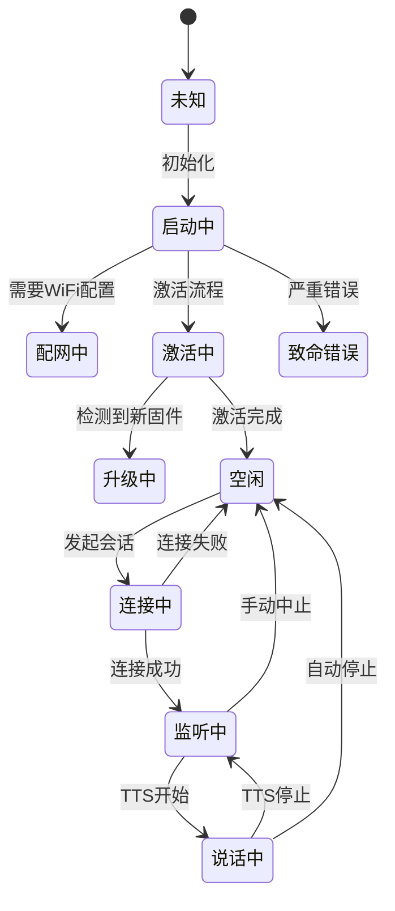
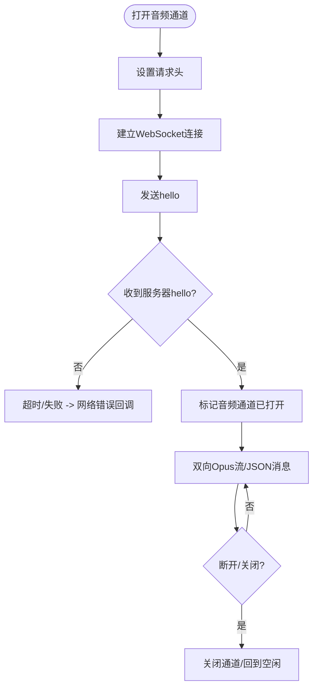
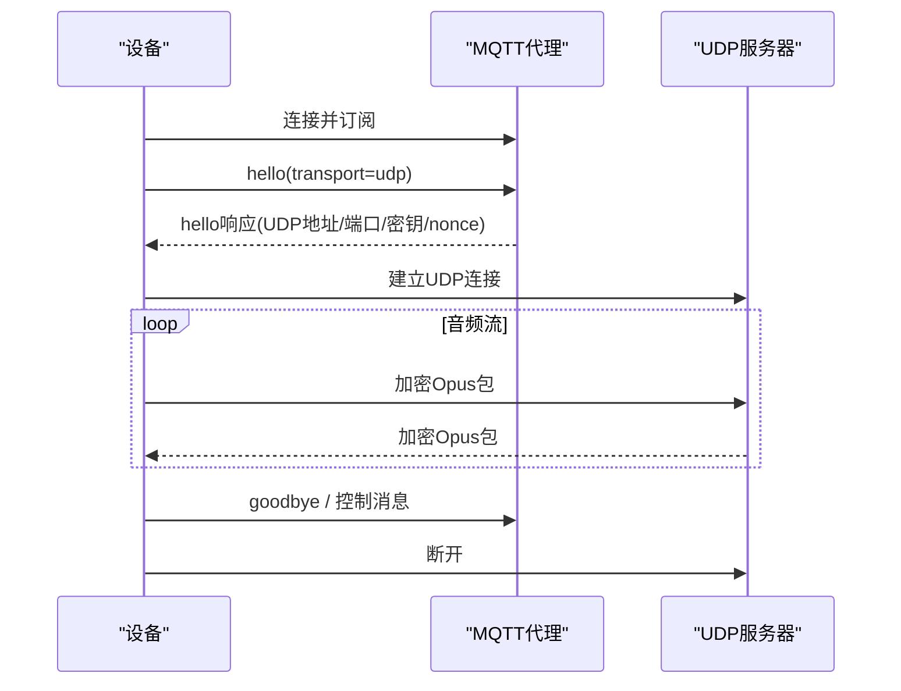
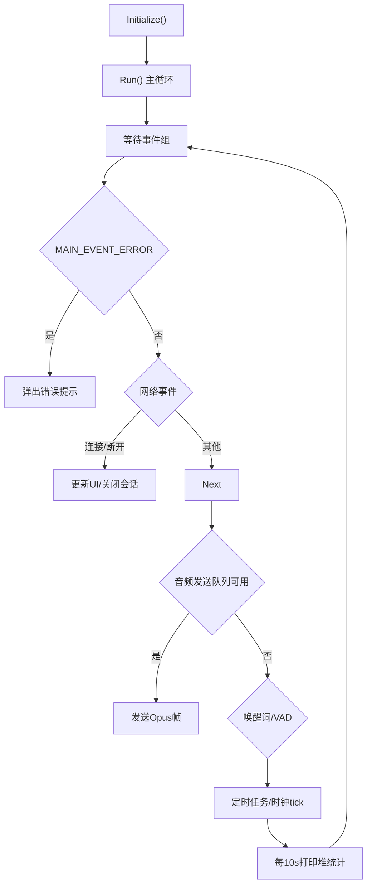
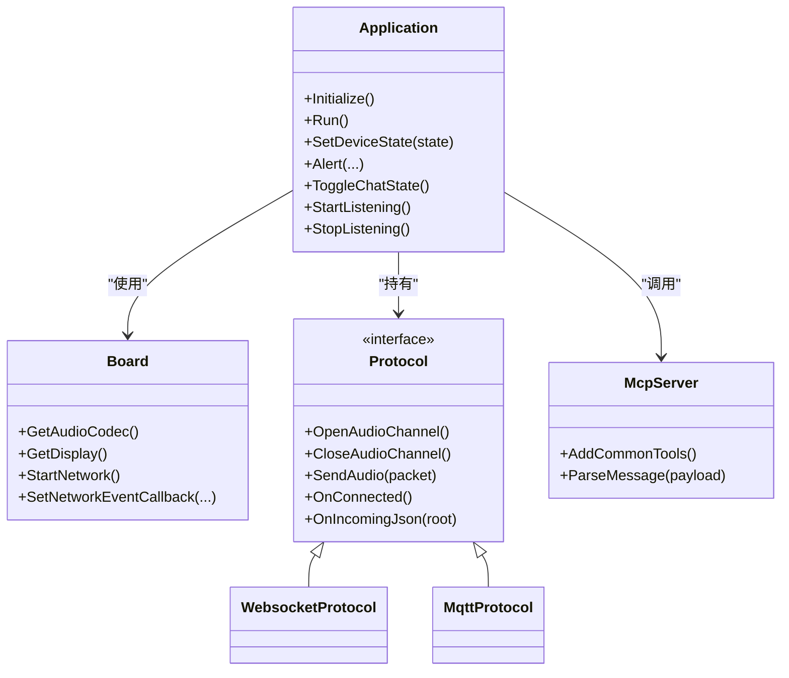

# 故障排除和FAQ

<cite>
**本文引用的文件**   
- [README.md](file://README.md)
- [websocket.md](file://docs/websocket.md)
- [mqtt-udp.md](file://docs/mqtt-udp.md)
- [custom-board.md](file://docs/custom-board.md)
- [application.cc](file://main/application.cc)
- [application.h](file://main/application.h)
</cite>

## 目录
1. [简介](#简介)
2. [项目结构](#项目结构)
3. [核心组件](#核心组件)
4. [架构总览](#架构总览)
5. [详细组件分析](#详细组件分析)
6. [依赖关系分析](#依赖关系分析)
7. [性能与稳定性考量](#性能与稳定性考量)
8. [故障排除指南](#故障排除指南)
9. [结论](#结论)
10. [附录：社区与支持](#附录社区与支持)

## 简介
本指南聚焦于在开发、部署与维护过程中常见的编译错误、运行时异常、网络与音频问题、硬件兼容性问题等的排查方法，并提供系统信息收集与分析、日志与性能监控、内存泄漏检测等自助排障手段。文档同时涵盖常见配置错误的修正方法与社区支持资源，帮助开发者快速定位并解决问题。

## 项目结构
本项目为基于 ESP-IDF 的语音交互应用，核心由“设备抽象层 + 协议栈 + 应用主循环”组成：
- 设备抽象层：Board/Codec/Display/Button 等硬件相关能力封装
- 协议栈：WebSocket 或 MQTT+UDP 两种通信方案
- 应用主循环：事件驱动的状态机，协调音频、显示、网络与 OTA

图表来源
- [application.cc:473-610](file://main/application.cc#L473-L610)
- [websocket.md:1-120](file://docs/websocket.md#L1-L120)
- [mqtt-udp.md:1-120](file://docs/mqtt-udp.md#L1-L120)
- [custom-board.md:398-446](file://docs/custom-board.md#L398-L446)

章节来源
- [README.md:105-130](file://README.md#L105-L130)
- [custom-board.md:398-446](file://docs/custom-board.md#L398-L446)

## 核心组件
- Application 主循环与状态机：负责初始化、事件分发、协议生命周期管理、UI 与音频联动
- 协议实现：WebSocket 与 MQTT+UDP 双通道；前者单连接承载文本与二进制音频，后者控制走 MQTT、音频走加密 UDP
- 设备抽象 Board：统一音频编解码器、显示、背光、按键、电源管理等接口
- MCP 服务：设备侧工具注册与云端指令执行

章节来源
- [application.h:21-35](file://main/application.h#L21-L35)
- [application.cc:165-259](file://main/application.cc#L165-L259)
- [websocket.md:1-120](file://docs/websocket.md#L1-L120)
- [mqtt-udp.md:1-120](file://docs/mqtt-udp.md#L1-L120)
- [custom-board.md:398-446](file://docs/custom-board.md#L398-L446)

## 架构总览
下图展示从启动到建立会话的关键流程，以及 WebSocket 与 MQTT+UDP 的差异点。

图表来源
- [application.cc:473-610](file://main/application.cc#L473-L610)
- [websocket.md:1-120](file://docs/websocket.md#L1-L120)
- [mqtt-udp.md:23-120](file://docs/mqtt-udp.md#L23-L120)

## 详细组件分析

### 设备状态机与会话流程
- 主要状态包括：未知、启动中、配网中、空闲、连接中、监听中、说话中、升级中、激活中、致命错误等
- 典型流转：空闲→连接中→监听中→说话中→空闲；异常时进入致命错误或回退至空闲

图表来源
- [websocket.md:323-398](file://docs/websocket.md#L323-L398)

章节来源
- [websocket.md:323-398](file://docs/websocket.md#L323-L398)

### 协议层（WebSocket）
- 连接建立：设置请求头（鉴权、协议版本、设备ID、客户端ID），发送 hello，等待服务器 hello
- 数据通道：文本 JSON 与二进制 Opus 帧复用同一连接
- 错误处理：连接失败/超时触发网络错误回调；断开后关闭音频通道并回到空闲

图表来源
- [websocket.md:1-120](file://docs/websocket.md#L1-L120)
- [websocket.md:402-440](file://docs/websocket.md#L402-L440)

章节来源
- [websocket.md:1-120](file://docs/websocket.md#L1-L120)
- [websocket.md:402-440](file://docs/websocket.md#L402-L440)

### 协议层（MQTT+UDP）
- 控制面：MQTT 传输 JSON 控制消息（hello、listen、abort、mcp、system、alert 等）
- 数据面：UDP 传输加密 Opus 音频包（AES-CTR），含序列号与时间戳防重放
- 状态管理：MQTT 自动重连；UDP 无自动重试，需通过 MQTT 重新协商

图表来源
- [mqtt-udp.md:23-120](file://docs/mqtt-udp.md#L23-L120)
- [mqtt-udp.md:193-241](file://docs/mqtt-udp.md#L193-L241)

章节来源
- [mqtt-udp.md:1-120](file://docs/mqtt-udp.md#L1-L120)
- [mqtt-udp.md:193-241](file://docs/mqtt-udp.md#L193-L241)

### 应用主循环与事件分发
- 主循环等待事件组：网络、音频发送、唤醒词、VAD、时钟滴答、错误、状态变更等
- 每10秒打印堆统计，便于观察内存趋势
- 协议回调：连接/断开、音频通道开闭、JSON 消息解析（tts/stt/llm/mcp/system/alert/custom）

图表来源
- [application.h:21-35](file://main/application.h#L21-L35)
- [application.cc:165-259](file://main/application.cc#L165-L259)
- [application.cc:248-257](file://main/application.cc#L248-L257)

章节来源
- [application.h:21-35](file://main/application.h#L21-L35)
- [application.cc:165-259](file://main/application.cc#L165-L259)
- [application.cc:248-257](file://main/application.cc#L248-L257)

## 依赖关系分析
- Application 依赖 Board 提供的音频、显示、网络能力
- Protocol 抽象被 WebSocket 与 MQTT 实现共同遵循
- MCP 服务在初始化阶段注入通用与用户自定义工具
- 状态机与事件组贯穿整个运行期，确保线程安全的事件分发

图表来源
- [application.h:43-176](file://main/application.h#L43-L176)
- [application.cc:473-610](file://main/application.cc#L473-L610)
- [custom-board.md:398-446](file://docs/custom-board.md#L398-L446)

章节来源
- [application.h:43-176](file://main/application.h#L43-L176)
- [application.cc:473-610](file://main/application.cc#L473-L610)
- [custom-board.md:398-446](file://docs/custom-board.md#L398-L446)

## 性能与稳定性考量
- 音频采样率匹配：当服务端采样率与设备输出不一致时会发出警告，可能引起重采样失真
- 功耗模式：会话期间切换高性能模式，空闲/关闭后恢复低功耗
- 网络超时与重连：默认超时检测；MQTT 具备自动重连能力
- 内存监控：主循环每10秒打印堆统计，便于发现内存泄漏趋势

章节来源
- [application.cc:504-510](file://main/application.cc#L504-L510)
- [application.cc:512-519](file://main/application.cc#L512-L519)
- [mqtt-udp.md:297-316](file://docs/mqtt-udp.md#L297-L316)
- [application.cc:248-257](file://main/application.cc#L248-L257)

## 故障排除指南

### 一、编译与构建问题
- 现象
  - 无法选择目标芯片或板型
  - 分区表不匹配导致 OTA 失败
- 排查步骤
  - 确认目标芯片与 Kconfig 选项一致
  - 检查 config.json 中的 target 与 sdkconfig_append 是否与实际硬件一致
  - 若 v1 升级到 v2，需按说明手动烧录固件（v2 分区表不兼容 v1）
- 参考
  - [README.md:15-22](file://README.md#L15-L22)
  - [custom-board.md:90-134](file://docs/custom-board.md#L90-L134)

章节来源
- [README.md:15-22](file://README.md#L15-L22)
- [custom-board.md:90-134](file://docs/custom-board.md#L90-L134)

### 二、网络与协议问题
- 现象
  - 无法连接服务器/长时间握手超时
  - 会话中断频繁
- 排查步骤
  - 检查 Authorization、Protocol-Version、Device-Id、Client-Id 等请求头是否正确
  - 确认 hello 消息与服务器 hello 的 transport/version/audio_params 是否一致
  - WebSocket：查看 OnDisconnected 回调与网络错误回调
  - MQTT+UDP：确认 MQTT 连通性、UDP 端口可达、AES 密钥/nonce 正确
- 参考
  - [websocket.md:83-93](file://docs/websocket.md#L83-L93)
  - [websocket.md:402-440](file://docs/websocket.md#L402-L440)
  - [mqtt-udp.md:276-316](file://docs/mqtt-udp.md#L276-L316)

章节来源
- [websocket.md:83-93](file://docs/websocket.md#L83-L93)
- [websocket.md:402-440](file://docs/websocket.md#L402-L440)
- [mqtt-udp.md:276-316](file://docs/mqtt-udp.md#L276-L316)

### 三、音频问题（无声/杂音/延迟）
- 现象
  - 听不到声音或音质差
  - 说话与播放冲突
- 排查步骤
  - 检查 I2S 引脚、PA 使能、Codec I2C 地址与寄存器配置
  - 核对设备与服务端采样率一致性，避免重采样失真
  - 监听模式下丢弃下行音频以避免冲突
- 参考
  - [application.cc:504-510](file://main/application.cc#L504-L510)
  - [websocket.md:310-321](file://docs/websocket.md#L310-L321)
  - [custom-board.md:410-425](file://docs/custom-board.md#L410-L425)

章节来源
- [application.cc:504-510](file://main/application.cc#L504-L510)
- [websocket.md:310-321](file://docs/websocket.md#L310-L321)
- [custom-board.md:410-425](file://docs/custom-board.md#L410-L425)

### 四、显示与 UI 问题
- 现象
  - 屏幕花屏/方向错乱/亮度异常
- 排查步骤
  - 校验 SPI 配置、镜像与翻转参数、颜色反转
  - 检查背光引脚与极性
- 参考
  - [custom-board.md:462-468](file://docs/custom-board.md#L462-L468)

章节来源
- [custom-board.md:462-468](file://docs/custom-board.md#L462-L468)

### 五、唤醒词与语音识别
- 现象
  - 唤醒词无效或误唤醒
- 排查步骤
  - 确认本地唤醒词模型加载与音量阈值
  - 检查唤醒事件是否触发并进入连接流程
- 参考
  - [application.cc:780-800](file://main/application.cc#L780-L800)

章节来源
- [application.cc:780-800](file://main/application.cc#L780-L800)

### 六、OTA 与激活
- 现象
  - 无法检查新版本/激活码无法输入/升级失败
- 排查步骤
  - 检查网络连通性与服务器时间同步
  - 关注重试次数与指数退避策略
  - 激活完成后释放 OTA 对象并恢复低功耗
- 参考
  - [application.cc:398-471](file://main/application.cc#L398-L471)
  - [application.cc:299-321](file://main/application.cc#L299-L321)

章节来源
- [application.cc:398-471](file://main/application.cc#L398-L471)
- [application.cc:299-321](file://main/application.cc#L299-L321)

### 七、日志分析与调试技巧
- 关键日志点
  - 网络事件：连接/断开、注册中、扫描中
  - 协议事件：hello 握手、通道开闭、未知消息类型
  - 系统命令：reboot 等
  - 告警：低电量、PIN 错误、模块初始化失败等
- 建议
  - 开启串口监视器，过滤 TAG 为 Application 的日志
  - 关注每10秒的堆统计，对比变化趋势
- 参考
  - [application.cc:261-297](file://main/application.cc#L261-L297)
  - [application.cc:570-606](file://main/application.cc#L570-L606)
  - [application.cc:248-257](file://main/application.cc#L248-L257)

章节来源
- [application.cc:261-297](file://main/application.cc#L261-L297)
- [application.cc:570-606](file://main/application.cc#L570-L606)
- [application.cc:248-257](file://main/application.cc#L248-L257)

### 八、性能监控与内存泄漏检测
- 指标
  - 堆大小与碎片情况（每10秒打印）
  - 音频丢包/重采样警告
  - 网络超时与重连次数
- 方法
  - 结合串口日志与 IDF 内置工具进行基线测试与回归对比
  - 对长稳场景进行压力测试，观察内存曲线是否单调增长
- 参考
  - [application.cc:248-257](file://main/application.cc#L248-L257)
  - [application.cc:504-510](file://main/application.cc#L504-L510)

章节来源
- [application.cc:248-257](file://main/application.cc#L248-L257)
- [application.cc:504-510](file://main/application.cc#L504-L510)

### 九、硬件兼容性与板级适配
- 常见问题
  - 显示方向/镜像不正确
  - 音频无声或底噪大
  - WiFi/4G 无法注册
- 解决思路
  - 对照 config.h 的引脚定义与原理图逐一核对
  - 优先点亮显示，再上音频，最后联调网络
  - 使用 release.py 生成独立固件包，避免覆盖原厂固件
- 参考
  - [custom-board.md:455-468](file://docs/custom-board.md#L455-L468)
  - [custom-board.md:331-374](file://docs/custom-board.md#L331-L374)

章节来源
- [custom-board.md:455-468](file://docs/custom-board.md#L455-L468)
- [custom-board.md:331-374](file://docs/custom-board.md#L331-L374)

### 十、常见配置错误与修正
- 协议未指定：默认回退到 MQTT，建议在 OTA 配置中明确指定
- 缺少必要字段：如 JSON 缺少 type，设备会记录错误并忽略该消息
- 采样率不一致：服务端与设备输出不一致将产生重采样失真风险
- 分区表不匹配：v1/v2 不兼容，需按说明手动烧录
- 参考
  - [application.cc:484-487](file://main/application.cc#L484-L487)
  - [websocket.md:438-440](file://docs/websocket.md#L438-L440)
  - [application.cc:504-510](file://main/application.cc#L504-L510)
  - [README.md:15-22](file://README.md#L15-L22)

章节来源
- [application.cc:484-487](file://main/application.cc#L484-L487)
- [websocket.md:438-440](file://docs/websocket.md#L438-L440)
- [application.cc:504-510](file://main/application.cc#L504-L510)
- [README.md:15-22](file://README.md#L15-L22)

## 结论
通过理解设备状态机、协议握手与数据通道、以及应用主循环的事件分发机制，可以高效定位大多数编译、网络、音频与 UI 相关问题。配合日志采集、堆统计与压测，可进一步发现内存与性能隐患。对于板级适配，严格遵循引脚与配置规范，并使用独立固件包发布，能有效降低 OTA 风险。

## 附录：社区与支持
- 官方仓库与文档：README 提供入门、硬件清单、开发环境与文档链接
- 社区渠道：Discord、QQ 群等
- 相关开源生态：多种语言实现的服务器与客户端

章节来源
- [README.md:136-163](file://README.md#L136-L163)