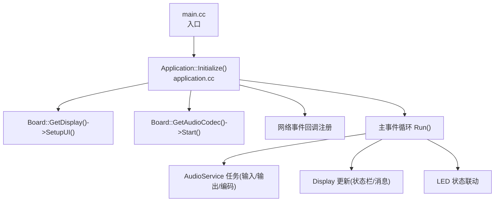
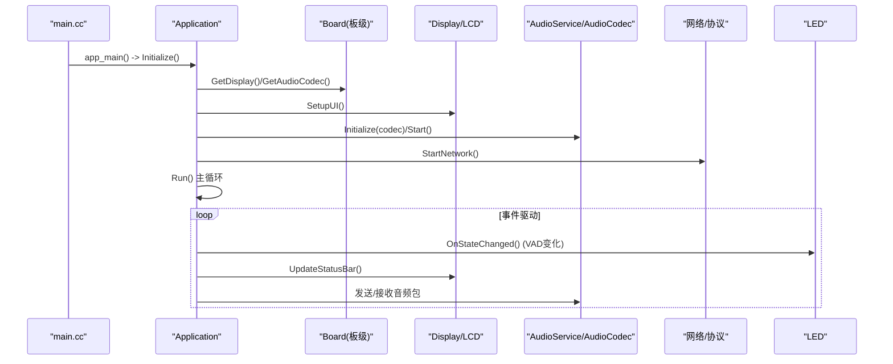
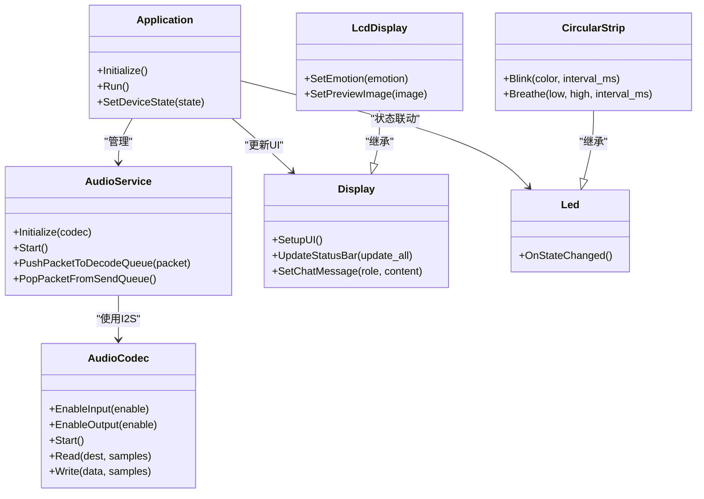

# 外设驱动冲突问题

<cite>
**本文引用的文件**   
- [main.cc](file://main/main.cc)
- [application.h](file://main/application.h)
- [application.cc](file://main/application.cc)
- [audio_codec.h](file://main/audio/audio_codec.h)
- [audio_service.h](file://main/audio/audio_service.h)
- [display.h](file://main/display/display.h)
- [lcd_display.h](file://main/display/lcd_display.h)
- [i2c_device.h](file://main/boards/common/i2c_device.h)
- [led.h](file://main/led/led.h)
- [circular_strip.h](file://main/led/circular_strip.h)
- [esp32s3-korvo2-v3_board.cc](file://main/boards/esp32s3-korvo2-v3/esp32s3_korvo2_v3_board.cc)
- [atk_dnesp32s3_box3.cc](file://main/boards/atk-dnesp32s3-box3/atk_dnesp32s3_box3.cc)
- [atk_dnesp32s3m.cc](file://main/boards/atk-dnesp32s3m-wifi/atk_dnesp32s3m.cc)
- [esp_hi.cc](file://main/boards/esp-hi/esp_hi.cc)
</cite>

## 目录
1. [引言](#引言)
2. [项目结构](#项目结构)
3. [核心组件](#核心组件)
4. [架构总览](#架构总览)
5. [详细组件分析](#详细组件分析)
6. [依赖关系分析](#依赖关系分析)
7. [性能与资源优化](#性能与资源优化)
8. [故障排查指南](#故障排查指南)
9. [结论](#结论)
10. [附录](#附录)

## 引言
本文件聚焦于多外设（音频编解码器、LCD显示屏、I2C设备、LED控制等）在运行时的驱动冲突问题，包括引脚复用冲突、中断资源竞争、内存占用冲突等。文档基于仓库中的实际实现进行梳理，给出识别方法、解决策略、初始化顺序最佳实践、冲突检测机制建议，以及多外设同时工作时的资源分配与性能优化建议。

## 项目结构
本项目采用“应用层 + 板级适配 + 子系统”的分层组织：
- 应用层：Application 负责系统事件循环、状态机、协议与外设协调。
- 板级适配：各 boards 下具体硬件的 I2C/SPI/LCD/Codec/LED 初始化与配置。
- 子系统：AudioService/AudioCodec、Display/LCD、LED 抽象接口与实现。

图示来源
- [main.cc:14-29](file://main/main.cc#L14-L29)
- [application.cc:61-163](file://main/application.cc#L61-L163)
- [application.cc:165-259](file://main/application.cc#L165-L259)

章节来源
- [main.cc:14-29](file://main/main.cc#L14-L29)
- [application.cc:61-163](file://main/application.cc#L61-L163)
- [application.cc:165-259](file://main/application.cc#L165-L259)

## 核心组件
- 应用与事件调度
  - Application 维护事件组与定时器，统一分发网络、音频、状态变更等事件；在 Initialize 中完成显示与音频服务启动，并在 Run 中处理各类事件。
- 音频子系统
  - AudioService 管理输入/输出任务、Opus 编解码队列、唤醒词与语音处理；AudioCodec 提供 I2S 通道与读写接口。
- 显示子系统
  - Display 抽象与 LcdDisplay 派生类封装 LVGL 与 LCD 面板操作，提供锁机制避免并发刷新冲突。
- LED 子系统
  - Led 抽象与 CircularStrip 实现，支持闪烁/呼吸/滚动等动画，内部使用互斥量保护。
- I2C 设备抽象
  - I2cDevice 封装 i2c_master_bus_handle_t 与寄存器读写，供多种 I2C 外设复用。

章节来源
- [application.h:43-176](file://main/application.h#L43-L176)
- [application.cc:61-163](file://main/application.cc#L61-L163)
- [application.cc:165-259](file://main/application.cc#L165-L259)
- [audio_service.h:105-195](file://main/audio/audio_service.h#L105-L195)
- [audio_codec.h:17-59](file://main/audio/audio_codec.h#L17-L59)
- [display.h:28-88](file://main/display/display.h#L28-L88)
- [lcd_display.h:17-86](file://main/display/lcd_display.h#L17-L86)
- [led.h:4-17](file://main/led/led.h#L4-L17)
- [circular_strip.h:19-53](file://main/led/circular_strip.h#L19-L53)
- [i2c_device.h:6-18](file://main/boards/common/i2c_device.h#L6-L18)

## 架构总览
下图展示从启动到外设协同的关键路径，突出可能产生冲突的资源点（I2C、SPI、GPIO、DMA、任务栈/堆）。

图示来源
- [main.cc:14-29](file://main/main.cc#L14-L29)
- [application.cc:61-163](file://main/application.cc#L61-L163)
- [application.cc:165-259](file://main/application.cc#L165-L259)

## 详细组件分析

### 音频编解码器与 I2C 总线冲突
常见问题
- 同一 I2C 端口被多个外设共享（如 Codec、IO 扩展器、传感器），地址或上拉配置不当导致通信失败。
- I2C 中断优先级与 DMA 传输深度设置不合理，造成超时或丢包。
- 初始化顺序错误：未先创建 I2C Master Bus 就访问设备。

定位与解决要点
- 检查 I2C 初始化参数（端口、SDA/SCL、时钟源、内部上拉、中断优先级、传输队列深度）。
- 对 IO 扩展器（如 TCA9554）进行地址探测与回退逻辑，确保正确实例化后再复位下游设备。
- 将 I2C 初始化置于所有 I2C 设备之前，并增加错误日志与重试。

参考实现位置
- I2C 初始化与 IO 扩展器复位流程：[esp32s3-korvo2-v3_board.cc:121-143](file://main/boards/esp32s3-korvo2-v3/esp32s3_korvo2_v3_board.cc#L121-L143)
- 另一板卡 I2C 初始化示例：[atk_dnesp32s3_box3.cc:196-207](file://main/boards/atk-dnesp32s3-box3/atk_dnesp32s3_box3.cc#L196-L207)
- I2C 设备抽象接口：[i2c_device.h:6-18](file://main/boards/common/i2c_device.h#L6-L18)

章节来源
- [esp32s3-korvo2-v3_board.cc:121-143](file://main/boards/esp32s3-korvo2-v3/esp32s3_korvo2_v3_board.cc#L121-L143)
- [atk_dnesp32s3_box3.cc:196-207](file://main/boards/atk-dnesp32s3-box3/atk_dnesp32s3_box3.cc#L196-L207)
- [i2c_device.h:6-18](file://main/boards/common/i2c_device.h#L6-L18)

### LCD 显示屏与 SPI/RGB 总线冲突
常见问题
- SPI 主机号与引脚复用冲突（如与 Wi-Fi、Flash、其他外设共用 SPI2/SPI3）。
- 像素格式、字节序、位深配置不一致导致花屏或无法初始化。
- 复位时序与 CS/DC 引脚配置错误。

定位与解决要点
- 确认 SPI 主机号、pclk_hz、trans_queue_depth、cmd/param bits 等参数与屏幕匹配。
- 严格遵循 reset_gpio_num、rgb_ele_order、bits_per_pixel、data_endian 等配置。
- 若使用 RGB 屏，注意 auto_del_panel_io、vendor_config 等选项。

参考实现位置
- SPI LCD 初始化（ST7789）：[atk_dnesp32s3m.cc:117-147](file://main/boards/atk-dnesp32s3m-wifi/atk_dnesp32s3m.cc#L117-L147)
- SPI LCD 初始化（ILI9341）：[esp_hi.cc:257-286](file://main/boards/esp-hi/esp_hi.cc#L257-L286)
- RGB LCD 初始化（GC9503）：[esp32s3-korvo2-v3_board.cc:281-311](file://main/boards/esp32s3-korvo2-v3/esp32s3_korvo2_v3_board.cc#L281-L311)

章节来源
- [atk_dnesp32s3m.cc:117-147](file://main/boards/atk-dnesp32s3m-wifi/atk_dnesp32s3m.cc#L117-L147)
- [esp_hi.cc:257-286](file://main/boards/esp-hi/esp_hi.cc#L257-L286)
- [esp32s3-korvo2-v3_board.cc:281-311](file://main/boards/esp32s3-korvo2-v3/esp32s3_korvo2_v3_board.cc#L281-L311)

### LED 控制与 GPIO/定时器冲突
常见问题
- LED 动画任务与音频/显示任务争用 CPU 或定时器资源。
- 未加锁的共享数据结构导致颜色数组/状态不一致。

定位与解决要点
- 使用互斥量保护 LED 状态与颜色缓冲区。
- 合理设置动画任务间隔与亮度等级，避免抢占关键路径。

参考实现位置
- LED 抽象接口：[led.h:4-17](file://main/led/led.h#L4-L17)
- 环形灯带实现（含互斥量与定时器）：[circular_strip.h:19-53](file://main/led/circular_strip.h#L19-L53)

章节来源
- [led.h:4-17](file://main/led/led.h#L4-L17)
- [circular_strip.h:19-53](file://main/led/circular_strip.h#L19-L53)

### 显示子系统并发与锁机制
常见问题
- 多任务同时调用 LVGL 绘制导致崩溃或乱码。
- 长时间阻塞的 UI 更新影响音频实时性。

定位与解决要点
- 通过 DisplayLockGuard 获取显示锁，超时返回需记录日志并降级处理。
- 将耗时 UI 更新放入主事件循环的 Schedule 回调中执行。

参考实现位置
- 显示基类与锁守卫：[display.h:28-88](file://main/display/display.h#L28-L88)
- LCD 派生类（SPI/RGB/MIPI）：[lcd_display.h:17-86](file://main/display/lcd_display.h#L17-L86)

章节来源
- [display.h:28-88](file://main/display/display.h#L28-L88)
- [lcd_display.h:17-86](file://main/display/lcd_display.h#L17-L86)

### 应用层事件与外设协调
常见问题
- 网络断开时未关闭音频通道，导致后续状态异常。
- 唤醒词触发后未及时切换电源模式，引发功耗或卡顿。

定位与解决要点
- 在网络断开事件中关闭音频通道并刷新 UI。
- 在激活完成后降低功耗等级，减少后台任务抢占。

参考实现位置
- 应用初始化与事件绑定：[application.cc:61-163](file://main/application.cc#L61-L163)
- 主事件循环与事件处理：[application.cc:165-259](file://main/application.cc#L165-L259)
- 网络断开处理与音频通道关闭：[application.cc:286-297](file://main/application.cc#L286-L297)
- 激活完成后的功耗调整：[application.cc:312-321](file://main/application.cc#L312-L321)

章节来源
- [application.cc:61-163](file://main/application.cc#L61-L163)
- [application.cc:165-259](file://main/application.cc#L165-L259)
- [application.cc:286-297](file://main/application.cc#L286-L297)
- [application.cc:312-321](file://main/application.cc#L312-L321)

## 依赖关系分析
- Application 依赖 Board 提供的 Display、AudioCodec、LED 与网络能力。
- AudioService 依赖 AudioCodec 的 I2S 通道与底层驱动。
- Display/LCD 依赖 esp_lcd 驱动与 LVGL。
- LED 依赖 led_strip 驱动与 FreeRTOS 定时器。

图示来源
- [application.h:43-176](file://main/application.h#L43-L176)
- [audio_service.h:105-195](file://main/audio/audio_service.h#L105-L195)
- [audio_codec.h:17-59](file://main/audio/audio_codec.h#L17-L59)
- [display.h:28-88](file://main/display/display.h#L28-L88)
- [lcd_display.h:17-86](file://main/display/lcd_display.h#L17-L86)
- [led.h:4-17](file://main/led/led.h#L4-L17)
- [circular_strip.h:19-53](file://main/led/circular_strip.h#L19-L53)

## 性能与资源优化
- 任务与队列
  - AudioService 使用独立任务与队列分离输入/输出与编解码，降低抖动与阻塞风险。
  - 合理设置 OPUS 帧长与队列长度，平衡延迟与吞吐。
- 电源模式
  - 连接音频通道前切换到高性能模式，空闲或激活完成后切换到低功耗模式。
- 显示锁与批量更新
  - 使用 DisplayLockGuard 保护 LVGL 操作，避免并发写入。
  - 将 UI 更新放入主事件循环的 Schedule 回调，减少跨任务直接调用。
- I2C/SPI 参数调优
  - 根据外设特性调整中断优先级与传输队列深度，避免超时与拥塞。
  - 对高频访问的外设启用内部上拉，提升信号完整性。

章节来源
- [audio_service.h:105-195](file://main/audio/audio_service.h#L105-L195)
- [application.cc:312-321](file://main/application.cc#L312-L321)
- [display.h:64-77](file://main/display/display.h#L64-L77)
- [atk_dnesp32s3_box3.cc:196-207](file://main/boards/atk-dnesp32s3-box3/atk_dnesp32s3_box3.cc#L196-L207)

## 故障排查指南
- I2C 设备不可达
  - 现象：TCA9554 或其他 I2C 设备创建失败或超时。
  - 排查：检查 I2C 端口与引脚映射、地址是否冲突、上拉电阻与电平匹配；增加地址扫描与回退逻辑。
  - 参考：[esp32s3-korvo2-v3_board.cc:121-143](file://main/boards/esp32s3-korvo2-v3/esp32s3_korvo2_v3_board.cc#L121-L143)
- LCD 无显示或花屏
  - 现象：初始化成功但无图像或颜色错乱。
  - 排查：核对 pclk_hz、rgb_ele_order、bits_per_pixel、data_endian；检查 reset 时序与 DC/CS 引脚。
  - 参考：[atk_dnesp32s3m.cc:117-147](file://main/boards/atk-dnesp32s3m-wifi/atk_dnesp32s3m.cc#L117-L147)、[esp_hi.cc:257-286](file://main/boards/esp-hi/esp_hi.cc#L257-L286)
- 音频卡顿或断流
  - 现象：说话断续、播放卡顿。
  - 排查：检查 AudioService 队列是否溢出、OPUS 帧长与采样率是否匹配；确认网络断开时已关闭音频通道。
  - 参考：[application.cc:286-297](file://main/application.cc#L286-L297)、[audio_service.h:105-195](file://main/audio/audio_service.h#L105-L195)
- LED 动画异常
  - 现象：颜色闪烁不同步或任务卡死。
  - 排查：确认互斥量使用是否正确、定时器回调是否频繁抢占；降低动画频率或亮度。
  - 参考：[circular_strip.h:19-53](file://main/led/circular_strip.h#L19-L53)

章节来源
- [esp32s3-korvo2-v3_board.cc:121-143](file://main/boards/esp32s3-korvo2-v3/esp32s3_korvo2_v3_board.cc#L121-L143)
- [atk_dnesp32s3m.cc:117-147](file://main/boards/atk-dnesp32s3m-wifi/atk_dnesp32s3m.cc#L117-L147)
- [esp_hi.cc:257-286](file://main/boards/esp-hi/esp_hi.cc#L257-L286)
- [application.cc:286-297](file://main/application.cc#L286-L297)
- [audio_service.h:105-195](file://main/audio/audio_service.h#L105-L195)
- [circular_strip.h:19-53](file://main/led/circular_strip.h#L19-L53)

## 结论
在多外设系统中，驱动冲突主要来源于总线共享、引脚复用、中断与 DMA 配置不当以及任务间并发访问。通过统一的初始化顺序、严格的参数校验、完善的错误处理与锁机制，并结合电源模式与队列参数的调优，可显著降低冲突概率并提升系统稳定性与性能。

## 附录

### 外设初始化顺序最佳实践
- 系统基础
  - NVS 初始化、事件系统与定时器创建。
- 外设总线
  - I2C Master Bus 初始化（端口、引脚、上拉、中断优先级、队列深度）。
  - SPI 主机初始化（主机号、引脚、pclk_hz、队列深度）。
- 外设设备
  - I2C 设备（Codec、IO 扩展器、传感器）地址探测与实例化。
  - LCD 面板（reset、DC/CS、像素格式、字节序、位深）初始化。
  - LED 控制器（GPIO、led_strip 句柄、定时器）初始化。
- 应用层
  - Display.SetupUI()、AudioService.Initialize()/Start()、网络启动与事件回调注册。
  - 主事件循环 Run() 开始处理事件。

章节来源
- [main.cc:14-29](file://main/main.cc#L14-L29)
- [application.cc:61-163](file://main/application.cc#L61-L163)
- [esp32s3-korvo2-v3_board.cc:121-143](file://main/boards/esp32s3-korvo2-v3/esp32s3_korvo2_v3_board.cc#L121-L143)
- [atk_dnesp32s3m.cc:117-147](file://main/boards/atk-dnesp32s3m-wifi/atk_dnesp32s3m.cc#L117-L147)

### 冲突检测机制建议
- I2C 设备发现
  - 启动时扫描 I2C 总线，记录存在设备地址与响应时间，异常则告警并尝试回退地址或禁用冲突设备。
- 资源占用统计
  - 定期打印堆栈与任务占用，结合 SystemInfo::PrintHeapStats() 监控内存压力。
- 事件与状态一致性
  - 在网络断开、音频通道关闭、状态切换等关键点添加日志与断言，快速定位异常路径。

章节来源
- [application.cc:248-257](file://main/application.cc#L248-L257)