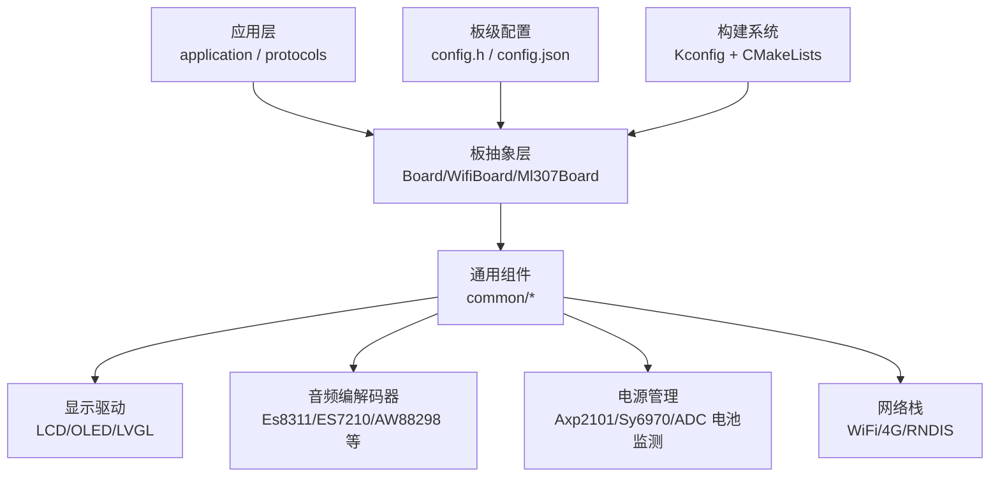
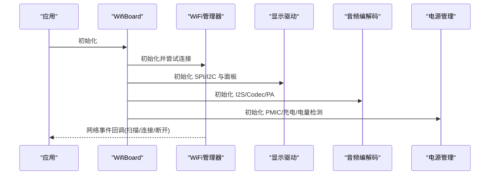
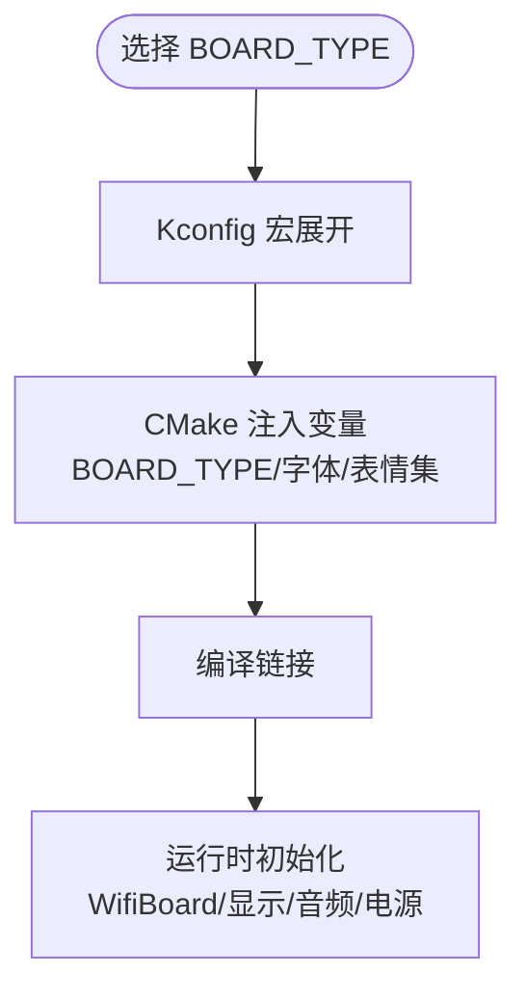

# 特定开发板问题

<cite>
**本文引用的文件**   
- [README.md](file://README.md)
- [custom-board.md](file://docs/custom-board.md)
- [Kconfig.projbuild](file://main/Kconfig.projbuild)
- [CMakeLists.txt](file://main/CMakeLists.txt)
- [sdkconfig.defaults.esp32s3](file://sdkconfig.defaults.esp32s3)
- [wifi_board.cc](file://main/boards/common/wifi_board.cc)
- [bread-compact-wifi/config.h](file://main/boards/bread-compact-wifi/config.h)
- [m5stack-core-s3/config.h](file://main/boards/m5stack-core-s3/config.h)
- [lilygo-t-circle-s3/config.h](file://main/boards/lilygo-t-circle-s3/config.h)
</cite>

## 目录
1. [简介](#简介)
2. [项目结构](#项目结构)
3. [核心组件](#核心组件)
4. [架构总览](#架构总览)
5. [详细组件分析](#详细组件分析)
6. [依赖分析](#依赖分析)
7. [性能考虑](#性能考虑)
8. [故障排查指南](#故障排查指南)
9. [结论](#结论)
10. [附录](#附录)

## 简介
本文件聚焦于在 ESP32 系列平台上运行的小智 AI 语音助手项目中，主流开发板的兼容性常见问题与解决方案。围绕引脚冲突、电源管理、外设驱动冲突等硬件层面问题，提供基于仓库内现有配置与代码的排查方法与适配建议，并给出可操作的配置修改路径（以“章节来源”形式指向具体文件与行号），帮助读者快速定位和解决问题。

## 项目结构
本项目采用“按厂商/型号分目录”的板级组织方式，每个板子包含：
- 板级初始化与胶水代码（xxx_board.cc）
- 引脚与板级设置（config.h）
- 构建配置（config.json，配合脚本使用）
- 可选 README 说明

此外，通用能力（如 WiFi 连接、显示、音频编解码、电源管理等）集中在 main/boards/common 下，供各板复用。

图表来源
- [custom-board.md:398-445](file://docs/custom-board.md#L398-L445)
- [Kconfig.projbuild:146-175](file://main/Kconfig.projbuild#L146-L175)
- [CMakeLists.txt:601-629](file://main/CMakeLists.txt#L601-L629)

章节来源
- [custom-board.md:1-474](file://docs/custom-board.md#L1-L474)
- [Kconfig.projbuild:146-175](file://main/Kconfig.projbuild#L146-L175)
- [CMakeLists.txt:601-629](file://main/CMakeLists.txt#L601-L629)

## 核心组件
- 板抽象类体系：Board -> WifiBoard/Ml307Board/DualNetworkBoard/RndisBoard，用于统一接入不同网络与外设。
- 通用组件库：显示、音频编解码、电源管理、输入按键、MCP 工具注册等。
- 构建与选择：通过 Kconfig 选择 BOARD_TYPE，再由 CMake 注入字体、表情集、板类型变量。
- SDK 默认配置：针对目标芯片（esp32s3/c3/c6/p4）的内存、缓存、SPIRAM、LVGL 等默认项。

章节来源
- [custom-board.md:398-445](file://docs/custom-board.md#L398-L445)
- [Kconfig.projbuild:146-175](file://main/Kconfig.projbuild#L146-L175)
- [sdkconfig.defaults.esp32s3:1-31](file://sdkconfig.defaults.esp32s3#L1-L31)

## 架构总览
下图展示了从应用到硬件驱动的调用链，以及板级配置如何影响运行时行为。

图表来源
- [wifi_board.cc:53-90](file://main/boards/common/wifi_board.cc#L53-L90)
- [custom-board.md:147-279](file://docs/custom-board.md#L147-L279)

## 详细组件分析

### Bread Compact WiFi（面包板）
典型问题
- 引脚冲突：I2S 半双工模式下，MIC 与 SPK 分别占用多路 GPIO；若与其他模块（如 OLED、按键）共用总线或相邻引脚，易出现串扰或初始化失败。
- 显示方向与镜像：OLED 需要正确设置镜像与偏移，否则画面翻转或错位。
- 音量键未定义：部分版本未启用音量键，导致无法调节音量。

排查与解决要点
- 确认 I2S 模式为半双工时的 MIC/SPK 引脚分配是否与 OLED、按键冲突。
- 根据屏幕分辨率与驱动选择正确的 DISPLAY_HEIGHT 与镜像参数。
- 如需音量控制，需在 config.h 中启用对应 GPIO 并在上层绑定事件。

章节来源
- [bread-compact-wifi/config.h:1-60](file://main/boards/bread-compact-wifi/config.h#L1-L60)

### M5Stack Core S3
典型问题
- 摄像头与音频 I2C 冲突：CoreS3 的摄像头数据线与 I2C 复用情况需特别注意，避免与音频编解码器 I2C 地址或引脚冲突。
- 外部时钟频率：XCLK 固定由外部晶振输入，需确保配置与实际硬件一致，否则图像异常。
- 背光与亮度控制：背光引脚可能未引出或未使能，导致屏幕不亮或不可调光。

排查与解决要点
- 核对 CAMERA_PIN_* 与 AUDIO_CODEC_I2C_* 是否冲突。
- 检查 XCLK_FREQ_HZ 与硬件晶振匹配。
- 若背光不可控，检查 DISPLAY_BACKLIGHT_PIN 及反转逻辑。

章节来源
- [m5stack-core-s3/config.h:1-67](file://main/boards/m5stack-core-s3/config.h#L1-L67)

### LilyGo T-Circle S3
典型问题
- 音频链路分离：麦克风与扬声器分别走独立 I2S 通道，需确保各自 BCLK/WS/DATA 引脚与 SD_MODE 控制正确。
- 触摸与显示 I2C/SPI 资源竞争：触摸 I2C 与显示 SPI 通常隔离，但需注意中断与复位引脚冲突。
- 背光极性：DISPLAY_BACKLIGHT_OUTPUT_INVERT 需与硬件设计一致，否则背光常亮或不亮。

排查与解决要点
- 逐一验证 MAX98357A 与 MSM261 的 I2S 引脚映射。
- 检查 TP_SDA/TP_SCL 与 LCD 相关引脚无冲突。
- 调整背光反转标志以匹配硬件。

章节来源
- [lilygo-t-circle-s3/config.h:1-47](file://main/boards/lilygo-t-circle-s3/config.h#L1-L47)

### ESP32-S3-BOX（含 BOX3 等）
典型问题
- 音频编解码组合：ESP-BOX 系列常用 ES7210 麦克风阵列与专用 Codec 组合，需确保 I2C 地址与 PA 控制引脚正确。
- 显示驱动与 LVGL 配置：大尺寸屏需选择合适的字体与表情集，避免内存不足。
- 电源管理：部分盒子集成 PMIC，需正确初始化以支持低功耗与充电。

排查与解决要点
- 核对音频编解码器地址与 I2C 引脚。
- 在 CMake 中为大屏选择合适字体与表情集。
- 检查 PMIC 初始化流程与电量读取。

章节来源
- [custom-board.md:410-425](file://docs/custom-board.md#L410-L425)
- [CMakeLists.txt:601-629](file://main/CMakeLists.txt#L601-L629)

## 依赖分析
- 构建选择：Kconfig 中的 BOARD_TYPE 决定编译时包含的板级源与默认字体/表情集；CMake 将 BOARD_TYPE 注入构建变量。
- 运行时依赖：WifiBoard 负责网络事件回调，向上层暴露统一接口；各板实现 GetAudioCodec/GetDisplay/GetBacklight 等钩子。
- SDK 默认：esp32s3 默认开启 SPIRAM、较大缓存与 LVGL 快照功能，有助于复杂 UI 与音频处理。

图表来源
- [Kconfig.projbuild:146-175](file://main/Kconfig.projbuild#L146-L175)
- [CMakeLists.txt:601-629](file://main/CMakeLists.txt#L601-L629)
- [wifi_board.cc:53-90](file://main/boards/common/wifi_board.cc#L53-L90)
- [sdkconfig.defaults.esp32s3:1-31](file://sdkconfig.defaults.esp32s3#L1-L31)

章节来源
- [Kconfig.projbuild:146-175](file://main/Kconfig.projbuild#L146-L175)
- [CMakeLists.txt:601-629](file://main/CMakeLists.txt#L601-L629)
- [wifi_board.cc:53-90](file://main/boards/common/wifi_board.cc#L53-L90)
- [sdkconfig.defaults.esp32s3:1-31](file://sdkconfig.defaults.esp32s3#L1-L31)

## 性能考虑
- 内存与缓存：esp32s3 默认启用 SPIRAM 与较大缓存，有利于 LVGL 与音频流处理；若遇到内存不足，可评估关闭非必要功能或降低分辨率。
- 网络缓冲：适当调整 RX 缓冲区与 LWIP 队列大小，提升稳定性。
- 图形优化：按需启用 LVGL 快照等功能，减少重复绘制开销。

章节来源
- [sdkconfig.defaults.esp32s3:1-31](file://sdkconfig.defaults.esp32s3#L1-L31)

## 故障排查指南
- 显示异常（翻转/错位/黑屏）
  - 检查 SPI/I2C 引脚与面板初始化顺序，确认镜像与旋转参数。
  - 参考板级 config.h 中的 DISPLAY_* 宏与镜像标志。
- 无声或杂音
  - 核对 I2S 半双工/全双工模式与引脚分配；检查 PA 使能引脚与 Codec I2C 地址。
- 无法连接 WiFi
  - 查看 WifiBoard 的网络事件回调，确认 SSID/密码与配网流程。
- 电源与电量显示异常
  - 检查 PMIC/充电 IC 初始化与 ADC 采样配置。

章节来源
- [custom-board.md:462-468](file://docs/custom-board.md#L462-L468)
- [wifi_board.cc:53-90](file://main/boards/common/wifi_board.cc#L53-L90)

## 结论
通过对各主流开发板的配置与通用组件进行分析，可以归纳出以下经验：
- 优先从相似板型起步，逐步点亮显示、音频、网络。
- 严格核对 config.h 中的引脚与外设参数，避免总线冲突。
- 利用 Kconfig 与 CMake 的组合，为不同板型生成唯一固件标识，避免 OTA 覆盖风险。
- 结合 SDK 默认配置与板级需求，平衡性能与功耗。

## 附录
- 自定义板指南：详见 docs/custom-board.md，涵盖目录布局、Kconfig 与 CMake 集成、常见组件与排错。
- 官方文档与生态：ESP-IDF、LVGL、ESP-SR 等参考链接可在 custom-board.md 末尾找到。

章节来源
- [custom-board.md:1-474](file://docs/custom-board.md#L1-L474)
- [README.md:1-173](file://README.md#L1-L173)