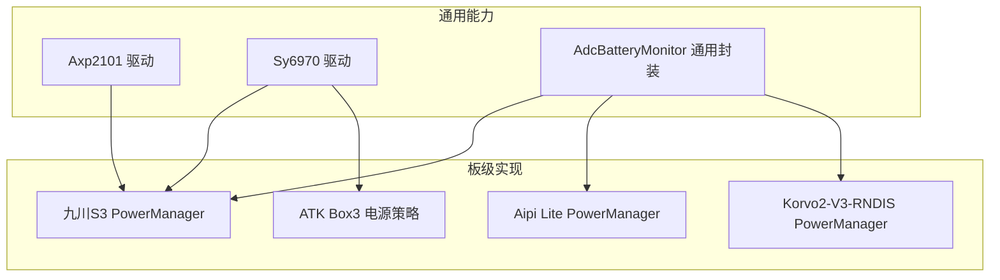
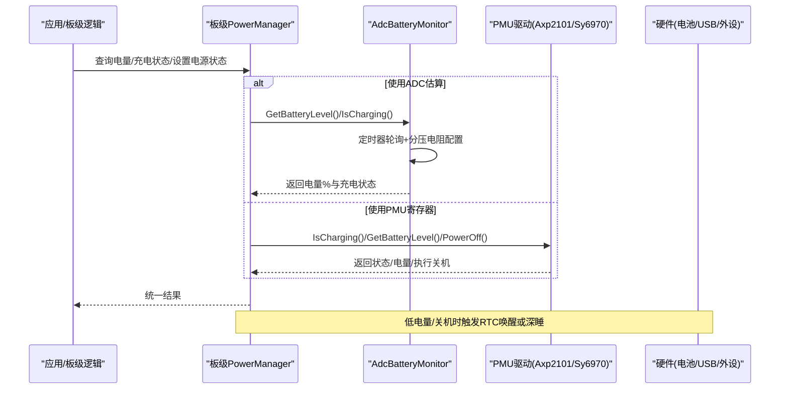
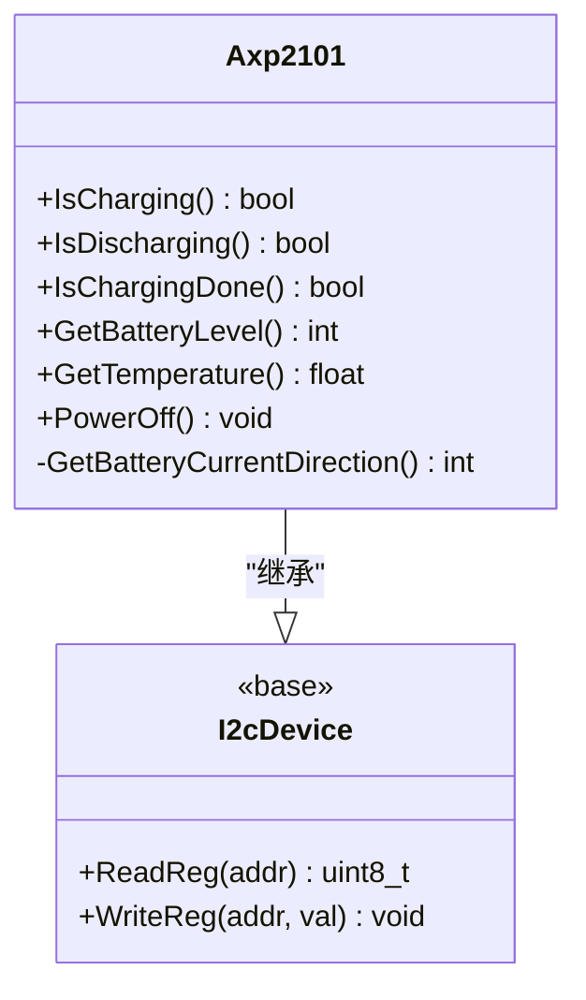
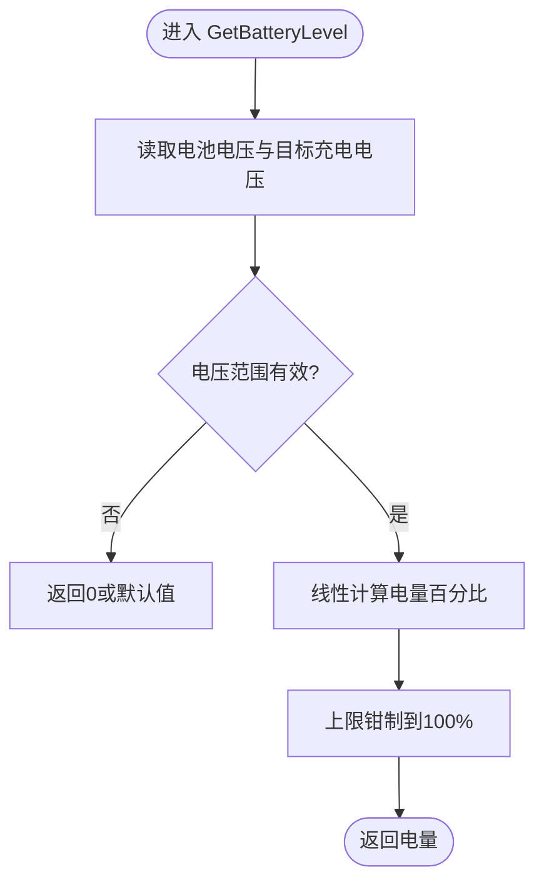
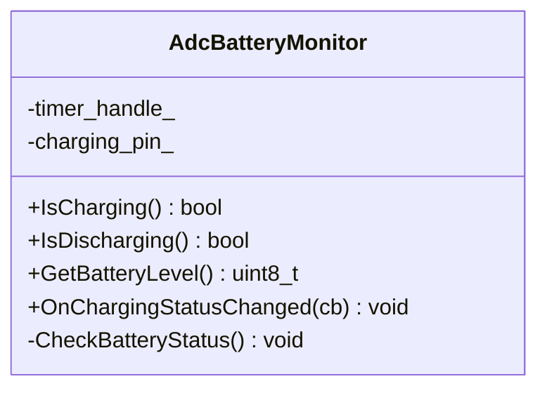
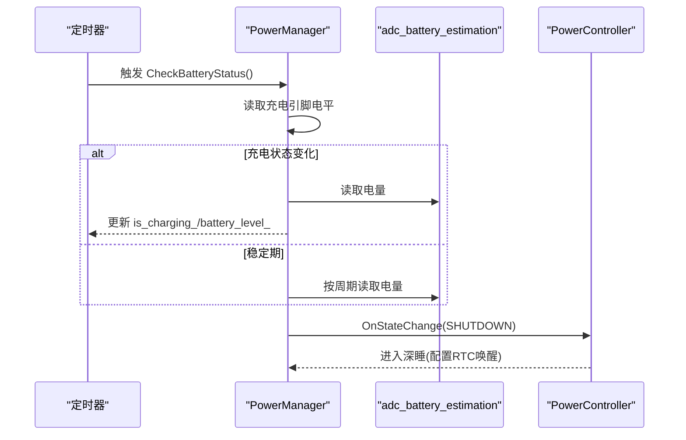
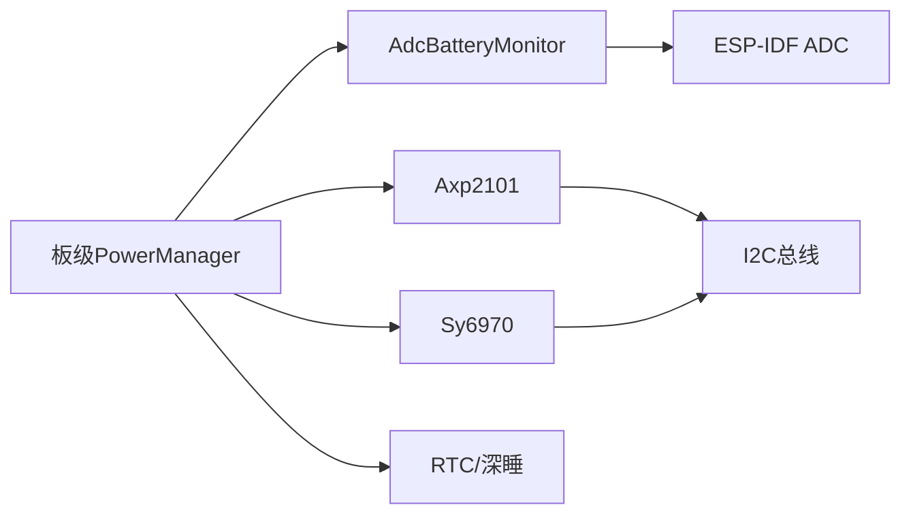

# 电源管理兼容性问题

<cite>
**本文引用的文件**   
- [axp2101.h](file://main\boards\common\axp2101.h)
- [axp2101.cc](file://main\boards\common\axp2101.cc)
- [sy6970.h](file://main\boards\common\sy6970.h)
- [sy6970.cc](file://main\boards\common\sy6970.cc)
- [adc_battery_monitor.h](file://main\boards\common\adc_battery_monitor.h)
- [adc_battery_monitor.cc](file://main\boards\common\adc_battery_monitor.cc)
- [power_manager.h（九川S3）](file://main\boards\jiuchuan-s3\power_manager.h)
- [jiuchuan_dev_board.cc（九川S3）](file://main\boards\jiuchuan-s3\jiuchuan_dev_board.cc)
- [power_manager.h（Aipi Lite）](file://main\boards\aipi-lite\power_manager.h)
- [power_manager.h（ESP32-S3 Korvo2 V3 RNDIS）](file://main\boards\esp32s3-korvo2-v3-rndis\power_manager.h)
- [atk_dnesp32s3_box3.cc](file://main\boards\atk-dnesp32s3-box3\atk_dnesp32s3_box3.cc)
</cite>

## 目录
1. [引言](#引言)
2. [项目结构](#项目结构)
3. [核心组件](#核心组件)
4. [架构总览](#架构总览)
5. [详细组件分析](#详细组件分析)
6. [依赖关系分析](#依赖关系分析)
7. [性能与功耗考量](#性能与功耗考量)
8. [故障排查指南](#故障排查指南)
9. [结论](#结论)
10. [附录](#附录)

## 引言
本文件聚焦于多开发板的电源管理兼容性，围绕以下主题展开：
- 不同PMU/充电芯片的适配差异（如AXP2101、SY6970）
- 电池电量估算与充电状态检测（ADC直采 vs PMU寄存器）
- 低功耗模式切换与关机流程（RTC唤醒、深睡）
- 供电时序控制与电源不足导致的系统不稳定/重启问题定位与解决
- 多供电方式（USB Type-C、电池、外部电源）的兼容处理
- 电源监控与功耗优化最佳实践

## 项目结构
本项目采用“通用能力 + 板级实现”的分层组织方式：
- 通用电源驱动与工具位于 boards/common，提供跨板可复用的PMU抽象与ADC电量估算
- 各板在 boards/<board>/power_manager.h 中实现具体电源策略（采样周期、阈值、回调等）
- 典型PMU驱动包括 AXP2101、SY6970；通用ADC电量估算封装为 AdcBatteryMonitor

图表来源
- [axp2101.h:1-21](file://main\boards\common\axp2101.h#L1-L21)
- [axp2101.cc:1-42](file://main\boards\common\axp2101.cc#L1-L42)
- [sy6970.h:1-21](file://main\boards\common\sy6970.h#L1-L21)
- [sy6970.cc:1-66](file://main\boards\common\sy6970.cc#L1-L66)
- [adc_battery_monitor.h:1-31](file://main\boards\common\adc_battery_monitor.h#L1-L31)
- [adc_battery_monitor.cc:1-116](file://main\boards\common\adc_battery_monitor.cc#L1-L116)
- [power_manager.h（九川S3）:1-201](file://main\boards\jiuchuan-s3\power_manager.h#L1-L201)
- [power_manager.h（Aipi Lite）:144-187](file://main\boards\aipi-lite\power_manager.h#L144-L187)
- [power_manager.h（ESP32-S3 Korvo2 V3 RNDIS）:200-249](file://main\boards\esp32s3-korvo2-v3-rndis\power_manager.h#L200-L249)
- [atk_dnesp32s3_box3.cc:45-77](file://main\boards\atk-dnesp32s3-box3\atk_dnesp32s3_box3.cc#L45-L77)

章节来源
- [axp2101.h:1-21](file://main\boards\common\axp2101.h#L1-L21)
- [axp2101.cc:1-42](file://main\boards\common\axp2101.cc#L1-L42)
- [sy6970.h:1-21](file://main\boards\common\sy6970.h#L1-L21)
- [sy6970.cc:1-66](file://main\boards\common\sy6970.cc#L1-L66)
- [adc_battery_monitor.h:1-31](file://main\boards\common\adc_battery_monitor.h#L1-L31)
- [adc_battery_monitor.cc:1-116](file://main\boards\common\adc_battery_monitor.cc#L1-L116)
- [power_manager.h（九川S3）:1-201](file://main\boards\jiuchuan-s3\power_manager.h#L1-L201)
- [power_manager.h（Aipi Lite）:144-187](file://main\boards\aipi-lite\power_manager.h#L144-L187)
- [power_manager.h（ESP32-S3 Korvo2 V3 RNDIS）:200-249](file://main\boards\esp32s3-korvo2-v3-rndis\power_manager.h#L200-L249)
- [atk_dnesp32s3_box3.cc:45-77](file://main\boards\atk-dnesp32s3-box3\atk_dnesp32s3_box3.cc#L45-L77)

## 核心组件
- AXP2101 驱动：通过I2C读取电流方向、充电完成标志、电量百分比、温度，并提供关机控制。适用于带完整PMU功能的方案。
- SY6970 驱动：通过I2C读取充电状态、PowerGood、目标充电电压、电池电压并估算电量，支持关机控制。
- AdcBatteryMonitor：基于ESP-IDF ADC与电量估算库的通用封装，支持可选充电引脚检测、定时器轮询、充电状态回调。
- 板级 PowerManager：在各板中组合上述能力，定义采样周期、低电量阈值、关机/休眠流程、按键与电源控制器联动。

章节来源
- [axp2101.h:1-21](file://main\boards\common\axp2101.h#L1-L21)
- [axp2101.cc:1-42](file://main\boards\common\axp2101.cc#L1-L42)
- [sy6970.h:1-21](file://main\boards\common\sy6970.h#L1-L21)
- [sy6970.cc:1-66](file://main\boards\common\sy6970.cc#L1-L66)
- [adc_battery_monitor.h:1-31](file://main\boards\common\adc_battery_monitor.h#L1-L31)
- [adc_battery_monitor.cc:1-116](file://main\boards\common\adc_battery_monitor.cc#L1-L116)
- [power_manager.h（九川S3）:1-201](file://main\boards\jiuchuan-s3\power_manager.h#L1-L201)

## 架构总览
下图展示了从应用侧到PMU/ADC的调用链路与数据流，体现不同方案的统一接口与差异化实现。

图表来源
- [power_manager.h（九川S3）:1-201](file://main\boards\jiuchuan-s3\power_manager.h#L1-L201)
- [adc_battery_monitor.cc:1-116](file://main\boards\common\adc_battery_monitor.cc#L1-L116)
- [axp2101.cc:1-42](file://main\boards\common\axp2101.cc#L1-L42)
- [sy6970.cc:1-66](file://main\boards\common\sy6970.cc#L1-L66)

## 详细组件分析

### AXP2101 驱动（I2C PMU）
- 功能要点
  - 电流方向判断：用于区分充电/放电
  - 充电完成标志：避免重复显示“充电中”
  - 电量百分比与温度：直接由PMU上报
  - 关机控制：置位相应寄存器关闭输出
- 关键接口
  - IsCharging / IsDischarging / IsChargingDone / GetBatteryLevel / GetTemperature / PowerOff

图表来源
- [axp2101.h:1-21](file://main\boards\common\axp2101.h#L1-L21)
- [axp2101.cc:1-42](file://main\boards\common\axp2101.cc#L1-L42)

章节来源
- [axp2101.h:1-21](file://main\boards\common\axp2101.h#L1-L21)
- [axp2101.cc:1-42](file://main\boards\common\axp2101.cc#L1-L42)

### SY6970 驱动（I2C 充电管理）
- 功能要点
  - 充电状态机：未充电/预充/恒流/恒压/完成
  - PowerGood：指示系统电源是否有效
  - 电量估算：基于电池电压与目标充电电压线性映射，含边界保护
  - 关机控制：写入特定寄存器关闭输出
- 关键接口
  - IsCharging / IsPowerGood / IsChargingDone / GetBatteryLevel / PowerOff

图表来源
- [sy6970.cc:46-61](file://main\boards\common\sy6970.cc#L46-L61)

章节来源
- [sy6970.h:1-21](file://main\boards\common\sy6970.h#L1-L21)
- [sy6970.cc:1-66](file://main\boards\common\sy6970.cc#L1-L66)

### AdcBatteryMonitor（通用ADC电量估算）
- 设计要点
  - 可选充电引脚检测：若提供GPIO则作为充电检测输入，否则回退软件估算
  - 定时器轮询：周期性检查充电状态变化，触发回调
  - 电量获取：优先使用 adc_battery_estimation 库，失败时回退默认值
- 适用场景
  - 无PMU或仅需低成本电量监测的板子
  - 需要快速接入新板时的通用方案

图表来源
- [adc_battery_monitor.h:1-31](file://main\boards\common\adc_battery_monitor.h#L1-L31)
- [adc_battery_monitor.cc:1-116](file://main\boards\common\adc_battery_monitor.cc#L1-L116)

章节来源
- [adc_battery_monitor.h:1-31](file://main\boards\common\adc_battery_monitor.h#L1-L31)
- [adc_battery_monitor.cc:1-116](file://main\boards\common\adc_battery_monitor.cc#L1-L116)

### 九川S3 PowerManager（示例：ADC+定时+关机流程）
- 特性
  - 使用 adc_battery_estimation 进行电量估算，结合分压电阻表
  - 定时器每秒轮询，充电状态变化时立即刷新电量
  - 注册电源状态回调，SHUTDOWN时配置RTC唤醒并进入深睡
- 关键点
  - 低电量阈值与采样间隔可调
  - 关机前确保外设关闭，防止误唤醒

图表来源
- [power_manager.h（九川S3）:41-183](file://main\boards\jiuchuan-s3\power_manager.h#L41-L183)

章节来源
- [power_manager.h（九川S3）:1-201](file://main\boards\jiuchuan-s3\power_manager.h#L1-L201)
- [jiuchuan_dev_board.cc:168-206](file://main\boards\jiuchuan-s3\jiuchuan_dev_board.cc#L168-L206)

### Aipi Lite PowerManager（ADC+校准）
- 特点
  - 使用 ADC OneShot 单元与通道配置
  - 析构时清理定时器与ADC句柄
  - 提供统一的 IsCharging/IsDischarging/GetBatteryLevel 接口
- 注意
  - 不同板子的ADC参考电压与分压网络差异会影响精度，需校准或查表

章节来源
- [power_manager.h（Aipi Lite）:144-187](file://main\boards\aipi-lite\power_manager.h#L144-L187)

### ESP32-S3 Korvo2 V3 RNDIS PowerManager（ADC校准曲线拟合）
- 特点
  - 尝试创建ADC校准（曲线拟合），失败则回退线性计算
  - 析构时删除校准句柄与ADC句柄（仅当由本类创建）
  - 提供低电量与充电状态回调接口
- 建议
  - 对批量生产设备建议启用ADC校准以提升一致性

章节来源
- [power_manager.h（ESP32-S3 Korvo2 V3 RNDIS）:200-249](file://main\boards\esp32s3-korvo2-v3-rndis\power_manager.h#L200-L249)

### ATK Box3 电源策略（Type-C/电池切换与低电保护）
- 特点
  - 通过IO扩展器检测充电状态，动态切换供电类型
  - 低电压阈值保护：低于设定值且使用电池供电时停止定时器并触发保护动作
- 适用
  - 同时支持Type-C与电池的多源供电方案

章节来源
- [atk_dnesp32s3_box3.cc:45-77](file://main\boards\atk-dnesp32s3-box3\atk_dnesp32s3_box3.cc#L45-L77)

## 依赖关系分析
- 耦合关系
  - 板级 PowerManager 依赖通用 AdcBatteryMonitor 或 PMU 驱动
  - PMU 驱动依赖 I2C 总线与底层寄存器操作
  - 关机流程依赖 RTC 唤醒与深睡机制
- 潜在循环依赖
  - 当前结构清晰分层，未见明显循环依赖
- 外部依赖
  - ESP-IDF ADC/Timer/RTC/I2C 驱动
  - 电量估算库（adc_battery_estimation）

图表来源
- [power_manager.h（九川S3）:1-201](file://main\boards\jiuchuan-s3\power_manager.h#L1-L201)
- [adc_battery_monitor.cc:1-116](file://main\boards\common\adc_battery_monitor.cc#L1-L116)
- [axp2101.cc:1-42](file://main\boards\common\axp2101.cc#L1-L42)
- [sy6970.cc:1-66](file://main\boards\common\sy6970.cc#L1-L66)

章节来源
- [power_manager.h（九川S3）:1-201](file://main\boards\jiuchuan-s3\power_manager.h#L1-L201)
- [adc_battery_monitor.cc:1-116](file://main\boards\common\adc_battery_monitor.cc#L1-L116)
- [axp2101.cc:1-42](file://main\boards\common\axp2101.cc#L1-L42)
- [sy6970.cc:1-66](file://main\boards\common\sy6970.cc#L1-L66)

## 性能与功耗考量
- 采样频率与功耗平衡
  - 九川S3示例采用1秒周期轮询，并在充电状态变化时立即刷新；稳定期降低采样频率以省电
- ADC校准与精度
  - Korvo2 V3 RNDIS 示例尝试曲线拟合校准，提升一致性；Aipi Lite 使用基础OneShot配置
- PMU寄存器读取开销
  - AXP2101/SY6970 通过I2C读取，需注意总线竞争与延迟，避免高频轮询
- 关机与深睡
  - 九川S3示例在关机流程中配置RTC唤醒并进入深睡，减少待机功耗

[本节为通用指导，不直接分析具体文件]

## 故障排查指南
- 症状：系统不稳定、随机重启
  - 可能原因：电源不足（电池电压跌落）、USB供电不稳、外设瞬时大电流
  - 排查步骤：
    - 确认供电类型与切换逻辑（参考 ATK Box3 的Type-C/电池检测）
    - 检查低电压保护阈值与动作（参考 ATK Box3 的低电压保护）
    - 验证ADC采样与校准（参考 Korvo2 V3 RNDIS 的ADC校准）
    - 观察PMU状态（SY6970的PowerGood、AXP2101的电流方向）
- 症状：电量显示异常或跳变
  - 可能原因：分压电阻误差、未校准、未连接电池导致读数漂移
  - 排查步骤：
    - 对比SY6970的电量计算边界保护（超过100%钳制）
    - 检查AdcBatteryMonitor的充电检测回调与回退逻辑
- 症状：无法关机或误唤醒
  - 可能原因：RTC唤醒配置不当、GPIO上拉/下拉配置错误
  - 排查步骤：
    - 核对九川S3的关机流程（EXT0唤醒、内部下拉、关闭PWR_EN）
    - 确认按键去抖与长按逻辑（参考 jiuchuan_dev_board.cc 的电源键处理）

章节来源
- [atk_dnesp32s3_box3.cc:45-77](file://main\boards\atk-dnesp32s3-box3\atk_dnesp32s3_box3.cc#L45-L77)
- [sy6970.cc:46-61](file://main\boards\common\sy6970.cc#L46-L61)
- [power_manager.h（ESP32-S3 Korvo2 V3 RNDIS）:200-249](file://main\boards\esp32s3-korvo2-v3-rndis\power_manager.h#L200-L249)
- [power_manager.h（九川S3）:160-183](file://main\boards\jiuchuan-s3\power_manager.h#L160-L183)
- [jiuchuan_dev_board.cc:168-206](file://main\boards\jiuchuan-s3\jiuchuan_dev_board.cc#L168-L206)

## 结论
- 多板电源管理的核心在于统一接口与差异化实现：通过 AdcBatteryMonitor 与 PMU 驱动屏蔽底层差异，板级 PowerManager 负责策略与体验
- 电源不足引发的不稳定通常可通过完善供电检测、低电保护与ADC校准来缓解
- 关机与深睡流程需严格配置RTC唤醒与GPIO状态，避免误唤醒
- 针对不同供电方式（USB/电池/外部电源），应明确切换逻辑与保护阈值，确保用户体验与系统可靠性

[本节为总结性内容，不直接分析具体文件]

## 附录
- 常见PMU/充电芯片对比
  - AXP2101：具备电流方向、温度、电量百分比等丰富信息，适合复杂PMU方案
  - SY6970：侧重充电管理与基本电量估算，成本低、易集成
- 推荐实践
  - 优先使用PMU提供的电量与状态信息；若无PMU，采用AdcBatteryMonitor并结合ADC校准
  - 合理设置采样周期与低电量阈值，兼顾实时性与功耗
  - 在关机流程中确保外设关闭与RTC唤醒配置正确
  - 对量产设备引入ADC校准与分压网络一致性管控

[本节为补充说明，不直接分析具体文件]