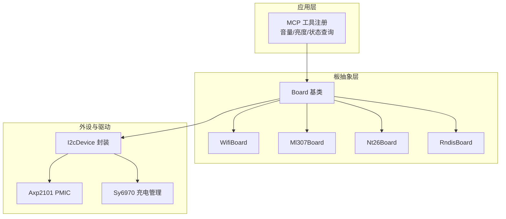
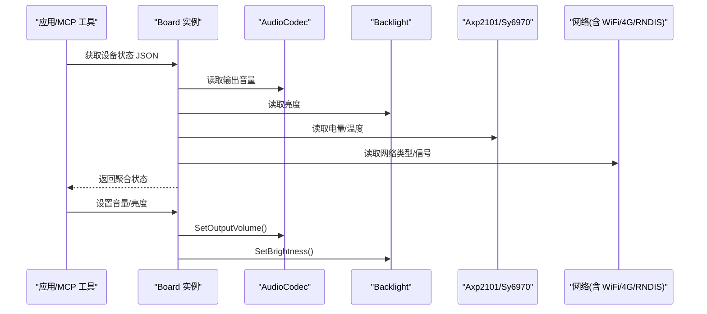
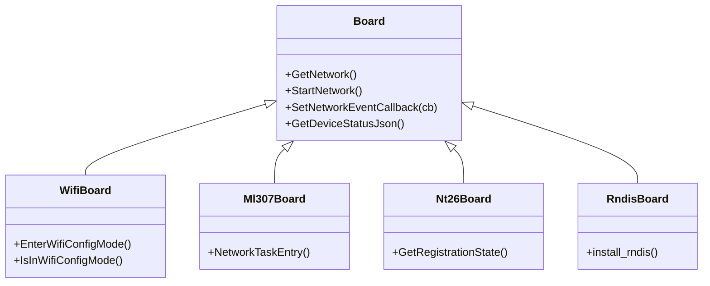
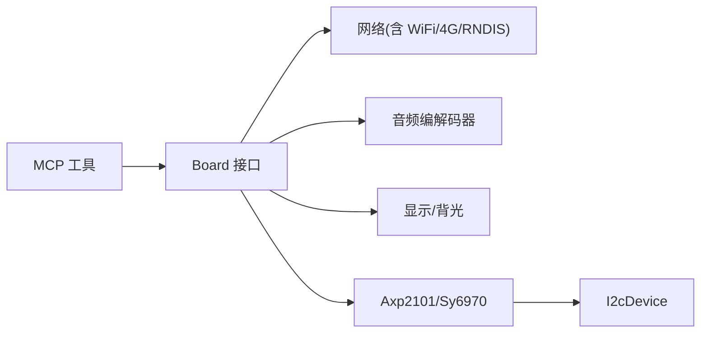

# 硬件兼容性问题

<cite>
**本文引用的文件**   
- [README.md](file://README.md)
- [custom-board.md](file://docs/custom-board.md)
- [board.h](file://main/boards/common/board.h)
- [wifi_board.h](file://main/boards/common/wifi_board.h)
- [ml307_board.h](file://main/boards/common/ml307_board.h)
- [nt26_board.h](file://main/boards/common/nt26_board.h)
- [rndis_board.h](file://main/boards/common/rndis_board.h)
- [i2c_device.cc](file://main/boards/common/i2c_device.cc)
- [axp2101.h](file://main/boards/common/axp2101.h)
- [axp2101.cc](file://main/boards/common/axp2101.cc)
- [sy6970.h](file://main/boards/common/sy6970.h)
- [sy6970.cc](file://main/boards/common/sy6970.cc)
- [mcp_server.cc](file://main/mcp_server.cc)
</cite>

## 目录
1. [简介](#简介)
2. [项目结构](#项目结构)
3. [核心组件](#核心组件)
4. [架构总览](#架构总览)
5. [详细组件分析](#详细组件分析)
6. [依赖关系分析](#依赖关系分析)
7. [性能与功耗考量](#性能与功耗考量)
8. [故障排查指南](#故障排查指南)
9. [结论](#结论)
10. [附录](#附录)

## 简介
本文件聚焦于在 XiaoZhi AI 语音助手项目中，面向 70+ 种已支持开发板的“硬件兼容性”问题与解决方案。内容覆盖：
- 引脚冲突、电源管理、外设驱动冲突等硬件层面的常见故障定位方法
- 新硬件适配流程中的常见问题与解决步骤（板级配置、驱动适配）
- 不同芯片平台（ESP32-S3、ESP32-C3、ESP32-P4）的特定兼容性问题
- 硬件调试工具与测试方法建议

本项目官方文档指出支持 ESP32-C3、ESP32-S3、ESP32-P4 平台，并提供自定义板卡指南与大量板级实现示例，便于快速定位和修复兼容性问题。

章节来源
- [README.md:33-34](file://README.md#L33-L34)

## 项目结构
为支撑多板型与多外设组合，代码采用“按厂商/型号分目录 + 公共组件复用”的组织方式：
- 每个板子一个目录，包含板级初始化、引脚与参数定义、构建配置等
- 公共组件（网络基类、I2C 设备封装、电源管理 IC 驱动、MCP 工具等）集中在 common 目录，供各板复用
- 通过 Kconfig 与 CMake 将具体板型接入构建系统，并生成唯一固件标识，避免 OTA 覆盖风险

图表来源
- [board.h:49-85](file://main/boards/common/board.h#L49-L85)
- [wifi_board.h:9-67](file://main/boards/common/wifi_board.h#L9-L67)
- [ml307_board.h:9-36](file://main/boards/common/ml307_board.h#L9-L36)
- [nt26_board.h:28-60](file://main/boards/common/nt26_board.h#L28-L60)
- [rndis_board.h:17-71](file://main/boards/common/rndis_board.h#L17-L71)
- [i2c_device.cc:8-35](file://main/boards/common/i2c_device.cc#L8-L35)
- [axp2101.h:6-18](file://main/boards/common/axp2101.h#L6-L18)
- [sy6970.h:6-19](file://main/boards/common/sy6970.h#L6-L19)
- [mcp_server.cc:46-72](file://main/mcp_server.cc#L46-L72)

章节来源
- [custom-board.md:1-20](file://docs/custom-board.md#L1-L20)
- [custom-board.md:398-445](file://docs/custom-board.md#L398-L445)

## 核心组件
- 板抽象接口 Board：统一提供音频、显示、背光、电池、温度、网络、电源管理等能力访问点，并通过工厂宏 DECLARE_BOARD 创建具体板实例
- 网络基类族：
  - WifiBoard：WiFi 连接、配网模式、事件回调
  - Ml307Board/Nt26Board：4G 模组（AT/UartEth）驱动与事件
  - RndisBoard：基于 USB-RNDIS 的网络（ESP32-S3/P4）
- I2C 设备封装：简化 I2C 寄存器读写，用于 PMIC、Codec、传感器等
- 电源管理：
  - Axp2101：电量、温度、关机控制
  - Sy6970：充电状态、目标电压、电量估算
- MCP 工具：对外暴露设备状态与控件（音量、亮度等），便于上层调用

章节来源
- [board.h:49-85](file://main/boards/common/board.h#L49-L85)
- [wifi_board.h:9-67](file://main/boards/common/wifi_board.h#L9-L67)
- [ml307_board.h:9-36](file://main/boards/common/ml307_board.h#L9-L36)
- [nt26_board.h:28-60](file://main/boards/common/nt26_board.h#L28-L60)
- [rndis_board.h:17-71](file://main/boards/common/rndis_board.h#L17-L71)
- [i2c_device.cc:8-35](file://main/boards/common/i2c_device.cc#L8-L35)
- [axp2101.h:6-18](file://main/boards/common/axp2101.h#L6-L18)
- [axp2101.cc:9-41](file://main/boards/common/axp2101.cc#L9-L41)
- [sy6970.h:6-19](file://main/boards/common/sy6970.h#L6-L19)
- [sy6970.cc:9-65](file://main/boards/common/sy6970.cc#L9-L65)
- [mcp_server.cc:46-72](file://main/mcp_server.cc#L46-L72)

## 架构总览
下图展示从 MCP 工具到板抽象层、再到外设驱动的调用路径，体现“上层工具—板抽象—外设驱动”的分层解耦设计。

图表来源
- [mcp_server.cc:46-72](file://main/mcp_server.cc#L46-L72)
- [board.h:68-84](file://main/boards/common/board.h#L68-L84)
- [axp2101.cc:29-41](file://main/boards/common/axp2101.cc#L29-L41)
- [sy6970.cc:46-61](file://main/boards/common/sy6970.cc#L46-L61)

## 详细组件分析

### 1) 引脚与总线冲突（I2C/SPI/I2S/GPIO）
典型症状
- I2C 设备无法枚举或频繁超时（如 Codec、PMIC、触摸控制器）
- SPI 屏显花屏、翻转异常、颜色反转错误
- I2S 无声、爆音、采样率不匹配导致 ASR/TTS 异常

定位要点
- 确认 config.h 中所有引脚与原理图一致，避免与内置功能（如 Flash、PSRAM、LED、按键）冲突
- I2C 地址、上拉电阻、时钟速度需与器件手册一致；必要时降低速率提升稳定性
- SPI 时序、片选、DC 脚、复位脚、镜像/旋转参数需与屏幕驱动匹配
- I2S 引脚映射、PA 使能、Codec 唤醒顺序要正确

参考实现位置
- I2C 设备封装与寄存器读写
- 自定义板卡指南中的引脚与总线初始化示例

章节来源
- [i2c_device.cc:8-35](file://main/boards/common/i2c_device.cc#L8-L35)
- [custom-board.md:34-88](file://docs/custom-board.md#L34-L88)
- [custom-board.md:168-236](file://docs/custom-board.md#L168-L236)

### 2) 电源管理与电池检测（Axp2101 / Sy6970）
典型症状
- 电量显示异常、充放电状态误判
- 低电量下频繁重启或进入深度休眠
- 关机命令无效或意外唤醒

定位要点
- 使用 I2C 封装读取 PMIC 寄存器，核对电流方向、充电完成标志、电池电压与目标充电电压
- 注意未接电池时的读数不稳定，需做边界处理与限幅
- 结合系统温度上报，评估热保护触发条件

参考实现位置
- Axp2101：电流方向、充电完成、电量百分比、温度、关机
- Sy6970：充电状态、PowerGood、目标电压、电量估算、关机

章节来源
- [axp2101.h:6-18](file://main/boards/common/axp2101.h#L6-L18)
- [axp2101.cc:9-41](file://main/boards/common/axp2101.cc#L9-L41)
- [sy6970.h:6-19](file://main/boards/common/sy6970.h#L6-L19)
- [sy6970.cc:9-65](file://main/boards/common/sy6970.cc#L9-L65)

### 3) 网络子系统（WiFi / 4G / RNDIS）
典型症状
- WiFi 配网失败、反复重连、超时
- 4G 模组无 SIM、注册被拒、初始化失败、操作超时
- RNDIS 无法识别或以太网栈挂起

定位要点
- 使用统一的 NetworkEvent 回调观察扫描、连接、断开、配网模式切换等事件
- 4G 场景关注 Modem 检测、SIM 状态、网络注册码、CSQ 信号强度
- RNDIS 仅在 ESP32-S3/P4 可用，需检查 USB 枚举与 netif 绑定

图表来源
- [board.h:49-85](file://main/boards/common/board.h#L49-L85)
- [wifi_board.h:9-67](file://main/boards/common/wifi_board.h#L9-L67)
- [ml307_board.h:9-36](file://main/boards/common/ml307_board.h#L9-L36)
- [nt26_board.h:28-60](file://main/boards/common/nt26_board.h#L28-L60)
- [rndis_board.h:17-71](file://main/boards/common/rndis_board.h#L17-L71)

章节来源
- [board.h:20-44](file://main/boards/common/board.h#L20-L44)
- [wifi_board.h:9-67](file://main/boards/common/wifi_board.h#L9-L67)
- [ml307_board.h:9-36](file://main/boards/common/ml307_board.h#L9-L36)
- [nt26_board.h:28-60](file://main/boards/common/nt26_board.h#L28-L60)
- [rndis_board.h:17-71](file://main/boards/common/rndis_board.h#L17-L71)

### 4) 外设驱动冲突（音频编解码器、显示、触摸）
典型症状
- 同时启用多个 I2C 设备时出现地址冲突或总线拥塞
- 显示与触摸共用 SPI/I2C 时互相干扰
- 音频 PA 引脚与 LED/按键复用导致误触发

定位要点
- 为每个 I2C 设备分配独立总线或合理分时复用，避免并发写冲突
- 对共享总线的外设增加延时与重试策略
- 严格区分输入/输出引脚极性（如背光反相逻辑）

章节来源
- [custom-board.md:168-236](file://docs/custom-board.md#L168-L236)
- [custom-board.md:400-445](file://docs/custom-board.md#L400-L445)

### 5) 新硬件适配流程与常见问题
适配步骤
- 新建板目录，编写 config.h（引脚、采样率、屏参等）、config.json（target、分区表、语言、唤醒词开关等）
- 实现板类（继承自 WifiBoard/Ml307Board/Nt26Board/RndisBoard），注册音频、显示、背光、按钮、MCP 工具
- 在 Kconfig 与 CMakeLists.txt 中注册板型，确保唯一固件名与分区表
- 使用 release.py 自动构建打包，或使用 idf.py 手动构建

常见问题
- 覆盖已有板配置导致 OTA 回刷风险：务必新建板型或使用 builds 数组产出不同固件名
- 字体/表情集与分辨率不匹配导致 UI 错乱：按分辨率选择合适字体与 emoji 集合
- 分区表与 Flash 容量不匹配导致启动失败：根据实际 Flash 大小选择 v2 分区表

章节来源
- [custom-board.md:5-10](file://docs/custom-board.md#L5-L10)
- [custom-board.md:24-134](file://docs/custom-board.md#L24-L134)
- [custom-board.md:283-330](file://docs/custom-board.md#L283-L330)
- [custom-board.md:331-374](file://docs/custom-board.md#L331-L374)
- [custom-board.md:376-396](file://docs/custom-board.md#L376-L396)
- [custom-board.md:398-445](file://docs/custom-board.md#L398-L445)

### 6) 芯片平台差异（ESP32-S3 / ESP32-C3 / ESP32-P4）
- ESP32-S3：广泛支持，具备丰富外设与较高算力，适合带屏/音频/摄像头方案
- ESP32-C3：资源受限，适合轻量交互与低功耗场景，需注意内存与中断优先级
- ESP32-P4：高性能，支持 RNDIS-over-USB 网络与更高吞吐显示/视频需求

章节来源
- [README.md:33-34](file://README.md#L33-L34)
- [custom-board.md:431-433](file://docs/custom-board.md#L431-L433)

## 依赖关系分析
- 板抽象层向上暴露统一 API，向下依赖外设驱动与网络栈
- MCP 工具通过 Board 接口间接访问音频、显示、电池、网络等能力
- I2C 设备作为通用封装，被 PMIC、Codec、传感器等多处复用

图表来源
- [mcp_server.cc:46-72](file://main/mcp_server.cc#L46-L72)
- [board.h:49-85](file://main/boards/common/board.h#L49-L85)
- [i2c_device.cc:8-35](file://main/boards/common/i2c_device.cc#L8-L35)

章节来源
- [mcp_server.cc:46-72](file://main/mcp_server.cc#L46-L72)
- [board.h:49-85](file://main/boards/common/board.h#L49-L85)
- [i2c_device.cc:8-35](file://main/boards/common/i2c_device.cc#L8-L35)

## 性能与功耗考量
- 电源管理级别：通过 PowerSaveLevel 调整 CPU/外设功耗策略，平衡性能与续航
- 网络事件异步化：避免阻塞主循环，提高系统响应性
- I2C 速率与重试：在高噪声环境适当降速、增加超时与重试
- 显示刷新与 DMA：大尺寸屏优先使用 DMA 传输，减少 CPU 占用

章节来源
- [board.h:35-44](file://main/boards/common/board.h#L35-L44)
- [wifi_board.h:46-56](file://main/boards/common/wifi_board.h#L46-L56)
- [custom-board.md:400-445](file://docs/custom-board.md#L400-L445)

## 故障排查指南
- 显示异常：检查 SPI 配置、镜像/旋转、颜色反转、背光极性
- 无声/爆音：核对 I2S 引脚、PA 使能、Codec I2C 地址与初始化顺序
- WiFi 无法连接：确认凭据、配网流程、天线与射频环境
- 4G 无法注册：查看 CSQ、IMEI/ICCID、CEREG 状态、SIM 插入与运营商限制
- RNDIS 不可用：确认目标芯片为 S3/P4，检查 USB 枚举与 netif 绑定
- 电量/温度异常：核对 PMIC 寄存器位域、未接电池时的数值限幅

章节来源
- [custom-board.md:462-468](file://docs/custom-board.md#L462-L468)
- [board.h:20-44](file://main/boards/common/board.h#L20-L44)
- [nt26_board.h:28-60](file://main/boards/common/nt26_board.h#L28-L60)
- [rndis_board.h:17-71](file://main/boards/common/rndis_board.h#L17-L71)

## 结论
通过分层清晰的板抽象与可复用的外设/电源/网络组件，XiaoZhi 项目在 70+ 开发板上实现了良好的兼容性与扩展性。针对引脚冲突、电源管理、外设驱动冲突等典型问题，建议遵循“先单外设验证、再逐步集成”的策略，配合统一的网络事件与 MCP 工具进行端到端验证。对于新硬件，务必保持板型唯一性与正确的分区表/Flash 配置，避免 OTA 覆盖风险。

## 附录
- 官方 README 提供了平台支持与部分已适配板型列表，可作为兼容性参考起点
- 自定义板卡指南给出了完整的板级配置、构建系统与常见问题排障清单

章节来源
- [README.md:51-103](file://README.md#L51-L103)
- [custom-board.md:462-474](file://docs/custom-board.md#L462-L474)