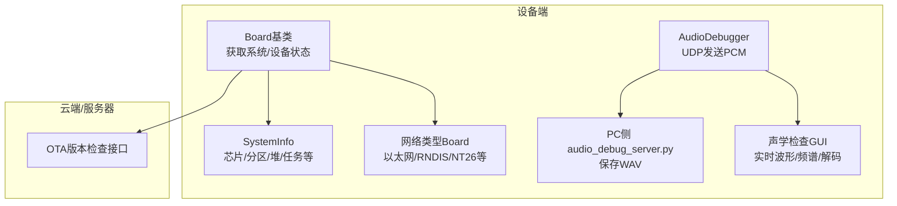
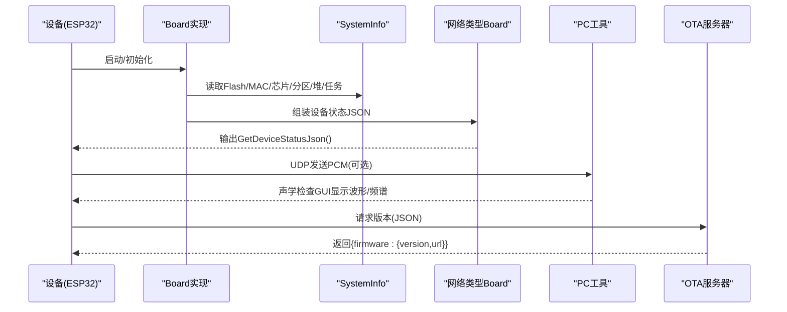
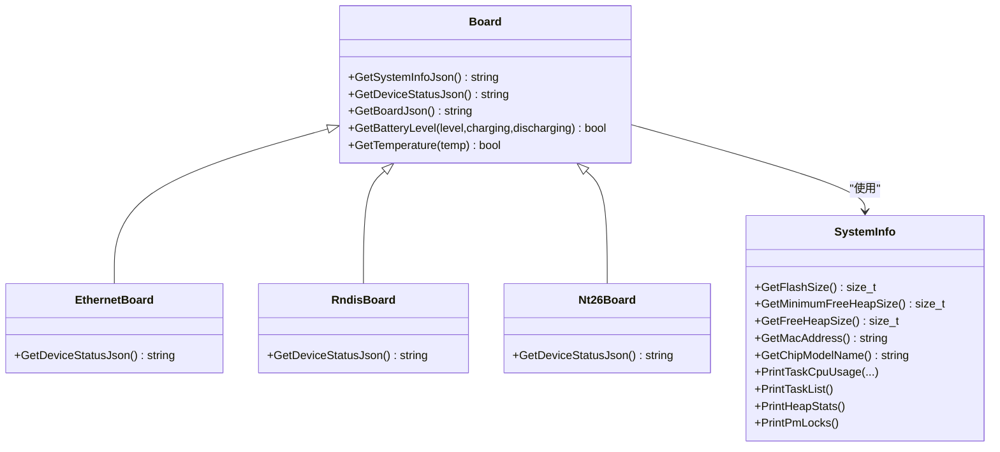
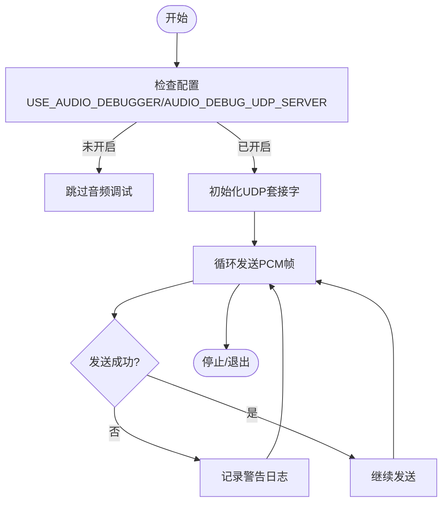
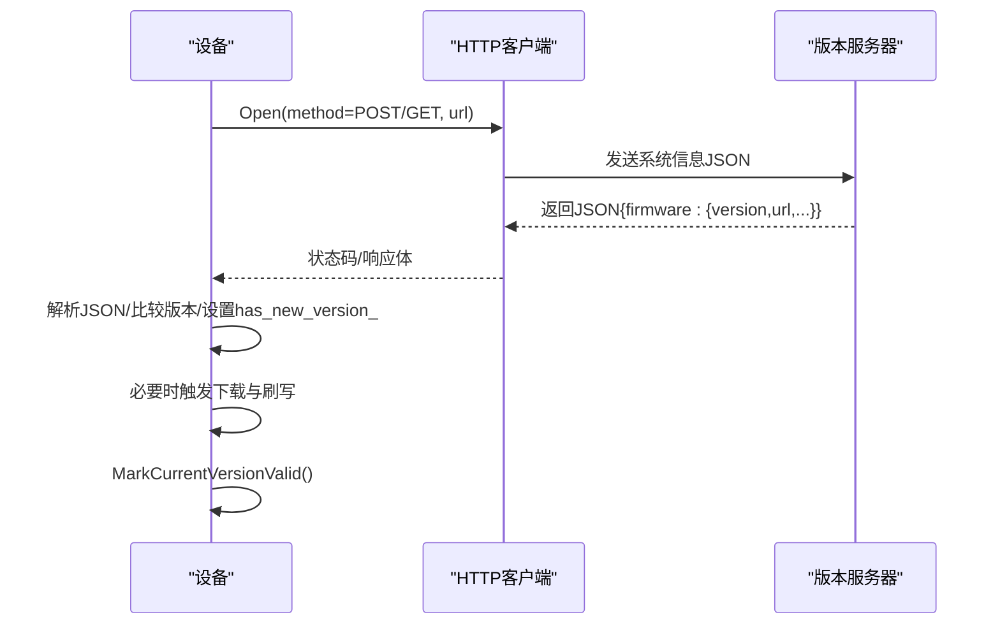
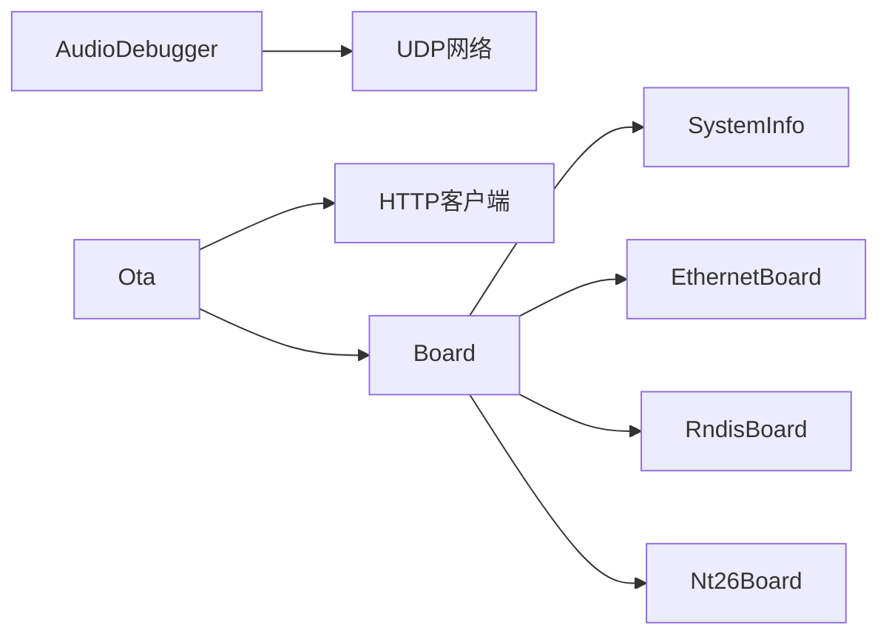

# 硬件调试工具和测试方法

<cite>
**本文引用的文件**   
- [README.md](file://README.md)
- [custom-board.md](file://docs/custom-board.md)
- [mcp-protocol.md](file://docs/mcp-protocol.md)
- [system_info.cc](file://main/system_info.cc)
- [system_info.h](file://main/system_info.h)
- [board.cc](file://main/boards/common/board.cc)
- [board.h](file://main/boards/common/board.h)
- [ethernet_board.cc](file://main/boards/common/ethernet_board.cc)
- [rndis_board.cc](file://main/boards/common/rndis_board.cc)
- [nt26_board.cc](file://main/boards/common/nt26_board.cc)
- [audio_debug_server.py](file://scripts/audio_debug_server.py)
- [acoustic_check/readme.md](file://scripts/acoustic_check/readme.md)
- [acoustic_check/main.py](file://scripts/acoustic_check/main.py)
- [Kconfig.projbuild](file://main/Kconfig.projbuild)
- [audio_debugger.cc](file://main/audio/processors/audio_debugger.cc)
- [ota.cc](file://main/ota.cc)
</cite>

## 目录
1. [简介](#简介)
2. [项目结构](#项目结构)
3. [核心组件](#核心组件)
4. [架构总览](#架构总览)
5. [详细组件分析](#详细组件分析)
6. [依赖关系分析](#依赖关系分析)
7. [性能与稳定性考量](#性能与稳定性考量)
8. [故障诊断指南](#故障诊断指南)
9. [结论](#结论)
10. [附录](#附录)

## 简介
本文件面向硬件调试与测试，结合仓库中已有的系统信息收集、设备状态上报、音频调试通道与声学检查工具，整理出：
- 常用硬件调试工具（逻辑分析仪、示波器、串口调试器）的使用要点
- 基于UDP的音频调试与声学检查脚本使用方法与结果解读
- 标准故障诊断流程与常用测试用例
- 硬件版本识别、固件版本管理、硬件信息收集的实践技巧
- 通过日志分析与错误码定位问题的方法

## 项目结构
本项目为ESP32系列设备的语音交互应用，包含多类板级适配、通用组件、协议栈与工具脚本。与硬件调试密切相关的目录与文件包括：
- 系统信息与设备状态：main/system_info.*、main/boards/common/board.*、各网络类型Board实现
- 音频调试与声学检查：main/audio/processors/audio_debugger.cc、scripts/audio_debug_server.py、scripts/acoustic_check/*
- 配置开关：main/Kconfig.projbuild（USE_AUDIO_DEBUGGER、AUDIO_DEBUG_UDP_SERVER）
- OTA与版本管理：main/ota.cc
- 文档：docs/custom-board.md、docs/mcp-protocol.md

图示来源
- [board.cc:70-178](file://main/boards/common/board.cc#L70-L178)
- [system_info.cc:18-159](file://main/system_info.cc#L18-L159)
- [ethernet_board.cc:256-302](file://main/boards/common/ethernet_board.cc#L256-L302)
- [rndis_board.cc:197-247](file://main/boards/common/rndis_board.cc#L197-L247)
- [nt26_board.cc:189-228](file://main/boards/common/nt26_board.cc#L189-L228)
- [audio_debugger.cc:3-61](file://main/audio/processors/audio_debugger.cc#L3-L61)
- [audio_debug_server.py:1-55](file://scripts/audio_debug_server.py#L1-55)
- [acoustic_check/main.py:1-19](file://scripts/acoustic_check/main.py#L1-19)
- [ota.cc:86-245](file://main/ota.cc#L86-L245)

章节来源
- [README.md:1-173](file://README.md#L1-L173)
- [custom-board.md:391-474](file://docs/custom-board.md#L391-L474)

## 核心组件
- 系统信息收集：提供Flash大小、最小空闲堆、MAC地址、芯片型号、应用描述、分区表、当前运行分区等信息，用于硬件版本识别与问题复现。
- 设备状态上报：按不同网络类型（以太网、RNDIS、NT26等）聚合音频、屏幕、电池、网络、温度等状态，便于远程诊断。
- 音频调试通道：在启用配置后，将I2S PCM数据经UDP发送至指定服务端，支持离线回放与频谱分析。
- 声学检查工具：接收并可视化时域/频域信号，辅助评估噪声分布与AFSK解调准确性。
- OTA版本管理：向服务器查询新版本，解析返回JSON并决定是否升级。

章节来源
- [system_info.h:9-21](file://main/system_info.h#L9-L21)
- [system_info.cc:18-159](file://main/system_info.cc#L18-L159)
- [board.h:75-92](file://main/boards/common/board.h#L75-L92)
- [board.cc:70-178](file://main/boards/common/board.cc#L70-L178)
- [ethernet_board.cc:256-302](file://main/boards/common/ethernet_board.cc#L256-L302)
- [rndis_board.cc:197-247](file://main/boards/common/rndis_board.cc#L197-L247)
- [nt26_board.cc:189-228](file://main/boards/common/nt26_board.cc#L189-L228)
- [audio_debugger.cc:3-61](file://main/audio/processors/audio_debugger.cc#L3-L61)
- [audio_debug_server.py:1-55](file://scripts/audio_debug_server.py#L1-55)
- [acoustic_check/readme.md:1-23](file://scripts/acoustic_check/readme.md#L1-L23)
- [ota.cc:86-245](file://main/ota.cc#L86-L245)

## 架构总览
下图展示了“设备状态/系统信息”、“音频调试”、“声学检查”和“OTA版本检查”的关键交互路径。

图示来源
- [board.cc:70-178](file://main/boards/common/board.cc#L70-L178)
- [system_info.cc:18-159](file://main/system_info.cc#L18-L159)
- [ethernet_board.cc:256-302](file://main/boards/common/ethernet_board.cc#L256-L302)
- [rndis_board.cc:197-247](file://main/boards/common/rndis_board.cc#L197-L247)
- [nt26_board.cc:189-228](file://main/boards/common/nt26_board.cc#L189-L228)
- [audio_debugger.cc:3-61](file://main/audio/processors/audio_debugger.cc#L3-L61)
- [audio_debug_server.py:1-55](file://scripts/audio_debug_server.py#L1-55)
- [ota.cc:86-245](file://main/ota.cc#L86-L245)

## 详细组件分析

### 系统信息与设备状态
- SystemInfo负责底层系统指标采集（Flash、堆、任务CPU占用、PM锁等），Board将其与板级信息组合成JSON供外部查看或上报。
- 不同网络类型Board在GetDeviceStatusJson中补充各自特有字段（如以太网IP、RNDIS类型、NT26蜂窝注册信息等）。

图示来源
- [board.h:75-92](file://main/boards/common/board.h#L75-L92)
- [board.cc:70-178](file://main/boards/common/board.cc#L70-L178)
- [ethernet_board.cc:256-302](file://main/boards/common/ethernet_board.cc#L256-L302)
- [rndis_board.cc:197-247](file://main/boards/common/rndis_board.cc#L197-L247)
- [nt26_board.cc:189-228](file://main/boards/common/nt26_board.cc#L189-L228)
- [system_info.h:9-21](file://main/system_info.h#L9-L21)
- [system_info.cc:18-159](file://main/system_info.cc#L18-L159)

章节来源
- [board.cc:70-178](file://main/boards/common/board.cc#L70-L178)
- [ethernet_board.cc:256-302](file://main/boards/common/ethernet_board.cc#L256-L302)
- [rndis_board.cc:197-247](file://main/boards/common/rndis_board.cc#L197-L247)
- [nt26_board.cc:189-228](file://main/boards/common/nt26_board.cc#L189-L228)
- [system_info.cc:18-159](file://main/system_info.cc#L18-L159)

### 音频调试通道与声学检查
- 启用条件：在配置项中开启USE_AUDIO_DEBUGGER，并设置AUDIO_DEBUG_UDP_SERVER为本机地址。
- 设备端：AudioDebugger将PCM数据经UDP发送到指定地址；若失败会记录警告日志。
- 服务端：Python脚本监听UDP端口，将收到的PCM写入WAV文件，便于后续分析。
- 声学检查GUI：接收并绘制时域/频域波形，辅助判断噪声分布与AFSK解调准确度。

图示来源
- [Kconfig.projbuild:944-976](file://main/Kconfig.projbuild#L944-L976)
- [audio_debugger.cc:3-61](file://main/audio/processors/audio_debugger.cc#L3-L61)
- [audio_debug_server.py:1-55](file://scripts/audio_debug_server.py#L1-55)
- [acoustic_check/readme.md:1-23](file://scripts/acoustic_check/readme.md#L1-L23)
- [acoustic_check/main.py:1-19](file://scripts/acoustic_check/main.py#L1-19)

章节来源
- [Kconfig.projbuild:944-976](file://main/Kconfig.projbuild#L944-L976)
- [audio_debugger.cc:3-61](file://main/audio/processors/audio_debugger.cc#L3-L61)
- [audio_debug_server.py:1-55](file://scripts/audio_debug_server.py#L1-55)
- [acoustic_check/readme.md:1-23](file://scripts/acoustic_check/readme.md#L1-L23)
- [acoustic_check/main.py:1-19](file://scripts/acoustic_check/main.py#L1-19)

### OTA版本管理与校验
- 设备端发起HTTP请求到版本检查URL，携带系统信息JSON作为内容。
- 解析返回JSON中的firmware.version与firmware.url，比较版本号并决定是否升级；支持强制升级标志。
- 成功后标记当前分区有效。

图示来源
- [ota.cc:86-245](file://main/ota.cc#L86-L245)
- [board.cc:70-178](file://main/boards/common/board.cc#L70-L178)

章节来源
- [ota.cc:86-245](file://main/ota.cc#L86-L245)
- [board.cc:70-178](file://main/boards/common/board.cc#L70-L178)

## 依赖关系分析
- Board依赖SystemInfo获取底层系统指标，并在不同网络类型Board中扩展设备状态字段。
- AudioDebugger依赖配置开关与UDP网络栈，将PCM流外发至PC工具。
- OTA模块依赖HTTP客户端与JSON解析，结合Board的系统信息上报进行版本决策。

图示来源
- [board.cc:70-178](file://main/boards/common/board.cc#L70-L178)
- [system_info.cc:18-159](file://main/system_info.cc#L18-L159)
- [ethernet_board.cc:256-302](file://main/boards/common/ethernet_board.cc#L256-L302)
- [rndis_board.cc:197-247](file://main/boards/common/rndis_board.cc#L197-L247)
- [nt26_board.cc:189-228](file://main/boards/common/nt26_board.cc#L189-L228)
- [audio_debugger.cc:3-61](file://main/audio/processors/audio_debugger.cc#L3-L61)
- [ota.cc:86-245](file://main/ota.cc#L86-L245)

章节来源
- [board.cc:70-178](file://main/boards/common/board.cc#L70-L178)
- [system_info.cc:18-159](file://main/system_info.cc#L18-L159)
- [audio_debugger.cc:3-61](file://main/audio/processors/audio_debugger.cc#L3-L61)
- [ota.cc:86-245](file://main/ota.cc#L86-L245)

## 性能与稳定性考量
- 任务CPU占用与堆统计：通过SystemInfo提供的任务列表与堆统计接口，可快速定位高负载任务与内存碎片风险。
- 音频调试开销：UDP持续发送PCM会增加CPU与网络负载，建议在需要时开启，并在生产环境关闭。
- OTA稳定性：版本检查失败需记录HTTP状态码与错误码，避免频繁重试导致拥塞。

章节来源
- [system_info.cc:59-159](file://main/system_info.cc#L59-L159)
- [audio_debugger.cc:3-61](file://main/audio/processors/audio_debugger.cc#L3-L61)
- [ota.cc:86-245](file://main/ota.cc#L86-L245)

## 故障诊断指南

### 常用硬件调试工具与方法
- 逻辑分析仪
  - 用途：抓取SPI/I2C/SPI LCD、I2S时钟/数据、按键抖动等数字信号时序。
  - 建议：先确认引脚定义与电平匹配，再捕获关键握手序列（如LCD初始化、Codec I2C读写）。
- 示波器
  - 用途：测量电源纹波、PA使能边沿、I2S位时钟频率与占空比、麦克风供电等模拟/混合信号。
  - 建议：关注上电时序与功耗峰值，确保满足器件规格。
- 串口调试器
  - 用途：打印系统日志、任务状态、堆信息、网络事件、OTA状态等。
  - 建议：结合SystemInfo与Board的状态输出，形成标准化排障清单。

[本节为通用指导，不直接分析具体文件]

### 硬件测试脚本使用与结果分析
- 音频调试（UDP）
  - 步骤：在配置中启用USE_AUDIO_DEBUGGER并设置AUDIO_DEBUG_UDP_SERVER为本机地址；运行PC端audio_debug_server.py，选择采样率与声道数；设备上播放或拾音后，本地生成WAV文件。
  - 结果分析：用音频软件打开WAV，观察信噪比、失真、丢包导致的断续。
- 声学检查GUI
  - 步骤：根据readme说明，打开USE_AUDIO_DEBUGGER并配置服务端地址；运行acoustic_check GUI，观察时域/频域波形与AFSK解码情况。
  - 结果分析：参考readme中的设备效果表格，评估降噪策略与硬件差异。

章节来源
- [Kconfig.projbuild:944-976](file://main/Kconfig.projbuild#L944-L976)
- [audio_debug_server.py:1-55](file://scripts/audio_debug_server.py#L1-55)
- [acoustic_check/readme.md:1-23](file://scripts/acoustic_check/readme.md#L1-L23)
- [acoustic_check/main.py:1-19](file://scripts/acoustic_check/main.py#L1-19)

### 标准故障诊断流程
- 现象确认：复现问题，记录设备状态JSON（包含音频、屏幕、电池、网络、温度等）。
- 基础检查：电源电压与时序、I2S连线、Codec I2C地址、SPI屏驱动参数。
- 音频链路：启用音频调试，对比原始PCM与解码后声音；必要时调整降噪或参考设备表格。
- 网络与协议：检查WiFi/以太网连接、MQTT/WebSocket连通性、OTA版本检查状态码。
- 资源与稳定性：查看任务CPU占用、堆最小值、PM锁，排查死锁或高占用任务。
- 版本与配置：核对固件版本、分区表、编译选项（如USE_AUDIO_DEBUGGER）。

章节来源
- [board.cc:70-178](file://main/boards/common/board.cc#L70-L178)
- [ethernet_board.cc:256-302](file://main/boards/common/ethernet_board.cc#L256-L302)
- [rndis_board.cc:197-247](file://main/boards/common/rndis_board.cc#L197-L247)
- [nt26_board.cc:189-228](file://main/boards/common/nt26_board.cc#L189-L228)
- [system_info.cc:59-159](file://main/system_info.cc#L59-L159)
- [audio_debugger.cc:3-61](file://main/audio/processors/audio_debugger.cc#L3-L61)
- [ota.cc:86-245](file://main/ota.cc#L86-L245)

### 常用测试用例
- 音频通路测试：录制与回放，验证I2S与Codec工作正常；使用UDP导出WAV进行离线分析。
- 显示通路测试：初始化LCD/OLED，检查分辨率、主题、亮度控制。
- 网络连通性测试：WiFi/以太网/4G拨号与心跳，检查状态JSON中网络字段。
- OTA更新测试：调用版本检查接口，验证返回JSON结构与升级流程。
- 功耗与休眠：进入省电模式，观察唤醒与恢复行为。

章节来源
- [board.cc:70-178](file://main/boards/common/board.cc#L70-L178)
- [ethernet_board.cc:256-302](file://main/boards/common/ethernet_board.cc#L256-L302)
- [rndis_board.cc:197-247](file://main/boards/common/rndis_board.cc#L197-L247)
- [nt26_board.cc:189-228](file://main/boards/common/nt26_board.cc#L189-L228)
- [audio_debug_server.py:1-55](file://scripts/audio_debug_server.py#L1-55)
- [ota.cc:86-245](file://main/ota.cc#L86-L245)

### 硬件版本识别、固件版本管理与信息收集
- 硬件版本识别：通过GetSystemInfoJson输出的chip_info、partition_table、board字段，结合UUID与SKU，完成设备唯一标识与板型识别。
- 固件版本管理：通过OTA模块解析服务器返回的firmware.version与url，执行升级；MarkCurrentVersionValid确保回滚安全。
- 信息收集：汇总MAC地址、应用版本、编译时间、IDF版本、ELF SHA256、语言、显示尺寸等，便于问题追踪。

章节来源
- [board.cc:70-178](file://main/boards/common/board.cc#L70-L178)
- [system_info.cc:18-159](file://main/system_info.cc#L18-L159)
- [ota.cc:86-245](file://main/ota.cc#L86-L245)

### 日志分析与错误码定位
- 常见错误码来源：HTTP状态码（OTA）、esp_err_t（I2C探测、网络操作）、errno（UDP发送失败）。
- 日志关键字：系统信息标签、OTA标签、AudioDebugger标签、网络类型Board标签。
- 定位建议：优先从最近一次异常前的日志入手，结合设备状态JSON与任务CPU占用，缩小范围。

章节来源
- [audio_debugger.cc:3-61](file://main/audio/processors/audio_debugger.cc#L3-L61)
- [ota.cc:86-245](file://main/ota.cc#L86-L245)
- [system_info.cc:18-159](file://main/system_info.cc#L18-L159)

## 结论
通过系统信息收集、设备状态上报、音频调试通道与声学检查工具，配合逻辑分析仪、示波器与串口调试器，可以高效完成硬件调试与问题定位。建议在生产环境中按需开启调试功能，并建立标准化的日志与状态收集流程，以提升排障效率与一致性。

## 附录
- MCP工具与设备控制：可通过MCP工具获取设备状态与控制音量、屏幕亮度等，详见相关文档。
- 自定义板开发：参考自定义板文档，逐步点亮显示、音频与网络，确保引脚与驱动兼容。

章节来源
- [mcp-protocol.md:270-271](file://docs/mcp-protocol.md#L270-L271)
- [custom-board.md:147-279](file://docs/custom-board.md#L147-L279)
- [custom-board.md:391-474](file://docs/custom-board.md#L391-L474)