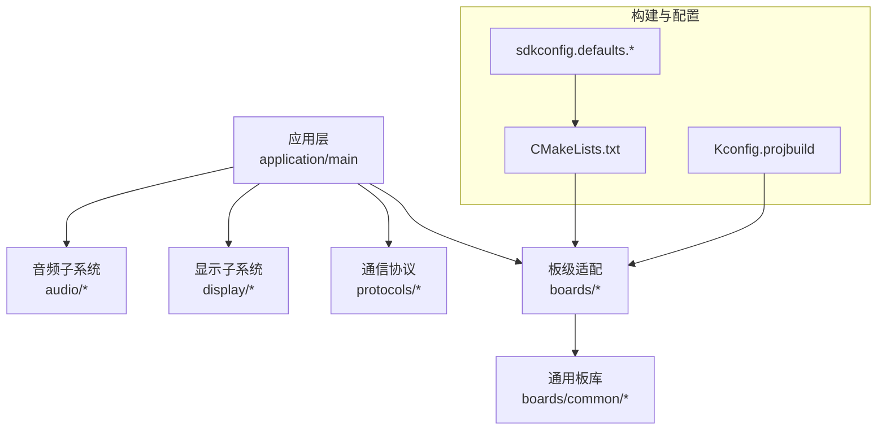
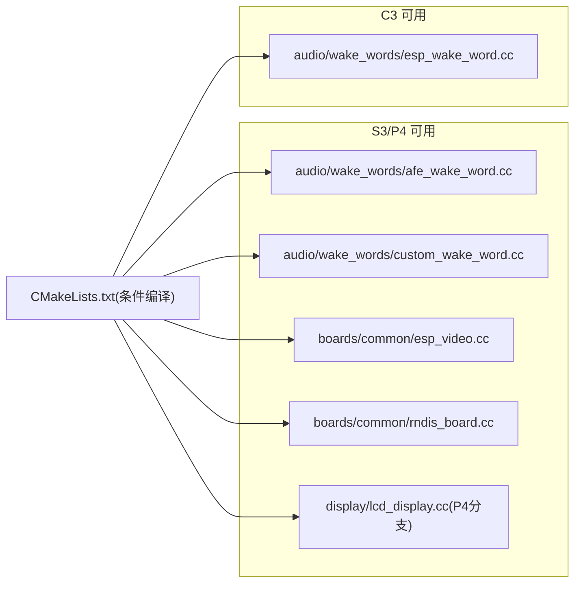
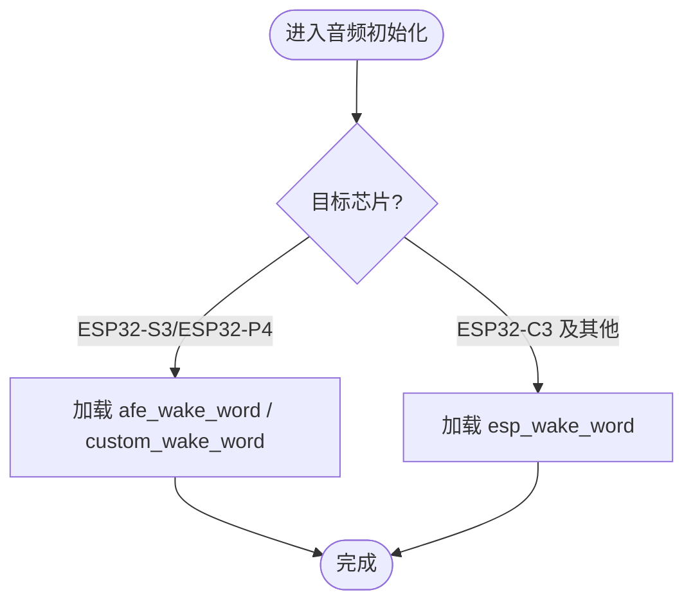
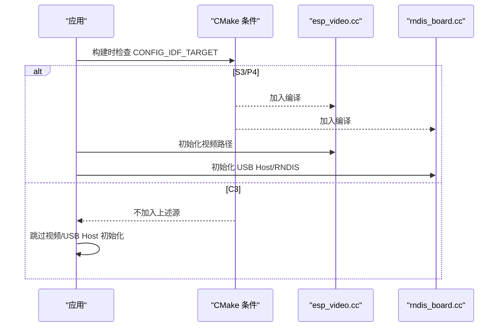
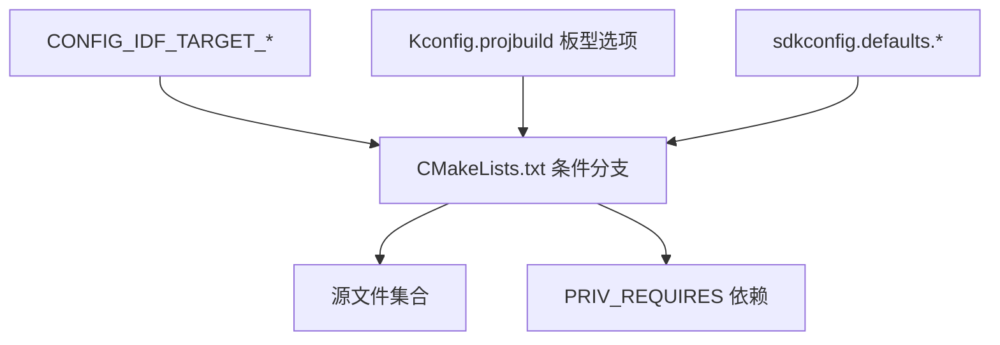

# 芯片平台兼容性问题

<cite>
**本文引用的文件**   
- [README.md](file://README.md)
- [CMakeLists.txt](file://main/CMakeLists.txt)
- [Kconfig.projbuild](file://main/Kconfig.projbuild)
- [sdkconfig.defaults.esp32s3](file://sdkconfig.defaults.esp32s3)
- [sdkconfig.defaults.esp32c3](file://sdkconfig.defaults.esp32c3)
- [sdkconfig.defaults.esp32p4](file://sdkconfig.defaults.esp32p4)
- [audio_service.cc](file://main/audio/audio_service.cc)
- [esp_video.cc](file://main/boards/common/esp_video.cc)
- [rndis_board.cc](file://main/boards/common/rndis_board.cc)
- [lcd_display.cc](file://main/display/lcd_display.cc)
- [system_info.cc](file://main/system_info.cc)
</cite>

## 目录
1. [简介](#简介)
2. [项目结构](#项目结构)
3. [核心组件](#核心组件)
4. [架构总览](#架构总览)
5. [详细组件分析](#详细组件分析)
6. [依赖关系分析](#依赖关系分析)
7. [性能与内存优化建议](#性能与内存优化建议)
8. [故障排查指南](#故障排查指南)
9. [结论](#结论)
10. [附录：跨平台移植清单](#附录跨平台移植清单)

## 简介
本文件聚焦于 ESP32-S3、ESP32-C3、ESP32-P4 三大芯片平台的兼容性差异，结合工程源码与配置，系统梳理以下方面：
- 各平台内存限制、外设支持差异及其对软件适配的影响
- 针对各平台的配置优化建议与编译参数调整
- 芯片特定的驱动适配问题与解决方案
- 跨平台代码移植注意事项与最佳实践

本项目已原生支持 ESP32-C3、ESP32-S3、ESP32-P4 平台，并通过 Kconfig 与 CMake 条件编译实现差异化构建。

章节来源
- [README.md:34](file://README.md#L34)

## 项目结构
仓库采用“按功能分层 + 按板级配置”的组织方式：
- main/ 下包含应用逻辑、音频、显示、协议等通用模块
- main/boards/ 下按厂商/型号组织板级适配（含引脚、电源、外设初始化）
- sdkconfig.defaults.* 提供各目标芯片的默认配置覆盖
- partitions/ 提供不同分区表方案（v1/v2），影响固件与资源布局

图表来源
- [CMakeLists.txt:1-40](file://main/CMakeLists.txt#L1-L40)
- [Kconfig.projbuild:242-276](file://main/Kconfig.projbuild#L242-L276)

章节来源
- [CMakeLists.txt:1-40](file://main/CMakeLists.txt#L1-L40)
- [Kconfig.projbuild:242-276](file://main/Kconfig.projbuild#L242-L276)

## 核心组件
- 构建选择与平台分支
  - 通过 CONFIG_IDF_TARGET_* 宏在 CMake 中动态增减源文件与依赖
  - 根据目标芯片启用/禁用特定音频唤醒词实现、视频/RNDIS 能力、摄像头等
- 板级配置
  - Kconfig 中 BOARD_TYPE 选项受 IDF_TARGET 约束，避免在不支持的平台上出现无效选项
- 默认配置
  - sdkconfig.defaults.esp32s3/c3/p4 分别定义 Flash、PSRAM、网络栈、优化等级等差异

章节来源
- [CMakeLists.txt:887-893](file://main/CMakeLists.txt#L887-L893)
- [CMakeLists.txt:1008-1032](file://main/CMakeLists.txt#L1008-L1032)
- [Kconfig.projbuild:242-276](file://main/Kconfig.projbuild#L242-L276)
- [sdkconfig.defaults.esp32s3](file://sdkconfig.defaults.esp32s3)
- [sdkconfig.defaults.esp32c3](file://sdkconfig.defaults.esp32c3)
- [sdkconfig.defaults.esp32p4](file://sdkconfig.defaults.esp32p4)

## 架构总览
下图展示关键平台相关源文件的条件编译与依赖关系，体现 S3/P4 与 C3 的差异点。

图表来源
- [CMakeLists.txt:887-893](file://main/CMakeLists.txt#L887-L893)
- [CMakeLists.txt:1022-1032](file://main/CMakeLists.txt#L1022-L1032)
- [lcd_display.cc:498](file://main/display/lcd_display.cc#L498)

## 详细组件分析

### 音频子系统与唤醒词适配
- 差异点
  - ESP32-S3/ESP32-P4：启用 afe_wake_word 与 custom_wake_word 实现
  - 其他平台（如 ESP32-C3）：使用 esp_wake_word 实现
- 原因
  - 不同芯片的音频处理管线与硬件加速能力不同，需选择合适的前端唤醒实现
- 影响
  - 在 C3 上若错误启用 S3/P4 专属实现会导致链接失败或运行时异常

图表来源
- [CMakeLists.txt:887-893](file://main/CMakeLists.txt#L887-L893)
- [audio_service.cc:30](file://main/audio/audio_service.cc#L30)
- [audio_service.cc:702](file://main/audio/audio_service.cc#L702)
- [audio_service.cc:728](file://main/audio/audio_service.cc#L728)

章节来源
- [CMakeLists.txt:887-893](file://main/CMakeLists.txt#L887-L893)
- [audio_service.cc:30](file://main/audio/audio_service.cc#L30)
- [audio_service.cc:702](file://main/audio/audio_service.cc#L702)
- [audio_service.cc:728](file://main/audio/audio_service.cc#L728)

### 视频与 USB Host（RNDIS）能力
- 差异点
  - ESP32-S3/ESP32-P4：可启用 esp_video 与 rndis_board 以支持视频输出与 USB Host 能力
  - ESP32-C3：不包含上述能力
- 影响
  - 在 C3 上不应启用相关功能；否则可能因缺少驱动或外设导致构建/运行失败

图表来源
- [CMakeLists.txt:1022-1027](file://main/CMakeLists.txt#L1022-L1027)
- [esp_video.cc:34](file://main/boards/common/esp_video.cc#L34)
- [rndis_board.cc:14](file://main/boards/common/rndis_board.cc#L14)
- [rndis_board.cc:246](file://main/boards/common/rndis_board.cc#L246)

章节来源
- [CMakeLists.txt:1022-1027](file://main/CMakeLists.txt#L1022-L1027)
- [esp_video.cc:34](file://main/boards/common/esp_video.cc#L34)
- [rndis_board.cc:14](file://main/boards/common/rndis_board.cc#L14)
- [rndis_board.cc:246](file://main/boards/common/rndis_board.cc#L246)

### 摄像头能力（仅 ESP32-S3）
- 差异点
  - 仅在 ESP32-S3 目标下引入 esp32_camera 相关源
- 影响
  - 在 P4/C3 上不可用摄像头驱动；如需图像采集需评估替代方案或平台迁移

章节来源
- [CMakeLists.txt:1029-1032](file://main/CMakeLists.txt#L1029-L1032)

### 显示子系统（LCD）
- 差异点
  - ESP32-P4 在 LCD 显示中有专门分支逻辑
- 影响
  - 在 P4 上需遵循其显示时序与接口要求，避免刷新异常或花屏

章节来源
- [lcd_display.cc:498](file://main/display/lcd_display.cc#L498)

### 系统信息与以太网
- 差异点
  - ESP32-P4 在无以太网配置时的系统信息路径存在特殊分支
- 影响
  - 在 P4 上需确保系统信息上报与诊断逻辑正确分支

章节来源
- [system_info.cc:11](file://main/system_info.cc#L11)
- [system_info.cc:38](file://main/system_info.cc#L38)

## 依赖关系分析
- 条件编译入口
  - CMakeLists.txt 依据 CONFIG_IDF_TARGET_* 决定源文件集合与依赖项
- 板级选项约束
  - Kconfig.projbuild 将 BOARD_TYPE 选项绑定到具体 IDF_TARGET，防止跨平台误选
- 默认配置覆盖
  - sdkconfig.defaults.esp32s3/c3/p4 为各平台提供差异化默认值（Flash、PSRAM、网络栈、优化等级等）

图表来源
- [CMakeLists.txt:887-893](file://main/CMakeLists.txt#L887-L893)
- [CMakeLists.txt:1008-1032](file://main/CMakeLists.txt#L1008-L1032)
- [Kconfig.projbuild:242-276](file://main/Kconfig.projbuild#L242-L276)

章节来源
- [CMakeLists.txt:887-893](file://main/CMakeLists.txt#L887-L893)
- [CMakeLists.txt:1008-1032](file://main/CMakeLists.txt#L1008-L1032)
- [Kconfig.projbuild:242-276](file://main/Kconfig.projbuild#L242-L276)

## 性能与内存优化建议

### ESP32-S3
- 内存与缓存
  - 启用 PSRAM（QIO/80MHz），合理设置内部保留与外部分配阈值，降低堆碎片风险
  - 开启指令缓存与数据缓存线宽优化，提升吞吐
- 网络栈
  - 调整 Wi-Fi 接收缓冲与 LWIP 队列大小，平衡吞吐与内存占用
- 图形
  - LVGL 快照功能按需启用，减少重复渲染开销

章节来源
- [sdkconfig.defaults.esp32s3:1-32](file://sdkconfig.defaults.esp32s3#L1-L32)

### ESP32-C3
- 内存与栈
  - 关闭 IPv6、限制 WPA3 SAE 与最大加密数，降低协议栈开销
  - 减小空闲任务栈，控制整体 RAM 占用
- 分区表
  - 使用 v2 分区表中的 C3 专用分区文件，避免资源区越界

章节来源
- [sdkconfig.defaults.esp32c3:1-15](file://sdkconfig.defaults.esp32c3#L1-L15)

### ESP32-P4
- 内存与调度
  - 提高主任务栈大小，启用更高优先级调度频率，增强实时性
  - 启用 PSRAM XIP 与高速模式，提升大对象访问效率
- 实验特性与优化
  - 开启实验特性与性能优化等级，配合视频/USB Host 能力
- 视频与 USB
  - 调整 USB Host 控制传输最大尺寸，匹配外设需求

章节来源
- [sdkconfig.defaults.esp32p4:1-32](file://sdkconfig.defaults.esp32p4#L1-L32)

## 故障排查指南
- 构建期常见问题
  - 在不支持的平台启用了 S3/P4 专属源（如 afe_wake_word、esp_video、rndis_board），导致链接失败
    - 检查 CMake 条件分支是否按 CONFIG_IDF_TARGET_* 生效
  - 未选择正确的板型选项，导致字体/表情集/资源生成不一致
    - 确认 Kconfig 中 BOARD_TYPE 与 IDF_TARGET 的依赖关系
- 运行期常见问题
  - C3 上尝试使用摄像头或视频输出导致崩溃
    - 确认仅在 S3 上启用摄像头，P4/C3 不使用相关路径
  - P4 上显示异常或刷新卡顿
    - 检查 lcd_display 中 P4 分支逻辑与时序配置
  - 系统信息上报为空或不完整
    - 核对 system_info 中 P4 分支条件与以太网开关

章节来源
- [CMakeLists.txt:887-893](file://main/CMakeLists.txt#L887-L893)
- [CMakeLists.txt:1022-1032](file://main/CMakeLists.txt#L1022-L1032)
- [Kconfig.projbuild:242-276](file://main/Kconfig.projbuild#L242-L276)
- [lcd_display.cc:498](file://main/display/lcd_display.cc#L498)
- [system_info.cc:11](file://main/system_info.cc#L11)
- [system_info.cc:38](file://main/system_info.cc#L38)

## 结论
- 本项目通过 Kconfig 与 CMake 的条件编译机制，实现了 ESP32-S3、ESP32-C3、ESP32-P4 的多平台适配
- 各平台在音频唤醒、视频/USB Host、摄像头、显示等方面存在显著差异，需在构建与运行时严格区分
- 针对不同平台的默认配置已给出内存、网络、图形与优化的基线，可按场景微调
- 建议在新增功能时优先以 CONFIG_IDF_TARGET_* 进行平台分支，避免侵入式修改

## 附录：跨平台移植清单
- 构建与配置
  - 使用 CONFIG_IDF_TARGET_* 进行条件编译，不要硬编码平台判断
  - 在 Kconfig 中将板型选项绑定到对应 IDF_TARGET
  - 为每个目标芯片维护独立的 sdkconfig.defaults.* 文件
- 外设与驱动
  - 音频：按平台选择唤醒词实现（S3/P4 用 afe/custom，C3 用 esp）
  - 视频/USB Host：仅在 S3/P4 启用
  - 摄像头：仅在 S3 启用
  - 显示：注意 P4 的特殊分支与时序
- 内存与性能
  - 合理设置 PSRAM、缓存、网络栈与 LVGL 参数
  - 针对 C3 精简协议栈与栈空间，针对 P4 提升调度与优化等级
- 资源与分区
  - 使用 v2 分区表并为目标芯片选择对应分区文件
  - 根据平台能力裁剪字体、表情与模型资源

章节来源
- [CMakeLists.txt:887-893](file://main/CMakeLists.txt#L887-L893)
- [CMakeLists.txt:1008-1032](file://main/CMakeLists.txt#L1008-L1032)
- [Kconfig.projbuild:242-276](file://main/Kconfig.projbuild#L242-L276)
- [sdkconfig.defaults.esp32s3](file://sdkconfig.defaults.esp32s3)
- [sdkconfig.defaults.esp32c3](file://sdkconfig.defaults.esp32c3)
- [sdkconfig.defaults.esp32p4](file://sdkconfig.defaults.esp32p4)