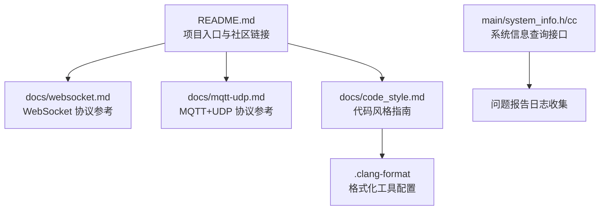
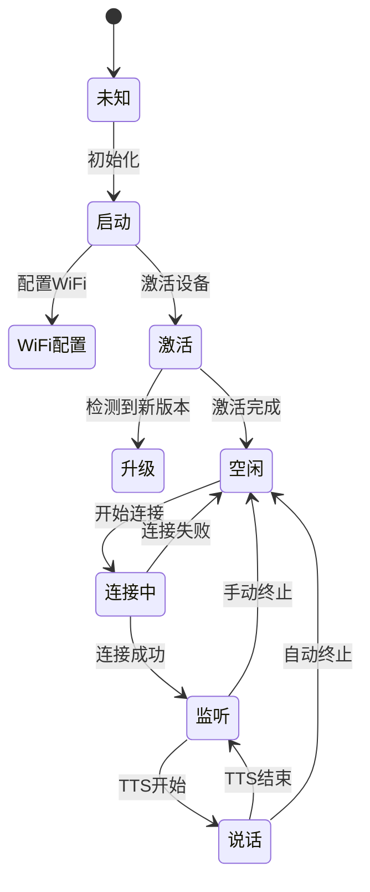
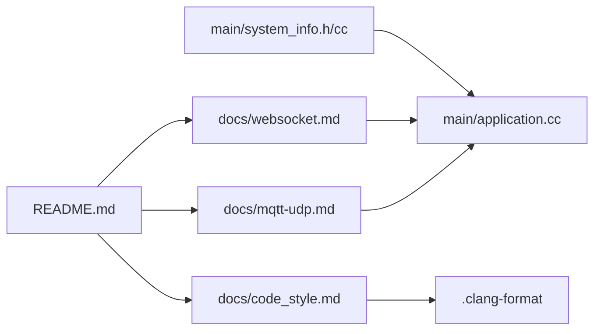

# 社区支持和资源

<cite>
**本文引用的文件**   
- [README.md](file://README.md)
- [docs/websocket.md](file://docs/websocket.md)
- [docs/mqtt-udp.md](file://docs/mqtt-udp.md)
- [docs/code_style.md](file://docs/code_style.md)
- [.clang-format](file://.clang-format)
- [main/system_info.h](file://main/system_info.h)
- [main/system_info.cc](file://main/system_info.cc)
- [main/application.cc](file://main/application.cc)
</cite>

## 目录
1. [简介](#简介)
2. [项目结构](#项目结构)
3. [核心组件](#核心组件)
4. [架构总览](#架构总览)
5. [详细组件分析](#详细组件分析)
6. [依赖分析](#依赖分析)
7. [性能考虑](#性能考虑)
8. [故障排查指南](#故障排查指南)
9. [结论](#结论)
10. [附录](#附录)

## 简介
本指南面向希望参与 XiaoZhi ESP32 项目的用户与贡献者，聚焦“如何获取社区帮助”和“如何高效提交问题与贡献代码”。内容涵盖：
- 社区渠道：GitHub Issues、Discord、QQ群的使用方法与注意事项
- 问题报告最佳实践：描述模板、日志收集、复现步骤
- 代码贡献流程：代码风格、Pull Request 提交流程、测试要求
- 相关开源项目、技术文档与学习资源
- 常见问题快速查找与热点话题汇总

## 项目结构
仓库中与社区支持相关的资料主要分布在根级说明与 docs 目录中：
- README.md：项目概览、硬件/软件入门、服务器与客户端生态链接、社区入口（Issues/Discord/QQ）
- docs/websocket.md / docs/mqtt-udp.md：设备与服务器通信协议参考，便于定位网络相关问题
- docs/code_style.md 与 .clang-format：代码风格规范与格式化配置，贡献代码前必读
- main/system_info.*：系统信息接口，可用于收集设备关键诊断信息

**图示来源**
- [README.md:1-173](file://README.md#L1-L173)
- [docs/websocket.md:1-531](file://docs/websocket.md#L1-L531)
- [docs/mqtt-udp.md:1-410](file://docs/mqtt-udp.md#L1-L410)
- [docs/code_style.md:1-91](file://docs/code_style.md#L1-L91)
- [.clang-format:1-126](file://.clang-format#L1-L126)
- [main/system_info.h:1-23](file://main/system_info.h#L1-L23)
- [main/system_info.cc:46-85](file://main/system_info.cc#L46-L85)

**章节来源**
- [README.md:1-173](file://README.md#L1-L173)
- [docs/websocket.md:1-531](file://docs/websocket.md#L1-L531)
- [docs/mqtt-udp.md:1-410](file://docs/mqtt-udp.md#L1-L410)
- [docs/code_style.md:1-91](file://docs/code_style.md#L1-L91)
- [.clang-format:1-126](file://.clang-format#L1-L126)
- [main/system_info.h:1-23](file://main/system_info.h#L1-L23)
- [main/system_info.cc:46-85](file://main/system_info.cc#L46-L85)

## 核心组件
- 社区入口与生态链接
  - GitHub Issues：用于提交 Bug、功能建议与讨论
  - Discord：实时交流与答疑
  - QQ 群：中文社区沟通
  - 官方控制台 xiaozhi.me：已连接设备的配置管理
- 协议与调试参考
  - WebSocket 协议文档：设备与服务端握手、消息类型、错误处理等
  - MQTT + UDP 混合协议文档：控制通道与音频通道分离设计、加密与序列号机制
- 代码风格与工具链
  - Google C++ 风格 + clang-format 自动格式化
  - IDE 集成与 CI 检查建议
- 系统信息与日志
  - SystemInfo 接口提供芯片型号、MAC、内存、任务 CPU 使用率等
  - Application 层对网络、激活、消息分发、告警等进行日志输出

**章节来源**
- [README.md:1-173](file://README.md#L1-L173)
- [docs/websocket.md:1-531](file://docs/websocket.md#L1-L531)
- [docs/mqtt-udp.md:1-410](file://docs/mqtt-udp.md#L1-L410)
- [docs/code_style.md:1-91](file://docs/code_style.md#L1-L91)
- [.clang-format:1-126](file://.clang-format#L1-L126)
- [main/system_info.h:1-23](file://main/system_info.h#L1-L23)
- [main/system_info.cc:46-85](file://main/system_info.cc#L46-L85)
- [main/application.cc:261-604](file://main/application.cc#L261-L604)

## 架构总览
下图展示设备在语音会话中的典型状态流转，有助于理解问题发生时的上下文（如连接失败、TTS 播放、监听中断等），从而更准确地定位问题。

**图示来源**
- [docs/websocket.md:323-398](file://docs/websocket.md#L323-L398)

## 详细组件分析

### 社区渠道与使用方法
- GitHub Issues
  - 用途：Bug 报告、功能建议、问题讨论
  - 建议：先搜索历史 Issue，避免重复；按“问题报告最佳实践”准备材料
- Discord
  - 用途：即时交流、快速答疑、经验分享
  - 建议：提问时附上设备型号、固件版本、关键日志片段
- QQ 群
  - 用途：中文社区沟通、教程分享
  - 建议：遵循群规，尽量结构化表达问题
- 官方控制台 xiaozhi.me
  - 用途：已连接设备的配置管理与调试入口

**章节来源**
- [README.md:158-163](file://README.md#L158-L163)
- [README.md:131-134](file://README.md#L131-L134)

### 问题报告最佳实践
- 标题与标签
  - 标题简明扼要，包含设备型号、固件版本、现象关键词
  - 标签建议：bug、question、feature-request、network、audio、display 等
- 问题描述模板
  - 设备信息：板卡型号、芯片平台、固件版本、分区表版本
  - 环境信息：操作系统、IDE/ESP-IDF 版本、编译选项
  - 现象描述：期望行为 vs 实际行为、是否可稳定复现
  - 复现步骤：编号步骤、最小化场景、前后对比
  - 预期结果：明确可验证的判定标准
- 日志收集方法
  - 启用并导出串口日志（含网络握手、消息收发、错误码）
  - 记录关键时间戳与事件顺序（如 hello、listen、tts start/stop）
  - 若涉及网络，记录服务端返回的状态码或错误提示
  - 使用 SystemInfo 接口补充设备侧诊断信息（见下节）
- 附件与证据
  - 截图/录屏、配置文件（脱敏）、抓包数据（必要时）
  - 最小可复现代码片段或构建脚本（如有自定义修改）

**章节来源**
- [main/system_info.h:1-23](file://main/system_info.h#L1-L23)
- [main/system_info.cc:46-85](file://main/system_info.cc#L46-L85)
- [docs/websocket.md:402-440](file://docs/websocket.md#L402-L440)
- [docs/mqtt-udp.md:297-336](file://docs/mqtt-udp.md#L297-L336)

### 代码贡献流程
- 代码风格要求
  - 采用 Google C++ 风格，统一使用 clang-format 进行格式化
  - 缩进 4 空格、行宽不超过 100 字符、附接式大括号、指针/引用绑定到类型
  - 提交前务必运行格式化，避免手工对齐覆盖格式化结果
- 本地格式化与检查
  - 安装 clang-format（Windows/Linux/macOS）
  - 单文件/全工程格式化与 dry-run 检查
  - IDE 集成（VSCode/CLion）
- Pull Request 提交流程
  - Fork 仓库、创建特性分支、提交变更、推送后发起 PR
  - PR 描述需包含：变更目的、影响范围、兼容性说明、测试情况
  - 保持 PR 小而精，便于审查与合并
- 测试要求
  - 确保编译通过、无新增警告
  - 针对改动点补充或更新单元测试/集成测试（如有）
  - 如涉及网络/音频，建议在多环境下验证（不同板卡/采样率/帧长）

**章节来源**
- [docs/code_style.md:1-91](file://docs/code_style.md#L1-L91)
- [.clang-format:1-126](file://.clang-format#L1-L126)

### 相关开源项目与技术文档
- 服务器实现（个人电脑部署）
  - Python/Java/Golang 等多语言服务端参考
- 其他客户端实现
  - Python/Android/Linux 等客户端参考
- 自定义素材生成器
  - 在线编辑唤醒词、字体、表情、聊天背景等
- 协议与开发文档
  - WebSocket 协议文档
  - MQTT + UDP 混合协议文档
  - 自定义板卡指南、MCP 协议与用法

**章节来源**
- [README.md:136-156](file://README.md#L136-L156)
- [docs/websocket.md:1-531](file://docs/websocket.md#L1-L531)
- [docs/mqtt-udp.md:1-410](file://docs/mqtt-udp.md#L1-L410)

### 常见问题快速查找与热点话题
- 网络连接类
  - 无法连接/握手超时：检查 Authorization、Protocol-Version、Device-Id、Client-Id 等请求头；确认服务端 hello 响应字段匹配
  - 断线重连：观察 OnDisconnected 回调与重试策略
- 音频传输类
  - 无声/杂音：核对 Opus 编码参数（采样率、声道、帧时长）、下行采样率差异导致的重采样
  - 延迟/卡顿：评估网络质量、缓冲区大小、AEC/NR/AGC 开关
- 物联网控制（MCP）
  - 能力发现/工具调用失败：检查 type: "mcp" 的 JSON-RPC 2.0 payload 结构与路由
- 显示与交互
  - 表情/文本显示异常：关注 LLM/Alert 消息字段与 UI 渲染逻辑
- 热点话题
  - v1/v2 分区表不兼容与 OTA 升级路径
  - 多协议选择（WebSocket vs MQTT+UDP）与部署权衡
  - 自定义板卡适配与资源打包

**章节来源**
- [docs/websocket.md:83-92](file://docs/websocket.md#L83-L92)
- [docs/websocket.md:323-398](file://docs/websocket.md#L323-L398)
- [docs/mqtt-udp.md:297-336](file://docs/mqtt-udp.md#L297-L336)
- [README.md:15-21](file://README.md#L15-L21)

## 依赖分析
- 社区与文档依赖关系
  - README 作为入口，聚合了协议文档、代码风格、生态项目链接
  - 协议文档为问题定位与贡献开发提供依据
  - 代码风格与 clang-format 是贡献前置条件
- 运行时依赖
  - SystemInfo 提供设备侧诊断信息，辅助问题定位
  - Application 层负责网络、消息分发与告警，是日志的主要来源

**图示来源**
- [README.md:1-173](file://README.md#L1-L173)
- [docs/websocket.md:1-531](file://docs/websocket.md#L1-L531)
- [docs/mqtt-udp.md:1-410](file://docs/mqtt-udp.md#L1-L410)
- [docs/code_style.md:1-91](file://docs/code_style.md#L1-L91)
- [.clang-format:1-126](file://.clang-format#L1-L126)
- [main/system_info.h:1-23](file://main/system_info.h#L1-L23)
- [main/system_info.cc:46-85](file://main/system_info.cc#L46-L85)
- [main/application.cc:261-604](file://main/application.cc#L261-L604)

**章节来源**
- [README.md:1-173](file://README.md#L1-L173)
- [docs/websocket.md:1-531](file://docs/websocket.md#L1-L531)
- [docs/mqtt-udp.md:1-410](file://docs/mqtt-udp.md#L1-L410)
- [docs/code_style.md:1-91](file://docs/code_style.md#L1-L91)
- [.clang-format:1-126](file://.clang-format#L1-L126)
- [main/system_info.h:1-23](file://main/system_info.h#L1-L23)
- [main/system_info.cc:46-85](file://main/system_info.cc#L46-L85)
- [main/application.cc:261-604](file://main/application.cc#L261-L604)

## 性能考虑
- 协议选择
  - WebSocket：实现简单、防火墙友好，适合大多数场景
  - MQTT + UDP：控制与数据分离，低延迟，但网络复杂度更高
- 音频参数
  - 上行默认 16kHz 单声道，下行可能为 24kHz，注意重采样带来的失真风险
- 网络优化
  - 合理设置帧时长、缓冲与重传策略
  - 监控丢包、解密失败、序列号跳变等指标

[本节为通用指导，无需特定文件来源]

## 故障排查指南
- 连接与握手
  - 检查请求头与 hello 字段是否匹配；确认超时与重试策略
- 消息解析
  - 缺少必要字段（如 type）将导致忽略消息；查看应用层日志
- 告警与系统命令
  - Alert/System 消息会触发界面提示或重启；确认字段完整性
- 自定义消息
  - 仅在启用相应配置时生效；校验 payload 结构
- 系统信息收集
  - 使用 SystemInfo 获取 MAC、芯片型号、内存、任务 CPU 使用率等，辅助定位

**章节来源**
- [docs/websocket.md:402-440](file://docs/websocket.md#L402-L440)
- [main/application.cc:543-604](file://main/application.cc#L543-L604)
- [main/system_info.h:1-23](file://main/system_info.h#L1-L23)
- [main/system_info.cc:46-85](file://main/system_info.cc#L46-L85)

## 结论
通过规范的社区渠道与高质量的问题报告，结合清晰的代码风格与完善的测试，可以显著提升协作效率与问题解决速度。建议优先阅读协议文档与代码风格指南，并在提交 PR 前完成本地格式化与基础验证。

[本节为总结性内容，无需特定文件来源]

## 附录
- 快速链接
  - 官方控制台：xiaozhi.me
  - 协议文档：WebSocket、MQTT+UDP
  - 代码风格：Google C++ 风格 + clang-format
- 常用术语
  - Hello/Lisen/TTS/STT/MCP/Alert/System 等消息类型
  - AES-CTR、Opus、JSON-RPC 2.0 等关键技术点

[本节为参考资料索引，无需特定文件来源]