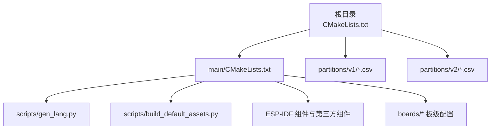
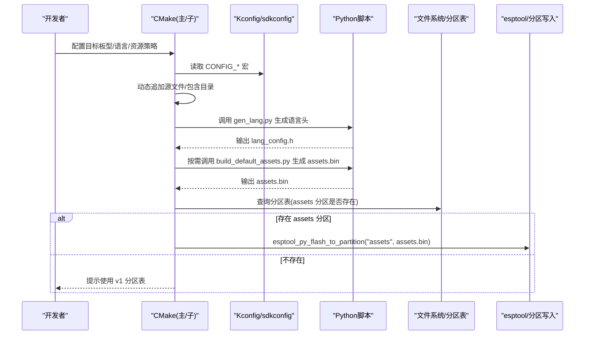
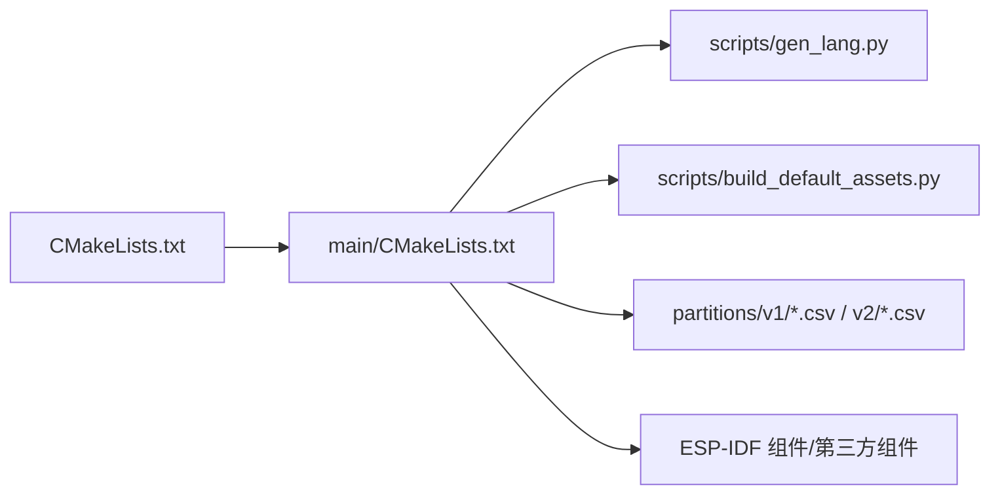

# CMake构建配置错误

<cite>
**本文引用的文件**   
- [CMakeLists.txt](file://CMakeLists.txt)
- [main/CMakeLists.txt](file://main/CMakeLists.txt)
- [partitions/v1/32m.csv](file://partitions/v1/32m.csv)
- [partitions/v2/32m.csv](file://partitions/v2/32m.csv)
- [scripts/gen_lang.py](file://scripts/gen_lang.py)
- [scripts/build_default_assets.py](file://scripts/build_default_assets.py)
- [docs/custom-board.md](file://docs/custom-board.md)
</cite>

## 目录
1. [简介](#简介)
2. [项目结构](#项目结构)
3. [核心组件](#核心组件)
4. [架构总览](#架构总览)
5. [详细组件分析](#详细组件分析)
6. [依赖关系分析](#依赖关系分析)
7. [性能与体积考量](#性能与体积考量)
8. [故障排查指南](#故障排查指南)
9. [结论](#结论)
10. [附录](#附录)

## 简介
本指南聚焦于基于 ESP-IDF 的 CMake 构建配置问题诊断与修复，覆盖以下关键领域：
- 项目定义、源文件路径、编译选项等常见错误
- 动态组件发现与条件编译（Kconfig）导致的构建差异
- Flash 分区表选择与冲突、资源打包失败
- 自定义构建规则（语言头生成、默认资源打包）与链接脚本相关问题的定位方法
- 面向开发者的系统化排错流程与最佳实践

## 项目结构
本项目采用 ESP-IDF 工程组织方式，顶层 CMakeLists 初始化并引入 IDF 工具链，应用逻辑位于 main 子目录，通过 Kconfig 和 CMake 组合实现多板型、多语言、多资源的条件构建。资源打包与语言头生成由 Python 脚本在构建期执行。

图示来源
- [CMakeLists.txt:1-14](file://CMakeLists.txt#L1-L14)
- [main/CMakeLists.txt:1046-1071](file://main/CMakeLists.txt#L1046-L1071)
- [main/CMakeLists.txt:1083-1098](file://main/CMakeLists.txt#L1083-L1098)
- [main/CMakeLists.txt:1178-1227](file://main/CMakeLists.txt#L1178-L1227)
- [partitions/v1/32m.csv:1-11](file://partitions/v1/32m.csv#L1-L11)
- [partitions/v2/32m.csv:1-10](file://partitions/v2/32m.csv#L1-L10)

章节来源
- [CMakeLists.txt:1-14](file://CMakeLists.txt#L1-L14)
- [main/CMakeLists.txt:1-40](file://main/CMakeLists.txt#L1-L40)

## 核心组件
- 顶层 CMake 入口：设置最低版本、关闭特定警告、包含 IDF project.cmake、启用最小化构建、声明项目名与版本。
- main/CMakeLists：集中管理源文件集合、包含目录、按 Kconfig 动态添加源文件、注册组件、嵌入音频资源、生成语言头、构建默认资源包、根据分区表决定是否烧录资源。
- 分区表 v1/v2：v1 使用 model/spiffs 分区；v2 新增 assets 分区，用于存放语音模型、字体、表情等资源。
- 构建期脚本：gen_lang.py 生成语言头与音效常量；build_default_assets.py 根据 sdkconfig 组装默认资源包。

章节来源
- [CMakeLists.txt:1-14](file://CMakeLists.txt#L1-L14)
- [main/CMakeLists.txt:1046-1071](file://main/CMakeLists.txt#L1046-L1071)
- [main/CMakeLists.txt:1083-1098](file://main/CMakeLists.txt#L1083-L1098)
- [main/CMakeLists.txt:1178-1227](file://main/CMakeLists.txt#L1178-L1227)
- [partitions/v1/32m.csv:1-11](file://partitions/v1/32m.csv#L1-L11)
- [partitions/v2/32m.csv:1-10](file://partitions/v2/32m.csv#L1-L10)

## 架构总览
下图展示了从 CMake 配置到资源打包与分区烧录的关键流程，以及条件编译对构建产物的影响。

图示来源
- [main/CMakeLists.txt:1046-1071](file://main/CMakeLists.txt#L1046-L1071)
- [main/CMakeLists.txt:1083-1098](file://main/CMakeLists.txt#L1083-L1098)
- [main/CMakeLists.txt:1178-1227](file://main/CMakeLists.txt#L1178-L1227)
- [main/CMakeLists.txt:1286-1317](file://main/CMakeLists.txt#L1286-L1317)
- [partitions/v2/32m.csv:1-10](file://partitions/v2/32m.csv#L1-L10)

## 详细组件分析

### 项目定义与编译选项
- 最低版本要求与项目声明：确保 CMake 版本满足要求，避免“未知命令”或“不支持特性”的错误。
- 全局编译选项：关闭某类告警以避免无关噪音，但需评估潜在风险。
- 最小化构建：开启后仅包含 main 及其依赖，有助于缩短构建时间，但可能隐藏未显式声明的依赖。

常见问题与修复
- 现象：构建时报“未知命令”或“project() 不被识别”。
  - 原因：CMake 版本过低或未正确包含 IDF 的 project.cmake。
  - 处理：升级 CMake 并确保 include(project.cmake) 顺序正确。
- 现象：构建缓慢且产物过大。
  - 原因：未启用最小化构建或误删了该开关。
  - 处理：确认 idf_build_set_property(MINIMAL_BUILD ON) 未被覆盖。

章节来源
- [CMakeLists.txt:1-14](file://CMakeLists.txt#L1-L14)

### 源文件路径与包含目录
- 源文件清单：SOURCES 列表必须与实际文件一致，路径区分大小写。
- 包含目录：INCLUDE_DIRS 需要指向所有需要的头文件目录。
- 动态追加：根据 Kconfig 或目标芯片追加/移除源文件，避免不兼容平台编译失败。

常见问题与修复
- 现象：找不到头文件或符号未定义。
  - 原因：缺少 INCLUDE_DIRS 或 SRCS 中遗漏文件。
  - 处理：核对路径与大小写，必要时用 file(GLOB ...) 收集，但要谨慎维护。
- 现象：某些平台下编译失败。
  - 原因：未针对目标芯片做条件剔除/添加。
  - 处理：检查 CONFIG_IDF_TARGET_* 分支，确保 ESP32/ESP32S3/ESP32P4 等差异被正确处理。

章节来源
- [main/CMakeLists.txt:1-40](file://main/CMakeLists.txt#L1-L40)
- [main/CMakeLists.txt:42-67](file://main/CMakeLists.txt#L42-L67)
- [main/CMakeLists.txt:1008-1032](file://main/CMakeLists.txt#L1008-L1032)

### 条件编译与动态组件发现
- Kconfig 驱动：CONFIG_BOARD_TYPE_*、CONFIG_LANGUAGE_*、CONFIG_USE_* 等宏控制源文件与功能开关。
- 动态组件查找：通过遍历已构建组件列表匹配模式，获取 esp-sr、字体、表情资源等路径。
- 语言与音效回退：非 en-US 时自动合并 en-US 的字符串与缺失音效。

常见问题与修复
- 现象：选择了错误的板型导致 UI/音频异常。
  - 原因：Kconfig 未正确设置或 CMake 分支未覆盖新板型。
  - 处理：核对 CONFIG_BOARD_TYPE_* 与对应 BOARD_TYPE 映射。
- 现象：找不到字体/表情资源。
  - 原因：组件未安装或路径解析失败。
  - 处理：确认 managed_components 中存在对应组件，或提供 XIAOZHI_FONTS_PATH/EMOTE_EXTERNAL_PATH。

章节来源
- [main/CMakeLists.txt:89-867](file://main/CMakeLists.txt#L89-L867)
- [main/CMakeLists.txt:1100-1110](file://main/CMakeLists.txt#L1100-L1110)
- [main/CMakeLists.txt:978-1004](file://main/CMakeLists.txt#L978-L1004)

### 资源打包与语言头生成
- 语言头生成：gen_lang.py 读取 language.json，生成 C++ 头文件，同时注入嵌入式 OGG 音效常量。
- 默认资源打包：build_default_assets.py 根据 sdkconfig 决定内置语音模型、字体、表情、额外文件，最终产出 assets.bin。
- 资源嵌入：idf_component_register 的 EMBED_FILES 将当前语言的 ogg 文件直接嵌入二进制。

常见问题与修复
- 现象：语言切换无效或缺字。
  - 原因：language.json 结构错误或未触发重新生成。
  - 处理：检查 JSON 结构与依赖声明，清理构建目录后重试。
- 现象：assets.bin 体积超限或运行时加载失败。
  - 原因：选择的模型/表情过多或名称长度超出限制。
  - 处理：精简资源，调整 name_length，确认 index.json/config.json 一致性。

章节来源
- [main/CMakeLists.txt:1083-1098](file://main/CMakeLists.txt#L1083-L1098)
- [main/CMakeLists.txt:1178-1227](file://main/CMakeLists.txt#L1178-L1227)
- [scripts/gen_lang.py:1-187](file://scripts/gen_lang.py#L1-L187)
- [scripts/build_default_assets.py:1-800](file://scripts/build_default_assets.py#L1-L800)

### 分区表与 Flash 烧录
- v1 分区表：使用 model/spiffs 分区承载资源。
- v2 分区表：新增 assets 分区，便于独立管理资源。
- 构建期决策：若检测到 assets 分区，则根据配置选择“默认资源/自定义资源/表达式资源/不烧录”，并调用 esptool_py_flash_to_partition 写入。

常见问题与修复
- 现象：提示“未找到 assets 分区，使用 v1 分区表”。
  - 原因：当前使用的分区表为 v1 或未配置 v2。
  - 处理：切换到 v2 分区表并在 sdkconfig 中指定 partitions/v2/<size>.csv。
- 现象：资源烧录失败或运行时报分区越界。
  - 原因：分区大小不足或偏移冲突。
  - 处理：核对分区表 size/offset，确保与固件+资源总大小匹配。

章节来源
- [main/CMakeLists.txt:1286-1317](file://main/CMakeLists.txt#L1286-L1317)
- [partitions/v1/32m.csv:1-11](file://partitions/v1/32m.csv#L1-L11)
- [partitions/v2/32m.csv:1-10](file://partitions/v2/32m.csv#L1-L10)
- [docs/custom-board.md:90-107](file://docs/custom-board.md#L90-L107)

### 自定义构建规则与链接脚本
- 自定义命令：add_custom_command/add_custom_target 用于生成语言头与默认资源。
- 依赖声明：DEPENDS 确保输入变更触发重建。
- 链接阶段：通过 WHOLE_ARCHIVE 与 PRIV_REQUIRES 控制库与组件链接行为。

常见问题与修复
- 现象：修改语言/资源后未触发重建。
  - 原因：未正确声明 DEPENDS 或未加入 ALL target。
  - 处理：完善依赖链，确保 ALL target 可被上层依赖。
- 现象：链接阶段出现重复符号或未定义引用。
  - 原因：组件依赖不完整或库归档策略不当。
  - 处理：核对 PRIV_REQUIRES 与 WHOLE_ARCHIVE 的使用范围。

章节来源
- [main/CMakeLists.txt:1046-1071](file://main/CMakeLists.txt#L1046-L1071)
- [main/CMakeLists.txt:1083-1098](file://main/CMakeLists.txt#L1083-L1098)
- [main/CMakeLists.txt:1178-1227](file://main/CMakeLists.txt#L1178-L1227)

## 依赖关系分析
- 顶层 CMake 负责环境准备与最小化构建策略。
- main/CMakeLists 是构建核心，聚合源文件、组件依赖、资源打包与分区烧录。
- 脚本层解耦资源处理逻辑，提高可维护性与可测试性。
- 分区表决定资源存储位置与容量边界，直接影响构建期是否进行资源烧录。

图示来源
- [CMakeLists.txt:1-14](file://CMakeLists.txt#L1-L14)
- [main/CMakeLists.txt:1046-1071](file://main/CMakeLists.txt#L1046-L1071)
- [main/CMakeLists.txt:1083-1098](file://main/CMakeLists.txt#L1083-L1098)
- [main/CMakeLists.txt:1178-1227](file://main/CMakeLists.txt#L1178-L1227)
- [partitions/v1/32m.csv:1-11](file://partitions/v1/32m.csv#L1-L11)
- [partitions/v2/32m.csv:1-10](file://partitions/v2/32m.csv#L1-L10)

章节来源
- [CMakeLists.txt:1-14](file://CMakeLists.txt#L1-L14)
- [main/CMakeLists.txt:1046-1071](file://main/CMakeLists.txt#L1046-L1071)

## 性能与体积考量
- 最小化构建：减少不必要的组件参与，缩短构建时间。
- 资源裁剪：合理选择语音模型、字体与表情集合，避免 assets.bin 过大。
- 语言回退：仅在缺失时使用 en-US 资源，降低冗余。
- 下载缓存：构建脚本会检测本地文件，避免重复下载。

[本节为通用建议，无需源码引用]

## 故障排查指南

### 一、项目定义与编译选项错误
- 症状
  - 报错“未知命令”、“project() 不被识别”
  - 构建缓慢、产物体积异常
- 排查步骤
  - 确认 CMake 版本满足最低要求
  - 确认 include(project.cmake) 顺序与位置
  - 确认 MINIMAL_BUILD 未被覆盖
- 参考定位
  - [CMakeLists.txt:1-14](file://CMakeLists.txt#L1-L14)

章节来源
- [CMakeLists.txt:1-14](file://CMakeLists.txt#L1-L14)

### 二、源文件路径与包含目录错误
- 症状
  - “找不到头文件”、“符号未定义”
  - 特定平台编译失败
- 排查步骤
  - 核对 SOURCES 与 INCLUDE_DIRS 中的路径与大小写
  - 检查 CONFIG_IDF_TARGET_* 分支是否正确添加/剔除文件
- 参考定位
  - [main/CMakeLists.txt:1-40](file://main/CMakeLists.txt#L1-L40)
  - [main/CMakeLists.txt:42-67](file://main/CMakeLists.txt#L42-L67)
  - [main/CMakeLists.txt:1008-1032](file://main/CMakeLists.txt#L1008-L1032)

章节来源
- [main/CMakeLists.txt:1-40](file://main/CMakeLists.txt#L1-L40)
- [main/CMakeLists.txt:42-67](file://main/CMakeLists.txt#L42-L67)
- [main/CMakeLists.txt:1008-1032](file://main/CMakeLists.txt#L1008-L1032)

### 三、条件编译与动态组件发现
- 症状
  - 板型选择错误导致 UI/音频异常
  - 找不到字体/表情资源
- 排查步骤
  - 核对 CONFIG_BOARD_TYPE_* 与 BOARD_TYPE 映射
  - 检查组件是否在 managed_components 中可用
  - 查看构建日志中的 WARNING/STATUS 信息
- 参考定位
  - [main/CMakeLists.txt:89-867](file://main/CMakeLists.txt#L89-L867)
  - [main/CMakeLists.txt:1100-1110](file://main/CMakeLists.txt#L1100-L1110)
  - [main/CMakeLists.txt:1135](file://main/CMakeLists.txt#L1135)

章节来源
- [main/CMakeLists.txt:89-867](file://main/CMakeLists.txt#L89-L867)
- [main/CMakeLists.txt:1100-1110](file://main/CMakeLists.txt#L1100-L1110)
- [main/CMakeLists.txt:1135](file://main/CMakeLists.txt#L1135)

### 四、资源打包失败与语言头生成问题
- 症状
  - 语言切换无效、缺字
  - assets.bin 体积超限或运行时加载失败
- 排查步骤
  - 验证 language.json 结构
  - 清理构建目录后重新生成
  - 检查 build_default_assets.py 的参数与输出路径
- 参考定位
  - [main/CMakeLists.txt:1083-1098](file://main/CMakeLists.txt#L1083-L1098)
  - [main/CMakeLists.txt:1178-1227](file://main/CMakeLists.txt#L1178-L1227)
  - [scripts/gen_lang.py:1-187](file://scripts/gen_lang.py#L1-L187)
  - [scripts/build_default_assets.py:1-800](file://scripts/build_default_assets.py#L1-L800)

章节来源
- [main/CMakeLists.txt:1083-1098](file://main/CMakeLists.txt#L1083-L1098)
- [main/CMakeLists.txt:1178-1227](file://main/CMakeLists.txt#L1178-L1227)
- [scripts/gen_lang.py:1-187](file://scripts/gen_lang.py#L1-L187)
- [scripts/build_default_assets.py:1-800](file://scripts/build_default_assets.py#L1-L800)

### 五、Flash 分区表配置错误与资源冲突
- 症状
  - 提示“未找到 assets 分区，使用 v1 分区表”
  - 资源烧录失败或运行时报分区越界
- 排查步骤
  - 确认使用的分区表版本（v1/v2）
  - 核对 size/offset 与固件+资源总大小
  - 在 sdkconfig 中指定正确的 partitions/v2/<size>.csv
- 参考定位
  - [main/CMakeLists.txt:1286-1317](file://main/CMakeLists.txt#L1286-L1317)
  - [partitions/v1/32m.csv:1-11](file://partitions/v1/32m.csv#L1-L11)
  - [partitions/v2/32m.csv:1-10](file://partitions/v2/32m.csv#L1-L10)
  - [docs/custom-board.md:90-107](file://docs/custom-board.md#L90-L107)

章节来源
- [main/CMakeLists.txt:1286-1317](file://main/CMakeLists.txt#L1286-L1317)
- [partitions/v1/32m.csv:1-11](file://partitions/v1/32m.csv#L1-L11)
- [partitions/v2/32m.csv:1-10](file://partitions/v2/32m.csv#L1-L10)
- [docs/custom-board.md:90-107](file://docs/custom-board.md#L90-L107)

### 六、自定义构建规则与链接脚本调试
- 症状
  - 修改资源/语言后未触发重建
  - 链接阶段重复符号或未定义引用
- 排查步骤
  - 检查 add_custom_command 的 OUTPUT/DEPENDS 与 add_custom_target(ALL)
  - 核对 PRIV_REQUIRES 与 WHOLE_ARCHIVE 的使用范围
- 参考定位
  - [main/CMakeLists.txt:1046-1071](file://main/CMakeLists.txt#L1046-L1071)
  - [main/CMakeLists.txt:1083-1098](file://main/CMakeLists.txt#L1083-L1098)
  - [main/CMakeLists.txt:1178-1227](file://main/CMakeLists.txt#L1178-L1227)

章节来源
- [main/CMakeLists.txt:1046-1071](file://main/CMakeLists.txt#L1046-L1071)
- [main/CMakeLists.txt:1083-1098](file://main/CMakeLists.txt#L1083-L1098)
- [main/CMakeLists.txt:1178-1227](file://main/CMakeLists.txt#L1178-L1227)

## 结论
通过系统化的 CMake 配置审查、条件编译校验、资源打包链路追踪与分区表一致性检查，可以快速定位并修复常见的构建与部署问题。建议在团队内建立“构建前自检清单”，结合 CI 的多板型矩阵构建，尽早暴露配置漂移与资源不一致问题。

[本节为总结性内容，无需源码引用]

## 附录

### 快速自检清单
- 确认 CMake 版本与 IDF 工具链匹配
- 确认 MINIMAL_BUILD 未被覆盖
- 核对 CONFIG_BOARD_TYPE_* 与 BOARD_TYPE 映射
- 检查 fonts/emojis/srmodels 路径是否可达
- 确认使用 v2 分区表时存在 assets 分区
- 清理构建目录后重试，观察 STATUS/WARNING/FATAL_ERROR 输出

[本节为通用建议，无需源码引用]